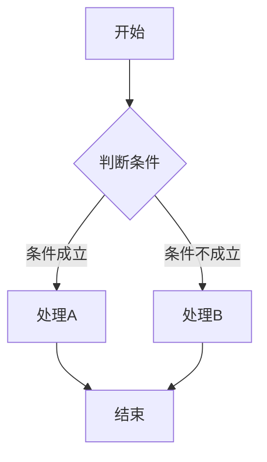
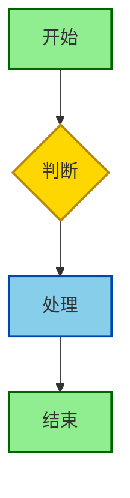

# 内容风格指南

> 本指南定义 C_Lang 知识库的文档编写规范，确保内容的一致性、可读性和可维护性。

---

## 📋 目录

- [内容风格指南](#内容风格指南)
  - [📋 目录](#-目录)
  - [文档结构规范](#文档结构规范)
    - [文件头部](#文件头部)
    - [元信息格式](#元信息格式)
    - [目录结构](#目录结构)
    - [章节组织](#章节组织)
      - [一级结构](#一级结构)
      - [章节层级建议](#章节层级建议)
      - [章节分隔](#章节分隔)
    - [文件尾部](#文件尾部)
  - [写作风格指南](#写作风格指南)
    - [语言风格](#语言风格)
      - [原则](#原则)
      - [示例对比](#示例对比)
    - [人称使用](#人称使用)
    - [句子结构](#句子结构)
      - [长度控制](#长度控制)
      - [标点使用](#标点使用)
    - [段落组织](#段落组织)
      - [段落长度](#段落长度)
      - [信息层次](#信息层次)
      - [支持的语言标识](#支持的语言标识)
    - [注释规范](#注释规范)
      - [注释风格](#注释风格)
      - [注释内容](#注释内容)
      - [函数注释模板](#函数注释模板)
    - [命名约定](#命名约定)
      - [变量命名](#变量命名)
    - [代码可运行性](#代码可运行性)
      - [完整示例要求](#完整示例要求)
      - [代码片段标记](#代码片段标记)
    - [标准版本标注](#标准版本标注)
      - [标注格式](#标注格式)
      - [兼容性说明](#兼容性说明)
  - [图表规范](#图表规范)
    - [ASCII 图表](#ascii-图表)
      - [使用场景](#使用场景)
      - [格式要求](#格式要求)
    - [表格规范](#表格规范)
      - [基本格式](#基本格式)
      - [对齐规则](#对齐规则)
      - [复杂表格](#复杂表格)
  - [术语使用规范](#术语使用规范)
    - [术语定义](#术语定义)
      - [首次使用](#首次使用)
      - [术语表引用](#术语表引用)
    - [中英文混排](#中英文混排)
      - [空格规则](#空格规则)
      - [代码中的英文](#代码中的英文)
    - [缩写使用](#缩写使用)
      - [常用缩写表](#常用缩写表)
      - [缩写使用规则](#缩写使用规则)
  - [引用和链接规范](#引用和链接规范)
    - [内部链接](#内部链接)
      - [相对路径](#相对路径)
      - [锚点链接](#锚点链接)
    - [外部链接](#外部链接)
      - [格式要求](#格式要求-1)
      - [权威来源优先级](#权威来源优先级)
    - [文献引用](#文献引用)
      - [引用格式](#引用格式)
      - [参考文献列表](#参考文献列表)
  - [附录：Markdown 格式参考](#附录markdown-格式参考)
    - [常用语法速查](#常用语法速查)
    - [特殊标记](#特殊标记)

---

## 文档结构规范

### 文件头部

每个 Markdown 文件必须以一级标题开头：

```markdown
# 文档标题

> **元信息**: 难度 | 标准 | 更新日期
```

### 元信息格式

标准元信息格式如下：

```markdown
> **难度**: ⭐⭐⭐ (1-5星)
> **适用标准**: C99/C11/C17/C23
> **最后更新**: YYYY-MM-DD
> **前置知识**: [相关文档链接]
```

### 目录结构

在元信息之后、正文之前，必须包含自动生成的目录：

```markdown
---

## 目录

- [文档标题](#文档标题)
  - [第一节](#第一节)
  - [第二节](#第二节)
    - [2.1 子节](#21-子节)
  - [第三节](#第三节)

---
```

**要求**:

- 目录使用四级缩进
- 链接到各章节标题
- 目录前后使用 `---` 分隔线

### 章节组织

#### 一级结构

```markdown
# 主标题

> 元信息

---

## 目录

---

## 第一节

### 1.1 子节

#### 1.1.1 更小子节

## 第二节

---

> **参考**: [相关链接]
```

#### 章节层级建议

| 层级 | 使用场景 | 最大深度 |
|-----|---------|---------|
| `#` | 文件主标题 | 每文件1个 |
| `##` | 主要章节 | 建议不超过8个 |
| `###` | 子章节 | 按需使用 |
| `####` | 细节内容 | 建议不超过3级 |

#### 章节分隔

主要章节之间使用分隔线：

```markdown
## 章节一

内容...

---

## 章节二

内容...
```

### 文件尾部

文件末尾应包含参考资料和导航链接：

```markdown
---

## 参考

- [内部链接](./other-doc.md)
- [外部资源](https://example.com)

---

> **上一节**: [上一章标题](./previous.md)
> **下一节**: [下一章标题](./next.md)
> **返回目录**: [目录](../README.md)
```

---

## 写作风格指南

### 语言风格

#### 原则

1. **简洁明了**: 避免冗长，直接表达核心概念
2. **准确专业**: 使用准确的技术术语
3. **循序渐进**: 从基础到复杂逐步展开
4. **实例驱动**: 概念配合具体示例

#### 示例对比

❌ **不推荐**:
> C语言中的指针是一个非常重要的概念，它在编程中具有广泛的应用，理解指针对掌握C语言至关重要...

✅ **推荐**:
> **指针**是存储内存地址的变量。通过指针，程序可以直接操作内存：
>
> ```c
> int x = 10;
> int *p = &x;  // p 存储 x 的地址
> *p = 20;      // 通过 p 修改 x 的值
> ```

### 人称使用

| 场景 | 推荐 | 示例 |
|-----|------|------|
| 讲解概念 | 第三人称/无主语 | "函数返回指针时..." |
| 操作步骤 | 第二人称 | "你需要先编译..." |
| 最佳实践 | 第一人称复数 | "我们建议..." |
| 警告提示 | 直接陈述 | "注意: 此操作会导致..." |

### 句子结构

#### 长度控制

- 技术解释: 15-25字为宜
- 操作说明: 10-15字为宜
- 重要警告: 简短有力，不超过20字

#### 标点使用

- 中文内容使用中文标点
- 英文术语后保留英文标点
- 代码中使用英文标点

```markdown
✅ 正确使用:
调用 `malloc()` 函数分配内存，使用 `free()` 释放。

❌ 错误使用:
调用 malloc() 函数分配内存，使用 free（）释放。
```

### 段落组织

#### 段落长度

- 标准段落: 3-5句
- 说明段落: 1-3句
- 代码前导段落: 1-2句

#### 信息层次

使用视觉元素区分信息层次：

```markdown
> **定义**: 这里是核心概念的定义

这里是详细解释...

```c
// 这里是示例代码
```

> **注意**: 这里是重要提示

> **警告**: 这里是严重警告

```

---

## 代码示例规范

### 代码块格式

#### 围栏标记

使用三个反引号加语言标识：

```markdown
    ```c
    int main(void) {
        return 0;
    }
    ```
```

#### 支持的语言标识

| 语言 | 标识 | 使用场景 |
|-----|------|---------|
| C | `c` | C代码 |
| C++ | `cpp` | C++对比代码 |
| Zig | `zig` | Zig代码 |
| Bash | `bash` | Shell命令 |
| Python | `python` | Python脚本 |
| Assembly | `asm` | 汇编代码 |
| Makefile | `makefile` | Makefile |
| JSON | `json` | 配置文件 |
| YAML | `yaml` | CI配置 |
| Text | `text` | 纯文本输出 |

### 注释规范

#### 注释风格

```c
// 单行注释：用于简短说明

/*
 * 多行注释：用于详细说明
 * 每行以 * 开头对齐
 */

/* 行内注释：紧跟代码 */
int x = 10; /* 初始化计数器 */
```

#### 注释内容

```c
// ✅ 好的注释：说明"为什么"
// 使用位移代替乘法，提高性能
int result = value << 3;  // ×8

// ❌ 差的注释：重复"是什么"
// 将value左移3位
int result = value << 3;
```

#### 函数注释模板

```c
/*
 * 函数名: function_name
 * 参数:
 *   - param1: 参数1说明
 *   - param2: 参数2说明
 * 返回: 返回值说明
 * 说明: 函数功能详细描述
 */
return_type function_name(type param1, type param2);
```

### 命名约定

#### 变量命名

| 类型 | 风格 | 示例 |
|-----|------|------|
| 局部变量 | 小写+下划线 | `student_count` |
| 全局变量 | g_前缀 | `g_config` |
| 常量 | 全大写 | `MAX_BUFFER_SIZE` |
| 宏定义 | 全大写 | `DEBUG_MODE` |
| 结构体 | 小写+_t后缀 | `student_t` |
| 枚举 | 大写+下划线 | `StatusCode` |
| 函数 | 小写+下划线 | `calculate_sum` |
| 指针 | p_前缀或_p后缀 | `p_data` / `data_p` |

### 代码可运行性

#### 完整示例要求

```c
// ✅ 好的示例：完整可编译
#include <stdio.h>
#include <stdlib.h>

int main(void) {
    int *arr = malloc(10 * sizeof(int));
    if (arr == NULL) {
        fprintf(stderr, "内存分配失败\n");
        return 1;
    }

    // 使用数组
    for (int i = 0; i < 10; i++) {
        arr[i] = i;
    }

    free(arr);
    return 0;
}
```

#### 代码片段标记

如果示例不是完整程序，需明确标注：

```markdown
// 片段：假设已包含必要头文件
// 片段：仅为示意，不可直接编译
```

### 标准版本标注

#### 标注格式

```c
// C89/C90
void func();  /* 传统K&R风格 */

// C99
for (int i = 0; i < n; i++) {  /* C99: 变量在for中声明 */

// C11
_Thread_local int counter;  /* C11: 线程本地存储 */

// C17
// 主要修复C11缺陷，无新特性

// C23
constexpr int SIZE = 100;  /* C23: 编译时常量 */
nullptr_t p = nullptr;      /* C23: 空指针常量 */
```

#### 兼容性说明

```markdown
| 特性 | C99 | C11 | C17 | C23 | 说明 |
|-----|:---:|:---:|:---:|:---:|------|
| 变长数组 | ✅ | ⚠️ | ⚠️ | ❌ | C11起可选 |
| `_Generic` | ❌ | ✅ | ✅ | ✅ | 类型泛型 |
| `constexpr` | ❌ | ❌ | ❌ | ✅ | 编译时常量 |
```

---

## 图表规范

### ASCII 图表

#### 使用场景

- 简单的内存布局
- 位域表示
- 小型流程示意

#### 格式要求

```markdown
内存布局示例:
```

高地址
┌─────────────────┐
│     栈区        │  ↑ 增长
├─────────────────┤
│     空闲        │
├─────────────────┤
│     堆区        │  ↓ 增长
├─────────────────┤
│   数据段        │
├─────────────────┤
│   代码段        │
└─────────────────┘
低地址

```

#### 字符规范

| 元素 | 字符 |
|-----|------|
| 角 | `┌` `┐` `└` `┘` |
| 边 | `─` `│` |
| 交叉 | `┼` `├` `┤` `┬` `┴` |
| 箭头 | `↑` `↓` `←` `→` |

### Mermaid 图表

#### 支持的图表类型

| 类型 | 用途 | 示例 |
|-----|------|------|
| flowchart | 流程图 | 算法流程 |
| sequenceDiagram | 时序图 | 函数调用 |
| classDiagram | 类图 | 类型关系 |
| graph | 关系图 | 知识图谱 |
| gantt | 甘特图 | 项目计划 |

#### 流程图示例

```markdown


```

#### 样式规范



### 表格规范

#### 基本格式

```markdown
| 列1 | 列2 | 列3 |
|-----|:---:|----:|
| 左对齐 | 居中 | 右对齐 |
| a | b | 100 |
```

#### 对齐规则

| 内容类型 | 对齐方式 | 示例 |
|---------|---------|------|
| 文本描述 | 左对齐 | 特性说明 |
| 状态标记 | 居中 | ✅ ❌ |
| 数值数据 | 右对齐 | 1000 |
| 代码片段 | 左对齐 | `code` |

#### 复杂表格

```markdown
| 特性 | C99 | C11 | C17 | C23 | 备注 |
|-----|:---:|:---:|:---:|:---:|------|
| 变长数组(VLA) | ✅ | ⚠️ | ⚠️ | ❌ | C11起为可选 |
| 复数类型 | ✅ | ✅ | ✅ | ✅ | `<complex.h>` |
| 线程支持 | ❌ | ✅ | ✅ | ✅ | `<threads.h>` |
| `constexpr` | ❌ | ❌ | ❌ | ✅ | 编译时常量 |

**图例**: ✅ 支持 | ⚠️ 部分/可选 | ❌ 不支持
```

---

## 术语使用规范

### 术语定义

#### 首次使用

首次出现时，提供英文原文和中文解释：

```markdown
**抽象语法树** (Abstract Syntax Tree, AST) 是源代码结构的树形表示...
```

#### 术语表引用

在文末提供术语表链接：

```markdown
> **术语**: [AST](../glossary.md#ast)
```

### 中英文混排

#### 空格规则

```markdown
✅ 正确:
使用 malloc 函数分配内存
C11 标准引入了 _Generic 关键字

❌ 错误:
使用malloc函数分配内存
C11标准引入了_Generic关键字
```

#### 代码中的英文

代码中的英文术语不翻译：

```markdown
✅ 正确:
`malloc` 函数用于动态内存分配

❌ 错误:
`malloc` (内存分配)函数用于动态内存分配
```

### 缩写使用

#### 常用缩写表

| 缩写 | 全称 | 中文 |
|-----|------|------|
| UB | Undefined Behavior | 未定义行为 |
| IB | Implementation-defined Behavior | 实现定义行为 |
| AST | Abstract Syntax Tree | 抽象语法树 |
| IR | Intermediate Representation | 中间表示 |
| SSA | Static Single Assignment | 静态单赋值 |

#### 缩写使用规则

1. 首次出现使用全称+缩写
2. 后续使用缩写
3. 文档开头提供缩写表（如缩写较多）

---

## 引用和链接规范

### 内部链接

#### 相对路径

使用相对路径引用其他文档：

```markdown
<!-- 同一目录 -->
[相关主题](./related-topic.md)

<!-- 上级目录 -->
[返回目录](../README.md)

<!-- 跨目录 -->
[形式语义](../../02_Formal_Semantics/semantics.md)
```

#### 锚点链接

链接到文档内的特定章节：

```markdown
[跳转到示例](#代码示例规范)

<!-- 目标位置 -->
## 代码示例规范 {#code-example}
```

### 外部链接

#### 格式要求

```markdown
<!-- 基础格式 -->
[链接文本](URL)

<!-- 带标题 -->
[链接文本](URL "悬停提示")

<!-- 引用式 -->
[链接文本][id]

[id]: URL "标题"
```

#### 权威来源优先级

1. ISO/IEC 官方文档
2. 编译器官方文档 (GCC, Clang, MSVC)
3. 权威书籍官方网站
4. 知名技术博客/论文
5. Stack Overflow (仅作参考)

### 文献引用

#### 引用格式

```markdown
根据 ISO/IEC 9899:2018 (C17标准) 的规定...

> **参考**: ISO/IEC 9899:2018, §6.7.2 Type specifiers
```

#### 参考文献列表

```markdown
## 参考文献

1. **ISO/IEC 9899:2018** - Programming languages — C
2. **Kernighan & Ritchie** - The C Programming Language, 2nd Edition
3. **CompCert Documentation** - https://compcert.org/man/
```

---

## 附录：Markdown 格式参考

### 常用语法速查

| 元素 | 语法 | 示例 |
|-----|------|------|
| 标题 | `# H1` `## H2` | # 标题 |
| 强调 | `*斜体*` `**粗体**` | *斜体* **粗体** |
| 代码行 | `` `code` `` | `code` |
| 代码块 | ` ```c ` | 见上 |
| 链接 | `[text](url)` | [链接](#) |
| 图片 | `` | - |
| 引用 | `> text` | > 引用 |
| 列表 | `- item` `1. item` | - 项目 |
| 分隔线 | `---` | --- |
| 表格 | `\|a\|b\|` | 见上 |
| 任务列表 | `- [x] task` | - [x] 完成 |

### 特殊标记

```markdown
<!-- 折叠内容 -->
<details>
<summary>点击展开</summary>

隐藏的内容

</details>

<!-- 注释（不渲染） -->
[//]: # (这是注释)

<!-- HTML（谨慎使用） -->
<center>居中内容</center>
```

---

> **维护**: C_Lang 文档团队
> **更新**: 2026-03-19
> **版本**: 1.0
