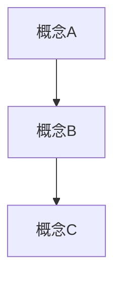

# 贡献指南

> **感谢您对 C_Lang 知识库的兴趣！**
> 本指南将帮助您参与项目贡献。

---

## 📋 目录

- [贡献指南](#贡献指南)
  - [📋 目录](#-目录)
  - [行为准则](#行为准则)
    - [我们的承诺](#我们的承诺)
    - [不可接受的行为](#不可接受的行为)
  - [如何贡献](#如何贡献)
    - [方式一: 提交 Issue](#方式一-提交-issue)
    - [方式二: 提交 Pull Request](#方式二-提交-pull-request)
      - [准备工作](#准备工作)
      - [修改内容](#修改内容)
      - [创建 PR](#创建-pr)
  - [新领域贡献流程](#新领域贡献流程)
    - [阶段一：提案与规划 (Proposal)](#阶段一提案与规划-proposal)
    - [阶段二：内容开发 (Development)](#阶段二内容开发-development)
    - [阶段三：质量验证 (Validation)](#阶段三质量验证-validation)
    - [阶段四：发布与维护 (Publication)](#阶段四发布与维护-publication)
  - [大学课程内容对齐标准](#大学课程内容对齐标准)
    - [课程层次映射](#课程层次映射)
    - [内容对齐要求](#内容对齐要求)
    - [标准教材对标](#标准教材对标)
  - [思维表征工具规范](#思维表征工具规范)
    - [决策树规范](#决策树规范)
    - [知识图谱规范](#知识图谱规范)
    - [学习路径规范](#学习路径规范)
  - [翻译与国际化指南](#翻译与国际化指南)
    - [翻译贡献流程](#翻译贡献流程)
    - [多语言支持](#多语言支持)
    - [国际化文件组织](#国际化文件组织)
  - [质量检查清单](#质量检查清单)
    - [文档质量检查](#文档质量检查)
    - [技术准确性检查](#技术准确性检查)
    - [格式规范检查](#格式规范检查)
    - [链接与引用检查](#链接与引用检查)
    - [可访问性检查](#可访问性检查)
  - [PR模板要求](#pr模板要求)
  - [内容标准](#内容标准)
    - [文档规范](#文档规范)
      - [文件命名](#文件命名)
      - [文档结构](#文档结构)
      - [代码示例](#代码示例)
    - [内容质量](#内容质量)
      - [准确性](#准确性)
      - [完整性](#完整性)
      - [可读性](#可读性)
  - [提交规范](#提交规范)
    - [Commit Message 格式](#commit-message-格式)
      - [Type 类型](#type-类型)
      - [示例](#示例)
    - [PR 模板](#pr-模板)
  - [审核流程](#审核流程)
    - [审核标准](#审核标准)
    - [审核时间](#审核时间)
    - [合并条件](#合并条件)
  - [开发指南](#开发指南)
    - [本地开发](#本地开发)
    - [目录结构](#目录结构)
    - [添加新内容](#添加新内容)
    - [更新检查清单](#更新检查清单)
  - [常见问题](#常见问题)
    - [Q: 发现文档中有错误，但不确定如何修复？](#q-发现文档中有错误但不确定如何修复)
    - [Q: 想添加新主题，但不确定目录位置？](#q-想添加新主题但不确定目录位置)
    - [Q: 代码示例需要特定环境才能运行？](#q-代码示例需要特定环境才能运行)
    - [Q: 如何追踪文档的更新状态？](#q-如何追踪文档的更新状态)
    - [Q: 我想贡献一个新领域，应该从哪里开始？](#q-我想贡献一个新领域应该从哪里开始)
    - [Q: 如何参与翻译工作？](#q-如何参与翻译工作)
  - [联系方式](#联系方式)
  - [致谢](#致谢)
  - [相关文档](#相关文档)

---

## 行为准则

### 我们的承诺

- 友善、包容的社区环境
- 尊重不同的观点和经验
- 建设性的批评与反馈
- 关注社区最佳利益

### 不可接受的行为

- 歧视、骚扰或侮辱性言论
- 恶意破坏或攻击性行为
- 发布不当内容
- 侵犯他人隐私

---

## 如何贡献

### 方式一: 提交 Issue

发现错误或建议改进：

1. 点击 [New Issue](../../issues/new)
2. 选择模板:
   - 🐛 **Bug Report** - 报告错误
   - 💡 **Feature Request** - 功能建议
   - 📚 **Content Update** - 内容更新
   - 📦 **New Module Proposal** - 新模块提案
3. 详细描述问题或建议
4. 如有必要，提供截图或示例

### 方式二: 提交 Pull Request

#### 准备工作

```bash
# 1. Fork 本仓库
# 2. 克隆您的Fork
git clone https://github.com/YOUR_USERNAME/C_Lang.git
cd C_Lang

# 3. 添加上游仓库
git remote add upstream https://github.com/ORIGINAL_OWNER/C_Lang.git

# 4. 创建特性分支
git checkout -b feature/your-feature-name
```

#### 修改内容

```bash
# 进行修改...
# 编辑文件

# 运行维护工具检查
python scripts/maintenance_tool.py

# 提交更改
git add .
git commit -m "feat: 添加XXX内容"
git push origin feature/your-feature-name
```

#### 创建 PR

1. 访问您的Fork页面
2. 点击 "Compare & pull request"
3. 填写PR模板
4. 等待审核

---

## 新领域贡献流程

当您希望贡献一个全新的知识领域时，请遵循以下流程：

### 阶段一：提案与规划 (Proposal)

1. **提交新模块提案 Issue**
   - 使用 `.github/ISSUE_TEMPLATE/new_module_proposal.md` 模板
   - 描述新领域的范围和目标
   - 说明与现有知识体系的关系
   - 提供初步的目录结构建议

2. **社区讨论与评审**
   - 维护者将在 5-7 个工作日内回复
   - 讨论内容定位和边界
   - 确定技术深度和受众
   - 评审资源需求和可行性

3. **方案确定**
   - 确定最终目录结构
   - 分配 Issue 编号和里程碑
   - 创建项目看板跟踪进度

### 阶段二：内容开发 (Development)

1. **建立基础框架**

   ```
   knowledge/XX_New_Domain/
   ├── README.md              # 领域概述
   ├── 00_Metadata.md         # 元数据定义
   └── 01_Introduction/       # 入门章节
   ```

2. **遵循内容开发节奏**
   - **迭代一**: 核心概念 (必须完成)
   - **迭代二**: 进阶主题 (建议完成)
   - **迭代三**: 专家内容 (可选扩展)

3. **里程碑检查点**
   - 每完成一个迭代，提交 PR 进行中期评审
   - 及时更新项目看板状态
   - 记录开发过程中的决策

### 阶段三：质量验证 (Validation)

1. **自动化检查**

   ```bash
   python scripts/maintenance_tool.py
   python scripts/content_validator.py
   ```

2. **同行评审**
   - 至少 1 位领域专家技术评审
   - 至少 1 位文档专家可读性评审

3. **最终验收标准**
   - ✅ 代码示例全部可编译运行
   - ✅ 内部链接 100% 有效
   - ✅ 通过拼写和语法检查
   - ✅ 符合内容风格指南

### 阶段四：发布与维护 (Publication)

1. **正式发布**
   - 合并到主分支
   - 更新全局索引 `knowledge/00_INDEX.md`
   - 发布公告通知社区

2. **后续维护**
   - 建立内容更新周期
   - 收集用户反馈
   - 定期内容审查

---

## 大学课程内容对齐标准

为确保本知识库可作为大学课程的补充教材，贡献内容时请遵循以下对齐标准：

### 课程层次映射

| 知识层次 | 对应年级 | 代表课程 | 本知识库路径 |
|---------|---------|---------|-------------|
| 基础 | 大一 | 程序设计基础 | `01_Core_Knowledge_System/01_Basic_Layer/` |
| 核心 | 大二 | 数据结构、计算机系统 | `01_Core_Knowledge_System/02_Core_Layer/` |
| 进阶 | 大三 | 操作系统、编译原理 | `03_System_Technology_Domains/` |
| 专家 | 大四/研究生 | 高级专题、研究课程 | `02_Formal_Semantics_and_Physics/`, `05_Deep_Structure_MetaPhysics/` |

### 内容对齐要求

1. **概念定义**
   - 采用学术界通用术语
   - 提供数学符号表示（如适用）
   - 标注 ISO C 标准章节引用

2. **示例代码**
   - 适合课堂教学演示
   - 复杂度与课程层次匹配
   - 包含逐步讲解注释

3. **习题设计**
   - 基础层: 概念理解题
   - 核心层: 编程实践题
   - 高级层: 分析与设计题

4. **参考文献**
   - 优先引用经典教材
   - 注明 ACM/IEEE 论文
   - 提供延伸阅读建议

### 标准教材对标

贡献内容时请参考以下经典教材的对应章节：

- **K&R C** (The C Programming Language) - 基础语法对照
- **CSAPP** (Computer Systems: A Programmer's Perspective) - 系统层面
- **CompCert 文档** - 形式化语义
- **MISRA C 规范** - 安全编码实践

---

## 思维表征工具规范

本项目强调使用多种思维表征工具辅助学习，贡献者需遵循以下规范：

### 决策树规范

```markdown
# 决策树: [主题]

```

是否需要[条件A]?
├── 是 → 是否需要[条件B]?
│   ├── 是 → 选择[方案X]
│   └── 否 → 选择[方案Y]
└── 否 → 选择[方案Z]

```

**要求**:
- 使用 ASCII 艺术或 Mermaid 语法
- 每个决策节点提供明确的判断标准
- 叶节点提供具体建议或链接
- 复杂决策树提供简化版本
```

### 知识图谱规范

```markdown
# 知识图谱: [主题]

## 核心节点
- [概念A]: 定义说明
- [概念B]: 定义说明

## 关系映射


**要求**:

- 使用 Mermaid 语法
- 颜色编码不同类型节点
- 提供文本形式的备择表示

```

### 对比矩阵规范

```markdown
# 对比矩阵: [主题]

| 特性 | 方案A | 方案B | 方案C |
|-----|:-----:|:-----:|:-----:|
| 性能 | ⭐⭐⭐ | ⭐⭐ | ⭐⭐⭐⭐ |
| 复杂度 | 低 | 中 | 高 |
| 适用场景 | 嵌入式 | 通用 | 高性能 |

**要求**:
- 至少对比 3 个维度
- 使用一致的评分标准
- 提供选择建议总结
```

### 学习路径规范

```markdown
# 学习路径: [主题]

## 阶段一: 基础 (预计X小时)
- [ ] 任务1
- [ ] 任务2

## 阶段二: 进阶 (预计Y小时)
- [ ] 任务3
- [ ] 任务4

**要求**:
- 每个阶段提供预计学习时间
- 前置知识要求明确
- 提供检验点确认掌握程度
```

---

## 翻译与国际化指南

### 翻译贡献流程

1. **选择翻译范围**
   - 检查 `knowledge/01_Core_Knowledge_System/11_Internationalization/` 了解现有翻译
   - 在 Issue 中声明翻译计划，避免重复工作

2. **翻译标准**
   - 技术术语保留英文并首次出现附中文解释
   - 代码注释优先使用英文
   - 保留原文档结构

3. **术语表维护**
   - 新增术语添加到 `knowledge/01_Core_Knowledge_System/11_Internationalization/TERMINOLOGY.md`
   - 遵循统一翻译标准

### 多语言支持

| 语言 | 代码 | 状态 | 负责人 |
|-----|------|------|--------|
| 简体中文 | zh-CN | ✅ 主要 | 社区 |
| 繁体中文 | zh-TW | 🚧 计划中 | - |
| English | en | 🚧 计划中 | - |

### 国际化文件组织

```
knowledge/01_Core_Knowledge_System/11_Internationalization/
├── README.md
├── TERMINOLOGY.md           # 术语表
├── TRANSLATION_GUIDE.md     # 翻译指南
├── zh-CN/                   # 简体中文
│   └── (翻译内容)
└── en/                      # English
    └── (翻译内容)
```

---

## 质量检查清单

在提交 PR 前，请确保完成以下检查：

### 文档质量检查

- [ ] 文档已添加到正确目录
- [ ] 使用正确的文件命名规范
- [ ] 包含必要的元信息（难度、标准、更新日期）
- [ ] 目录结构完整（至少二级标题）
- [ ] 所有代码示例已标注 C 标准版本

### 技术准确性检查

- [ ] 代码示例经过实际编译测试
- [ ] 技术术语使用准确
- [ ] 引用的标准/规范版本正确
- [ ] 数学公式经过验证
- [ ] 外部链接有效

### 格式规范检查

- [ ] 使用统一的 Markdown 风格
- [ ] 代码块使用正确的语法高亮
- [ ] 表格对齐正确
- [ ] 中英文之间有空格
- [ ] 列表层级正确

### 链接与引用检查

- [ ] 内部链接指向有效文件
- [ ] 交叉引用已建立
- [ ] 外部引用提供完整信息
- [ ] 图片/图表链接有效
- [ ] 更新了相关索引文件

### 可访问性检查

- [ ] 提供代码的纯文本替代（如适用）
- [ ] 图表有文字说明
- [ ] 复杂概念有简化解释
- [ ] 避免使用难以理解的缩写

---

## PR模板要求

提交 Pull Request 时，请使用以下完整模板：

```markdown
## 📋 PR 描述

<!-- 简要描述此次更改的内容和目的 -->

### 变更范围
<!-- 选择适用的选项 -->
- [ ] 新功能/内容 (feat)
- [ ] Bug 修复 (fix)
- [ ] 文档改进 (docs)
- [ ] 代码重构 (refactor)
- [ ] 性能优化 (perf)
- [ ] 测试相关 (test)
- [ ] 构建/部署 (build)
- [ ] 其他 (chore)

### 详细说明

**动机**:
<!-- 为什么需要这个变更？ -->

**实现方式**:
<!-- 如何实现的？ -->

**影响范围**:
<!-- 影响了哪些现有内容？ -->

## ✅ 检查清单

### 内容质量
- [ ] 内容技术准确，引用权威来源
- [ ] 代码示例可编译运行
- [ ] 新增内容已添加到索引
- [ ] 文档结构符合规范

### 格式规范
- [ ] 遵循内容风格指南
- [ ] 使用正确的文件命名
- [ ] Markdown 格式正确
- [ ] 代码高亮标签正确

### 链接与引用
- [ ] 内部链接已验证有效
- [ ] 交叉引用已建立
- [ ] 外部链接可访问

### 测试验证
- [ ] 运行 `python scripts/maintenance_tool.py` 无错误
- [ ] 代码示例通过语法检查
- [ ] 拼写检查通过

## 📸 截图（如适用）

<!-- 对于可视化的更改，提供截图 -->

## 🔗 相关 Issue

<!-- 关联的 Issue 编号 -->
Fixes #(issue编号)
Closes #(issue编号)
Relates to #(issue编号)

## 📝 其他信息

<!-- 任何其他需要说明的信息 -->

## 👥 审核人

<!-- 建议的审核人（如适用）-->
- @maintainer-name
```

---

## 内容标准

### 文档规范

#### 文件命名

```
✅ 推荐:
  - 01_C23_Core_Features.md
  - 02_Memory_Management.md
  - README.md

❌ 避免:
  - doc1.md
  - 临时文件.md
  - New Document.md
```

#### 文档结构

```markdown
# 标题

> **元信息**: 难度 | 标准 | 更新日期

---

## 目录

- [标题](#标题)
  - [目录](#目录)
  - [章节1](#章节1)
  - [章节2](#章节2)

---

## 章节1

内容...

## 章节2

内容...

---

> **参考**: 相关链接
```

#### 代码示例

- 所有代码示例必须可编译
- 使用语法高亮
- 包含必要的注释
- 标注适用的C标准版本

```c
// ✅ 好的示例
#include <stdio.h>
#include <stdbool.h>

// C23: 使用nullptr
int main(void) {
    void* ptr = nullptr;  // C23特性
    if (ptr == nullptr) {
        printf("Null pointer\n");
    }
    return 0;
}
```

### 内容质量

#### 准确性

- ✅ 引用权威来源 (ISO标准、官方文档)
- ✅ 代码示例经过测试
- ✅ 版本信息准确
- ✅ 及时更新过时内容

#### 完整性

- ✅ 概念解释清晰
- ✅ 包含示例代码
- ✅ 提供参考资料
- ✅ 与其他文档交叉引用

#### 可读性

- ✅ 使用简洁清晰的语言
- ✅ 合理使用表格和图表
- ✅ 适当分段，避免长篇大论
- ✅ 为外文术语提供中文解释

---

## 提交规范

### Commit Message 格式

```
<type>(<scope>): <subject>

<body>

<footer>
```

#### Type 类型

| 类型 | 说明 | 示例 |
|:-----|:-----|:-----|
| `feat` | 新功能/内容 | `feat: 添加C2y defer特性文档` |
| `fix` | 修复错误 | `fix: 修正Zig版本声明` |
| `docs` | 文档改进 | `docs: 优化内存模型说明` |
| `style` | 格式调整 | `style: 统一代码格式` |
| `refactor` | 重构 | `refactor: 重组形式语义章节` |
| `test` | 测试相关 | `test: 添加代码验证` |
| `chore` | 维护 | `chore: 更新依赖` |
| `i18n` | 国际化 | `i18n: 添加英文翻译` |
| `content` | 内容更新 | `content: 更新C23特性` |

#### 示例

```
feat(c23): 添加constexpr函数详解

- 添加编译时计算示例
- 对比C++ constexpr差异
- 提供性能测试数据

Closes #123
```

### PR 模板

请使用 [PR模板要求](#pr模板要求) 部分定义的完整模板。

---

## 审核流程

### 审核标准

1. **准确性**: 内容技术正确
2. **完整性**: 覆盖必要信息
3. **一致性**: 与现有内容风格一致
4. **可维护性**: 易于后续更新

详细审核标准请参考 [REVIEW_PROCESS.md](REVIEW_PROCESS.md)。

### 审核时间

- 一般PR: 3-5个工作日
- 重大更改: 5-7个工作日
- 紧急修复: 1-2个工作日

### 合并条件

- [ ] 通过自动化检查 (CI/CD)
- [ ] 至少1位维护者审核通过
- [ ] 无冲突需要解决
- [ ] 符合内容标准

---

## 开发指南

### 本地开发

```bash
# 克隆仓库
git clone https://github.com/YOUR_USERNAME/C_Lang.git
cd C_Lang

# 安装依赖 (如需)
# Python 3.8+ 用于维护工具

# 运行维护工具
python scripts/maintenance_tool.py
```

### 目录结构

```
knowledge/
├── 00_INDEX.md              # 全局索引
├── 00_VERSION_TRACKING/     # 版本追踪
├── 01_Core_Knowledge_System/
│   ├── 01_Basic_Layer/      # 基础层
│   ├── 02_Core_Layer/       # 核心层
│   └── ...
└── ...
```

### 添加新内容

1. **确定位置**: 根据主题选择合适的目录
2. **创建文件**: 使用规范命名
3. **更新索引**: 修改目录README和全局索引
4. **添加链接**: 建立与其他文档的交叉引用
5. **运行检查**: `python scripts/maintenance_tool.py`

### 更新检查清单

```markdown
## 内容更新检查清单

- [ ] 文档已添加到正确目录
- [ ] 使用正确的文件命名
- [ ] 包含必要的元信息
- [ ] 代码示例可编译
- [ ] 目录README已更新
- [ ] 全局索引已更新 (00_INDEX.md)
- [ ] 相关交叉引用已添加
- [ ] 运行维护工具无错误
- [ ] 提交信息符合规范
```

---

## 常见问题

### Q: 发现文档中有错误，但不确定如何修复？

A: 直接提交 [Issue](../../issues/new) 描述问题，维护者会处理。

### Q: 想添加新主题，但不确定目录位置？

A: 先提交 Issue 讨论，确定最佳位置后再编写。

### Q: 代码示例需要特定环境才能运行？

A: 在文档中注明环境要求，并尽量提供通用示例。

### Q: 如何追踪文档的更新状态？

A: 查看 [CHANGELOG.md](CHANGELOG.md) 和 [PROJECT_STATUS.md](PROJECT_STATUS.md)

### Q: 我想贡献一个新领域，应该从哪里开始？

A: 参考 [新领域贡献流程](#新领域贡献流程) 章节，先提交新模块提案 Issue。

### Q: 如何参与翻译工作？

A: 查看 [翻译与国际化指南](#翻译与国际化指南) 章节，声明翻译计划后按指南进行。

---

## 联系方式

- **Issues**: [GitHub Issues](../../issues)
- **讨论**: [GitHub Discussions](../../discussions)
- **邮件**: (如需公开邮箱)

---

## 致谢

感谢所有贡献者！

<a href="../../graphs/contributors">
  
</a>

---

**再次感谢您的贡献！** 🎉

---

## 相关文档

- [内容风格指南](CONTENT_STYLE_GUIDE.md) - 详细的文档编写规范
- [审核流程](REVIEW_PROCESS.md) - PR 审核详细流程
- [社区荣誉榜](COMMUNITY_HALL_OF_FAME.md) - 贡献者认可计划
- [季度评审模板](QUARTERLY_REVIEW_TEMPLATE.md) - 内容评审流程
