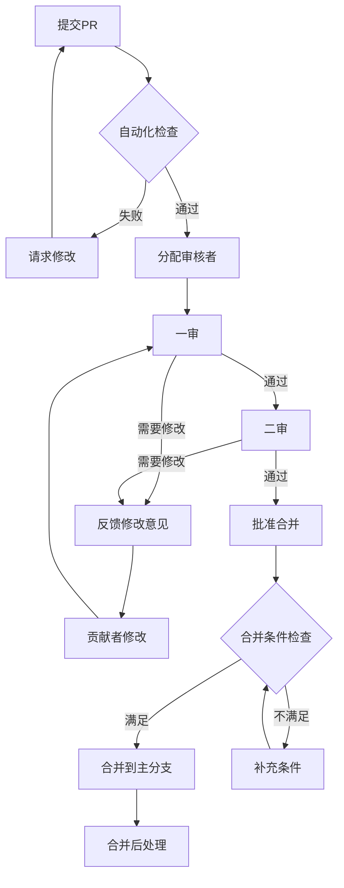

# PR 审核流程

> 本文档定义 C_Lang 知识库 Pull Request 的审核流程、标准和策略。
>
> 适用于维护者和贡献者了解审核机制。

---

## 📋 目录

- [PR 审核流程](#pr-审核流程)
  - [📋 目录](#-目录)
  - [审核流程概述](#审核流程概述)
    - [流程图](#流程图)
    - [角色定义](#角色定义)
  - [审核标准](#审核标准)
    - [技术准确性](#技术准确性)
      - [代码正确性](#代码正确性)
      - [概念准确性](#概念准确性)
      - [标准合规性](#标准合规性)
    - [内容完整性](#内容完整性)
      - [信息完整](#信息完整)
      - [结构完整](#结构完整)
      - [受众适配](#受众适配)
    - [格式规范性](#格式规范性)
      - [Markdown 格式](#markdown-格式)
      - [代码格式](#代码格式)
      - [文档规范](#文档规范)
    - [可维护性](#可维护性)
      - [可更新性](#可更新性)
      - [可追踪性](#可追踪性)
  - [质量评估矩阵](#质量评估矩阵)
    - [评分维度](#评分维度)
    - [质量等级](#质量等级)
  - [审核检查清单](#审核检查清单)
    - [一审检查清单](#一审检查清单)
    - [二审检查清单](#二审检查清单)
  - [合并策略](#合并策略)
    - [合并条件](#合并条件)
      - [必要条件](#必要条件)
      - [质量条件](#质量条件)
      - [文档条件](#文档条件)
    - [合并类型](#合并类型)
    - [合并后操作](#合并后操作)
  - [特殊情况处理](#特殊情况处理)
    - [紧急修复](#紧急修复)
    - [大型 PR](#大型-pr)
    - [有争议的变更](#有争议的变更)
  - [审核者指南](#审核者指南)
    - [如何成为审核者](#如何成为审核者)
    - [审核者职责](#审核者职责)
    - [审核技巧](#审核技巧)
      - [反馈技巧](#反馈技巧)
    - [请求修改模板](#请求修改模板)

---

## 审核流程概述

### 流程图



### 角色定义

| 角色 | 职责 | 权限 |
|-----|------|------|
| **贡献者** | 提交 PR，响应反馈，修改内容 | 修改自己的 PR |
| **一审审核者** | 技术内容审核，检查准确性 | 批准/请求修改 |
| **二审审核者** | 格式规范审核，最终检查 | 批准/请求修改 |
| **维护者** | 分配审核者，最终合并决策 | 合并权限 |
| **机器人** | 自动化检查，格式验证 | 自动反馈 |

---

## 审核标准

### 技术准确性

#### 代码正确性

- [ ] 所有代码示例语法正确
- [ ] 代码逻辑正确，无 bug
- [ ] 代码在指定标准版本下可编译
- [ ] 边界情况已处理

#### 概念准确性

- [ ] 技术术语使用正确
- [ ] 概念解释准确无误
- [ ] 引用的标准/规范版本正确
- [ ] 数学公式推导正确（如适用）

#### 标准合规性

- [ ] 符合 C89/C99/C11/C17/C23 标准声明
- [ ] 实现定义行为已明确说明
- [ ] 未定义行为已警告

### 内容完整性

#### 信息完整

- [ ] 概念定义完整
- [ ] 示例覆盖主要使用场景
- [ ] 边界条件和异常情况已说明
- [ ] 相关参考资料已提供

#### 结构完整

- [ ] 文档结构符合规范
- [ ] 必要的章节不缺漏
- [ ] 目录更新完整
- [ ] 交叉引用已建立

#### 受众适配

- [ ] 难度标识准确
- [ ] 前置知识要求明确
- [ ] 内容深度适合目标读者

### 格式规范性

#### Markdown 格式

- [ ] 标题层级正确
- [ ] 代码块使用正确的语言标识
- [ ] 表格格式正确
- [ ] 列表层级正确

#### 代码格式

- [ ] 代码缩进一致（4空格）
- [ ] 命名规范统一
- [ ] 注释清晰有效
- [ ] 行长度适中（<80-100字符）

#### 文档规范

- [ ] 文件命名符合规范
- [ ] 元信息完整
- [ ] 中英混排符合规范
- [ ] 术语使用一致

### 可维护性

#### 可更新性

- [ ] 内容易于后续更新
- [ ] 版本信息明确
- [ ] 依赖关系清晰

#### 可追踪性

- [ ] 与相关 Issue 关联
- [ ] 变更范围明确
- [ ] 影响分析完整

---

## 质量评估矩阵

### 评分维度

每个 PR 从以下维度进行评估（满分 100 分）：

| 维度 | 权重 | 评分标准 |
|-----|:----:|:---------|
| **技术准确性** | 35% | 代码正确、概念准确、标准合规 |
| **内容完整性** | 25% | 信息完整、覆盖全面、示例充分 |
| **格式规范性** | 20% | 符合风格指南、格式统一 |
| **可读性** | 15% | 表达清晰、结构合理、易于理解 |
| **可维护性** | 5% | 易于更新、版本明确 |

### 质量等级

根据总分评定质量等级：

| 等级 | 分数 | 说明 | 处理 |
|:---:|:----:|:-----|:-----|
| 🏆 **卓越** | 90-100 | 高质量，可作为范例 | 直接合并，表彰 |
| ✅ **优秀** | 80-89 | 良好，符合标准 | 直接合并 |
| 👍 **合格** | 70-79 | 可接受，有小问题 | 合并，建议后续改进 |
| ⚠️ **需改进** | 60-69 | 存在问题需要修改 | 请求修改 |
| ❌ **不合格** | <60 | 重大缺陷 | 拒绝或大幅修改 |

---

## 审核检查清单

### 一审检查清单

一审重点关注技术内容和准确性：

```markdown
## 一审检查清单

### 技术审核
- [ ] 代码示例语法正确且可编译
- [ ] 概念解释准确无误
- [ ] 标准引用版本正确
- [ ] 数学推导/证明正确（如适用）

### 内容审核
- [ ] 信息完整，无重要遗漏
- [ ] 难度标识准确
- [ ] 前置知识要求合理
- [ ] 示例覆盖主要场景

### 结构审核
- [ ] 文档结构合理
- [ ] 章节组织逻辑清晰
- [ ] 目录已更新

### 一审意见
- [ ] 通过，进入二审
- [ ] 需要修改（请说明）

审核人: @username
日期: YYYY-MM-DD
```

### 二审检查清单

二审重点关注格式规范和整体质量：

```markdown
## 二审检查清单

### 格式审核
- [ ] 符合内容风格指南
- [ ] Markdown 格式正确
- [ ] 代码格式统一
- [ ] 命名规范一致

### 规范审核
- [ ] 文件命名正确
- [ ] 元信息完整
- [ ] 链接有效
- [ ] 术语使用一致

### 质量审核
- [ ] 表达清晰
- [ ] 可读性良好
- [ ] 无拼写/语法错误

### 二审意见
- [ ] 批准合并
- [ ] 需要修改（请说明）

审核人: @username
日期: YYYY-MM-DD
```

---

## 合并策略

### 合并条件

PR 必须满足以下条件才能合并：

#### 必要条件

- [ ] 通过所有自动化检查（CI/CD）
- [ ] 至少 1 位维护者或 2 位审核者批准
- [ ] 无未解决的审核意见
- [ ] 与主分支无冲突

#### 质量条件

- [ ] 技术准确性评分 ≥ 70%
- [ ] 格式规范性评分 ≥ 80%
- [ ] 无严重或阻塞性问题

#### 文档条件

- [ ] 更新相关索引
- [ ] 文档结构符合规范
- [ ] 代码示例已验证

### 合并类型

| 类型 | 条件 | 操作 |
|-----|------|------|
| **快速合并** | 紧急修复，无争议 | 维护者直接合并 |
| **常规合并** | 标准流程完成 | 使用 "Squash and Merge" |
| **保留历史合并** | 多个独立提交有价值 | 使用 "Rebase and Merge" |

### 合并后操作

合并完成后，维护者需要：

1. **更新记录**
   - 更新 CHANGELOG.md
   - 更新 PROJECT_STATUS.md（如需要）

2. **关闭关联**
   - 确认关联 Issue 已关闭
   - 添加解决说明

3. **社区通知**
   - 在 Discussions 中宣布（重大变更）
   - 更新社区荣誉榜（突出贡献）

4. **后续跟踪**
   - 标记需要后续改进的内容
   - 创建跟踪 Issue（如需要）

---

## 特殊情况处理

### 紧急修复

对于需要紧急合并的修复（如严重错误、安全漏洞）：

1. **标记紧急**
   - PR 标题添加 `[URGENT]` 前缀
   - 描述中说明紧急原因

2. **加速流程**
   - 跳过二审（如内容明确）
   - 维护者直接审核合并

3. **事后审查**
   - 24小时内补充完整审核
   - 如有问题立即修正

### 大型 PR

对于超过 500 行变更的大型 PR：

1. **分阶段审核**
   - 按章节/功能分块审核
   - 每块独立批准

2. **增加审核者**
   - 分配 2-3 位审核者
   - 不同方面专人审核

3. **预先沟通**
   - 提交前通过 Issue 讨论方案
   - 避免方向性错误

### 有争议的变更

对于审核者意见不一致的情况：

1. **讨论解决**
   - 在 PR 中充分讨论
   - 引用规范和权威来源

2. **升级决策**
   - 提请维护者团队讨论
   - 必要时社区投票

3. **妥协方案**
   - 寻找双方可接受的中间方案
   - 分步实施争议内容

---

## 审核者指南

### 如何成为审核者

满足以下条件可申请成为审核者：

1. **贡献记录**
   - 至少 5 个被合并的 PR
   - 贡献内容质量高

2. **专业知识**
   - 在特定领域有深入了解
   - 熟悉 C 语言标准

3. **社区参与**
   - 积极参与讨论
   - 协助其他贡献者

**申请流程**：

1. 联系现有维护者
2. 说明专业领域和贡献记录
3. 通过试用期审核（协助审核 3-5 个 PR）

### 审核者职责

1. **及时响应**
   - 分配后 48 小时内开始审核
   - 及时回复贡献者问题

2. **专业判断**
   - 基于标准而非个人偏好
   - 提供建设性反馈

3. **知识传递**
   - 解释审核意见的原因
   - 帮助贡献者学习规范

4. **质量把控**
   - 不降低质量标准
   - 对问题严格把关

### 审核技巧

#### 反馈技巧

**好的反馈**：

```
建议在代码示例中添加错误处理：
```c
int *p = malloc(sizeof(int) * n);
if (p == NULL) {
    // 处理分配失败
    return -1;
}
```

这样可以更好地展示最佳实践。

```

**需要改进的反馈**：
```

代码有问题，改一下。

```

#### 平衡严格与鼓励

- ✅ 肯定好的做法
- ✅ 指出问题并说明原因
- ✅ 提供改进建议
- ❌ 只批评不肯定
- ❌ 使用指责性语言

#### 高效审核

1. **先看整体**
   - 理解变更的目的和范围
   - 检查目录结构和命名

2. **再看细节**
   - 技术内容准确性
   - 格式规范

3. **使用工具**
   - 利用建议功能批量评论
   - 使用审核模板

---

## 附录：审核模板

### 批准评论模板

```markdown
## 审核通过 ✅

### 总体评价
（优秀/良好/可接受）

### 亮点
-
-

### 可选改进（非阻塞）
-
-

批准合并。

审核人: @username
日期: YYYY-MM-DD
```

### 请求修改模板

```markdown
## 需要修改 ⚠️

### 问题分类
- [ ] 技术错误（阻塞）
- [ ] 内容缺失（阻塞）
- [ ] 格式问题（建议）
- [ ] 其他

### 详细反馈

#### 问题1: （简要描述）
**位置**: 文件/行号
**问题**: 详细说明
**建议**: 如何修改

#### 问题2: ...

### 修改后
请修改后重新请求审核。

审核人: @username
日期: YYYY-MM-DD
```

---

> **审核是质量保证的关键环节。**
>
> 每一位审核者都在帮助维护项目的质量标准和社区文化。
> 感谢你的专业贡献！

---

**维护**: C_Lang 维护团队
**更新**: 2026-03-19
**版本**: 1.0
