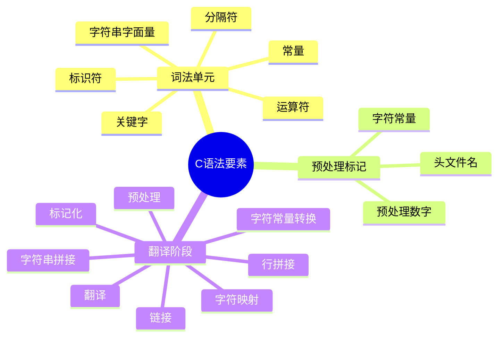
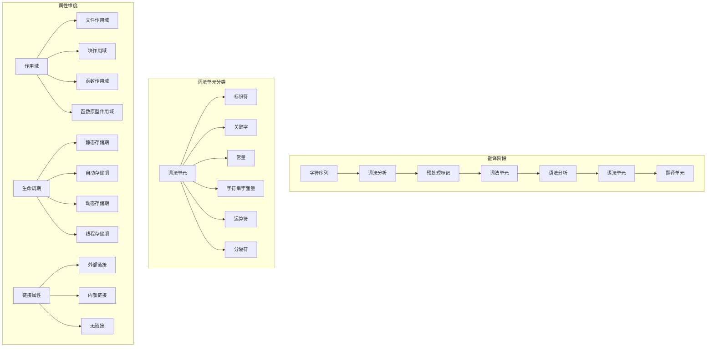

# C语言语法要素深度解析

> **层级定位**: 01 Core Knowledge System / 01 Basic Layer
> **对应标准**: C89/C99/C11/C17/C23
> **难度级别**: L1 了解
> **预估学习时间**: 2-3 小时

---

## 📋 本节概要

| 属性 | 内容 |
|:-----|:-----|
| **核心概念** | 词法单元、标识符、关键字、常量、字符串字面量 |
| **前置知识** | 无 (C语言入门第一内容) |
| **后续延伸** | [数据类型系统](./02_Data_Type_System.md) → [运算符与表达式](./03_Operators_Expressions.md) → [控制流](./04_Control_Flow.md) |
| **横向关联** | [编译过程](../../05_Engineering/01_Compilation_Build.md#预处理) |
| **学习路径** | 这是C语言学习路径的起点，完成后请继续学习数据类型系统 |
| **权威来源** | K&R Ch2.1-2.3, C11标准 6.4 |

---


---

## 📑 目录

- [C语言语法要素深度解析](#c语言语法要素深度解析)
  - [📋 本节概要](#-本节概要)
  - [📑 目录](#-目录)
  - [🎯 概念定义](#-概念定义)
    - [1.1 语法元素（Syntax Elements）](#11-语法元素syntax-elements)
    - [1.2 词法单元（Lexical Token）](#12-词法单元lexical-token)
    - [1.3 语法单元（Syntactic Unit）](#13-语法单元syntactic-unit)
  - [🧠 知识结构思维导图](#-知识结构思维导图)
    - [语法元素层次结构详细图](#语法元素层次结构详细图)
  - [📖 核心概念详解](#-核心概念详解)
    - [1. 标识符 (Identifiers)](#1-标识符-identifiers)
      - [1.1 命名规则](#11-命名规则)
      - [1.2 属性说明](#12-属性说明)
      - [1.3 作用域与可见性](#13-作用域与可见性)
    - [2. 关键字 (Keywords)](#2-关键字-keywords)
      - [2.1 C89-C23关键字演进](#21-c89-c23关键字演进)
    - [3. 常量 (Constants)](#3-常量-constants)
      - [3.1 整数常量](#31-整数常量)
      - [3.2 浮点常量](#32-浮点常量)
      - [3.3 字符常量](#33-字符常量)
    - [4. 字符串字面量](#4-字符串字面量)
      - [4.1 字符串基本](#41-字符串基本)
      - [4.2 Unicode字符串](#42-unicode字符串)
      - [4.3 字符串修改陷阱](#43-字符串修改陷阱)
  - [🔬 形式化描述（BNF/EBNF文法）](#-形式化描述bnfebnf文法)
    - [5.1 标识符文法（C11 6.4.2）](#51-标识符文法c11-642)
    - [5.2 常量文法（C11 6.4.4）](#52-常量文法c11-644)
    - [5.3 字符串字面量文法（C11 6.4.5）](#53-字符串字面量文法c11-645)
  - [🔄 多维矩阵对比](#-多维矩阵对比)
    - [转义序列参考表](#转义序列参考表)
    - [语法元素属性矩阵](#语法元素属性矩阵)
  - [⚠️ 常见陷阱与反例](#️-常见陷阱与反例)
    - [陷阱 SYN01: 字符与字符串混淆](#陷阱-syn01-字符与字符串混淆)
    - [陷阱 SYN02: 八进制陷阱](#陷阱-syn02-八进制陷阱)
    - [陷阱 SYN03: 标识符保留字冲突](#陷阱-syn03-标识符保留字冲突)
    - [陷阱 SYN04: 多字节字符字面量](#陷阱-syn04-多字节字符字面量)
    - [陷阱 SYN05: 字符串字面量拼接顺序](#陷阱-syn05-字符串字面量拼接顺序)
    - [陷阱 SYN06: 浮点常量默认类型](#陷阱-syn06-浮点常量默认类型)
  - [✅ 质量验收清单](#-质量验收清单)
  - [深入理解](#深入理解)
    - [技术原理](#技术原理)
    - [实践指南](#实践指南)
    - [相关资源](#相关资源)


---

## 🎯 概念定义

### 1.1 语法元素（Syntax Elements）

**严格定义**：构成C语言程序的基本结构单元，按照ISO/IEC 9899标准，C语言语法元素是指程序翻译过程中能被识别和处理的最小有意义单元。

**形式化定义**：

```text
语法元素 ∈ {词法单元(Token), 预处理标记(Preprocessing Token),
           翻译单元(Translation Unit)}
```

### 1.2 词法单元（Lexical Token）

**严格定义**（C11标准 6.4）：源程序被词法分析器处理后产生的最小不可分割单元，是编译器语法分析的输入单位。

**分类体系**：

```text
词法单元(Token) ::= 关键字(Keyword)
                  | 标识符(Identifier)
                  | 常量(Constant)
                  | 字符串字面量(String Literal)
                  | 运算符(Operator)
                  | 分隔符(Punctuator)
```

### 1.3 语法单元（Syntactic Unit）

**严格定义**：由词法单元按照特定规则组合而成的更高层次结构，包括表达式、语句、声明、定义等。

**层次关系**：

```text
字符(Character) → 词法单元(Token) → 语法单元(Syntactic Unit)
                → 声明/定义(Declaration/Definition)
                → 翻译单元(Translation Unit)
```

---

## 🧠 知识结构思维导图



### 语法元素层次结构详细图



---

## 📖 核心概念详解

### 1. 标识符 (Identifiers)

#### 1.1 命名规则

```c
// 有效标识符
int valid_name;      // 字母开头，下划线连接
int _private;        // 下划线开头（保留字风险）
int value2;          // 数字在末尾
int 变量名;          // Unicode标识符(C23)

// 无效标识符
// int 2value;       // 数字开头
// int class;        // 关键字
// int my-name;      // 连字符不允许
// int my name;      // 空格不允许
```

#### 1.2 属性说明

| 属性类别 | 属性值 | 说明 | 示例 |
|:---------|:-------|:-----|:-----|
| **作用域** | 文件作用域 | 在翻译单元内可见 | 全局变量 |
| | 块作用域 | 在代码块内可见 | 局部变量 |
| | 函数作用域 | 仅goto标签 | label: |
| | 函数原型作用域 | 参数列表内 | void f(int x) |
| **链接属性** | 外部链接 | 跨文件可见 | `int g_var;` |
| | 内部链接 | 仅限当前文件 | `static int s_var;` |
| | 无链接 | 无链接属性 | 局部变量 |
| **命名空间** | 普通标识符 | 变量、函数、typedef | `int count;` |
| | 标签命名空间 | goto标签 | `loop:` |
| | 结构体/联合体/枚举标签 | 类型标签 | `struct Node` |
| | 结构体/联合体成员 | 各自独立 | `struct { int x; }` |

#### 1.3 作用域与可见性

```c
// 文件作用域（外部链接）
int global_var;

// 内部链接
static int internal_var;

void function(void) {
    // 块作用域
    int local_var;

    {
        // 嵌套作用域，隐藏外部同名变量
        int local_var;  // 不同的变量！
    }
}
```

---

### 2. 关键字 (Keywords)

#### 2.1 C89-C23关键字演进

| C89 | C99 | C11 | C23 | 用途 |
|:----|:----|:----|:----|:-----|
| auto | | | | 存储类（已少用） |
| break | | | | 跳转语句 |
| case | | | | switch分支 |
| char | | | | 字符类型 |
| const | | | | 类型限定 |
| continue | | | | 循环控制 |
| default | | | | switch默认 |
| do | | | | do-while循环 |
| double | | | | 双精度浮点 |
| else | | | | if分支 |
| enum | | | | 枚举 |
| extern | | | | 外部链接 |
| float | | | | 单精度浮点 |
| for | | | | for循环 |
| goto | | | | 无条件跳转 |
| if | | | | 条件语句 |
| int | | | | 整数类型 |
| long | | | | 长整型 |
| register | | | | 寄存器建议 |
| return | | | | 函数返回 |
| short | | | | 短整型 |
| signed | | | | 有符号 |
| sizeof | | | | 大小运算符 |
| static | | | | 静态存储 |
| struct | | | | 结构体 |
| switch | | | | 多分支 |
| typedef | | | | 类型定义 |
| union | | | | 联合体 |
| unsigned | | | | 无符号 |
| void | | | | 空类型 |
| volatile | | | | 易变限定 |
| while | | | | while循环 |
| | inline | | | 内联函数 |
| | restrict | | | 指针限定 |
| | _Bool | | | 布尔类型 |
| | _Complex | | | 复数类型 |
| | _Imaginary | | | 虚数类型 |
| | | _Alignas | alignas | 对齐指定 |
| | | _Alignof | alignof | 对齐查询 |
| | | _Atomic | | 原子类型 |
| | | _Static_assert | static_assert | 静态断言 |
| | | _Noreturn | noreturn | 无返回 |
| | | _Thread_local | thread_local | 线程存储 |
| | | _Generic | | 泛型选择 |
| | | | constexpr | 常量表达式 |
| | | | nullptr | 空指针 |
| | | | typeof | 类型推导 |
| | | | true/false | 布尔字面量 |

---

### 3. 常量 (Constants)

#### 3.1 整数常量

```c
// 十进制
int dec = 42;
int dec_negative = -42;

// 八进制（0开头）
int oct = 052;      // 42 in decimal

// 十六进制（0x/0X开头）
int hex = 0x2A;     // 42 in decimal
int hex_upper = 0X2a;

// 二进制（C23，0b/0B开头）
#if __STDC_VERSION__ >= 202311L
int bin = 0b101010;  // 42 in decimal
int bin_sep = 0b1010'1010;  // 单引号分隔符(C23)
#endif

// 整数后缀
unsigned int u = 42U;
long l = 42L;
unsigned long ul = 42UL;
long long ll = 42LL;
unsigned long long ull = 42ULL;
```

#### 3.2 浮点常量

```c
// 小数形式
double d1 = 3.14159;
double d2 = .5;       // 0.5
double d3 = 3.;       // 3.0

// 指数形式
double e1 = 3.14e10;   // 3.14 × 10^10
double e2 = 1E-10;     // 1 × 10^-10

// 十六进制浮点(C99)
double hex_float = 0x1.5p10;  // 1.3125 × 2^10 = 1344.0

// 后缀
float f = 3.14F;
double d = 3.14;      // 默认
double ld = 3.14L;    // long double
```

#### 3.3 字符常量

```c
// 普通字符
char c1 = 'A';
char c2 = '\n';  // 转义序列

// 转义序列
char newline = '\n';
char tab = '\t';
char backslash = '\\';
char single_quote = '\'';
char null_char = '\0';

// 八进制转义
char oct_esc = '\101';  // 'A' (65 in octal)

// 十六进制转义
char hex_esc = '\x41';  // 'A' (65 in hex)

// Unicode字符(C11)
char16_t c16 = u'中';   // UTF-16
char32_t c32 = U'中';   // UTF-32

// 宽字符
wchar_t wc = L'中';     // 平台相关
```

---

### 4. 字符串字面量

#### 4.1 字符串基本

```c
// 普通字符串
const char *s1 = "Hello, World!";

// 多行字符串（行拼接）
const char *s2 = "Line 1 "
                 "Line 2 "
                 "Line 3";

// 转义序列
const char *s3 = "Tab:\there\nNew line";

// 原始字符串（C23）
#if __STDC_VERSION__ >= 202311L
const char *raw = R"(Raw "string" without escapes)";
#endif
```

#### 4.2 Unicode字符串

```c
// UTF-8字符串(C11)
const char *utf8 = u8"Hello 世界";

// UTF-16字符串
const char16_t *utf16 = u"Hello 世界";

// UTF-32字符串
const char32_t *utf32 = U"Hello 世界";

// 宽字符串
const wchar_t *wide = L"Hello 世界";
```

#### 4.3 字符串修改陷阱

```c
// ❌ 未定义行为：修改字符串字面量
char *s = "Hello";  // 指向只读数据
s[0] = 'h';  // 崩溃或不可预测行为

// ✅ 可修改的字符数组
char modifiable[] = "Hello";  // 数组拷贝
modifiable[0] = 'h';  // OK

// ✅ 显式const
const char *read_only = "Hello";
// read_only[0] = 'h';  // 编译错误
```

---

## 🔬 形式化描述（BNF/EBNF文法）

### 5.1 标识符文法（C11 6.4.2）

```ebnf
identifier ::= identifier-nondigit
             | identifier identifier-nondigit
             | identifier digit

identifier-nondigit ::= nondigit
                      | universal-character-name
                      | other implementation-defined characters

nondigit ::= '_' | 'a' | 'b' | ... | 'z' | 'A' | 'B' | ... | 'Z'

digit ::= '0' | '1' | ... | '9'

universal-character-name ::= '\\u' hex-quad
                           | '\\U' hex-quad hex-quad

hex-quad ::= hex-digit hex-digit hex-digit hex-digit

hex-digit ::= digit | 'a' | 'b' | 'c' | 'd' | 'e' | 'f'
                          | 'A' | 'B' | 'C' | 'D' | 'E' | 'F'
```

### 5.2 常量文法（C11 6.4.4）

```ebnf
constant ::= integer-constant
           | floating-constant
           | enumeration-constant
           | character-constant

integer-constant ::= decimal-constant integer-suffix?
                   | octal-constant integer-suffix?
                   | hexadecimal-constant integer-suffix?
                   | binary-constant integer-suffix?   (* C23 *)

decimal-constant ::= nonzero-digit | decimal-constant digit

octal-constant ::= '0' | octal-constant octal-digit

hexadecimal-constant ::= hexadecimal-prefix hexadecimal-digit-sequence

hexadecimal-prefix ::= '0x' | '0X'

binary-constant ::= binary-prefix binary-digit-sequence   (* C23 *)
binary-prefix ::= '0b' | '0B'                             (* C23 *)

integer-suffix ::= unsigned-suffix long-suffix?
                 | unsigned-suffix long-long-suffix?
                 | long-suffix unsigned-suffix?
                 | long-long-suffix unsigned-suffix?

unsigned-suffix ::= 'u' | 'U'
long-suffix ::= 'l' | 'L'
long-long-suffix ::= 'll' | 'LL'

floating-constant ::= decimal-floating-constant
                    | hexadecimal-floating-constant

decimal-floating-constant ::= fractional-constant exponent-part? floating-suffix?
                            | digit-sequence exponent-part floating-suffix?

hexadecimal-floating-constant ::= hexadecimal-prefix hexadecimal-fractional-constant
                                    binary-exponent-part floating-suffix?
                                | hexadecimal-prefix hexadecimal-digit-sequence
                                    binary-exponent-part floating-suffix?

binary-exponent-part ::= 'p' sign? digit-sequence
                       | 'P' sign? digit-sequence

sign ::= '+' | '-'
floating-suffix ::= 'f' | 'F' | 'l' | 'L'
```

### 5.3 字符串字面量文法（C11 6.4.5）

```ebnf
string-literal ::= encoding-prefix? '"' s-char-sequence? '"'

encoding-prefix ::= 'u8'  (* UTF-8 *)
                  | 'u'   (* UTF-16 *)
                  | 'U'   (* UTF-32 *)
                  | 'L'   (* 宽字符 *)

s-char-sequence ::= s-char | s-char-sequence s-char

s-char ::= any member of the source character set except
           the double-quote, backslash, or newline character
         | escape-sequence
         | universal-character-name
```

---

## 🔄 多维矩阵对比

### 转义序列参考表

| 转义 | 含义 | ASCII值 |
|:-----|:-----|:-------:|
| `\a` | 警报(Bell) | 7 |
| `\b` | 退格 | 8 |
| `\f` | 换页 | 12 |
| `\n` | 换行 | 10 |
| `\r` | 回车 | 13 |
| `\t` | 水平制表 | 9 |
| `\v` | 垂直制表 | 11 |
| `\\` | 反斜杠 | 92 |
| `\'` | 单引号 | 39 |
| `\"` | 双引号 | 34 |
| `\?` | 问号 | 63 |
| `\0` | 空字符 | 0 |

### 语法元素属性矩阵

| 语法元素 | 作用域 | 存储期 | 链接属性 | 命名空间 |
|:---------|:-------|:-------|:---------|:---------|
| 全局变量 | 文件 | 静态 | 外部 | 普通 |
| static全局变量 | 文件 | 静态 | 内部 | 普通 |
| 局部变量 | 块 | 自动 | 无 | 普通 |
| static局部变量 | 块 | 静态 | 无 | 普通 |
| 函数参数 | 函数原型 | 自动 | 无 | 普通 |
| 标签 | 函数 | - | - | 标签 |
| 结构体标签 | 文件/块 | - | - | 标签 |
| 枚举常量 | 文件/块 | 静态 | 见定义 | 普通 |

---

## ⚠️ 常见陷阱与反例

### 陷阱 SYN01: 字符与字符串混淆

```c
// ❌ 错误
char c = "A";  // char* 转 char，警告或错误

// ✅ 正确
char c = 'A';  // 字符常量
const char *s = "A";  // 字符串（含'\0'）
```

### 陷阱 SYN02: 八进制陷阱

```c
// ❌ 意外八进制
int x = 071;   // 57 in decimal，不是71！
int y = 0123;  // 83 in decimal

// ✅ 显式书写
int z = 123;   // 十进制
```

### 陷阱 SYN03: 标识符保留字冲突

```c
// ❌ 使用保留标识符（以_开头后跟大写字母或另一个_）
int _Reserved;      // 保留给实现使用
int __reserved;     // 双下划线保留
int reserved__;     // 末尾双下划线也保留

// ✅ 安全命名
int reserved;
int my_reserved;
int reserved_count;
```

### 陷阱 SYN04: 多字节字符字面量

```c
// ❌ 实现定义行为
char c = 'AB';  // 多字符常量，值不确定

// ✅ 使用正确类型
char16_t c16 = u'A';   // UTF-16字符
char32_t c32 = U'中';  // UTF-32字符
```

### 陷阱 SYN05: 字符串字面量拼接顺序

```c
// ❌ 未定义行为？不，是未指定行为
const char *s = "Hello" " " "World";  // OK，翻译阶段6拼接

// ✅ 明确意图
const char *s1 = "Hello World";  // 直接写完整

// 注意：不同编码前缀不能拼接
// const char *err = u8"Hello" u"World";  // 错误！
```

### 陷阱 SYN06: 浮点常量默认类型

```c
// ⚠️ 注意默认类型
double d = 3.14;    // double（默认）
float f = 3.14f;    // 显式float
long double ld = 3.14L;  // 显式long double

// ❌ 精度损失风险
float f2 = 3.141592653589793;  // 先转double，再转float，可能截断
```

---

## ✅ 质量验收清单

- [x] 标识符命名规则
- [x] 关键字演进表
- [x] 常量类型详解
- [x] 字符串安全使用
- [x] 形式化BNF/EBNF文法定义
- [x] 语法元素属性矩阵
- [x] 常见语法错误反例

---

> **更新记录**
>
> - 2025-03-09: 初版创建
> - 2026-03-16: 深化内容，添加概念定义、形式化文法、属性说明和反例


---

## 深入理解

### 技术原理

深入探讨相关技术原理和实现细节。

### 实践指南

- 步骤1：理解基础概念
- 步骤2：掌握核心原理
- 步骤3：应用实践

### 相关资源

- 文档链接
- 代码示例
- 参考文章

---

> **最后更新**: 2026-03-21
> **维护者**: AI Code Review
