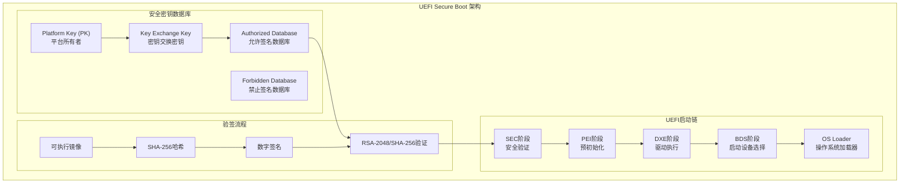
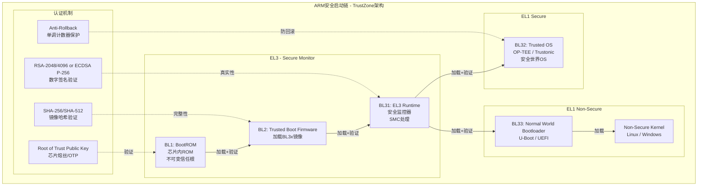
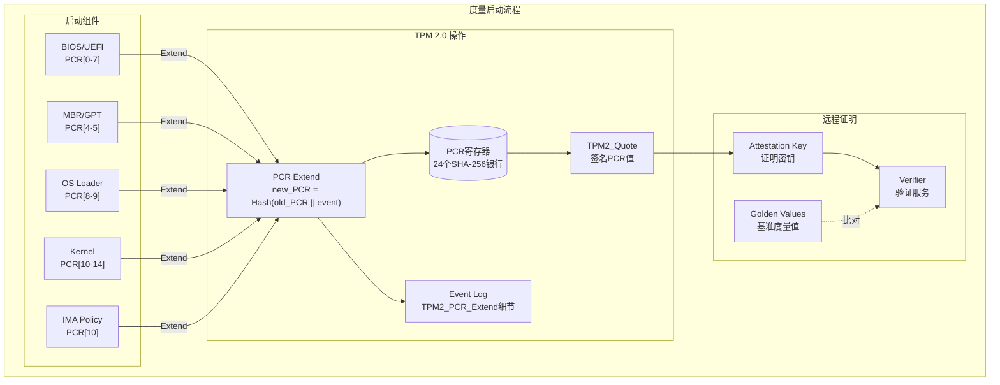
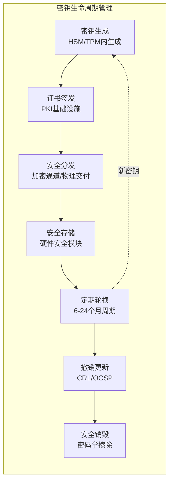
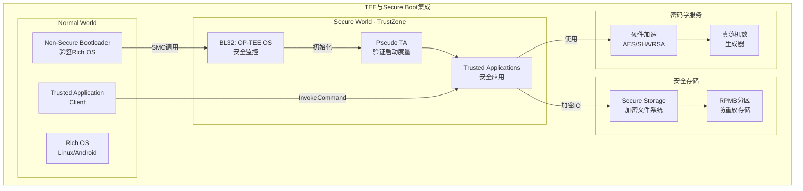

# 安全启动 (Secure Boot) - 深度技术解析

> **难度等级**: L5 | **预估学习时间**: 40-50小时 | **前置知识**: 嵌入式系统、ARM架构、密码学基础、UEFI规范

---

## 技术概述

安全启动(Secure Boot)是构建可信计算环境的第一道防线，确保设备从复位开始执行的每一行代码都经过验证，防止恶意软件在系统启动早期植入。本模块深入探讨UEFI Secure Boot、ARM Trusted Boot、Measured Boot三大技术体系，以及TPM/TEE集成和密钥管理的工程实践。

### 安全启动的核心价值

根据NIST SP 800-147《BIOS保护指南》和SP 800-155《BIOS完整性度量指南》，安全启动通过建立**信任链(Chain of Trust)**，从不可变的硬件信任根开始，逐级验证每个软件组件的完整性和真实性，确保系统启动过程的可信性。

### 核心概念对比

| 概念 | 技术标准 | 验证方式 | 信任根 | 应用场景 |
|:-----|:---------|:---------|:-------|:---------|
| **UEFI Secure Boot** | UEFI Specification 2.10 | 数字签名验证 | PK/KEK/DB/DBX | PC、服务器、数据中心 |
| **ARM Trusted Boot** | ARM Trusted Board Boot | 哈希验签+回滚保护 | BootROM ROTPK | 移动设备、IoT、嵌入式 |
| **Measured Boot** | TCG PC Client Spec | PCR扩展+远程证明 | TPM/TPM2 | 企业PC、金融终端 |
| **DRTM** | Intel TXT/AMD-V | 动态信任根 | CPU微代码 | 虚拟化、云计算 |

---


---

## 📑 目录

- [安全启动 (Secure Boot) - 深度技术解析](#安全启动-secure-boot---深度技术解析)
  - [技术概述](#技术概述)
    - [安全启动的核心价值](#安全启动的核心价值)
    - [核心概念对比](#核心概念对比)
  - [📑 目录](#-目录)
  - [安全启动架构深度解析](#安全启动架构深度解析)
    - [1. UEFI Secure Boot 架构](#1-uefi-secure-boot-架构)
      - [UEFI密钥层次结构](#uefi密钥层次结构)
    - [2. ARM Trusted Firmware 安全启动链](#2-arm-trusted-firmware-安全启动链)
      - [ARM可信固件验签实现](#arm可信固件验签实现)
    - [3. Measured Boot 与 TPM 集成](#3-measured-boot-与-tpm-集成)
      - [TPM 2.0 PCR 扩展操作](#tpm-20-pcr-扩展操作)
  - [密钥管理技术](#密钥管理技术)
    - [安全启动密钥生命周期](#安全启动密钥生命周期)
      - [密钥层次结构设计](#密钥层次结构设计)
  - [可信执行环境(TEE)集成](#可信执行环境tee集成)
    - [OP-TEE 安全启动集成](#op-tee-安全启动集成)
  - [权威资料与参考](#权威资料与参考)
    - [技术标准与规范](#技术标准与规范)
    - [开源参考实现](#开源参考实现)
    - [推荐书籍](#推荐书籍)
  - [应用场景深度分析](#应用场景深度分析)
    - [1. 数据中心服务器安全启动](#1-数据中心服务器安全启动)
    - [2. 移动设备安全启动 (Android Verified Boot)](#2-移动设备安全启动-android-verified-boot)
    - [3. 物联网设备安全启动](#3-物联网设备安全启动)
  - [安全等级标准](#安全等级标准)
  - [关联知识](#关联知识)


---

## 安全启动架构深度解析

### 1. UEFI Secure Boot 架构



#### UEFI密钥层次结构

```c
/* UEFI Secure Boot 变量结构 */
typedef struct {
    EFI_GUID signature_owner;       /* 签名者GUID */
    UINT16 signature_size;          /* 签名数据大小 */
    UINT8 signature_data[];         /* X.509证书或SHA-256哈希 */
} EFI_SIGNATURE_DATA;

typedef struct {
    EFI_GUID signature_type;        /* EFI_CERT_TYPE_RSA2048/SHA256 */
    UINT32 signature_list_size;     /* 列表总大小 */
    UINT32 signature_header_size;   /* 头部大小 */
    UINT32 signature_size;          /* 单个签名大小 */
    // UINT8 signature_header[signature_header_size]; /* 可变头部 */
    // EFI_SIGNATURE_DATA signatures[];              /* 签名数组 */
} EFI_SIGNATURE_LIST;

/* 安全启动验签流程 */
EFI_STATUS verify_image_signature(
    VOID *image_buffer,
    UINTN image_size,
    EFI_SIGNATURE_LIST *db,         /* 允许列表 */
    EFI_SIGNATURE_LIST *dbx         /* 禁止列表 */
) {
    /* 1. 检查镜像哈希是否在DBX中 */
    UINT8 image_hash[SHA256_DIGEST_SIZE];
    sha256_hash(image_buffer, image_size, image_hash);

    if (find_hash_in_list(dbx, image_hash) == EFI_SUCCESS) {
        return EFI_SECURITY_VIOLATION;  /* 禁止的镜像 */
    }

    /* 2. 验证签名 */
    WIN_CERTIFICATE_EFI_PKCS *pkcs7_sig;
    extract_pkcs7_signature(image_buffer, &pkcs7_sig);

    EFI_SIGNATURE_DATA *cert = find_matching_cert(db, pkcs7_sig);
    if (cert == NULL) {
        return EFI_SECURITY_VIOLATION;  /* 未授权的签名者 */
    }

    /* 3. RSA-2048 + SHA-256 验证 */
    return rsa_verify_sha256(
        cert->signature_data,
        pkcs7_sig->signature,
        image_hash
    );
}
```

### 2. ARM Trusted Firmware 安全启动链

ARM架构采用分阶段启动模型，每个阶段都有明确的安全边界和责任：



#### ARM可信固件验签实现

```c
/* ARM TF-A 镜像认证描述符 */
typedef struct auth_img_desc {
    const char *img_id;                    /* 镜像标识 */
    auth_method_type_t auth_method;        /* 认证方法 */

    union {
        /* 哈希认证 */
        struct {
            const uint8_t *hash;
            size_t hash_len;
        } hash_auth;

        /* 签名认证 */
        struct {
            const uint8_t *pk_ptr;         /* 公钥指针 */
            const uint8_t *sig_ptr;        /* 签名指针 */
            auth_alg_t alg;                /* RSA/ECDSA */
        } sig_auth;
    } auth_data;

    /* 父镜像引用（形成信任链） */
    const struct auth_img_desc *parent;
} auth_img_desc_t;

/* 认证镜像头部（ARM固件镜像格式） */
typedef struct auth_img_header {
    uint32_t magic;                        /* 0x5F424E41 "ANB_" */
    uint16_t version;                      /* 头部版本 */
    uint16_t flags;                        /* 镜像标志 */
    uint32_t size;                         /* 镜像大小 */

    /* 签名区域 */
    uint32_t sig_offset;                   /* 签名偏移 */
    uint32_t sig_size;                     /* 签名大小 */

    /* 哈希区域 */
    uint32_t hash_offset;                  /* 哈希偏移 */
    uint32_t hash_size;                    /* 哈希大小 */

    /* 回滚保护 */
    uint32_t fw_version;                   /* 固件版本 */
    uint32_t min_fw_version;               /* 最低兼容版本 */
} __packed auth_img_header_t;

/* 安全启动验证函数 */
int auth_verify_image(const auth_img_desc_t *desc,
                      const void *image_ptr,
                      size_t image_size) {
    const auth_img_header_t *hdr = image_ptr;

    /* 1. 验证头部魔数 */
    if (hdr->magic != AUTH_IMG_MAGIC) {
        ERROR("Invalid image magic: 0x%x\n", hdr->magic);
        return -EINVAL;
    }

    /* 2. 回滚保护检查 */
    if (hdr->fw_version < desc->min_fw_version) {
        ERROR("Rollback detected: current=%u, minimum=%u\n",
              hdr->fw_version, desc->min_fw_version);
        return -EPERM;
    }

    /* 3. 根据认证方法验证 */
    switch (desc->auth_method) {
    case AUTH_METHOD_HASH:
        /* 计算并比较哈希 */
        uint8_t computed_hash[SHA256_DIGEST_SIZE];
        sha256_calc(image_ptr + hdr->hash_offset,
                    hdr->hash_size, computed_hash);

        if (memcmp(computed_hash, desc->auth_data.hash_auth.hash,
                   SHA256_DIGEST_SIZE) != 0) {
            ERROR("Hash verification failed\n");
            return -EAUTH;
        }
        break;

    case AUTH_METHOD_SIG:
        /* RSA签名验证 */
        if (rsa_verify_pkcs1_v15(
                desc->auth_data.sig_auth.pk_ptr,
                image_ptr + hdr->sig_offset,
                hdr->sig_size,
                image_ptr + sizeof(*hdr),
                image_size - sizeof(*hdr)) != 0) {
            ERROR("Signature verification failed\n");
            return -EAUTH;
        }
        break;

    default:
        return -ENOTSUP;
    }

    /* 4. 更新回滚计数器（原子操作） */
    update_rollback_counter(desc->img_id, hdr->fw_version);

    return 0;
}
```

### 3. Measured Boot 与 TPM 集成

度量启动(Measured Boot)通过TPM(Trusted Platform Module)记录系统启动过程中的关键度量值，支持远程证明(Remote Attestation)和密封存储(Sealed Storage)。



#### TPM 2.0 PCR 扩展操作

```c
#include <tss2/tss2_esys.h>
#include <tss2/tss2_rc.h>

/* TPM 2.0 PCR扩展操作 - 核心实现 */
TPM_RC tpm2_pcr_extend(ESYS_CONTEXT *esys_ctx,
                       TPMI_DH_PCR pcr_index,
                       const uint8_t *event_data,
                       size_t event_len) {
    TPM2B_DIGEST pcr_value = { .size = SHA256_DIGEST_SIZE };
    TPM2B_DIGEST event_digest = { .size = SHA256_DIGEST_SIZE };
    TPM2B_DIGEST new_digest = { .size = SHA256_DIGEST_SIZE };

    /* 1. 读取当前PCR值 */
    TPML_PCR_SELECTION pcr_selection = {
        .count = 1,
        .pcrSelections[0] = {
            .hash = TPM2_ALG_SHA256,
            .sizeofSelect = 3,
            .pcrSelect = { (pcr_index < 8) ? (1 << pcr_index) : 0,
                           (pcr_index >= 8 && pcr_index < 16) ? (1 << (pcr_index - 8)) : 0,
                           (pcr_index >= 16) ? (1 << (pcr_index - 16)) : 0 }
        }
    };

    TPML_DIGEST *pcr_values = NULL;
    TSS2_RC rc = Esys_PCR_Read(esys_ctx, ESYS_TR_NONE, ESYS_TR_NONE, ESYS_TR_NONE,
                               &pcr_selection, NULL, NULL, &pcr_values);
    if (rc != TSS2_RC_SUCCESS) {
        LOG_ERROR("PCR_Read failed: 0x%x\n", rc);
        return rc;
    }

    memcpy(pcr_value.buffer, pcr_values->digests[0].buffer,
           pcr_values->digests[0].size);
    free(pcr_values);

    /* 2. 计算事件哈希 */
    SHA256_CTX sha_ctx;
    SHA256_Init(&sha_ctx);
    SHA256_Update(&sha_ctx, event_data, event_len);
    SHA256_Final(event_digest.buffer, &sha_ctx);

    /* 3. 计算新PCR值: new_PCR = SHA256(old_PCR || event_hash) */
    SHA256_Init(&sha_ctx);
    SHA256_Update(&sha_ctx, pcr_value.buffer, pcr_value.size);
    SHA256_Update(&sha_ctx, event_digest.buffer, event_digest.size);
    SHA256_Final(new_digest.buffer, &sha_ctx);

    /* 4. 执行PCR Extend */
    TPML_DIGEST_VALUES extend_values = {
        .count = 1,
        .digests[0] = {
            .hashAlg = TPM2_ALG_SHA256,
            .digest = { .sha256 = {0} }
        }
    };
    memcpy(extend_values.digests[0].digest.sha256,
           event_digest.buffer, SHA256_DIGEST_SIZE);

    rc = Esys_PCR_Extend(esys_ctx, pcr_index, ESYS_TR_PASSWORD,
                         ESYS_TR_NONE, ESYS_TR_NONE, &extend_values);
    if (rc != TSS2_RC_SUCCESS) {
        LOG_ERROR("PCR_Extend failed: 0x%x\n", rc);
        return rc;
    }

    /* 5. 记录到事件日志 */
    tcg_event_log_append(pcr_index, event_data, event_len,
                         event_digest.buffer);

    return TPM_RC_SUCCESS;
}

/* 密封存储实现 - 将数据与PCR状态绑定 */
TPM_RC tpm2_seal_data(ESYS_CONTEXT *esys_ctx,
                      const uint8_t *data,
                      size_t data_len,
                      TPML_PCR_SELECTION *pcr_selection,
                      TPM2B_PRIVATE *sealed_private,
                      TPM2B_PUBLIC *sealed_public) {
    TSS2_RC rc;
    ESYS_TR policy_session = ESYS_TR_NONE;

    /* 1. 创建PCR策略会话 */
    TPM2B_NONCE nonce_caller = { .size = 20 };
    TPM2B_NONCE nonce_tpm = {0};
    TPM2B_ENCRYPTED_SECRET encrypted_salt = {0};
    TPMT_SYM_DEF sym_def = {
        .algorithm = TPM2_ALG_AES,
        .keyBits = { .aes = 128 },
        .mode = { .aes = TPM2_ALG_CFB }
    };

    rc = Esys_StartAuthSession(esys_ctx, ESYS_TR_NONE, ESYS_TR_NONE,
                               ESYS_TR_NONE, ESYS_TR_NONE, ESYS_TR_NONE,
                               &nonce_caller, TPM2_SE_POLICY, &sym_def,
                               TPM2_ALG_SHA256, &policy_session, &nonce_tpm);
    if (rc != TSS2_RC_SUCCESS) {
        LOG_ERROR("StartAuthSession failed: 0x%x\n", rc);
        return rc;
    }

    /* 2. 设置PolicyPCR */
    rc = Esys_PolicyPCR(esys_ctx, policy_session, ESYS_TR_NONE,
                        ESYS_TR_NONE, ESYS_TR_NONE, NULL, pcr_selection);
    if (rc != TSS2_RC_SUCCESS) {
        LOG_ERROR("PolicyPCR failed: 0x%x\n", rc);
        Esys_FlushContext(esys_ctx, policy_session);
        return rc;
    }

    /* 3. 创建密封对象 */
    TPM2B_SENSITIVE_CREATE sensitive = {
        .size = 0,
        .sensitive = {
            .userAuth = { .size = 0 },
            .data = { .size = data_len }
        }
    };
    memcpy(sensitive.sensitive.data.buffer, data, data_len);

    TPM2B_PUBLIC public_template = {
        .size = 0,
        .publicArea = {
            .type = TPM2_ALG_KEYEDHASH,
            .nameAlg = TPM2_ALG_SHA256,
            .objectAttributes = TPMA_OBJECT_FIXEDTPM |
                               TPMA_OBJECT_FIXEDPARENT |
                               TPMA_OBJECT_USERWITHAUTH,
            .authPolicy = {0},  /* 将通过PolicyGetDigest填充 */
            .parameters = {
                .keyedHashDetail = {
                    .scheme = { .scheme = TPM2_ALG_NULL }
                }
            },
            .unique = { .keyedHash = { .size = 0 } }
        }
    };

    /* 获取策略摘要 */
    TPM2B_DIGEST policy_digest = {0};
    rc = Esys_PolicyGetDigest(esys_ctx, policy_session, ESYS_TR_NONE,
                              ESYS_TR_NONE, ESYS_TR_NONE, &policy_digest);
    if (rc == TSS2_RC_SUCCESS) {
        public_template.publicArea.authPolicy = policy_digest;
    }

    /* 4. 创建对象 */
    ESYS_TR parent_handle = ESYS_TR_RH_OWNER;  /* 使用Owner层次 */
    rc = Esys_Create(esys_ctx, parent_handle, policy_session,
                     ESYS_TR_NONE, ESYS_TR_NONE, &sensitive,
                     &public_template, NULL, NULL,
                     sealed_private, sealed_public);

    Esys_FlushContext(esys_ctx, policy_session);
    return rc;
}
```

---

## 密钥管理技术

### 安全启动密钥生命周期



#### 密钥层次结构设计

```c
/* 安全启动密钥层次结构 */
#define KEY_HIERARCHY_LAYERS 4

typedef enum {
    KEY_LAYER_ROOT = 0,        /* 根密钥 - 离线存储 */
    KEY_LAYER_INTERMEDIATE,    /* 中间CA密钥 */
    KEY_LAYER_SIGNING,         /* 签名密钥 */
    KEY_LAYER_DEVICE           /* 设备特定密钥 */
} key_layer_t;

/* 密钥元数据 */
typedef struct {
    key_layer_t layer;
    uint32_t key_id;
    uint32_t key_version;
    uint64_t creation_time;
    uint64_t expiration_time;
    uint32_t usage_flags;      /* 签名/加密/认证 */
    uint8_t key_hash[32];      /* 公钥哈希 */
} key_metadata_t;

/* 安全密钥存储 */
typedef struct {
    key_metadata_t meta;
    uint8_t encrypted_key[4096];   /* AES-256-GCM加密 */
    uint8_t key_iv[12];
    uint8_t key_tag[16];
    uint8_t wrapping_key_hash[32]; /* 用于解封的父密钥哈希 */
} secure_key_blob_t;

/* 密钥生成与存储 */
int generate_secure_key(key_layer_t layer, secure_key_blob_t *out_key) {
    EVP_PKEY *pkey = NULL;
    EVP_PKEY_CTX *ctx = EVP_PKEY_CTX_new_id(EVP_PKEY_RSA, NULL);

    /* 在HSM/TPM中生成密钥对 */
    if (layer == KEY_LAYER_ROOT || layer == KEY_LAYER_INTERMEDIATE) {
        /* 使用HSM生成4096位RSA密钥 */
        EVP_PKEY_keygen_init(ctx);
        EVP_PKEY_CTX_set_rsa_keygen_bits(ctx, 4096);
        EVP_PKEY_keygen(ctx, &pkey);
    } else {
        /* 使用TPM生成2048位RSA密钥 */
        pkey = tpm2_generate_key(2048);
    }

    /* 使用AES-256-GCM加密私钥 */
    uint8_t aes_key[32], iv[12], tag[16];
    get_random_bytes(aes_key, 32);
    get_random_bytes(iv, 12);

    encrypt_aes_gcm(private_key_der, private_key_len,
                    aes_key, iv, out_key->encrypted_key, tag);

    /* 使用上层密钥加密AES密钥 */
    encrypt_with_parent_key(aes_key, 32, layer - 1,
                            out_key->wrapping_key_hash);

    memcpy(out_key->key_iv, iv, 12);
    memcpy(out_key->key_tag, tag, 16);

    /* 填充元数据 */
    out_key->meta.layer = layer;
    out_key->meta.key_id = get_next_key_id();
    out_key->meta.creation_time = get_timestamp();
    out_key->meta.expiration_time = out_key->meta.creation_time +
                                    (365 * 24 * 3600);  /* 1年有效期 */

    /* 计算公钥哈希 */
    SHA256(public_key_der, public_key_len, out_key->meta.key_hash);

    EVP_PKEY_CTX_free(ctx);
    return 0;
}
```

---

## 可信执行环境(TEE)集成

### OP-TEE 安全启动集成



---

## 权威资料与参考

### 技术标准与规范

| 标准 | 组织 | 版本 | 适用范围 |
|:-----|:-----|:-----|:---------|
| **UEFI Specification** | UEFI Forum | 2.10 | PC/服务器安全启动 |
| **TCG PC Client Spec** | Trusted Computing Group | 1.05 | TPM 2.0实现 |
| **TCG TPM 2.0 Library** | TCG | 1.59 | TPM命令规范 |
| **ARM Trusted Board Boot** | ARM Ltd. | 1.5.0 | ARM安全启动 |
| **NIST SP 800-147** | NIST | Rev.1 | BIOS保护指南 |
| **NIST SP 800-155** | NIST | - | BIOS完整性度量 |
| **GlobalPlatform TEE** | GlobalPlatform | 1.3 | TEE标准规范 |

### 开源参考实现

| 项目 | 语言 | 许可证 | 说明 |
|:-----|:-----|:-------|:-----|
| **ARM Trusted Firmware-A** | C/ASM | BSD-3 | ARM官方实现 |
| **EDK II (TianoCore)** | C | BSD-2 | 开源UEFI实现 |
| **tpm2-tss** | C | BSD-2 | TPM 2.0软件栈 |
| **OP-TEE** | C/ASM | BSD-2 | 开源TEE实现 |
| **TrustedGRUB2** | C | GPL-3 | 可信GRUB引导器 |

### 推荐书籍

1. **《A Practical Guide to TPM 2.0》** - Will Arthur et al. (Apress, 2015)
2. **《Embedded Systems Security》** - David Kleidermacher (Elsevier, 2012)
3. **《UEFI Specification》** - UEFI Forum (官方规范)
4. **《Building Secure Firmware》** - Jiewen Yao et al. (ARM技术文档)

---

## 应用场景深度分析

### 1. 数据中心服务器安全启动

```
硬件信任根 (Intel Boot Guard / AMD Hardware Validated Boot)
    ↓
UEFI Secure Boot (验证Option ROM和OS Loader)
    ↓
Measured Boot (TPM PCR记录启动链)
    ↓
Intel TXT / AMD-V (动态信任根，用于虚拟化)
    ↓
远程证明服务 (验证服务器完整性)
```

### 2. 移动设备安全启动 (Android Verified Boot)

```
BootROM (验证Bootloader签名)
    ↓
AVB (Android Verified Boot) 验证boot/vendor/system分区
    ↓
dm-verity (运行时完整性验证)
    ↓
TEE初始化 (Keymaster, Gatekeeper)
```

### 3. 物联网设备安全启动

```
ROM代码 (验证第一阶段Bootloader)
    ↓
TF-M (Trusted Firmware-M for Cortex-M)
    ↓
Secure Partition (安全分区验证)
    ↓
Non-Secure Application (受限制执行)
```

---

## 安全等级标准

| 标准 | 适用范围 | 安全要求 | 认证周期 |
|:-----|:---------|:---------|:---------|
| **Common Criteria EAL4+** | 通用IT产品 | 形式化安全分析 | 12-24个月 |
| **FIPS 140-2/3 Level 2** | 密码模块 | 防篡改检测、角色认证 | 6-12个月 |
| **PCI PTS POI 6.x** | 支付终端 | 安全启动强制、密钥管理 | 3-6个月 |
| **ARM PSA Certified L3** | IoT设备 | 安全启动、固件更新 | 1-3个月 |
| **GlobalPlatform TEE** | TEE实现 | 安全隔离、密钥管理 | 6-12个月 |

---

## 关联知识

| 目标 | 路径 |
|:-----|:-----|
| 返回上层 | [03_System_Technology_Domains](../README.md) |
| 硬件安全 | [07_Hardware_Security](../07_Hardware_Security/README.md) |
| 可信执行环境 | [TEE详解](./01_ARM_Trusted_Firmware.md) |

---

> **最后更新**: 2026-03-13
>
> **维护者**: C语言知识库团队
>
> **参考文献**: UEFI Spec 2.10, TCG TPM 2.0 Library Spec Part 1-4, ARM Trusted Board Boot 1.5.0
