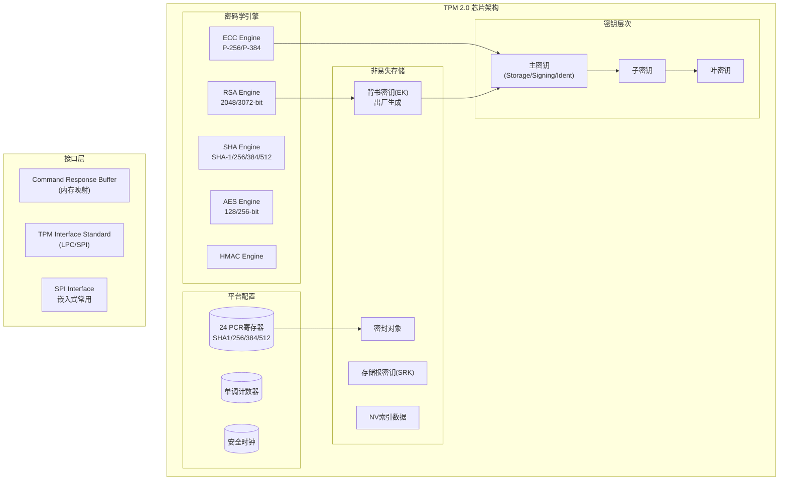
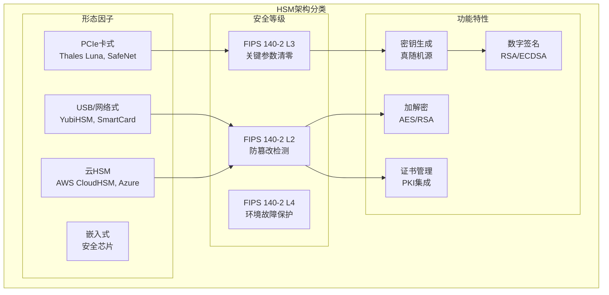

# 硬件安全：HSM、TPM 2.0与可信执行环境

> **难度等级**: L4-L5 | **预估学习时间**: 35-45小时 | **前置知识**: 密码学、计算机体系结构、安全协议

---

## 技术概述

硬件安全是构建可信计算环境的基础设施，通过专用硬件提供物理隔离、防篡改保护和密码学运算能力。本模块深入探讨三大核心技术：**可信平台模块(TPM 2.0)**、**硬件安全模块(HSM)**、**可信执行环境(TEE)**，以及侧信道防护的工程实践。

### 安全硬件的价值

根据Common Criteria和FIPS 140标准，硬件安全相比纯软件方案提供以下关键优势：

1. **物理隔离**: 密钥在专用芯片内生成、存储和使用，永不暴露在系统内存中
2. **防篡改检测**: 电压、温度、物理探测攻击检测与响应
3. **可信随机源**: 基于物理熵的真随机数生成器(TRNG)
4. **受控访问**: 多角色认证、审计日志、强制访问控制

### 技术对比

| 特性 | TPM 2.0 | 安全元件(SE) | HSM | TEE |
|:-----|:--------|:-------------|:----|:----|
| **安全级别** | FIPS 140-2 L1/L2 | EAL5+ | FIPS 140-2 L2-L4 | 依赖实现 |
| **成本** | $1-5 (集成) | $2-20 | $500-50K+ | $0-5 (SoC集成) |
| **性能** | 10-100 ops/s | 受限 | 10K-100K ops/s | 接近主CPU |
| **密钥存储** | 持久/易失 | 持久 | 持久 | 易失 |
| **标准** | TCG | GlobalPlatform | PKCS#11, FIPS | GlobalPlatform |
| **典型应用** | 设备认证、磁盘加密 | 移动支付、身份卡 | PKI、金融交易 | DRM、生物特征 |

---


---

## 📑 目录

- [硬件安全：HSM、TPM 2.0与可信执行环境](#硬件安全hsmtpm-20与可信执行环境)
  - [技术概述](#技术概述)
    - [安全硬件的价值](#安全硬件的价值)
    - [技术对比](#技术对比)
  - [📑 目录](#-目录)
  - [TPM 2.0 深度技术解析](#tpm-20-深度技术解析)
    - [TPM 2.0 架构与组件](#tpm-20-架构与组件)
    - [TPM 2.0 密钥层次结构](#tpm-20-密钥层次结构)
    - [TPM 2.0 远程证明](#tpm-20-远程证明)
  - [硬件安全模块(HSM)技术](#硬件安全模块hsm技术)
    - [HSM 架构分类](#hsm-架构分类)
    - [PKCS#11 标准接口](#pkcs11-标准接口)
  - [可信执行环境(TEE)](#可信执行环境tee)
    - [ARM TrustZone 架构](#arm-trustzone-架构)
    - [OP-TEE 安全调用流程](#op-tee-安全调用流程)
  - [侧信道攻击与防护](#侧信道攻击与防护)
    - [常见侧信道攻击类型](#常见侧信道攻击类型)
    - [常量时间密码学实现](#常量时间密码学实现)
  - [权威资料与标准](#权威资料与标准)
    - [技术标准](#技术标准)
    - [开源项目](#开源项目)
    - [推荐书籍](#推荐书籍)
  - [文件导航](#文件导航)


---

## TPM 2.0 深度技术解析

### TPM 2.0 架构与组件



### TPM 2.0 密钥层次结构

```c
/* TPM 2.0 密钥层次结构详解 */

/* 主密钥模板 (Storage Primary Seed派生) */
typedef struct {
    TPMI_ALG_PUBLIC type;           /* TPM2_ALG_RSA / TPM2_ALG_ECC */
    TPMI_ALG_HASH nameAlg;          /* TPM2_ALG_SHA256 */
    TPMA_OBJECT objectAttributes;   /* 对象属性 */
    TPM2B_DIGEST authPolicy;        /* 策略哈希 (可选) */
    TPMU_PUBLIC_PARMS parameters;   /* 算法参数 */
    TPMU_PUBLIC_ID unique;          /* 唯一标识符 */
} TPM2B_PUBLIC;

/* 对象属性定义 */
#define TPMA_OBJECT_FIXEDTPM        (1 << 1)   /* 不能离开TPM */
#define TPMA_OBJECT_STCLEAR         (1 << 2)   /* 重启后清除 */
#define TPMA_OBJECT_FIXEDPARENT     (1 << 4)   /* 不能改变父密钥 */
#define TPMA_OBJECT_SENSITIVEDATAORIGIN (1 << 5)  /* 敏感数据源于TPM */
#define TPMA_OBJECT_USERWITHAUTH    (1 << 6)   /* 用户授权 */
#define TPMA_OBJECT_ADMINWITHPOLICY (1 << 7)   /* 管理员需策略 */
#define TPMA_OBJECT_NODA            (1 << 10)  /* 无字典攻击保护 */
#define TPMA_OBJECT_RESTRICTED      (1 << 16)  /* 受限密钥(仅签名已知结构) */
#define TPMA_OBJECT_DECRYPT         (1 << 17)  /* 可用于解密 */
#define TPMA_OBJECT_SIGN_ENCRYPT    (1 << 18)  /* 可用于签名/加密 */

/* 密钥创建示例：存储密钥 */
TPM_RC create_storage_key(TSS2_SYS_CONTEXT *sys_ctx) {
    TPM2B_SENSITIVE_CREATE in_sensitive = {
        .size = 0,
        .sensitive = {
            .userAuth = { .size = 0 },  /* 空授权 */
            .data = { .size = 0 }       /* 无外部敏感数据 */
        }
    };

    TPM2B_PUBLIC in_public = {
        .size = 0,
        .publicArea = {
            .type = TPM2_ALG_RSA,
            .nameAlg = TPM2_ALG_SHA256,
            .objectAttributes =
                TPMA_OBJECT_FIXEDTPM |
                TPMA_OBJECT_FIXEDPARENT |
                TPMA_OBJECT_SENSITIVEDATAORIGIN |
                TPMA_OBJECT_USERWITHAUTH |
                TPMA_OBJECT_RESTRICTED |
                TPMA_OBJECT_DECRYPT,    /* 存储密钥用于包装子密钥 */
            .authPolicy = { .size = 0 },
            .parameters = {
                .rsaDetail = {
                    .symmetric = {
                        .algorithm = TPM2_ALG_AES,
                        .keyBits = { .aes = 128 },
                        .mode = { .aes = TPM2_ALG_CFB }
                    },
                    .scheme = { .scheme = TPM2_ALG_NULL },
                    .keyBits = 2048,
                    .exponent = 0  /* 使用默认值 2^16 + 1 */
                }
            },
            .unique = { .rsa = { .size = 0 } }
        }
    };

    TPM2B_DATA outside_info = { .size = 0 };
    TPML_PCR_SELECTION creation_pcr = { .count = 0 };

    TPM2B_PRIVATE out_private = { .size = sizeof(TPM2B_PRIVATE) - 2 };
    TPM2B_PUBLIC out_public = { .size = sizeof(TPM2B_PUBLIC) - 2 };
    TPM2B_CREATION_DATA creation_data = { .size = 0 };
    TPM2B_DIGEST creation_hash = { .size = sizeof(TPM2B_DIGEST) - 2 };
    TPMT_TK_CREATION creation_ticket = { 0 };

    TPM_RC rc = Tss2_Sys_Create(sys_ctx,
                                TPM2_RH_OWNER,      /* 父句柄: Owner层次 */
                                &cmd_auths,         /* 授权 */
                                &in_sensitive,
                                &in_public,
                                &outside_info,
                                &creation_pcr,
                                &out_private,
                                &out_public,
                                &creation_data,
                                &creation_hash,
                                &creation_ticket,
                                NULL);

    return rc;
}

/* PCR策略实现 - 用于密封存储 */
TPM_RC create_pcr_policy(TSS2_SYS_CONTEXT *sys_ctx,
                         TPML_PCR_SELECTION *pcr_selection,
                         TPM2B_DIGEST *policy_digest) {
    TPM_RC rc;
    TPMI_SH_AUTH_SESSION policy_session;

    /* 1. 启动策略会话 */
    TPM2B_NONCE nonce_caller = { .size = 20 };
    TPM2B_NONCE nonce_tpm = { .size = 0 };
    TPMT_SYM_DEF symmetric = {
        .algorithm = TPM2_ALG_AES,
        .keyBits = { .aes = 128 },
        .mode = { .aes = TPM2_ALG_CFB }
    };

    rc = Tss2_Sys_StartAuthSession(sys_ctx,
                                   TPM2_RH_NULL,      /* tpmKey */
                                   TPM2_RH_NULL,      /* bind */
                                   &cmd_auths,
                                   &nonce_caller,
                                   NULL,              /* encryptedSalt */
                                   TPM2_SE_POLICY,    /* 策略会话 */
                                   &symmetric,
                                   TPM2_ALG_SHA256,
                                   &policy_session,
                                   &nonce_tpm,
                                   NULL);
    if (rc != TPM_RC_SUCCESS) return rc;

    /* 2. 应用PolicyPCR */
    TPM2B_DIGEST pcr_digest = { .size = 0 };
    rc = Tss2_Sys_PolicyPCR(sys_ctx, policy_session,
                            &cmd_auths, &pcr_digest, pcr_selection, NULL);
    if (rc != TPM_RC_SUCCESS) {
        Tss2_Sys_FlushContext(sys_ctx, policy_session);
        return rc;
    }

    /* 3. 获取策略摘要 */
    rc = Tss2_Sys_PolicyGetDigest(sys_ctx, policy_session,
                                  &cmd_auths, policy_digest, NULL);

    /* 4. 清理会话 */
    Tss2_Sys_FlushContext(sys_ctx, policy_session);
    return rc;
}
```

### TPM 2.0 远程证明

```c
/* 远程证明流程实现 */

typedef struct {
    TPM2B_PUBLIC ek_pub;            /* 背书密钥公钥 */
    TPM2B_PUBLIC ak_pub;            /* 证明密钥公钥 */
    TPM2B_DIGEST ak_name;           /* AK名称 */
    TPM2B_DATA credential;          /* 激活凭证 */
    TPM2B_ENCRYPTED_SECRET secret;  /* 加密密钥 */
} attestation_evidence_t;

/* 步骤1: 创建证明密钥(AK) */
TPM_RC create_attestation_key(TSS2_SYS_CONTEXT *sys_ctx,
                              TPMI_DH_OBJECT ek_handle,
                              TPMI_DH_OBJECT *ak_handle,
                              attestation_evidence_t *evidence) {
    /* AK模板: 受限签名密钥 */
    TPM2B_PUBLIC ak_template = {
        .publicArea = {
            .type = TPM2_ALG_RSA,
            .nameAlg = TPM2_ALG_SHA256,
            .objectAttributes =
                TPMA_OBJECT_FIXEDTPM |
                TPMA_OBJECT_FIXEDPARENT |
                TPMA_OBJECT_SENSITIVEDATAORIGIN |
                TPMA_OBJECT_USERWITHAUTH |
                TPMA_OBJECT_RESTRICTED |
                TPMA_OBJECT_SIGN_ENCRYPT |
                TPMA_OBJECT_NODA,      /* 无字典攻击保护 */
            .parameters = {
                .rsaDetail = {
                    .symmetric = { .algorithm = TPM2_ALG_NULL },
                    .scheme = {
                        .scheme = TPM2_ALG_RSASSA,
                        .details = { .rsassa = { .hashAlg = TPM2_ALG_SHA256 } }
                    },
                    .keyBits = 2048,
                    .exponent = 0
                }
            }
        }
    };

    TPM2B_PRIVATE ak_private = {0};
    TPM2B_PUBLIC ak_public = {0};
    TPM2B_CREATION_DATA creation_data = {0};
    TPM2B_DIGEST creation_hash = {0};
    TPMT_TK_CREATION creation_ticket = {0};

    /* 创建AK */
    TPM_RC rc = Tss2_Sys_Create(sys_ctx, ek_handle, &cmd_auths,
                                &in_sensitive, &ak_template,
                                NULL, NULL,
                                &ak_private, &ak_public,
                                &creation_data, &creation_hash,
                                &creation_ticket, NULL);
    if (rc != TPM_RC_SUCCESS) return rc;

    /* 加载AK */
    rc = Tss2_Sys_Load(sys_ctx, ek_handle, &cmd_auths,
                       &ak_private, &ak_public, ak_handle, NULL, NULL);

    evidence->ak_pub = ak_public;
    return rc;
}

/* 步骤2: 生成PCR引用(Quote) */
TPM_RC generate_pcr_quote(TSS2_SYS_CONTEXT *sys_ctx,
                          TPMI_DH_OBJECT ak_handle,
                          TPML_PCR_SELECTION *pcr_selection,
                          TPM2B_DATA *extra_data,  /* 随机nonce */
                          TPM2B_ATTEST *quoted,    /* 证明数据 */
                          TPMT_SIGNATURE *signature) {
    TPM_RC rc;
    TPMI_SH_AUTH_SESSION session = TPM2_RS_PW;

    /* 使用AK对PCR状态签名 */
    rc = Tss2_Sys_Quote(sys_ctx, ak_handle, &cmd_auths,
                        extra_data,         /* 防重放随机数 */
                        pcr_selection,
                        NULL,               /* 非对称签名方案 */
                        quoted,
                        signature,
                        NULL);
    return rc;
}

/* 证明数据结构解析 */
typedef struct {
    TPM_GENERATED magic;            /* TPM_GENERATED_VALUE (0xFF544347) */
    TPMI_ST_ATTEST type;            /* TPM_ST_ATTEST_QUOTE */
    TPM2B_NAME qualified_signer;    /* 签名者名称 */
    TPM2B_DATA extra_data;          /* 调用者提供的额外数据 */
    TPMS_CLOCK_INFO clock_info;     /* 时钟信息 */
    UINT64 firmware_version;        /* 固件版本 */
    TPMS_ATTEST quote;              /* PCR引用特定数据 */
} TPMS_ATTEST_QUOTE;

typedef struct {
    TPM2B_DIGEST pcr_digest;        /* 选定PCR的哈希 */
    TPML_PCR_SELECTION pcr_select;  /* PCR选择 */
} TPMS_QUOTE_INFO;
```

---

## 硬件安全模块(HSM)技术

### HSM 架构分类



### PKCS#11 标准接口

```c
/* PKCS#11 (Cryptoki) 标准接口详解 */
#include <cryptoki.h>

/* 会话和对象管理 */
typedef CK_SESSION_HANDLE;      /* 会话句柄 */
typedef CK_OBJECT_HANDLE;       /* 对象(密钥/证书)句柄 */
typedef CK_SLOT_ID;             /* 插槽ID */

/* 密钥属性定义 */
#define CKA_TOKEN           0x00000001  /* 持久存储 */
#define CKA_PRIVATE         0x00000002  /* 需认证访问 */
#define CKA_SENSITIVE       0x00000100  /* 不可导出明文 */
#define CKA_EXTRACTABLE     0x00000162  /* 可导出 */
#define CKA_ENCRYPT         0x00000104  /* 可用于加密 */
#define CKA_DECRYPT         0x00000105  /* 可用于解密 */
#define CKA_SIGN            0x00000108  /* 可用于签名 */
#define CKA_VERIFY          0x00000109  /* 可用于验签 */
#define CKA_WRAP            0x00000106  /* 可包装其他密钥 */
#define CKA_UNWRAP          0x00000107  /* 可解包其他密钥 */

/* HSM密钥生成示例 */
CK_RV generate_hsm_key_pair(CK_SESSION_HANDLE session,
                            CK_OBJECT_HANDLE *pub_key_handle,
                            CK_OBJECT_HANDLE *priv_key_handle) {
    CK_MECHANISM mechanism = {
        CKM_RSA_PKCS_KEY_PAIR_GEN, NULL_PTR, 0
    };

    /* 公钥模板 */
    CK_ATTRIBUTE pub_template[] = {
        {CKA_TOKEN,     &false_val, sizeof(CK_BBOOL)},    /* 会话对象 */
        {CKA_ENCRYPT,   &true_val,  sizeof(CK_BBOOL)},
        {CKA_VERIFY,    &true_val,  sizeof(CK_BBOOL)},
        {CKA_WRAP,      &true_val,  sizeof(CK_BBOOL)},
        {CKA_MODULUS_BITS, &modulus_bits, sizeof(CK_ULONG)},
        {CKA_PUBLIC_EXPONENT, pub_exp, sizeof(pub_exp)}
    };

    /* 私钥模板 - 关键安全属性 */
    CK_ATTRIBUTE priv_template[] = {
        {CKA_TOKEN,     &true_val,  sizeof(CK_BBOOL)},    /* 持久存储 */
        {CKA_PRIVATE,   &true_val,  sizeof(CK_BBOOL)},    /* 需认证 */
        {CKA_SENSITIVE, &true_val,  sizeof(CK_BBOOL)},    /* 不可导出明文 */
        {CKA_EXTRACTABLE, &false_val, sizeof(CK_BBOOL)},  /* 不可提取 */
        {CKA_DECRYPT,   &true_val,  sizeof(CK_BBOOL)},
        {CKA_SIGN,      &true_val,  sizeof(CK_BBOOL)},
        {CKA_UNWRAP,    &true_val,  sizeof(CK_BBOOL)}
    };

    CK_RV rv = C_GenerateKeyPair(session, &mechanism,
                                  pub_template, 6,
                                  priv_template, 7,
                                  pub_key_handle, priv_key_handle);
    return rv;
}

/* 使用HSM进行数字签名 */
CK_RV hsm_sign_data(CK_SESSION_HANDLE session,
                    CK_OBJECT_HANDLE priv_key,
                    CK_BYTE_PTR data,
                    CK_ULONG data_len,
                    CK_BYTE_PTR signature,
                    CK_ULONG_PTR sig_len) {
    CK_MECHANISM mechanism = {
        CKM_SHA256_RSA_PKCS,  /* SHA-256 + RSA PKCS#1 v1.5 */
        NULL_PTR, 0
    };

    /* 初始化签名操作 */
    CK_RV rv = C_SignInit(session, &mechanism, priv_key);
    if (rv != CKR_OK) return rv;

    /* 执行签名 - 私钥永不离开HSM */
    rv = C_Sign(session, data, data_len, signature, sig_len);

    return rv;
}

/* HSM密钥包装 - 安全导出 */
CK_RV wrap_key_for_export(CK_SESSION_HANDLE session,
                          CK_OBJECT_HANDLE key_to_wrap,   /* 被包装密钥 */
                          CK_OBJECT_HANDLE wrapping_key,  /* 包装密钥(AES) */
                          CK_BYTE_PTR wrapped_key,
                          CK_ULONG_PTR wrapped_len) {
    CK_MECHANISM mechanism = {
        CKM_AES_GCM,        /* AES-GCM提供认证加密 */
        &gcm_params,
        sizeof(CK_GCM_PARAMS)
    };

    /* 包装操作 - 被包装密钥在HSM内加密后导出 */
    CK_RV rv = C_WrapKey(session, &mechanism,
                         wrapping_key,    /* 包装密钥 */
                         key_to_wrap,     /* 被包装密钥 */
                         wrapped_key,
                         wrapped_len);
    return rv;
}
```

---

## 可信执行环境(TEE)

### ARM TrustZone 架构

```mermaid
flowchart TB
    subgraph TrustZone["ARM TrustZone 架构"]
        subgraph NSWorld["Normal World (非安全世界)"
            NSOS["Rich OS\nLinux/Android"]
            NSAPP["Normal Apps"]
            NSKERN["Kernel\n标准驱动"]
        end

        subgraph SWorld["Secure World (安全世界)"]
            TEE["TEE OS\nOP-TEE / Trustonic"]
            TAs["Trusted Applications\n安全应用"]
            PTAs["Pseudo TAs\n核心服务"]
        end

        subgraph Hardware["硬件隔离"]
            TZASC["TrustZone Address Space Controller\n内存分区"]
            TZPC["TrustZone Protection Controller\n外设控制"]
            SCU["Snoop Control Unit\n缓存一致性"]
            GIC["Generic Interrupt Controller\n中断路由"]
        end

        subgraph Monitor["Monitor Mode (EL3)"]
            SMC["SMC指令处理\n世界切换"]
            RT["运行时固件\nBL31"]
        end
    end

    NSAPP -->|CA| TAs
    NSOS -->|SMC| SMC -->|切换| SWorld
    TEE -->|调用| TZASC -->|访问| Hardware
```

### OP-TEE 安全调用流程

```c
/* OP-TEE 客户端API */
#include <tee_client_api.h>

/* 安全会话建立 */
TEEC_Result open_ta_session(TEEC_Context *ctx,
                            TEEC_Session *sess,
                            const TEEC_UUID *ta_uuid) {
    TEEC_Operation op = {0};
    uint32_t origin;

    /* 打开与TA的会话 */
    TEEC_Result res = TEEC_OpenSession(ctx, sess, ta_uuid,
                                        TEEC_LOGIN_PUBLIC,
                                        NULL, &op, &origin);
    return res;
}

/* 调用安全服务 */
TEEC_Result invoke_secure_storage(TEEC_Session *sess,
                                  uint32_t command_id,
                                  void *data,
                                  size_t data_len) {
    TEEC_Operation op = {0};
    uint32_t origin;

    /* 设置参数 - 共享内存 */
    TEEC_SharedMemory shm = {
        .buffer = data,
        .size = data_len,
        .flags = TEEC_MEM_INPUT | TEEC_MEM_OUTPUT
    };
    TEEC_RegisterSharedMemory(sess->ctx, &shm);

    op.paramTypes = TEEC_PARAM_TYPES(TEEC_MEMREF_WHOLE,
                                      TEEC_NONE,
                                      TEEC_NONE,
                                      TEEC_NONE);
    op.params[0].memref.parent = &shm;
    op.params[0].memref.offset = 0;
    op.params[0].memref.size = data_len;

    /* 调用TA */
    TEEC_Result res = TEEC_InvokeCommand(sess, command_id, &op, &origin);

    TEEC_ReleaseSharedMemory(&shm);
    return res;
}

/* TA端安全存储实现 */
TEE_Result store_secure_object(uint32_t param_types,
                               TEE_Param params[4]) {
    const uint32_t exp_types = TEE_PARAM_TYPES(TEE_PARAM_TYPE_MEMREF_INPUT,
                                                TEE_PARAM_TYPE_NONE,
                                                TEE_PARAM_TYPE_NONE,
                                                TEE_PARAM_TYPE_NONE);
    if (param_types != exp_types)
        return TEE_ERROR_BAD_PARAMETERS;

    /* 创建或打开安全对象 */
    TEE_ObjectHandle object;
    TEE_Result res = TEE_CreatePersistentObject(
        TEE_STORAGE_PRIVATE,        /* 安全存储区域 */
        object_id, object_id_len,
        TEE_DATA_FLAG_ACCESS_WRITE, /* 访问权限 */
        TEE_HANDLE_NULL,            /* 不使用密钥 */
        NULL, 0,                    /* 初始数据 */
        &object);

    if (res != TEE_SUCCESS)
        return res;

    /* 写入数据 - 自动加密存储到RPMB */
    res = TEE_WriteObjectData(object,
                              params[0].memref.buffer,
                              params[0].memref.size);

    TEE_CloseObject(object);
    return res;
}
```

---

## 侧信道攻击与防护

### 常见侧信道攻击类型

| 攻击类型 | 原理 | 目标信息 | 防护措施 |
|:---------|:-----|:---------|:---------|
| **时序攻击** | 运算时间差异 | 密钥位 | 常量时间实现 |
| **功耗分析(SPA/DPA)** | 功耗模式 | 密钥 | 功耗平衡、随机延迟 |
| **电磁分析(EMA)** | 电磁辐射 | 密钥 | 屏蔽、噪声注入 |
| **缓存时序攻击** | 缓存访问时间 | 密钥、数据 | 缓存清空、禁用共享 |
| **故障注入** | 电压/时钟毛刺 | 错误输出 | 传感器检测、冗余 |

### 常量时间密码学实现

```c
/* 常量时间比较 - 防止时序攻击 */
int constant_time_memcmp(const uint8_t *a,
                         const uint8_t *b,
                         size_t len) {
    volatile uint8_t result = 0;

    for (size_t i = 0; i < len; i++) {
        result |= a[i] ^ b[i];  /* XOR累积，无分支 */
    }

    return result;  /* 0表示相等，非0表示不等 */
}

/* 常量时间条件选择 */
uint32_t constant_time_select(uint32_t mask,    /* 全0或全1 */
                              uint32_t a,       /* mask=1时选择 */
                              uint32_t b) {     /* mask=0时选择 */
    return (mask & a) | (~mask & b);
}

/* 常量时间幂运算 (RSA/ECC) */
void constant_time_expmod(const bignum_t *base,
                          const bignum_t *exp,
                          const bignum_t *mod,
                          bignum_t *result) {
    /* Montgomery ladder - 每比特固定操作 */
    bignum_t r0 = 1, r1 = base;

    for (int i = exp->bitlen - 1; i >= 0; i--) {
        uint32_t bit = (exp->words[i / 32] >> (i % 32)) & 1;
        uint32_t mask = 0 - bit;  /* 0或0xFFFFFFFF */

        /* 始终进行两次乘法，根据比特选择结果 */
        bignum_t t0 = montgomery_mult(r0, r0, mod);
        bignum_t t1 = montgomery_mult(r0, r1, mod);

        r0 = constant_time_select(mask, t1, t0);
        r1 = constant_time_select(mask,
            montgomery_mult(r1, r1, mod), t1);
    }

    *result = r0;
}

/* 缓存攻击防护 - 内存访问模式隐藏 */
void cache_safe_aes_sbox(uint8_t *state) {
    /* 使用bit-slicing或查找表随机化 */
    static const uint8_t sbox[256] = { /* AES S-box */ };

    /* 方法1: 预加载整个表到缓存 */
    volatile uint8_t dummy = 0;
    for (int i = 0; i < 256; i++) {
        dummy |= sbox[i];  /* 访问所有条目 */
    }

    /* 方法2: 使用掩码避免直接索引 */
    for (int i = 0; i < 16; i++) {
        uint8_t idx = state[i];
        /* 通过线性扫描隐藏访问模式 */
        uint8_t result = 0;
        for (int j = 0; j < 256; j++) {
            uint8_t mask = constant_time_eq(j, idx);
            result |= mask & sbox[j];
        }
        state[i] = result;
    }
}
```

---

## 权威资料与标准

### 技术标准

| 标准 | 组织 | 说明 |
|:-----|:-----|:-----|
| **TCG TPM 2.0 Library Spec** | Trusted Computing Group | TPM 2.0完整规范 (Part 1-4) |
| **TCG TSS 2.0 Spec** | TCG | 可信软件栈规范 |
| **PKCS#11 v3.0** | OASIS | 密码学令牌接口标准 |
| **FIPS 140-2/140-3** | NIST | 密码模块安全要求 |
| **Common Criteria** | ISO/IEC 15408 | 信息技术安全性评估 |
| **GlobalPlatform TEE** | GlobalPlatform | TEE系统架构规范 |
| **ARM TrustZone** | ARM Ltd. | 安全技术参考手册 |

### 开源项目

| 项目 | 链接 | 说明 |
|:-----|:-----|:-----|
| **tpm2-tss** | github.com/tpm2-software/tpm2-tss | TPM 2.0 TSS实现 |
| **tpm2-tools** | github.com/tpm2-software/tpm2-tools | TPM 2.0命令行工具 |
| **OP-TEE** | github.com/OP-TEE/optee_os | 开源TEE实现 |
| **SoftHSM** | github.com/opendnssec/SoftHSMv2 | 软件HSM模拟器 |
| **OpenSSL** | github.com/openssl/openssl | 含ENGINE HSM支持 |

### 推荐书籍

1. **《A Practical Guide to TPM 2.0》** - Will Arthur et al. (Apress, 2015)
2. **《Security Engineering》** - Ross Anderson (Wiley, 2020)
3. **《Cryptography Engineering》** - Ferguson, Schneier, Kohno (Wiley, 2015)
4. **《Hardware Security》** - Debdeep Mukhopadhyay (CRC Press, 2018)

---

## 文件导航

| 文件名 | 内容描述 | 难度 | 行数 |
|:-------|:---------|:-----|:-----|
| [01_TPM2_TSS.md](./01_TPM2_TSS.md) | TPM 2.0软件栈详解 | L4 | ~560行 |
| [02_Key_Sealing.md](./02_Key_Sealing.md) | 密钥密封与策略 | L4 | ~630行 |
| [02_Secure_Element.md](./02_Secure_Element.md) | 安全元件与APDU | L4 | ~750行 |
| [03_HSM_Integration.md](./03_HSM_Integration.md) | HSM与PKCS#11 | L4 | ~1000行 |

---

> [← 返回上级目录](../README.md)
>
> **最后更新**: 2026-03-13
>
> **参考文献**: TCG TPM 2.0 Library Spec Part 1-4, PKCS#11 v3.0, NIST FIPS 140-3
