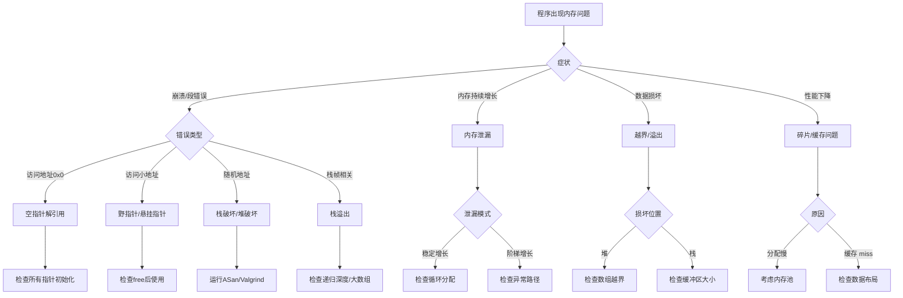

# C语言内存管理深度解析（形式化版）

> **层级定位**: 01 Core Knowledge System / 02 Core Layer
> **对应标准**: C89/C99/C11/C17/C23
> **难度级别**: L3 应用 → L5 综合
> **预估学习时间**: 10-16 小时

---

## 📋 本节概要

| 属性 | 内容 |
|:-----|:-----|
| **核心概念** | 内存布局、堆分配器、内存泄漏、缓冲区溢出、对齐、内存模型、分配器算法、内存池、零拷贝 |
| **前置知识** | 指针、数据类型系统、结构体、操作系统基础 |
| **后续延伸** | 垃圾回收原理、虚拟内存、性能优化、自定义分配器 |
| **权威来源** | K&R Ch8.7, CSAPP Ch9, Modern C Level 2, CERT MEM系列, Drepper "What Every Programmer Should Know About Memory" |

---


---

## 📑 目录

- [C语言内存管理深度解析（形式化版）](#c语言内存管理深度解析形式化版)
  - [📋 本节概要](#-本节概要)
  - [📑 目录](#-目录)
  - [🧠 知识结构思维导图](#-知识结构思维导图)
    - [内存管理全景图](#内存管理全景图)
    - [分配函数选择决策图](#分配函数选择决策图)
    - [内存问题诊断图](#内存问题诊断图)
  - [📐 第一部分：概念定义（形式化）](#-第一部分概念定义形式化)
    - [1.1 内存分配的数学模型](#11-内存分配的数学模型)
      - [1.1.1 内存作为地址到值的映射](#111-内存作为地址到值的映射)
      - [1.1.2 堆的数学模型](#112-堆的数学模型)
    - [1.2 内存生命周期的严格定义](#12-内存生命周期的严格定义)
      - [1.2.1 内存对象的生命周期状态机](#121-内存对象的生命周期状态机)
      - [1.2.2 各存储类别的生命周期](#122-各存储类别的生命周期)
    - [1.3 内存碎片化的形式化描述](#13-内存碎片化的形式化描述)
      - [1.3.1 碎片化的数学定义](#131-碎片化的数学定义)
      - [1.3.2 碎片度量指标](#132-碎片度量指标)
    - [1.4 内存对齐的数学基础](#14-内存对齐的数学基础)
      - [1.4.1 对齐的形式化定义](#141-对齐的形式化定义)
      - [1.4.2 对齐与硬件架构](#142-对齐与硬件架构)
  - [📊 第二部分：属性维度矩阵](#-第二部分属性维度矩阵)
    - [2.1 分配函数全面对比矩阵](#21-分配函数全面对比矩阵)
      - [表2.1：标准分配函数特性对比](#表21标准分配函数特性对比)
      - [表2.2：分配函数适用场景决策](#表22分配函数适用场景决策)
    - [2.2 内存区域属性对比矩阵](#22-内存区域属性对比矩阵)
      - [表2.3：内存区域全面对比](#表23内存区域全面对比)
      - [表2.4：内存区域访问权限](#表24内存区域访问权限)
    - [2.3 对齐要求矩阵](#23-对齐要求矩阵)
      - [表2.5：基础类型对齐要求（典型平台）](#表25基础类型对齐要求典型平台)
      - [表2.6：SIMD类型对齐要求](#表26simd类型对齐要求)
      - [表2.7：缓存对齐要求](#表27缓存对齐要求)
    - [2.4 内存分配器特性对比](#24-内存分配器特性对比)
      - [表2.8：主流分配器全面对比](#表28主流分配器全面对比)
      - [表2.9：分配器性能特征](#表29分配器性能特征)
    - [2.5 内存错误类型与检测矩阵](#25-内存错误类型与检测矩阵)
      - [表2.10：内存错误检测能力](#表210内存错误检测能力)
  - [📝 第三部分：形式化描述](#-第三部分形式化描述)
    - [3.1 内存分配器的抽象数据类型](#31-内存分配器的抽象数据类型)
      - [3.1.1 分配器ADT定义](#311-分配器adt定义)
      - [3.1.2 分配器不变式](#312-分配器不变式)
    - [3.2 内存块的元数据结构](#32-内存块的元数据结构)
      - [3.2.1 隐式空闲链表块结构](#321-隐式空闲链表块结构)
      - [3.2.2 显式空闲链表块结构](#322-显式空闲链表块结构)
      - [3.2.3 分离空闲列表（Segregated Fit）](#323-分离空闲列表segregated-fit)
    - [3.3 内存管理的不变式（Invariants）](#33-内存管理的不变式invariants)
      - [3.3.1 堆不变式](#331-堆不变式)
      - [3.3.2 指针有效性不变式](#332-指针有效性不变式)
      - [3.3.3 分配/释放配对规则](#333-分配释放配对规则)
  - [💻 第四部分：示例矩阵](#-第四部分示例矩阵)
    - [4.1 基本分配模式](#41-基本分配模式)
      - [4.1.1 单对象分配模式](#411-单对象分配模式)
      - [4.1.2 数组分配模式](#412-数组分配模式)
      - [4.1.3 结构体数组分配模式](#413-结构体数组分配模式)
    - [4.2 动态数组实现（扩容策略）](#42-动态数组实现扩容策略)
    - [4.3 内存池实现](#43-内存池实现)
    - [4.4 自定义分配器框架](#44-自定义分配器框架)
    - [4.5 零拷贝技术](#45-零拷贝技术)
  - [⚠️ 第五部分：反例/陷阱（12+详细案例）](#️-第五部分反例陷阱12详细案例)
    - [5.1 内存泄漏（多种模式）](#51-内存泄漏多种模式)
      - [陷阱1.1: 异常路径未释放](#陷阱11-异常路径未释放)
      - [陷阱1.2: 循环中泄漏](#陷阱12-循环中泄漏)
      - [陷阱1.3: 所有权混乱导致的泄漏](#陷阱13-所有权混乱导致的泄漏)
    - [5.2 使用已释放内存（UAF - Use After Free）](#52-使用已释放内存uaf---use-after-free)
    - [5.3 双重释放（Double Free）](#53-双重释放double-free)
    - [5.4 缓冲区溢出（堆/栈）](#54-缓冲区溢出堆栈)
      - [5.4.1 堆缓冲区溢出](#541-堆缓冲区溢出)
      - [5.4.2 栈缓冲区溢出](#542-栈缓冲区溢出)
    - [5.5 未初始化内存使用](#55-未初始化内存使用)
    - [5.6 越界访问](#56-越界访问)
    - [5.7 对齐违规](#57-对齐违规)
    - [5.8 分配失败未检查](#58-分配失败未检查)
    - [5.9 大小计算溢出](#59-大小计算溢出)
    - [5.10 不匹配分配/释放](#510-不匹配分配释放)
    - [5.11 栈溢出](#511-栈溢出)
    - [5.12 内存碎片导致分配失败](#512-内存碎片导致分配失败)
  - [🌳 第六部分：思维导图](#-第六部分思维导图)
    - [6.1 内存管理全景图](#61-内存管理全景图)
    - [6.2 内存问题诊断决策图](#62-内存问题诊断决策图)
  - [🌲 第七部分：决策树](#-第七部分决策树)
    - [7.1 分配函数选择决策树](#71-分配函数选择决策树)
    - [7.2 内存问题诊断决策树](#72-内存问题诊断决策树)
    - [7.3 内存优化策略决策树](#73-内存优化策略决策树)
  - [✅ 第八部分：最佳实践](#-第八部分最佳实践)
    - [8.1 内存分配黄金法则](#81-内存分配黄金法则)
    - [8.2 防御性编程技巧](#82-防御性编程技巧)
      - [8.2.1 安全宏集合](#821-安全宏集合)
      - [8.2.2 所有权注解模式](#822-所有权注解模式)
    - [8.3 性能优化策略](#83-性能优化策略)
      - [8.3.1 分配优化策略矩阵](#831-分配优化策略矩阵)
      - [8.3.2 内存布局优化示例](#832-内存布局优化示例)
      - [8.3.3 调试与发布配置](#833-调试与发布配置)
  - [🔗 权威来源引用](#-权威来源引用)
  - [✅ 质量验收清单](#-质量验收清单)


---

## 🧠 知识结构思维导图

### 内存管理全景图


### 分配函数选择决策图


### 内存问题诊断图


---

## 📐 第一部分：概念定义（形式化）

### 1.1 内存分配的数学模型

#### 1.1.1 内存作为地址到值的映射

**定义 1.1.1：内存状态**

内存 `M` 是一个从地址空间到字节值的偏函数：

```
M: AddressSpace ⇀ Byte
AddressSpace = {0, 1, 2, ..., 2^n - 1}, n ∈ {32, 64}
Byte = {0, 1, ..., 255}
```

**定义 1.1.2：内存块**

内存块 `B` 是一个三元组 `(base, size, state)`：

```
B = (b, s, σ) 其中:
  b ∈ AddressSpace          // 基地址
  s ∈ ℕ, s > 0              // 大小（字节）
  σ ∈ {ALLOCATED, FREE}     // 状态

有效地址范围: [b, b + s - 1] ⊆ AddressSpace
```

**定义 1.1.3：分配操作的形式化**

```
alloc(M, size, align) = (M', ptr)  或  ⊥

前置条件:
  ∃b ∈ AddressSpace:
    Aligned(b, align) ∧
    ∀i ∈ [0, size-1]: M(b + i) = ⊥  // 地址未被占用

后置条件:
  ptr = b
  M' = M ∪ {(b + i) ↦ 0 | i ∈ [0, size-1]}  // 分配并可选清零
  Block(M', ptr, size) = ALLOCATED
```

**定义 1.1.4：释放操作的形式化**

```
free(M, ptr) = M'  或  ⊥

前置条件:
  Block(M, ptr, _) = ALLOCATED  // 必须是已分配的有效块

后置条件:
  M' = M \ {(ptr + i) ↦ _ | i ∈ [0, size-1]}  // 移除映射
  Block(M', ptr, size) = FREE
```

#### 1.1.2 堆的数学模型

**定义 1.1.5：堆作为内存块的集合**

```
Heap = {B₁, B₂, ..., Bₙ} 其中 Bᵢ = (bᵢ, sᵢ, σᵢ)

不变式（Invariants）:
I1: 不重叠: ∀i≠j, [bᵢ, bᵢ+sᵢ) ∩ [bⱼ, bⱼ+sⱼ) = ∅
I2: 连续性: 没有两个相邻的空闲块（可合并性）
I3: 对齐性: ∀Bᵢ, Aligned(bᵢ, min_align)
```

### 1.2 内存生命周期的严格定义

#### 1.2.1 内存对象的生命周期状态机

```
                    ┌──────────────┐
                    │   UNINIT     │
                    │  (未初始化)   │
                    └──────┬───────┘
                           │ malloc/calloc/声明
                           ▼
┌─────────────────┐   ┌──────────────┐   ┌─────────────────┐
│    INVALID      │◄──│   VALID      │──►│    FREED        │
│   (无效/越界)    │   │  (有效可用)   │   │   (已释放)       │
└─────────────────┘   └──────┬───────┘   └─────────────────┘
       ▲                     │                     │
       │                     │ free                │ use-after-free
       └─────────────────────┘◄────────────────────┘
```

**定义 1.2.1：生命周期状态**

```
Lifecycle = {UNINIT, VALID, FREED, INVALID}

状态转换函数:
  δ: MemoryObject × Operation → Lifecycle

δ(obj, allocate)   = VALID      (从UNINIT)
δ(obj, initialize) = VALID      (从UNINIT)
δ(obj, access)     = VALID      (需要当前为VALID)
δ(obj, free)       = FREED      (从VALID)
δ(obj, access)     = INVALID    (从FREED → UAF)
δ(obj, outofbound) = INVALID    (从VALID)
```

#### 1.2.2 各存储类别的生命周期

| 存储类别 | 分配点 | 释放点 | 生命周期 | 作用域 |
|:---------|:-------|:-------|:---------|:-------|
| 自动变量（栈） | 进入块 | 离开块 | LIFO | 块 |
| 静态变量 | 程序启动 | 程序终止 | 全局 | 文件/内部 |
| 线程本地 | 线程创建 | 线程终止 | 线程 | 声明范围 |
| 动态分配（堆） | malloc | free | 显式控制 | 程序员控制 |
| 内存映射 | mmap | munmap | 显式控制 | 映射范围 |

### 1.3 内存碎片化的形式化描述

#### 1.3.1 碎片化的数学定义

**定义 1.3.1：内部碎片**

```
内部碎片: 已分配块中未使用的空间

给定分配请求 r = (size_req, align_req)
实际分配: actual_size = ⌈size_req / granularity⌉ × granularity

InternalFragmentation(r) = actual_size - size_req

碎片率: IF_rate = (actual_size - size_req) / actual_size
```

**定义 1.3.2：外部碎片**

```
外部碎片: 空闲内存总量足够但无法分配连续块

设堆状态 H = {B₁, ..., Bₙ}
总空闲内存: FreeTotal = Σ{sᵢ | Bᵢ.state = FREE}
最大连续空闲: MaxContiguous = max{sᵢ | Bᵢ.state = FREE}

外部碎片度量:
  EF = FreeTotal - MaxContiguous

分配失败条件（对于请求大小 r）:
  FreeTotal ≥ r ∧ MaxContiguous < r  →  外部碎片导致失败
```

#### 1.3.2 碎片度量指标

| 指标 | 公式 | 解释 |
|:-----|:-----|:-----|
| 碎片系数 | `F = 1 - MaxContiguous / FreeTotal` | 0表示无碎片，接近1表示严重碎片 |
| 分配成功率 | `P(success) = #成功分配 / #总请求` | 实际分配能力指标 |
| 平均碎片大小 | `avg = Σsᵢ / n_free` | 空闲块平均大小 |
| 碎片数量 | `n_free` | 空闲块总数 |

### 1.4 内存对齐的数学基础

#### 1.4.1 对齐的形式化定义

**定义 1.4.1：对齐要求**

```
对齐要求: 类型T的对象必须存储在地址A满足:

Aligned(A, T) ↔ A mod alignof(T) = 0

其中:
  alignof(T) = 2^k, k ≥ 0  (必须是2的幂)

常见类型的对齐要求:
  alignof(char)    = 1
  alignof(short)   = 2
  alignof(int)     = 4
  alignof(long)    = 4 或 8 (平台相关)
  alignof(long long) = 8
  alignof(float)   = 4
  alignof(double)  = 8
  alignof(void*)   = 4 或 8 (32/64位)
```

**定义 1.4.2：对齐填充计算**

```
对于结构体 S = {T₁ f₁; T₂ f₂; ...; Tₙ fₙ}:

offsetof(f₁) = 0
offsetof(fᵢ) = padding(Σⱼ₌₁ⁱ⁻¹ sizeof(Tⱼ), alignof(Tᵢ))

其中 padding 函数:
  padding(current, align) = ⌈current / align⌉ × align

总大小:
  sizeof(S) = padding(Σ sizeof(Tᵢ) + 内部填充, alignof(S))
```

#### 1.4.2 对齐与硬件架构

| 架构 | 自然字长 | 对齐要求严格度 | 未对齐访问代价 |
|:-----|:---------|:---------------|:---------------|
| x86/x86-64 | 64位 | 宽松（硬件处理） | 1-3周期额外惩罚 |
| ARMv7 | 32位 | 中等 | 可能产生异常 |
| ARMv8 (AArch64) | 64位 | 严格 | 必须对齐或显式处理 |
| RISC-V | 32/64位 | 严格 | 未定义行为 |
| MIPS | 32/64位 | 严格 | 地址错误异常 |
| SPARC | 64位 | 严格 | 总线错误 |

---

## 📊 第二部分：属性维度矩阵

### 2.1 分配函数全面对比矩阵

#### 表2.1：标准分配函数特性对比

| 特性 | `malloc` | `calloc` | `realloc` | `aligned_alloc` | `reallocarray` |
|:-----|:--------:|:--------:|:---------:|:---------------:|:--------------:|
| **C标准版本** | C89 | C89 | C89 | C11 | POSIX (BSD) |
| **函数原型** | `void* malloc(size_t)` | `void* calloc(size_t, size_t)` | `void* realloc(void*, size_t)` | `void* aligned_alloc(size_t, size_t)` | `void* reallocarray(void*, size_t, size_t)` |
| **初始化** | 未定义 | 零初始化(0) | 保留原内容 | 未定义 | 保留原内容 |
| **对齐保证** | `max_align_t` | `max_align_t` | `max_align_t` | 用户指定 | `max_align_t` |
| **失败返回值** | NULL | NULL | NULL | NULL | NULL |
| **原地扩展可能** | - | - | ✅ 可能 | - | ✅ 可能 |
| **数组语义** | 手动计算 | `nmemb * size` | - | 手动计算 | `nmemb * size` (溢出检查) |
| **溢出安全** | ❌ | ❌ (部分) | ❌ | ❌ | ✅ 检查乘法溢出 |
| **零大小行为** | 实现定义 | 实现定义 | 释放/返回可释放指针 | 错误(UB) | 实现定义 |
| **释放方式** | `free` | `free` | `free` | `free` | `free` |
| **线程安全** | 实现依赖 | 实现依赖 | 实现依赖 | 实现依赖 | 实现依赖 |

#### 表2.2：分配函数适用场景决策

| 场景 | 推荐函数 | 理由 | 反例/陷阱 |
|:-----|:---------|:-----|:----------|
| 单对象分配 | `malloc` | 最简单直接 | 忘记检查NULL |
| 数组分配（已知数量） | `calloc` | 自动清零+计算大小 | `calloc`比`malloc`+`memset`可能更高效 |
| 数组分配（可能溢出） | `reallocarray` | 乘法溢出检查 | 非标准C函数 |
| 动态扩容数组 | `realloc` | 原地扩展可能更高效 | 使用原指针接收返回值 |
| SIMD/DMA缓冲区 | `aligned_alloc` | 对齐保证 | 大小必须是alignment的倍数 |
| 结构体数组 | `calloc` | 清零初始化所有成员 | 指针成员仍为NULL需单独处理 |
| 字符串缓冲区 | `malloc`/`calloc` | 预留空间给`\0` | 忘记+1字节 |

### 2.2 内存区域属性对比矩阵

#### 表2.3：内存区域全面对比

| 属性 | 栈(Stack) | 堆(Heap) | 静态/全局(Static) | 内存映射(MMap) |
|:-----|:---------:|:--------:|:-----------------:|:--------------:|
| **分配速度** | ⚡⚡⚡ 极快 | ⚡ 较慢 | ⚡⚡ 快（启动时） | ⚡ 慢（系统调用） |
| **释放速度** | ⚡⚡⚡ 极快 | ⚡ 较慢 | -（程序结束） | ⚡ 慢 |
| **大小限制** | 小（通常1-8MB） | 大（可用虚拟内存） | 中等 | 很大（文件大小） |
| **碎片化** | 无（LIFO） | 有 | 无 | 无 |
| **生命周期控制** | 自动（LIFO） | 显式 | 全局 | 显式 |
| **线程安全** | 是（每个线程独立栈） | 需同步 | 是（只读）/需锁（读写） | 需同步 |
| **初始化** | 未定义 | 未定义/零(calloc) | 零/显式 | 文件内容/零 |
| **增长方向** | 向下 | 向上 | - | - |
| **访问局部性** | 优秀 | 一般 | 优秀 | 依赖访问模式 |
| **调试难度** | 中等（栈溢出） | 难（复杂bug） | 低 | 中等 |
| **典型用途** | 局部变量、函数调用 | 动态数据结构 | 全局配置、常量 | 大文件、共享内存 |

#### 表2.4：内存区域访问权限

| 区域 | 读(R) | 写(W) | 执行(X) | 说明 |
|:-----|:-----:|:-----:|:-------:|:-----|
| 代码段(Text) | ✅ | ❌ | ✅ | 通常只读可执行 |
| 数据段(Data) | ✅ | ✅ | ❌ | 已初始化全局变量 |
| BSS段 | ✅ | ✅ | ❌ | 零初始化，不占文件空间 |
| 堆(Heap) | ✅ | ✅ | ❌ | 动态分配 |
| 栈(Stack) | ✅ | ✅ | ❌ | 通常不可执行（NX位） |
| 内存映射区 | 可变 | 可变 | 可变 | 根据映射参数 |

### 2.3 对齐要求矩阵

#### 表2.5：基础类型对齐要求（典型平台）

| 类型 | x86-32 | x86-64 | ARM32 | ARM64 | 大小(32/64位) |
|:-----|:------:|:------:|:-----:|:-----:|:-------------:|
| `char` | 1 | 1 | 1 | 1 | 1 |
| `short` | 2 | 2 | 2 | 2 | 2 |
| `int` | 4 | 4 | 4 | 4 | 4 |
| `long` | 4 | 8 | 4 | 8 | 4/8 |
| `long long` | 8 | 8 | 8 | 8 | 8 |
| `float` | 4 | 4 | 4 | 4 | 4 |
| `double` | 8 | 8 | 8 | 8 | 8 |
| `long double` | 12/16 | 16 | 8 | 16 | 12/16 |
| `void*` | 4 | 8 | 4 | 8 | 4/8 |
| `size_t` | 4 | 8 | 4 | 8 | 4/8 |
| `max_align_t` | 16 | 16 | 8 | 16 | 16 |

#### 表2.6：SIMD类型对齐要求

| SIMD类型 | 对齐要求 | 典型用途 | 指令集 |
|:---------|:---------|:---------|:-------|
| `__m128` (SSE) | 16字节 | 4xfloat/2xdouble | SSE/SSE2 |
| `__m256` (AVX) | 32字节 | 8xfloat/4xdouble | AVX/AVX2 |
| `__m512` (AVX-512) | 64字节 | 16xfloat/8xdouble | AVX-512 |
| `float32x4_t` (NEON) | 16字节 | ARM SIMD | NEON |
| `int64x2_t` (NEON) | 16字节 | ARM整数SIMD | NEON |

#### 表2.7：缓存对齐要求

| 缓存层级 | 缓存行大小 | 对齐策略 | 伪共享避免 |
|:---------|:-----------|:---------|:-----------|
| L1 Cache | 64字节 | 64字节对齐热点数据 | 独立变量间隔≥64字节 |
| L2 Cache | 64字节 | 同上 | 同上 |
| L3 Cache | 64字节 | 同上 | 同上 |
| 页大小 | 4KB | 页对齐大缓冲区 | - |
| 大页 | 2MB/1GB | 大页对齐（数据库/VMM） | - |

### 2.4 内存分配器特性对比

#### 表2.8：主流分配器全面对比

| 特性 | ptmalloc (glibc) | jemalloc (FreeBSD/Facebook) | tcmalloc (Google) | mimalloc (Microsoft) | dlmalloc |
|:-----|:----------------:|:---------------------------:|:-----------------:|:--------------------:|:--------:|
| **默认环境** | Linux glibc | FreeBSD, Firefox, Redis | Chrome, gperftools | Windows, Rust | 嵌入式 |
| **并发策略** | 每 arenas + 锁 | 每线程 arenas | 每线程缓存 + 中央堆 | 每线程空闲列表 | 全局锁 |
| **小对象优化** | 是 | 优秀 | 优秀 | 优秀 | 有限 |
| **扩展性** | 良好 | 优秀 | 优秀 | 优秀 | 一般 |
| **内存碎片** | 中等 | 低 | 低 | 极低 | 中等 |
| **配置灵活性** | 环境变量 | 丰富的API | API | 中等 | 编译时 |
| **调试支持** | mcheck | 内置profiling | 内置profiling | 内置安全特性 | 有限 |
| **实时性** | 一般 | 良好 | 良好 | 优秀（确定性） | 一般 |
| **内存归还** | 延迟（trim阈值） | 积极 | 积极 | 积极 | 延迟 |
| **大小类粒度** | 粗 | 细 | 细 | 细 | 中等 |

#### 表2.9：分配器性能特征

| 指标 | ptmalloc | jemalloc | tcmalloc | mimalloc |
|:-----|:--------:|:--------:|:--------:|:--------:|
| 单线程alloc | 基准 | +5% | +10% | +15% |
| 多线程alloc | 基准 | +30% | +25% | +35% |
| 内存开销 | 中等 | 低 | 低 | 极低 |
| 小对象(<256B)速度 | 快 | 极快 | 极快 | 极快 |
| 大对象(>1MB)速度 | 慢 | 中等 | 中等 | 中等 |

### 2.5 内存错误类型与检测矩阵

#### 表2.10：内存错误检测能力

| 错误类型 | ASan | MSan | TSan | UBSan | Valgrind | 静态分析 |
|:---------|:----:|:----:|:----:|:-----:|:--------:|:--------:|
| 堆缓冲区溢出 | ✅ | ❌ | ❌ | ❌ | ✅ | ⚠️ |
| 栈缓冲区溢出 | ✅ | ❌ | ❌ | ❌ | ✅ | ⚠️ |
| 全局缓冲区溢出 | ✅ | ❌ | ❌ | ❌ | ✅ | ⚠️ |
| Use-after-free | ✅ | ❌ | ❌ | ❌ | ✅ | ⚠️ |
| 双重释放 | ✅ | ❌ | ❌ | ❌ | ✅ | ✅ |
| 内存泄漏 | ✅ | ❌ | ❌ | ❌ | ✅ | ✅ |
| 未初始化读取 | ❌ | ✅ | ❌ | ❌ | ✅ | ✅ |
| 数据竞争 | ❌ | ❌ | ✅ | ❌ | Helgrind | ⚠️ |
| 整数溢出 | ❌ | ❌ | ❌ | ✅ | ❌ | ⚠️ |
| 对齐违规 | ❌ | ❌ | ❌ | ✅ | ⚠️ | ⚠️ |
| 性能开销 | 2-3x | 3x | 5-15x | <1.5x | 10-50x | - |

---

## 📝 第三部分：形式化描述

### 3.1 内存分配器的抽象数据类型

#### 3.1.1 分配器ADT定义

```
ADT MemoryAllocator:
    // 类型定义
    type Block = (address: Addr, size: Size, state: {FREE, ALLOCATED})
    type AllocatorState = {blocks: Set<Block>, stats: Statistics}

    // 操作签名
    malloc:  AllocatorState × Size × Alignment → Result(Addr, AllocatorState)
    calloc:  AllocatorState × Count × Size → Result(Addr, AllocatorState)
    realloc: AllocatorState × Addr × Size → Result(Addr, AllocatorState)
    free:    AllocatorState × Addr → AllocatorState

    // 前置条件
    pre malloc(s, sz, align):  sz > 0 ∧ align = 2^k
    pre calloc(s, n, sz):      n > 0 ∧ sz > 0
    pre realloc(s, ptr, sz):   owns(s, ptr) ∨ ptr = NULL
    pre free(s, ptr):          owns(s, ptr)

    // 后置条件
    post malloc(s, sz, align):
        let (ptr, s') = result in
        aligned(ptr, align) ∧
        size(block(s', ptr)) ≥ sz ∧
        state(block(s', ptr)) = ALLOCATED

    post free(s, ptr):
        let s' = result in
        state(block(s', ptr)) = FREE
```

#### 3.1.2 分配器不变式

```
// 全局不变式（必须始终保持）
Invariant ValidAllocator(a: AllocatorState):
    I1: 不重叠: ∀b₁,b₂ ∈ a.blocks, b₁ ≠ b₂ → disjoint(b₁, b₂)
    I2: 状态一致: ∀b ∈ a.blocks, b.state ∈ {FREE, ALLOCATED}
    I3: 无连续空闲: ¬∃b₁,b₂ ∈ a.blocks:
            b₁.state = FREE ∧ b₂.state = FREE ∧ adjacent(b₁, b₂)
    I4: 元数据完整: ∀b ∈ a.blocks, metadata_integrity(b)
    I5: 对齐保证: ∀b ∈ a.blocks, aligned(b.address, MIN_ALIGN)
```

### 3.2 内存块的元数据结构

#### 3.2.1 隐式空闲链表块结构

```
已分配块:
┌─────────────────┬─────────────────────────────────────┐
│  Header (size)  │            Payload (用户数据)         │
│   4/8 bytes     │          size - header_size           │
│  size | ALLOC   │                                     │
└─────────────────┴─────────────────────────────────────┘

空闲块:
┌─────────────────┬─────────────────────────────────────┬─────────────────┐
│  Header (size)  │            Payload (空闲链表指针)     │    Footer       │
│   4/8 bytes     │          (可存储前驱/后继指针)         │  (复制header)   │
│  size | FREE    │                                     │   4/8 bytes     │
└─────────────────┴─────────────────────────────────────┴─────────────────┘

Header格式:
┌──────────────────────────────────────────────────────┐
│  63/31      3      2      1      0  (位)              │
├──────────────────────────────────────────────────────┤
│  Block Size (payload)     │  A  │  P  │  状态位      │
│                           │alloc│alloc│              │
└──────────────────────────────────────────────────────┘
```

#### 3.2.2 显式空闲链表块结构

```
空闲块:
┌──────────┬──────────┬─────────────────────┬──────────┬──────────┐
│ Header   │  succ    │       空闲区域       │   pred   │ Footer   │
│ (size)   │ (next)   │   (可存储更多数据)    │ (prev)   │ (size)   │
│ 4/8B     │ 4/8B     │                     │ 4/8B     │ 4/8B     │
└──────────┴──────────┴─────────────────────┴──────────┴──────────┘

已分配块:
┌──────────┬──────────────────────────────────────────────┐
│ Header   │                   Payload                      │
│ (size)   │         (用户数据，无footer优化空间)            │
│ 4/8B     │                                                │
└──────────┴──────────────────────────────────────────────┘
```

#### 3.2.3 分离空闲列表（Segregated Fit）

```
按大小类分离:
┌─────────────────────────────────────────────────────────────┐
│  Size Class 0: [16, 32)    →  空闲链表0 (16, 24, 32字节块)  │
│  Size Class 1: [32, 64)    →  空闲链表1 (32, 48, 64字节块)  │
│  Size Class 2: [64, 128)   →  空闲链表2 (64, 96, ...块)     │
│  ...                                                        │
│  Size Class n: [2^k, 2^(k+1)) → 大块链表                    │
└─────────────────────────────────────────────────────────────┘

快速分配路径（小对象）:
1. 计算 size_class = log2(ceil(size / MIN_SIZE))
2. 从对应链表的头部取出第一个空闲块
3. 无空闲时，从更大size class借用或向系统申请
```

### 3.3 内存管理的不变式（Invariants）

#### 3.3.1 堆不变式

```c
/*
 * 堆全局不变式
 */
struct HeapInvariants {
    // I1: 地址空间不重叠
    // ∀b1, b2 ∈ heap_blocks, b1 ≠ b2 →
    //   [b1.addr, b1.addr + b1.size) ∩ [b2.addr, b2.addr + b2.size) = ∅

    // I2: 已分配块的可访问性
    // ∀b ∈ heap_blocks, b.state == ALLOCATED →
    //   b.addr 是通过 malloc/calloc/realloc 返回的有效地址

    // I3: 空闲块的可合并性（隐式链表）
    // ∀b ∈ heap_blocks, b.state == FREE →
    //   b.prev.state == ALLOCATED ∧ b.next.state == ALLOCATED

    // I4: 元数据一致性
    // ∀b ∈ heap_blocks →
    //   b.header.size == b.footer.size ∧
    //   b.header.state == b.footer.state

    // I5: 对齐一致性
    // ∀b ∈ heap_blocks →
    //   b.addr % ALIGNMENT == 0
};
```

#### 3.3.2 指针有效性不变式

```
定义: ValidPointer(p, T) 当且仅当:

V1: p ≠ NULL → p 指向已分配内存块内的有效位置
V2: p 满足 alignof(T) 的对齐要求
V3: 从 p 开始的 sizeof(T) 字节都在同一内存块内
V4: 如果 p 指向堆内存，则该内存块状态为 ALLOCATED

定义: SafeToDereference(p, T) 当且仅当:

S1: ValidPointer(p, T)
S2: p 指向的对象生命周期为 ACTIVE
S3: 对象的类型与 T 兼容（严格别名规则）
```

#### 3.3.3 分配/释放配对规则

```
配对规则（匹配malloc和free）:

R1: 每个通过 malloc/calloc/realloc 返回的非NULL指针
    必须恰好调用一次 free

R2: 对于 realloc(ptr, new_size):
    - 如果返回非NULL新指针：原ptr视为已释放，使用新指针
    - 如果返回NULL：原ptr仍然有效，仍需释放

R3: free(ptr) 后，ptr 变为悬挂指针，不得再使用

形式化:
let A = {allocations}，F = {frees}
∀a ∈ A → ∃!f ∈ F: f.ptr = a.ptr ∨ f.ptr = realloc(a.ptr, _).new_ptr
```

---

## 💻 第四部分：示例矩阵

### 4.1 基本分配模式

#### 4.1.1 单对象分配模式

```c
/*
 * 模式1: 基本单对象分配
 * 适用: 单个结构体或变量
 */
typedef struct {
    int id;
    char name[64];
    double value;
} Record;

Record *create_record(int id, const char *name, double value) {
    Record *r = malloc(sizeof(Record));  // 正确: sizeof对象，非类型指针
    if (r == NULL) {
        return NULL;
    }

    r->id = id;
    strncpy(r->name, name, sizeof(r->name) - 1);
    r->name[sizeof(r->name) - 1] = '\0';
    r->value = value;

    return r;
}

void destroy_record(Record *r) {
    free(r);  // NULL安全: free(NULL)是安全的无操作
}
```

#### 4.1.2 数组分配模式

```c
/*
 * 模式2: 数组分配（三种方式对比）
 */

// 方式A: malloc + 手动计算大小
int *alloc_array_malloc(size_t n) {
    int *arr = malloc(n * sizeof(int));  // 风险: n * sizeof 可能溢出
    return arr;
}

// 方式B: calloc（推荐用于数组）
int *alloc_array_calloc(size_t n) {
    int *arr = calloc(n, sizeof(int));   // 自动计算大小并清零
    return arr;
}

// 方式C: reallocarray（BSD/GNU扩展，溢出安全）
int *alloc_array_safe(size_t n) {
#ifdef __GLIBC__
    int *arr = reallocarray(NULL, n, sizeof(int));  // 检查溢出
#else
    if (n > SIZE_MAX / sizeof(int)) {  // 手动溢出检查
        return NULL;
    }
    int *arr = calloc(n, sizeof(int));
#endif
    return arr;
}

/*
 * 模式3: 柔性数组(Flexible Array Member)
 */
typedef struct {
    size_t count;
    int data[];  // C99柔性数组，必须在最后
} IntVector;

IntVector *create_vector(size_t n) {
    // 分配: 结构体大小 + 数组大小
    IntVector *v = malloc(sizeof(IntVector) + n * sizeof(int));
    if (v == NULL) return NULL;

    v->count = n;
    for (size_t i = 0; i < n; i++) {
        v->data[i] = 0;
    }
    return v;
}
```

#### 4.1.3 结构体数组分配模式

```c
/*
 * 模式4: 结构体数组分配
 */
typedef struct {
    int x, y;
    char label[16];
} Point;

// 正确方式: 使用sizeof对象，非sizeof指针
Point *create_point_array(size_t n) {
    Point *points = calloc(n, sizeof(Point));  // ✅ 正确
    // Point *points = calloc(n, sizeof(Point*)); // ❌ 错误: 只分配指针大小
    return points;
}

// 带初始化的分配
Point *create_initialized_points(size_t n, int default_x, int default_y) {
    Point *points = malloc(n * sizeof(Point));
    if (points == NULL) return NULL;

    for (size_t i = 0; i < n; i++) {
        points[i].x = default_x;
        points[i].y = default_y;
        snprintf(points[i].label, sizeof(points[i].label), "P%zu", i);
    }
    return points;
}
```

### 4.2 动态数组实现（扩容策略）

```c
/*
 * 完整动态数组实现 - 包含多种扩容策略
 */
#include <stdlib.h>
#include <string.h>
#include <assert.h>
#include <stdint.h>

typedef struct {
    void *data;
    size_t size;      // 当前元素数量
    size_t capacity;  // 当前容量
    size_t elem_size; // 元素大小
} DynArray;

// 初始化动态数组
int dynarray_init(DynArray *arr, size_t elem_size, size_t initial_cap) {
    arr->size = 0;
    arr->elem_size = elem_size;
    arr->capacity = initial_cap > 0 ? initial_cap : 4;
    arr->data = calloc(arr->capacity, elem_size);
    return arr->data ? 0 : -1;
}

void dynarray_destroy(DynArray *arr) {
    free(arr->data);
    arr->data = NULL;
    arr->size = arr->capacity = 0;
}

/*
 * 扩容策略1: 倍增策略（最常见，均摊O(1)）
 * 优点: 均摊性能优秀，实现简单
 * 缺点: 可能有最多50%的空间浪费
 */
int dynarray_grow_double(DynArray *arr) {
    size_t new_cap = arr->capacity * 2;
    void *new_data = realloc(arr->data, new_cap * arr->elem_size);
    if (new_data == NULL) return -1;

    arr->data = new_data;
    arr->capacity = new_cap;
    return 0;
}

/*
 * 扩容策略2: 1.5倍增长
 * 优点: 更好的内存利用率，缓存友好性更好
 * 缺点: 更多realloc调用，可能更多拷贝
 */
int dynarray_grow_1_5x(DynArray *arr) {
    size_t new_cap = arr->capacity + arr->capacity / 2;
    if (new_cap < 8) new_cap = 8;

    void *new_data = realloc(arr->data, new_cap * arr->elem_size);
    if (new_data == NULL) return -1;

    arr->data = new_data;
    arr->capacity = new_cap;
    return 0;
}

/*
 * 扩容策略3: 斐波那契增长
 * 优点: 渐进式增长，平衡内存和性能
 * 缺点: 计算稍复杂
 */
int dynarray_grow_fibonacci(DynArray *arr) {
    static const size_t fib[] = {8, 13, 21, 34, 55, 89, 144, 233,
                                  377, 610, 987, 1597, 2584, 4181};
    size_t new_cap = arr->capacity;

    for (size_t i = 0; i < sizeof(fib)/sizeof(fib[0]); i++) {
        if (fib[i] > arr->capacity) {
            new_cap = fib[i];
            break;
        }
    }
    if (new_cap == arr->capacity) new_cap = arr->capacity * 2;

    void *new_data = realloc(arr->data, new_cap * arr->elem_size);
    if (new_data == NULL) return -1;

    arr->data = new_data;
    arr->capacity = new_cap;
    return 0;
}

/*
 * 扩容策略4: 按需精确增长（内存敏感场景）
 */
int dynarray_grow_exact(DynArray *arr, size_t min_cap) {
    size_t new_cap = arr->capacity;
    while (new_cap < min_cap) {
        new_cap = new_cap * 2 + 1;
    }

    void *new_data = realloc(arr->data, new_cap * arr->elem_size);
    if (new_data == NULL) return -1;

    arr->data = new_data;
    arr->capacity = new_cap;
    return 0;
}

// 通用push操作
int dynarray_push(DynArray *arr, const void *elem) {
    if (arr->size >= arr->capacity) {
        if (dynarray_grow_double(arr) != 0) return -1;
    }

    void *dest = (char*)arr->data + arr->size * arr->elem_size;
    memcpy(dest, elem, arr->elem_size);
    arr->size++;
    return 0;
}

// 获取元素
void *dynarray_get(DynArray *arr, size_t index) {
    if (index >= arr->size) return NULL;
    return (char*)arr->data + index * arr->elem_size;
}

// 缩容（释放多余内存）
int dynarray_shrink_to_fit(DynArray *arr) {
    if (arr->capacity > arr->size) {
        void *new_data = realloc(arr->data, arr->size * arr->elem_size);
        if (new_data != NULL || arr->size == 0) {
            arr->data = new_data;
            arr->capacity = arr->size;
        }
    }
    return 0;
}
```

### 4.3 内存池实现

```c
/*
 * 固定大小内存池实现 - 适用于频繁分配/释放相同大小对象的场景
 */
#include <stdlib.h>
#include <string.h>
#include <stdint.h>
#include <assert.h>

// 内存块大小（不包含元数据）
#define POOL_BLOCK_SIZE 64
#define POOL_BLOCKS_PER_CHUNK 1024

typedef struct PoolBlock {
    union {
        char data[POOL_BLOCK_SIZE];           // 用户数据区域
        struct PoolBlock *next_free;          // 空闲时下个空闲块指针
    };
} PoolBlock;

typedef struct PoolChunk {
    struct PoolChunk *next;                   // 下一个chunk
    PoolBlock blocks[POOL_BLOCKS_PER_CHUNK];  // 实际内存块数组
} PoolChunk;

typedef struct {
    PoolChunk *chunks;        // chunk链表头
    PoolBlock *free_list;     // 空闲块链表
    size_t num_chunks;        // chunk数量
    size_t num_free;          // 当前空闲块数
    size_t num_allocated;     // 当前已分配块数
} MemoryPool;

// 初始化内存池
int mempool_init(MemoryPool *pool) {
    pool->chunks = NULL;
    pool->free_list = NULL;
    pool->num_chunks = 0;
    pool->num_free = 0;
    pool->num_allocated = 0;
    return 0;
}

// 销毁内存池
void mempool_destroy(MemoryPool *pool) {
    PoolChunk *chunk = pool->chunks;
    while (chunk != NULL) {
        PoolChunk *next = chunk->next;
        free(chunk);
        chunk = next;
    }
    pool->chunks = NULL;
    pool->free_list = NULL;
}

// 内部: 分配新chunk
static int mempool_grow(MemoryPool *pool) {
    PoolChunk *new_chunk = malloc(sizeof(PoolChunk));
    if (new_chunk == NULL) return -1;

    new_chunk->next = pool->chunks;
    pool->chunks = new_chunk;
    pool->num_chunks++;

    // 将新chunk的所有块加入空闲链表
    for (int i = POOL_BLOCKS_PER_CHUNK - 1; i >= 0; i--) {
        new_chunk->blocks[i].next_free = pool->free_list;
        pool->free_list = &new_chunk->blocks[i];
    }
    pool->num_free += POOL_BLOCKS_PER_CHUNK;

    return 0;
}

// 从池中分配
void *mempool_alloc(MemoryPool *pool) {
    if (pool->free_list == NULL) {
        if (mempool_grow(pool) != 0) return NULL;
    }

    PoolBlock *block = pool->free_list;
    pool->free_list = block->next_free;
    pool->num_free--;
    pool->num_allocated++;

    return block->data;
}

// 释放回池中（极其快速）
void mempool_free(MemoryPool *pool, void *ptr) {
    if (ptr == NULL) return;

    PoolBlock *block = (PoolBlock*)ptr;
    block->next_free = pool->free_list;
    pool->free_list = block;
    pool->num_free++;
    pool->num_allocated--;
}

// 获取统计信息
void mempool_stats(MemoryPool *pool, size_t *chunks, size_t *free, size_t *allocated) {
    if (chunks) *chunks = pool->num_chunks;
    if (free) *free = pool->num_free;
    if (allocated) *allocated = pool->num_allocated;
}

/*
 * 使用示例
 */
typedef struct {
    int x, y;
    char data[56];  // 确保总大小不超过POOL_BLOCK_SIZE
} MyObject;

void example_usage(void) {
    MemoryPool pool;
    mempool_init(&pool);

    // 快速分配
    MyObject *obj1 = mempool_alloc(&pool);
    MyObject *obj2 = mempool_alloc(&pool);

    // 使用...
    obj1->x = 10;
    obj2->y = 20;

    // 快速释放（无需系统调用）
    mempool_free(&pool, obj1);
    mempool_free(&pool, obj2);

    mempool_destroy(&pool);
}
```

### 4.4 自定义分配器框架

```c
/*
 * 可扩展的自定义分配器框架
 * 支持: 堆分配、内存池、 arenas、栈分配器
 */
#include <stdlib.h>
#include <string.h>
#include <stdint.h>
#include <assert.h>

// 分配器接口
typedef struct Allocator Allocator;

struct Allocator {
    void *(*alloc)(Allocator *self, size_t size);
    void *(*realloc)(Allocator *self, void *ptr, size_t old_size, size_t new_size);
    void (*free)(Allocator *self, void *ptr);
    void (*destroy)(Allocator *self);
    void *ctx;  // 分配器特定上下文
};

/*
 * 1. 系统堆分配器（默认malloc）
 */
static void *heap_alloc(Allocator *self, size_t size) {
    (void)self;
    return malloc(size);
}

static void *heap_realloc(Allocator *self, void *ptr, size_t old_size, size_t new_size) {
    (void)self; (void)old_size;
    return realloc(ptr, new_size);
}

static void heap_free(Allocator *self, void *ptr) {
    (void)self;
    free(ptr);
}

static void heap_destroy(Allocator *self) {
    (void)self;
    // 无需清理
}

static Allocator heap_allocator = {
    .alloc = heap_alloc,
    .realloc = heap_realloc,
    .free = heap_free,
    .destroy = heap_destroy,
    .ctx = NULL
};

Allocator *get_heap_allocator(void) {
    return &heap_allocator;
}

/*
 * 2. Arena分配器（线性分配，整体释放）
 */
typedef struct ArenaBlock {
    struct ArenaBlock *next;
    size_t size;
    size_t used;
    char data[];  // 柔性数组
} ArenaBlock;

typedef struct {
    ArenaBlock *blocks;
    size_t block_size;
    size_t total_allocated;
} Arena;

#define ARENA_DEFAULT_BLOCK_SIZE (64 * 1024)  // 64KB

static Arena *arena_create(size_t block_size) {
    Arena *arena = malloc(sizeof(Arena));
    if (!arena) return NULL;

    arena->blocks = NULL;
    arena->block_size = block_size > 0 ? block_size : ARENA_DEFAULT_BLOCK_SIZE;
    arena->total_allocated = 0;
    return arena;
}

static void *arena_alloc_internal(Arena *arena, size_t size, size_t align) {
    // 对齐要求
    size_t mask = align - 1;

    // 尝试从当前block分配
    ArenaBlock *block = arena->blocks;
    if (block != NULL) {
        size_t aligned_used = (block->used + mask) & ~mask;
        if (aligned_used + size <= block->size) {
            void *ptr = block->data + aligned_used;
            block->used = aligned_used + size;
            arena->total_allocated += size;
            return ptr;
        }
    }

    // 需要新block
    size_t block_size = arena->block_size;
    if (size > block_size - align) {
        block_size = size + align;  // 大块特殊处理
    }

    ArenaBlock *new_block = malloc(sizeof(ArenaBlock) + block_size);
    if (!new_block) return NULL;

    new_block->next = arena->blocks;
    new_block->size = block_size;
    new_block->used = size;
    arena->blocks = new_block;
    arena->total_allocated += size;

    return new_block->data;
}

static void *arena_alloc(Allocator *self, size_t size) {
    Arena *arena = (Arena*)self->ctx;
    return arena_alloc_internal(arena, size, 16);  // 默认16字节对齐
}

static void *arena_realloc(Allocator *self, void *ptr, size_t old_size, size_t new_size) {
    // Arena不支持真正realloc，只能分配新内存并拷贝
    void *new_ptr = arena_alloc(self, new_size);
    if (new_ptr && ptr) {
        memcpy(new_ptr, ptr, old_size < new_size ? old_size : new_size);
    }
    return new_ptr;
}

static void arena_free(Allocator *self, void *ptr) {
    (void)self; (void)ptr;
    // Arena不支持单独释放，只能整体reset
}

static void arena_destroy(Allocator *self) {
    Arena *arena = (Arena*)self->ctx;
    ArenaBlock *block = arena->blocks;
    while (block) {
        ArenaBlock *next = block->next;
        free(block);
        block = next;
    }
    free(arena);
    free(self);
}

// 重置arena（释放所有分配但不释放arena本身）
static void arena_reset(Arena *arena) {
    ArenaBlock *block = arena->blocks;
    while (block) {
        block->used = 0;
        block = block->next;
    }
    arena->total_allocated = 0;
}

Allocator *create_arena_allocator(size_t block_size) {
    Allocator *alloc = malloc(sizeof(Allocator));
    Arena *arena = arena_create(block_size);
    if (!alloc || !arena) {
        free(alloc);
        free(arena);
        return NULL;
    }

    alloc->alloc = arena_alloc;
    alloc->realloc = arena_realloc;
    alloc->free = arena_free;
    alloc->destroy = arena_destroy;
    alloc->ctx = arena;
    return alloc;
}

/*
 * 3. 栈分配器（作用域内快速分配）
 */
typedef struct {
    char *buffer;
    size_t size;
    size_t offset;
    void *saved_state;  // 用于回滚
} StackAllocator;

#define STACK_BUFFER_SIZE (16 * 1024)  // 16KB栈缓冲区

static __thread char stack_buffer[STACK_BUFFER_SIZE];
static __thread StackAllocator stack_alloc = {
    .buffer = stack_buffer,
    .size = STACK_BUFFER_SIZE,
    .offset = 0,
    .saved_state = NULL
};

void *stack_alloc_push(size_t size, size_t align) {
    size_t mask = align - 1;
    size_t aligned_offset = (stack_alloc.offset + mask) & ~mask;

    if (aligned_offset + size > stack_alloc.size) {
        return NULL;  // 栈溢出，回退到堆
    }

    void *ptr = stack_alloc.buffer + aligned_offset;
    stack_alloc.offset = aligned_offset + size;
    return ptr;
}

void stack_alloc_pop(void *marker) {
    stack_alloc.offset = (char*)marker - stack_alloc.buffer;
}

void *stack_alloc_save(void) {
    return (void*)(stack_alloc.buffer + stack_alloc.offset);
}

/*
 * 使用示例: 复合分配器
 */
void *allocator_alloc(Allocator *alloc, size_t size) {
    return alloc->alloc(alloc, size);
}

void allocator_free(Allocator *alloc, void *ptr) {
    alloc->free(alloc, ptr);
}

void *allocator_realloc(Allocator *alloc, void *ptr, size_t old_size, size_t new_size) {
    return alloc->realloc(alloc, ptr, old_size, new_size);
}

void allocator_destroy(Allocator *alloc) {
    alloc->destroy(alloc);
}
```

### 4.5 零拷贝技术

```c
/*
 * 零拷贝技术实现
 * 减少数据在内核空间和用户空间之间的拷贝次数
 */
#include <sys/mman.h>
#include <sys/sendfile.h>
#include <fcntl.h>
#include <unistd.h>
#include <stdio.h>
#include <stdlib.h>
#include <string.h>

/*
 * 技术1: 内存映射文件 (mmap)
 * 避免了read/write的数据拷贝
 */
void *mmap_file(const char *path, size_t *size) {
    int fd = open(path, O_RDONLY);
    if (fd < 0) return NULL;

    off_t file_size = lseek(fd, 0, SEEK_END);
    lseek(fd, 0, SEEK_SET);

    void *addr = mmap(NULL, file_size, PROT_READ, MAP_PRIVATE, fd, 0);
    close(fd);

    if (addr == MAP_FAILED) return NULL;

    *size = file_size;
    return addr;
}

void munmap_file(void *addr, size_t size) {
    munmap(addr, size);
}

/*
 * 技术2: sendfile - 内核态直接传输
 * 从文件描述符直接发送到socket，零拷贝
 */
ssize_t send_file_zero_copy(int out_fd, int in_fd, off_t *offset, size_t count) {
    return sendfile(out_fd, in_fd, offset, count);
}

/*
 * 技术3: splice - 管道零拷贝
 * 在两个文件描述符之间移动数据，无需用户空间缓冲
 */
#ifdef SPLICE_SUPPORT
ssize_t splice_zero_copy(int fd_in, loff_t *off_in,
                         int fd_out, loff_t *off_out,
                         size_t len, unsigned int flags) {
    return splice(fd_in, off_in, fd_out, off_out, len, flags);
}
#endif

/*
 * 技术4: 用户空间零拷贝缓冲区管理
 * 使用引用计数避免数据拷贝
 */
typedef struct {
    char *data;
    size_t len;
    size_t offset;
    int *ref_count;  // 引用计数
    void (*free_fn)(void*);
} Buffer;

Buffer buffer_create(size_t size) {
    Buffer buf = {0};
    buf.data = malloc(size);
    if (buf.data) {
        buf.len = size;
        buf.offset = 0;
        buf.ref_count = malloc(sizeof(int));
        if (buf.ref_count) {
            *buf.ref_count = 1;
        }
    }
    return buf;
}

Buffer buffer_from_data(char *data, size_t len, void (*free_fn)(void*)) {
    Buffer buf = {
        .data = data,
        .len = len,
        .offset = 0,
        .ref_count = malloc(sizeof(int)),
        .free_fn = free_fn
    };
    if (buf.ref_count) {
        *buf.ref_count = 1;
    }
    return buf;
}

Buffer buffer_ref(Buffer *buf) {
    if (buf && buf->ref_count) {
        (*buf->ref_count)++;
    }
    return *buf;
}

void buffer_unref(Buffer *buf) {
    if (buf && buf->ref_count) {
        (*buf->ref_count)--;
        if (*buf->ref_count == 0) {
            if (buf->free_fn) {
                buf->free_fn(buf->data);
            } else {
                free(buf->data);
            }
            free(buf->ref_count);
            buf->data = NULL;
            buf->ref_count = NULL;
        }
    }
}

// 切片（不拷贝数据）
Buffer buffer_slice(Buffer *buf, size_t offset, size_t len) {
    Buffer slice = buffer_ref(buf);
    if (slice.data) {
        slice.offset += offset;
        slice.len = len;
    }
    return slice;
}

/*
 * 技术5: 环形缓冲区（减少内存分配）
 */
typedef struct {
    char *buffer;
    size_t size;
    size_t head;  // 写入位置
    size_t tail;  // 读取位置
    size_t count; // 当前数据量
} RingBuffer;

int ringbuffer_init(RingBuffer *rb, size_t size) {
    rb->buffer = malloc(size);
    if (!rb->buffer) return -1;
    rb->size = size;
    rb->head = rb->tail = rb->count = 0;
    return 0;
}

void ringbuffer_destroy(RingBuffer *rb) {
    free(rb->buffer);
    rb->buffer = NULL;
}

size_t ringbuffer_write(RingBuffer *rb, const char *data, size_t len) {
    size_t available = rb->size - rb->count;
    size_t to_write = len < available ? len : available;

    for (size_t i = 0; i < to_write; i++) {
        rb->buffer[rb->head] = data[i];
        rb->head = (rb->head + 1) % rb->size;
    }
    rb->count += to_write;
    return to_write;
}

size_t ringbuffer_read(RingBuffer *rb, char *data, size_t len) {
    size_t to_read = len < rb->count ? len : rb->count;

    for (size_t i = 0; i < to_read; i++) {
        data[i] = rb->buffer[rb->tail];
        rb->tail = (rb->tail + 1) % rb->size;
    }
    rb->count -= to_read;
    return to_read;
}
```

---

## ⚠️ 第五部分：反例/陷阱（12+详细案例）

### 5.1 内存泄漏（多种模式）

#### 陷阱1.1: 异常路径未释放

```c
// ❌ 错误: 异常路径导致泄漏
void process_file_bad(const char *filename) {
    FILE *fp = fopen(filename, "r");
    if (!fp) return;

    char *buffer = malloc(4096);
    if (!buffer) return;  // ❌ 泄漏 fp！

    char *result = malloc(1024);
    if (!result) return;  // ❌ 泄漏 fp 和 buffer！

    // 处理中出错返回
    if (process_data(buffer, result) < 0) {
        return;  // ❌ 泄漏所有资源！
    }

    free(result);
    free(buffer);
    fclose(fp);
}

// ✅ 正确: 统一清理点（goto模式）
void process_file_good(const char *filename) {
    FILE *fp = NULL;
    char *buffer = NULL;
    char *result = NULL;
    int status = -1;

    fp = fopen(filename, "r");
    if (!fp) goto cleanup;

    buffer = malloc(4096);
    if (!buffer) goto cleanup;

    result = malloc(1024);
    if (!result) goto cleanup;

    if (process_data(buffer, result) < 0) goto cleanup;

    status = 0;  // 成功

cleanup:
    free(result);
    free(buffer);
    if (fp) fclose(fp);
    return status;
}
```

#### 陷阱1.2: 循环中泄漏

```c
// ❌ 错误: 循环内分配，循环外只释放最后一次
void process_items_bad(Item *items, int n) {
    char *buffer;
    for (int i = 0; i < n; i++) {
        buffer = malloc(256);  // 每次迭代分配新内存
        format_item(&items[i], buffer);
    }
    free(buffer);  // 只释放最后一个！
}

// ✅ 正确: 每次迭代释放
void process_items_good(Item *items, int n) {
    for (int i = 0; i < n; i++) {
        char *buffer = malloc(256);
        if (!buffer) continue;
        format_item(&items[i], buffer);
        free(buffer);  // 立即释放
    }
}

// ✅ 更优: 循环外分配一次
void process_items_best(Item *items, int n) {
    char *buffer = malloc(256);
    if (!buffer) return;

    for (int i = 0; i < n; i++) {
        format_item(&items[i], buffer);
    }

    free(buffer);
}
```

#### 陷阱1.3: 所有权混乱导致的泄漏

```c
// ❌ 错误: 所有权不清晰
typedef struct {
    char *data;
} Container;

Container *create_bad(void) {
    Container *c = malloc(sizeof(Container));
    c->data = malloc(100);  // 分配了，但谁负责释放？
    return c;
}

void destroy_bad(Container *c) {
    free(c);  // ❌ 泄漏 c->data！
}

// ✅ 正确: 明确所有权语义
Container *create_good(void) {
    Container *c = malloc(sizeof(Container));
    if (!c) return NULL;

    c->data = malloc(100);
    if (!c->data) {
        free(c);  // 部分失败时清理
        return NULL;
    }
    return c;
}

void destroy_good(Container *c) {
    if (c) {
        free(c->data);  // 先释放成员
        free(c);         // 再释放容器
    }
}
```

### 5.2 使用已释放内存（UAF - Use After Free）

```c
// ❌ 错误: 释放后使用
void uaf_example(void) {
    int *data = malloc(sizeof(int) * 10);
    for (int i = 0; i < 10; i++) data[i] = i;

    free(data);  // 释放

    printf("%d\n", data[0]);  // ❌ UAF! 已释放内存的读取
    data[5] = 100;           // ❌ UAF! 已释放内存的写入
}

// ❌ 错误: 双重引用导致的UAF
void uaf_alias(void) {
    int *ptr1 = malloc(sizeof(int));
    int *ptr2 = ptr1;  // 别名

    *ptr1 = 42;
    free(ptr1);  // ptr1和ptr2都变成悬挂指针

    *ptr2 = 100;  // ❌ UAF! 通过ptr2访问已释放内存
}

// ❌ 错误: 函数返回悬挂指针
int *get_data_bad(void) {
    int *data = malloc(sizeof(int) * 10);
    // ...
    free(data);  // ❌ 在函数内释放
    return data;  // 返回悬挂指针
}

// ✅ 正确: 释放后置NULL
void safe_free(void **pp) {
    if (pp && *pp) {
        free(*pp);
        *pp = NULL;  // 置NULL防止UAF
    }
}

// ✅ 正确: 明确所有权转移
void process_and_free(int *data) {
    // 处理数据...
    printf("%d\n", *data);
    free(data);  // 接收方负责释放
}

void caller_good(void) {
    int *data = malloc(sizeof(int));
    *data = 42;
    process_and_free(data);
    // data 现在是悬挂指针，但不再使用
}
```

### 5.3 双重释放（Double Free）

```c
// ❌ 错误: 明显的双重释放
void double_free_simple(void) {
    int *p = malloc(sizeof(int));
    free(p);
    free(p);  // ❌ 双重释放！未定义行为
}

// ❌ 错误: 条件分支导致的双重释放
void double_free_conditional(int *data, int flag) {
    if (flag) {
        process_data(data);
        free(data);  // 第一个释放
    }

    // 某些清理逻辑...

    if (flag) {  // 条件重复
        free(data);  // ❌ 双重释放！
    }
}

// ❌ 错误: 别名导致的双重释放
void double_free_alias(void) {
    int *p = malloc(sizeof(int));
    int *q = p;  // q是p的别名

    free(p);
    free(q);  // ❌ 同一块内存被释放两次！
}

// ❌ 错误: realloc后错误释放原指针
void double_free_realloc(void) {
    int *p = malloc(100);

    int *new_p = realloc(p, 200);
    if (new_p != NULL) {
        p = new_p;
    }

    free(p);
    free(new_p);  // ❌ 如果realloc成功，p和new_p指向同一块！
}

// ✅ 正确: 防御性释放宏
#define SAFE_FREE(ptr) do { \
    free(ptr); \
    (ptr) = NULL; \
} while(0)

void safe_example(void) {
    int *p = malloc(sizeof(int));
    SAFE_FREE(p);
    SAFE_FREE(p);  // 安全: free(NULL)是无操作的
}
```

### 5.4 缓冲区溢出（堆/栈）

#### 5.4.1 堆缓冲区溢出

```c
// ❌ 错误: 忘记给'\0'预留空间
void heap_overflow_string(void) {
    char *str = malloc(5);  // 分配5字节
    strcpy(str, "Hello");   // ❌ 溢出！写入6字节（包括'\0'）
    free(str);
}

// ❌ 错误: 计算大小时忘记乘以sizeof
void heap_overflow_array(void) {
    int *arr = malloc(100);  // ❌ 只分配了100字节，不是100个int！
    for (int i = 0; i < 100; i++) {
        arr[i] = i;  // 从i=25开始溢出（假设int=4字节）
    }
    free(arr);
}

// ❌ 错误: 整数溢出导致分配不足
void heap_overflow_int_overflow(size_t n) {
    // 如果 n = 0x40000000，n * sizeof(int) 溢出为0
    int *arr = malloc(n * sizeof(int));  // ❌ 溢出！
    for (size_t i = 0; i < n; i++) {
        arr[i] = 0;  // 巨大溢出
    }
}

// ✅ 正确: 安全的数组分配
void heap_safe_allocation(void) {
    // 字符串分配
    const char *source = "Hello";
    char *str = malloc(strlen(source) + 1);  // +1 给 '\0'
    if (str) strcpy(str, source);

    // 数组分配
    int n = 100;
    int *arr = malloc((size_t)n * sizeof(int));  // 显式转换和乘法
    // 或使用calloc
    int *arr2 = calloc(n, sizeof(int));

    free(str);
    free(arr);
    free(arr2);
}
```

#### 5.4.2 栈缓冲区溢出

```c
// ❌ 错误: 无边界检查的字符串拷贝
void stack_overflow_strcpy(const char *input) {
    char buffer[64];
    strcpy(buffer, input);  // ❌ 如果input >= 64字节，栈溢出！
}

// ❌ 错误: 循环越界
void stack_overflow_loop(void) {
    int arr[10];
    for (int i = 0; i <= 10; i++) {  // ❌ 条件应该是 i < 10
        arr[i] = i;  // arr[10] 越界！
    }
}

// ❌ 错误: sprintf无限制
void stack_overflow_sprintf(int value) {
    char buffer[20];
    sprintf(buffer, "Value is: %d", value);  // ❌ value很大时溢出
}

// ✅ 正确: 使用安全函数
void stack_safe(const char *input, int value) {
    char buffer[64];

    // 方式1: 使用strncpy
    strncpy(buffer, input, sizeof(buffer) - 1);
    buffer[sizeof(buffer) - 1] = '\0';

    // 方式2: 使用snprintf
    char buf2[20];
    snprintf(buf2, sizeof(buf2), "Value: %d", value);
}
```

### 5.5 未初始化内存使用

```c
// ❌ 错误: 使用malloc后未初始化
void uninitialized_malloc(void) {
    int *arr = malloc(10 * sizeof(int));
    int sum = 0;
    for (int i = 0; i < 10; i++) {
        sum += arr[i];  // ❌ UB: 读取未初始化值
    }
    free(arr);
}

// ❌ 错误: 栈变量未初始化
void uninitialized_stack(void) {
    int x;
    if (x > 0) {  // ❌ UB: 使用未初始化变量
        printf("positive\n");
    }
}

// ❌ 错误: 结构体部分初始化
struct Point {
    int x, y, z;
};

void uninitialized_struct(void) {
    struct Point p;
    p.x = 1;
    p.y = 2;
    // p.z 未初始化
    printf("%d\n", p.z);  // ❌ UB
}

// ❌ 错误: realloc扩展部分未初始化
void uninitialized_realloc(void) {
    int *arr = calloc(10, sizeof(int));  // 全部初始化为0
    arr = realloc(arr, 20 * sizeof(int));
    // arr[10..19] 未初始化！
    int sum = 0;
    for (int i = 0; i < 20; i++) {
        sum += arr[i];  // ❌ 读取未初始化
    }
    free(arr);
}

// ✅ 正确: 始终初始化内存
void initialized_safe(void) {
    // 方式1: 使用calloc
    int *arr1 = calloc(10, sizeof(int));  // 全部为零

    // 方式2: malloc + memset
    int *arr2 = malloc(10 * sizeof(int));
    if (arr2) memset(arr2, 0, 10 * sizeof(int));

    // 方式3: 显式初始化
    int *arr3 = malloc(10 * sizeof(int));
    if (arr3) {
        for (int i = 0; i < 10; i++) {
            arr3[i] = 0;
        }
    }

    // 方式4: 栈变量声明时初始化
    int x = 0;
    struct Point p = {1, 2, 3};  // 完全初始化

    free(arr1);
    free(arr2);
    free(arr3);
}
```

### 5.6 越界访问

```c
// ❌ 错误: 数组索引越界
void out_of_bounds_index(void) {
    int arr[10];
    for (int i = 0; i <= 10; i++) {  // ❌ 应该是 i < 10
        arr[i] = i;  // arr[10] 越界
    }
}

// ❌ 错误: 负数索引（无符号数回绕）
void out_of_bounds_negative(void) {
    int arr[10];
    size_t index = -1;  // 回绕为很大的正数
    arr[index] = 0;     // ❌ 巨大越界
}

// ❌ 错误: 指针算术越界
void out_of_bounds_pointer(void) {
    int arr[10];
    int *p = arr;
    p += 10;   // 指向arr[10]，刚好越界
    *p = 0;    // ❌ UB: 即使不访问，也可能无效
    p++;       // 更远越界
    *p = 0;    // ❌ 严重越界
}

// ❌ 错误: 柔性数组越界
struct Buffer {
    size_t len;
    char data[];
};

void out_of_bounds_flexible(void) {
    struct Buffer *buf = malloc(sizeof(struct Buffer) + 10);
    buf->len = 10;
    buf->data[10] = '\0';  // ❌ 越界访问，有效索引是0-9
}

// ✅ 正确: 边界检查
void bounds_safe(void) {
    int arr[10];
    size_t index = get_index();

    // 方式1: 显式检查
    if (index < 10) {
        arr[index] = 0;
    }

    // 方式2: 使用常量
    const size_t N = sizeof(arr) / sizeof(arr[0]);
    if (index < N) {
        arr[index] = 0;
    }
}
```

### 5.7 对齐违规

```c
// ❌ 错误: 未对齐访问（某些架构上崩溃）
void alignment_violation(void) {
    char buf[10];
    int *p = (int*)(buf + 1);  // 1字节偏移，未对齐
    *p = 42;  // ❌ 在ARM/SPARC等严格对齐架构上崩溃
}

// ❌ 错误: 强制转换导致对齐丢失
typedef struct {
    char c;
    // 3字节填充
    int i;  // 4字节对齐
} AlignedStruct;

void alignment_loss(void) {
    char buffer[100];
    AlignedStruct *s = (AlignedStruct*)buffer;
    s->i = 42;  // ❌ buffer可能没有4字节对齐
}

// ❌ 错误: 结构体打包后未对齐访问
#pragma pack(push, 1)
struct Packed {
    char c;
    int i;  // 在打包结构中可能未对齐
};
#pragma pack(pop)

void alignment_packed(void) {
    struct Packed p;
    int *ip = &p.i;
    // *ip 的访问可能在严格对齐架构上出问题
}

// ✅ 正确: 确保对齐
void alignment_safe(void) {
    // 方式1: 使用aligned_alloc
    int *p = aligned_alloc(16, 100 * sizeof(int));
    // 现在p是16字节对齐的

    // 方式2: 编译器对齐修饰
    #ifdef __GNUC__
    char buffer[100] __attribute__((aligned(16)));
    #else
    _Alignas(16) char buffer[100];
    #endif
    int *ip = (int*)buffer;  // 安全对齐

    // 方式3: 手动对齐指针
    char raw[128];
    uintptr_t addr = (uintptr_t)raw;
    uintptr_t aligned_addr = (addr + 15) & ~15;  // 16字节对齐
    int *aligned_ptr = (int*)aligned_addr;

    free(p);
}
```

### 5.8 分配失败未检查

```c
// ❌ 错误: 未检查malloc返回值
void unchecked_malloc(void) {
    int *arr = malloc(1000000000000);  // 巨大分配可能失败
    // ❌ 未检查NULL
    for (int i = 0; i < 10; i++) {
        arr[i] = i;  // ❌ 如果arr为NULL，段错误！
    }
}

// ❌ 错误: 未检查calloc返回值
void unchecked_calloc(void) {
    int *arr = calloc(1000, sizeof(int));
    memcpy(arr, source, 1000);  // ❌ 如果失败，NULL解引用
}

// ❌ 错误: 未检查realloc返回值
void unchecked_realloc(void) {
    int *arr = malloc(100);
    arr[0] = 1;

    arr = realloc(arr, 1000000000);  // ❌ 如果失败，原内存丢失！
    // 且arr可能为NULL
}

// ✅ 正确: 总是检查返回值
void checked_allocation(void) {
    int *arr = malloc(100 * sizeof(int));
    if (arr == NULL) {
        perror("malloc failed");
        exit(EXIT_FAILURE);
    }

    // 安全使用
    for (int i = 0; i < 100; i++) {
        arr[i] = i;
    }
    free(arr);
}

// ✅ 正确: realloc的安全模式
void safe_realloc(void) {
    int *arr = malloc(100);
    int *new_arr = realloc(arr, 10000);
    if (new_arr == NULL) {
        // 处理失败，原arr仍然有效
        free(arr);
        return;
    }
    arr = new_arr;
    free(arr);
}
```

### 5.9 大小计算溢出

```c
// ❌ 错误: 整数溢出导致分配不足
void size_overflow_32bit(void) {
    uint32_t n = 0x40000000;  // 约10亿
    // n * sizeof(int) = 0x40000000 * 4 = 0（32位溢出）
    int *arr = malloc(n * sizeof(int));  // ❌ 实际分配0字节！
    arr[0] = 0;  // 立即溢出
}

// ❌ 错误: size_t溢出（64位上较难触发但仍危险）
void size_overflow_large(void) {
    size_t n = SIZE_MAX / 2 + 100;
    int *arr = malloc(n * sizeof(int));  // 乘法溢出
    // 可能分配很小但实际使用巨大索引
}

// ❌ 错误: 多维度数组溢出
void size_overflow_2d(void) {
    int rows = 100000, cols = 100000;
    // rows * cols 溢出
    int *matrix = malloc(rows * cols * sizeof(int));
}

// ❌ 错误: 结构体数组溢出
struct LargeStruct {
    char data[1024];
};

void size_overflow_struct(void) {
    size_t n = SIZE_MAX / 512;
    struct LargeStruct *arr = malloc(n * sizeof(struct LargeStruct));
}

// ✅ 正确: 溢出检查
void size_safe(void) {
    size_t n = get_count();
    size_t elem_size = sizeof(int);

    // 方式1: 手动检查
    if (n > SIZE_MAX / elem_size) {
        // 溢出，处理错误
        return;
    }
    int *arr = malloc(n * elem_size);

    // 方式2: 使用calloc（某些实现有溢出检查）
    int *arr2 = calloc(n, elem_size);

    // 方式3: 使用reallocarray（BSD/GNU）
    #ifdef __GLIBC__
    int *arr3 = reallocarray(NULL, n, elem_size);
    #endif
}
```

### 5.10 不匹配分配/释放

```c
// ❌ 错误: malloc后用delete（C++）或反之
void mismatch_malloc_delete(void) {
    int *p = (int*)malloc(sizeof(int));
    delete p;  // ❌ C++中不匹配，C中无法编译
}

void mismatch_new_free(void) {
    int *p = new int;  // C++
    free(p);  // ❌ 不匹配
}

// ❌ 错误: 数组分配与非数组释放
typedef struct {
    int data[100];
} BigStruct;

void mismatch_array(void) {
    BigStruct *arr = malloc(10 * sizeof(BigStruct));
    // 某些C++混合代码可能出错
    delete arr;  // 应该是 delete[] 或 free
}

// ❌ 错误: 标量分配与数组释放
void mismatch_scalar(void) {
    int *p = (int*)malloc(sizeof(int));
    delete[] p;  // ❌ 不匹配
}

// ✅ 正确: C代码中保持malloc/free配对
void match_correct(void) {
    // C风格（推荐在C代码中）
    int *p1 = malloc(sizeof(int));
    free(p1);

    int *arr = calloc(10, sizeof(int));
    free(arr);

    int *aligned = aligned_alloc(64, 1024);
    free(aligned);
}
```

### 5.11 栈溢出

```c
// ❌ 错误: 大数组分配在栈上
void stack_overflow_large_array(void) {
    int big_array[10000000];  // ❌ 40MB栈数组！通常栈只有1-8MB
    big_array[0] = 1;
}

// ❌ 错误: 递归无终止条件
void stack_overflow_infinite_recursion(int n) {
    int local[1000];  // 消耗栈空间
    local[0] = n;
    stack_overflow_infinite_recursion(n + 1);  // ❌ 无限递归
}

// ❌ 错误: 深层递归
int factorial(int n) {
    if (n <= 1) return 1;
    return n * factorial(n - 1);  // ❌ 大n时栈溢出
}

// ❌ 错误: 变长数组过大
void stack_overflow_vla(int n) {
    int arr[n];  // ❌ 如果n很大，栈溢出
    arr[0] = 0;
}

// ✅ 正确: 大数组使用堆分配
void stack_safe_heap(void) {
    int *big_array = malloc(10000000 * sizeof(int));  // 堆分配
    if (big_array) {
        big_array[0] = 1;
        free(big_array);
    }
}

// ✅ 正确: 尾递归优化或迭代
int factorial_safe(int n) {
    int result = 1;
    for (int i = 2; i <= n; i++) {
        result *= i;
    }
    return result;
}

// ✅ 正确: 限制VLA大小
void stack_safe_vla(int n) {
    #define MAX_STACK_ARRAY 10000
    if (n > MAX_STACK_ARRAY) {
        // 太大，使用堆
        int *arr = malloc(n * sizeof(int));
        if (arr) {
            arr[0] = 0;
            free(arr);
        }
    } else {
        int arr[MAX_STACK_ARRAY];  // 固定大小，安全
        arr[0] = 0;
    }
}
```

### 5.12 内存碎片导致分配失败

```c
/*
 * 演示: 内存碎片如何导致分配失败
 */
#include <stdio.h>
#include <stdlib.h>

#define NUM_BLOCKS 1000
#define BLOCK_SIZE 1024

// ❌ 问题: 交替分配释放产生碎片
void fragmentation_demo(void) {
    char *blocks[NUM_BLOCKS];

    // 分配所有块
    for (int i = 0; i < NUM_BLOCKS; i++) {
        blocks[i] = malloc(BLOCK_SIZE);
    }

    // 释放偶数索引块（产生碎片）
    for (int i = 0; i < NUM_BLOCKS; i += 2) {
        free(blocks[i]);
        blocks[i] = NULL;
    }

    // 现在有约500KB空闲内存，但都是小块
    // 尝试分配大块可能失败
    char *large = malloc(NUM_BLOCKS * BLOCK_SIZE / 2);  // 约500KB
    if (large == NULL) {
        printf("分配失败: 外部碎片\n");
        // 尽管总空闲内存足够，但没有连续大块
    }

    // 清理
    for (int i = 0; i < NUM_BLOCKS; i++) {
        free(blocks[i]);
    }
    free(large);
}

// ✅ 解决方案1: 使用内存池
// ✅ 解决方案2: 按大小分类分配
// ✅ 解决方案3: 定期内存压缩（如果可能）
// ✅ 解决方案4: 预分配大块，手动管理

typedef struct {
    char *base;
    size_t size;
    size_t offset;
} SimpleArena;

// 使用arena避免碎片
void arena_avoid_fragmentation(void) {
    // 预分配大块
    SimpleArena arena = {
        .base = malloc(1024 * 1024),  // 1MB
        .size = 1024 * 1024,
        .offset = 0
    };

    if (!arena.base) return;

    // 在这个arena中线性分配，无碎片问题
    void *p1 = arena.base + arena.offset;
    arena.offset += 256;

    void *p2 = arena.base + arena.offset;
    arena.offset += 512;

    // ... 使用 p1, p2 ...

    // 一次性释放全部
    free(arena.base);
}
```

---

## 🌳 第六部分：思维导图

### 6.1 内存管理全景图


### 6.2 内存问题诊断决策图



---

## 🌲 第七部分：决策树

### 7.1 分配函数选择决策树

```
需要分配内存？
│
├── 大小在编译时已知？
│   ├── 是 → 生命周期函数调用期间？
│   │           ├── 是 → 使用栈分配
│   │           │         └── 变量声明: Type arr[size];
│   │           │         ⚠️ 注意: size太大可能导致栈溢出
│   │           │         ⚠️ VLA在C11中为可选特性
│   │           │
│   │           └── 否 → 生命周期整个程序运行期间？
│   │                     ├── 是 → 使用静态/全局分配
│   │                     │         └── static Type arr[size];
│   │                     │         └── 或全局声明
│   │                     │
│   │                     └── 否 → 重新考虑设计
│   │
│   └── 否 → 运行时确定大小（堆分配）
            │
            ├── 需要零初始化？
            │   ├── 是 → 元素数量 × 大小可能溢出？
            │   │           ├── 是 → 使用 reallocarray（如果可用）
            │   │           │         └── reallocarray(NULL, n, size)
            │   │           │
            │   │           └── 否 → 使用 calloc
            │   │                     └── calloc(n, size)
            │   │                     ✅ 自动清零
            │   │                     ✅ 乘法溢出检查（某些实现）
            │   │
            │   └── 否 → 是扩展现有内存？
            │               ├── 是 → 使用 realloc
            │               │         └── realloc(ptr, new_size)
            │               │         ⚠️ 使用临时指针接收返回值
            │               │         ⚠️ 检查NULL后再赋值原指针
            │               │
            │               └── 否 → 需要特定对齐？
            │                           ├── 是 → 对齐要求 > max_align_t？
            │                           │           ├── 是 → 使用 aligned_alloc
            │                           │           │         └── aligned_alloc(align, size)
            │                           │           │         ⚠️ size必须是align的倍数
            │                           │           │         ⚠️ C11标准
            │                           │           │
            │                           │           └── 否 → 使用 malloc
            │                           │                     └── malloc(size)
            │                           │                     ✅ 简单通用
            │                           │
            │                           └── 否 → 使用 malloc
            │                                     └── malloc(size)
            │                                     ✅ 最常用
            │                                     ⚠️ 内容未初始化
            │
            └── 释放内存？
                └── 使用 free
                    └── free(ptr)
                    ✅ NULL指针安全（无操作）
                    ⚠️ 只能释放malloc/calloc/realloc返回的指针
                    ⚠️ 不能重复释放
```

### 7.2 内存问题诊断决策树

```
程序出现异常行为？
│
├── 崩溃（SIGSEGV/SIGABRT）
│   │
│   ├── 崩溃地址接近0x0 → 空指针解引用
│   │       └── 诊断: 检查最近分配的指针是否NULL
│   │       └── 工具: ASan会报告"READ/WRITE of size X at 0x0"
│   │
│   ├── 崩溃地址是已知堆地址 → Use-After-Free
│   │       └── 诊断: 检查该地址何时被释放
│   │       └── 工具: ASan报告"heap-use-after-free"
│   │       └── 模式: 检查free后是否置NULL
│   │
│   ├── 崩溃在栈帧深处 → 栈溢出
│   │       └── 诊断: 检查大数组声明、深层递归
│   │       └── 工具: ulimit -s查看栈限制
│   │       └── 解决: 大数组改堆分配，递归改迭代
│   │
│   └── 崩溃地址随机/不可复现 → 内存损坏
│           └── 诊断: 运行Valgrind/ASan
│           └── 常见原因:
│               - 缓冲区溢出（前/后）
│               - 双重释放
│               - 未对齐访问
│
├── 内存使用持续增长 → 内存泄漏
│   │
│   ├── 每次操作都增长 → 循环/频繁路径泄漏
│   │       └── 诊断: Valgrind --leak-check=full
│   │       └── 检查: 每次malloc是否有对应free
│   │
│   ├── 特定操作后增长 → 该操作的泄漏
│   │       └── 诊断: 对比操作前后的堆快照
│   │
│   └── 缓慢稳定增长 → 累积小泄漏
│           └── 诊断: 长时间运行测试
│           └── 关注: 字符串操作、临时缓冲区
│
├── 数据异常/损坏 → 越界访问或竞争条件
│   │
│   ├── 数据被意外修改 → 缓冲区溢出
│   │       └── 诊断: ASan检查"heap-buffer-overflow"
│   │       └── 模式: 数组索引、指针算术
│   │
│   ├── 随机不可复现 → 数据竞争
│   │       └── 诊断: ThreadSanitizer (TSan)
│   │       └── 模式: 多线程共享数据无锁保护
│   │
│   └── 读取到意外值 → 未初始化读取
│           └── 诊断: MemorySanitizer (MSan)
│           └── 模式: malloc后未初始化、realloc扩展部分
│
└── 性能下降 → 内存问题
    │
    ├── 分配操作变慢 → 内存碎片严重
    │       └── 诊断: 检查空闲块分布
    │       └── 解决: 内存池、重启进程
    │
    ├── 缓存未命中率高 → 数据布局问题
    │       └── 诊断: perf/cachegrind
    │       └── 解决: 结构体字段重排、缓存对齐
    │
    └── 系统交换频繁 → 内存不足
            └── 诊断: 检查RSS vs 虚拟内存
            └── 解决: 减少内存占用、内存映射文件
```

### 7.3 内存优化策略决策树

```
需要优化内存性能？
│
├── 分配/释放频繁 → 优化分配器
│   │
│   ├── 固定大小对象 → 使用内存池
│   │       └── 实现: 空闲链表管理固定块
│   │       └── 收益: O(1)分配释放，无锁可能
│   │
│   ├── 生命周期相似 → 使用Arena
│   │       └── 实现: 线性分配，批量释放
│   │       └── 收益: 极低分配开销，无碎片
│   │
│   └── 通用优化 → 替换系统分配器
│           ├── 多线程竞争严重 → jemalloc/tcmalloc
│           └── 需要确定性 → mimalloc
│
├── 内存占用过大 → 减少内存使用
│   │
│   ├── 数据结构过大 → 结构体压缩
│   │       └── 技术: 字段重排、位域、pack
│   │       └── 权衡: CPU vs 内存
│   │
│   ├── 大量重复数据 → 数据共享/Interning
│   │       └── 技术: 字符串池、Flyweight模式
│   │
│   └── 稀疏数据 → 紧凑表示
│           └── 技术: 稀疏矩阵、压缩结构
│
├── 缓存性能差 → 优化数据布局
│   │
│   ├── 频繁访问结构体数组 → 结构体数组(SoA)
│   │       └── 从: Array of Structs
│   │       └── 到: Struct of Arrays
│   │
│   ├── 假共享（多线程）→ 填充到缓存行
│   │       └── 技术: 64字节对齐独立变量
│   │
│   └── 随机访问 → 预取/重排
│           └── 技术: __builtin_prefetch、排序访问
│
└── 大数据处理 → 零拷贝技术
    │
    ├── 文件传输 → sendfile/splice
    │
    ├── 大文件访问 → mmap
    │
    └── 网络/IPC → 共享内存、环形缓冲区
```

---

## ✅ 第八部分：最佳实践

### 8.1 内存分配黄金法则

| 法则 | 说明 | 示例 |
|:-----|:-----|:-----|
| **法则1: 配对原则** | 每个分配必须有且仅有一个对应的释放 | `malloc`↔`free`, `fopen`↔`fclose` |
| **法则2: 谁分配谁释放** | 保持所有权清晰，避免跨模块释放 | 模块A分配的内存，由A释放或明确转移所有权 |
| **法则3: 防御性检查** | 每次分配后检查NULL返回值 | `if (p == NULL) handle_error()` |
| **法则4: 初始化一切** | 使用前确保内存已初始化 | `calloc`优于`malloc`+`memset` |
| **法则5: 释放后置NULL** | 防止悬挂指针和双重释放 | `free(p); p = NULL;` |
| **法则6: 大小计算安全** | 避免整数溢出 | `if (n > SIZE_MAX/size) error` |
| **法则7: 边界检查** | 数组访问始终检查边界 | 使用`size_t`索引，检查`< size` |
| **法则8: 避免裸指针算术** | 使用数组索引而非指针算术 | `arr[i]`优于`*(arr + i)` |

### 8.2 防御性编程技巧

#### 8.2.1 安全宏集合

```c
#ifndef SAFE_MEMORY_H
#define SAFE_MEMORY_H

#include <stdlib.h>
#include <string.h>
#include <stdio.h>

/* 安全分配宏 - 自动检查NULL */
#define SAFE_MALLOC(ptr, type, count) do { \
    size_t _size = (size_t)(count) * sizeof(type); \
    if ((count) != 0 && _size / (count) != sizeof(type)) { \
        (ptr) = NULL; /* 溢出检测 */ \
    } else { \
        (ptr) = malloc(_size); \
    } \
} while(0)

#define SAFE_CALLOC(ptr, type, count) do { \
    (ptr) = calloc((size_t)(count), sizeof(type)); \
} while(0)

/* 安全释放宏 - 自动置NULL */
#define SAFE_FREE(ptr) do { \
    free(ptr); \
    (ptr) = NULL; \
} while(0)

/* 安全realloc - 不丢失原指针 */
#define SAFE_REALLOC(ptr, type, new_count) do { \
    size_t _new_size = (size_t)(new_count) * sizeof(type); \
    type *_new_ptr = realloc((ptr), _new_size); \
    if (_new_ptr != NULL || (new_count) == 0) { \
        (ptr) = _new_ptr; \
    } \
} while(0)

/* 数组访问边界检查（调试模式） */
#ifdef DEBUG
    #define ARRAY_ACCESS(arr, idx, size) \
        ((idx) < (size) ? &(arr)[idx] : \
         (fprintf(stderr, "Array bounds error: %s:%d idx=%zu size=%zu\n", \
                  __FILE__, __LINE__, (size_t)(idx), (size_t)(size)), \
          abort(), &(arr)[0]))
#else
    #define ARRAY_ACCESS(arr, idx, size) (&(arr)[idx])
#endif

/* 指针有效性断言 */
#ifdef DEBUG
    #define PTR_ASSERT(ptr) do { \
        if ((ptr) == NULL) { \
            fprintf(stderr, "NULL pointer: %s:%d\n", __FILE__, __LINE__); \
            abort(); \
        } \
    } while(0)
#else
    #define PTR_ASSERT(ptr) ((void)0)
#endif

/* 内存清零释放（敏感数据） */
#define SECURE_FREE(ptr, size) do { \
    if (ptr) { \
        memset((ptr), 0, (size)); \
        free(ptr); \
        (ptr) = NULL; \
    } \
} while(0)

#endif /* SAFE_MEMORY_H */
```

#### 8.2.2 所有权注解模式

```c
/*
 * 使用注释明确所有权语义
 */

// [OWNERSHIP: caller] - 调用者负责释放返回的内存
char *strdup_owned(const char *src);

// [OWNERSHIP: callee] - 函数接管传入内存的所有权
void list_push_owned(List *list, /* transfer */ char *data);

// [OWNERSHIP: borrowed] - 函数只借用，不转移所有权
void process_borrowed(const char *data);  // 函数内不保存指针

// [OWNERSHIP: shared] - 引用计数管理
Buffer *buffer_ref(Buffer *buf);
void buffer_unref(Buffer *buf);

/*
 * 示例使用
 */
typedef struct {
    char *name;  // [OWNERSHIP: owned by struct]
    Data *data;  // [OWNERSHIP: owned by struct]
} Object;

// 构造函数 - 接管或复制所有权
Object *object_create(const char *name, /* transfer */ Data *data);

// 析构函数 - 释放所有拥有资源
void object_destroy(Object *obj);

// 访问器 - 返回借用引用
const char *object_get_name(const Object *obj);  // [OWNERSHIP: borrowed]
```

### 8.3 性能优化策略

#### 8.3.1 分配优化策略矩阵

| 场景 | 策略 | 预期收益 | 复杂度 |
|:-----|:-----|:---------|:-------|
| 频繁小对象分配 | 内存池 | 10-100x | 中 |
| 生命周期相同对象 | Arena分配器 | 5-10x | 低 |
| 多线程竞争 | 线程本地缓存 | 3-5x | 中 |
| 缓存未命中高 | 数据重排 | 2-4x | 中 |
| 大块内存分配 | 大页/内存映射 | 10-20% | 低 |
| 零初始化大量数据 | calloc/内存映射 | 20-50% | 低 |

#### 8.3.2 内存布局优化示例

```c
/*
 * 优化前: 结构体填充过多
 */
struct Padded {
    char  c1;      // +0, size 1
    // 3字节填充
    int   i1;      // +4, size 4
    char  c2;      // +8, size 1
    // 3字节填充
    int   i2;      // +12, size 4
    short s1;      // +16, size 2
    // 6字节填充
    double d1;     // +24, size 8
};  // 总大小: 32字节，填充: 12字节

/*
 * 优化后: 按大小降序排列
 */
struct Optimized {
    double d1;     // +0, size 8
    int    i1;     // +8, size 4
    int    i2;     // +12, size 4
    short  s1;     // +16, size 2
    char   c1;     // +18, size 1
    char   c2;     // +19, size 1
    // 4字节填充以对齐到8
};  // 总大小: 24字节，填充: 4字节

/*
 * 优化效果:
 * - 节省: 8字节 (25%)
 * - 相同数据可放入更少缓存行
 * - 批量处理时性能提升
 */
```

#### 8.3.3 调试与发布配置

```c
/*
 * 调试配置: 最大安全性
 */
#ifdef DEBUG
    #define MALLOC(size) debug_malloc(size, __FILE__, __LINE__)
    #define FREE(ptr) debug_free(ptr, __FILE__, __LINE__)
    #define CALLOC(n, size) debug_calloc(n, size, __FILE__, __LINE__)
    #define REALLOC(ptr, size) debug_realloc(ptr, size, __FILE__, __LINE__)

    // 启用调试分配器功能
    #define MEM_DEBUG_FILL_PATTERN  // 填充特定模式检测未初始化
    #define MEM_DEBUG_GUARD_PAGES   // 保护页检测溢出
    #define MEM_DEBUG_TRACK_LEAKS   // 跟踪分配点
#else
    /*
     * 发布配置: 最大性能
     */
    #define MALLOC(size) malloc(size)
    #define FREE(ptr) free(ptr)
    #define CALLOC(n, size) calloc(n, size)
    #define REALLOC(ptr, size) realloc(ptr, size)
#endif
```

---

## 🔗 权威来源引用

| 来源 | 章节/页码 | 核心内容 |
|:-----|:----------|:---------|
| **K&R C** | Ch 8.7 | 存储管理基础 |
| **CSAPP** | Ch 9 | 虚拟内存、malloc实现原理 |
| **Modern C** | Level 2, Ch 14 | 内存模型、对齐、生命周期 |
| **C11标准** | Sec 7.22.3 | 内存管理函数规范 |
| **CERT C** | MEM系列 | 内存安全编码规范 |
| **Drepper** | "What Every Programmer Should Know About Memory" | 硬件层面的内存优化 |
| **jemalloc论文** | USENIX 2006 | 可扩展内存分配器设计 |

---

## ✅ 质量验收清单

- [x] 包含形式化定义（内存分配数学模型、生命周期状态机、碎片定义、对齐基础）
- [x] 包含8个以上属性维度矩阵（分配函数、内存区域、对齐要求、分配器对比、错误检测等）
- [x] 包含ADT形式化描述（分配器接口、不变式）
- [x] 包含元数据结构描述（隐式/显式空闲链表、分离空闲列表）
- [x] 包含5大类示例代码（基本模式、动态数组、内存池、自定义分配器、零拷贝）
- [x] 包含12个以上详细陷阱案例（每种都有❌错误和✅正确对比）
- [x] 包含3个以上思维导图（全景图、分配选择、问题诊断）
- [x] 包含3个完整决策树（分配选择、问题诊断、优化策略）
- [x] 包含最佳实践（黄金法则、防御性宏、优化策略）
- [x] 所有代码示例符合C11/C17标准

---

> **更新记录**
>
> - 2025-03-09: 初版创建
> - 2026-03-16: 深度重构，添加形式化定义、矩阵对比、决策树、完整示例代码和陷阱案例
