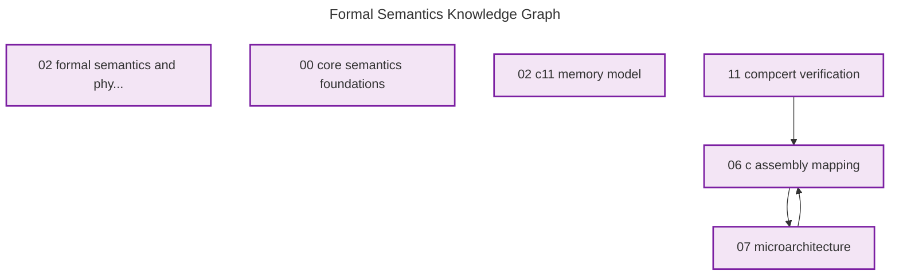
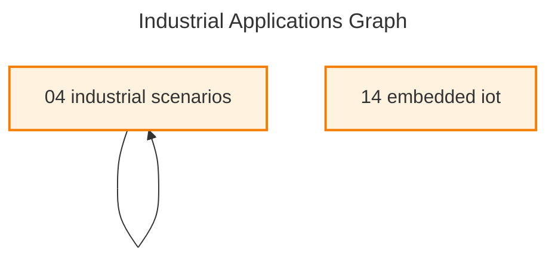
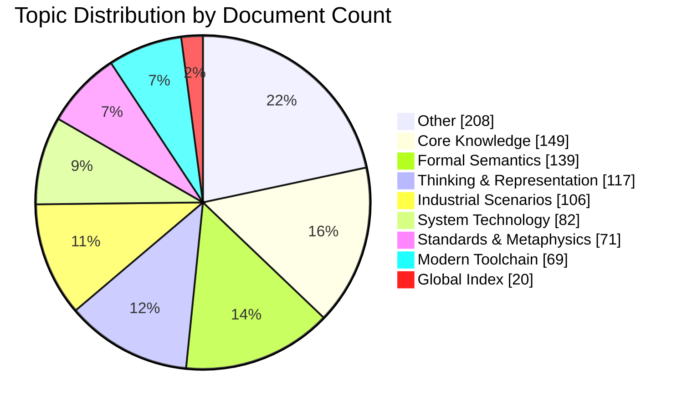

# C_Lang Knowledge Graph Analysis Report

**Generated**: 2026-03-25

**Knowledge Base**: C_Lang Deep Knowledge System

## Executive Summary

- **Total Documents**: 961
- **Total Internal Links**: 12437
- **Graph Density**: 0.0135
- **Core Hub Documents**: 100
- **Isolated Documents**: 0
- **Broken Links**: 5696

## Graph Statistics

### Overall Metrics

| Metric | Value |
|--------|-------|
| Nodes (Documents) | 961 |
| Edges (Links) | 12437 |
| Avg Out-Degree | 12.94 |
| Avg In-Degree | 7.01 |
| Max Out-Degree | 113 |
| Max In-Degree | 377 |

## Topic Cluster Analysis

| Topic | Documents | Internal Links | External Links | Cohesion |
|-------|-----------|----------------|----------------|----------|
| Other | 208 | 422 | 2788 | 0.13 |
| Core Knowledge | 149 | 368 | 95 | 0.79 |
| Formal Semantics | 139 | 207 | 258 | 0.45 |
| Thinking & Representation | 117 | 230 | 282 | 0.45 |
| Industrial | 106 | 112 | 112 | 0.50 |
| System Technology | 82 | 141 | 300 | 0.32 |
| Standards & Metaphysics | 71 | 56 | 264 | 0.17 |
| Toolchain | 69 | 104 | 581 | 0.15 |
| Global | 20 | 28 | 387 | 0.07 |

## Core Hub Documents (Top 30)

Ranked by hub score combining incoming links, outgoing links, and PageRank.

| Rank | Document | Topic | In | Out | PageRank | Hub Score |
|------|----------|-------|-----|-----|----------|-----------|
| 1 | `00_global_index.md` | Global | 377 | 73 | 0.005227 | 167.49 |
| 2 | `02_formal_semantics_and_physics/readme.md` | Formal Semantics | 361 | 57 | 0.004093 | 157.44 |
| 3 | `03_system_technology_domains/readme.md` | System Technology | 358 | 58 | 0.003720 | 156.29 |
| 4 | `07_modern_toolchain/readme.md` | Toolchain | 361 | 47 | 0.003967 | 155.39 |
| 5 | `04_industrial_scenarios/readme.md` | Industrial | 358 | 46 | 0.003710 | 153.88 |
| 6 | `03_system_technology_domains/14_concurrency_parall...` | System Technology | 372 | 13 | 0.004411 | 153.16 |
| 7 | `readme.md` | Other | 357 | 33 | 0.003832 | 150.93 |
| 8 | `06_thinking_representation/05_concept_mappings/rea...` | Thinking & Representation | 353 | 10 | 0.003548 | 144.62 |
| 9 | `02_formal_semantics_and_physics/00_core_semantics_...` | Formal Semantics | 350 | 16 | 0.003443 | 144.58 |
| 10 | `06_thinking_representation/06_learning_paths/readm...` | Thinking & Representation | 352 | 5 | 0.003531 | 143.21 |
| 11 | `01_core_knowledge_system/02_core_layer/readme.md` | Core Knowledge | 305 | 27 | 0.003067 | 128.63 |
| 12 | `01_core_knowledge_system/04_standard_library_layer...` | Core Knowledge | 304 | 29 | 0.003061 | 128.62 |
| 13 | `01_core_knowledge_system/09_safety_standards/misra...` | Core Knowledge | 310 | 9 | 0.003297 | 127.12 |
| 14 | `06_thinking_representation/01_decision_trees/readm...` | Thinking & Representation | 304 | 20 | 0.003104 | 126.84 |
| 15 | `01_core_knowledge_system/02_core_layer/02_memory_m...` | Core Knowledge | 116 | 12 | 0.003042 | 50.02 |
| 16 | `01_core_knowledge_system/02_core_layer/01_pointer_...` | Core Knowledge | 97 | 12 | 0.002672 | 42.27 |
| 17 | `01_core_knowledge_system/09_safety_standards/readm...` | Core Knowledge | 74 | 36 | 0.001028 | 37.21 |
| 18 | `01_core_knowledge_system/01_basic_layer/01_syntax_...` | Core Knowledge | 83 | 4 | 0.001589 | 34.64 |
| 19 | `01_core_knowledge_system/readme.md` | Core Knowledge | 39 | 55 | 0.002466 | 27.59 |
| 20 | `00_index.md` | Global | 4 | 113 | 0.000320 | 24.33 |
| 21 | `06_thinking_representation/readme.md` | Thinking & Representation | 13 | 70 | 0.000843 | 19.54 |
| 22 | `05_deep_structure_metaphysics/readme.md` | Standards & Metaphysics | 12 | 40 | 0.000807 | 13.12 |
| 23 | `zig/readme.md` | Other | 7 | 37 | 0.000306 | 10.32 |
| 24 | `17_ada_spark/readme.md` | Other | 8 | 33 | 0.000224 | 9.89 |
| 25 | `04_industrial_scenarios/14_embedded_iot/readme.md` | Industrial | 15 | 17 | 0.000599 | 9.64 |
| 26 | `01_core_knowledge_system/05_engineering_layer/03_p...` | Core Knowledge | 19 | 8 | 0.000953 | 9.58 |
| 27 | `16_embedded_ai_agents/readme.md` | Other | 10 | 26 | 0.000241 | 9.30 |
| 28 | `06_thinking_representation/09_state_machines/readm...` | Thinking & Representation | 8 | 26 | 0.000505 | 8.60 |
| 29 | `01_core_knowledge_system/09_safety_standards/04_se...` | Core Knowledge | 15 | 10 | 0.000804 | 8.32 |
| 30 | `01_core_knowledge_system/05_engineering_layer/01_c...` | Core Knowledge | 15 | 8 | 0.000839 | 7.94 |

## Document Connectivity Analysis

- **Isolated Documents** (no links): 0
- **Sink Documents** (only incoming): 0
- **Source Documents** (only outgoing): 312

## Knowledge Graph Visualizations

### Overall Knowledge Graph (Top 50 Core Documents)

```mermaid
---
title: Overall Knowledge Graph
---

graph TB
    N0["00 global index"]:::topic_global
    N1["02 formal semantics and phy..."]:::topic_formal_semantics
    N2["03 system technology domains"]:::topic_system_tech
    N3["07 modern toolchain"]:::topic_toolchain
    N4["04 industrial scenarios"]:::topic_industrial
    N5["14 concurrency parallelism"]:::topic_system_tech
    N6["readme"]:::topic_other
    N7["05 concept mappings"]:::topic_thinking
    N8["00 core semantics foundations"]:::topic_formal_semantics
    N9["06 learning paths"]:::topic_thinking
    N10["02 core layer"]:::topic_core_knowledge
    N11["04 standard library layer"]:::topic_core_knowledge
    N12["misra c 2023"]:::topic_core_knowledge
    N13["01 decision trees"]:::topic_thinking
    N14["02 memory management"]:::topic_core_knowledge
    N15["01 pointer depth"]:::topic_core_knowledge
    N16["09 safety standards"]:::topic_core_knowledge
    N17["01 syntax elements"]:::topic_core_knowledge
    N18["01 core knowledge system"]:::topic_core_knowledge
    N19["00 index"]:::topic_global
    N20["06 thinking representation"]:::topic_thinking
    N21["05 deep structure metaphysics"]:::topic_standards
    N22["zig"]:::topic_other
    N23["17 ada spark"]:::topic_other
    N24["14 embedded iot"]:::topic_industrial
    N25["03 performance optimization"]:::topic_core_knowledge
    N26["16 embedded ai agents"]:::topic_other
    N27["09 state machines"]:::topic_thinking
    N28["04 secure coding guide"]:::topic_core_knowledge
    N29["01 compilation build"]:::topic_core_knowledge
    N30["12 practice exercises"]:::topic_other
    N31["00 global architecture map"]:::topic_thinking
    N32["02 data type system"]:::topic_core_knowledge
    N33["06 c assembly mapping"]:::topic_formal_semantics
    N34["01 technical comparison"]:::topic_other
    N35["05 arrays pointers"]:::topic_core_knowledge
    N36["09 data structures algorithms"]:::topic_other
    N37["02 c11 memory model"]:::topic_formal_semantics
    N38["07 microarchitecture"]:::topic_formal_semantics
    N39["01 neural network basics"]:::topic_other
    N40["11 compcert verification"]:::topic_formal_semantics
    N41["14 video tutorials"]:::topic_other
    N42["数据结构与算法"]:::topic_other
    N43["02 embedded systems"]:::topic_core_knowledge
    N44["zig security cryptography"]:::topic_other
    N45["zig complete guide"]:::topic_other
    N46["01 vs code setup"]:::topic_toolchain
    N47["c2y feature previews"]:::topic_global
    N48["04 zeroclaw edge deployment"]:::topic_other
    N49["01 deterministic inference"]:::topic_other
    N0 --> N4
    N1 --> N29
    N1 --> N25
    N3 --> N4
    N4 --> N4
    N6 --> N4
    N10 --> N11
    N15 --> N35
    N17 --> N32
    N18 --> N29
    N18 --> N25
    N18 --> N4
    N19 --> N29
    N19 --> N25
    N20 --> N25
    N20 --> N4
    N21 --> N4
    N22 --> N4
    N23 --> N4
    N23 --> N11
    N24 --> N5
    N25 --> N35
    N25 --> N29
    N25 --> N5
    N25 --> N38
    N26 --> N4
    N26 --> N11
    N29 --> N25
    N29 --> N38
    N30 --> N5
    N30 --> N6
    N30 --> N4
    N30 --> N12
    N30 --> N10
    N31 --> N4
    N31 --> N11
    N31 --> N19
    N31 --> N10
    N33 --> N29
    N33 --> N38
    N34 --> N4
    N34 --> N11
    N35 --> N14
    N35 --> N27
    N36 --> N4
    N36 --> N11
    N38 --> N35
    N38 --> N5
    N38 --> N25
    N38 --> N33
    N39 --> N4
    N39 --> N11
    N40 --> N33
    N41 --> N25
    N41 --> N4
    N41 --> N11
    N42 --> N4
    N42 --> N11
    N44 --> N4
    N44 --> N11
    N45 --> N4
    N45 --> N11
    N46 --> N4
    N46 --> N11
    N47 --> N4
    N47 --> N11
    N48 --> N4
    N48 --> N11
    N49 --> N4
    N49 --> N11

    classDef topic_core_knowledge fill:#e3f2fd,stroke:#1976d2,stroke-width:2px
    classDef topic_formal_semantics fill:#f3e5f5,stroke:#7b1fa2,stroke-width:2px
    classDef topic_system_tech fill:#e8f5e9,stroke:#388e3c,stroke-width:2px
    classDef topic_industrial fill:#fff3e0,stroke:#f57c00,stroke-width:2px
    classDef topic_standards fill:#fce4ec,stroke:#c2185b,stroke-width:2px
    classDef topic_thinking fill:#f1f8e9,stroke:#689f38,stroke-width:2px
    classDef topic_toolchain fill:#e0f2f1,stroke:#00796b,stroke-width:2px
    classDef topic_embedded fill:#fff8e1,stroke:#ffa000,stroke-width:2px
    classDef topic_global fill:#f5f5f5,stroke:#616161,stroke-width:2px
    classDef topic_other fill:#fafafa,stroke:#9e9e9e,stroke-width:1px
```

### Formal Semantics Subgraph

### Industrial Applications Subgraph

### Topic Distribution

## Improvement Recommendations

### Broken Links (5696 found)

| Source | Broken Link |
|--------|-------------|
| `00_global_index.md` | `03_system/14_concurrency/05_lock_free.md` |
| `00_global_index.md` | `../06_thinking/05_concept_mappings/10_th...` |
| `00_global_index.md` | `04_industrial/01_high_performance/05_ker...` |
| `00_global_index.md` | `01_core/02_core_layer/03_string_processi...` |
| `00_global_index.md` | `03_system/01_system_programming/readme.m...` |
| `00_global_index.md` | `04_industrial/14_embedded/readme.md` |
| `00_global_index.md` | `../06_thinking/05_concept_mappings/09_le...` |
| `00_global_index.md` | `01_core/01_basic_layer/05_arrays_pointer...` |
| `00_global_index.md` | `../06_thinking/05_concept_mappings/13_gl...` |
| `00_global_index.md` | `03_system_technology_domains/11_network_...` |
| `00_global_index.md` | `01_core/02_core_layer/05_arrays_pointers...` |
| `00_global_index.md` | `03_system_technology_domains/14_concurre...` |
| `00_global_index.md` | `03_system/11_network_programming/readme....` |
| `00_global_index.md` | `../03_system/02_regex_engine/01_nfa_impl...` |
| `00_global_index.md` | `../06_thinking/05_concept_mappings/08_co...` |
| `00_global_index.md` | `04_industrial_scenarios/01_high_performa...` |
| `00_global_index.md` | `03_system/14_concurrency/readme.md` |
| `00_global_index.md` | `02_formal/11_compcert_verification/readm...` |
| `00_global_index.md` | `01_core/01_basic_layer/04_control_flow.m...` |
| `00_global_index.md` | `02_formal/00_core_semantics_foundations/...` |
| `00_global_index.md` | `01_core/01_basic_layer/02_data_type_syst...` |
| `00_global_index.md` | `03_system_technology_domains/01_system_p...` |
| `00_global_index.md` | `06_thinking/09_state_machines/readme.md` |
| `00_global_index.md` | `01_core/02_core_layer/01_pointer_depth.m...` |
| `00_global_index.md` | `01_core/02_core_layer/04_functions_scope...` |
| `00_global_index.md` | `01_core/02_core_layer/02_memory_manageme...` |
| `00_global_index.md` | `04_industrial_scenarios/08_real_world_ca...` |
| `00_global_index.md` | `06_thinking/05_concept_mappings/09_level...` |
| `readme.md` | `../readme.md` |
| `readme.md` | `zig/zig_knowledge_base_status.md` |
| ... | ... (5666 more) |

### Suggested New Links (50 recommendations)

Based on shared connections within topics:

| From | To | Reason |
|------|-----|--------|
| `06_thinking_representation/05_conce...` | `06_thinking_representation/06_learn...` | Share 351 common connections in thinking |
| `06_thinking_representation/06_learn...` | `06_thinking_representation/05_conce...` | Share 351 common connections in thinking |
| `06_thinking_representation/01_decis...` | `06_thinking_representation/05_conce...` | Share 301 common connections in thinking |
| `06_thinking_representation/05_conce...` | `06_thinking_representation/01_decis...` | Share 301 common connections in thinking |
| `06_thinking_representation/01_decis...` | `06_thinking_representation/06_learn...` | Share 300 common connections in thinking |
| `06_thinking_representation/06_learn...` | `06_thinking_representation/01_decis...` | Share 300 common connections in thinking |
| `01_core_knowledge_system/02_core_la...` | `01_core_knowledge_system/09_safety_...` | Share 300 common connections in core_knowledge |
| `01_core_knowledge_system/04_standar...` | `01_core_knowledge_system/09_safety_...` | Share 300 common connections in core_knowledge |
| `01_core_knowledge_system/09_safety_...` | `01_core_knowledge_system/02_core_la...` | Share 300 common connections in core_knowledge |
| `01_core_knowledge_system/09_safety_...` | `01_core_knowledge_system/04_standar...` | Share 300 common connections in core_knowledge |
| `01_core_knowledge_system/01_basic_l...` | `01_core_knowledge_system/02_core_la...` | Share 78 common connections in core_knowledge |
| `01_core_knowledge_system/01_basic_l...` | `01_core_knowledge_system/02_core_la...` | Share 78 common connections in core_knowledge |
| `01_core_knowledge_system/02_core_la...` | `01_core_knowledge_system/01_basic_l...` | Share 78 common connections in core_knowledge |
| `01_core_knowledge_system/02_core_la...` | `01_core_knowledge_system/01_basic_l...` | Share 78 common connections in core_knowledge |
| `01_core_knowledge_system/02_core_la...` | `01_core_knowledge_system/09_safety_...` | Share 73 common connections in core_knowledge |
| `01_core_knowledge_system/09_safety_...` | `01_core_knowledge_system/02_core_la...` | Share 73 common connections in core_knowledge |
| `01_core_knowledge_system/01_basic_l...` | `01_core_knowledge_system/09_safety_...` | Share 72 common connections in core_knowledge |
| `01_core_knowledge_system/02_core_la...` | `01_core_knowledge_system/09_safety_...` | Share 72 common connections in core_knowledge |
| `01_core_knowledge_system/09_safety_...` | `01_core_knowledge_system/01_basic_l...` | Share 72 common connections in core_knowledge |
| `01_core_knowledge_system/09_safety_...` | `01_core_knowledge_system/02_core_la...` | Share 72 common connections in core_knowledge |

### Priority Action Items

1. **Connect Isolated Documents**: Link isolated documents to relevant hub documents
2. **Fix Broken Links**: Repair or remove broken internal links
3. **Cross-Topic Bridging**: Add links between related topics (e.g., Core Knowledge → Industrial)
4. **Hub Strengthening**: Enhance connectivity to top 10 hub documents
5. **Standard Library Integration**: Link more documents to standard library references

---

*Report generated by C_Lang Knowledge Graph Analyzer*