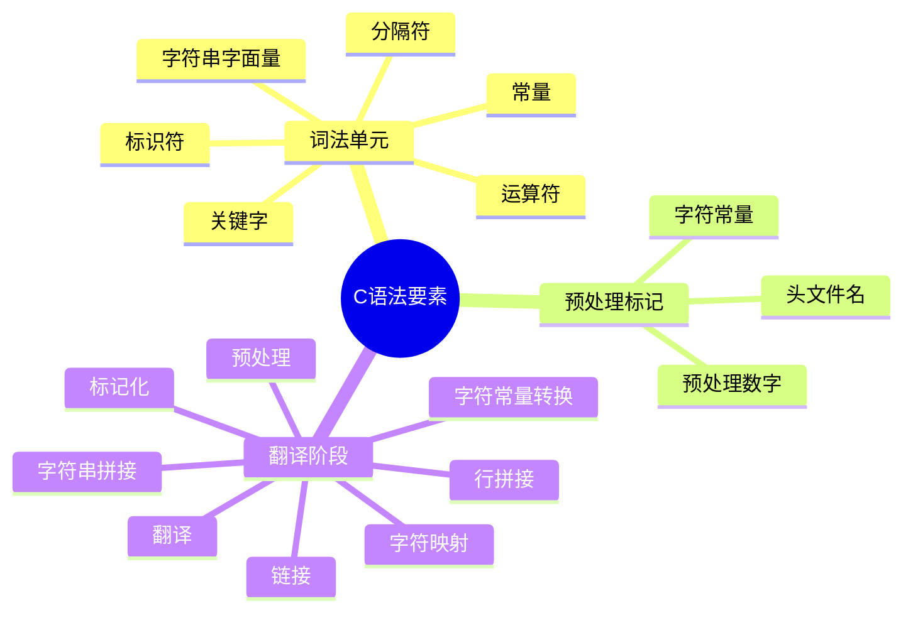
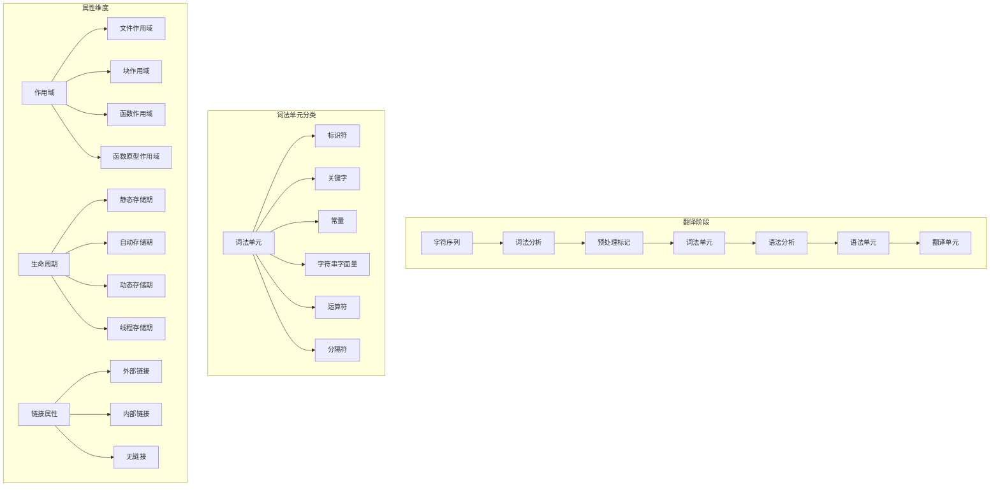
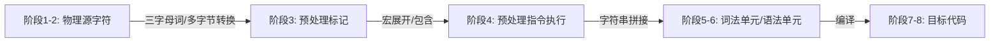
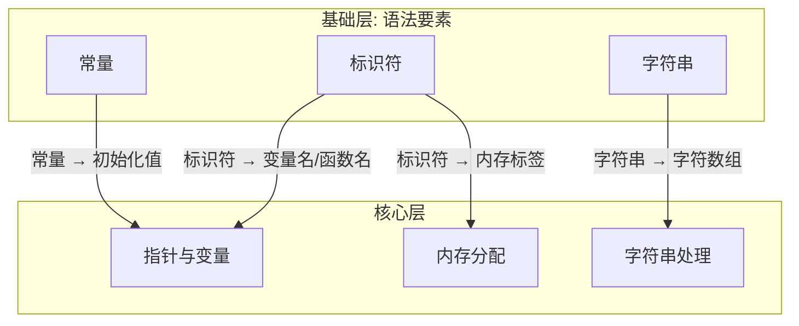

# C语言语法要素深度解析

> **层级定位**: 01 Core Knowledge System / 01 Basic Layer
> **对应标准**: C89/C99/C11/C17/C23
> **难度级别**: L1 了解
> **预估学习时间**: 2-3 小时

---

## 📋 本节概要

| 属性 | 内容 |
|:-----|:-----|
| **核心概念** | 词法单元、标识符、关键字、常量、字符串字面量 |
| **前置知识** | 无 (C语言入门第一内容) |
| **后续延伸** | [数据类型系统](./02_Data_Type_System.md) → [运算符与表达式](./03_Operators_Expressions.md) → [控制流](./04_Control_Flow.md) |
| **横向关联** | [编译过程](../../05_Engineering/01_Compilation_Build.md#预处理) |
| **学习路径** | 这是C语言学习路径的起点，完成后请继续学习数据类型系统 |
| **权威来源** | K&R Ch2.1-2.3, C11标准 6.4 |

---


---

## 📑 目录

- [C语言语法要素深度解析](#c语言语法要素深度解析)
  - [📋 本节概要](#-本节概要)
  - [📑 目录](#-目录)
  - [🎯 概念定义](#-概念定义)
    - [1.1 语法元素（Syntax Elements）](#11-语法元素syntax-elements)
    - [1.2 词法单元（Lexical Token）](#12-词法单元lexical-token)
    - [1.3 语法单元（Syntactic Unit）](#13-语法单元syntactic-unit)
  - [🧠 知识结构思维导图](#-知识结构思维导图)
    - [语法元素层次结构详细图](#语法元素层次结构详细图)
  - [📖 核心概念详解](#-核心概念详解)
    - [1. 标识符 (Identifiers)](#1-标识符-identifiers)
      - [1.1 命名规则](#11-命名规则)
      - [1.2 属性说明](#12-属性说明)
      - [1.3 作用域与可见性](#13-作用域与可见性)
    - [2. 关键字 (Keywords)](#2-关键字-keywords)
      - [2.1 C89-C23关键字演进](#21-c89-c23关键字演进)
    - [3. 常量 (Constants)](#3-常量-constants)
      - [3.1 整数常量](#31-整数常量)
      - [3.2 浮点常量](#32-浮点常量)
      - [3.3 字符常量](#33-字符常量)
    - [4. 字符串字面量](#4-字符串字面量)
      - [4.1 字符串基本](#41-字符串基本)
      - [4.2 Unicode字符串](#42-unicode字符串)
      - [4.3 字符串修改陷阱](#43-字符串修改陷阱)
  - [🔬 形式化描述（BNF/EBNF文法）](#-形式化描述bnfebnf文法)
    - [5.1 标识符文法（C11 6.4.2）](#51-标识符文法c11-642)
    - [5.2 常量文法（C11 6.4.4）](#52-常量文法c11-644)
    - [5.3 字符串字面量文法（C11 6.4.5）](#53-字符串字面量文法c11-645)
  - [🔄 多维矩阵对比](#-多维矩阵对比)
    - [转义序列参考表](#转义序列参考表)
    - [语法元素属性矩阵](#语法元素属性矩阵)
  - [⚠️ 常见陷阱与反例](#️-常见陷阱与反例)
    - [陷阱 SYN01: 字符与字符串混淆](#陷阱-syn01-字符与字符串混淆)
    - [陷阱 SYN02: 八进制陷阱](#陷阱-syn02-八进制陷阱)
    - [陷阱 SYN03: 标识符保留字冲突](#陷阱-syn03-标识符保留字冲突)
    - [陷阱 SYN04: 多字节字符字面量](#陷阱-syn04-多字节字符字面量)
    - [陷阱 SYN05: 字符串字面量拼接顺序](#陷阱-syn05-字符串字面量拼接顺序)
    - [陷阱 SYN06: 浮点常量默认类型](#陷阱-syn06-浮点常量默认类型)
  - [✅ 质量验收清单](#-质量验收清单)
  - [🔬 深入理解](#-深入理解)
    - [技术原理深度剖析](#技术原理深度剖析)
      - [1. 编译器词法分析实现机制](#1-编译器词法分析实现机制)
        - [1.1 确定性有限自动机（DFA）模型](#11-确定性有限自动机dfa模型)
        - [1.2 最长匹配原则（Maximal Munch）](#12-最长匹配原则maximal-munch)
        - [1.3 贪心分隔符解析](#13-贪心分隔符解析)
      - [2. 翻译阶段与语法要素](#2-翻译阶段与语法要素)
      - [3. 标识符的符号表管理](#3-标识符的符号表管理)
        - [3.1 符号表数据结构](#31-符号表数据结构)
        - [3.2 作用域解析算法](#32-作用域解析算法)
      - [4. 关键字的实现策略](#4-关键字的实现策略)
        - [4.1 关键字识别方法](#41-关键字识别方法)
        - [4.2 上下文关键字（C23演进）](#42-上下文关键字c23演进)
      - [5. 常量的内部表示](#5-常量的内部表示)
        - [5.1 整数常量类型推导算法](#51-整数常量类型推导算法)
        - [5.2 浮点常量精度问题](#52-浮点常量精度问题)
      - [6. 字符串字面量的存储布局](#6-字符串字面量的存储布局)
        - [6.1 内存布局模型](#61-内存布局模型)
        - [6.2 字符串池化（String Interning）](#62-字符串池化string-interning)
    - [实践指南](#实践指南)
      - [阶段1：建立坚实基础](#阶段1建立坚实基础)
      - [阶段2：掌握核心原理](#阶段2掌握核心原理)
      - [阶段3：应用实践](#阶段3应用实践)
    - [层次关联与映射分析](#层次关联与映射分析)
      - [与上层（核心层）的映射关系](#与上层核心层的映射关系)
      - [与下层（构造层）的组合关系](#与下层构造层的组合关系)
      - [与形式语义层的理论关联](#与形式语义层的理论关联)
      - [与物理层的实现映射](#与物理层的实现映射)
    - [决策树：语法要素应用选择](#决策树语法要素应用选择)
    - [相关资源](#相关资源)
      - [权威文档](#权威文档)
      - [推荐书籍](#推荐书籍)
      - [在线资源](#在线资源)
      - [参考实现](#参考实现)


---

## 🎯 概念定义

### 1.1 语法元素（Syntax Elements）

**严格定义**：构成C语言程序的基本结构单元，按照ISO/IEC 9899标准，C语言语法元素是指程序翻译过程中能被识别和处理的最小有意义单元。

**形式化定义**：

```text
语法元素 ∈ {词法单元(Token), 预处理标记(Preprocessing Token),
           翻译单元(Translation Unit)}
```

### 1.2 词法单元（Lexical Token）

**严格定义**（C11标准 6.4）：源程序被词法分析器处理后产生的最小不可分割单元，是编译器语法分析的输入单位。

**分类体系**：

```text
词法单元(Token) ::= 关键字(Keyword)
                  | 标识符(Identifier)
                  | 常量(Constant)
                  | 字符串字面量(String Literal)
                  | 运算符(Operator)
                  | 分隔符(Punctuator)
```

### 1.3 语法单元（Syntactic Unit）

**严格定义**：由词法单元按照特定规则组合而成的更高层次结构，包括表达式、语句、声明、定义等。

**层次关系**：

```text
字符(Character) → 词法单元(Token) → 语法单元(Syntactic Unit)
                → 声明/定义(Declaration/Definition)
                → 翻译单元(Translation Unit)
```

---

## 🧠 知识结构思维导图



### 语法元素层次结构详细图



---

## 📖 核心概念详解

### 1. 标识符 (Identifiers)

#### 1.1 命名规则

```c
// 有效标识符
int valid_name;      // 字母开头，下划线连接
int _private;        // 下划线开头（保留字风险）
int value2;          // 数字在末尾
int 变量名;          // Unicode标识符(C23)

// 无效标识符
// int 2value;       // 数字开头
// int class;        // 关键字
// int my-name;      // 连字符不允许
// int my name;      // 空格不允许
```

#### 1.2 属性说明

| 属性类别 | 属性值 | 说明 | 示例 |
|:---------|:-------|:-----|:-----|
| **作用域** | 文件作用域 | 在翻译单元内可见 | 全局变量 |
| | 块作用域 | 在代码块内可见 | 局部变量 |
| | 函数作用域 | 仅goto标签 | label: |
| | 函数原型作用域 | 参数列表内 | void f(int x) |
| **链接属性** | 外部链接 | 跨文件可见 | `int g_var;` |
| | 内部链接 | 仅限当前文件 | `static int s_var;` |
| | 无链接 | 无链接属性 | 局部变量 |
| **命名空间** | 普通标识符 | 变量、函数、typedef | `int count;` |
| | 标签命名空间 | goto标签 | `loop:` |
| | 结构体/联合体/枚举标签 | 类型标签 | `struct Node` |
| | 结构体/联合体成员 | 各自独立 | `struct { int x; }` |

#### 1.3 作用域与可见性

```c
// 文件作用域（外部链接）
int global_var;

// 内部链接
static int internal_var;

void function(void) {
    // 块作用域
    int local_var;

    {
        // 嵌套作用域，隐藏外部同名变量
        int local_var;  // 不同的变量！
    }
}
```

---

### 2. 关键字 (Keywords)

#### 2.1 C89-C23关键字演进

| C89 | C99 | C11 | C23 | 用途 |
|:----|:----|:----|:----|:-----|
| auto | | | | 存储类（已少用） |
| break | | | | 跳转语句 |
| case | | | | switch分支 |
| char | | | | 字符类型 |
| const | | | | 类型限定 |
| continue | | | | 循环控制 |
| default | | | | switch默认 |
| do | | | | do-while循环 |
| double | | | | 双精度浮点 |
| else | | | | if分支 |
| enum | | | | 枚举 |
| extern | | | | 外部链接 |
| float | | | | 单精度浮点 |
| for | | | | for循环 |
| goto | | | | 无条件跳转 |
| if | | | | 条件语句 |
| int | | | | 整数类型 |
| long | | | | 长整型 |
| register | | | | 寄存器建议 |
| return | | | | 函数返回 |
| short | | | | 短整型 |
| signed | | | | 有符号 |
| sizeof | | | | 大小运算符 |
| static | | | | 静态存储 |
| struct | | | | 结构体 |
| switch | | | | 多分支 |
| typedef | | | | 类型定义 |
| union | | | | 联合体 |
| unsigned | | | | 无符号 |
| void | | | | 空类型 |
| volatile | | | | 易变限定 |
| while | | | | while循环 |
| | inline | | | 内联函数 |
| | restrict | | | 指针限定 |
| | _Bool | | | 布尔类型 |
| | _Complex | | | 复数类型 |
| | _Imaginary | | | 虚数类型 |
| | | _Alignas | alignas | 对齐指定 |
| | | _Alignof | alignof | 对齐查询 |
| | | _Atomic | | 原子类型 |
| | | _Static_assert | static_assert | 静态断言 |
| | | _Noreturn | noreturn | 无返回 |
| | | _Thread_local | thread_local | 线程存储 |
| | | _Generic | | 泛型选择 |
| | | | constexpr | 常量表达式 |
| | | | nullptr | 空指针 |
| | | | typeof | 类型推导 |
| | | | true/false | 布尔字面量 |

---

### 3. 常量 (Constants)

#### 3.1 整数常量

```c
// 十进制
int dec = 42;
int dec_negative = -42;

// 八进制（0开头）
int oct = 052;      // 42 in decimal

// 十六进制（0x/0X开头）
int hex = 0x2A;     // 42 in decimal
int hex_upper = 0X2a;

// 二进制（C23，0b/0B开头）
#if __STDC_VERSION__ >= 202311L
int bin = 0b101010;  // 42 in decimal
int bin_sep = 0b1010'1010;  // 单引号分隔符(C23)
#endif

// 整数后缀
unsigned int u = 42U;
long l = 42L;
unsigned long ul = 42UL;
long long ll = 42LL;
unsigned long long ull = 42ULL;
```

#### 3.2 浮点常量

```c
// 小数形式
double d1 = 3.14159;
double d2 = .5;       // 0.5
double d3 = 3.;       // 3.0

// 指数形式
double e1 = 3.14e10;   // 3.14 × 10^10
double e2 = 1E-10;     // 1 × 10^-10

// 十六进制浮点(C99)
double hex_float = 0x1.5p10;  // 1.3125 × 2^10 = 1344.0

// 后缀
float f = 3.14F;
double d = 3.14;      // 默认
double ld = 3.14L;    // long double
```

#### 3.3 字符常量

```c
// 普通字符
char c1 = 'A';
char c2 = '\n';  // 转义序列

// 转义序列
char newline = '\n';
char tab = '\t';
char backslash = '\\';
char single_quote = '\'';
char null_char = '\0';

// 八进制转义
char oct_esc = '\101';  // 'A' (65 in octal)

// 十六进制转义
char hex_esc = '\x41';  // 'A' (65 in hex)

// Unicode字符(C11)
char16_t c16 = u'中';   // UTF-16
char32_t c32 = U'中';   // UTF-32

// 宽字符
wchar_t wc = L'中';     // 平台相关
```

---

### 4. 字符串字面量

#### 4.1 字符串基本

```c
// 普通字符串
const char *s1 = "Hello, World!";

// 多行字符串（行拼接）
const char *s2 = "Line 1 "
                 "Line 2 "
                 "Line 3";

// 转义序列
const char *s3 = "Tab:\there\nNew line";

// 原始字符串（C23）
#if __STDC_VERSION__ >= 202311L
const char *raw = R"(Raw "string" without escapes)";
#endif
```

#### 4.2 Unicode字符串

```c
// UTF-8字符串(C11)
const char *utf8 = u8"Hello 世界";

// UTF-16字符串
const char16_t *utf16 = u"Hello 世界";

// UTF-32字符串
const char32_t *utf32 = U"Hello 世界";

// 宽字符串
const wchar_t *wide = L"Hello 世界";
```

#### 4.3 字符串修改陷阱

```c
// ❌ 未定义行为：修改字符串字面量
char *s = "Hello";  // 指向只读数据
s[0] = 'h';  // 崩溃或不可预测行为

// ✅ 可修改的字符数组
char modifiable[] = "Hello";  // 数组拷贝
modifiable[0] = 'h';  // OK

// ✅ 显式const
const char *read_only = "Hello";
// read_only[0] = 'h';  // 编译错误
```

---

## 🔬 形式化描述（BNF/EBNF文法）

### 5.1 标识符文法（C11 6.4.2）

```ebnf
identifier ::= identifier-nondigit
             | identifier identifier-nondigit
             | identifier digit

identifier-nondigit ::= nondigit
                      | universal-character-name
                      | other implementation-defined characters

nondigit ::= '_' | 'a' | 'b' | ... | 'z' | 'A' | 'B' | ... | 'Z'

digit ::= '0' | '1' | ... | '9'

universal-character-name ::= '\\u' hex-quad
                           | '\\U' hex-quad hex-quad

hex-quad ::= hex-digit hex-digit hex-digit hex-digit

hex-digit ::= digit | 'a' | 'b' | 'c' | 'd' | 'e' | 'f'
                          | 'A' | 'B' | 'C' | 'D' | 'E' | 'F'
```

### 5.2 常量文法（C11 6.4.4）

```ebnf
constant ::= integer-constant
           | floating-constant
           | enumeration-constant
           | character-constant

integer-constant ::= decimal-constant integer-suffix?
                   | octal-constant integer-suffix?
                   | hexadecimal-constant integer-suffix?
                   | binary-constant integer-suffix?   (* C23 *)

decimal-constant ::= nonzero-digit | decimal-constant digit

octal-constant ::= '0' | octal-constant octal-digit

hexadecimal-constant ::= hexadecimal-prefix hexadecimal-digit-sequence

hexadecimal-prefix ::= '0x' | '0X'

binary-constant ::= binary-prefix binary-digit-sequence   (* C23 *)
binary-prefix ::= '0b' | '0B'                             (* C23 *)

integer-suffix ::= unsigned-suffix long-suffix?
                 | unsigned-suffix long-long-suffix?
                 | long-suffix unsigned-suffix?
                 | long-long-suffix unsigned-suffix?

unsigned-suffix ::= 'u' | 'U'
long-suffix ::= 'l' | 'L'
long-long-suffix ::= 'll' | 'LL'

floating-constant ::= decimal-floating-constant
                    | hexadecimal-floating-constant

decimal-floating-constant ::= fractional-constant exponent-part? floating-suffix?
                            | digit-sequence exponent-part floating-suffix?

hexadecimal-floating-constant ::= hexadecimal-prefix hexadecimal-fractional-constant
                                    binary-exponent-part floating-suffix?
                                | hexadecimal-prefix hexadecimal-digit-sequence
                                    binary-exponent-part floating-suffix?

binary-exponent-part ::= 'p' sign? digit-sequence
                       | 'P' sign? digit-sequence

sign ::= '+' | '-'
floating-suffix ::= 'f' | 'F' | 'l' | 'L'
```

### 5.3 字符串字面量文法（C11 6.4.5）

```ebnf
string-literal ::= encoding-prefix? '"' s-char-sequence? '"'

encoding-prefix ::= 'u8'  (* UTF-8 *)
                  | 'u'   (* UTF-16 *)
                  | 'U'   (* UTF-32 *)
                  | 'L'   (* 宽字符 *)

s-char-sequence ::= s-char | s-char-sequence s-char

s-char ::= any member of the source character set except
           the double-quote, backslash, or newline character
         | escape-sequence
         | universal-character-name
```

---

## 🔄 多维矩阵对比

### 转义序列参考表

| 转义 | 含义 | ASCII值 |
|:-----|:-----|:-------:|
| `\a` | 警报(Bell) | 7 |
| `\b` | 退格 | 8 |
| `\f` | 换页 | 12 |
| `\n` | 换行 | 10 |
| `\r` | 回车 | 13 |
| `\t` | 水平制表 | 9 |
| `\v` | 垂直制表 | 11 |
| `\\` | 反斜杠 | 92 |
| `\'` | 单引号 | 39 |
| `\"` | 双引号 | 34 |
| `\?` | 问号 | 63 |
| `\0` | 空字符 | 0 |

### 语法元素属性矩阵

| 语法元素 | 作用域 | 存储期 | 链接属性 | 命名空间 |
|:---------|:-------|:-------|:---------|:---------|
| 全局变量 | 文件 | 静态 | 外部 | 普通 |
| static全局变量 | 文件 | 静态 | 内部 | 普通 |
| 局部变量 | 块 | 自动 | 无 | 普通 |
| static局部变量 | 块 | 静态 | 无 | 普通 |
| 函数参数 | 函数原型 | 自动 | 无 | 普通 |
| 标签 | 函数 | - | - | 标签 |
| 结构体标签 | 文件/块 | - | - | 标签 |
| 枚举常量 | 文件/块 | 静态 | 见定义 | 普通 |

---

## ⚠️ 常见陷阱与反例

### 陷阱 SYN01: 字符与字符串混淆

```c
// ❌ 错误
char c = "A";  // char* 转 char，警告或错误

// ✅ 正确
char c = 'A';  // 字符常量
const char *s = "A";  // 字符串（含'\0'）
```

### 陷阱 SYN02: 八进制陷阱

```c
// ❌ 意外八进制
int x = 071;   // 57 in decimal，不是71！
int y = 0123;  // 83 in decimal

// ✅ 显式书写
int z = 123;   // 十进制
```

### 陷阱 SYN03: 标识符保留字冲突

```c
// ❌ 使用保留标识符（以_开头后跟大写字母或另一个_）
int _Reserved;      // 保留给实现使用
int __reserved;     // 双下划线保留
int reserved__;     // 末尾双下划线也保留

// ✅ 安全命名
int reserved;
int my_reserved;
int reserved_count;
```

### 陷阱 SYN04: 多字节字符字面量

```c
// ❌ 实现定义行为
char c = 'AB';  // 多字符常量，值不确定

// ✅ 使用正确类型
char16_t c16 = u'A';   // UTF-16字符
char32_t c32 = U'中';  // UTF-32字符
```

### 陷阱 SYN05: 字符串字面量拼接顺序

```c
// ❌ 未定义行为？不，是未指定行为
const char *s = "Hello" " " "World";  // OK，翻译阶段6拼接

// ✅ 明确意图
const char *s1 = "Hello World";  // 直接写完整

// 注意：不同编码前缀不能拼接
// const char *err = u8"Hello" u"World";  // 错误！
```

### 陷阱 SYN06: 浮点常量默认类型

```c
// ⚠️ 注意默认类型
double d = 3.14;    // double（默认）
float f = 3.14f;    // 显式float
long double ld = 3.14L;  // 显式long double

// ❌ 精度损失风险
float f2 = 3.141592653589793;  // 先转double，再转float，可能截断
```

---

## ✅ 质量验收清单

- [x] 标识符命名规则
- [x] 关键字演进表
- [x] 常量类型详解
- [x] 字符串安全使用
- [x] 形式化BNF/EBNF文法定义
- [x] 语法元素属性矩阵
- [x] 常见语法错误反例

---

> **更新记录**
>
> - 2025-03-09: 初版创建
> - 2026-03-16: 深化内容，添加概念定义、形式化文法、属性说明和反例


---

## 🔬 深入理解

### 技术原理深度剖析

#### 1. 编译器词法分析实现机制

C语言语法要素的处理始于编译器的**词法分析器（Lexer/Tokenizer）**。理解其实现原理对诊断编译错误至关重要。

##### 1.1 确定性有限自动机（DFA）模型

词法分析器本质上是DFA的实现：

```
状态转换图（简化）：

    [开始] ──字母/下划线──→ [标识符] ──字母/数字/下划线──┐
                              ↑                        │
                              └────────────────────────┘

    [开始] ──数字──→ [数字] ──数字──┐
                     │            │
                     ├─.──→ [小数]─┤
                     │            │
                     └─e/E──→ [指数]

    [开始] ──"──→ [字符串] ──非\"──┐
                              ↑   │
                              └───┤
                              \──→ [转义] ──特定字符──┘
```

**形式化定义**：

```text
Lexer = (Q, Σ, δ, q₀, F)
其中：
  Q = {START, ID, NUM, STRING, COMMENT, ...}  // 状态集
  Σ = 所有ASCII字符 ∪ Unicode字符(C11+)      // 输入字母表
  δ: Q × Σ → Q                                 // 状态转移函数
  q₀ = START                                   // 初始状态
  F ⊆ Q                                        // 接受状态集
```

##### 1.2 最长匹配原则（Maximal Munch）

C语言词法分析遵循**最长匹配原则**：

```c
// 示例：如何解析 "+++++i"?
a = b+++c;   // 解析为: b++ + c (后缀++，然后+)
a = b++++c;  // 解析为: b++ ++ c → 错误! 第二个++无操作数
a = +++b;    // 解析为: ++ +b   → 前缀++，然后一元+
```

**决策过程**：

```
输入: +++++i
步骤1: 读取 '+' → 可能匹配 '+' 或 '++'，继续
步骤2: 读取 '+' → 匹配 '++'，继续
步骤3: 读取 '+' → 无法匹配 '+++'，回退到 '++'
步骤4: 输出 token: ++
步骤5: 读取 '+' → 继续
步骤6: 读取 '+' → 匹配 '++'
步骤7: 输出 token: ++
步骤8: 读取 'i' → 标识符
```

##### 1.3 贪心分隔符解析

```c
// 经典陷阱：a---b 的解析
int a = 5, b = 3, c;
c = a---b;   // 解析为: c = a-- - b;  结果: c = 2, a = 4

// 对比
c = a- --b;  // 解析为: c = a - (--b); 结果: c = 3, b = 2
c = a-- -b;  // 解析为: c = (a--) - b; 结果: c = 2, a = 4
```

#### 2. 翻译阶段与语法要素

C标准定义了**8个翻译阶段**，语法要素在不同阶段有不同的形态：



**关键洞察**：

| 阶段 | 处理单位 | 示例 |
|------|----------|------|
| 1-2 | 源字符 | `\` 续行符处理 |
| 3 | 预处理标记 | `##` 拼接操作符工作在此阶段 |
| 4 | 预处理指令 | `#define`, `#include` 执行 |
| 5 | 字符/字符串拼接 | `"a" "b"` → `"ab"` |
| 6 | 词法单元(Token) | 相邻字符串已合并 |
| 7-8 | 语法单元 | 编译器进行语义分析 |

```c
// 阶段差异示例
#define CONCAT(a, b) a##b
#define STRINGIFY(x) #x

// 阶段3-4: 预处理标记处理
CONCAT(in, t) x = 5;    // 展开为: int x = 5;
char* s = STRINGIFY(abc); // 展开为: char* s = "abc";

// 阶段5: 字符串拼接
char* str = "Hello, " "World" "!";  // 等同于 "Hello, World!"
```

#### 3. 标识符的符号表管理

##### 3.1 符号表数据结构

编译器使用**符号表（Symbol Table）**管理标识符：

```c
// 简化的符号表条目
struct SymbolEntry {
    char* name;           // 标识符名称
    int scope_level;      // 作用域层级
    enum SymbolKind kind; // VAR, FUNC, TYPEDEF, ENUM_CONST, ...
    Type* type;           // 类型信息
    int offset;           // 栈帧偏移或地址
    // ... 其他属性
};

// 作用域链（处理嵌套作用域）
struct Scope {
    HashTable* symbols;   // 当前作用域的符号
    struct Scope* parent; // 外层作用域
    int level;            // 作用域深度
};
```

##### 3.2 作用域解析算法

```c
// 标识符查找伪代码
SymbolEntry* lookup(const char* name, Scope* current) {
    for (Scope* s = current; s != NULL; s = s->parent) {
        SymbolEntry* entry = hash_table_find(s->symbols, name);
        if (entry != NULL) return entry;  // 找到最近的定义
    }
    return NULL;  // 未定义标识符
}
```

#### 4. 关键字的实现策略

##### 4.1 关键字识别方法

**方法A：预留标识符（C语言采用）**

```c
// 关键字作为特殊标识符处理
enum TokenKind {
    TOK_IDENT,     // 普通标识符
    TOK_INT,       // int
    TOK_IF,        // if
    TOK_WHILE,     // while
    // ... 所有关键字
};

// 在符号表初始化时预填入关键字
void init_keywords() {
    insert_keyword("int", TOK_INT);
    insert_keyword("if", TOK_IF);
    insert_keyword("while", TOK_WHILE);
    // ...
}
```

**方法B：硬编码DFA（高性能实现）**
使用完美哈希或Trie树实现O(1)或O(k)的关键字识别。

##### 4.2 上下文关键字（C23演进）

```c
// C23 引入的关键字特性
// _Decimal32, _Decimal64, _Decimal128 是上下文关键字
// 仅在特定上下文中作为关键字，其他位置可作为标识符

_Decimal64 x;     // _Decimal64 作为类型关键字
int _Decimal64 = 5;  // 在某些编译器中可作为标识符（不推荐！）

// C23 标准关键字简化
// _Bool → bool (关键字)
// _Static_assert → static_assert
// _Thread_local → thread_local
```

#### 5. 常量的内部表示

##### 5.1 整数常量类型推导算法

编译器按照C标准6.4.4.1规则推导整数常量类型：

```
算法：推导整数常量类型
输入：整数值V，后缀S（无/U/u/L/l/LL/ll组合）
输出：最小可表示类型

1. 如果后缀包含U：
   - 无前缀 → 依次尝试: unsigned int → unsigned long → unsigned long long
   - 有L → 依次尝试: unsigned long → unsigned long long
   - 有LL → 直接: unsigned long long

2. 如果后缀无U：
   - 无前缀 → 依次尝试: int → long → long long
   - 有L → 依次尝试: long → long long
   - 有LL → 直接: long long

3. 返回第一个能容纳V的类型
```

```c
// 示例演示
2147483647        // int (假设32位int)
2147483648        // long (超出int范围)
0x7FFFFFFF        // int
0xFFFFFFFF        // unsigned int (如果32位int)
0xFFFFFFFFU       // unsigned int
0xFFFFFFFFUL      // unsigned long

// 常见陷阱
long long x = 1 << 40;  // 危险！1默认为int，可能溢出
long long x = 1LL << 40; // 正确: 使用long long字面量
```

##### 5.2 浮点常量精度问题

```c
// 内部表示差异
float f = 0.1f;        // 单精度: 0.100000001490116119384765625
double d = 0.1;        // 双精度: 0.1000000000000000055511151231257827021181583404541015625
long double ld = 0.1L; // 扩展精度

// 常量推导规则
0.1     // 默认为 double
0.1f    // 明确 float
0.1F    // 明确 float
0.1l    // 明确 long double
0.1L    // 明确 long double

// C23 十进制浮点数
// 精确表示十进制小数，避免二进制浮点误差
_Decimal32 d32 = 0.1df;   // 精确 0.1
_Decimal64 d64 = 0.1dd;   // 精确 0.1
_Decimal128 d128 = 0.1dl; // 精确 0.1
```

#### 6. 字符串字面量的存储布局

##### 6.1 内存布局模型

```
字符串字面量 "Hello\0World" 的存储（平台依赖）：

只读数据段 (.rodata):
┌─────────┬────┬────┬────┬────┬────┬────┬────┬────┬────┬────┬────┐
│ 地址    │ +0 │ +1 │ +2 │ +3 │ +4 │ +5 │ +6 │ +7 │ +8 │ +9 │ +10│
├─────────┼────┼────┼────┼────┼────┼────┼────┼────┼────┼────┼────┤
│ 内容    │ H  │ e  │ l  │ l  │ o  │ \0 │ W  │ o  │ r  │ l  │ d  │
│ (ASCII) │ 72 │101 │108 │108 │111 │ 0  │ 87 │111 │114 │108 │100 │
└─────────┴────┴────┴────┴────┴────┴────┴────┴────┴────┴────┴────┘
                                    ↑
                              printf在此停止
```

##### 6.2 字符串池化（String Interning）

```c
// 编译器优化：相同字符串可能共享存储
const char* s1 = "hello";
const char* s2 = "hello";
const char* s3 = "hell" "o";  // 拼接后相同

// 可能结果：s1 == s2 == s3（地址相同）
// 注意：C标准不保证这一点，但大多数编译器会优化

// 修改尝试（未定义行为）
char* s = "hello";
s[0] = 'H';  // 段错误！试图修改只读内存
```

---

### 实践指南

#### 阶段1：建立坚实基础

**任务1.1：理解词法单元分类**

```c
// 分析以下代码的词法单元
int main(void) {
    int x = 42;
    float y = 3.14f;
    char* msg = "Hello";
    return x + (int)y;
}

// 词法单元序列（简化）:
// [int] [main] [(] [void] [)] [{]
// [int] [x] [=] [42] [;]
// [float] [y] [=] [3.14f] [;]
// [char] [*] [msg] [=] ["Hello"] [;]
// [return] [x] [+] [(] [int] [)] [y] [;]
// [}]
```

**任务1.2：标识符命名练习**

```c
// 判断以下标识符的合法性

int 2nd_value;      // ❌ 非法：不能以数字开头
int _value;         // ✅ 合法
int value_2;        // ✅ 合法
int __value;        // ⚠️ 合法但保留（双下划线）
int _Value;         // ⚠️ 合法但保留（下划线+大写）
int value$;         // ❌ 非法：$非标准C（GNU扩展允许）
int значение;       // ✅ C11起合法（Unicode）
int \u6570\u503c;   // ✅ C11通用字符名
```

#### 阶段2：掌握核心原理

**任务2.1：类型推导实验**

```c
#include <stdio.h>
#include <stdint.h>
#include <typeinfo>  // C++方式，C需用其他方法

// 使用_Generic获取类型名称（C11）
#define type_name(x) _Generic((x), \
    int: "int", \
    long: "long", \
    long long: "long long", \
    unsigned int: "unsigned int", \
    unsigned long: "unsigned long", \
    unsigned long long: "unsigned long long", \
    float: "float", \
    double: "double", \
    long double: "long double", \
    default: "other")

int main(void) {
    // 观察整数常量的类型推导
    printf("1        : %s\n", type_name(1));
    printf("1U       : %s\n", type_name(1U));
    printf("1L       : %s\n", type_name(1L));
    printf("1UL      : %s\n", type_name(1UL));
    printf("1LL      : %s\n", type_name(1LL));
    printf("1ULL     : %s\n", type_name(1ULL));

    // 观察边界值
    printf("2147483647   : %s\n", type_name(2147483647));     // INT_MAX
    printf("2147483648   : %s\n", type_name(2147483648));     // INT_MAX+1 → long?
    printf("4294967295U  : %s\n", type_name(4294967295U));    // UINT_MAX
    printf("4294967296   : %s\n", type_name(4294967296));     // UINT_MAX+1 → long?

    return 0;
}
```

**任务2.2：最长匹配原则验证**

```c
#include <stdio.h>

int main(void) {
    int a = 5, b = 3, c = 2;

    // 实验不同的++组合
    int temp = a;
    printf("a = %d, b = %d\n", temp, b);

    // a---b 的解析
    int result1 = temp---b;  // (temp--) - b
    printf("temp---b = %d, temp = %d\n", result1, temp);

    temp = a;
    int result2 = temp- --b; // temp - (--b)
    printf("temp- --b = %d, b = %d\n", result2, b);

    return 0;
}
```

#### 阶段3：应用实践

**任务3.1：编写简单词法分析器**

```c
// 简化的C词法分析器框架
#include <stdio.h>
#include <ctype.h>
#include <string.h>

typedef enum {
    TOK_INT, TOK_IDENTIFIER, TOK_NUMBER,
    TOK_PLUS, TOK_MINUS, TOK_ASSIGN,
    TOK_SEMICOLON, TOK_LPAREN, TOK_RPAREN,
    TOK_EOF, TOK_UNKNOWN
} TokenType;

typedef struct {
    TokenType type;
    char lexeme[64];
    int line;
} Token;

// 简化的词法分析
Token get_next_token(const char** input) {
    Token tok = {TOK_UNKNOWN, "", 1};

    // 跳过空白
    while (isspace(**input)) (*input)++;

    if (**input == '\0') {
        tok.type = TOK_EOF;
        return tok;
    }

    // 标识符或关键字
    if (isalpha(**input) || **input == '_') {
        int i = 0;
        while (isalnum(**input) || **input == '_') {
            tok.lexeme[i++] = *(*input)++;
        }
        tok.lexeme[i] = '\0';

        // 检查关键字
        if (strcmp(tok.lexeme, "int") == 0) tok.type = TOK_INT;
        else tok.type = TOK_IDENTIFIER;
        return tok;
    }

    // 数字
    if (isdigit(**input)) {
        int i = 0;
        while (isdigit(**input)) {
            tok.lexeme[i++] = *(*input)++;
        }
        tok.lexeme[i] = '\0';
        tok.type = TOK_NUMBER;
        return tok;
    }

    // 单字符标记
    switch (**input) {
        case '+': tok.type = TOK_PLUS; break;
        case '-': tok.type = TOK_MINUS; break;
        case '=': tok.type = TOK_ASSIGN; break;
        case ';': tok.type = TOK_SEMICOLON; break;
        case '(': tok.type = TOK_LPAREN; break;
        case ')': tok.type = TOK_RPAREN; break;
    }
    tok.lexeme[0] = *(*input)++;
    tok.lexeme[1] = '\0';

    return tok;
}

int main(void) {
    const char* code = "int x = 42;";
    Token tok;

    printf("Tokenizing: %s\n\n", code);

    do {
        tok = get_next_token(&code);
        const char* type_name[] = {
            "INT", "IDENTIFIER", "NUMBER",
            "PLUS", "MINUS", "ASSIGN",
            "SEMICOLON", "LPAREN", "RPAREN",
            "EOF", "UNKNOWN"
        };
        printf("Type: %-12s Lexeme: '%s'\n", type_name[tok.type], tok.lexeme);
    } while (tok.type != TOK_EOF);

    return 0;
}
```

**任务3.2：常量类型诊断工具**

```c
// 诊断常量类型和潜在问题
#include <stdio.h>
#include <limits.h>
#include <float.h>

void diagnose_int_constant(long long value, const char* suffix) {
    printf("Constant: %lld%s\n", value, suffix);

    if (value > LLONG_MAX) {
        printf("  ⚠️  超出 long long 范围!\n");
    } else if (value > LONG_MAX) {
        printf("  ℹ️  需要 long long 存储\n");
    } else if (value > INT_MAX) {
        printf("  ℹ️  需要 long 存储 (在32位系统)\n");
    } else {
        printf("  ✅ 可用 int 存储\n");
    }

    // 检查无符号后缀
    if (strchr(suffix, 'u') || strchr(suffix, 'U')) {
        printf("  ℹ️  无符号类型\n");
    }
}

int main(void) {
    printf("=== 整数常量诊断 ===\n\n");

    diagnose_int_constant(42, "");
    diagnose_int_constant(2147483647, "");   // INT_MAX
    diagnose_int_constant(2147483648LL, "LL");
    diagnose_int_constant(4294967295U, "U");

    printf("\n=== 浮点常量诊断 ===\n");
    printf("FLT_MAX  = %e\n", FLT_MAX);
    printf("DBL_MAX  = %e\n", DBL_MAX);
    printf("LDBL_MAX = %Le\n", LDBL_MAX);

    return 0;
}
```

---

### 层次关联与映射分析

#### 与上层（核心层）的映射关系



| 基础层概念 | 核心层映射 | 映射关系说明 |
|:-----------|:-----------|:-------------|
| 标识符 | 变量声明 | 标识符成为符号表条目，关联类型和地址 |
| 整数常量 | 整型变量初始化 | 常量类型推导影响变量赋值转换 |
| 字符串字面量 | 字符数组/指针 | 字符串退化为指向首字符的指针 |
| 作用域规则 | 生命周期管理 | 标识符作用域决定变量生命周期策略 |

#### 与下层（构造层）的组合关系

```
语法要素 + 构造层概念 = 复杂结构

标识符 + 结构体 = 成员名称
  └── struct Point { int x; int y; };  // x, y 是标识符

标识符 + 枚举 = 枚举常量
  └── enum Color { RED, GREEN, BLUE }; // RED, GREEN, BLUE 是标识符

标识符 + 预处理器 = 宏名称
  └── #define MAX_SIZE 100  // MAX_SIZE 是标识符

常量 + 枚举 = 枚举值
  └── enum Status { OK = 0, ERROR = 1 }; // 0, 1 是常量
```

#### 与形式语义层的理论关联

| 语法要素 | 形式语义概念 | 关联说明 |
|:---------|:-------------|:---------|
| 标识符 | 环境（Environment）| Γ ⊢ id : τ （标识符在环境中有类型τ） |
| 常量 | 值（Value）| n = n ∈ ℤ （常量的指称是其数值） |
| 词法单元 | 抽象语法树（AST）| Token序列 → 语法分析 → AST |
| 作用域 | 变量绑定（Binding）| λx.e 中的 x 绑定对应标识符作用域 |

#### 与物理层的实现映射

```
语法要素 → 机器表示

标识符 → 符号表条目（编译时）→ 地址（运行时）
        名称字符串 → 哈希值 → 符号表索引

整数常量 → 立即数（指令中）或 .rodata 段
          小常量: MOV eax, 42
          大常量: 存储在只读数据段

字符串字面量 → .rodata 段
              "hello" → 地址 0x404000 (示例)
              引用时加载地址到寄存器
```

---

### 决策树：语法要素应用选择

```
需要表示数据？
├── 是 → 是固定值？
│   ├── 是 → 使用常量
│   │   └── 整数？ → 检查范围 → 选择适当后缀
│   │       ├── 小范围 → 默认int
│   │       ├── 大范围 → L/LL后缀
│   │       └── 无符号 → U后缀
│   └── 否 → 使用变量
│       └── 需要命名 → 选择标识符
│           ├── 局部变量 → 描述性小写名称
│           ├── 全局变量 → 模块前缀+描述性名称
│           └── 常量 → 全大写+下划线
└── 否 → 需要文本？
    └── 是 → 使用字符串
        ├── 只读文本 → 字符串字面量
        └── 可修改文本 → 字符数组
```

---

### 相关资源

#### 权威文档

- **ISO/IEC 9899:2024** (C23标准) - 第6.4节 词法元素
- **ISO/IEC 9899:2018** (C17标准) - 第6.4节
- **WG14 N3096** - C23标准最终草案

#### 推荐书籍

- K&R 《C程序设计语言》第2章 类型、运算符与表达式
- Expert C Programming (Deep C Secrets) - 第1章
- 《编译原理》（龙书）第3章 词法分析

#### 在线资源

- [cppreference - C lexical analysis](https://en.cppreference.com/w/c/language/translation_phases)
- [GCC 文档 - C Extensions](https://gcc.gnu.org/onlinedocs/gcc/C-Extensions.html)
- [Clang 词法分析器实现](https://clang.llvm.org/doxygen/Lexer_8cpp_source.html)

#### 参考实现

- [tcc (Tiny C Compiler)](https://github.com/TinyCC/tinycc) - 小巧完整的C编译器
- [c4](https://github.com/rswier/c4) - 用4个函数实现的C编译器
- [chibicc](https://github.com/rui314/chibicc) - 教育用小型C编译器

---

> **最后更新**: 2026-03-28
> **版本**: 2.0 - 全面增强版
> **增强内容**:
>
> - 新增技术原理深度剖析（DFA、翻译阶段、符号表、常量推导）
> - 新增完整的实践指南（三阶段练习任务）
> - 新增层次关联与映射分析（四向映射关系）
> - 新增决策树和形式语义关联
> - 新增权威资源和参考实现链接
