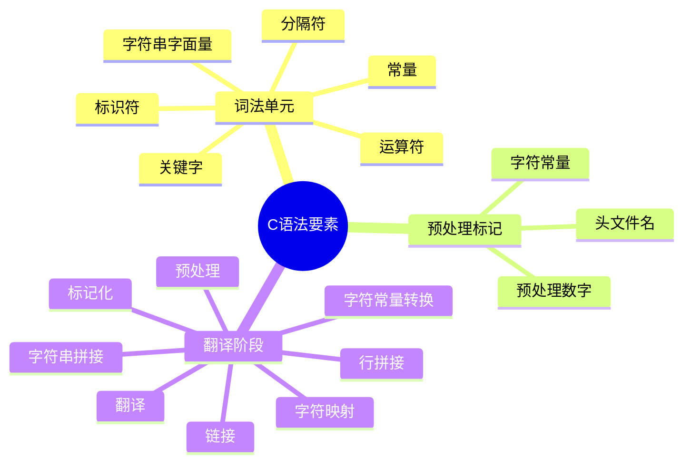

# C语言语法要素深度解析

> **层级定位**: 01 Core Knowledge System / 01 Basic Layer
> **对应标准**: C89/C99/C11/C17/C23
> **难度级别**: L1 了解
> **预估学习时间**: 2-3 小时

---

## 📋 本节概要

| 属性 | 内容 |
|:-----|:-----|
| **核心概念** | 词法单元、标识符、关键字、常量、字符串字面量 |
| **前置知识** | 无 |
| **后续延伸** | 表达式、语句、声明 |
| **权威来源** | K&R Ch2.1-2.3, C11标准 6.4 |

---

## 🧠 知识结构思维导图



---

## 📖 核心概念详解

### 1. 标识符 (Identifiers)

#### 1.1 命名规则

```c
// 有效标识符
int valid_name;      // 字母开头，下划线连接
int _private;        // 下划线开头（保留字风险）
int value2;          // 数字在末尾
int 变量名;          // Unicode标识符(C23)

// 无效标识符
// int 2value;       // 数字开头
// int class;        // 关键字
// int my-name;      // 连字符不允许
// int my name;      // 空格不允许
```

#### 1.2 作用域与可见性

```c
// 文件作用域（外部链接）
int global_var;

// 内部链接
static int internal_var;

void function(void) {
    // 块作用域
    int local_var;

    {
        // 嵌套作用域，隐藏外部同名变量
        int local_var;  // 不同的变量！
    }
}
```

### 2. 关键字 (Keywords)

#### 2.1 C89-C23关键字演进

| C89 | C99 | C11 | C23 | 用途 |
|:----|:----|:----|:----|:-----|
| auto | | | | 存储类（已少用） |
| break | | | | 跳转语句 |
| case | | | | switch分支 |
| char | | | | 字符类型 |
| const | | | | 类型限定 |
| continue | | | | 循环控制 |
| default | | | | switch默认 |
| do | | | | do-while循环 |
| double | | | | 双精度浮点 |
| else | | | | if分支 |
| enum | | | | 枚举 |
| extern | | | | 外部链接 |
| float | | | | 单精度浮点 |
| for | | | | for循环 |
| goto | | | | 无条件跳转 |
| if | | | | 条件语句 |
| int | | | | 整数类型 |
| long | | | | 长整型 |
| register | | | | 寄存器建议 |
| return | | | | 函数返回 |
| short | | | | 短整型 |
| signed | | | | 有符号 |
| sizeof | | | | 大小运算符 |
| static | | | | 静态存储 |
| struct | | | | 结构体 |
| switch | | | | 多分支 |
| typedef | | | | 类型定义 |
| union | | | | 联合体 |
| unsigned | | | | 无符号 |
| void | | | | 空类型 |
| volatile | | | | 易变限定 |
| while | | | | while循环 |
| | inline | | | 内联函数 |
| | restrict | | | 指针限定 |
| | _Bool | | | 布尔类型 |
| | _Complex | | | 复数类型 |
| | _Imaginary | | | 虚数类型 |
| | | _Alignas | alignas | 对齐指定 |
| | | _Alignof | alignof | 对齐查询 |
| | | _Atomic | | 原子类型 |
| | | _Static_assert | static_assert | 静态断言 |
| | | _Noreturn | noreturn | 无返回 |
| | | _Thread_local | thread_local | 线程存储 |
| | | _Generic | | 泛型选择 |
| | | | constexpr | 常量表达式 |
| | | | nullptr | 空指针 |
| | | | typeof | 类型推导 |
| | | | true/false | 布尔字面量 |

### 3. 常量 (Constants)

#### 3.1 整数常量

```c
// 十进制
int dec = 42;
int dec_negative = -42;

// 八进制（0开头）
int oct = 052;      // 42 in decimal

// 十六进制（0x/0X开头）
int hex = 0x2A;     // 42 in decimal
int hex_upper = 0X2a;

// 二进制（C23，0b/0B开头）
#if __STDC_VERSION__ >= 202311L
int bin = 0b101010;  // 42 in decimal
int bin_sep = 0b1010'1010;  // 单引号分隔符(C23)
#endif

// 整数后缀
unsigned int u = 42U;
long l = 42L;
unsigned long ul = 42UL;
long long ll = 42LL;
unsigned long long ull = 42ULL;
```

#### 3.2 浮点常量

```c
// 小数形式
double d1 = 3.14159;
double d2 = .5;       // 0.5
double d3 = 3.;       // 3.0

// 指数形式
double e1 = 3.14e10;   // 3.14 × 10^10
double e2 = 1E-10;     // 1 × 10^-10

// 十六进制浮点(C99)
double hex_float = 0x1.5p10;  // 1.3125 × 2^10 = 1344.0

// 后缀
float f = 3.14F;
double d = 3.14;      // 默认
double ld = 3.14L;    // long double
```

#### 3.3 字符常量

```c
// 普通字符
char c1 = 'A';
char c2 = '\n';  // 转义序列

// 转义序列
char newline = '\n';
char tab = '\t';
char backslash = '\\';
char single_quote = '\'';
char null_char = '\0';

// 八进制转义
char oct_esc = '\101';  // 'A' (65 in octal)

// 十六进制转义
char hex_esc = '\x41';  // 'A' (65 in hex)

// Unicode字符(C11)
char16_t c16 = u'中';   // UTF-16
char32_t c32 = U'中';   // UTF-32

// 宽字符
wchar_t wc = L'中';     // 平台相关
```

### 4. 字符串字面量

#### 4.1 字符串基本

```c
// 普通字符串
const char *s1 = "Hello, World!";

// 多行字符串（行拼接）
const char *s2 = "Line 1 "
                 "Line 2 "
                 "Line 3";

// 转义序列
const char *s3 = "Tab:\there\nNew line";

// 原始字符串（C23）
#if __STDC_VERSION__ >= 202311L
const char *raw = R"(Raw "string" without escapes)";
#endif
```

#### 4.2 Unicode字符串

```c
// UTF-8字符串(C11)
const char *utf8 = u8"Hello 世界";

// UTF-16字符串
const char16_t *utf16 = u"Hello 世界";

// UTF-32字符串
const char32_t *utf32 = U"Hello 世界";

// 宽字符串
const wchar_t *wide = L"Hello 世界";
```

#### 4.3 字符串修改陷阱

```c
// ❌ 未定义行为：修改字符串字面量
char *s = "Hello";  // 指向只读数据
s[0] = 'h';  // 崩溃或不可预测行为

// ✅ 可修改的字符数组
char modifiable[] = "Hello";  // 数组拷贝
modifiable[0] = 'h';  // OK

// ✅ 显式const
const char *read_only = "Hello";
// read_only[0] = 'h';  // 编译错误
```

---

## 🔄 多维矩阵对比

### 转义序列参考表

| 转义 | 含义 | ASCII值 |
|:-----|:-----|:-------:|
| `\a` | 警报(Bell) | 7 |
| `\b` | 退格 | 8 |
| `\f` | 换页 | 12 |
| `\n` | 换行 | 10 |
| `\r` | 回车 | 13 |
| `\t` | 水平制表 | 9 |
| `\v` | 垂直制表 | 11 |
| `\\` | 反斜杠 | 92 |
| `\'` | 单引号 | 39 |
| `\"` | 双引号 | 34 |
| `\?` | 问号 | 63 |
| `\0` | 空字符 | 0 |

---

## ⚠️ 常见陷阱

### 陷阱 SYN01: 字符与字符串混淆

```c
// ❌ 错误
char c = "A";  // char* 转 char，警告或错误

// ✅ 正确
char c = 'A';  // 字符常量
const char *s = "A";  // 字符串（含'\0'）
```

### 陷阱 SYN02: 八进制陷阱

```c
// ❌ 意外八进制
int x = 071;   // 57 in decimal，不是71！
int y = 0123;  // 83 in decimal

// ✅ 显式书写
int z = 123;   // 十进制
```

---

## ✅ 质量验收清单

- [x] 标识符命名规则
- [x] 关键字演进表
- [x] 常量类型详解
- [x] 字符串安全使用

---

> **更新记录**
>
> - 2025-03-09: 初版创建
