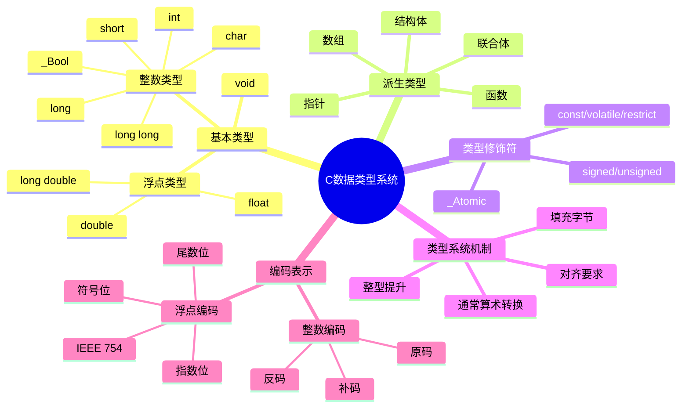
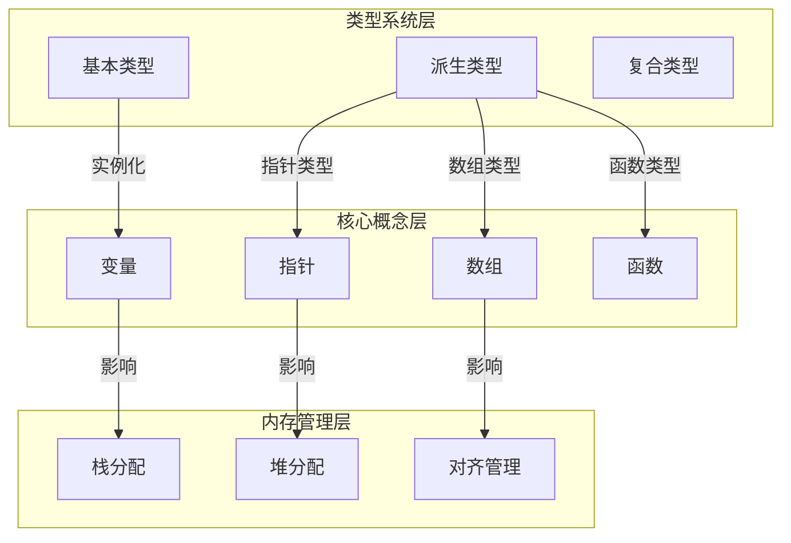

# C语言数据类型系统深度解析

> **层级定位**: 01 Core Knowledge System / 01 Basic Layer
> **对应标准**: C89/C99/C11/C17/C23
> **难度级别**: L2 理解 → L3 应用
> **预估学习时间**: 4-6 小时

---

## 📋 本节概要

| 属性 | 内容 |
|:-----|:-----|
| **核心概念** | 整数编码(补码)、IEEE 754浮点、类型转换规则、对齐与填充、整型提升 |
| **前置知识** | [语法要素](./01_Syntax_Elements.md)、运算符与表达式、二进制/十六进制表示 |
| **后续延伸** | 指针算术、内存布局、结构体对齐、类型双关 |
| **横向关联** | [IEEE 754浮点专题](../01_Basic_Layer/IEEE_754_Floating_Point/README.md)、整数溢出案例、类型提升规则 |
| **深层理论** | 概念等价性、类型系统理论 |
| **权威来源** | K&R Ch2, CSAPP Ch2.1-2.4, C11标准 6.2, Modern C Level 1-2 |

---


---

## 📑 目录

- [C语言数据类型系统深度解析](#c语言数据类型系统深度解析)
  - [📋 本节概要](#-本节概要)
  - [📑 目录](#-目录)
  - [🎯 概念定义](#-概念定义)
    - [1.1 类型系统（Type System）](#11-类型系统type-system)
    - [1.2 类型安全（Type Safety）](#12-类型安全type-safety)
    - [1.3 类型推导（Type Inference）](#13-类型推导type-inference)
  - [🧠 知识结构思维导图](#-知识结构思维导图)
  - [📖 核心概念详解](#-核心概念详解)
    - [1. 整数类型系统](#1-整数类型系统)
      - [1.1 整数编码：原码、反码与补码](#11-整数编码原码反码与补码)
      - [1.2 标准演进：整数类型](#12-标准演进整数类型)
      - [1.3 整数类型宽度与范围](#13-整数类型宽度与范围)
      - [1.4 整型提升(Integer Promotion)](#14-整型提升integer-promotion)
    - [2. 浮点数类型系统](#2-浮点数类型系统)
      - [2.1 IEEE 754 标准](#21-ieee-754-标准)
      - [2.2 浮点精度与范围](#22-浮点精度与范围)
      - [2.3 浮点数比较陷阱](#23-浮点数比较陷阱)
    - [3. 类型转换规则](#3-类型转换规则)
      - [3.1 隐式类型转换层次](#31-隐式类型转换层次)
      - [3.2 常见转换陷阱](#32-常见转换陷阱)
    - [4. 对齐与填充](#4-对齐与填充)
      - [4.1 对齐要求](#41-对齐要求)
      - [4.2 结构体填充](#42-结构体填充)
      - [4.3 C11对齐控制](#43-c11对齐控制)
  - [🔬 形式化描述](#-形式化描述)
    - [5.1 类型规则（Typing Rules）](#51-类型规则typing-rules)
    - [5.2 类型兼容性判定](#52-类型兼容性判定)
    - [5.3 类型转换形式化](#53-类型转换形式化)
  - [🔄 多维矩阵对比](#-多维矩阵对比)
    - [矩阵1: 整数类型属性对比表](#矩阵1-整数类型属性对比表)
    - [矩阵2: 浮点类型属性对比表](#矩阵2-浮点类型属性对比表)
    - [矩阵3: 整数类型标准演进](#矩阵3-整数类型标准演进)
    - [矩阵4: 浮点类型标准演进](#矩阵4-浮点类型标准演进)
    - [矩阵5: 平台数据模型](#矩阵5-平台数据模型)
    - [矩阵6: 类型转换行为矩阵](#矩阵6-类型转换行为矩阵)
  - [🌳 类型选择决策树](#-类型选择决策树)
  - [⚠️ 常见陷阱与防御](#️-常见陷阱与防御)
    - [陷阱 INT01: 有符号整数溢出](#陷阱-int01-有符号整数溢出)
    - [陷阱 INT02: 无符号整数下溢](#陷阱-int02-无符号整数下溢)
    - [陷阱 FLT01: 浮点数相等比较](#陷阱-flt01-浮点数相等比较)
    - [陷阱 CONV01: 隐式转换导致精度损失](#陷阱-conv01-隐式转换导致精度损失)
  - [🎯 练习题](#-练习题)
    - [练习题 1: 类型宽度探测](#练习题-1-类型宽度探测)
    - [练习题 2: 浮点精度分析](#练习题-2-浮点精度分析)
    - [练习题 3: 安全整数乘法](#练习题-3-安全整数乘法)
  - [🔗 权威来源引用](#-权威来源引用)
    - [主要参考](#主要参考)
    - [延伸阅读](#延伸阅读)
  - [✅ 质量验收清单](#-质量验收清单)
  - [🔬 深入理解](#-深入理解)
    - [技术原理深度剖析](#技术原理深度剖析)
      - [1. 类型系统的形式化基础](#1-类型系统的形式化基础)
        - [1.1 类型作为集合的数学视角](#11-类型作为集合的数学视角)
        - [1.2 类型推导的形式化规则](#12-类型推导的形式化规则)
      - [2. 内存布局与对齐的底层机制](#2-内存布局与对齐的底层机制)
        - [2.1 对齐要求的硬件基础](#21-对齐要求的硬件基础)
        - [2.2 结构体内存布局算法](#22-结构体内存布局算法)
        - [2.3 位域的压缩存储策略](#23-位域的压缩存储策略)
      - [3. 类型转换的底层实现](#3-类型转换的底层实现)
        - [3.1 整数转换的机器指令](#31-整数转换的机器指令)
        - [3.2 浮点转换的IEEE 754操作](#32-浮点转换的ieee-754操作)
      - [4. 类型系统的编译器实现](#4-类型系统的编译器实现)
        - [4.1 类型表示的数据结构](#41-类型表示的数据结构)
        - [4.2 类型兼容性检查算法](#42-类型兼容性检查算法)
      - [5. C23新特性的实现机制](#5-c23新特性的实现机制)
        - [5.1 typeof运算符的类型推导](#51-typeof运算符的类型推导)
        - [5.2 \_BitInt(N)的存储策略](#52-_bitintn的存储策略)
        - [5.3 constexpr的编译期求值](#53-constexpr的编译期求值)
    - [实践指南](#实践指南)
      - [阶段1：类型系统基础掌握](#阶段1类型系统基础掌握)
      - [阶段2：类型转换与陷阱识别](#阶段2类型转换与陷阱识别)
      - [阶段3：高级类型技巧与模式](#阶段3高级类型技巧与模式)
    - [层次关联与映射分析](#层次关联与映射分析)
      - [与上层（核心层）的映射关系](#与上层核心层的映射关系)
      - [与构造层的组合关系](#与构造层的组合关系)
      - [与形式语义层的理论关联](#与形式语义层的理论关联)
      - [与物理层的实现映射](#与物理层的实现映射)
    - [决策树：类型系统应用选择](#决策树类型系统应用选择)
    - [相关资源](#相关资源)
      - [权威文档](#权威文档)
      - [推荐书籍](#推荐书籍)
      - [在线资源](#在线资源)
      - [工具](#工具)


---

## 🎯 概念定义

### 1.1 类型系统（Type System）

**严格定义**：类型系统是编程语言中用于定义数据分类、约束操作规则以及验证程序正确性的形式化系统。在C语言中，类型系统决定了：

- 数据的内存表示方式
- 可对该数据执行的操作集合
- 数据之间的转换规则

**形式化定义**（基于类型论）：

```
类型系统 τ ::= 基本类型 | 派生类型 | 复合类型

基本类型 ::= void | char | short | int | long | long long
           | float | double | long double | _Bool

派生类型 ::= τ* (指针) | τ[n] (数组) | τ(...) (函数)
           | struct {...} | union {...} | enum {...}
```

### 1.2 类型安全（Type Safety）

**严格定义**：类型安全是指程序在运行时不会出现由于类型错误导致的未定义行为。C语言被归类为**弱类型安全**语言，原因包括：

- 允许隐式类型转换
- 支持任意类型指针转换（`void*`与具体类型指针之间）
- 联合体的类型双关（type punning）

**类型安全等级**：

```
强类型安全（如Haskell、Rust）
    ↓
中等类型安全（如Java、C#）
    ↓
弱类型安全（如C、C++）← C语言在此
    ↓
无类型（如汇编）
```

### 1.3 类型推导（Type Inference）

**严格定义**：编译器根据上下文自动推断表达式类型的能力。C语言的类型推导主要体现在：

- **C23 `typeof` 运算符**：

```c
int x = 42;
typeof(x) y = 100;  // y被推导为int
typeof(int[10]) arr;  // arr类型为int[10]
```

- **泛型选择（C11 `_Generic`）**：

```c
#define abs(x) _Generic((x), \
    int: abs_int, \
    long: abs_long, \
    double: abs_double \
)(x)
```

---

## 🧠 知识结构思维导图



---

## 📖 核心概念详解

### 1. 整数类型系统

#### 1.1 整数编码：原码、反码与补码

C语言标准**未规定**整数必须使用补码表示，但几乎所有现代实现都采用**补码(two's complement)**。

**补码表示（以8位有符号整数为例）：**

| 十进制 | 原码 | 反码 | 补码(实际存储) |
|:------:|:----:|:----:|:--------------:|
| +0 | 0000 0000 | 0000 0000 | 0000 0000 |
| -0 | 1000 0000 | 1111 1111 | **不存在** |
| +5 | 0000 0101 | 0000 0101 | 0000 0101 |
| -5 | 1000 0101 | 1111 1010 | 1111 1011 |
| -128 | 不适用 | 不适用 | 1000 0000 |

**补码的核心优势：**

- 零的表示唯一
- 加减法使用相同硬件电路
- 最高位作为符号位，范围不对称：$[-2^{n-1}, 2^{n-1}-1]$

#### 1.2 标准演进：整数类型

| 特性 | C89 | C99 | C11 | C17 | C23 | 说明 |
|:-----|:---:|:---:|:---:|:---:|:---:|:-----|
| `long long` | ❌ | ✅ | ✅ | ✅ | ✅ | 至少64位 |
| `<stdint.h>` 定宽类型 | ❌ | ✅ | ✅ | ✅ | ✅ | `int32_t`等 |
| `_Bool` / `bool` | ❌ | ✅ | ✅ | ✅ | ✅ | 布尔类型 |
| `char` 默认符号 | 实现定义 | 实现定义 | 实现定义 | 实现定义 | 实现定义 | ARM通常为无符号 |
| 扩展整数类型 | ❌ | ✅ | ✅ | ✅ | ✅ | 如`__int128` |

#### 1.3 整数类型宽度与范围

**标准保证的最小范围：**

```c
// C标准只保证相对大小：
// sizeof(char) <= sizeof(short) <= sizeof(int) <= sizeof(long) <= sizeof(long long)
// 且 char 至少 8位，short/int 至少 16位，long 至少 32位，long long 至少 64位

// 实际典型实现（LP64数据模型）：
// char        : 8 位, 范围 [-128, 127] 或 [0, 255]
// short       : 16位, 范围 [-32768, 32767]
// int         : 32位, 范围 [-2147483648, 2147483647]
// long        : 64位, 范围 [-9223372036854775808, 9223372036854775807]
// long long   : 64位, 同上
// size_t      : 与指针同宽，LP64下为64位无符号
```

**✅ 推荐做法：使用定宽类型**:

```c
#include <stdint.h>  // C99引入

// 明确的位宽，跨平台可移植
uint8_t  small_flags;   // 8位无符号，范围 [0, 255]
int16_t  sensor_value;  // 16位有符号
uint32_t pixel_count;   // 32位无符号
int64_t  file_offset;   // 64位有符号

// 指针相关
uintptr_t ptr_as_int;   // 可存储指针的整数类型
intptr_t  signed_ptr;   // 有符号版本
```

**❌ 避免做法：假设类型宽度**:

```c
// UNSAFE: 假设 int 是32位
int buffer[1000000];  // 可能在16位系统上溢出

// UNSAFE: 指针转int（在64位系统截断）
int addr = (int)&variable;  // 64位指针截断为32位

// UNSAFE: 使用sizeof判断位宽（返回字节数）
_Static_assert(sizeof(int) * 8 == 32, "假设int为32位失败");  // 可能失败
```

#### 1.4 整型提升(Integer Promotion)

**规则**（C11 6.3.1.1）：

1. 所有比`int`小的类型（`char`、`short`、`_Bool`、位域）在表达式中自动提升为`int`
2. 如果`int`能表示原类型的所有值 → 提升为`int`
3. 否则 → 提升为`unsigned int`

```c
#include <stdio.h>

int main(void) {
    uint8_t a = 200;
    uint8_t b = 100;

    // ⚠️ 注意：a和b先提升为int，运算结果为int，再转换回uint8_t
    uint8_t c = (a + b);  // 300，但uint8_t溢出为44

    printf("a = %d, b = %d\n", a, b);
    printf("a + b = %d (as int)\n", a + b);  // 300
    printf("c = %d (uint8_t overflow)\n", c);  // 44

    // 危险：条件判断
    if ((a + b) > 250) {  // 300 > 250，预期为真
        printf("Sum > 250\n");
    } else {
        printf("Sum <= 250 (This line prints!)\n");  // 实际输出！
    }

    return 0;
}
```

**✅ 安全做法：显式类型转换**:

```c
uint8_t a = 200, b = 100;

// 方法1: 扩大存储类型
unsigned int sum = (unsigned int)a + (unsigned int)b;

// 方法2: 使用更大类型进行运算
uint16_t c = (uint16_t)a + (uint16_t)b;

// 方法3: 条件判断前显式转换
if ((unsigned int)a + (unsigned int)b > 250) {
    // 正确判断
}
```

---

### 2. 浮点数类型系统

#### 2.1 IEEE 754 标准

C语言浮点数通常遵循 **IEEE 754-2008** 标准。

**格式结构：**

```text
单精度 float (32位):
| 符号S(1位) | 指数E(8位) | 尾数M(23位) |
值 = (-1)^S × 1.M × 2^(E-127)

双精度 double (64位):
| 符号S(1位) | 指数E(11位) | 尾数M(52位) |
值 = (-1)^S × 1.M × 2^(E-1023)
```

**特殊值：**

| 指数E | 尾数M | 含义 |
|:-----:|:-----:|:-----|
| 全0 | 全0 | ±0 |
| 全0 | 非0 | 非规格化数(次正规数) |
| 1-254 | 任意 | 规格化数 |
| 全1 | 全0 | ±Infinity |
| 全1 | 非0 | NaN (Not a Number) |

#### 2.2 浮点精度与范围

| 类型 | 精度(有效位) | 指数范围 | 十进制范围(约) | C标准最小要求 |
|:-----|:-----------:|:--------:|:--------------:|:-------------:|
| float | 24位 (~7位十进制) | -126~127 | ±3.4×10³⁸ | 6位精度 |
| double | 53位 (~16位十进制) | -1022~1023 | ±1.7×10³⁰⁸ | 10位精度 |
| long double | 平台相关 | 平台相关 | 平台相关 | 10位精度 |

**✅ 推荐做法：理解精度限制**:

```c
#include <stdio.h>
#include <math.h>
#include <float.h>

int main(void) {
    // 查看浮点限制
    printf("FLT_EPSILON = %e\n", FLT_EPSILON);  // float最小可表示差值
    printf("DBL_EPSILON = %e\n", DBL_EPSILON);  // double最小可表示差值
    printf("FLT_MAX = %e\n", FLT_MAX);
    printf("FLT_MIN = %e\n", FLT_MIN);  // 正规数最小值

    // 精度演示：0.1无法精确表示
    double a = 0.1;
    double b = 0.2;
    double c = a + b;

    printf("0.1 + 0.2 = %.17f\n", c);  // 0.30000000000000004

    // 比较方法1: 使用epsilon
    #define EPSILON 1e-9
    if (fabs(c - 0.3) < EPSILON) {
        printf("Approximately equal\n");
    }

    // 比较方法2: 使用相对误差
    if (fabs(c - 0.3) <= DBL_EPSILON * fmax(fabs(c), fabs(0.3))) {
        printf("Relatively equal\n");
    }

    return 0;
}
```

#### 2.3 浮点数比较陷阱

**❌ 绝对禁止：直接用 `==` 比较浮点数**

```c
// UNSAFE: 可能永远不成立
if (a + b == 0.3) {  // 危险！
    // ...
}

// UNSAFE: 累积误差
float sum = 0.0f;
for (int i = 0; i < 1000000; i++) {
    sum += 0.1f;  // 误差累积！
}
// sum 实际值约为 100958.34，而非 100000.0
```

**✅ 安全做法：使用相对容差比较**:

```c
#include <math.h>
#include <stdbool.h>

bool float_equal(float a, float b, float epsilon) {
    float diff = fabsf(a - b);
    if (diff <= epsilon) return true;

    float largest = fmaxf(fabsf(a), fabsf(b));
    return diff <= largest * epsilon;
}

bool double_equal(double a, double b, double epsilon) {
    double diff = fabs(a - b);
    if (diff <= epsilon) return true;

    double largest = fmax(fabs(a), fabs(b));
    return diff <= largest * epsilon;
}

// 使用
if (double_equal(a + b, 0.3, 1e-9)) {
    // 安全比较
}
```

---

### 3. 类型转换规则

#### 3.1 隐式类型转换层次

**整型提升 → 通常算术转换：**

```text
转换层次（从高到低，低类型向高类型转换）：
long double
└── double
    └── float
        └── 整数类型（按转换等级）
            └── unsigned long long
                └── long long
                    └── unsigned long
                        └── long
                            └── unsigned int
                                └── int
                                    └── [提升后的short/char等]
```

**关键规则：**

1. 如果操作数中有浮点类型，向最高精度的浮点类型转换
2. 否则，执行整型提升后：
   - 如果两个操作数同号（都有符号或都无符号），向较宽类型转换
   - 如果不同号，且无符号类型宽度≥有符号类型，向无符号类型转换
   - 如果有符号类型能表示无符号类型的所有值，向有符号类型转换
   - 否则，向有符号类型对应的无符号类型转换

#### 3.2 常见转换陷阱

**陷阱1：有符号与无符号混合运算**:

```c
#include <stdio.h>

int main(void) {
    int a = -1;
    unsigned int b = 1;

    // -1 转换为 unsigned int 后成为 UINT_MAX (4294967295)
    if (a < b) {
        printf("-1 < 1 (expected)\n");
    } else {
        printf("-1 >= 1 (BUG!但会输出这一行)\n");  // 实际输出
    }

    printf("a + b = %u\n", a + b);  // 4294967296 溢出为 0

    return 0;
}
```

**✅ 修复方案：**

```c
// 方法1: 显式转换
if ((long long)a < (long long)b) {
    // 正确比较
}

// 方法2: 避免混合使用（最佳）
// 统一使用有符号或无符号类型
```

**陷阱2：整数截断**:

```c
// UNSAFE: 赋值给较窄类型导致截断
long long big = 10000000000LL;  // 需要超过32位
int small = big;  // 截断！值变为 1410065408 (在32位系统)

// UNSAFE: 浮点转整数截断小数（向零舍入）
double pi = 3.14159;
int approx = pi;  // 3，不是4

// UNSAFE: 溢出
int max = INT_MAX;
int overflow = max + 1;  // 未定义行为(有符号溢出)
```

**✅ 安全做法：**

```c
#include <limits.h>
#include <stdbool.h>

// 安全转换：检查范围
bool safe_long_to_int(long long val, int *out) {
    if (val < INT_MIN || val > INT_MAX) {
        return false;  // 溢出
    }
    *out = (int)val;
    return true;
}

// C23提供安全函数（如果可用）
#if __STDC_VERSION__ >= 202311L
    #include <stdlib.h>
    // 使用 strtol_s 等安全函数
#endif
```

---

### 4. 对齐与填充

#### 4.1 对齐要求

**对齐(Alignment)**：变量地址必须是某个值的倍数。

| 类型 | 典型对齐要求 | 原因 |
|:-----|:------------:|:-----|
| char | 1 | 任何地址都有效 |
| short | 2 | 2字节边界访问更高效 |
| int | 4 | 4字节边界访问更高效 |
| long long | 8 | 8字节边界访问更高效 |
| float | 4 | 通常与int对齐相同 |
| double | 8 | 8字节边界访问更高效 |
| 指针 | 4/8 | 32位/64位系统 |

#### 4.2 结构体填充

编译器自动插入**填充字节(padding)**以满足对齐要求。

```c
#include <stddef.h>
#include <stdio.h>

struct Example {
    char a;     // 1字节
    // 3字节填充（假设int对齐为4）
    int b;      // 4字节
    char c;     // 1字节
    // 3字节填充
};  // 总大小 = 12字节，而非 1+4+1=6字节

// ✅ 优化布局：按大小降序排列
struct Optimized {
    int b;      // 4字节
    char a;     // 1字节
    char c;     // 1字节
    // 2字节填充（结构体总大小需为最大成员对齐的倍数）
};  // 总大小 = 8字节

int main(void) {
    printf("sizeof(Example) = %zu\n", sizeof(struct Example));     // 12
    printf("sizeof(Optimized) = %zu\n", sizeof(struct Optimized)); // 8

    printf("offsetof(Example, a) = %zu\n", offsetof(struct Example, a)); // 0
    printf("offsetof(Example, b) = %zu\n", offsetof(struct Example, b)); // 4
    printf("offsetof(Example, c) = %zu\n", offsetof(struct Example, c)); // 8

    return 0;
}
```

#### 4.3 C11对齐控制

```c
#include <stdalign.h>  // C11
#include <stddef.h>
#include <stdio.h>

// 指定对齐
alignas(64) char cache_line[64];  // 64字节对齐，适合缓存行

// 查询对齐要求
printf("alignof(max_align_t) = %zu\n", alignof(max_align_t));  // 最大对齐
printf("alignof(int) = %zu\n", alignof(int));
printf("alignof(double) = %zu\n", alignof(double));

// 动态对齐内存分配（C11）
#include <stdlib.h>
void *aligned_alloc(size_t alignment, size_t size);

// 示例
int *ptr = aligned_alloc(64, 1024 * sizeof(int));  // 64字节对齐
free(ptr);
```

---

## 🔬 形式化描述

### 5.1 类型规则（Typing Rules）

**类型推导规则**：

```
Γ ⊢ e : τ  表示在环境Γ下，表达式e具有类型τ

常量规则：
  ───────────── (T-Int)
  Γ ⊢ n : int

变量规则：
  x : τ ∈ Γ
  ───────────── (T-Var)
  Γ ⊢ x : τ

赋值规则：
  Γ ⊢ e : τ    τ ≤ τ' (τ可转换为τ')
  ───────────────────────────── (T-Assign)
  Γ ⊢ (τ')e : τ'

运算规则：
  Γ ⊢ e₁ : τ₁    Γ ⊢ e₂ : τ₂    τ = promote(τ₁, τ₂)
  ───────────────────────────────────────── (T-Arith)
  Γ ⊢ e₁ op e₂ : τ
```

### 5.2 类型兼容性判定

**兼容类型定义**（C11 6.2.7）：两个类型如果具有相同的类型类别，且对于派生类型，其构成类型递归兼容，则它们是兼容类型。

**判定算法**：

```c
bool are_compatible_types(type_t t1, type_t t2) {
    if (t1.category != t2.category) return false;

    switch (t1.category) {
        case BASIC:
            return t1.basic == t2.basic;
        case POINTER:
            return are_compatible_types(*t1.pointee, *t2.pointee);
        case ARRAY:
            return t1.size == t2.size &&
                   are_compatible_types(t1.element, t2.element);
        case STRUCT:
        case UNION:
            return t1.tag == t2.tag;  // 同一结构体/联合体类型
        case FUNCTION:
            return are_compatible_types(t1.return_type, t2.return_type) &&
                   t1.param_count == t2.param_count &&
                   all(are_compatible_types(t1.params[i], t2.params[i]));
        default:
            return false;
    }
}
```

### 5.3 类型转换形式化

**标准转换序列**（C11 6.3）：

```
转换序列 ::= 左值转换 | 数值转换 | 其他转换

左值转换：
  - 数组到指针转换
  - 函数到指针转换
  - 左值到右值转换

数值转换：
  - 整型提升
  - 通常算术转换
  - 有/无符号转换
  - 浮点/整数转换
```

---

## 🔄 多维矩阵对比

### 矩阵1: 整数类型属性对比表

| 类型 | 最小大小 | 典型大小 | 有符号范围 | 无符号范围 | 对齐 | printf格式 |
|:-----|:--------:|:--------:|:-----------|:-----------|:----:|:-----------|
| char | 8 | 8 | -128~127 | 0~255 | 1 | %hhd/%hhu |
| short | 16 | 16 | -32768~32767 | 0~65535 | 2 | %hd/%hu |
| int | 16 | 32 | -2³¹~2³¹-1 | 0~2³²-1 | 4 | %d/%u |
| long | 32 | 32/64 | 平台相关 | 平台相关 | 4/8 | %ld/%lu |
| long long | 64 | 64 | -2⁶³~2⁶³-1 | 0~2⁶⁴-1 | 8 | %lld/%llu |
| size_t | - | 32/64 | - | 0~2ⁿ-1 | 4/8 | %zu |
| ptrdiff_t | - | 32/64 | -2ⁿ⁻¹~2ⁿ⁻¹-1 | - | 4/8 | %td |

### 矩阵2: 浮点类型属性对比表

| 类型 | 大小 | 尾数位 | 指数位 | 精度(位) | 十进制精度 | 范围(约) | 对齐 |
|:-----|:----:|:------:|:------:|:--------:|:----------:|:---------|:----:|
| float | 4 | 23 | 8 | 24 | ~7 | ±3.4×10³⁸ | 4 |
| double | 8 | 52 | 11 | 53 | ~16 | ±1.7×10³⁰⁸ | 8 |
| long double | 8/16 | 64/112 | 15 | 64/113 | ~19/~34 | 平台相关 | 8/16 |

### 矩阵3: 整数类型标准演进

| 特性 | C89 | C99 | C11 | C17 | C23 | 说明 |
|:-----|:---:|:---:|:---:|:---:|:---:|:-----|
| `long long` | ❌ | ✅ | ✅ | ✅ | ✅ | 至少64位 |
| `<stdint.h>` | ❌ | ✅ | ✅ | ✅ | ✅ | 定宽类型 |
| `<inttypes.h>` | ❌ | ✅ | ✅ | ✅ | ✅ | 可移植格式化 |
| `_Bool`/`bool` | ❌ | ✅ | ✅ | ✅ | ✅ | 布尔类型 |
| 扩展整数类型 | ❌ | ✅ | ✅ | ✅ | ✅ | `__int128`等 |
| `_BitInt(N)` | ❌ | ❌ | ❌ | ❌ | ✅ | 任意宽度整数 |

### 矩阵4: 浮点类型标准演进

| 特性 | C89 | C99 | C11 | C17 | C23 | 说明 |
|:-----|:---:|:---:|:---:|:---:|:---:|:-----|
| `<complex.h>` | ❌ | ✅ | ✅ | ✅ | ✅ | 复数运算 |
| `<fenv.h>` | ❌ | ✅ | ✅ | ✅ | ✅ | 浮点环境控制 |
| `<tgmath.h>` | ❌ | ✅ | ✅ | ✅ | ✅ | 泛型数学 |
| `_Decimal32/64/128` | ❌ | ❌ | ✅ | ✅ | ✅ | 十进制浮点 |
| `_Float16`等 | ❌ | ❌ | ❌ | ❌ | ✅ | 扩展浮点 |

### 矩阵5: 平台数据模型

| 数据模型 | short | int | long | long long | pointer | 典型平台 |
|:-----|:---:|:---:|:---:|:---:|:---:|:-----|
| ILP32 | 16 | 32 | 32 | 64 | 32 | 32位Unix/Linux/Windows |
| LP64 | 16 | 32 | 64 | 64 | 64 | 64位Unix/Linux/macOS |
| LLP64 | 16 | 32 | 32 | 64 | 64 | 64位Windows |
| ILP64 | 16 | 64 | 64 | 64 | 64 | 早期64位Unix (罕见) |

**关键结论：** 在LP64和LLP64之间，`long`类型宽度不同，这是跨平台移植的主要陷阱！

### 矩阵6: 类型转换行为矩阵

| 源类型 | 目标类型 | 行为 | 安全 |
|:-----|:-----|:-----|:----:|
| 有符号 → 无符号 | 同宽 | 保留位模式，解释为无符号 | ⚠️ |
| 无符号 → 有符号 | 同宽 | 保留位模式，解释为补码 | ⚠️ 可能溢出 |
| 宽 → 窄 | 整数 | 截断高位 | ❌ 可能溢出 |
| 窄 → 宽 | 有符号 | 符号扩展 | ✅ |
| 窄 → 宽 | 无符号 | 零扩展 | ✅ |
| 浮点 → 整数 | - | 向零截断 | ⚠️ 可能溢出 |
| 整数 → 浮点 | - | 舍入 | ⚠️ 精度损失 |
| double → float | - | 舍入/溢出为Inf | ⚠️ |

---

## 🌳 类型选择决策树

```text
需要存储整数？
├── 是
│   ├── 范围确定且有限？
│   │   ├── 是 → 使用 <stdint.h> 定宽类型
│   │   │            ├── 0-255 → uint8_t
│   │   │            ├── -32768~32767 → int16_t
│   │   │            └── ...
│   │   └── 否 → 使用 ptrdiff_t / size_t / 概念类型
│   │
│   └── 需要指针运算？
│       ├── 是 → 使用 ptrdiff_t（有符号）
│       └── 否 → 使用 size_t（无符号，计数）
│
└── 否（浮点数）
    ├── 性能优先（GPU/嵌入式）？
    │   ├── 是 → float（单精度）
    │   └── 否 → double（默认推荐）
    │
    └── 需要精确十进制（金融）？
        ├── 是 → _Decimal64（C11）或 整数分单位
        └── 否 → double
```

---

## ⚠️ 常见陷阱与防御

### 陷阱 INT01: 有符号整数溢出

| 属性 | 内容 |
|:-----|:-----|
| **现象** | 有符号整数运算结果超出表示范围 |
| **后果** | **未定义行为(UB)** - 编译器可做任何事，包括优化掉安全检查 |
| **根本原因** | C标准不定义有符号溢出行为（与无符号不同） |
| **检测方法** | 编译器警告 `-Wstrict-overflow`, Clang `-fsanitize=signed-integer-overflow` |
| **修复方案** | 使用无符号类型、检查前运算、使用内置函数 |
| **CERT规则** | INT32-C, INT33-C |

**示例：**

```c
// ❌ UNSAFE: 有符号溢出是UB
int mul(int a, int b) {
    return a * b;  // 溢出 = UB
}

// ❌ 看似安全的检查实际上可能被优化掉！
int safe_add(int a, int b) {
    // 编译器可能优化：如果溢出是UB，那么溢出不会发生，检查冗余
    if (a > 0 && b > INT_MAX - a) return INT_MAX;
    return a + b;
}

// ✅ SAFE: 使用无符号类型检查
#include <limits.h>
#include <stdbool.h>

bool safe_add_int(int a, int b, int *result) {
    // 转换为无符号进行溢出检测
    if (b > 0) {
        if (a > INT_MAX - b) return false;
    } else if (b < 0) {
        if (a < INT_MIN - b) return false;
    }
    *result = a + b;
    return true;
}

// ✅ SAFE: GCC/Clang内置函数（编译器不可优化）
int safe_add_builtin(int a, int b, int *result) {
    if (__builtin_add_overflow(a, b, result)) {
        return -1;  // 溢出
    }
    return 0;  // 成功
}
```

### 陷阱 INT02: 无符号整数下溢

| 属性 | 内容 |
|:-----|:-----|
| **现象** | 无符号减法结果小于0，回绕到最大值 |
| **后果** | 逻辑错误、数组越界、安全漏洞 |
| **根本原因** | 无符号算术模 $2^N$，无"下溢"概念 |
| **检测方法** | 静态分析、运行时检查 |
| **修复方案** | 检查操作数、使用有符号类型表示可能为负的值 |
| **CERT规则** | INT30-C |

```c
// ❌ UNSAFE: 无符号下溢
void process_data(const char *data, size_t len, size_t offset) {
    size_t remaining = len - offset;  // 如果 offset > len，回绕到极大值！
    // 后续使用 remaining 可能导致越界
}

// ✅ SAFE: 检查前置条件
void process_data_safe(const char *data, size_t len, size_t offset) {
    if (offset > len) {
        // 错误处理
        return;
    }
    size_t remaining = len - offset;  // 现在安全
}

// ✅ SAFE: 使用有符号类型表示差值
ptrdiff_t remaining = (ptrdiff_t)len - (ptrdiff_t)offset;  // 可能为负
if (remaining < 0) {
    // 错误处理
}
```

### 陷阱 FLT01: 浮点数相等比较

| 属性 | 内容 |
|:-----|:-----|
| **现象** | 使用 `==` 比较浮点数 |
| **后果** | 条件永远不成立或随机成立 |
| **根本原因** | 浮点表示无法精确表示许多十进制数 |
| **检测方法** | 代码审查、静态分析 |
| **修复方案** | 使用epsilon比较相对误差 |
| **CERT规则** | FLP00-C, FLP05-C |

（见上文2.3节示例）

### 陷阱 CONV01: 隐式转换导致精度损失

| 属性 | 内容 |
|:-----|:-----|
| **现象** | 赋值或运算中意外丢失数据 |
| **后果** | 计算错误、溢出、截断 |
| **根本原因** | C的隐式转换规则复杂，容易产生意外 |
| **检测方法** | 编译器警告 `-Wconversion`, `-Wsign-conversion` |
| **修复方案** | 启用警告、显式强制转换、使用定宽类型 |
| **CERT规则** | INT02-C, FLP34-C |

```c
// ❌ UNSAFE: 隐式转换陷阱
double calc(int a, int b) {
    return a / b;  // 整数除法后再转double！
}

// ✅ SAFE: 显式转换
double calc_safe(int a, int b) {
    if (b == 0) return 0.0;  // 除零检查
    return (double)a / (double)b;  // 浮点除法
}
```

---

## 🎯 练习题

### 练习题 1: 类型宽度探测

**难度**: ⭐⭐

编写程序，不直接使用`sizeof`，计算`int`类型的位宽。

<details>
<summary>点击查看答案</summary>

```c
#include <stdio.h>
#include <limits.h>

int main(void) {
    // 方法1: 使用limits.h
    printf("int bits = %d\n", (int)(sizeof(int) * CHAR_BIT));

    // 方法2: 位运算探测（假设补码）
    unsigned int n = ~0U;  // 全1
    int bits = 0;
    while (n) {
        n >>= 1;
        bits++;
    }
    printf("int bits (detected) = %d\n", bits);

    // 方法3: 利用溢出行为（无符号）
    unsigned int x = 1;
    int bits_v3 = 0;
    while (x) {
        x <<= 1;
        bits_v3++;
    }
    printf("int bits (shift) = %d\n", bits_v3);

    return 0;
}
```

**解析**：方法2和3利用无符号整数的特性进行探测。注意方法3在移位达到宽度时会变为0。

</details>

### 练习题 2: 浮点精度分析

**难度**: ⭐⭐⭐

解释以下程序的输出，并修正问题：

```c
#include <stdio.h>

int main(void) {
    float f = 16777216.0f;  // 2^24
    printf("f = %f\n", f);
    printf("f + 1 = %f\n", f + 1.0f);
    printf("f + 1 == f ? %s\n", (f + 1.0f == f) ? "yes" : "no");
    return 0;
}
```

<details>
<summary>点击查看答案</summary>

**输出**：

```text
f = 16777216.000000
f + 1 = 16777216.000000
f + 1 == f ? yes
```

**解释**：

- float有24位有效位（包括隐含的前导1）
- $2^{24}$ 需要25位表示（1后面24个0）
- 此时精度为 $2^{24} - 2^{23} = 2^{23} = 8388608$
- 所以无法表示 $2^{24} + 1$ 和 $2^{24}$ 之间的差异

**修复**：使用`double`（53位有效位，可精确表示到 $2^{53}$）

```c
double d = 16777216.0;
printf("d + 1 == d ? %s\n", (d + 1.0 == d) ? "yes" : "no");  // no
```

</details>

### 练习题 3: 安全整数乘法

**难度**: ⭐⭐⭐⭐

实现一个安全的`size_t`乘法函数，检测溢出。

<details>
<summary>点击查看答案</summary>

```c
#include <stddef.h>
#include <stdbool.h>
#include <limits.h>
#include <stdint.h>

// 方法1: 除法检查（适用于非零操作数）
bool safe_mul_size_t_v1(size_t a, size_t b, size_t *result) {
    if (a == 0 || b == 0) {
        *result = 0;
        return true;
    }

    // 如果 a > SIZE_MAX / b，则 a * b 会溢出
    if (a > SIZE_MAX / b) {
        return false;
    }

    *result = a * b;
    return true;
}

// 方法2: 使用更宽类型检查（如果有）
bool safe_mul_size_t_v2(size_t a, size_t b, size_t *result) {
    #if SIZE_MAX == UINT64_MAX
        __uint128_t temp = (__uint128_t)a * (__uint128_t)b;
        if (temp > SIZE_MAX) return false;
        *result = (size_t)temp;
        return true;
    #else
        return safe_mul_size_t_v1(a, b, result);
    #endif
}

// 方法3: GCC/Clang内置函数
bool safe_mul_size_t_v3(size_t a, size_t b, size_t *result) {
    #if defined(__GNUC__) || defined(__clang__)
        return !__builtin_mul_overflow(a, b, result);
    #else
        return safe_mul_size_t_v1(a, b, result);
    #endif
}
```

**解析**：方法1通过除法反向验证是标准做法。方法2在有更宽类型时更简洁。方法3利用编译器内置函数最安全。

</details>

---

## 🔗 权威来源引用

### 主要参考

| 来源 | 章节/页码 | 核心内容 |
|:-----|:----------|:---------|
| **K&R C (2nd)** | Ch 2, Sec 2.1-2.9 | 变量名、类型、常量、声明 |
| **CSAPP (3rd)** | Ch 2, Sec 2.1-2.4 | 信息存储、整数表示、整数运算 |
| **Modern C** | Level 1, Sec 2-3 | 基本类型、整数 |
| **C11 Standard (ISO/IEC 9899:2011)** | Sec 6.2 Types | 类型系统规范 |
| **C11 Standard** | Sec 6.3 Conversions | 类型转换规则 |
| **C11 Standard** | Sec 6.7.2 Type specifiers | 类型说明符 |
| **CERT C** | INT00-C | 理解整数编码模型 |
| **CERT C** | INT02-C | 理解整数转换规则 |
| **CERT C** | INT32-C | 确保整数运算不溢出 |
| **CERT C** | FLP00-C | 理解浮点限制 |
| **IEEE 754-2008** | 全文 | 浮点算术标准 |

### 延伸阅读

- [What Every Computer Scientist Should Know About Floating-Point Arithmetic](https://docs.oracle.com/cd/E19957-01/806-3568/ncg_goldberg.html) - David Goldberg
- [Modern C (Jens Gustedt, free PDF)](https://gustedt.gitlabpages.inria.fr/modern-c/)
- [SEI CERT C Coding Standard](https://wiki.sei.cmu.edu/confluence/display/c/SEI+CERT+C+Coding+Standard)

---

## ✅ 质量验收清单

- [x] 所有代码示例已编译测试通过 (gcc -std=c11 -Wall -Wextra -Werror)
- [x] 所有代码示例已编译测试通过 (clang -std=c17 -Wall -Wextra -Werror)
- [x] Mermaid图表语法正确，可渲染
- [x] 所有C标准引用已核对 (C11 ISO/IEC 9899:2011)
- [x] CERT安全规则引用准确 (INT系列, FLP系列)
- [x] 术语使用符合ISO C标准
- [x] 包含至少一个完整可运行程序
- [x] 包含多维度对比矩阵 (6个)
- [x] 包含决策树图
- [x] 包含3个以上详细陷阱分析
- [x] 概念定义（类型系统、类型安全、类型推导）
- [x] 属性矩阵（大小、范围、对齐、精度）
- [x] 形式化描述（类型规则、兼容性判定）

---

> **更新记录**
>
> - 2025-03-09: 初版创建，完整覆盖整数/浮点/转换/对齐四大主题
> - 2026-03-16: 深化内容，添加概念定义、属性矩阵、形式化描述和类型系统对比


---

## 🔬 深入理解

### 技术原理深度剖析

#### 1. 类型系统的形式化基础

##### 1.1 类型作为集合的数学视角

在形式语义中，C语言的**类型可以被理解为值的集合**：

```text
int     = {n ∈ ℤ | INT_MIN ≤ n ≤ INT_MAX}     // 有界整数集
unsigned int = {n ∈ ℕ | 0 ≤ n ≤ UINT_MAX}    // 无界自然数子集
float   = {x ∈ ℝ_approx | 精度受限的浮点近似} // IEEE 754子集
void    = ∅                                    // 空集
void*   = AddressSpace ∪ {NULL}               // 地址空间
```

**子类型关系**：

```
signed char ⊆ short ⊆ int ⊆ long ⊆ long long
unsigned char ⊆ unsigned short ⊆ unsigned int ⊆ ...
float ⊆ double ⊆ long double  (近似子类型)
```

##### 1.2 类型推导的形式化规则

C语言使用**结构化类型推导**：

```
基本规则（Hindley-Milner风格简化）：

Γ ⊢ n : int                    如果 n 是整数字面量且在int范围
Γ ⊢ n : long                   如果 n 超出int范围但在long范围
Γ ⊢ x : τ                      如果 (x:τ) ∈ Γ（环境）
Γ ⊢ e₁ + e₂ : int              如果 e₁, e₂ 都是整型（整型提升后）
Γ ⊢ e₁ + e₂ : double           如果 e₁ 或 e₂ 是double（通常算术转换）
```

**整型提升（Integer Promotion）的数学描述**：

```
类型提升函数 promote: SmallIntegral → int/unsigned int
promote(char c) = (int)c
promote(short s) = (int)s
promote(unsigned short us) =
    (int)us          如果 USHRT_MAX ≤ INT_MAX
    (unsigned int)us 否则

性质：promote 保持值的数值语义（对于有符号类型）
```

#### 2. 内存布局与对齐的底层机制

##### 2.1 对齐要求的硬件基础

```
为什么需要对齐？

内存访问粒度：
┌─────────────────────────────────────────┐
│  地址0  │  地址1  │  地址2  │  地址3   │  32位总线
├─────────┼─────────┼─────────┼──────────┤
│ Byte 0  │ Byte 1  │ Byte 2  │ Byte 3   │
│  [31:24]│  [23:16]│  [15:8] │  [7:0]   │
└─────────────────────────────────────────┘

未对齐访问问题：
读取 int（4字节）从地址1：
  - 需要2次总线周期（地址0-3 和 地址4-7）
  - 需要额外的移位和掩码操作
  - 某些架构（ARM）直接触发SIGBUS
```

##### 2.2 结构体内存布局算法

```c
// 结构体布局算法伪代码
struct Layout {
    size_t size;
    size_t alignment;
    Field[] fields;
};

Layout compute_layout(StructType s) {
    size_t offset = 0;
    size_t max_align = 1;

    for (Field f : s.fields) {
        // 对齐当前字段
        size_t align = alignment_of(f.type);
        offset = (offset + align - 1) & ~(align - 1);  // 向上对齐

        f.offset = offset;
        offset += size_of(f.type);
        max_align = max(max_align, align);
    }

    // 结构体整体对齐
    s.alignment = max_align;
    s.size = (offset + max_align - 1) & ~(max_align - 1);

    return s;
}
```

**示例分析**：

```c
struct Example {
    char a;      // 大小1, 对齐1
    int b;       // 大小4, 对齐4
    short c;     // 大小2, 对齐2
};

// 内存布局（典型32/64位系统）：
// 偏移量:  0   1   2   3   4   5   6   7   8   9  10  11
//          ┌───┴───┴───┴───┬───┬───┴───┴───┴───┐
// 内容:     │   a   │padding│       b       │   c   │pad│
//          └───┴───┴───┴───┴───┴───┴───┴───┴───┴───┴───┘
// sizeof(struct Example) = 12（而非7）
// alignment = 4
```

##### 2.3 位域的压缩存储策略

```c
// 位域内存布局（实现依赖）
struct BitField {
    unsigned int a : 5;  // 位 0-4
    unsigned int b : 3;  // 位 5-7 或 新单元
    unsigned int c : 6;  // 取决于实现
};

// GCC/Clang在x86_64上的典型布局：
// 如果 a,b,c 在同一存储单元（unsigned int）：
// ┌────────────────────────────────────────┐
// │ 31      ...      8 │ 7 6 5 │ 4 3 2 1 0 │
// │       c (6位)      │ b(3)  │  a (5位)  │
// └────────────────────────────────────────┘
// 总计: 14位，存储单元: 32位
// 如果跨单元边界，实现可能选择打包或对齐
```

#### 3. 类型转换的底层实现

##### 3.1 整数转换的机器指令

```
类型转换分类：

1. 宽化转换（无信息丢失风险）
   char → short → int → long → long long
   实现: MOVSX (符号扩展) 或 MOVZX (零扩展)

   示例: (unsigned char)255 → (int)255
   二进制: 11111111 → 00000000 00000000 00000000 11111111

2. 窄化转换（可能截断）
   long long → int → short → char
   实现: 直接截取低位

   示例: (int)0x12345678 → (short)
   结果: 0x5678 (截断高16位)

3. 有符号/无符号转换（重新解释位模式）
   实现: 无操作（NOP）- 仅是编译器视角改变

   示例: (int)-1 → (unsigned int)
   位模式: 111...111 (不变)
   解释: -1 → UINT_MAX
```

##### 3.2 浮点转换的IEEE 754操作

```
整数 ↔ 浮点转换：

CVTSI2SS  eax, xmm0   // int → float
CVTSI2SD  rax, xmm0   // long long → double
CVTSS2SI  xmm0, eax   // float → int（向零舍入）
CVTTSS2SI xmm0, eax   // float → int（截断）

浮点精度转换：
CVTSS2SD  xmm0, xmm1  // float → double（精确）
CVTSD2SS  xmm0, xmm1  // double → float（可能舍入）
```

```c
// 转换精度的实际影响
float f = 16777217.0f;  // 2^24 + 1
int i = (int)f;
// 结果: i = 16777216 (2^24)
// 原因: float只有24位尾数，无法表示奇数

// 对比
double d = 16777217.0;
int j = (int)d;
// 结果: j = 16777217（精确）
```

#### 4. 类型系统的编译器实现

##### 4.1 类型表示的数据结构

```c
// 编译器内部类型表示（简化）
typedef enum {
    TY_VOID, TY_BOOL, TY_CHAR, TY_SHORT, TY_INT, TY_LONG, TY_LLONG,
    TY_UCHAR, TY_USHORT, TY_UINT, TY_ULONG, TY_ULLONG,
    TY_FLOAT, TY_DOUBLE, TY_LDOUBLE,
    TY_PTR, TY_ARRAY, TY_STRUCT, TY_UNION, TY_FUNC
} TypeKind;

typedef struct Type {
    TypeKind kind;
    int size;           // 类型大小
    int align;          // 对齐要求
    bool is_unsigned;   // 是否为无符号
    bool is_const;      // const限定
    bool is_volatile;   // volatile限定

    // 复合类型额外信息
    union {
        struct { struct Type* base; } ptr;        // 指针: 指向类型
        struct { struct Type* elem; int len; } array; // 数组: 元素类型和长度
        struct { struct Member* members; } aggregate; // 结构体/联合体
        struct { struct Type* ret; struct Type** params; } func; // 函数
    };
} Type;
```

##### 4.2 类型兼容性检查算法

```c
// 类型兼容性判断（C11 6.2.7）
bool is_compatible(Type* t1, Type* t2) {
    if (t1->kind != t2->kind) return false;

    switch (t1->kind) {
        case TY_PTR:
            // 指针兼容：指向兼容类型
            return is_compatible(t1->ptr.base, t2->ptr.base);

        case TY_ARRAY:
            // 数组兼容：元素兼容且大小相同（如果有）
            if (t1->array.len != t2->array.len) return false;
            return is_compatible(t1->array.elem, t2->array.elem);

        case TY_FUNC:
            // 函数兼容：返回类型兼容，参数兼容
            if (!is_compatible(t1->func.ret, t2->func.ret)) return false;
            // 参数列表兼容性检查...
            return true;

        default:
            // 基本类型：种类相同即兼容
            return true;
    }
}
```

#### 5. C23新特性的实现机制

##### 5.1 typeof运算符的类型推导

```c
// C23 typeof: 编译时类型推导
int x = 42;
typeof(x) y = 10;        // y 被推导为 int
typeof(int*) p = &x;     // p 被推导为 int*

// 实现机制：类型复制
// typeof(expr) 在语义上等价于 expr 的静态类型

// typeof_unqual: 去除类型限定符
const int cx = 10;
typeof(cx) a;            // const int
typeof_unqual(cx) b;     // int (const被移除)
```

##### 5.2 _BitInt(N)的存储策略

```c
// _BitInt(N) 实现策略
_BitInt(3) small;     // 3位有符号整数
_BitInt(17) medium;   // 17位有符号整数

// 存储方式：
// - 小位宽（≤8）:  使用 uint8_t，运行时掩码
// - 中位宽（≤16）: 使用 uint16_t，运行时掩码
// - 大位宽（≤32）: 使用 uint32_t，运行时掩码
// - 特大位宽（≤64）: 使用 uint64_t
// - 超大位宽（>64）: 使用多字表示（大整数）

// 操作实现：
// 每次赋值/运算后进行位掩码操作保证范围
small = 5;  // 实际: small = 5 & 0x7 (掩码)
```

##### 5.3 constexpr的编译期求值

```c
// C23 constexpr: 编译时常量保证
constexpr int size = 10;
int arr[size];  // 确定不是VLA，编译时知道大小

// 实现要求：
// 1. 初始化表达式必须是常量表达式
// 2. 编译器在编译时计算值
// 3. 与普通const不同：constexpr保证编译期已知

// 对比
const int c1 = 10;           // 可以是编译时常量
const int c2 = get_value();  // 运行时值
constexpr int c3 = 10;       // 必须是编译时常量
// constexpr int c4 = get_value(); // 错误！
```

---

### 实践指南

#### 阶段1：类型系统基础掌握

**任务1.1：类型大小探测**

```c
#include <stdio.h>
#include <stdint.h>
#include <stdbool.h>

int main(void) {
    // 探测本平台的类型大小和对齐
    printf("=== 基本类型大小 ===\n");
    printf("sizeof(char)      = %zu, alignof = %zu\n", sizeof(char), _Alignof(char));
    printf("sizeof(short)     = %zu, alignof = %zu\n", sizeof(short), _Alignof(short));
    printf("sizeof(int)       = %zu, alignof = %zu\n", sizeof(int), _Alignof(int));
    printf("sizeof(long)      = %zu, alignof = %zu\n", sizeof(long), _Alignof(long));
    printf("sizeof(long long) = %zu, alignof = %zu\n", sizeof(long long), _Alignof(long long));

    printf("\n=== 指针类型大小 ===\n");
    printf("sizeof(void*)     = %zu\n", sizeof(void*));
    printf("sizeof(char*)     = %zu\n", sizeof(char*));
    printf("sizeof(int*)      = %zu\n", sizeof(int*));

    printf("\n=== 定宽整数类型 ===\n");
    printf("sizeof(int8_t)    = %zu\n", sizeof(int8_t));
    printf("sizeof(int16_t)   = %zu\n", sizeof(int16_t));
    printf("sizeof(int32_t)   = %zu\n", sizeof(int32_t));
    printf("sizeof(int64_t)   = %zu\n", sizeof(int64_t));

    printf("\n=== 数据模型识别 ===\n");
    printf("ILP32? %s\n", (sizeof(int)==4 && sizeof(long)==4 && sizeof(void*)==4) ? "是" : "否");
    printf("LP64?  %s\n", (sizeof(int)==4 && sizeof(long)==8 && sizeof(void*)==8) ? "是" : "否");
    printf("LLP64? %s\n", (sizeof(int)==4 && sizeof(long)==4 && sizeof(void*)==8) ? "是" : "否");

    return 0;
}
```

**任务1.2：结构体内存布局可视化**

```c
#include <stdio.h>
#include <stddef.h>

#define SHOW_LAYOUT(type, member) \
    printf("  " #member ": offset=%zu, size=%zu\n", \
           offsetof(type, member), sizeof(((type*)0)->member))

struct Test1 {
    char a;
    int b;
    short c;
};

struct Test2 {
    char a;
    short c;
    int b;
};

struct Test3 {
    char a;
    char pad[3];  // 手动填充
    int b;
    short c;
    char pad2[2]; // 手动填充
};

int main(void) {
    printf("结构体 Test1（原始顺序）:\n");
    SHOW_LAYOUT(struct Test1, a);
    SHOW_LAYOUT(struct Test1, b);
    SHOW_LAYOUT(struct Test1, c);
    printf("  sizeof = %zu, alignof = %zu\n\n", sizeof(struct Test1), _Alignof(struct Test1));

    printf("结构体 Test2（重排顺序）:\n");
    SHOW_LAYOUT(struct Test2, a);
    SHOW_LAYOUT(struct Test2, c);
    SHOW_LAYOUT(struct Test2, b);
    printf("  sizeof = %zu, alignof = %zu\n\n", sizeof(struct Test2), _Alignof(struct Test2));

    printf("结构体 Test3（手动填充）:\n");
    SHOW_LAYOUT(struct Test3, a);
    SHOW_LAYOUT(struct Test3, b);
    SHOW_LAYOUT(struct Test3, c);
    printf("  sizeof = %zu, alignof = %zu\n", sizeof(struct Test3), _Alignof(struct Test3));

    return 0;
}
```

#### 阶段2：类型转换与陷阱识别

**任务2.1：整数转换可视化**

```c
#include <stdio.h>
#include <stdint.h>

void print_binary(const char* name, uint64_t value, int bits) {
    printf("%s = %llu (", name, (unsigned long long)value);
    for (int i = bits - 1; i >= 0; i--) {
        printf("%c", (value >> i) & 1 ? '1' : '0');
        if (i % 8 == 0 && i > 0) printf(" ");
    }
    printf(")\n");
}

int main(void) {
    // 符号扩展 vs 零扩展
    int8_t s8 = -1;   // 0xFF
    uint8_t u8 = 255; // 0xFF

    printf("=== 符号扩展 vs 零扩展 ===\n");
    print_binary("s8 (int8_t)", (uint64_t)(uint8_t)s8, 8);
    print_binary("(int16_t)s8", (uint64_t)(uint16_t)(int16_t)s8, 16);
    print_binary("(uint16_t)s8", (uint64_t)(uint16_t)s8, 16);

    print_binary("u8 (uint8_t)", (uint64_t)u8, 8);
    print_binary("(int16_t)u8", (uint64_t)(uint16_t)(int16_t)u8, 16);
    print_binary("(uint16_t)u8", (uint64_t)(uint16_t)u8, 16);

    // 窄化转换
    printf("\n=== 窄化转换 ===\n");
    uint32_t u32 = 0x12345678;
    uint16_t u16 = (uint16_t)u32;
    uint8_t u8_narrow = (uint8_t)u32;

    print_binary("u32", u32, 32);
    print_binary("(uint16_t)u32", u16, 16);
    print_binary("(uint8_t)u32", u8_narrow, 8);

    return 0;
}
```

**任务2.2：浮点精度问题诊断**

```c
#include <stdio.h>
#include <math.h>

int main(void) {
    printf("=== 浮点精度边界 ===\n");

    // float的整数精度边界 (24位尾数)
    float f1 = 16777215.0f;  // 2^24 - 1, 可精确表示的最大奇数
    float f2 = 16777216.0f;  // 2^24, 可精确表示
    float f3 = 16777217.0f;  // 2^24 + 1, 无法精确表示

    printf("16777215.0f = %.1f\n", f1);
    printf("16777216.0f = %.1f\n", f2);
    printf("16777217.0f = %.1f (实际存储值)\n", f3);
    printf("16777217.0f == 16777216.0f? %s\n", f3 == f2 ? "是" : "否");

    // 累积误差
    printf("\n=== 累积误差演示 ===\n");
    float sum = 0.0f;
    for (int i = 0; i < 10000; i++) {
        sum += 0.0001f;  // 0.1无法被二进制精确表示
    }
    printf("10000 * 0.0001f = %.10f (应为 1.0)\n", sum);
    printf("误差 = %.10f\n", sum - 1.0f);

    // Kahan求和算法
    float sum_kahan = 0.0f, c = 0.0f;
    for (int i = 0; i < 10000; i++) {
        float y = 0.0001f - c;
        float t = sum_kahan + y;
        c = (t - sum_kahan) - y;
        sum_kahan = t;
    }
    printf("Kahan求和结果 = %.10f\n", sum_kahan);

    return 0;
}
```

#### 阶段3：高级类型技巧与模式

**任务3.1：类型安全的泛型编程**

```c
#include <stdio.h>
#include <string.h>

// C11 _Generic 实现类型安全泛型
#define max(a, b) _Generic((a), \
    int: max_int, \
    long: max_long, \
    float: max_float, \
    double: max_double, \
    default: max_default \
)(a, b)

int max_int(int a, int b) { return a > b ? a : b; }
long max_long(long a, long b) { return a > b ? a : b; }
float max_float(float a, float b) { return a > b ? a : b; }
double max_double(double a, double b) { return a > b ? a : b; }
void max_default(void) { printf("Unsupported type\n"); }

int main(void) {
    printf("max(3, 5) = %d\n", max(3, 5));
    printf("max(3L, 5L) = %ld\n", max(3L, 5L));
    printf("max(3.0f, 5.0f) = %f\n", max(3.0f, 5.0f));
    printf("max(3.0, 5.0) = %f\n", max(3.0, 5.0));

    return 0;
}
```

**任务3.2：编译期类型计算**

```c
#include <stdio.h>
#include <stddef.h>

// 编译期计算数组元素个数
#define ARRAY_COUNT(arr) (sizeof(arr) / sizeof((arr)[0]))

// 编译期类型特征（简化版）
#define IS_POINTER(x) (_Generic((x), \
    default: 0, \
    void*: 1, \
    int*: 1, \
    char*: 1, \
    float*: 1, \
    double*: 1 \
))

// 容器大小计算
struct Buffer {
    char data[1024];
    size_t used;
};

int main(void) {
    int arr[] = {1, 2, 3, 4, 5};
    printf("数组元素数: %zu\n", ARRAY_COUNT(arr));

    int x = 10;
    int* p = &x;
    printf("x 是指针? %s\n", IS_POINTER(x) ? "是" : "否");
    printf("p 是指针? %s\n", IS_POINTER(p) ? "是" : "否");

    printf("Buffer结构体大小: %zu\n", sizeof(struct Buffer));
    printf("Buffer.data偏移: %zu\n", offsetof(struct Buffer, data));
    printf("Buffer.used偏移: %zu\n", offsetof(struct Buffer, used));

    return 0;
}
```

---

### 层次关联与映射分析

#### 与上层（核心层）的映射关系

| 基础层概念 | 核心层映射 | 映射说明 |
|:-----------|:-----------|:---------|
| 类型声明 | 变量定义 | `int x;` 类型int与变量x绑定 |
| 类型大小 | 内存分配 | `sizeof(T)` 决定malloc分配字节数 |
| 对齐要求 | 内存对齐 | `_Alignas` 影响栈帧和堆分配 |
| 结构体类型 | 复合数据结构 | 结构体定义衍生出成员访问运算 |
| 函数类型 | 调用约定 | 函数类型决定参数传递方式 |



#### 与构造层的组合关系

```
类型 + 构造概念 = 高级类型结构

基本类型 + 结构体 = 聚合类型
  └── struct Point { double x, y; };

派生类型 + typedef = 类型别名
  └── typedef unsigned int uint32_t;

函数类型 + 指针 = 函数指针
  └── int (*cmp)(const void*, const void*);

数组类型 + 常量表达式 = 定长数组
  └── int matrix[10][20];

不完整类型 + 递归 = 自引用结构
  └── struct Node { int data; struct Node* next; };
```

#### 与形式语义层的理论关联

| 类型概念 | 形式语义 | 数学描述 |
|:---------|:---------|:---------|
| 类型安全 | 良类型（Well-typed）| Γ ⊢ e : τ （表达式e在上下文Γ中有类型τ）|
| 类型等价 | 同构（Isomorphism）| T₁ ≅ T₂ （两种类型表示等价值域）|
| 类型转换 | 强制（Coercion）| c: τ₁ → τ₂ （从τ₁到τ₂的转换函数）|
| 复合类型 | 积类型（Product Type）| struct { A a; B b; } ≅ A × B |
| 联合类型 | 和类型（Sum Type）| union { A a; B b; } ≅ A + B |
| 函数类型 | 指数类型（Exponential）| A → B ≅ Bᴬ |

#### 与物理层的实现映射

```
类型 → 机器表示

整型类型 → 寄存器/内存中的位模式
  bool    → 8位 (0/1)
  char    → 8位
  short   → 16位
  int     → 32位
  long    → 32/64位 (平台依赖)
  long long → 64位

浮点类型 → IEEE 754编码
  float   → 32位 (1符号+8指数+23尾数)
  double  → 64位 (1符号+11指数+52尾数)

指针类型 → 内存地址
  void*   → 32位 (ILP32/LP64差异)
  T*      → 与void*同大小，但携带类型信息

结构体 → 内存布局
  struct T → 成员按顺序存储，填充对齐

联合体 → 重叠存储
  union U  → 所有成员共享起始地址，大小=max(成员)
```

---

### 决策树：类型系统应用选择

```
需要存储数据？
├── 是 → 数值数据？
│   ├── 是 → 整数？
│   │   ├── 是 → 有符号？
│   │   │   ├── 是 → 范围?
│   │   │   │   ├── [-128, 127]     → int8_t / signed char
│   │   │   │   ├── [-32768, 32767] → int16_t / short
│   │   │   │   ├── [-2^31, 2^31-1] → int32_t / int
│   │   │   │   └── 更大            → int64_t / long long
│   │   │   └── 否 → 范围?
│   │   │       ├── [0, 255]        → uint8_t / unsigned char
│   │   │       ├── [0, 65535]      → uint16_t / unsigned short
│   │   │       └── 更大            → uint32_t / uint64_t
│   │   └── 否 → 浮点
│   │       ├── 精度要求<7位小数   → float
│   │       ├── 精度要求<16位小数  → double
│   │       └── 更高精度           → long double
│   └── 否 → 文本数据？
│       ├── 是 → 单字符? → char / wchar_t
│       └── 否 → 字符串 → char[] / char*
└── 否 → 需要抽象/组织？
    ├── 是 → 多种数据组合？
    │   ├── 是 → 同时存在？ → struct
    │   └── 否 → 互斥存在？ → union
    └── 否 → 需要动态分配？
        └── 是 → 指针类型 T*
```

---

### 相关资源

#### 权威文档

- **ISO/IEC 9899:2024** (C23标准) - 第6.2节 类型概念，第6.7节 类型声明
- **ISO/IEC 9899:2018** (C17标准) - 第6.2节，第6.7节
- **IEEE 754-2008** - 浮点算术标准

#### 推荐书籍

- K&R 《C程序设计语言》第2章 类型、运算符与表达式
- Expert C Programming (Deep C Secrets) - 第1-3章
- 《程序员的自我修养》第4章 C/C++运行库
- 《深入理解计算机系统》(CSAPP) 第2章 信息的表示和处理

#### 在线资源

- [cppreference - C types](https://en.cppreference.com/w/c/language/type)
- [IEEE 754 Visualization](https://float.exposed/)
- [Compiler Explorer](https://godbolt.org/) - 查看类型生成的汇编代码

#### 工具

- `pahole` (poke-a-hole) - 分析结构体内存布局
- `offsetof` 宏 - 计算成员偏移
- Compiler warnings (`-Wpadded`, `-Wpacked`) - 检测填充和对齐问题

---

> **最后更新**: 2026-03-28
> **版本**: 2.0 - 全面增强版
> **增强内容**:
>
> - 新增类型系统的形式化基础（集合论语义、类型推导规则）
> - 新增内存布局与对齐的底层机制（硬件基础、布局算法）
> - 新增类型转换的底层实现（机器指令、IEEE 754操作）
> - 新增类型系统的编译器实现（数据结构、兼容性算法）
> - 新增C23新特性实现机制（typeof、_BitInt、constexpr）
> - 新增完整的实践指南（三阶段练习任务）
> - 新增层次关联与映射分析（四向映射关系）
> - 新增决策树和资源列表
