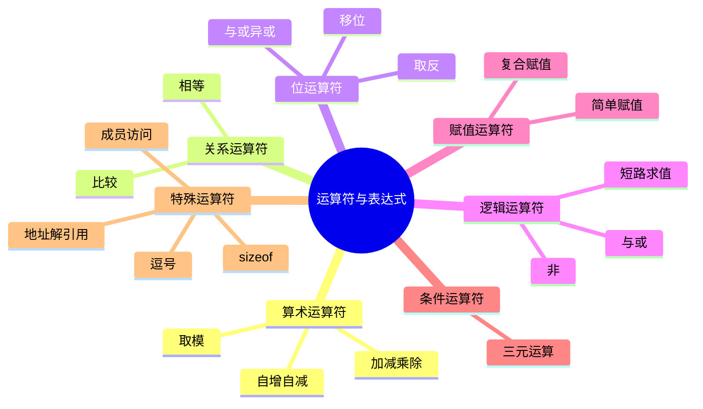

# C语言运算符与表达式深度解析

> **层级定位**: 01 Core Knowledge System / 01 Basic Layer
> **对应标准**: C89/C99/C11/C17/C23
> **难度级别**: L1 了解 → L2 理解
> **预估学习时间**: 3-4 小时

---

## 📋 本节概要

| 属性 | 内容 |
|:-----|:-----|
| **核心概念** | 运算符优先级、求值顺序、整数提升、类型转换 |
| **前置知识** | 语法要素、数据类型 |
| **后续延伸** | 复杂表达式、副作用、优化 |
| **权威来源** | K&R Ch2.11-2.12, C11标准 6.5, CERT EXP系列 |

---

## 🧠 知识结构思维导图



---

## 📖 核心概念详解

### 1. 运算符优先级与结合性

```c
// 优先级表（从高到低）

// 1. 后缀运算符（最高）
arr[i]      // 下标
func()      // 调用
. ->        // 成员访问
++ --       // 后缀自增自减
(type)      // 复合字面量(C99)

// 2. 前缀运算符
++ --       // 前缀自增自减
+ -         // 一元正负
! ~         // 逻辑非、位非
* &         // 解引用、取地址
sizeof      // 大小
_Alignof    // 对齐(C11)

// 3. 乘除模
* / %

// 4. 加减
+ -

// 5. 移位
<< >>

// 6. 关系
< <= > >=

// 7. 相等
== !=

// 8. 位与
&

// 9. 位异或
^

// 10. 位或
|

// 11. 逻辑与
&&

// 12. 逻辑或
||

// 13. 条件
?:

// 14. 赋值
= += -= *= /= %= <<= >>= &= ^= |=

// 15. 逗号（最低）
,
```

### 2. 求值顺序陷阱

```c
// ❌ 未定义行为：同一变量在同一表达式中既读又写，且不是顺序点
int i = 0;
int a = i++ + i++;  // UB!
int b = ++i + ++i;  // UB!
int c = i++ * 2 + i++;  // UB!

// ❌ 函数参数求值顺序未指定
int result = f(i++, i++);  // 哪个先求值？未定义！

// ❌ 数组下标求值顺序未指定
arr[i++] = arr[i++];  // UB!

// ✅ 安全写法：使用顺序点（语句结束是顺序点）
int temp1 = i++;
int temp2 = i++;
int a = temp1 + temp2;
```

### 3. 整数提升与转换

```c
// 整型提升
char c = 'A';
short s = 100;
int result = c + s;  // c和s都提升为int

// 混合类型运算
double d = 3.14;
int i = 42;
double r = d + i;    // i转换为double

// 无符号与有符号
unsigned int u = 10;
int si = -5;
// u + si: si转换为unsigned int，变成很大的数！

// 安全的类型转换
define SAFE_CAST(to_type, value) ((to_type)(value))

// 显式检查
int add_safe(int a, int b) {
    if (b > 0 && a > INT_MAX - b) {
        // 溢出
        return INT_MAX;
    }
    if (b < 0 && a < INT_MIN - b) {
        // 下溢
        return INT_MIN;
    }
    return a + b;
}
```

### 4. 位运算技巧

```c
// 常用位运算模式

// 1. 设置第n位
x |= (1 << n);

// 2. 清除第n位
x &= ~(1 << n);

// 3. 切换第n位
x ^= (1 << n);

// 4. 检查第n位
if (x & (1 << n)) { /* 第n位为1 */ }

// 5. 清除最低位的1
x &= (x - 1);

// 6. 获取最低位的1
lowbit = x & (-x);

// 7. 计算1的个数（popcount）
int popcount(uint32_t x) {
    x = (x & 0x55555555) + ((x >> 1) & 0x55555555);
    x = (x & 0x33333333) + ((x >> 2) & 0x33333333);
    x = (x & 0x0F0F0F0F) + ((x >> 4) & 0x0F0F0F0F);
    x = (x & 0x00FF00FF) + ((x >> 8) & 0x00FF00FF);
    x = (x & 0x0000FFFF) + ((x >> 16) & 0x0000FFFF);
    return x;
}

// 8. 判断2的幂
bool is_power_of_2(uint32_t x) {
    return x && !(x & (x - 1));
}

// 9. 取模优化（除数为2的幂）
// x % 16 == x & 15
// x / 16 == x >> 4
```

### 5. 逻辑短路求值

```c
// && 和 || 短路求值

// 如果ptr为NULL，不会解引用
if (ptr != NULL && ptr->value > 0) {
    // 安全访问
}

// 如果成功，不会调用error_handler
if (do_something() || error_handler()) {
    // do_something返回0才调用error_handler
}

// 利用短路实现条件执行
// 等效于 if (condition) action();
condition && action();

// 等效于 if (!condition) alternative();
condition || alternative();
```

---

## 🔄 多维矩阵对比

### 运算符优先级速查表

| 优先级 | 运算符 | 结合性 | 说明 |
|:------:|:-------|:------:|:-----|
| 1 | `() [] -> . ++(后缀) --(后缀)` | 左到右 | 后缀 |
| 2 | `++(前缀) --(前缀) + - ! ~ * & sizeof _Alignof` | 右到左 | 前缀 |
| 3 | `* / %` | 左到右 | 乘除 |
| 4 | `+ -` | 左到右 | 加减 |
| 5 | `<< >>` | 左到右 | 移位 |
| 6 | `< <= > >=` | 左到右 | 关系 |
| 7 | `== !=` | 左到右 | 相等 |
| 8 | `&` | 左到右 | 位与 |
| 9 | `^` | 左到右 | 位异或 |
| 10 | `\|` | 左到右 | 位或 |
| 11 | `&&` | 左到右 | 逻辑与 |
| 12 | `\|\|` | 左到右 | 逻辑或 |
| 13 | `?:` | 右到左 | 条件 |
| 14 | `= += -= ...` | 右到左 | 赋值 |
| 15 | `,` | 左到右 | 逗号 |

---

## ⚠️ 常见陷阱

### 陷阱 EXP01: 赋值与相等混淆

```c
// ❌ 错误：赋值而非比较
if (x = 5) {  // x被赋值为5，表达式值为5（真）
    // 总是执行
}

// ✅ 正确
if (x == 5) {
    // 相等比较
}

// ✅ 防御性写法（Yoda条件）
if (5 == x) {  // 如果写成 = 会编译错误
    // ...
}
```

### 陷阱 EXP02: 移位溢出

```c
// ❌ 移位数量过大
int x = 1 << 33;  // UB! 超出int宽度

// ❌ 右移负数
int y = -1 >> 1;  // 实现定义行为

// ❌ 左移正数变负
int z = 0x40000000 << 1;  // UB! 符号位改变

// ✅ 安全移位
uint32_t safe = 1U << 31;  // OK
```

### 陷阱 EXP03: 宏参数副作用

```c
// ❌ 危险宏
define SQUARE(x) ((x) * (x))
int a = 5;
int b = SQUARE(a++);  // ((a++) * (a++))  UB!

// ✅ 使用GCC扩展避免多次求值
#if defined(__GNUC__)
    #define SAFE_SQUARE(x) ({ \
        typeof(x) _x = (x); \
        _x * _x; \
    })
#else
    // 调用者注意：不要有副作用
    #define SAFE_SQUARE(x) ((x) * (x))
#endif
```

---

## ✅ 质量验收清单

- [x] 运算符优先级表
- [x] 求值顺序陷阱
- [x] 整数提升规则
- [x] 位运算技巧
- [x] 短路求值

---

> **更新记录**
>
> - 2025-03-09: 初版创建
