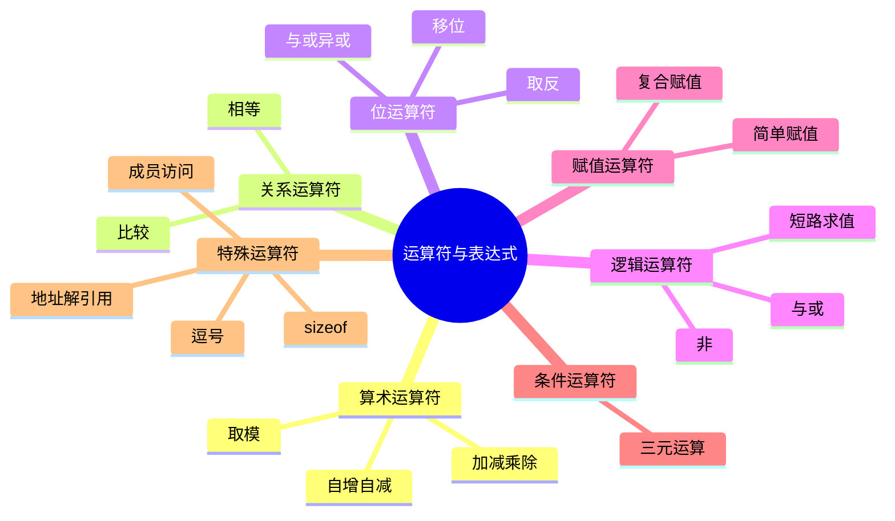

# C语言运算符与表达式深度解析

> **层级定位**: 01 Core Knowledge System / 01 Basic Layer
> **对应标准**: C89/C99/C11/C17/C23
> **难度级别**: L1 了解 → L2 理解
> **预估学习时间**: 3-4 小时

---

## 📋 本节概要

| 属性 | 内容 |
|:-----|:-----|
| **核心概念** | 运算符优先级、求值顺序、整数提升、类型转换 |
| **前置知识** | [语法要素](./01_Syntax_Elements.md)、[数据类型系统](./02_Data_Type_System.md) |
| **后续延伸** | [控制流与函数](./04_Control_Flow.md)、[指针算术](../../02_Core_Layer/01_Pointer_Depth.md#指针运算)、[位运算](./06_Bit_Operations.md) |
| **横向关联** | [整数溢出案例](../../09_Safety_Standards/Vulnerability_Cases/03_Integer_Overflow_Cases.md)、[未定义行为](../../02_Formal_Semantics/00_Core_Semantics_Foundations/05_Undefined_Behavior_Semantics.md) |
| **深层理论** | [表达式求值语义](../../02_Formal_Semantics/00_Core_Semantics_Foundations/01_Operational_Semantics.md) |
| **权威来源** | K&R Ch2.11-2.12, C11标准 6.5, CERT EXP系列 |

---


---

## 📑 目录

- [C语言运算符与表达式深度解析](#c语言运算符与表达式深度解析)
  - [📋 本节概要](#-本节概要)
  - [📑 目录](#-目录)
  - [🎯 概念定义](#-概念定义)
    - [1.1 运算符（Operator）](#11-运算符operator)
    - [1.2 表达式（Expression）](#12-表达式expression)
    - [1.3 求值顺序（Order of Evaluation）](#13-求值顺序order-of-evaluation)
  - [🧠 知识结构思维导图](#-知识结构思维导图)
  - [📖 核心概念详解](#-核心概念详解)
    - [1. 运算符优先级与结合性](#1-运算符优先级与结合性)
    - [2. 求值顺序陷阱](#2-求值顺序陷阱)
    - [3. 整数提升与转换](#3-整数提升与转换)
    - [4. 位运算技巧](#4-位运算技巧)
    - [5. 逻辑短路求值](#5-逻辑短路求值)
  - [🔬 属性表：运算符详细规格](#-属性表运算符详细规格)
    - [运算符完整属性矩阵](#运算符完整属性矩阵)
    - [副作用分析表](#副作用分析表)
  - [🔬 形式化描述：表达式求值语义](#-形式化描述表达式求值语义)
    - [表达式求值规则](#表达式求值规则)
    - [顺序点（Sequence Point）规则](#顺序点sequence-point规则)
  - [🔄 多维矩阵对比](#-多维矩阵对比)
    - [运算符优先级速查表](#运算符优先级速查表)
  - [🌳 决策树：运算符选择指南](#-决策树运算符选择指南)
  - [⚠️ 常见陷阱与反例（UB示例）](#️-常见陷阱与反例ub示例)
    - [陷阱 EXP01: 赋值与相等混淆](#陷阱-exp01-赋值与相等混淆)
    - [陷阱 EXP02: 移位溢出](#陷阱-exp02-移位溢出)
    - [陷阱 EXP03: 宏参数副作用](#陷阱-exp03-宏参数副作用)
    - [陷阱 EXP04: 未定义行为（UB）完整列表](#陷阱-exp04-未定义行为ub完整列表)
    - [陷阱 EXP05: 复杂的优先级错误](#陷阱-exp05-复杂的优先级错误)
    - [陷阱 EXP06: 求值顺序依赖](#陷阱-exp06-求值顺序依赖)
  - [✅ 质量验收清单](#-质量验收清单)
  - [深入理解](#深入理解)
    - [技术原理](#技术原理)
    - [实践指南](#实践指南)
    - [相关资源](#相关资源)


---

## 🎯 概念定义

### 1.1 运算符（Operator）

**严格定义**：运算符是编程语言中用于表示对操作数执行特定计算的符号或关键字。在C语言中，运算符具有以下形式化特征：

```
运算符 ::= 一元运算符 | 二元运算符 | 三元运算符

一元运算符 ::= 前缀运算符 | 后缀运算符
二元运算符 ::= 算术运算符 | 关系运算符 | 位运算符 | 逻辑运算符 | 赋值运算符
```

**语义特征**：

- **操作数个数**：一元（1个）、二元（2个）、三元（`?:`，3个）
- **结合性**：左结合（从左到右求值）或右结合（从右到左求值）
- **优先级**：决定表达式中运算的先后顺序
- **副作用**：是否修改程序状态

### 1.2 表达式（Expression）

**严格定义**（C11 6.5）：表达式是由运算符和操作数组成的序列，它指定了一项计算，产生一个值，并可能产生副作用。

**分类体系**：

```
表达式 ::= 主表达式 | 后缀表达式 | 一元表达式 | 转型表达式
         | 乘性表达式 | 加性表达式 | 移位表达式 | 关系表达式
         | 相等表达式 | 位与表达式 | 位异或表达式 | 位或表达式
         | 逻辑与表达式 | 逻辑或表达式 | 条件表达式 | 赋值表达式
```

**表达式属性**：

- **类型**：表达式结果的类型
- **值类别**：左值（lvalue）、右值（rvalue）、函数指示符
- **是否为常量表达式**：可在编译期求值

### 1.3 求值顺序（Order of Evaluation）

**严格定义**：表达式中子表达式的求值时机和顺序规则。

**C语言求值顺序规则**：

1. **优先级**：决定运算符的分组方式，**不决定求值顺序**
2. **结合性**：决定同优先级运算符的分组方向
3. **顺序点（Sequence Point）**：程序执行中的特定点，确保之前的所有副作用已完成
4. **未指定行为（Unspecified Behavior）**：编译器可自由选择求值顺序
5. **未定义行为（Undefined Behavior）**：同一对象被修改和访问且修改不是顺序点之前的最后一个操作

**C11后术语变化**：顺序点被"sequenced before"关系取代

---

## 🧠 知识结构思维导图



---

## 📖 核心概念详解

### 1. 运算符优先级与结合性

```c
// 优先级表（从高到低）

// 1. 后缀运算符（最高）
arr[i]      // 下标
func()      // 调用
. ->        // 成员访问
++ --       // 后缀自增自减
(type)      // 复合字面量(C99)

// 2. 前缀运算符
++ --       // 前缀自增自减
+ -         // 一元正负
! ~         // 逻辑非、位非
* &         // 解引用、取地址
sizeof      // 大小
_Alignof    // 对齐(C11)

// 3. 乘除模
* / %

// 4. 加减
+ -

// 5. 移位
<< >>

// 6. 关系
< <= > >=

// 7. 相等
== !=

// 8. 位与
&

// 9. 位异或
^

// 10. 位或
|

// 11. 逻辑与
&&

// 12. 逻辑或
||

// 13. 条件
?:

// 14. 赋值
= += -= *= /= %= <<= >>= &= ^=

// 15. 逗号（最低）
,
```

### 2. 求值顺序陷阱

```c
// ❌ 未定义行为：同一变量在同一表达式中既读又写，且不是顺序点
int i = 0;
int a = i++ + i++;  // UB!
int b = ++i + ++i;  // UB!
int c = i++ * 2 + i++;  // UB!

// ❌ 函数参数求值顺序未指定
int result = f(i++, i++);  // 哪个先求值？未定义！

// ❌ 数组下标求值顺序未指定
arr[i++] = arr[i++];  // UB!

// ✅ 安全写法：使用顺序点（语句结束是顺序点）
int temp1 = i++;
int temp2 = i++;
int a = temp1 + temp2;
```

### 3. 整数提升与转换

```c
// 整型提升
char c = 'A';
short s = 100;
int result = c + s;  // c和s都提升为int

// 混合类型运算
double d = 3.14;
int i = 42;
double r = d + i;    // i转换为double

// 无符号与有符号
unsigned int u = 10;
int si = -5;
// u + si: si转换为unsigned int，变成很大的数！

// 安全的类型转换
define SAFE_CAST(to_type, value) ((to_type)(value))

// 显式检查
int add_safe(int a, int b) {
    if (b > 0 && a > INT_MAX - b) {
        // 溢出
        return INT_MAX;
    }
    if (b < 0 && a < INT_MIN - b) {
        // 下溢
        return INT_MIN;
    }
    return a + b;
}
```

### 4. 位运算技巧

```c
// 常用位运算模式

// 1. 设置第n位
x |= (1 << n);

// 2. 清除第n位
x &= ~(1 << n);

// 3. 切换第n位
x ^= (1 << n);

// 4. 检查第n位
if (x & (1 << n)) { /* 第n位为1 */ }

// 5. 清除最低位的1
x &= (x - 1);

// 6. 获取最低位的1
lowbit = x & (-x);

// 7. 计算1的个数（popcount）
int popcount(uint32_t x) {
    x = (x & 0x55555555) + ((x >> 1) & 0x55555555);
    x = (x & 0x33333333) + ((x >> 2) & 0x33333333);
    x = (x & 0x0F0F0F0F) + ((x >> 4) & 0x0F0F0F0F);
    x = (x & 0x00FF00FF) + ((x >> 8) & 0x00FF00FF);
    x = (x & 0x0000FFFF) + ((x >> 16) & 0x0000FFFF);
    return x;
}

// 8. 判断2的幂
bool is_power_of_2(uint32_t x) {
    return x && !(x & (x - 1));
}

// 9. 取模优化（除数为2的幂）
// x % 16 == x & 15
// x / 16 == x >> 4
```

### 5. 逻辑短路求值

```c
// && 和 || 短路求值

// 如果ptr为NULL，不会解引用
if (ptr != NULL && ptr->value > 0) {
    // 安全访问
}

// 如果成功，不会调用error_handler
if (do_something() || error_handler()) {
    // do_something返回0才调用error_handler
}

// 利用短路实现条件执行
// 等效于 if (condition) action();
condition && action();

// 等效于 if (!condition) alternative();
condition || alternative();
```

---

## 🔬 属性表：运算符详细规格

### 运算符完整属性矩阵

| 优先级 | 运算符 | 结合性 | 操作数 | 副作用 | 结果类型 | 说明 |
|:------:|:-------|:------:|:------:|:------:|:---------|:-----|
| 1 | `()` `[]` `->` `.` | 左→右 | 2 | 否 | 视上下文 | 函数调用、下标、成员访问 |
| 1 | `++` `--` (后缀) | 左→右 | 1 | **是** | 原类型 | 自增自减 |
| 2 | `++` `--` (前缀) | 右→左 | 1 | **是** | 原类型 | 自增自减 |
| 2 | `+` `-` (一元) | 右→左 | 1 | 否 | 提升后类型 | 正负号 |
| 2 | `!` `~` | 右→左 | 1 | 否 | int | 逻辑非、位非 |
| 2 | `*` `&` (一元) | 右→左 | 1 | 否 | 指针/解引用 | 解引用、取地址 |
| 2 | `sizeof` `_Alignof` | 右→左 | 1 | 否 | size_t | 大小/对齐查询 |
| 3 | `*` `/` `%` | 左→右 | 2 | 否 | 提升后类型 | 乘除模 |
| 4 | `+` `-` | 左→右 | 2 | 否 | 提升后类型 | 加减 |
| 5 | `<<` `>>` | 左→右 | 2 | 否 | 提升后类型 | 移位 |
| 6 | `<` `<=` `>` `>=` | 左→右 | 2 | 否 | int(0/1) | 关系比较 |
| 7 | `==` `!=` | 左→右 | 2 | 否 | int(0/1) | 相等比较 |
| 8 | `&` | 左→右 | 2 | 否 | 提升后类型 | 位与 |
| 9 | `^` | 左→右 | 2 | 否 | 提升后类型 | 位异或 |
| 10 | `\|` | 左→右 | 2 | 否 | 提升后类型 | 位或 |
| 11 | `&&` | 左→右 | 2 | 否 | int(0/1) | 逻辑与（短路） |
| 12 | `\|\|` | 左→右 | 2 | 否 | int(0/1) | 逻辑或（短路） |
| 13 | `?:` | 右→左 | 3 | 否 | 提升后类型 | 条件运算符 |
| 14 | `=` `+=` `-=` ... | 右→左 | 2 | **是** | 左操作数类型 | 赋值 |
| 15 | `,` | 左→右 | 2 | 否 | 右操作数类型 | 逗号运算符 |

### 副作用分析表

| 运算符 | 副作用类型 | 影响对象 | 使用风险 |
|:-------|:-----------|:---------|:---------|
| `++` `--` | 修改变量值 | 操作数本身 | 求值顺序UB |
| `=` `+=`等 | 修改左操作数 | 左操作数 | 丢失数据、类型截断 |
| `*` (解引用赋值) | 修改内存 | 指向的对象 | 空指针、越界访问 |
| 函数调用 | 可能任意副作用 | 全局状态、参数 | 依赖求值顺序 |

---

## 🔬 形式化描述：表达式求值语义

### 表达式求值规则

**形式化语义**（基于操作语义）：

```
求值规则（E表示求值，σ表示状态）：

常量求值：
  ───────────── (E-Const)
  E(n, σ) = (n, σ)

变量求值：
  x ↦ v ∈ σ
  ───────────── (E-Var)
  E(x, σ) = (v, σ)

加法求值：
  E(e₁, σ) = (v₁, σ₁)    E(e₂, σ₁) = (v₂, σ₂)
  ───────────────────────────────────────── (E-Add)
  E(e₁ + e₂, σ) = (v₁ + v₂, σ₂)

赋值求值：
  E(e, σ) = (v, σ')    σ'' = σ'[x ↦ v]
  ───────────────────────────────── (E-Assign)
  E(x = e, σ) = (v, σ'')

自增求值（前缀）：
  σ(x) = v    v' = v + 1    σ' = σ[x ↦ v']
  ──────────────────────────────────── (E-PreInc)
  E(++x, σ) = (v', σ')

自增求值（后缀）：
  σ(x) = v    v' = v + 1    σ' = σ[x ↦ v']
  ──────────────────────────────────── (E-PostInc)
  E(x++, σ) = (v, σ')
```

### 顺序点（Sequence Point）规则

**C11标准顺序点位置**：

1. 逻辑与 `&&` 的左操作数求值后
2. 逻辑或 `||` 的左操作数求值后
3. 条件运算符 `?:` 的第一个操作数求值后
4. 完整表达式结束时（表达式语句、return、控制条件等）
5. 函数调用前（所有参数求值后，函数执行前）
6. 逗号运算符 `,` 的左操作数求值后
7. 赋值运算符（包括复合赋值）的左操作数求值后

**C11 sequenced before关系**：

- 如果A sequenced before B，则A的副作用在B开始前完成
- 如果A和B unsequenced，则它们可以按任意顺序执行
- 如果A和B indeterminately sequenced，则其中一个sequenced before另一个，但不确定是哪一个

---

## 🔄 多维矩阵对比

### 运算符优先级速查表

| 优先级 | 运算符 | 结合性 | 说明 |
|:------:|:-------|:------:|:-----|
| 1 | `() [] -> . ++(后缀) --(后缀)` | 左到右 | 后缀 |
| 2 | `++(前缀) --(前缀) + - ! ~ * & sizeof _Alignof` | 右到左 | 前缀 |
| 3 | `* / %` | 左到右 | 乘除 |
| 4 | `+ -` | 左到右 | 加减 |
| 5 | `<< >>` | 左到右 | 移位 |
| 6 | `< <= > >=` | 左到右 | 关系 |
| 7 | `== !=` | 左到右 | 相等 |
| 8 | `&` | 左到右 | 位与 |
| 9 | `^` | 左到右 | 位异或 |
| 10 | `\|` | 左到右 | 位或 |
| 11 | `&&` | 左到右 | 逻辑与 |
| 12 | `\|\|` | 左到右 | 逻辑或 |
| 13 | `?:` | 右到左 | 条件 |
| 14 | `= += -= ...` | 右到左 | 赋值 |
| 15 | `,` | 左到右 | 逗号 |

---

## 🌳 决策树：运算符选择指南

```text
需要进行什么操作？
├── 算术运算
│   ├── 整数运算
│   │   ├── 加减乘除 → + - * /
│   │   ├── 取模 → % (仅整数)
│   │   └── 溢出检查 → 手动检查或使用内置函数
│   └── 浮点运算
│       ├── 基本运算 → + - * /
│       ├── 数学函数 → <math.h>
│       └── 比较 → 使用epsilon，禁止==
│
├── 位操作
│   ├── 设置位 → |= (1 << n)
│   ├── 清除位 → &= ~(1 << n)
│   ├── 切换位 → ^= (1 << n)
│   ├── 检查位 → & (1 << n)
│   ├── 移位 → << >> (注意UB: 移位过大、负数移位)
│   └── 特殊操作
│       ├── 最低位1 → x & -x
│       ├── 清除最低位1 → x & (x - 1)
│       └── 判断2的幂 → x && !(x & (x - 1))
│
├── 逻辑判断
│   ├── 与 → && (短路)
│   ├── 或 → || (短路)
│   ├── 非 → !
│   └── 条件选择 → ?:
│
├── 赋值
│   ├── 简单赋值 → =
│   ├── 复合赋值 → += -= *= /= %= &= |= ^= <<= >>=
│   └── 多变量赋值 → a = b = c = 0 (右结合)
│
└── 特殊用途
    ├── 取大小 → sizeof
    ├── 取对齐 → _Alignof (C11)
    ├── 类型转换 → (type)expr
    └── 顺序执行 → , (逗号运算符)
```

---

## ⚠️ 常见陷阱与反例（UB示例）

### 陷阱 EXP01: 赋值与相等混淆

```c
// ❌ 错误：赋值而非比较
if (x = 5) {  // x被赋值为5，表达式值为5（真）
    // 总是执行
}

// ✅ 正确
if (x == 5) {
    // 相等比较
}

// ✅ 防御性写法（Yoda条件）
if (5 == x) {  // 如果写成 = 会编译错误
    // ...
}
```

### 陷阱 EXP02: 移位溢出

```c
// ❌ 移位数量过大（UB）
int x = 1 << 33;  // UB! 超出int宽度

// ❌ 右移负数（实现定义行为）
int y = -1 >> 1;  // 实现定义行为

// ❌ 左移正数变负（UB）
int z = 0x40000000 << 1;  // UB! 符号位改变

// ✅ 安全移位
uint32_t safe = 1U << 31;  // OK

// ✅ 确保移位量在有效范围
#define SHIFT_SAFE(val, shift) \
    ((shift) >= 0 && (shift) < sizeof(val) * CHAR_BIT ? (val) << (shift) : 0)
```

### 陷阱 EXP03: 宏参数副作用

```c
// ❌ 危险宏
define SQUARE(x) ((x) * (x))
int a = 5;
int b = SQUARE(a++);  // ((a++) * (a++))  UB!

// ✅ 使用GCC扩展避免多次求值
#if defined(__GNUC__)
    #define SAFE_SQUARE(x) ({ \
        typeof(x) _x = (x); \
        _x * _x; \
    })
#else
    // 调用者注意：不要有副作用
    #define SAFE_SQUARE(x) ((x) * (x))
#endif
```

### 陷阱 EXP04: 未定义行为（UB）完整列表

| UB类型 | 示例 | 后果 |
|:-------|:-----|:-----|
| **序列点违规** | `i++ + i++` | 任意结果、崩溃 |
| **整数溢出** | `INT_MAX + 1` | 任意结果、崩溃 |
| **除以零** | `1 / 0` | 崩溃、异常 |
| **空指针解引用** | `*NULL` | 崩溃、任意行为 |
| **越界访问** | `arr[-1]` 或 `arr[10]`(大小为10) | 数据损坏、崩溃 |
| **移位溢出** | `1 << 32` | 任意结果 |
| **有符号溢出** | `0x40000000 << 1` | 任意结果 |
| **无效类型转换** | `(int*)0x1234` | 崩溃、数据损坏 |
| **悬空指针** | 使用free后的指针 | 数据损坏、崩溃 |
| **严格别名违规** | `*(int*)&float_val` | 任意结果 |

### 陷阱 EXP05: 复杂的优先级错误

```c
// ❌ 错误：位运算优先级低于关系运算
if (flags & MASK == VALUE)  // 实际解析为：flags & (MASK == VALUE)

// ✅ 正确
if ((flags & MASK) == VALUE)

// ❌ 错误：移位优先级低于加减
int x = value << 2 + 1;  // 实际解析为：value << (2 + 1)

// ✅ 正确
int x = (value << 2) + 1;

// ❌ 错误：条件运算符优先级问题
int a = condition ? x : y + 1;  // 解析为：condition ? x : (y + 1)

// ✅ 如果意图是 (condition ? x : y) + 1
int a = (condition ? x : y) + 1;
```

### 陷阱 EXP06: 求值顺序依赖

```c
// ❌ 未指定行为：函数参数求值顺序
int result = f(i++, i++);  // 不确定哪个i++先执行

// ❌ 未指定行为：操作数求值顺序
int x = expr1() + expr2();  // 不确定哪个函数先调用

// ❌ 未定义行为：修改+访问无序列点
int a = i++ + ++i;

// ✅ 安全写法：明确顺序
int temp1 = i++;
int temp2 = i++;
int result = f(temp1, temp2);

// ✅ 安全写法：使用独立语句
int val1 = expr1();
int val2 = expr2();
int x = val1 + val2;
```

---

## ✅ 质量验收清单

- [x] 运算符优先级表
- [x] 求值顺序陷阱
- [x] 整数提升规则
- [x] 位运算技巧
- [x] 短路求值
- [x] 概念定义（运算符、表达式、求值顺序）
- [x] 属性表（优先级、结合性、副作用）
- [x] 形式化描述（求值语义）
- [x] 未定义行为（UB）反例
- [x] 运算符选择决策树

---

> **更新记录**
>
> - 2025-03-09: 初版创建
> - 2026-03-16: 深化内容，添加概念定义、运算符属性表、形式化描述、UB反例和决策树


---

## 深入理解

### 技术原理

深入探讨相关技术原理和实现细节。

### 实践指南

- 步骤1：理解基础概念
- 步骤2：掌握核心原理
- 步骤3：应用实践

### 相关资源

- 文档链接
- 代码示例
- 参考文章

---

> **最后更新**: 2026-03-21
> **维护者**: AI Code Review
