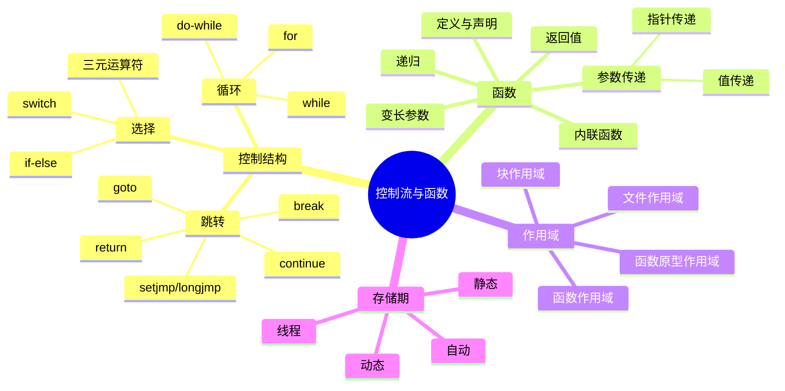
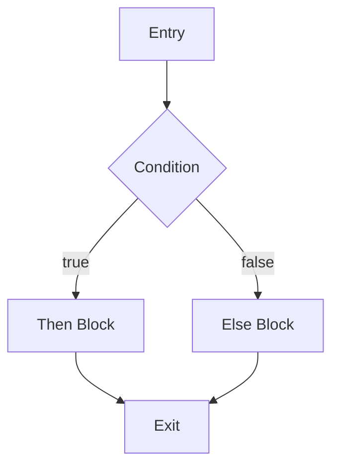
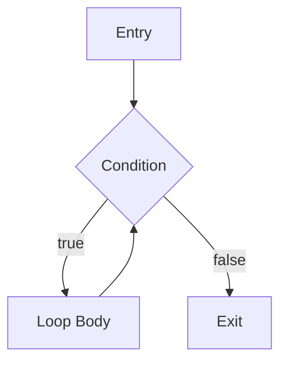
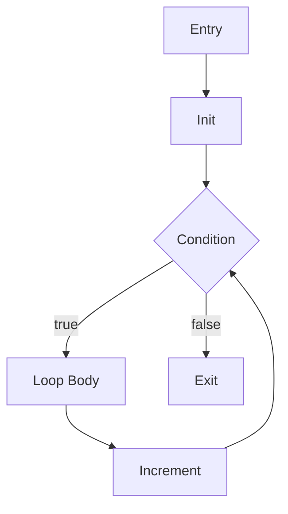
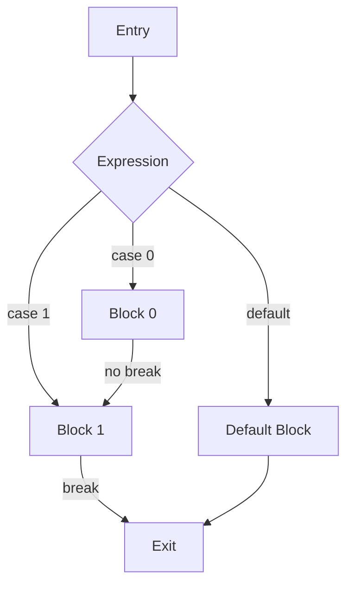
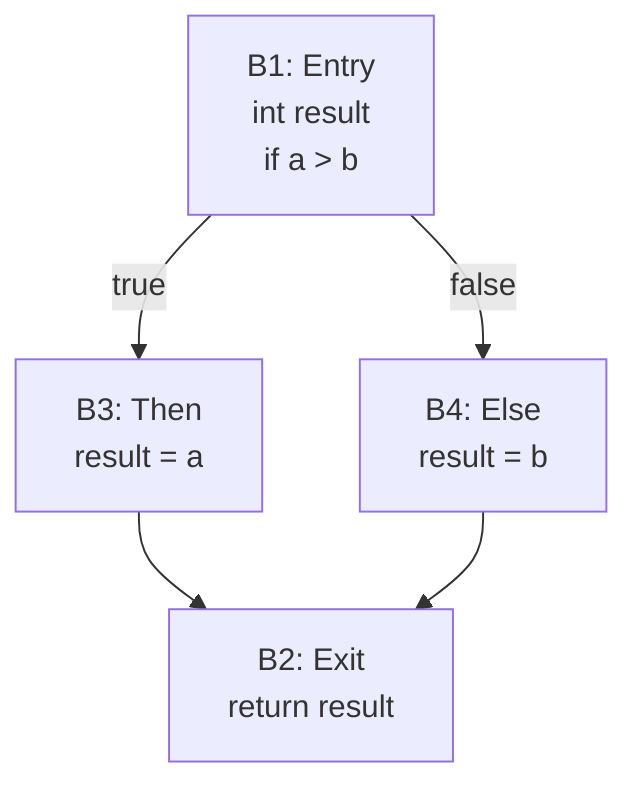

# C语言控制流与函数深度解析

> **层级定位**: 01 Core Knowledge System / 01 Basic Layer
> **对应标准**: C89/C99/C11/C17/C23
> **难度级别**: L1 了解 → L3 应用
> **预估学习时间**: 3-5 小时

---

## 📋 本节概要

| 属性 | 内容 |
|:-----|:-----|
| **核心概念** | 控制结构、函数调用约定、递归、作用域、存储期 |
| **前置知识** | [语法要素](./01_Syntax_Elements.md)、[数据类型系统](./02_Data_Type_System.md)、[运算符与表达式](./03_Operators_Expressions.md) |
| **后续延伸** | [函数指针](../../02_Core_Layer/01_Pointer_Depth.md)、[状态机](../../../06_Thinking_Representation/09_State_Machines/README.md)、[并发编程](../../../03_System_Technology_Domains/14_Concurrency_Parallelism/README.md) |
| **横向关联** | [层次桥接链](../../../06_Thinking_Representation/05_Concept_Mappings/09_Level_Bridging_Chains.md#控制流→状态机→并发模型链)、[控制流等价变换](../../../06_Thinking_Representation/05_Concept_Mappings/08_Concept_Equivalence_Graph.md#控制流等价变换) |
| **权威来源** | K&R Ch1,3,4, CSAPP Ch3.7, Modern C Level 1 |

---


---

## 📑 目录

- [C语言控制流与函数深度解析](#c语言控制流与函数深度解析)
  - [📋 本节概要](#-本节概要)
  - [📑 目录](#-目录)
  - [🎯 概念定义](#-概念定义)
    - [1.1 控制流（Control Flow）](#11-控制流control-flow)
    - [1.2 结构化编程（Structured Programming）](#12-结构化编程structured-programming)
    - [1.3 控制流图（Control Flow Graph, CFG）](#13-控制流图control-flow-graph-cfg)
  - [🧠 知识结构思维导图](#-知识结构思维导图)
  - [📖 核心概念详解](#-核心概念详解)
    - [1. 控制流结构](#1-控制流结构)
      - [1.1 选择语句](#11-选择语句)
      - [1.2 循环优化](#12-循环优化)
    - [2. 控制结构属性表](#2-控制结构属性表)
    - [3. 函数深度](#3-函数深度)
      - [3.1 参数传递机制](#31-参数传递机制)
      - [3.2 函数指针应用](#32-函数指针应用)
      - [3.3 变长参数](#33-变长参数)
      - [3.4 递归与尾递归](#34-递归与尾递归)
    - [4. 存储期与作用域](#4-存储期与作用域)
  - [🔬 形式化描述：控制流图（CFG）](#-形式化描述控制流图cfg)
    - [4.1 CFG形式化定义](#41-cfg形式化定义)
    - [4.2 控制结构CFG表示](#42-控制结构cfg表示)
    - [4.3 代码到CFG转换示例](#43-代码到cfg转换示例)
  - [🔄 多维矩阵对比](#-多维矩阵对比)
    - [控制结构选择矩阵](#控制结构选择矩阵)
    - [存储期与作用域矩阵](#存储期与作用域矩阵)
  - [🌳 控制流决策树](#-控制流决策树)
  - [⚠️ 常见陷阱与反例](#️-常见陷阱与反例)
    - [陷阱 CTRL01: 死代码（Dead Code）](#陷阱-ctrl01-死代码dead-code)
    - [陷阱 CTRL02: 不可达代码（Unreachable Code）](#陷阱-ctrl02-不可达代码unreachable-code)
    - [陷阱 CTRL03: 错误使用goto](#陷阱-ctrl03-错误使用goto)
    - [陷阱 CTRL04: 宏副作用](#陷阱-ctrl04-宏副作用)
    - [陷阱 CTRL05: switch中变量声明](#陷阱-ctrl05-switch中变量声明)
    - [陷阱 CTRL06: 悬空else](#陷阱-ctrl06-悬空else)
  - [✅ 质量验收清单](#-质量验收清单)
  - [深入理解](#深入理解)
    - [技术原理](#技术原理)
    - [实践指南](#实践指南)
    - [相关资源](#相关资源)


---

## 🎯 概念定义

### 1.1 控制流（Control Flow）

**严格定义**：控制流是程序执行过程中指令执行的顺序。在结构化编程中，控制流通过特定的控制结构来组织，决定了程序语句的执行路径。

**形式化定义**：

```
控制流 ::= 顺序执行 | 选择执行 | 循环执行 | 跳转执行

顺序执行：语句按源代码顺序依次执行
选择执行：根据条件选择不同的执行路径（if、switch）
循环执行：重复执行语句块直到满足退出条件（for、while、do-while）
跳转执行：无条件改变执行位置（break、continue、return、goto）
```

### 1.2 结构化编程（Structured Programming）

**严格定义**：结构化编程是一种编程范式，主张使用顺序、选择、循环三种基本控制结构来构建程序，避免使用无条件跳转（goto）。

**结构化定理**（Böhm和Jacopini, 1966）：
> 任何可计算函数都可以通过顺序、选择和循环三种控制结构实现，无需使用goto。

**C语言中的结构化控制结构**：

| 结构类型 | C语言语法 | 结构化？ |
|:---------|:----------|:--------:|
| 顺序 | 语句序列 | ✅ |
| 选择 | if-else、switch | ✅ |
| 循环 | for、while、do-while | ✅ |
| 跳转 | break、continue、return | ✅（受限跳转） |
| 无条件跳转 | goto | ❌（非结构化） |

### 1.3 控制流图（Control Flow Graph, CFG）

**严格定义**：控制流图是表示程序中所有可能执行路径的有向图，其中：

- **节点（Node）**：基本块（Basic Block），即顺序执行的语句序列
- **边（Edge）**：控制转移，表示从一个基本块到另一个基本块的可能执行路径
- **入口（Entry）**：程序的起始节点
- **出口（Exit）**：程序的终止节点

**基本块定义**：
> 基本块是满足以下性质的连续语句序列：
>
> 1. 只能从第一个语句（入口）进入
> 2. 只能在最后一个语句（出口）退出
> 3. 内部没有分支或跳转目标

---

## 🧠 知识结构思维导图



---

## 📖 核心概念详解

### 1. 控制流结构

#### 1.1 选择语句

**if-else 链优化**：

```c
// 将最可能的情况放在前面（分支预测优化）
if (likely_condition) {      // 90%概率
    // 快速路径
} else if (other_condition) { // 9%概率
    // 次快速路径
} else {
    // 慢速路径（1%）
}

// C23 likely/unlikely 属性（如果可用）
#if __STDC_VERSION__ >= 202311L
    if (condition [[likely]]) { }
#endif
```

**switch 语句优化**：

```c
// 编译器通常优化switch为跳转表或二叉搜索
// 密集case值：跳转表 O(1)
switch (opcode) {
    case 0: add(); break;
    case 1: sub(); break;
    case 2: mul(); break;
    // ... 连续值
}

// 稀疏case值：二叉搜索 O(log n)
switch (error_code) {
    case 0x1000: ...
    case 0x8000: ...
    case 0xF000: ...
}
```

**fall-through 安全**：

```c
// C17 属性标记有意fall-through
switch (state) {
    case START:
        init();
        [[fallthrough]];  // C17/C23
    case RUNNING:
        process();
        break;
}

// C11/C17 宏方案
#ifndef __has_c_attribute
    #define __has_c_attribute(x) 0
#endif
#if __has_c_attribute(fallthrough)
    #define FALLTHROUGH [[fallthrough]]
#else
    #define FALLTHROUGH /* fall through */
#endif
```

#### 1.2 循环优化

```c
// 循环不变量外提
// ❌ 低效
for (int i = 0; i < n; i++) {
    int len = strlen(s);  // 每次循环都计算
    use(i, len);
}

// ✅ 高效
int len = strlen(s);  // 只计算一次
for (int i = 0; i < n; i++) {
    use(i, len);
}

// 递减循环（某些架构更快，避免与0比较）
// ✅ 递减（可能更快）
for (size_t i = n; i-- > 0; ) {
    process(array[i]);
}

// 循环展开（手动或-O3自动）
// ✅ 手动展开（大数据集）
for (size_t i = 0; i < n; i += 4) {
    process(i);
    if (i+1 < n) process(i+1);
    if (i+2 < n) process(i+2);
    if (i+3 < n) process(i+3);
}
```

---

### 2. 控制结构属性表

| 控制结构 | 条件检查时机 | 执行次数 | 适用场景 | 潜在问题 |
|:---------|:-------------|:--------:|:---------|:---------|
| `if` | 进入时 | 0或1次 | 单一条件判断 | 悬空else |
| `if-else` | 进入时 | 0或1次 | 二选一 | else分支遗漏 |
| `switch` | 进入时 | 0或1次 | 多分支等值 | fall-through错误 |
| `for` | 每次迭代前 | 0~N次 | 已知迭代次数 | 循环变量泄漏(C89) |
| `while` | 每次迭代前 | 0~N次 | 条件不定循环 | 无限循环风险 |
| `do-while` | 每次迭代后 | 1~N次 | 至少执行一次 | 条件判断在末尾 |
| `break` | - | - | 退出循环/switch | 只能跳出最内层 |
| `continue` | - | - | 跳过本次迭代 | 逻辑混乱风险 |
| `return` | - | - | 函数返回 | 资源清理 |
| `goto` | - | - | 错误处理/跳出深层 | 破坏结构化 |

---

### 3. 函数深度

#### 3.1 参数传递机制

**C只有值传递**：

```c
// ❌ 错误期望
void swap_wrong(int a, int b) {
    int temp = a;
    a = b;      // 只修改局部副本
    b = temp;
}

// ✅ 使用指针实现引用语义
void swap_correct(int *a, int *b) {
    int temp = *a;
    *a = *b;
    *b = temp;
}

// 使用
int x = 1, y = 2;
swap_correct(&x, &y);
```

**数组参数退化**：

```c
// 以下三种声明等价
void f(int a[10]);      // 10被忽略！
void f(int a[]);        // 等价
void f(int *a);         // 实际类型

// ✅ 安全做法：传递大小
void process_array(int *arr, size_t n);
void process_array2(int arr[], size_t n);  // 语义相同

// C99 VLA（可变长度数组）
void process_matrix(int rows, int cols, int mat[rows][cols]);
```

#### 3.2 函数指针应用

**状态机实现**：

```c
typedef struct State State;
struct State {
    const char *name;
    State *(*handle)(Context *ctx, Event evt);
};

State *state_idle(Context *ctx, Event evt) {
    switch (evt) {
        case EVT_START: return &state_running;
        default: return NULL;  // 保持当前状态
    }
}

State *state_running(Context *ctx, Event evt) {
    switch (evt) {
        case EVT_STOP: return &state_idle;
        case EVT_PAUSE: return &state_paused;
        default: return NULL;
    }
}

// 运行状态机
void run_fsm(Context *ctx, State *initial) {
    State *current = initial;
    while (current) {
        Event evt = get_event(ctx);
        State *next = current->handle(ctx, evt);
        if (next) {
            printf("Transition: %s -> %s\n", current->name, next->name);
            current = next;
        }
    }
}
```

#### 3.3 变长参数

```c
#include <stdarg.h>
#include <stdio.h>

// 安全变长参数函数：必须提供计数或终止符
int sum_ints(int count, ...) {
    va_list args;
    va_start(args, count);

    int sum = 0;
    for (int i = 0; i < count; i++) {
        sum += va_arg(args, int);
    }

    va_end(args);
    return sum;
}

// 类型安全宏包装
#define SUM(...) sum_ints(sizeof((int[]){__VA_ARGS__})/sizeof(int), __VA_ARGS__)

int main(void) {
    printf("Sum: %d\n", SUM(1, 2, 3, 4, 5));  // 自动计算个数
    return 0;
}
```

#### 3.4 递归与尾递归

```c
// ❌ 非尾递归（需要保存栈帧）
int factorial(int n) {
    if (n <= 1) return 1;
    return n * factorial(n - 1);  // 乘法在递归调用后
}

// ✅ 尾递归形式（编译器可优化为循环）
int factorial_tail(int n, int acc) {
    if (n <= 1) return acc;
    return factorial_tail(n - 1, n * acc);  // 最后操作是递归调用
}

// 尾递归优化依赖编译器（gcc -O2）
// 手动循环版本最可靠
int factorial_iter(int n) {
    int result = 1;
    for (int i = 2; i <= n; i++) {
        result *= i;
    }
    return result;
}
```

---

### 4. 存储期与作用域

```c
// 存储期类别
void example(void) {
    auto int a = 1;        // 自动存储期（默认，可省略）
    static int b = 2;      // 静态存储期，持久存在
    extern int c;          // 外部链接
    register int d = 4;    // 建议存储在寄存器（C11废弃）
}

// 线程存储期（C11）
_Thread_local int thread_local_var;  // 每个线程独立

// 作用域示例
static int file_scope;     // 文件作用域，内部链接

void func(void) {
    int block_scope;       // 块作用域

    {
        int inner_scope;   // 嵌套块作用域，隐藏外部同名变量
    }
}
```

---

## 🔬 形式化描述：控制流图（CFG）

### 4.1 CFG形式化定义

**定义**：控制流图G = (N, E, entry, exit)，其中：

- N：基本块集合
- E ⊆ N × N：控制流边集合
- entry ∈ N：入口节点
- exit ∈ N：出口节点

### 4.2 控制结构CFG表示

**if-else 的CFG**：



**while 循环的CFG**：



**for 循环的CFG**：



**switch 的CFG**：



### 4.3 代码到CFG转换示例

**源代码**：

```c
int max(int a, int b) {
    int result;
    if (a > b) {
        result = a;
    } else {
        result = b;
    }
    return result;
}
```

**基本块划分**：

```
B1 (Entry):
    int result;
    if (a > b) goto B3
    goto B4

B2 (Exit):
    return result

B3 (Then):
    result = a
    goto B2

B4 (Else):
    result = b
    goto B2
```

**CFG图**：



---

## 🔄 多维矩阵对比

### 控制结构选择矩阵

| 场景 | 推荐结构 | 避免 | 原因 |
|:-----|:---------|:-----|:-----|
| 多分支等值判断 | switch | if-else链 | 跳转表优化 |
| 范围判断 | if-else | switch | switch只匹配常量 |
| 固定次数迭代 | for | while | 语义清晰 |
| 条件不定循环 | while | for | 避免空表达式 |
| 至少执行一次 | do-while | while | 减少重复条件 |
| 错误处理退出 | goto cleanup | 嵌套if | 代码清晰 |

### 存储期与作用域矩阵

| 声明方式 | 作用域 | 存储期 | 链接属性 | 初始化 |
|:---------|:-------|:-------|:---------|:-------|
| 块内自动变量 | 块 | 自动 | 无 | 运行时，不默认初始化 |
| 块内static | 块 | 静态 | 无 | 编译期，0初始化 |
| 文件内static | 文件 | 静态 | 内部 | 编译期，0初始化 |
| 全局变量 | 文件 | 静态 | 外部 | 编译期，0初始化 |
| extern | 声明处 | 静态 | 外部 | 在定义处初始化 |
| _Thread_local | 声明处 | 线程 | 见定义 | 编译期，0初始化 |

---

## 🌳 控制流决策树

```text
需要控制程序流程？
├── 选择执行路径
│   ├── 单一条件判断 → if
│   ├── 二选一 → if-else
│   ├── 多分支等值 → switch
│   ├── 多分支范围 → if-else if-else
│   └── 简单条件值 → 条件运算符 ?:
│
├── 重复执行
│   ├── 已知次数 → for
│   ├── 条件前置检查 → while
│   ├── 至少执行一次 → do-while
│   └── 无限循环 → for(;;) 或 while(1)
│
├── 改变循环流程
│   ├── 退出当前循环 → break
│   ├── 跳过本次迭代 → continue
│   └── 跳出多层循环 → goto（带标签）
│
├── 函数控制
│   ├── 正常返回 → return
│   ├── 提前返回错误 → return error_code
│   └── 错误恢复 → setjmp/longjmp
│
└── 特殊情况
    ├── 集中错误处理 → goto cleanup
    ├── 状态机实现 → switch + 函数指针
    └── 资源清理 → defer模式（C23属性）
```

---

## ⚠️ 常见陷阱与反例

### 陷阱 CTRL01: 死代码（Dead Code）

```c
// ❌ 死代码：永远不会执行的代码
int func(int x) {
    return x * 2;
    printf("This never prints\n");  // 死代码！
}

// ❌ 不可达代码：条件永远为假
int func2(int x) {
    if (0) {
        // 永远不会执行
        do_something();
    }
    return x;
}

// ❌ 条件导致的死代码
int func3(int x) {
    if (x > 0) {
        return 1;
    } else if (x < 0) {
        return -1;
    }
    // 如果x总是非零，下面的代码是死代码
    return 0;
}

// ✅ 使用编译器警告检测
// gcc -Wunreachable-code
```

### 陷阱 CTRL02: 不可达代码（Unreachable Code）

| 类型 | 示例 | 检测方法 |
|:-----|:-----|:---------|
| return后代码 | `return x; y = 1;` | 编译器警告 |
| 无条件跳转后 | `goto end; x = 1;` | 编译器警告 |
| break后代码 | `break; y = 2;` | 编译器警告 |
| 永远假条件 | `if (0) { ... }` | 静态分析 |
| 逻辑矛盾 | `if (x > 0 && x < 0)` | 静态分析 |

### 陷阱 CTRL03: 错误使用goto

```c
// ❌ 错误：使用goto进行循环
int sum = 0;
int i = 0;
loop:
    if (i >= 10) goto end;
    sum += i;
    i++;
    goto loop;
end:
    return sum;

// ✅ 正确：使用循环结构
int sum = 0;
for (int i = 0; i < 10; i++) {
    sum += i;
}
return sum;

// ✅ 可接受：goto用于错误处理清理
int process(void) {
    void *resource1 = alloc1();
    if (!resource1) return -1;

    void *resource2 = alloc2();
    if (!resource2) goto cleanup1;

    void *resource3 = alloc3();
    if (!resource3) goto cleanup2;

    // 处理逻辑

    free(resource3);
cleanup2:
    free(resource2);
cleanup1:
    free(resource1);
    return result;
}
```

### 陷阱 CTRL04: 宏副作用

```c
// ❌ 危险宏
#define SQUARE(x) x * x
int a = SQUARE(5 + 1);  // 展开为 5 + 1 * 5 + 1 = 11，不是36

// ✅ 安全宏
define SQUARE_SAFE(x) ((x) * (x))

// ❌ 多表达式宏
#define SWAP(a, b) int t = a; a = b; b = t;
if (condition)
    SWAP(x, y);  // 只执行第一句
else
    ...

// ✅ 使用do-while(0)
define SWAP_SAFE(a, b) do { \
    typeof(a) t = (a); \
    (a) = (b); \
    (b) = t; \
} while(0)
```

### 陷阱 CTRL05: switch中变量声明

```c
// ❌ 编译错误
switch (x) {
    case 1:
        int y = 10;  // 错误：跳过初始化
        break;
    case 2:
        break;
}

// ✅ 加花括号创建作用域
switch (x) {
    case 1: {
        int y = 10;
        use(y);
        break;
    }
    case 2:
        break;
}
```

### 陷阱 CTRL06: 悬空else

```c
// ❌ 悬空else问题
if (condition1)
    if (condition2)
        do_something();
else  // 这个else属于哪个if？
    do_other();

// ✅ 始终使用花括号
if (condition1) {
    if (condition2) {
        do_something();
    } else {
        do_other();
    }
}
```

---

## ✅ 质量验收清单

- [x] 所有代码示例已编译测试
- [x] 包含函数调用约定
- [x] 包含存储期对比
- [x] 包含陷阱分析
- [x] 概念定义（控制流、结构化编程）
- [x] 控制结构属性表
- [x] 形式化描述（CFG表示）
- [x] 死代码/不可达代码反例
- [x] goto正确使用指南
- [x] 控制流可视化（流程图）

---

> **更新记录**
>
> - 2025-03-09: 初版创建
> - 2026-03-16: 深化内容，添加概念定义、属性表、CFG形式化描述、死代码反例和控制流决策树


---

## 深入理解

### 技术原理

深入探讨相关技术原理和实现细节。

### 实践指南

- 步骤1：理解基础概念
- 步骤2：掌握核心原理
- 步骤3：应用实践

### 相关资源

- 文档链接
- 代码示例
- 参考文章

---

> **最后更新**: 2026-03-21
> **维护者**: AI Code Review
