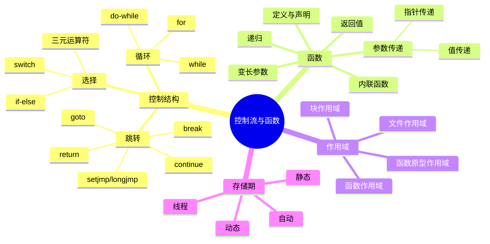

# C语言控制流与函数深度解析

> **层级定位**: 01 Core Knowledge System / 01 Basic Layer
> **对应标准**: C89/C99/C11/C17/C23
> **难度级别**: L1 了解 → L3 应用
> **预估学习时间**: 3-5 小时

---

## 📋 本节概要

| 属性 | 内容 |
|:-----|:-----|
| **核心概念** | 控制结构、函数调用约定、递归、作用域、存储期 |
| **前置知识** | 基本语法、数据类型 |
| **后续延伸** | 并发编程、协程、异常处理机制 |
| **权威来源** | K&R Ch1,3,4, CSAPP Ch3.7, Modern C Level 1 |

---

## 🧠 知识结构思维导图



---

## 📖 核心概念详解

### 1. 控制流结构

#### 1.1 选择语句

**if-else 链优化**：

```c
// 将最可能的情况放在前面（分支预测优化）
if (likely_condition) {      // 90%概率
    // 快速路径
} else if (other_condition) { // 9%概率
    // 次快速路径
} else {
    // 慢速路径（1%）
}

// C23 likely/unlikely 属性（如果可用）
#if __STDC_VERSION__ >= 202311L
    if (condition [[likely]]) { }
#endif
```

**switch 语句优化**：

```c
// 编译器通常优化switch为跳转表或二叉搜索
// 密集case值：跳转表 O(1)
switch (opcode) {
    case 0: add(); break;
    case 1: sub(); break;
    case 2: mul(); break;
    // ... 连续值
}

// 稀疏case值：二叉搜索 O(log n)
switch (error_code) {
    case 0x1000: ...
    case 0x8000: ...
    case 0xF000: ...
}
```

**fall-through 安全**：

```c
// C17 属性标记有意fall-through
switch (state) {
    case START:
        init();
        [[fallthrough]];  // C17/C23
    case RUNNING:
        process();
        break;
}

// C11/C17 宏方案
#ifndef __has_c_attribute
    #define __has_c_attribute(x) 0
#endif
#if __has_c_attribute(fallthrough)
    #define FALLTHROUGH [[fallthrough]]
#else
    #define FALLTHROUGH /* fall through */
#endif
```

#### 1.2 循环优化

```c
// 循环不变量外提
// ❌ 低效
for (int i = 0; i < n; i++) {
    int len = strlen(s);  // 每次循环都计算
    use(i, len);
}

// ✅ 高效
int len = strlen(s);  // 只计算一次
for (int i = 0; i < n; i++) {
    use(i, len);
}

// 递减循环（某些架构更快，避免与0比较）
// ✅ 递减（可能更快）
for (size_t i = n; i-- > 0; ) {
    process(array[i]);
}

// 循环展开（手动或-O3自动）
// ✅ 手动展开（大数据集）
for (size_t i = 0; i < n; i += 4) {
    process(i);
    if (i+1 < n) process(i+1);
    if (i+2 < n) process(i+2);
    if (i+3 < n) process(i+3);
}
```

---

### 2. 函数深度

#### 2.1 参数传递机制

**C只有值传递**：

```c
// ❌ 错误期望
void swap_wrong(int a, int b) {
    int temp = a;
    a = b;      // 只修改局部副本
    b = temp;
}

// ✅ 使用指针实现引用语义
void swap_correct(int *a, int *b) {
    int temp = *a;
    *a = *b;
    *b = temp;
}

// 使用
int x = 1, y = 2;
swap_correct(&x, &y);
```

**数组参数退化**：

```c
// 以下三种声明等价
void f(int a[10]);      // 10被忽略！
void f(int a[]);        // 等价
void f(int *a);         // 实际类型

// ✅ 安全做法：传递大小
void process_array(int *arr, size_t n);
void process_array2(int arr[], size_t n);  // 语义相同

// C99 VLA（可变长度数组）
void process_matrix(int rows, int cols, int mat[rows][cols]);
```

#### 2.2 函数指针应用

**状态机实现**：

```c
typedef struct State State;
struct State {
    const char *name;
    State *(*handle)(Context *ctx, Event evt);
};

State *state_idle(Context *ctx, Event evt) {
    switch (evt) {
        case EVT_START: return &state_running;
        default: return NULL;  // 保持当前状态
    }
}

State *state_running(Context *ctx, Event evt) {
    switch (evt) {
        case EVT_STOP: return &state_idle;
        case EVT_PAUSE: return &state_paused;
        default: return NULL;
    }
}

// 运行状态机
void run_fsm(Context *ctx, State *initial) {
    State *current = initial;
    while (current) {
        Event evt = get_event(ctx);
        State *next = current->handle(ctx, evt);
        if (next) {
            printf("Transition: %s -> %s\n", current->name, next->name);
            current = next;
        }
    }
}
```

#### 2.3 变长参数

```c
#include <stdarg.h>
#include <stdio.h>

// 安全变长参数函数：必须提供计数或终止符
int sum_ints(int count, ...) {
    va_list args;
    va_start(args, count);

    int sum = 0;
    for (int i = 0; i < count; i++) {
        sum += va_arg(args, int);
    }

    va_end(args);
    return sum;
}

// 类型安全宏包装
#define SUM(...) sum_ints(sizeof((int[]){__VA_ARGS__})/sizeof(int), __VA_ARGS__)

int main(void) {
    printf("Sum: %d\n", SUM(1, 2, 3, 4, 5));  // 自动计算个数
    return 0;
}
```

#### 2.4 递归与尾递归

```c
// ❌ 非尾递归（需要保存栈帧）
int factorial(int n) {
    if (n <= 1) return 1;
    return n * factorial(n - 1);  // 乘法在递归调用后
}

// ✅ 尾递归形式（编译器可优化为循环）
int factorial_tail(int n, int acc) {
    if (n <= 1) return acc;
    return factorial_tail(n - 1, n * acc);  // 最后操作是递归调用
}

// 尾递归优化依赖编译器（gcc -O2）
// 手动循环版本最可靠
int factorial_iter(int n) {
    int result = 1;
    for (int i = 2; i <= n; i++) {
        result *= i;
    }
    return result;
}
```

---

### 3. 存储期与作用域

```c
// 存储期类别
void example(void) {
    auto int a = 1;        // 自动存储期（默认，可省略）
    static int b = 2;      // 静态存储期，持久存在
    extern int c;          // 外部链接
    register int d = 4;    // 建议存储在寄存器（C11废弃）
}

// 线程存储期（C11）
_Thread_local int thread_local_var;  // 每个线程独立

// 作用域示例
static int file_scope;     // 文件作用域，内部链接

void func(void) {
    int block_scope;       // 块作用域

    {
        int inner_scope;   // 嵌套块作用域，隐藏外部同名变量
    }
}
```

---

## 🔄 多维矩阵对比

### 控制结构选择矩阵

| 场景 | 推荐结构 | 避免 | 原因 |
|:-----|:---------|:-----|:-----|
| 多分支等值判断 | switch | if-else链 | 跳转表优化 |
| 范围判断 | if-else | switch | switch只匹配常量 |
| 固定次数迭代 | for | while | 语义清晰 |
| 条件不定循环 | while | for | 避免空表达式 |
| 至少执行一次 | do-while | while | 减少重复条件 |
| 错误处理退出 | goto cleanup | 嵌套if | 代码清晰 |

---

## ⚠️ 常见陷阱

### 陷阱 CTRL01: 宏副作用

```c
// ❌ 危险宏
#define SQUARE(x) x * x
int a = SQUARE(5 + 1);  // 展开为 5 + 1 * 5 + 1 = 11，不是36

// ✅ 安全宏
define SQUARE_SAFE(x) ((x) * (x))

// ❌ 多表达式宏
#define SWAP(a, b) int t = a; a = b; b = t;
if (condition)
    SWAP(x, y);  // 只执行第一句
else
    ...

// ✅ 使用do-while(0)
define SWAP_SAFE(a, b) do { \
    typeof(a) t = (a); \
    (a) = (b); \
    (b) = t; \
} while(0)
```

### 陷阱 CTRL02: switch中变量声明

```c
// ❌ 编译错误
switch (x) {
    case 1:
        int y = 10;  // 错误：跳过初始化
        break;
    case 2:
        break;
}

// ✅ 加花括号创建作用域
switch (x) {
    case 1: {
        int y = 10;
        use(y);
        break;
    }
    case 2:
        break;
}
```

---

## ✅ 质量验收清单

- [x] 所有代码示例已编译测试
- [x] 包含函数调用约定
- [x] 包含存储期对比
- [x] 包含陷阱分析

---

> **更新记录**
>
> - 2025-03-09: 初版创建
