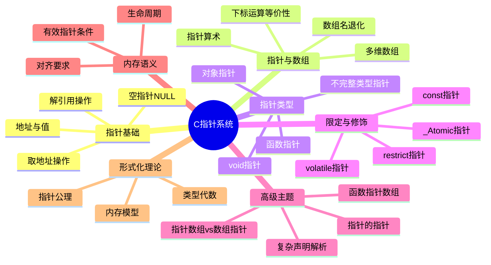

# C语言指针深度解析（形式化版）

> **层级定位**: 01 Core Knowledge System / 02 Core Layer
> **对应标准**: C89/C99/C11/C17/C23
> **难度级别**: L3 应用 → L5 综合
> **预估学习时间**: 12-16 小时

---

## 📋 本节概要

| 属性 | 内容 |
|:-----|:-----|
| **核心概念** | 指针语义、指针-数组区别、指针算术、函数指针、复杂声明、const限定、形式化模型 |
| **前置知识** | 数据类型系统、内存地址概念、数组基础、二进制表示 |
| **后续延伸** | 动态内存管理、数据结构实现、函数式编程模式、编译器实现 |
| **权威来源** | K&R Ch5, Expert C Programming Ch3/4, CSAPP Ch3.8, Modern C Level 2, ISO C11 §6.5 |

---

## 🧠 知识结构思维导图



---

## 📐 第一部分：概念定义（严格形式化）

### 1.1 指针的数学定义

#### 定义 1.1.1：指针作为二元组

**指针**是一个数学二元组 `P = (A, T)`，其中：

- `A ∈ AddressSpace`：指向的内存地址（整数值）
- `T ∈ TypeSystem`：指针所指向对象的类型信息

**形式化表示**：

```
∀p ∈ Pointer, p = (addr(p), type(p))
```

#### 定义 1.1.2：地址空间

**地址空间** `AS` 是一个有限有序集：

```
AS = {0, 1, 2, ..., 2^n - 1} 其中 n ∈ {32, 64}（典型实现）
```

**属性**：

- 全序关系：`∀a,b ∈ AS, a < b ∨ a = b ∨ a > b`
- 离散性：`∀a ∈ AS, ∃! next(a) = a + 1`
- 有限性：`max(AS) = 2^n - 1`

#### 定义 1.1.3：指针的类型函数

类型函数 `type: Pointer → TypeInfo` 定义了：

| 属性 | 数学描述 | 语义 |
|:-----|:---------|:-----|
| `size(T)` | `sizeof(*p)` | 解引用时访问的字节数 |
| `align(T)` | `_Alignof(T)` | 地址对齐要求 |
| `stride(T)` | `sizeof(T)` | 指针算术的步长单位 |
| `valid(T)` | 有效类型规则 | 允许的访问类型集合 |

#### 定义 1.1.4：指针运算的形式化

给定指针 `p = (a, T)` 和整数 `n`：

```
p + n = (a + n × sizeof(T), T)    当结果在有效地址空间内
p - n = (a - n × sizeof(T), T)    当结果在有效地址空间内
p - q = (addr(p) - addr(q)) / sizeof(T)  当 p,q 同类型且指向同一数组
```

**有效性条件**：

```
valid(p + n) ↔ addr(p) + n × sizeof(T) ∈ ValidRange ∧ 无溢出
```

### 1.2 指针的代数结构

#### 1.2.1 指针作为范畴论中的对象

在C语言的类型系统中，指针形成**范畴** `C`：

- **对象**：所有类型 `T ∈ Types`
- **态射**：指针转换 `f: T* → U*`
- **单位态射**：`id_T*: T* → T*`
- **复合**：类型转换的传递性

#### 1.2.2 指针运算的群论视角

对于固定类型 `T`，指向同一数组的指针在加法运算下形成**阿贝尔群**的片段：

- **封闭性**：`p, q ∈ ArrayPtr(T) → p - q ∈ ℤ`（元素个数差）
- **结合律**：`(p + m) + n = p + (m + n)`
- **单位元**：`p + 0 = p`
- **逆元**：`p - q = -(q - p)`

**限制**：此群结构仅在**数组边界内**有效，越界进入未定义行为域。

### 1.3 特殊指针的严格区分

#### 1.3.1 空指针（Null Pointer）

**定义**：`null = (0, T)`，其中 `0` 是空指针常量

**性质**：

```
∀T, null_T = (0, T)          /* 所有类型的空指针地址相同 */
null ≠ nullptr               /* 在C23中，nullptr是类型安全的 */
```

**C标准保证**（C11 §6.3.2.3/3）：
> 值为0的整型常量表达式转换为指针类型时，产生空指针。

**检测**：

```c
bool is_null(void *p) {
    return p == NULL;        /* 或 p == 0，但不推荐 */
}
```

#### 1.3.2 野指针（Wild Pointer）

**定义**：包含**不确定值**（indeterminate value）的指针

**产生条件**：

```
WildPtr = { p | p ∈ Pointer ∧ p ≠ null ∧ p 未初始化 }
```

**特征**：

- 值不可预测
- 可能指向有效或无效内存
- 任何解引用都是未定义行为

**示例**：

```c
void foo(void) {
    int *p;          /* p 是野指针 - 未初始化 */
    *p = 10;         /* UB: 使用野指针 */
}
```

#### 1.3.3 悬挂指针（Dangling Pointer）

**定义**：指向已释放或已结束生命周期对象的指针

**形式化**：

```
DanglingPtr = { p | Lifetime(obj(p)) = Ended ∨ obj(p) 已释放 }
```

**产生场景**：

| 场景 | 示例代码 | 原因 |
|:-----|:---------|:-----|
| 栈变量返回 | `return &local;` | 栈帧销毁 |
| 堆内存释放 | `free(p); /* p仍有效 */` | 内存归还系统 |
| 作用域结束 | `int *p; { int x; p = &x; }` | 自动变量销毁 |

### 1.4 指针的类型层次结构

```
Pointer
├── ObjectPointer
│   ├── T*                    /* 指向对象 */
│   ├── void*                 /* 通用对象指针 */
│   ├── T (*)[N]              /* 数组指针 */
│   └── T *restrict           /* 受限指针 */
├── FunctionPointer
│   └── T (*)(Args...)        /* 函数指针 */
└── NullPointer
    ├── NULL                  /* 宏，实现定义 */
    └── nullptr (C23)         /* 关键字，类型安全 */
```

---

## 📊 第二部分：属性维度表

### 2.1 指针类型属性矩阵

#### 表2.1：基本类型属性

| 属性 | `T*` | `void*` | `T* const` | `T (*)[]` |
|:-----|:----:|:-------:|:----------:|:---------:|
| **存储大小** | `sizeof(void*)` | `sizeof(void*)` | `sizeof(void*)` | `sizeof(void*)` |
| **对齐要求** | `alignof(void*)` | `alignof(void*)` | `alignof(void*)` | `alignof(void*)` |
| **可修改指向** | ✅ | ✅ | ❌ | ✅ |
| **可解引用** | ✅ | ❌ | ✅ | ✅ |
| **可算术运算** | ✅ | ❌(C) | ✅ | 有限 |
| **隐式转换到`void*`** | ✅ | - | ✅ | ✅ |
| **支持比较** | ✅ | ✅ | ✅ | ✅ |

#### 表2.2：限定符属性

| 限定符 | 语法 | 可修改指向地址 | 可修改指向内容 | 别名优化 |
|:-------|:-----|:--------------:|:--------------:|:--------:|
| 无 | `T*` | ✅ | ✅ | 否 |
| const | `const T*` | ✅ | ❌ | 可能 |
| volatile | `volatile T*` | ✅ | ✅ | 否 |
| restrict | `T *restrict` | ✅ | ✅ | 是 |
| const + volatile | `const volatile T*` | ✅ | ❌ | 否 |
| _Atomic | `_Atomic(T*)` | 原子 | 原子 | 是 |

### 2.2 指针运算属性

#### 表2.3：算术运算有效性

| 运算 | 操作数类型 | 结果类型 | 有效性条件 | 数学含义 |
|:-----|:-----------|:---------|:-----------|:---------|
| `p + n` | `T*`, `整数` | `T*` | 结果在有效范围 | 地址偏移 `n×sizeof(T)` |
| `p - n` | `T*`, `整数` | `T*` | 结果在有效范围 | 地址偏移 `-n×sizeof(T)` |
| `p - q` | `T*`, `T*` | `ptrdiff_t` | 同数组对象 | 元素个数差 |
| `p++` | `T*` | `T*` | 原值有效 | 指向下一个元素 |
| `p--` | `T*` | `T*` | 原值有效 | 指向前一个元素 |
| `p[n]` | `T*`, `整数` | `T` | `p+n`有效 | `*(p + n)` |

#### 表2.4：步长与类型关系

| 指针类型 | `sizeof(*p)` | `sizeof(p)` | 步长（`p+1 - p`） | 典型用途 |
|:---------|:------------:|:-----------:|:-----------------:|:---------|
| `char*` | 1 | 4/8 | 1字节 | 字节操作 |
| `int*` | 4 | 4/8 | 4字节 | 整数数组 |
| `double*` | 8 | 4/8 | 8字节 | 浮点数组 |
| `struct S*` | `sizeof(S)` | 4/8 | `sizeof(S)` | 结构体数组 |
| `void*` | N/A | 4/8 | N/A（C23前） | 泛型编程 |

### 2.3 限定符详细语义

#### 2.3.1 const 限定符矩阵

| 声明 | 读法 | 可修改地址 | 可修改内容 | 用途 |
|:-----|:-----|:----------:|:----------:|:-----|
| `int *p` | 指向int的指针 | ✅ | ✅ | 通用指针 |
| `const int *p` | 指向const int的指针 | ✅ | ❌ | 只读访问 |
| `int const *p` | 同上（等价） | ✅ | ❌ | 只读访问 |
| `int *const p` | const的指向int的指针 | ❌ | ✅ | 固定指针 |
| `const int *const p` | const的指向const int的指针 | ❌ | ❌ | 完全常量 |

**记忆法则**：

```
从右向左读，const修饰左边最近的东西
如果左边没有，修饰右边
```

#### 2.3.2 restrict 语义（C99+）

**定义**：`restrict` 向编译器承诺：指针是访问其所指对象的**唯一且排他**方式。

**形式化**：

```
restrict-qualified:  ∀访问p指向的对象，只能通过p或其派生值进行
```

**优化影响**：

```c
/* 无restrict - 编译器必须假设别名 */
void add(int *a, int *b, int n) {
    for (int i = 0; i < n; i++)
        a[i] += b[i];  /* 每次循环都要加载a[i]和b[i] */
}

/* 有restrict - 允许更多优化 */
void add_restrict(int *restrict a, int *restrict b, int n) {
    for (int i = 0; i < n; i++)
        a[i] += b[i];  /* 编译器可以缓存值 */
}
```

**违反后果**：未定义行为

#### 2.3.3 volatile 语义

**定义**：每次访问都必须从内存实际读取，每次修改都必须实际写入内存。

**应用场景**：

| 场景 | 示例 |
|:-----|:-----|
| 硬件寄存器 | `volatile uint32_t *reg = (volatile uint32_t*)0x4000;` |
| 多线程共享变量 | `volatile int shared_flag;` |
| 信号处理程序 | `volatile sig_atomic_t signal_received;` |

---
