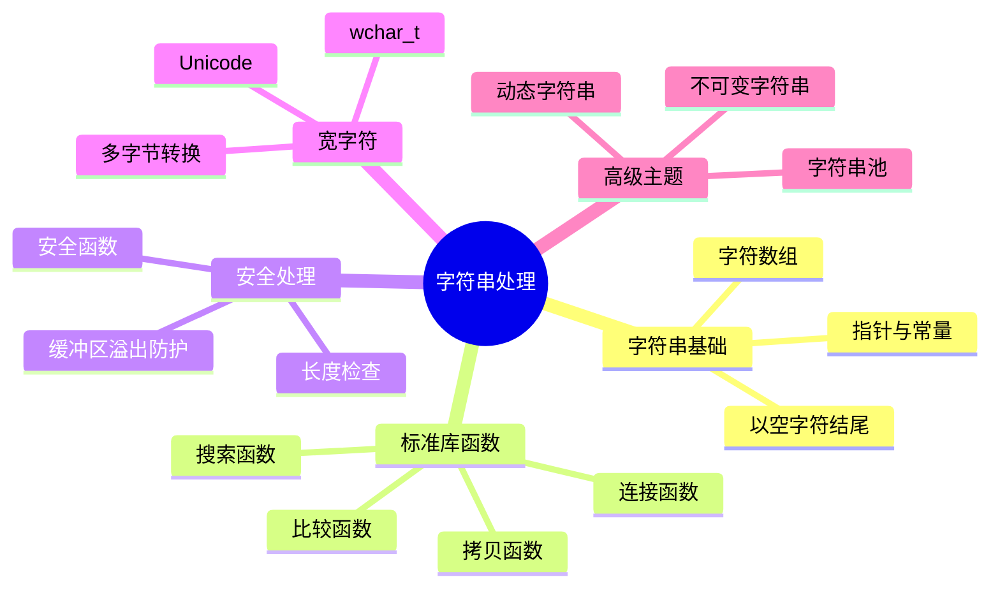

# C语言字符串处理深度解析

> **层级定位**: 01 Core Knowledge System / 02 Core Layer
> **对应标准**: C89/C99/C11/C17/C23
> **难度级别**: L2 理解 → L3 应用
> **预估学习时间**: 4-6 小时

---

## 🔗 文档关联

### 前置依赖

| 文档 | 关系类型 | 说明 |
|:-----|:---------|:-----|
| [数组与指针](05_Arrays_Pointers.md) | 核心依赖 | 字符数组、指针遍历 |
| [内存管理](02_Memory_Management.md) | 安全基础 | 缓冲区分配、溢出防护 |
| [指针深度](01_Pointer_Depth.md) | 知识基础 | 指针运算、const修饰 |

### 后续延伸

| 文档 | 关系类型 | 说明 |
|:-----|:---------|:-----|
| [标准I/O库](../04_Standard_Library_Layer/01_Standard_IO/readme.md) | 直接关联 | 格式化输入输出 |
| [安全编码规范](../09_Safety_Standards/04_Secure_Coding_Guide.md) | 安全延伸 | 字符串安全最佳实践 |
| [正则引擎](../../03_System_Technology_Domains/02_Regex_Engine/01_NFA_Implementation.md) | 进阶应用 | 复杂文本处理 |

### 横向关联

| 文档 | 关系类型 | 说明 |
|:-----|:---------|:-----|
| [国际化支持](../11_Internationalization/readme.md) | 功能扩展 | 宽字符、多语言处理 |
| [MISRA C安全规范](../09_Safety_Standards/MISRA_C_2023/readme.md) | 安全标准 | 字符串操作安全规则 |

---

## 📋 本节概要

| 属性 | 内容 |
|:-----|:-----|
| **核心概念** | 字符串表示、安全操作、宽字符、编码处理 |
| **前置知识** | 指针、数组、内存管理 |
| **后续延伸** | 正则表达式、文本解析、国际化 |
| **权威来源** | K&R Ch5.5, C11标准 7.21, CERT STR系列 |

---

## 🧠 知识结构思维导图



---

## 📖 核心概念详解

### 1. C字符串基础

#### 1.1 字符串表示

```c
// C字符串是以空字符'\0'结尾的字符数组

// 字符串字面量（存储在只读数据段）
const char *str1 = "Hello";  // str1指向常量字符串

// 字符数组（可修改）
char str2[] = "Hello";  // 数组大小为6（包含'\0'）
char str3[10] = "Hello";  // 数组大小为10，剩余空间为0

// 手动初始化
char str4[6] = {'H', 'e', 'l', 'l', 'o', '\0'};

// ❌ 常见错误：忘记null终止
char str5[5] = {'H', 'e', 'l', 'l', 'o'};  // 不是字符串！
printf("%s\n", str5);  // 越界读取直到遇到\0
```

#### 1.2 字符串长度与大小

```c
#include <string.h>

char str[] = "Hello";

sizeof(str);       // 6（数组总大小）
strlen(str);       // 5（字符串长度，不含'\0'）

// 常见混淆
char *ptr = "Hello";
sizeof(ptr);       // 4或8（指针大小）
sizeof("Hello");   // 6（字符串字面量大小）
```

### 2. 字符串操作函数

#### 2.1 安全拷贝策略

```c
#include <string.h>

// ❌ strcpy不安全：无边界检查
char dest[10];
strcpy(dest, "this is a very long string");  // 缓冲区溢出！

// ⚠️ strncpy的问题
strncpy(dest, src, sizeof(dest));
// 如果src >= sizeof(dest)，dest不会以'\0'结尾！

// ✅ 安全模式1：手动确保终止
strncpy(dest, src, sizeof(dest) - 1);
dest[sizeof(dest) - 1] = '\0';

// ✅ 安全模式2：自定义安全拷贝
char *safe_strcpy(char *dest, const char *src, size_t size) {
    if (!dest || !src || size == 0) return NULL;

    size_t i;
    for (i = 0; i < size - 1 && src[i]; i++) {
        dest[i] = src[i];
    }
    dest[i] = '\0';
    return dest;
}

// ✅ 安全模式3：动态分配
char *strdup_safe(const char *src) {
    if (!src) return NULL;
    size_t len = strlen(src) + 1;
    char *dest = malloc(len);
    if (dest) memcpy(dest, src, len);
    return dest;
}
```

#### 2.2 字符串连接

```c
// ❌ strcat不安全
define BUF_SIZE 100
char buffer[BUF_SIZE] = "Hello";
strcat(buffer, " ");
strcat(buffer, "World");
// 如果总长超过BUF_SIZE，溢出！

// ✅ 安全连接
define BUF_SIZE 100
char buffer[BUF_SIZE] = "Hello";
strncat(buffer, " ", BUF_SIZE - strlen(buffer) - 1);
strncat(buffer, "World", BUF_SIZE - strlen(buffer) - 1);

// ✅ 更安全的实现
bool safe_concat(char *dest, const char *src, size_t size) {
    if (!dest || !src || size == 0) return false;

    size_t dest_len = strnlen(dest, size);
    if (dest_len >= size - 1) return false;  // 已满

    size_t remaining = size - dest_len - 1;
    strncpy(dest + dest_len, src, remaining);
    dest[size - 1] = '\0';
    return true;
}
```

#### 2.3 字符串搜索与比较

```c
#include <string.h>

// 字符串比较
strcmp(s1, s2);      // 完全比较
strncmp(s1, s2, n); // 最多比较n个字符

// 字符串搜索
strchr(s, 'c');      // 查找字符首次出现
strrchr(s, 'c');     // 查找字符最后一次出现
strstr(s1, s2);      // 查找子串
strpbrk(s1, s2);     // 查找s2中任意字符在s1中首次出现
strspn(s1, s2);      // s1中只包含s2字符的前缀长度
strcspn(s1, s2);     // s1中不包含s2字符的前缀长度

// 标记分割（注意：修改原字符串！）
char str[] = "Hello,World,C";
char *token = strtok(str, ",");
while (token) {
    printf("%s\n", token);
    token = strtok(NULL, ",");
}

// ✅ 线程安全的标记分割（C11）
char *saveptr;
token = strtok_r(str, ",", &saveptr);
```

### 3. 宽字符与多字节

```c
#include <wchar.h>
#include <locale.h>

// 设置本地化
setlocale(LC_ALL, "");

// 宽字符操作
wchar_t wstr[] = L"Hello 世界";
wcslen(wstr);        // 宽字符串长度
wcscpy(wdest, wsrc); // 宽字符串拷贝

// 多字节与宽字符转换
char mbs[256];
wchar_t wcs[128];

// wchar_t -> char（宽转多字节）
int len = wcstombs(mbs, wcs, sizeof(mbs));

// char -> wchar_t（多字节转宽）
int wlen = mbstowcs(wcs, mbs, sizeof(wcs)/sizeof(wcs[0]));

// 检查转换是否成功
if (len == (size_t)-1) {
    // 转换错误（无效多字节序列）
}
```

### 4. 动态字符串实现

```c
// 简单的动态字符串实现
typedef struct {
    char *data;
    size_t len;
    size_t cap;
} String;

String *string_new(void) {
    String *s = malloc(sizeof(String));
    if (!s) return NULL;
    s->cap = 16;
    s->data = malloc(s->cap);
    if (!s->data) { free(s); return NULL; }
    s->data[0] = '\0';
    s->len = 0;
    return s;
}

void string_free(String *s) {
    if (s) {
        free(s->data);
        free(s);
    }
}

bool string_append(String *s, const char *str) {
    if (!s || !str) return false;

    size_t str_len = strlen(str);
    size_t new_len = s->len + str_len;

    if (new_len >= s->cap) {
        size_t new_cap = s->cap;
        while (new_cap <= new_len) new_cap *= 2;
        char *new_data = realloc(s->data, new_cap);
        if (!new_data) return false;
        s->data = new_data;
        s->cap = new_cap;
    }

    memcpy(s->data + s->len, str, str_len + 1);
    s->len = new_len;
    return true;
}

// 使用
String *s = string_new();
string_append(s, "Hello");
string_append(s, " ");
string_append(s, "World");
printf("%s\n", s->data);  // Hello World
string_free(s);
```

---

## ⚠️ 常见陷阱

### 陷阱 STR01: 字符串截断未检查

```c
// ❌ 截断不报告
char buf[10];
strncpy(buf, "very long string", sizeof(buf));
// buf现在是"very long"（无null终止）或截断
// 没有错误指示

// ✅ 检查截断
size_t needed = strlen(src) + 1;
if (needed > sizeof(buf)) {
    // 处理截断
    return ERROR_TRUNCATED;
}
strcpy(buf, src);
```

### 陷阱 STR02: 格式化字符串漏洞

```c
// ❌ 严重安全漏洞
void log_message(const char *msg) {
    printf(msg);  // 如果msg包含%，崩溃或信息泄漏
}
// 攻击：msg = "%s%s%s" 读取任意内存

// ✅ 修复
void log_message_safe(const char *msg) {
    printf("%s", msg);  // 固定格式
}
```

### 陷阱 STR03: 多字节字符处理错误

```c
// ❌ 假设1字符=1字节
char *p = "世界";
printf("Length: %zu\n", strlen(p));  // 不是2！是6(UTF-8)
p[1] = 'a';  // 破坏多字节序列！

// ✅ 使用宽字符或UTF-8库
```

---

## ✅ 质量验收清单

- [x] 字符串表示方式
- [x] 安全拷贝策略
- [x] 动态字符串实现
- [x] 宽字符处理
- [x] 常见陷阱

---

> **更新记录**
>
> - 2025-03-09: 初版创建


---

## 深入理解

### 技术原理

深入探讨相关技术原理和实现细节。

### 实践指南

- 步骤1：理解基础概念
- 步骤2：掌握核心原理
- 步骤3：应用实践

### 相关资源

- 文档链接
- 代码示例
- 参考文章

---

> **最后更新**: 2026-03-21
> **维护者**: AI Code Review
