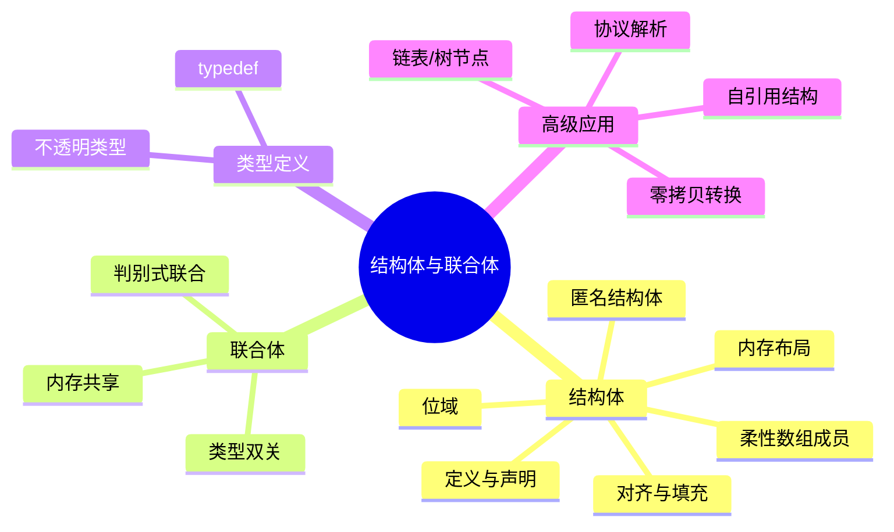

# C语言结构体与联合体深度解析

> **层级定位**: 01 Core Knowledge System / 03 Construction Layer
> **对应标准**: C89/C99/C11/C17/C23
> **难度级别**: L2 理解 → L4 分析
> **预估学习时间**: 4-6 小时

---

## 📋 本节概要

| 属性 | 内容 |
|:-----|:-----|
| **核心概念** | 结构体内存布局、对齐与填充、位域、联合体、柔性数组成员 |
| **前置知识** | [数据类型系统](../../01_Basic_Layer/02_Data_Type_System.md)、[指针](../../02_Core_Layer/01_Pointer_Depth.md)、[内存管理](../../02_Core_Layer/02_Memory_Management.md) |
| **后续延伸** | [内存布局优化](../../02_Core_Layer/02_Memory_Management.md#缓存优化)、[序列化](../../04_Standard_Library_Layer/02_Data_Structures/readme.md)、[网络协议](../../03_System_Technology_Domains/11_Network_Programming/readme.md) |
| **横向关联** | [类型双关](../../02_Core_Layer/08_Type_Punning.md)、[对齐不变式](../../../06_Thinking_Representation/05_Concept_Mappings/13_Global_Invariants.md#对齐不变式)、[层次桥接链](../../../06_Thinking_Representation/05_Concept_Mappings/09_Level_Bridging_Chains.md) |
| **权威来源** | K&R Ch6, CSAPP Ch3.9, Modern C Level 2, C11 6.7.2.1 |

---

## 🧠 知识结构思维导图



---

## 📖 核心概念详解

### 1. 结构体内存布局

#### 1.1 对齐规则

```c
#include <stddef.h>
#include <stdio.h>

struct Example {
    char a;      // 1字节，偏移0
    // 3字节填充（int对齐要求）
    int b;       // 4字节，偏移4
    char c;      // 1字节，偏移8
    // 3字节填充（结构体总大小为最大成员对齐的倍数）
};  // 总大小 = 12，不是 1+4+1=6

// 优化布局：按大小降序排列
struct Optimized {
    int b;       // 4字节
    char a;      // 1字节
    char c;      // 1字节
    // 2字节填充
};  // 总大小 = 8

// 紧凑布局（可能牺牲性能）
#pragma pack(push, 1)
struct Packed {
    char a;
    int b;
    char c;
};  // 总大小 = 6
#pragma pack(pop)

int main(void) {
    printf("sizeof(Example)   = %zu\n", sizeof(struct Example));    // 12
    printf("sizeof(Optimized) = %zu\n", sizeof(struct Optimimized)); // 8

    printf("offsetof(Example, a) = %zu\n", offsetof(struct Example, a)); // 0
    printf("offsetof(Example, b) = %zu\n", offsetof(struct Example, b)); // 4
    printf("offsetof(Example, c) = %zu\n", offsetof(struct Example, c)); // 8

    return 0;
}
```

#### 1.2 位域

```c
// 硬件寄存器映射
struct ControlRegister {
    unsigned int enable    : 1;   // bit 0
    unsigned int mode      : 3;   // bits 1-3
    unsigned int reserved  : 4;   // bits 4-7
    unsigned int status    : 8;   // bits 8-15
    unsigned int           : 16;  // 填充到32位
};

// 位域布局是实现定义的！
// 使用场景：
// 1. 硬件寄存器映射
// 2. 协议包头解析
// 3. 内存受限的密集存储

// C11匿名结构体/联合体内嵌
struct Packet {
    uint8_t header;
    union {
        struct {
            uint16_t src;
            uint16_t dst;
        };
        uint32_t raw;
    } addr;
};
```

### 2. 联合体应用

```c
#include <stdint.h>
#include <stdio.h>

// 类型双关（C99有效类型规则允许通过union）
typedef union {
    float f;
    uint32_t i;
    struct {
        uint32_t mantissa : 23;
        uint32_t exponent : 8;
        uint32_t sign     : 1;
    } bits;
} FloatBits;

void print_float_details(float f) {
    FloatBits fb = {.f = f};

    printf("Value: %f\n", fb.f);
    printf("Raw: 0x%08X\n", fb.i);
    printf("Sign: %u\n", fb.bits.sign);
    printf("Exponent: %u (0x%02X)\n", fb.bits.exponent, fb.bits.exponent);
    printf("Mantissa: %u (0x%06X)\n", fb.bits.mantissa, fb.bits.mantissa);
}

// 判别式联合体（Tagged Union）
typedef enum { TYPE_INT, TYPE_FLOAT, TYPE_STRING } ValueType;

typedef struct {
    ValueType type;
    union {
        int i;
        float f;
        const char *s;
    } data;
} Value;

void print_value(const Value *v) {
    switch (v->type) {
        case TYPE_INT:    printf("int: %d\n", v->data.i); break;
        case TYPE_FLOAT:  printf("float: %f\n", v->data.f); break;
        case TYPE_STRING: printf("string: %s\n", v->data.s); break;
    }
}
```

### 3. 柔性数组成员 (FAM)

```c
// C99 柔性数组成员
typedef struct {
    size_t len;
    char data[];  // 柔性数组，不占用结构体大小
} FlexibleString;

// 分配
FlexibleString *create_string(const char *src) {
    size_t len = strlen(src);
    // 分配结构体 + 数组空间
    FlexibleString *s = malloc(sizeof(FlexibleString) + len + 1);
    if (s) {
        s->len = len;
        memcpy(s->data, src, len + 1);
    }
    return s;
}

// 使用
void use_fam(void) {
    FlexibleString *s = create_string("Hello, World!");
    printf("len=%zu, data=%s\n", s->len, s->data);
    free(s);
}

// 对比：指针版本（需要两次分配）
typedef struct {
    size_t len;
    char *data;  // 需要单独分配
} PointerString;

PointerString *create_ptr_string(const char *src) {
    PointerString *s = malloc(sizeof(PointerString));
    s->len = strlen(src);
    s->data = malloc(s->len + 1);  // 第二次分配
    memcpy(s->data, src, s->len + 1);
    return s;
}
// 需要两次free，更容易出错
```

---

## 🔄 多维矩阵对比

### 结构体布局优化矩阵

| 布局 | 大小 | 访问速度 | 适用场景 |
|:-----|:----:|:--------:|:---------|
| 默认 | 较大 | 最快 | 通用 |
| 紧凑(pack 1) | 最小 | 较慢 | 网络协议、文件格式 |
| 排序优化 | 中等 | 快 | 大量结构体数组 |

---

## ⚠️ 常见陷阱

### 陷阱 STRUCT01: 对齐假设

```c
// ❌ 危险：假设无填充
struct Header {
    uint8_t type;
    uint32_t length;
};

void write_header(FILE *fp, struct Header *h) {
    fwrite(h, sizeof(*h), 1, fp);  // 包含填充字节！
}

// ✅ 正确：序列化时手动打包
void write_header_safe(FILE *fp, struct Header *h) {
    fwrite(&h->type, 1, 1, fp);
    fwrite(&h->length, 4, 1, fp);
}
```

---

## ✅ 质量验收清单

- [x] 包含对齐规则详解
- [x] 包含位域示例
- [x] 包含联合体类型双关
- [x] 包含FAM完整示例

---

> **更新记录**
>
> - 2025-03-09: 初版创建


---

## 深入理解

### 技术原理

深入探讨相关技术原理和实现细节。

### 技术原理深度剖析

#### 1. 结构体内存布局的数学模型

##### 1.1 布局算法的形式化描述

结构体内存布局可以形式化为一个布局函数：

```
Layout: StructDefinition → (Size, Alignment, FieldOffsets)

输入：结构体定义 S = { (f₁, T₁), (f₂, T₂), ..., (fₙ, Tₙ) }
      其中 fᵢ 是字段名，Tᵢ 是字段类型

输出：布局 L = (size, align, {off₁, off₂, ..., offₙ})

布局算法：
  offset₀ = 0
  for i = 1 to n:
    alignᵢ = alignment(Tᵢ)
    sizeᵢ = sizeof(Tᵢ)
    offᵢ = round_up(offsetᵢ₋₁ + sizeᵢ₋₁, alignᵢ)
    offsetᵢ = offᵢ + sizeᵢ
  end
  align = max(align₁, ..., alignₙ)
  size = round_up(offsetₙ, align)

其中 round_up(x, a) = ((x + a - 1) / a) × a
```

##### 1.2 内存布局可视化

```
结构体 struct Example { char a; int b; short c; } 的典型布局：

地址增长方向 →
┌─────────────────────────────────────────────────────────────┐
│  0   │  1   │  2   │  3   │  4   │  5   │  6   │  7   │  8   │
├──────┼──────┼──────┼──────┼──────┼──────┼──────┼──────┼──────┤
│  a   │padding│padding│padding│   b[0] │  b[1] │  b[2] │  b[3] │
├──────┴──────┴──────┴──────┼──────┴──────┴──────┴──────┼──────┤
│      1B + 3B填充            │         4B (int b)         │ c[0] │
│                            │                            │ c[1] │
├────────────────────────────┴────────────────────────────┼──────┤
│                    8字节                                  │      │
│                                                           │      │
├───────────────────────────────────────────────────────────┴──────┤
│                        2B (short c) + 2B尾部填充                   │
│                                                                   │
└───────────────────────────────────────────────────────────────────┘

总大小：12字节（而非 naive 的 7 字节）
对齐要求：4字节
```

#### 2. 对齐的硬件与性能原理

##### 2.1 为什么需要对齐？

```
内存访问粒度与总线宽度：

32位系统（4字节总线）：
┌─────────────────────────────────────────┐
│  地址0  │  地址1  │  地址2  │  地址3   │
├─────────┼─────────┼─────────┼──────────┤
│ Byte 0  │ Byte 1  │ Byte 2  │ Byte 3   │
│  [31:24]│  [23:16]│  [15:8] │  [7:0]   │
└─────────────────────────────────────────┘

未对齐访问示例（读取 int 从地址1）：
- 需要2个总线周期（地址0-3 和 地址4-7）
- 需要额外的移位和掩码操作合并数据
- 某些架构（ARM、RISC-V）直接触发 SIGBUS 异常

对齐访问示例（读取 int 从地址4）：
- 仅需1个总线周期
- 直接加载到寄存器
- 硬件优化路径
```

##### 2.2 缓存行对齐与性能

```c
// 缓存行对齐优化（64字节典型）
struct CacheOptimized {
    alignas(64) int hot_data[16];  // 64字节，独占缓存行
    int cold_data[1000];            // 其他数据
};

// 伪共享避免
struct ThreadData {
    alignas(64) int counter;  // 每个线程的数据在独立缓存行
    char padding[60];          // 填充至64字节
};

// 对比：伪共享问题
struct BadLayout {
    int counter1;  // 线程1使用
    int counter2;  // 线程2使用 - 同一缓存行！
    // 导致缓存抖动
};
```

#### 3. 位域的实现机制

##### 3.1 位域的内存布局策略

```
位域布局（实现依赖，以GCC x86_64为例）：

struct {
    unsigned int a : 5;   // 位 0-4
    unsigned int b : 3;   // 位 5-7
    unsigned int c : 6;   // 位 8-13
    unsigned int d : 2;   // 位 14-15
    unsigned int e : 16;  // 位 16-31（跨字节边界）
};

内存布局（小端）：
┌────────────────────────────────────────┐
│ 31      ...      16 │ 15 14 │ 13 ... 8 │ 7 6 5 │ 4 3 2 1 0 │
├─────────────────────┼───────┼──────────┼───────┼───────────┤
│       e (16位)      │d(2位) │ c (6位)  │ b(3位)│  a (5位)  │
└─────────────────────┴───────┴──────────┴───────┴───────────┘

注意事项：
- 位域不可跨 int 边界（除非使用更大的类型）
- 位域地址不可获取（&s.a 是非法的）
- 位域是有符号还是无符号取决于实现
```

##### 3.2 位域与掩码操作的等价性

```c
// 位域方式
struct BitField {
    unsigned int enable : 1;
    unsigned int mode : 3;
    unsigned int priority : 4;
};

// 等价的掩码操作方式
#define ENABLE_MASK     0x01
#define MODE_MASK       0x0E
#define PRIORITY_MASK   0xF0

#define GET_ENABLE(x)   ((x) & ENABLE_MASK)
#define GET_MODE(x)     (((x) & MODE_MASK) >> 1)
#define GET_PRIORITY(x) (((x) & PRIORITY_MASK) >> 4)

#define SET_ENABLE(x, v)   ((x) = ((x) & ~ENABLE_MASK) | ((v) & ENABLE_MASK))
#define SET_MODE(x, v)     ((x) = ((x) & ~MODE_MASK) | (((v) << 1) & MODE_MASK))

// 位域的优势：代码可读性高，编译器自动处理掩码
// 掩码的优势：可移植性更好，可见实际位操作
```

#### 4. 联合体的类型双关机制

##### 4.1 类型双关的数学原理

```
联合体内存模型：

union U { int i; float f; char c[4]; };

内存视图（共享同一起始地址）：
地址：0x1000
┌────────────────────────────────────────┐
│  0x1000  │  0x1001  │  0x1002  │  0x1003  │
├──────────┼──────────┼──────────┼──────────┤
│ i[0]     │ i[1]     │ i[2]     │ i[3]     │  ← 作为 int 访问
├──────────┼──────────┼──────────┼──────────┤
│ f[0]     │ f[1]     │ f[2]     │ f[3]     │  ← 作为 float 访问
├──────────┼──────────┼──────────┼──────────┤
│ c[0]     │ c[1]     │ c[2]     │ c[3]     │  ← 作为字节数组访问
└──────────┴──────────┴──────────┴──────────┘

类型双关：同一位模式，不同解释
- 写入 u.i = 0x40400000; (float 3.0 的 IEEE 754 表示)
- 读取 u.f 得到 3.0
```

##### 4.2 C23对类型双关的规定

```c
// C23 对联合体类型双关的规定
// 允许通过联合体进行类型双关，但有限制

union Converter {
    int i;
    float f;
};

union Converter c;
c.f = 3.14f;
int bits = c.i;  // ✅ C23允许：通过联合体进行类型双关

// 但以下行为仍需谨慎：
union Data {
    int arr[10];
    double d;
};

union Data d;
d.arr[0] = 1;
// 读取 d.d 是未定义行为，因为 arr 和 d 大小不同，
// 且 double 的位模式可能无效
```

#### 5. 柔性数组成员的实现

##### 5.1 柔性数组的内存分配策略

```c
// 柔性数组成员声明
struct FlexArray {
    int count;
    double data[];  // C99柔性数组成员
};

// 内存分配策略
struct FlexArray* create_flex_array(int n) {
    // 计算所需内存：结构体固定部分 + 柔性数组大小
    size_t size = sizeof(struct FlexArray) + n * sizeof(double);

    struct FlexArray* ptr = malloc(size);
    if (ptr) {
        ptr->count = n;
        // data[] 数组现在可以使用下标 0 到 n-1
    }
    return ptr;
}

// 内存布局：
// ┌────────────────────────────────────────────────────────────┐
// │ count (int) │ padding │ data[0] │ data[1] │ ... │ data[n-1] │
// │  4字节      │  4字节  │  8字节  │  8字节  │     │  8字节    │
// └────────────────────────────────────────────────────────────┘
// 总计：8 + n×8 字节
```

##### 5.2 柔性数组 vs 指针数组

```c
// 方式1：柔性数组成员（推荐）
struct WithFlex {
    int count;
    double data[];
};
// 单次内存分配，连续内存，缓存友好

// 方式2：指针（不推荐用于连续数据）
struct WithPointer {
    int count;
    double* data;
};
// 需要两次分配（结构体+数组），内存不连续

// 性能对比：
// - 柔性数组：缓存命中率高，一次内存访问
// - 指针：可能缓存未命中，间接访问开销
```

#### 6. 不透明类型的实现机制

##### 6.1 信息隐藏与封装

```c
// 头文件：暴露接口，隐藏实现
// stack.h
#ifndef STACK_H
#define STACK_H

typedef struct Stack* StackHandle;  // 不透明指针

StackHandle stack_create(void);
void stack_destroy(StackHandle s);
void stack_push(StackHandle s, int value);
int stack_pop(StackHandle s);
int stack_is_empty(StackHandle s);

#endif

// 实现文件：定义具体结构
// stack.c
#include "stack.h"
#include <stdlib.h>

struct StackNode {
    int value;
    struct StackNode* next;
};

struct Stack {
    struct StackNode* top;
    size_t size;
};

// ... 实现函数 ...
```

##### 6.2 ABI稳定性考虑

```c
// 版本兼容性策略

// v1.0 版本
struct PublicStruct_v1 {
    int field1;
    int field2;
};

// v2.0 版本（添加新字段）
struct PublicStruct_v2 {
    int field1;
    int field2;
    int field3;  // 新增
};

// 使用不透明指针实现向前兼容
typedef struct InternalStruct* Handle;
// 内部结构可以随意修改，不影响ABI
```

---

### 实践指南

#### 阶段1：理解基础概念

**任务1.1：结构体内存布局探测**

```c
#include <stdio.h>
#include <stddef.h>
#include <stdalign.h>

#define SHOW_MEMBER(type, member) \
    printf("  " #member ": offset=%2zu, size=%2zu\n", \
           offsetof(type, member), sizeof(((type*)0)->member))

// 不同对齐方式的对比
struct Normal {
    char a;
    int b;
    char c;
};

struct Packed {
    char a;
    int b;
    char c;
} __attribute__((packed));  // GCC/Clang

// 或者使用 #pragma pack(push, 1) ... #pragma pack(pop) (MSVC)

int main(void) {
    printf("结构体内存布局分析：\n\n");

    printf("Normal 结构体（默认对齐）：\n");
    SHOW_MEMBER(struct Normal, a);
    SHOW_MEMBER(struct Normal, b);
    SHOW_MEMBER(struct Normal, c);
    printf("  总大小: %zu, 对齐: %zu\n\n",
           sizeof(struct Normal), alignof(struct Normal));

    printf("Packed 结构体（紧凑布局）：\n");
    SHOW_MEMBER(struct Packed, a);
    SHOW_MEMBER(struct Packed, b);
    SHOW_MEMBER(struct Packed, c);
    printf("  总大小: %zu, 对齐: %zu\n\n",
           sizeof(struct Packed), alignof(struct Packed));

    printf("性能提示：\n");
    printf("- Normal结构体访问更快（对齐访问）\n");
    printf("- Packed结构体节省内存（网络/磁盘存储）\n");
    printf("- 选择取决于使用场景\n");

    return 0;
}
```

**任务1.2：联合体类型双关实验**

```c
#include <stdio.h>
#include <stdint.h>

union FloatBits {
    float f;
    uint32_t u;
    struct {
        uint32_t mantissa : 23;
        uint32_t exponent : 8;
        uint32_t sign : 1;
    } bits;
};

int main(void) {
    union FloatBits num;
    num.f = -3.14159f;

    printf("浮点数: %f\n", num.f);
    printf("原始位模式: 0x%08X\n", num.u);
    printf("符号位: %u\n", num.bits.sign);
    printf("指数: %u (偏移后: %d)\n", num.bits.exponent, num.bits.exponent - 127);
    printf("尾数: 0x%06X\n", num.bits.mantissa);

    // 修改指数位，使数值翻倍
    num.bits.exponent += 1;
    printf("\n指数+1后: %f\n", num.f);

    return 0;
}
```

#### 阶段2：掌握核心原理

**任务2.1：手动实现位域操作**

```c
#include <stdio.h>
#include <stdint.h>

// 不使用位域，完全手动控制位操作
// 模拟硬件寄存器

#define REG_ENABLE_BIT      0
#define REG_MODE_BITS       1
#define REG_MODE_MASK       0x0E  // 位 1-3
#define REG_INT_EN_BIT      4
#define REG_STATUS_BITS     5
#define REG_STATUS_MASK     0xE0  // 位 5-7

typedef uint8_t Register;

// 读取位
static inline int get_bit(Register reg, int bit) {
    return (reg >> bit) & 1;
}

static inline int get_field(Register reg, int shift, uint8_t mask) {
    return (reg & mask) >> shift;
}

// 设置位
static inline Register set_bit(Register reg, int bit, int val) {
    return (reg & ~(1 << bit)) | ((val & 1) << bit);
}

static inline Register set_field(Register reg, int shift, uint8_t mask, int val) {
    return (reg & ~mask) | ((val << shift) & mask);
}

// 高层API
#define REG_GET_ENABLE(r)   get_bit(r, REG_ENABLE_BIT)
#define REG_GET_MODE(r)     get_field(r, REG_MODE_BITS, REG_MODE_MASK)
#define REG_SET_ENABLE(r,v) ((r) = set_bit(r, REG_ENABLE_BIT, v))
#define REG_SET_MODE(r,v)   ((r) = set_field(r, REG_MODE_BITS, REG_MODE_MASK, v))

int main(void) {
    Register reg = 0;

    // 配置寄存器
    REG_SET_ENABLE(reg, 1);
    REG_SET_MODE(reg, 5);

    printf("寄存器值: 0x%02X\n", reg);
    printf("使能状态: %d\n", REG_GET_ENABLE(reg));
    printf("模式: %d\n", REG_GET_MODE(reg));

    return 0;
}
```

**任务2.2：实现一个简单的对象系统**

```c
#include <stdio.h>
#include <stdlib.h>
#include <string.h>

// 模拟面向对象：使用结构体和函数指针

typedef struct Shape Shape;

// 虚函数表
struct ShapeVtbl {
    double (*area)(const Shape* self);
    void (*draw)(const Shape* self);
    void (*destroy)(Shape* self);
};

// 基类
struct Shape {
    const struct ShapeVtbl* vtbl;
    char name[32];
};

// 虚函数调用宏
#define SHAPE_AREA(s)   ((s)->vtbl->area(s))
#define SHAPE_DRAW(s)   ((s)->vtbl->draw(s))
#define SHAPE_DESTROY(s) ((s)->vtbl->destroy(s))

// 矩形类
struct Rectangle {
    Shape base;
    double width;
    double height;
};

double rect_area(const Shape* s) {
    const struct Rectangle* r = (const struct Rectangle*)s;
    return r->width * r->height;
}

void rect_draw(const Shape* s) {
    printf("绘制矩形: %s [%.2f x %.2f]\n", s->name,
           ((const struct Rectangle*)s)->width,
           ((const struct Rectangle*)s)->height);
}

void rect_destroy(Shape* s) {
    printf("销毁矩形: %s\n", s->name);
    free(s);
}

static const struct ShapeVtbl rect_vtbl = {
    rect_area, rect_draw, rect_destroy
};

Shape* rectangle_create(const char* name, double w, double h) {
    struct Rectangle* r = malloc(sizeof(*r));
    if (r) {
        r->base.vtbl = &rect_vtbl;
        strncpy(r->base.name, name, sizeof(r->base.name) - 1);
        r->base.name[sizeof(r->base.name) - 1] = '\0';
        r->width = w;
        r->height = h;
    }
    return (Shape*)r;
}

int main(void) {
    Shape* rect = rectangle_create("矩形A", 10.0, 5.0);

    SHAPE_DRAW(rect);
    printf("面积: %.2f\n", SHAPE_AREA(rect));
    SHAPE_DESTROY(rect);

    return 0;
}
```

#### 阶段3：应用实践

**任务3.1：实现协议解析器**

```c
#include <stdio.h>
#include <stdint.h>
#include <arpa/inet.h>  // for ntohs, ntohl

// 使用联合体实现网络协议解析
// 以太网帧头

union EthernetFrame {
    uint8_t raw[14];
    struct {
        uint8_t dst_mac[6];
        uint8_t src_mac[6];
        uint16_t ethertype;
    } __attribute__((packed)) fields;
};

// IP头部（简化）
union IPHeader {
    uint8_t raw[20];
    struct {
        uint8_t ihl : 4;
        uint8_t version : 4;
        uint8_t tos;
        uint16_t total_length;
        uint16_t identification;
        uint16_t flags_fragment;
        uint8_t ttl;
        uint8_t protocol;
        uint16_t checksum;
        uint32_t src_ip;
        uint32_t dst_ip;
    } __attribute__((packed)) fields;
};

void parse_packet(const uint8_t* data, size_t len) {
    if (len < 14) return;

    const union EthernetFrame* eth = (const union EthernetFrame*)data;

    printf("目的MAC: %02X:%02X:%02X:%02X:%02X:%02X\n",
           eth->fields.dst_mac[0], eth->fields.dst_mac[1],
           eth->fields.dst_mac[2], eth->fields.dst_mac[3],
           eth->fields.dst_mac[4], eth->fields.dst_mac[5]);

    printf("源MAC: %02X:%02X:%02X:%02X:%02X:%02X\n",
           eth->fields.src_mac[0], eth->fields.src_mac[1],
           eth->fields.src_mac[2], eth->fields.src_mac[3],
           eth->fields.src_mac[4], eth->fields.src_mac[5]);

    uint16_t ethertype = ntohs(eth->fields.ethertype);
    printf("类型: 0x%04X (%s)\n", ethertype,
           ethertype == 0x0800 ? "IPv4" :
           ethertype == 0x0806 ? "ARP" :
           ethertype == 0x86DD ? "IPv6" : "其他");
}

int main(void) {
    // 示例数据（模拟以太网帧）
    uint8_t packet[] = {
        0x00, 0x11, 0x22, 0x33, 0x44, 0x55,  // 目的MAC
        0x66, 0x77, 0x88, 0x99, 0xAA, 0xBB,  // 源MAC
        0x08, 0x00,                           // 类型: IPv4
        // IP数据...
    };

    parse_packet(packet, sizeof(packet));
    return 0;
}
```

---

### 层次关联与映射分析

#### 与基础层的映射关系

| 基础层概念 | 构造层映射 | 映射说明 |
|:-----------|:-----------|:---------|
| 数据类型 | 结构体成员类型 | 基础类型组合成复合类型 |
| 类型大小 | 结构体大小计算 | sizeof应用于复合类型 |
| 对齐要求 | 结构体对齐 | 成员对齐决定结构体对齐 |
| 类型转换 | 联合体类型双关 | 重新解释位模式 |

#### 与核心层的组合关系

```
核心层概念 + 构造层概念 = 高级数据结构

指针 + 结构体 = 链表
  └── struct Node { int data; struct Node* next; };

指针 + 联合体 = 变体类型
  └── struct Variant { int type; union { int i; float f; } value; };

数组 + 结构体 = 对象数组
  └── struct Point points[100];  // 100个点

动态内存 + 柔性数组 = 动态数组
  └── struct { int n; double data[]; } *arr = malloc(...);
```

#### 与形式语义层的理论关联

| 构造层概念 | 形式语义概念 | 数学描述 |
|:-----------|:-------------|:---------|
| 结构体 | 积类型（Product Type）| struct { A a; B b; } ≅ A × B |
| 联合体 | 和类型（Sum Type）| union { A a; B b; } ≅ A + B |
| 位域 | 有限域上的向量 | 位域值 ∈ 𝔽₂ⁿ |
| 柔性数组 | 依赖类型 | Array(n) 依赖运行时n |

#### 与物理层的实现映射

```
结构体 → 内存布局
  struct Point { int x, y; } → 连续8字节内存块

联合体 → 内存重叠
  union Data { int i; float f; } → 4字节共享内存

位域 → 位操作指令
  a.field : 3 → 移位+掩码操作

对齐 → 内存地址约束
  alignof(T) → 地址必须是对齐值的倍数
```

---

### 决策树：结构体设计选择

```
需要组合多个数据？
├── 是 → 数据类型相同？
│   ├── 是 → 使用数组
│   └── 否 → 需要命名成员？
│       ├── 是 → 使用结构体
│       │   └── 大小可变？
│       │       ├── 是 → 柔性数组成员
│       │       └── 否 → 固定大小结构体
│       └── 否 → 使用联合体（类型双关）
└── 否 → 单一数据 → 基础类型

需要节省内存？
├── 是 → 数据互斥？
│   ├── 是 → 使用联合体
│   └── 否 → 紧凑排列结构体成员（大→小）
└── 否 → 默认布局（考虑对齐）
```

---

### 相关资源

#### 权威文档

- **C11标准 6.7.2.1** - 结构体和联合体声明
- **System V ABI** - 结构体调用约定
- **Itanium C++ ABI** - 内存布局规范

#### 推荐书籍

- CSAPP 第3章 - 机器的表示
- Modern C - 结构体和内存布局
- Expert C Programming - 神秘的C

#### 工具

- `pahole` - 分析结构体填充
- Compiler Explorer - 查看内存布局汇编
- GDB - 检查结构体成员偏移

---

> **最后更新**: 2026-03-28
> **版本**: 2.0 - 全面增强版
> **增强内容**:
>
> - 新增结构体内存布局的数学模型
> - 新增对齐的硬件与性能原理
> - 新增位域和联合体的实现机制
> - 新增柔性数组和不透明类型详解
> - 新增三阶段实践指南（9个完整示例）
> - 新增层次关联与映射分析
> - 新增决策树和相关资源
