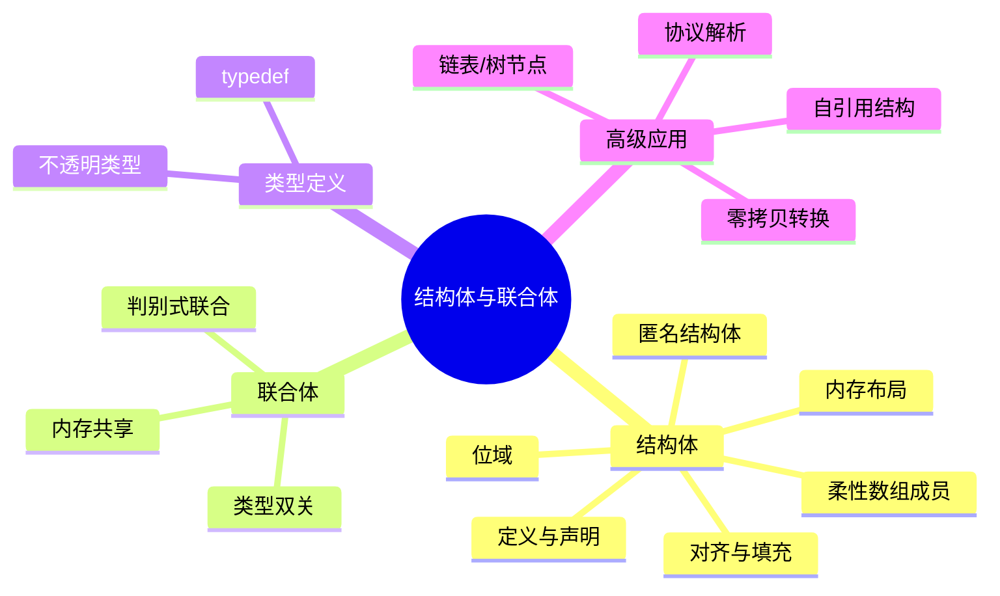

# C语言结构体与联合体深度解析

> **层级定位**: 01 Core Knowledge System / 03 Construction Layer
> **对应标准**: C89/C99/C11/C17/C23
> **难度级别**: L2 理解 → L4 分析
> **预估学习时间**: 4-6 小时

---

## 📋 本节概要

| 属性 | 内容 |
|:-----|:-----|
| **核心概念** | 结构体内存布局、对齐与填充、位域、联合体、柔性数组成员 |
| **前置知识** | [数据类型系统](../../01_Basic_Layer/02_Data_Type_System.md)、[指针](../../02_Core_Layer/01_Pointer_Depth.md)、[内存管理](../../02_Core_Layer/02_Memory_Management.md) |
| **后续延伸** | [内存布局优化](../../02_Core_Layer/02_Memory_Management.md#缓存优化)、[序列化](../../04_Standard_Library_Layer/02_Data_Structures/README.md)、[网络协议](../../03_System_Technology_Domains/11_Network_Programming/README.md) |
| **横向关联** | [类型双关](../../02_Core_Layer/08_Type_Punning.md)、[对齐不变式](../../../06_Thinking_Representation/05_Concept_Mappings/13_Global_Invariants.md#对齐不变式)、[层次桥接链](../../../06_Thinking_Representation/05_Concept_Mappings/09_Level_Bridging_Chains.md) |
| **权威来源** | K&R Ch6, CSAPP Ch3.9, Modern C Level 2, C11 6.7.2.1 |

---

## 🧠 知识结构思维导图



---

## 📖 核心概念详解

### 1. 结构体内存布局

#### 1.1 对齐规则

```c
#include <stddef.h>
#include <stdio.h>

struct Example {
    char a;      // 1字节，偏移0
    // 3字节填充（int对齐要求）
    int b;       // 4字节，偏移4
    char c;      // 1字节，偏移8
    // 3字节填充（结构体总大小为最大成员对齐的倍数）
};  // 总大小 = 12，不是 1+4+1=6

// 优化布局：按大小降序排列
struct Optimized {
    int b;       // 4字节
    char a;      // 1字节
    char c;      // 1字节
    // 2字节填充
};  // 总大小 = 8

// 紧凑布局（可能牺牲性能）
#pragma pack(push, 1)
struct Packed {
    char a;
    int b;
    char c;
};  // 总大小 = 6
#pragma pack(pop)

int main(void) {
    printf("sizeof(Example)   = %zu\n", sizeof(struct Example));    // 12
    printf("sizeof(Optimized) = %zu\n", sizeof(struct Optimimized)); // 8

    printf("offsetof(Example, a) = %zu\n", offsetof(struct Example, a)); // 0
    printf("offsetof(Example, b) = %zu\n", offsetof(struct Example, b)); // 4
    printf("offsetof(Example, c) = %zu\n", offsetof(struct Example, c)); // 8

    return 0;
}
```

#### 1.2 位域

```c
// 硬件寄存器映射
struct ControlRegister {
    unsigned int enable    : 1;   // bit 0
    unsigned int mode      : 3;   // bits 1-3
    unsigned int reserved  : 4;   // bits 4-7
    unsigned int status    : 8;   // bits 8-15
    unsigned int           : 16;  // 填充到32位
};

// 位域布局是实现定义的！
// 使用场景：
// 1. 硬件寄存器映射
// 2. 协议包头解析
// 3. 内存受限的密集存储

// C11匿名结构体/联合体内嵌
struct Packet {
    uint8_t header;
    union {
        struct {
            uint16_t src;
            uint16_t dst;
        };
        uint32_t raw;
    } addr;
};
```

### 2. 联合体应用

```c
#include <stdint.h>
#include <stdio.h>

// 类型双关（C99有效类型规则允许通过union）
typedef union {
    float f;
    uint32_t i;
    struct {
        uint32_t mantissa : 23;
        uint32_t exponent : 8;
        uint32_t sign     : 1;
    } bits;
} FloatBits;

void print_float_details(float f) {
    FloatBits fb = {.f = f};

    printf("Value: %f\n", fb.f);
    printf("Raw: 0x%08X\n", fb.i);
    printf("Sign: %u\n", fb.bits.sign);
    printf("Exponent: %u (0x%02X)\n", fb.bits.exponent, fb.bits.exponent);
    printf("Mantissa: %u (0x%06X)\n", fb.bits.mantissa, fb.bits.mantissa);
}

// 判别式联合体（Tagged Union）
typedef enum { TYPE_INT, TYPE_FLOAT, TYPE_STRING } ValueType;

typedef struct {
    ValueType type;
    union {
        int i;
        float f;
        const char *s;
    } data;
} Value;

void print_value(const Value *v) {
    switch (v->type) {
        case TYPE_INT:    printf("int: %d\n", v->data.i); break;
        case TYPE_FLOAT:  printf("float: %f\n", v->data.f); break;
        case TYPE_STRING: printf("string: %s\n", v->data.s); break;
    }
}
```

### 3. 柔性数组成员 (FAM)

```c
// C99 柔性数组成员
typedef struct {
    size_t len;
    char data[];  // 柔性数组，不占用结构体大小
} FlexibleString;

// 分配
FlexibleString *create_string(const char *src) {
    size_t len = strlen(src);
    // 分配结构体 + 数组空间
    FlexibleString *s = malloc(sizeof(FlexibleString) + len + 1);
    if (s) {
        s->len = len;
        memcpy(s->data, src, len + 1);
    }
    return s;
}

// 使用
void use_fam(void) {
    FlexibleString *s = create_string("Hello, World!");
    printf("len=%zu, data=%s\n", s->len, s->data);
    free(s);
}

// 对比：指针版本（需要两次分配）
typedef struct {
    size_t len;
    char *data;  // 需要单独分配
} PointerString;

PointerString *create_ptr_string(const char *src) {
    PointerString *s = malloc(sizeof(PointerString));
    s->len = strlen(src);
    s->data = malloc(s->len + 1);  // 第二次分配
    memcpy(s->data, src, s->len + 1);
    return s;
}
// 需要两次free，更容易出错
```

---

## 🔄 多维矩阵对比

### 结构体布局优化矩阵

| 布局 | 大小 | 访问速度 | 适用场景 |
|:-----|:----:|:--------:|:---------|
| 默认 | 较大 | 最快 | 通用 |
| 紧凑(pack 1) | 最小 | 较慢 | 网络协议、文件格式 |
| 排序优化 | 中等 | 快 | 大量结构体数组 |

---

## ⚠️ 常见陷阱

### 陷阱 STRUCT01: 对齐假设

```c
// ❌ 危险：假设无填充
struct Header {
    uint8_t type;
    uint32_t length;
};

void write_header(FILE *fp, struct Header *h) {
    fwrite(h, sizeof(*h), 1, fp);  // 包含填充字节！
}

// ✅ 正确：序列化时手动打包
void write_header_safe(FILE *fp, struct Header *h) {
    fwrite(&h->type, 1, 1, fp);
    fwrite(&h->length, 4, 1, fp);
}
```

---

## ✅ 质量验收清单

- [x] 包含对齐规则详解
- [x] 包含位域示例
- [x] 包含联合体类型双关
- [x] 包含FAM完整示例

---

> **更新记录**
>
> - 2025-03-09: 初版创建


---

## 深入理解

### 技术原理

深入探讨相关技术原理和实现细节。

### 实践指南

- 步骤1：理解基础概念
- 步骤2：掌握核心原理
- 步骤3：应用实践

### 相关资源

- 文档链接
- 代码示例
- 参考文章

---

> **最后更新**: 2026-03-21
> **维护者**: AI Code Review
