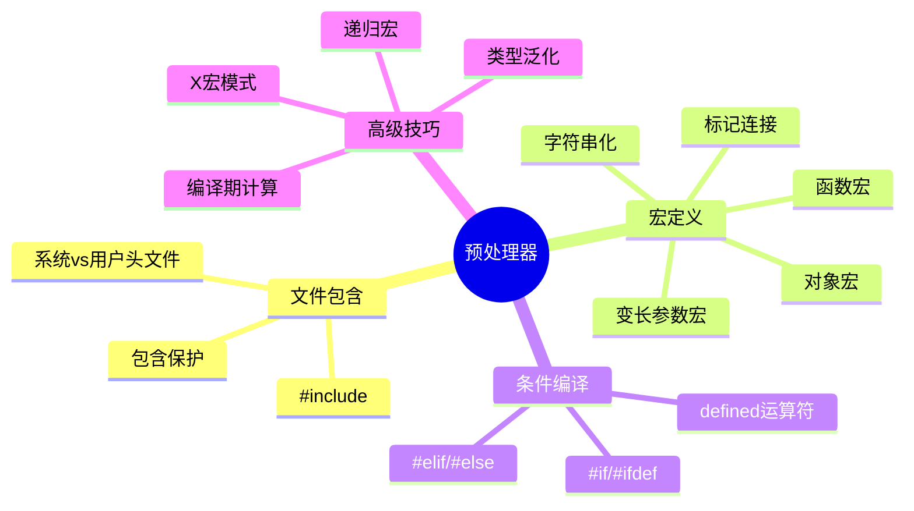

# C语言预处理器深度解析

> **层级定位**: 01 Core Knowledge System / 03 Construction Layer
> **对应标准**: C89/C99/C11/C17/C23
> **难度级别**: L2 理解 → L3 应用
> **预估学习时间**: 3-4 小时

---

## 📋 本节概要

| 属性 | 内容 |
|:-----|:-----|
| **核心概念** | 宏定义、条件编译、头文件保护、编译期计算、X宏技巧 |
| **前置知识** | 基本语法 |
| **后续延伸** | 代码生成、元编程、跨平台移植 |
| **权威来源** | K&R Ch4.11, Modern C Level 3, C11第6.10节 |

---

## 🧠 知识结构思维导图



---

## 📖 核心概念详解

### 1. 宏定义最佳实践

#### 1.1 安全宏定义

```c
// ❌ 危险宏
define SQUARE(x) x * x
SQUARE(5 + 1);  // 5 + 1 * 5 + 1 = 11

// ✅ 安全宏：括号保护
define SQUARE(x) ((x) * (x))

// ❌ 多语句宏陷阱
#define SWAP(a, b) int t = a; a = b; b = t;
if (x < y)
    SWAP(x, y);  // 只执行第一句
else
    ...

// ✅ 使用do-while(0)惯用法
define SWAP(a, b) do { \
    typeof(a) _t = (a); \
    (a) = (b); \
    (b) = _t; \
} while(0)

// ❌ 副作用问题
define MAX(a, b) ((a) > (b) ? (a) : (b))
int x = 5, y = 3;
int m = MAX(x++, y++);  // x++执行两次！

// ✅ 使用GCC扩展避免多次求值（非标准）
#ifdef __GNUC__
    #define MAX(a, b) ({ \
        typeof(a) _a = (a); \
        typeof(b) _b = (b); \
        _a > _b ? _a : _b; \
    })
#else
    // 标准版本：注意副作用
    #define MAX(a, b) ((a) > (b) ? (a) : (b))
#endif
```

#### 1.2 变长参数宏 (C99)

```c
// 调试日志宏
#ifdef DEBUG
    #define LOG(fmt, ...) fprintf(stderr, "[%s:%d] " fmt "\n", \
                                  __FILE__, __LINE__, ##__VA_ARGS__)
#else
    #define LOG(fmt, ...) ((void)0)
#endif

// ##__VA_ARGS__ 处理空参数情况
#define ERROR(msg, ...) printf("Error: " msg "\n", ##__VA_ARGS__)

// 使用
LOG("Value: %d, Name: %s", 42, "test");
ERROR("File not found");  // 无额外参数也OK

// 计数宏（用于自动参数计数）
define COUNT_ARGS(...) _COUNT_ARGS(__VA_ARGS__, 10, 9, 8, 7, 6, 5, 4, 3, 2, 1)
define _COUNT_ARGS(_1, _2, _3, _4, _5, _6, _7, _8, _9, _10, N, ...) N

// 自动选择重载（简化版）
define OVERLOAD(func, ...) CONCAT(func, COUNT_ARGS(__VA_ARGS__))(__VA_ARGS__)
define CONCAT(a, b) a ## b
```

### 2. 条件编译

```c
// 功能检测（现代做法）
#ifdef __has_feature
    #define HAS_FEATURE(x) __has_feature(x)
#else
    #define HAS_FEATURE(x) 0
#endif

#ifdef __has_include
    #define HAS_INCLUDE(x) __has_include(x)
#else
    #define HAS_INCLUDE(x) 0
#endif

// 编译器检测
#if defined(__GNUC__)
    #define COMPILER "GCC"
    #define COMPILER_VERSION (__GNUC__ * 100 + __GNUC_MINOR__)
#elif defined(__clang__)
    #define COMPILER "Clang"
#elif defined(_MSC_VER)
    #define COMPILER "MSVC"
#endif

// 平台抽象
#if defined(_WIN32)
    #define PLATFORM "Windows"
    #ifdef _WIN64
        #define PLATFORM_64BIT
    #endif
#elif defined(__linux__)
    #define PLATFORM "Linux"
#elif defined(__APPLE__)
    #define PLATFORM "macOS"
#endif

// C标准版本检测
#if __STDC_VERSION__ >= 202311L
    #define C23
#elif __STDC_VERSION__ >= 201710L
    #define C17
#elif __STDC_VERSION__ >= 201112L
    #define C11
#elif __STDC_VERSION__ >= 199901L
    #define C99
#else
    #define C89
#endif
```

### 3. X宏模式 (X-Macros)

```c
// 数据定义与使用的解耦

// 1. 定义颜色表（在colors.def中）
// COLOR(name, r, g, b)
COLOR(RED,    255, 0,   0  )
COLOR(GREEN,  0,   255, 0  )
COLOR(BLUE,   0,   0,   255)

// 2. 生成枚举
#define COLOR(name, r, g, b) COLOR_##name,
enum Color {
    #include "colors.def"
    COLOR_COUNT
};
#undef COLOR

// 3. 生成名称字符串
#define COLOR(name, r, g, b) #name,
const char *color_names[] = {
    #include "colors.def"
};
#undef COLOR

// 4. 生成RGB值数组
#define COLOR(name, r, g, b) {r, g, b},
const uint8_t color_values[][3] = {
    #include "colors.def"
};
#undef COLOR

// 使用
void print_color(enum Color c) {
    printf("%s: RGB(%d, %d, %d)\n",
           color_names[c],
           color_values[c][0],
           color_values[c][1],
           color_values[c][2]);
}
```

### 4. 头文件保护

```c
// 传统方式（C89+）
#ifndef FILENAME_H
#define FILENAME_H
// ... 内容
#endif  // FILENAME_H

// pragma once（非标准但广泛支持）
#pragma once
// ... 内容

// C23模块（未来方向）
#ifdef C23
export module mymodule;
// ...
#endif
```

---

## ⚠️ 常见陷阱

### 陷阱 PRE01: 宏展开陷阱

```c
#define FOO BAR
#define BAR 42
// FOO -> BAR -> 42

// 间接展开问题
define CAT(a, b) a ## b
define XCAT(a, b) CAT(a, b)
// XCAT(FOO, 1) -> CAT(FOO, 1) -> FOO1
// 需要两次扫描才能完全展开

// 使用 _Generic 替代复杂宏（C11）
#define ABS(x) _Generic((x), \
    int: abs, \
    long: labs, \
    long long: llabs, \
    double: fabs \
)(x)
```

---

## ✅ 质量验收清单

- [x] 包含安全宏定义规范
- [x] 包含变长参数宏
- [x] 包含X宏模式
- [x] 包含头文件保护

---

> **更新记录**
>
> - 2025-03-09: 初版创建
