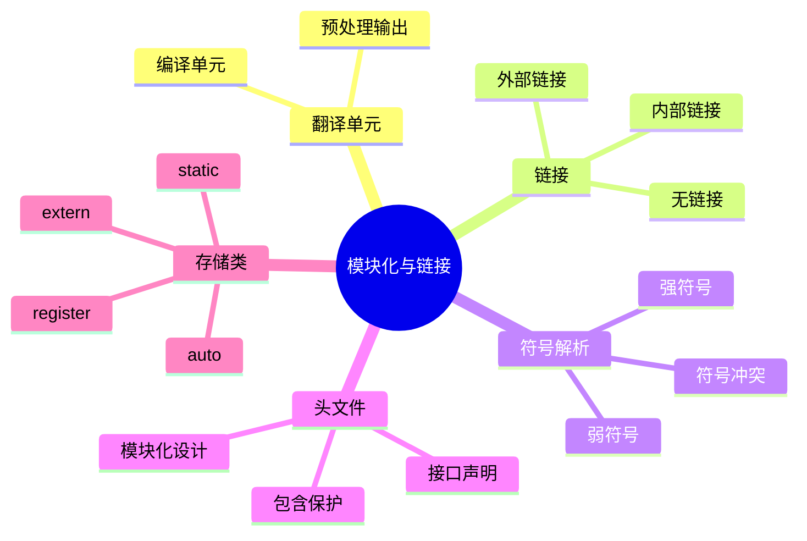

# C语言模块化与链接深度解析

> **层级定位**: 01 Core Knowledge System / 03 Construction Layer
> **对应标准**: C89/C99/C11/C17/C23
> **难度级别**: L3 应用 → L4 分析
> **预估学习时间**: 5-8 小时

---

## 📋 本节概要

| 属性 | 内容 |
|:-----|:-----|
| **核心概念** | 翻译单元、链接、符号、存储类、头文件设计 |
| **前置知识** | 预处理器、作用域、函数声明 |
| **后续延伸** | 动态链接、加载器、共享库 |
| **权威来源** | CSAPP Ch7, K&R Ch4.6, C11标准 6.2.2, 6.9 |

---

## 🧠 知识结构思维导图



---

## 📖 核心概念详解

### 1. 链接基础

#### 1.1 链接类型

```c
// 外部链接（可被其他翻译单元引用）
int global_var;           // 定义，外部链接
extern int other_var;     // 声明，外部链接
void global_func(void);   // 函数声明，外部链接

// 内部链接（仅当前翻译单元可见）
static int internal_var;  // 内部链接
static void internal_func(void) { }  // 内部链接

// 无链接（块作用域）
void func(void) {
    int local_var;        // 无链接
}
```

#### 1.2 符号冲突

```c
// 文件1.c
int shared = 10;  // 强符号

// 文件2.c
int shared = 20;  // ❌ 多重定义错误！

// 文件1.c
int shared = 10;  // 强符号

// 文件2.c
extern int shared;  // ✅ 正确：引用文件1的定义
```

### 2. 头文件设计

#### 2.1 头文件保护

```c
// math_utils.h
#ifndef MATH_UTILS_H
#define MATH_UTILS_H

// 接口声明
#ifdef __cplusplus
extern "C" {
#endif

// 常量
#define PI 3.14159265359
#define E  2.71828182846

// 类型
typedef struct {
    double real;
    double imag;
} Complex;

// 函数声明
Complex complex_add(Complex a, Complex b);
Complex complex_mul(Complex a, Complex b);

// 内联函数（C99）
static inline double square(double x) {
    return x * x;
}

#ifdef __cplusplus
}
#endif

#endif  // MATH_UTILS_H
```

#### 2.2 接口与实现分离

```c
// === 接口：list.h ===
#ifndef LIST_H
#define LIST_H

#include <stddef.h>
#include <stdbool.h>

typedef struct List List;
typedef struct ListNode ListNode;

// 构造函数
List *list_new(void);
void list_free(List *list);

// 操作
bool list_append(List *list, void *data);
bool list_prepend(List *list, void *data);
size_t list_length(const List *list);

// 迭代器
typedef struct {
    ListNode *current;
} ListIter;

ListIter list_iter_begin(const List *list);
void *list_iter_next(ListIter *iter);
bool list_iter_end(const ListIter *iter);

#endif

// === 实现：list.c ===
#include "list.h"
#include <stdlib.h>

struct ListNode {
    void *data;
    ListNode *next;
};

struct List {
    ListNode *head;
    ListNode *tail;
    size_t length;
};

List *list_new(void) {
    return calloc(1, sizeof(List));
}

void list_free(List *list) {
    if (!list) return;
    ListNode *current = list->head;
    while (current) {
        ListNode *next = current->next;
        free(current);
        current = next;
    }
    free(list);
}

bool list_append(List *list, void *data) {
    if (!list) return false;
    ListNode *node = malloc(sizeof(ListNode));
    if (!node) return false;
    node->data = data;
    node->next = NULL;

    if (list->tail) {
        list->tail->next = node;
    } else {
        list->head = node;
    }
    list->tail = node;
    list->length++;
    return true;
}

// ... 其他实现
```

### 3. 存储类说明符

```c
// extern：声明在其他地方定义
extern int global_counter;  // 只声明，不定义

// static：内部链接或存储期延长
static int file_scope_var;  // 内部链接
void func(void) {
    static int persistent = 0;  // 静态存储期，只初始化一次
    persistent++;
}

// auto：自动存储期（默认，可省略）
void func2(void) {
    auto int local = 5;  // 等价于 int local = 5;
}

// register：建议存储在寄存器（C11已废弃含义）
void func3(void) {
    register int i;  // 现代编译器忽略
    for (i = 0; i < 100; i++) { }
    // &i 不允许（无法取地址）
}

// _Thread_local：线程存储期（C11）
_Thread_local int thread_local_var;  // 每个线程独立
```

### 4. 编译模型

```
源文件 (.c) ──┐
              ├── 预处理 (cpp) ── 翻译单元 (.i)
              │
头文件 (.h) ──┘                              │
                                             │
                                    编译 (cc) ── 目标文件 (.o/.obj)
                                             │
库文件 (.a/.lib/.so) ────────────────────────┤
                                             │
                                    链接 (ld) ── 可执行文件
```

### 5. 多文件项目组织

```
project/
├── include/          # 公共头文件
│   ├── utils.h
│   └── mathlib.h
├── src/              # 源文件
│   ├── main.c
│   ├── utils.c
│   └── mathlib.c
├── tests/            # 测试代码
│   └── test_mathlib.c
├── build/            # 构建输出
├── Makefile
└── CMakeLists.txt
```

---

## ⚠️ 常见陷阱

### 陷阱 LINK01: 定义在头文件中

```c
// ❌ 错误：在头文件中定义变量
// config.h
int debug_level = 0;  // 每个包含此文件的.c都会有一个定义！

// ✅ 正确：头文件只声明，一个.c文件定义
// config.h
extern int debug_level;  // 声明

// config.c
int debug_level = 0;  // 定义（只有一个）
```

### 陷阱 LINK02: 内联函数定义

```c
// ❌ 链接错误：内联函数没有外部定义
// header.h
inline int max(int a, int b) {  // 无extern
    return a > b ? a : b;
}

// file1.c
#include "header.h"
// 使用max

// file2.c
#include "header.h"
// 使用max
// 链接错误：max没有外部定义

// ✅ C99解决方案：一个文件提供外部定义
// header.h
inline int max(int a, int b);

// utils.c
#include "header.h"
extern inline int max(int a, int b);  // 强制外部定义
```

---

## ✅ 质量验收清单

- [x] 链接类型详解
- [x] 头文件设计模式
- [x] 接口实现分离
- [x] 存储类说明
- [x] 项目组织示例

---

> **更新记录**
>
> - 2025-03-09: 初版创建
