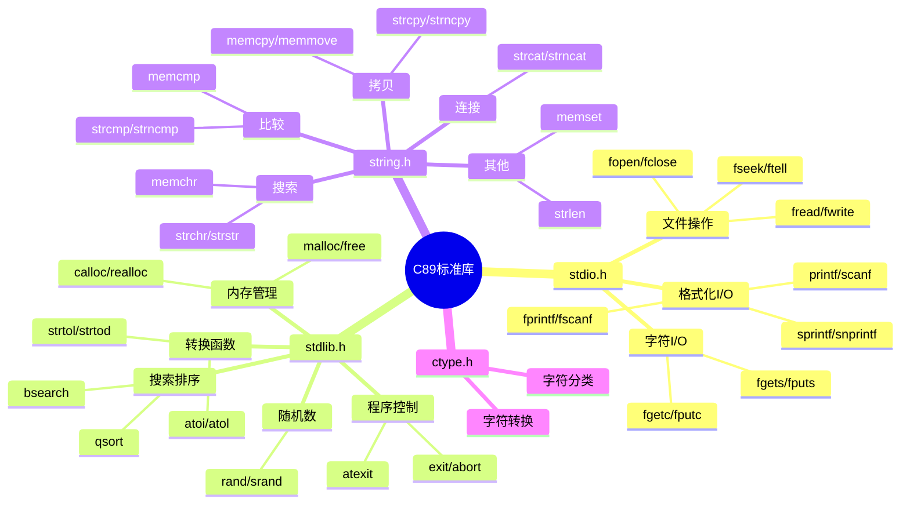

# C89标准库深度解析

> **层级定位**: 01 Core Knowledge System / 04 Standard Library Layer
> **对应标准**: C89/C99/C11/C17/C23
> **难度级别**: L2 理解 → L3 应用
> **预估学习时间**: 5-8 小时

---

## 🔗 文档关联

### 前置依赖

| 文档 | 关系类型 | 说明 |
|:-----|:---------|:-----|
| [指针深度](../02_Core_Layer/01_Pointer_Depth.md) | 核心基础 | 字符串指针、缓冲区操作 |
| [内存管理](../02_Core_Layer/02_Memory_Management.md) | 核心基础 | malloc/free原理 |
| [数组与指针](../02_Core_Layer/05_Arrays_Pointers.md) | 知识基础 | 缓冲区、字符串数组 |

### 版本演进

| 标准 | 文档 | 关键特性 |
|:-----|:-----|:---------|
| C89 | 本文档 | 基础库函数 |
| C99 | [C99标准库](02_C99_Library.md) | 复数、宽字符、定宽整数 |
| C11 | [C11标准库](03_C11_Library.md) | 线程、原子操作 |
| C17/C23 | [C17/C23库](04_C17_C23_Library.md) | 修复与新特性 |

### 后续延伸

| 文档 | 关系类型 | 说明 |
|:-----|:---------|:-----|
| [POSIX系统编程](../09_Safety_Standards/POSIX_1_2024/01_POSIX_System_Programming.md) | 系统扩展 | POSIX扩展接口 |
| [安全编码](../09_Safety_Standards/04_Secure_Coding_Guide.md) | 安全实践 | 安全函数使用 |

---

## 📋 本节概要

| 属性 | 内容 |
|:-----|:-----|
| **核心概念** | stdio、stdlib、string、ctype核心函数、安全使用模式 |
| **前置知识** | 指针、内存管理 |
| **后续延伸** | 系统调用、异步I/O、国际化 |
| **权威来源** | K&R Ch7, C11第7节, POSIX.1, Modern C Level 1-2 |

---

## 🧠 知识结构思维导图



---

## 📖 核心概念详解

### 1. 安全字符串操作

```c
// ❌ strcpy不安全：可能缓冲区溢出
char dest[10];
strcpy(dest, "this is a very long string");  // 溢出！

// ✅ strncpy的问题：不保证null终止
strncpy(dest, src, sizeof(dest));
dest[sizeof(dest) - 1] = '\0';  // 手动确保终止

// ✅ C11边界检查接口（可选支持）
#ifdef __STDC_LIB_EXT1__
    #define __STDC_WANT_LIB_EXT1__ 1
    #include <string.h>
    errno_t strcpy_s(char *dest, rsize_t destsz, const char *src);
#endif

// ✅ 最佳实践：自己实现安全版本
char *safe_strcpy(char *dest, size_t dest_size, const char *src) {
    if (!dest || !src || dest_size == 0) return NULL;

    size_t i;
    for (i = 0; i < dest_size - 1 && src[i]; i++) {
        dest[i] = src[i];
    }
    dest[i] = '\0';
    return dest;
}

// ✅ 更安全的动态分配版本
char *str_dup(const char *src) {
    if (!src) return NULL;
    size_t len = strlen(src) + 1;
    char *dest = malloc(len);
    if (dest) memcpy(dest, src, len);
    return dest;
}
```

### 2. 格式化I/O安全

```c
// ❌ 格式字符串漏洞
void log_message(const char *msg) {
    printf(msg);  // 如果msg包含%，崩溃或信息泄漏
}
// 攻击输入: "%s%s%s%s%s%s" 导致读取任意内存

// ✅ 修正
void log_message_safe(const char *msg) {
    printf("%s", msg);  // 固定格式
    // 或
    fputs(msg, stdout);
}

// ❌ sprintf缓冲区溢出
char buf[10];
int x = 1234567890;
sprintf(buf, "%d", x);  // "1234567890" = 10字符 + '\0' = 溢出！

// ✅ C99 snprintf（推荐）
int len = snprintf(buf, sizeof(buf), "%d", x);
if (len >= sizeof(buf)) {
    // 输出被截断，需要更大缓冲区
}

// ✅ 动态格式化：计算所需大小
int format_dynamic(int x) {
    int len = snprintf(NULL, 0, "%d", x);  // C99：获取所需大小
    char *buf = malloc(len + 1);
    if (!buf) return -1;
    sprintf(buf, "%d", x);
    // 使用buf...
    free(buf);
    return 0;
}
```

### 3. 文件操作安全

```c
// ✅ 安全文件读取模式
#include <stdio.h>
#include <stdlib.h>

// 读取整个文件到缓冲区
char *read_file(const char *filename, size_t *out_size) {
    FILE *fp = fopen(filename, "rb");
    if (!fp) return NULL;

    // 获取文件大小
    if (fseek(fp, 0, SEEK_END) != 0) goto error;
    long size = ftell(fp);
    if (size < 0) goto error;
    if (fseek(fp, 0, SEEK_SET) != 0) goto error;

    // 分配缓冲区（+1 for null terminator if text）
    char *buffer = malloc(size + 1);
    if (!buffer) goto error;

    // 读取
    size_t read = fread(buffer, 1, size, fp);
    if (read != (size_t)size) {
        free(buffer);
        goto error;
    }
    buffer[size] = '\0';

    fclose(fp);
    if (out_size) *out_size = size;
    return buffer;

error:
    fclose(fp);
    return NULL;
}

// ✅ 安全写入
typedef enum { FILE_OK, FILE_ERROR, FILE_TRUNCATED } FileResult;

FileResult write_file(const char *filename, const void *data, size_t size) {
    FILE *fp = fopen(filename, "wb");
    if (!fp) return FILE_ERROR;

    size_t written = fwrite(data, 1, size, fp);
    int flush_ok = (fflush(fp) == 0);
    int close_ok = (fclose(fp) == 0);

    if (written != size) return FILE_TRUNCATED;
    if (!flush_ok || !close_ok) return FILE_ERROR;
    return FILE_OK;
}
```

### 4. qsort与回调

```c
#include <stdlib.h>

// 比较函数原型：返回值 <0, =0, >0
int compare_int(const void *a, const void *b) {
    int ia = *(const int *)a;
    int ib = *(const int *)b;
    return (ia > ib) - (ia < ib);  // 避免溢出
}

int compare_int_desc(const void *a, const void *b) {
    return -compare_int(a, b);
}

// 结构体排序
typedef struct {
    const char *name;
    int score;
} Player;

int compare_player_by_score(const void *a, const void *b) {
    const Player *pa = a;
    const Player *pb = b;
    return compare_int(&pa->score, &pb->score);
}

// 使用
void sort_demo(void) {
    int arr[] = {3, 1, 4, 1, 5, 9, 2, 6};
    size_t n = sizeof(arr) / sizeof(arr[0]);

    qsort(arr, n, sizeof(int), compare_int);

    // C11 bsearch（要求已排序）
    int key = 5;
    int *found = bsearch(&key, arr, n, sizeof(int), compare_int);
}
```

---

## 🔄 多维矩阵对比

### 字符串函数安全矩阵

| 函数 | 安全级别 | 终止保证 | 推荐场景 |
|:-----|:--------:|:--------:|:---------|
| strcpy | 🔴 危险 | ❌ | 永不使用 |
| strncpy | 🟡 中等 | ❌ | 需手动补\0 |
| strcpy_s | 🟢 安全 | ✅ | C11边界检查 |
| memcpy | 🟢 安全 | N/A | 固定大小拷贝 |
| memmove | 🟢 安全 | N/A | 重叠区域 |
| snprintf | 🟢 安全 | ✅ | 格式化推荐 |
| strlen | 🟢 安全 | N/A | 需确保null终止 |
| strnlen | 🟢 安全 | N/A | 限制最大扫描 |

---

## ⚠️ 常见陷阱

### 陷阱 LIB01: gets缓冲区溢出

```c
// ❌ 绝对不要使用（已从C11移除）
char buf[100];
gets(buf);  // 无边界检查，已废弃

// ✅ 使用fgets
if (fgets(buf, sizeof(buf), stdin)) {
    // 移除换行符
    size_t len = strlen(buf);
    if (len > 0 && buf[len-1] == '\n') {
        buf[len-1] = '\0';
    }
}
```

### 陷阱 LIB02: scanf格式溢出

```c
// ❌ 无边界限制
char buf[10];
scanf("%s", buf);  // 可溢出

// ✅ 限制宽度
scanf("%9s", buf);  // 最多读取9字符+\0

// ✅ 使用动态分配（POSIX扩展）
char *buf;
scanf("%ms", &buf);  // m修饰符：自动malloc
free(buf);
```

---

## ✅ 质量验收清单

- [x] 包含安全字符串操作
- [x] 包含格式化I/O安全
- [x] 包含文件操作安全模式
- [x] 包含qsort使用示例

---

> **更新记录**
>
> - 2025-03-09: 初版创建


---

## 深入理解

### 技术原理深度剖析

#### 1. C89标准库的历史演进与设计理念

C89标准库（ANSI C 1989 / ISO C 1990）奠定了现代C语言标准库的基础架构。其设计理念源于1970年代C语言在UNIX系统中的实践经验，强调**简洁性、可移植性和效率**的平衡。

**历史演进时间线：**

```
1972-1978: K&R C (The C Programming Language第一版)
    ↓
1983-1989: ANSI X3J11委员会标准化过程
    ↓
1989: C89/ANSI C发布 (X3.159-1989)
    ↓
1990: ISO C90 (ISO/IEC 9899:1990) - 国际标准化
    ↓
1994: C94/C95 - 小幅修订（宽字符支持）
    ↓
1999: C99 - 重大更新
```

**核心设计哲学：**

| 设计原则 | 体现 | 影响 |
|:---------|:-----|:-----|
| 信任程序员 | 不强制边界检查 | 高效但需警惕溢出 |
| 最小接口 | 每个头文件职责单一 | 清晰但功能有限 |
| 硬件抽象 | FILE结构隐藏实现 | 可移植但难以优化 |
| 零开销抽象 | 宏内联替代函数调用 | 高效但调试困难 |

#### 2. stdio.h的底层实现机制

**FILE结构的内部实现（概念性）：**

```c
// 典型的FILE结构实现（glibc简化版）
struct __sFILE {
    unsigned char *_p;          // 当前位置指针
    int _r;                      // 缓冲区剩余可读字节
    unsigned char *_bf;          // 缓冲区基址
    int _lbfsize;               // 行缓冲大小阈值
    struct __sbuf _bf;          // 缓冲区信息
    void *_cookie;              // 回调函数上下文
    struct __sbuf _ub;          // 非缓冲读的保存区
    unsigned char *_up;         // 保存区当前位置
    int _ur;                     // 保存区剩余字节
    unsigned char _ubuf[3];     // 保证能放下EOF标记的最小缓冲
    unsigned char _nbuf[1];     // 保证能放下一字符的最小缓冲
    struct __sbuf _lb;          // 行缓冲的临时缓冲
    int _blksize;               // 块大小（用于stat）
    fpos_t _offset;             // 文件偏移量（用于seek）
};
```

**缓冲模式详解：**

```c
#include <stdio.h>
#include <unistd.h>  // for setvbuf

// 三种缓冲模式对比
void buffer_modes_explained(void) {
    FILE *fp = fopen("test.txt", "w");

    // 1. 全缓冲 (Fully Buffered)
    // - 默认用于文件操作
    // - 缓冲区满或fflush()时写入
    // - 最小化系统调用次数
    setvbuf(fp, NULL, _IOFBF, BUFSIZ);  // 通常8192字节

    // 2. 行缓冲 (Line Buffered)
    // - 默认用于stdout（终端）
    // - 遇到\n或缓冲区满时写入
    // - 适合交互式输出
    setvbuf(stdout, NULL, _IOLBF, 0);

    // 3. 无缓冲 (Unbuffered)
    // - 默认用于stderr
    // - 每个字符直接写入
    // - 适合错误输出
    setvbuf(stderr, NULL, _IONBF, 0);

    fclose(fp);
}
```

**stdio的零拷贝优化路径：**

```
用户缓冲区 → stdio缓冲区 → 内核页缓存 → 磁盘
     ↑           ↑            ↑
   memcpy    批量写入     DMA传输

优化策略：
- 大块写入(>=4KB)避免双缓冲
- mmap()绕过stdio直接访问页缓存
- 直接I/O(O_DIRECT)绕过页缓存
```

#### 3. malloc/free的内存管理原理

**堆内存布局（典型实现）：**

```
低地址
┌─────────────────────────────────────┐
│           程序代码段                │
├─────────────────────────────────────┤
│           初始化数据段              │
├─────────────────────────────────────┤
│           未初始化数据段(BSS)       │
├─────────────────────────────────────┤
│           堆 ↓ 向上增长              │  ← brk/sbrk管理
│                  ...                │
├─────────────────────────────────────┤
│           内存映射区                 │  ← mmap/munmap
│    (动态库、大内存分配、文件映射)      │
├─────────────────────────────────────┤
│                  ...                │
│           栈 ↑ 向下增长              │
├─────────────────────────────────────┤
│           内核空间                   │
└─────────────────────────────────────┘
高地址
```

**ptmalloc内存块结构（glibc）：**

```c
// malloc_chunk结构（简化）
struct malloc_chunk {
    size_t prev_size;      // 物理相邻的前一块大小（如果前一块空闲）
    size_t size;           // 当前块大小（3个标志位）
    struct malloc_chunk* fd;  // 前向指针（空闲时）
    struct malloc_chunk* bk;  // 后向指针（空闲时）
};

/* size标志位：
 * - PREV_INUSE (bit 0): 前一块是否在使用
 * - IS_MMAPPED (bit 1): 是否由mmap分配
 * - NON_MAIN_ARENA (bit 2): 是否非主arena
 */

// 内存对齐要求
#define MALLOC_ALIGNMENT (2 * sizeof(size_t))  // 通常是16字节
```

**内存碎片问题与缓解策略：**

```c
#include <stdlib.h>
#include <string.h>

// 演示内存碎片问题
void fragmentation_demo(void) {
    // 分配8个小块
    void *blocks[8];
    for (int i = 0; i < 8; i++) {
        blocks[i] = malloc(128);
    }

    // 释放偶数索引块（产生碎片）
    for (int i = 0; i < 8; i += 2) {
        free(blocks[i]);
    }

    // 此时尝试分配256字节 - 可能失败即使总空闲足够
    // 因为碎片化的128字节块无法满足256字节请求
    void *large = malloc(256);

    // 清理
    for (int i = 1; i < 8; i += 2) {
        free(blocks[i]);
    }
    free(large);
}

// 碎片缓解：内存池模式
#define POOL_SIZE 1024
#define BLOCK_SIZE 64
#define NUM_BLOCKS (POOL_SIZE / BLOCK_SIZE)

typedef struct {
    char memory[POOL_SIZE];
    char free_map[NUM_BLOCKS];  // 0=空闲, 1=已用
} MemoryPool;

void pool_init(MemoryPool *pool) {
    memset(pool->free_map, 0, NUM_BLOCKS);
}

void *pool_alloc(MemoryPool *pool) {
    for (int i = 0; i < NUM_BLOCKS; i++) {
        if (!pool->free_map[i]) {
            pool->free_map[i] = 1;
            return &pool->memory[i * BLOCK_SIZE];
        }
    }
    return NULL;  // 无可用块
}

void pool_free(MemoryPool *pool, void *ptr) {
    if (!ptr) return;
    size_t offset = (char*)ptr - pool->memory;
    int index = offset / BLOCK_SIZE;
    if (index >= 0 && index < NUM_BLOCKS) {
        pool->free_map[index] = 0;
    }
}
```

#### 4. 字符串操作函数的实现原理

**strlen的优化实现：**

```c
#include <stdint.h>
#include <limits.h>

// 朴素实现：逐字节检查
size_t strlen_naive(const char *s) {
    const char *p = s;
    while (*p) p++;
    return p - s;
}

// 优化实现：按字检查（64位系统）
size_t strlen_optimized(const char *s) {
    const char *p = s;

    // 对齐到8字节边界
    while ((uintptr_t)p & 7) {
        if (*p == '\0') return p - s;
        p++;
    }

    // 魔数：0x0101010101010101
    // 用于检测字节中的零
    const uint64_t magic = 0x0101010101010101ULL;
    const uint64_t high_bits = 0x8080808080808080ULL;

    // 每次检查8字节
    const uint64_t *w = (const uint64_t *)p;
    while (1) {
        uint64_t val = *w;
        // 检测val中是否有字节为0
        // 原理：val - magic会将0字节变为0xFF附近
        // 高位置1表示有零字节
        if ((val - magic) & ~val & high_bits) {
            break;
        }
        w++;
    }

    // 找到具体位置
    p = (const char *)w;
    while (*p) p++;
    return p - s;
}
```

**strcpy/strncpy的实现陷阱：**

```c
// glibc strncpy实现的关键问题
char *strncpy_problematic(char *dest, const char *src, size_t n) {
    size_t i;
    for (i = 0; i < n && src[i]; i++) {
        dest[i] = src[i];
    }
    // 如果src长度 < n，剩余空间用'\0'填充
    for (; i < n; i++) {
        dest[i] = '\0';  // 性能问题：不必要地写零
    }
    return dest;
}

// 安全替代：确保null终止但不填充
char *safe_strncpy(char *dest, const char *src, size_t n) {
    if (n == 0) return dest;

    size_t i;
    for (i = 0; i < n - 1 && src[i]; i++) {
        dest[i] = src[i];
    }
    dest[i] = '\0';
    return dest;
}
```

### 实践指南

#### 1. 标准库函数的最佳实践决策树

```
字符串操作决策：
┌─────────────────────────────────────────┐
│  需要复制字符串？                        │
└─────────────┬───────────────────────────┘
              │
      ┌───────┴───────┐
      ▼               ▼
  目标固定大小     动态大小
  缓冲区？         未知？
      │               │
      ▼               ▼
  使用strlcpy    使用strdup(C23)
  或memcpy       或自己实现
      │               │
      └───────┬───────┘
              ▼
     ┌─────────────────┐
     │ 需要连接字符串？ │
     └────────┬────────┘
              │
      ┌───────┴───────┐
      ▼               ▼
   已知总大小      动态大小
      │               │
      ▼               ▼
   手动跟踪       使用动态
   用memcpy       缓冲区增长

内存分配决策：
┌─────────────────────────────────────────┐
│  需要分配内存？                          │
└─────────────┬───────────────────────────┘
              │
      ┌───────┴───────┐
      ▼               ▼
   固定数量         可变数量
   已知元素         运行时确定
      │               │
      ▼               ▼
   使用calloc      使用malloc
   (清零)          (性能)
      │               │
      ▼               ▼
   需要扩展？      需要扩展？
      │               │
      ▼               ▼
   使用realloc    使用realloc
   但注意碎片     配合容量管理
```

#### 2. 高性能I/O模式

```c
#include <stdio.h>
#include <stdlib.h>
#include <string.h>

// 模式1：缓冲批量读取（适合处理大文件）
#define BUFFER_SIZE (64 * 1024)  // 64KB

typedef struct {
    char *data;
    size_t size;
    size_t capacity;
} StringBuilder;

StringBuilder *sb_new(void) {
    StringBuilder *sb = malloc(sizeof(StringBuilder));
    sb->capacity = 1024;
    sb->data = malloc(sb->capacity);
    sb->size = 0;
    return sb;
}

void sb_append(StringBuilder *sb, const char *s, size_t len) {
    if (sb->size + len > sb->capacity) {
        sb->capacity = (sb->size + len) * 2;
        sb->data = realloc(sb->data, sb->capacity);
    }
    memcpy(sb->data + sb->size, s, len);
    sb->size += len;
}

char *sb_get(StringBuilder *sb) {
    sb->data[sb->size] = '\0';
    return sb->data;
}

void sb_free(StringBuilder *sb) {
    free(sb->data);
    free(sb);
}

// 高效读取整个文件
char *read_file_efficient(const char *filename, size_t *out_size) {
    FILE *fp = fopen(filename, "rb");
    if (!fp) return NULL;

    StringBuilder *sb = sb_new();
    char buffer[BUFFER_SIZE];

    size_t bytes;
    while ((bytes = fread(buffer, 1, BUFFER_SIZE, fp)) > 0) {
        sb_append(sb, buffer, bytes);
    }

    fclose(fp);

    char *result = sb_get(sb);
    if (out_size) *out_size = sb->size;

    // 只释放StringBuilder结构，返回数据
    free(sb);
    return result;
}

// 模式2：行读取优化
#include <ctype.h>

// 安全高效的行读取（自动增长缓冲区）
char *read_line_dynamic(FILE *fp) {
    size_t capacity = 128;
    char *line = malloc(capacity);
    size_t len = 0;
    int c;

    while ((c = fgetc(fp)) != EOF && c != '\n') {
        if (len + 1 >= capacity) {
            capacity *= 2;
            line = realloc(line, capacity);
        }
        line[len++] = c;
    }

    if (len == 0 && c == EOF) {
        free(line);
        return NULL;
    }

    line[len] = '\0';
    // 收缩到实际大小
    return realloc(line, len + 1);
}
```

#### 3. 安全编程检查清单

```c
// ✅ 安全的字符串处理模板

// 1. 输入验证
bool validate_input(const char *input, size_t max_len) {
    if (!input) return false;
    // 使用strnlen防止无界读取
    return strnlen(input, max_len + 1) <= max_len;
}

// 2. 安全复制（总是null终止）
bool safe_copy(char *dest, size_t dest_size, const char *src) {
    if (!dest || !src || dest_size == 0) return false;

    // 使用strlcpy或手动实现
    size_t i;
    for (i = 0; i < dest_size - 1 && src[i]; i++) {
        dest[i] = src[i];
    }
    dest[i] = '\0';

    // 返回是否发生截断
    return src[i] == '\0';
}

// 3. 格式化输出安全检查
int safe_printf(const char *format, ...) {
    // 验证格式字符串不包含用户输入
    // 实际项目中需要更严格的检查
    va_list args;
    va_start(args, format);
    int result = vprintf(format, args);
    va_end(args);
    return result;
}

// 4. 文件路径安全检查
bool is_path_safe(const char *path) {
    if (!path) return false;

    // 检查路径遍历
    if (strstr(path, "..")) return false;

    // 检查空字节注入（如果有长度限制）
    if (strchr(path, '\0') != path + strlen(path)) return false;

    return true;
}
```

### 层次关联与映射分析

#### C89标准库在知识体系中的位置

```
C语言知识层次
┌─────────────────────────────────────────────────────────┐
│  应用层 (Application Layer)                              │
│  - 网络编程、数据库操作、GUI开发                          │
├─────────────────────────────────────────────────────────┤
│  系统层 (System Layer)                                   │
│  - POSIX API、系统调用、进程管理                          │
├─────────────────────────────────────────────────────────┤
│  ★ 标准库层 (Standard Library Layer) ★                   │
│  ┌─────────────────────────────────────────────────┐    │
│  │ stdio.h  - 文件与I/O操作                          │    │
│  │ stdlib.h - 内存管理、程序控制、转换               │    │
│  │ string.h - 字符串与内存操作                       │    │
│  │ ctype.h  - 字符分类与转换                         │    │
│  └─────────────────────────────────────────────────┘    │
├─────────────────────────────────────────────────────────┤
│  核心层 (Core Layer)                                     │
│  - 指针、内存模型、类型系统、控制结构                     │
├─────────────────────────────────────────────────────────┤
│  基础层 (Basic Layer)                                    │
│  - 语法、关键字、运算符、预处理                          │
└─────────────────────────────────────────────────────────┘
```

#### 与其他模块的关联映射

| 本模块概念 | 关联模块 | 关联方式 | 实践意义 |
|:-----------|:---------|:---------|:---------|
| FILE* | POSIX I/O | 底层实现 | 理解缓冲机制 |
| malloc/free | 内存管理 | 理论支撑 | 避免内存泄漏 |
| 字符串函数 | 指针操作 | 基础依赖 | 安全使用前提 |
| qsort | 算法基础 | 回调应用 | 泛型编程思想 |
| 格式化I/O | 类型系统 | 类型安全 | 防止格式漏洞 |

### 决策矩阵与对比分析

#### 字符串函数选择决策矩阵

| 场景 | 推荐函数 | 安全级别 | 性能 | 注意事项 |
|:-----|:---------|:--------:|:----:|:---------|
| 固定大小缓冲区复制 | memcpy | 🟢 高 | ⭐⭐⭐ | 需确保不越界 |
| 可能重叠区域复制 | memmove | 🟢 高 | ⭐⭐ | 处理重叠 |
| 字符串复制（安全） | strlcpy(C23) | 🟢 高 | ⭐⭐ | 需检查截断 |
| 字符串复制（传统） | strncpy | 🟡 中 | ⭐⭐ | 需手动补\0 |
| 动态字符串复制 | strdup(C23) | 🟢 高 | ⭐⭐ | 记得free |
| 格式化到缓冲区 | snprintf | 🟢 高 | ⭐⭐ | 检查返回值 |
| 字符串比较 | strcmp | 🟢 高 | ⭐⭐⭐ | 注意返回值符号 |
| 长度受限比较 | strncmp | 🟢 高 | ⭐⭐⭐ | 适合前缀匹配 |
| 内存比较 | memcmp | 🟢 高 | ⭐⭐⭐ | 不依赖null终止 |

#### 内存分配策略对比

| 分配方式 | 适用场景 | 优点 | 缺点 | 碎片风险 |
|:---------|:---------|:-----|:-----|:--------:|
| malloc | 通用分配 | 灵活 | 需配对free | 中 |
| calloc | 数组分配 | 自动清零 | 稍慢 | 中 |
| realloc | 动态增长 | 保留数据 | 可能复制 | 高 |
| alloca | 小临时变量 | 自动释放 | 栈溢出风险 | 无 |
| 内存池 | 固定大小对象 | 无碎片 | 预分配开销 | 低 |
| mmap | 大内存分配 | 可返回给OS | 页对齐开销 | 低 |

### 相关资源

#### 官方文档与标准

- **ISO/IEC 9899:1990** - C90/C89官方标准文档
- **ISO/IEC 9899:1999** - C99标准（包含C89内容更新）
- **The C Programming Language (K&R)** - 第2版附录B标准库参考
- **C99 Rationale** - 标准设计原理说明

#### 开源实现参考

- **glibc** (<https://www.gnu.org/software/libc/>) - Linux标准库实现
- **musl** (<https://musl.libc.org/>) - 轻量级标准库实现
- **newlib** (<https://sourceware.org/newlib/>) - 嵌入式系统常用
- **dietlibc** - 精简标准库实现

#### 深入学习资料

| 资源 | 类型 | 难度 | 重点内容 |
|:-----|:-----|:----:|:---------|
| *Expert C Programming* | 书籍 | L3 | 深入C语言深层机制 |
| *The Standard C Library* | 书籍 | L3 | 标准库完整实现讲解 |
| glibc源码 (malloc) | 源码 | L4 | 内存管理实现细节 |
| musl源码 (stdio) | 源码 | L3 | 简洁的I/O实现 |
| CppReference C部分 | 在线文档 | L2 | 标准库函数参考 |

#### 相关代码示例

- `examples/standard_library/safe_strings/` - 安全字符串操作示例
- `examples/standard_library/efficient_io/` - 高效I/O模式示例
- `examples/memory_management/custom_allocator/` - 自定义内存分配器

---

> **最后更新**: 2026-03-28
> **维护者**: AI Code Review
