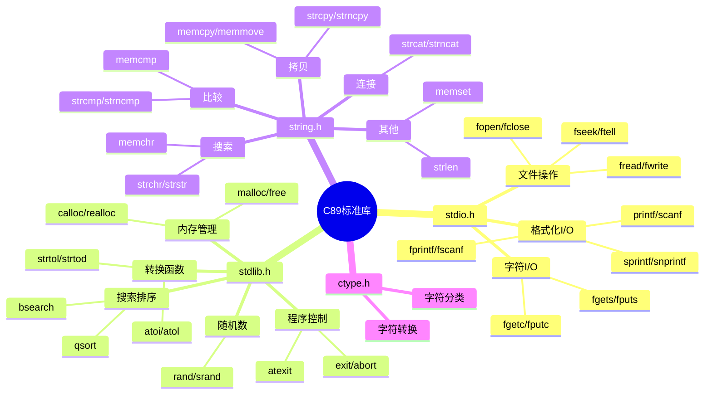

# C89标准库深度解析

> **层级定位**: 01 Core Knowledge System / 04 Standard Library Layer
> **对应标准**: C89/C99/C11/C17/C23
> **难度级别**: L2 理解 → L3 应用
> **预估学习时间**: 5-8 小时

---

## 📋 本节概要

| 属性 | 内容 |
|:-----|:-----|
| **核心概念** | stdio、stdlib、string、ctype核心函数、安全使用模式 |
| **前置知识** | 指针、内存管理 |
| **后续延伸** | 系统调用、异步I/O、国际化 |
| **权威来源** | K&R Ch7, C11第7节, POSIX.1, Modern C Level 1-2 |

---

## 🧠 知识结构思维导图



---

## 📖 核心概念详解

### 1. 安全字符串操作

```c
// ❌ strcpy不安全：可能缓冲区溢出
char dest[10];
strcpy(dest, "this is a very long string");  // 溢出！

// ✅ strncpy的问题：不保证null终止
strncpy(dest, src, sizeof(dest));
dest[sizeof(dest) - 1] = '\0';  // 手动确保终止

// ✅ C11边界检查接口（可选支持）
#ifdef __STDC_LIB_EXT1__
    #define __STDC_WANT_LIB_EXT1__ 1
    #include <string.h>
    errno_t strcpy_s(char *dest, rsize_t destsz, const char *src);
#endif

// ✅ 最佳实践：自己实现安全版本
char *safe_strcpy(char *dest, size_t dest_size, const char *src) {
    if (!dest || !src || dest_size == 0) return NULL;

    size_t i;
    for (i = 0; i < dest_size - 1 && src[i]; i++) {
        dest[i] = src[i];
    }
    dest[i] = '\0';
    return dest;
}

// ✅ 更安全的动态分配版本
char *str_dup(const char *src) {
    if (!src) return NULL;
    size_t len = strlen(src) + 1;
    char *dest = malloc(len);
    if (dest) memcpy(dest, src, len);
    return dest;
}
```

### 2. 格式化I/O安全

```c
// ❌ 格式字符串漏洞
void log_message(const char *msg) {
    printf(msg);  // 如果msg包含%，崩溃或信息泄漏
}
// 攻击输入: "%s%s%s%s%s%s" 导致读取任意内存

// ✅ 修正
void log_message_safe(const char *msg) {
    printf("%s", msg);  // 固定格式
    // 或
    fputs(msg, stdout);
}

// ❌ sprintf缓冲区溢出
char buf[10];
int x = 1234567890;
sprintf(buf, "%d", x);  // "1234567890" = 10字符 + '\0' = 溢出！

// ✅ C99 snprintf（推荐）
int len = snprintf(buf, sizeof(buf), "%d", x);
if (len >= sizeof(buf)) {
    // 输出被截断，需要更大缓冲区
}

// ✅ 动态格式化：计算所需大小
int format_dynamic(int x) {
    int len = snprintf(NULL, 0, "%d", x);  // C99：获取所需大小
    char *buf = malloc(len + 1);
    if (!buf) return -1;
    sprintf(buf, "%d", x);
    // 使用buf...
    free(buf);
    return 0;
}
```

### 3. 文件操作安全

```c
// ✅ 安全文件读取模式
#include <stdio.h>
#include <stdlib.h>

// 读取整个文件到缓冲区
char *read_file(const char *filename, size_t *out_size) {
    FILE *fp = fopen(filename, "rb");
    if (!fp) return NULL;

    // 获取文件大小
    if (fseek(fp, 0, SEEK_END) != 0) goto error;
    long size = ftell(fp);
    if (size < 0) goto error;
    if (fseek(fp, 0, SEEK_SET) != 0) goto error;

    // 分配缓冲区（+1 for null terminator if text）
    char *buffer = malloc(size + 1);
    if (!buffer) goto error;

    // 读取
    size_t read = fread(buffer, 1, size, fp);
    if (read != (size_t)size) {
        free(buffer);
        goto error;
    }
    buffer[size] = '\0';

    fclose(fp);
    if (out_size) *out_size = size;
    return buffer;

error:
    fclose(fp);
    return NULL;
}

// ✅ 安全写入
typedef enum { FILE_OK, FILE_ERROR, FILE_TRUNCATED } FileResult;

FileResult write_file(const char *filename, const void *data, size_t size) {
    FILE *fp = fopen(filename, "wb");
    if (!fp) return FILE_ERROR;

    size_t written = fwrite(data, 1, size, fp);
    int flush_ok = (fflush(fp) == 0);
    int close_ok = (fclose(fp) == 0);

    if (written != size) return FILE_TRUNCATED;
    if (!flush_ok || !close_ok) return FILE_ERROR;
    return FILE_OK;
}
```

### 4. qsort与回调

```c
#include <stdlib.h>

// 比较函数原型：返回值 <0, =0, >0
int compare_int(const void *a, const void *b) {
    int ia = *(const int *)a;
    int ib = *(const int *)b;
    return (ia > ib) - (ia < ib);  // 避免溢出
}

int compare_int_desc(const void *a, const void *b) {
    return -compare_int(a, b);
}

// 结构体排序
typedef struct {
    const char *name;
    int score;
} Player;

int compare_player_by_score(const void *a, const void *b) {
    const Player *pa = a;
    const Player *pb = b;
    return compare_int(&pa->score, &pb->score);
}

// 使用
void sort_demo(void) {
    int arr[] = {3, 1, 4, 1, 5, 9, 2, 6};
    size_t n = sizeof(arr) / sizeof(arr[0]);

    qsort(arr, n, sizeof(int), compare_int);

    // C11 bsearch（要求已排序）
    int key = 5;
    int *found = bsearch(&key, arr, n, sizeof(int), compare_int);
}
```

---

## 🔄 多维矩阵对比

### 字符串函数安全矩阵

| 函数 | 安全级别 | 终止保证 | 推荐场景 |
|:-----|:--------:|:--------:|:---------|
| strcpy | 🔴 危险 | ❌ | 永不使用 |
| strncpy | 🟡 中等 | ❌ | 需手动补\0 |
| strcpy_s | 🟢 安全 | ✅ | C11边界检查 |
| memcpy | 🟢 安全 | N/A | 固定大小拷贝 |
| memmove | 🟢 安全 | N/A | 重叠区域 |
| snprintf | 🟢 安全 | ✅ | 格式化推荐 |
| strlen | 🟢 安全 | N/A | 需确保null终止 |
| strnlen | 🟢 安全 | N/A | 限制最大扫描 |

---

## ⚠️ 常见陷阱

### 陷阱 LIB01: gets缓冲区溢出

```c
// ❌ 绝对不要使用（已从C11移除）
char buf[100];
gets(buf);  // 无边界检查，已废弃

// ✅ 使用fgets
if (fgets(buf, sizeof(buf), stdin)) {
    // 移除换行符
    size_t len = strlen(buf);
    if (len > 0 && buf[len-1] == '\n') {
        buf[len-1] = '\0';
    }
}
```

### 陷阱 LIB02: scanf格式溢出

```c
// ❌ 无边界限制
char buf[10];
scanf("%s", buf);  // 可溢出

// ✅ 限制宽度
scanf("%9s", buf);  // 最多读取9字符+\0

// ✅ 使用动态分配（POSIX扩展）
char *buf;
scanf("%ms", &buf);  // m修饰符：自动malloc
free(buf);
```

---

## ✅ 质量验收清单

- [x] 包含安全字符串操作
- [x] 包含格式化I/O安全
- [x] 包含文件操作安全模式
- [x] 包含qsort使用示例

---

> **更新记录**
>
> - 2025-03-09: 初版创建
