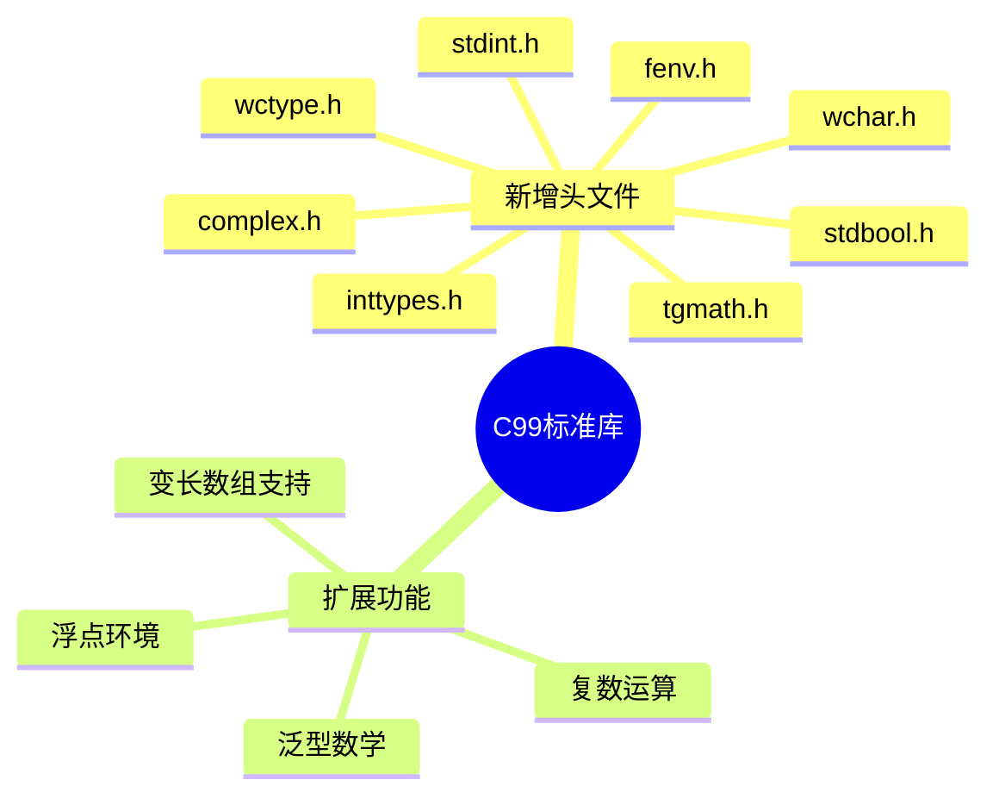

# C99标准库扩展深度解析

> **层级定位**: 01 Core Knowledge System / 04 Standard Library Layer
> **对应标准**: C99
> **难度级别**: L2 理解 → L3 应用
> **预估学习时间**: 3-5 小时

---

## 🔗 文档关联

### 前置依赖

| 文档 | 关系类型 | 说明 |
|:-----|:---------|:-----|
| [C89标准库](01_C89_Library.md) | 版本基础 | C89是基础 |
| [数据类型系统](../01_Basic_Layer/02_Data_Type_System.md) | 知识基础 | 新类型系统支持 |
| [浮点运算](../01_Basic_Layer/IEEE_754_Floating_Point/01_IEEE_754_Basics.md) | 知识基础 | fenv.h、复数运算 |

### 后续延伸

| 文档 | 关系类型 | 说明 |
|:-----|:---------|:-----|
| [C11标准库](03_C11_Library.md) | 版本演进 | 线程与并发支持 |
| [C17/C23库](04_C17_C23_Library.md) | 版本演进 | 现代C特性 |
| [国际化](../11_Internationalization/readme.md) | 功能应用 | 宽字符、本地化 |

### 关键新增

| 头文件 | 核心功能 | 关联概念 |
|:-------|:---------|:---------|
| stdbool.h | 布尔类型 | 逻辑运算 |
| stdint.h | 定宽整数 | 跨平台开发 |
| complex.h | 复数运算 | 科学计算 |
| tgmath.h | 泛型数学 | 宏与类型 |

---

## 📋 本节概要

| 属性 | 内容 |
|:-----|:-----|
| **核心概念** | C99新增头文件、复数运算、宽字符、定宽整数 |
| **前置知识** | C89标准库 |
| **后续延伸** | C11多线程、复杂数学 |
| **权威来源** | C99标准, Modern C |

---

## 🧠 知识结构思维导图



---

## 📖 核心概念详解

### 1. 定宽整数 (<stdint.h>)

```c
#include <stdint.h>

// 有符号整数
int8_t   i8;    // 8位
int16_t  i16;   // 16位
int32_t  i32;   // 32位
int64_t  i64;   // 64位

// 无符号整数
uint8_t  u8;    // 8位
uint16_t u16;   // 16位
uint32_t u32;   // 32位
uint64_t u64;   // 64位

// 指针大小整数
intptr_t  iptr;  // 可存储指针的有符号整数
uintptr_t uptr;  // 可存储指针的无符号整数

// 最大宽度
intmax_t  imax;
uintmax_t umax;

// 使用场景
struct Packet {
    uint32_t magic;     // 固定4字节
    uint16_t version;   // 固定2字节
    uint16_t flags;     // 固定2字节
    uint64_t timestamp; // 固定8字节
};  // 16字节，跨平台一致
```

### 2. 复数运算 (<complex.h>)

```c
#include <complex.h>
#include <math.h>

// 定义复数
double complex z1 = 1.0 + 2.0*I;  // 1 + 2i
double complex z2 = 3.0 - 4.0*I;  // 3 - 4i

// 基本运算
double complex sum = z1 + z2;
double complex diff = z1 - z2;
double complex prod = z1 * z2;
double complex quot = z1 / z2;

// 复数函数
double real_part = creal(z1);      // 实部
double imag_part = cimag(z1);      // 虚部
double magnitude = cabs(z1);       // 模 |z|
double complex conj_z = conj(z1);  // 共轭

double complex exp_z = cexp(z1);   // e^z
double complex log_z = clog(z1);   // ln(z)
double complex sqrt_z = csqrt(z1); // √z

// 欧拉公式: e^(iπ) = -1
double complex e_i_pi = cexp(I * M_PI);
printf("e^(iπ) = %.1f + %.1fi\n", creal(e_i_pi), cimag(e_i_pi));
```

### 3. 布尔类型 (<stdbool.h>)

```c
#include <stdbool.h>

// C99引入bool类型
bool flag = true;   // 或 false

// 底层实现
typedef _Bool bool;
#define true 1
#define false 0

// 使用示例
bool is_prime(int n) {
    if (n < 2) return false;
    for (int i = 2; i * i <= n; i++) {
        if (n % i == 0) return false;
    }
    return true;
}
```

### 4. 泛型数学 (<tgmath.h>)

```c
#include <tgmath.h>

// 根据参数类型自动选择函数
float f = 3.14f;
double d = 3.14;
long double ld = 3.14L;

float f_sqrt = sqrt(f);           // 调用 sqrtf
double d_sqrt = sqrt(d);          // 调用 sqrt
long double ld_sqrt = sqrt(ld);   // 调用 sqrtl

// 复数也适用
double complex z = 1.0 + 2.0*I;
double complex z_sqrt = sqrt(z);  // 调用 csqrt
```

### 5. 格式化宏 (<inttypes.h>)

```c
#include <inttypes.h>
#include <stdio.h>

uint32_t u32 = 42;
int64_t i64 = -123456789012LL;

// 可移植的printf格式
printf("uint32: %" PRIu32 "\n", u32);
printf("int64:  %" PRId64 "\n", i64);
printf("hex64:  %" PRIx64 "\n", i64);

// scanf格式
scanf("%" SCNd64, &i64);

// 完整示例
printf("Value: %10" PRIu32 " (0x%08" PRIx32 ")\n", u32, u32);
```

### 6. 宽字符支持 (<wchar.h>, <wctype.h>)

```c
#include <wchar.h>
#include <locale.h>

// 设置本地化
setlocale(LC_ALL, "");

// 宽字符操作
wchar_t wstr[] = L"Hello 世界";
size_t len = wcslen(wstr);       // 宽字符串长度
wchar_t wcopy[100];
wcscpy(wcopy, wstr);             // 宽字符串拷贝

// 格式化宽字符
wchar_t buffer[256];
swprintf(buffer, 256, L"Value: %d", 42);

// 多字节与宽字符转换
char mbs[256];
int n = wcstombs(mbs, wstr, sizeof(mbs));
```

---

## ⚠️ 常见陷阱

### 陷阱 C99-01: VLA使用限制

```c
// ❌ VLA不能用于结构体
struct Bad {
    int n;
    int arr[n];  // 错误！
};

// ✅ VLA只能用于局部数组
void func(int n) {
    int vla[n];  // OK
}

// ❌ VLA生命周期问题（避免过大）
void risky(int n) {
    int huge[n];  // 栈溢出风险！
}
```

### 陷阱 C99-02: 复数性能

```c
// 注意：复数运算可能较慢
double complex z = ...;
double r = cabs(z);  // 涉及sqrt运算

// 如果只是比较大小，比较平方避免sqrt
if (creal(z)*creal(z) + cimag(z)*cimag(z) > threshold*threshold) {
    // 比 cabs(z) > threshold 更快
}
```

---

## ✅ 质量验收清单

- [x] 定宽整数使用
- [x] 复数运算
- [x] 布尔类型
- [x] 泛型数学
- [x] 格式化宏
- [x] 宽字符支持

---

> **更新记录**
>
> - 2025-03-09: 初版创建


---

## 深入理解

### 技术原理深度剖析

#### 1. C99标准的设计背景与革新

C99（ISO/IEC 9899:1999）是对C89的重大修订，回应了1989年以来计算领域的发展需求。其设计目标包括：**支持科学计算、嵌入式系统开发、国际化应用**，以及**改进类型安全性**。

**C99演进的核心驱动力：**

| 驱动因素 | 具体需求 | C99解决方案 |
|:---------|:---------|:------------|
| 科学计算 | 复数运算、浮点精度控制 | `<complex.h>`, `<fenv.h>` |
| 嵌入式系统 | 定宽整数、内存布局控制 | `<stdint.h>`, `<stdbool.h>` |
| 国际化 | 宽字符、UTF支持 | `<wchar.h>`, `<wctype.h>` |
| 代码安全 | 变长数组、内联函数 | VLA, `inline` |
| 性能优化 | 编译器优化提示、泛型数学 | `restrict`, `<tgmath.h>` |

**标准修订时间线：**

```
1994: C94/C95 - 小幅修订（增补1：宽字符支持）
    ↓
1995-1999: C99标准化进程
    ├─ N843 (1998): 委员会草案
    ├─ N869 (1999): 最终委员会草案
    └─ ISO/IEC 9899:1999: 正式发布
    ↓
2001: TC1 (技术勘误1)
2004: TC2 (技术勘误2)
    ↓
2011: C11发布
```

#### 2. 定宽整数的实现原理与位运算优化

**stdint.h的实现机制：**

```c
// 典型的stdint.h实现（基于条件编译）

// 检测编译器和平台
#if defined(__GNUC__)
    #if defined(__i386__)
        typedef signed char        int8_t;
        typedef short              int16_t;
        typedef int                int32_t;
        typedef long long          int64_t;
        typedef unsigned char      uint8_t;
        typedef unsigned short     uint16_t;
        typedef unsigned int       uint32_t;
        typedef unsigned long long uint64_t;
    #elif defined(__x86_64__)
        // 64位平台：long是64位
        typedef signed char        int8_t;
        typedef short              int16_t;
        typedef int                int32_t;
        typedef long               int64_t;
        typedef unsigned char      uint8_t;
        typedef unsigned short     uint16_t;
        typedef unsigned int       uint32_t;
        typedef unsigned long      uint64_t;
    #endif
#endif

// intptr_t和uintptr_t的关键作用
// 保证可以存储指针的整数类型
#if defined(__x86_64__)
    typedef long          intptr_t;   // 64位
    typedef unsigned long uintptr_t;
#else
    typedef int           intptr_t;   // 32位
    typedef unsigned int  uintptr_t;
#endif
```

**位操作优化模式：**

```c
#include <stdint.h>
#include <stdbool.h>

// 优化1：使用uint8_t进行字节级操作
void process_bytes(const uint8_t *data, size_t len) {
    // 保证每元素8位，无符号保证环绕行为
    for (size_t i = 0; i < len; i++) {
        uint8_t byte = data[i];
        // 处理每个字节...
    }
}

// 优化2：使用uint32_t/uint64_t进行字级并行处理
uint32_t count_bits_parallel(uint64_t x) {
    // 并行计算1的位数（分治）
    x = (x & 0x5555555555555555ULL) + ((x >> 1) & 0x5555555555555555ULL);
    x = (x & 0x3333333333333333ULL) + ((x >> 2) & 0x3333333333333333ULL);
    x = (x & 0x0F0F0F0F0F0F0F0FULL) + ((x >> 4) & 0x0F0F0F0F0F0F0F0FULL);
    x = (x & 0x00FF00FF00FF00FFULL) + ((x >> 8) & 0x00FF00FF00FF00FFULL);
    x = (x & 0x0000FFFF0000FFFFULL) + ((x >> 16) & 0x0000FFFF0000FFFFULL);
    x = (x & 0x00000000FFFFFFFFULL) + ((x >> 32) & 0x00000000FFFFFFFFULL);
    return (uint32_t)x;
}

// 优化3：使用uintptr_t进行指针运算
bool is_aligned(const void *ptr, size_t alignment) {
    // 安全地将指针转为整数检查对齐
    return ((uintptr_t)ptr & (alignment - 1)) == 0;
}

// 优化4：字节序转换（网络编程）
uint32_t htonl_c99(uint32_t hostlong) {
    // 检测运行时字节序
    const uint16_t test = 0x0102;
    if (*(const uint8_t *)&test == 0x01) {
        // 大端系统
        return hostlong;
    }
    // 小端系统：交换字节
    return ((hostlong & 0xFF000000) >> 24) |
           ((hostlong & 0x00FF0000) >> 8)  |
           ((hostlong & 0x0000FF00) << 8)  |
           ((hostlong & 0x000000FF) << 24);
}
```

#### 3. 复数运算的实现机制

**C99复数类型的内存布局：**

```c
#include <complex.h>
#include <stdint.h>
#include <stdio.h>

// 复数内存布局分析
void complex_memory_layout(void) {
    // double complex: 连续两个double
    // [实部:8字节][虚部:8字节] = 16字节（通常）
    double complex z = 1.0 + 2.0*I;

    printf("sizeof(double complex) = %zu\n", sizeof(double complex));
    // 通常是 16 (x86-64) 或 8+填充 (某些ABI)

    // 内存检查
    double *parts = (double *)&z;
    printf("实部: %f, 虚部: %f\n", parts[0], parts[1]);
    // 注意：布局可能是 [实部, 虚部] 或交错，取决于ABI
}

// 复数运算的硬件支持检测
bool has_complex_hardware_support(void) {
    #if defined(__x86_64__) && defined(__SSE3__)
        // x86-64通常有SSE支持复数运算
        return true;
    #elif defined(__aarch64__)
        // ARM64有NEON支持
        return true;
    #else
        // 可能使用软件实现
        return false;
    #endif
}
```

**复数运算的性能考量：**

```c
#include <complex.h>
#include <math.h>

// 场景1：避免不必要的模计算
bool is_inside_unit_circle_slow(double complex z) {
    // 慢：涉及sqrt运算
    return cabs(z) < 1.0;
}

bool is_inside_unit_circle_fast(double complex z) {
    // 快：只比较平方
    double real = creal(z);
    double imag = cimag(z);
    return (real * real + imag * imag) < 1.0;
}

// 场景2：复数乘法展开（减少函数调用开销）
double complex complex_mult_manual(double complex a, double complex b) {
    double ar = creal(a), ai = cimag(a);
    double br = creal(b), bi = cimag(b);
    // (a+bi)(c+di) = (ac-bd) + (ad+bc)i
    return (ar * br - ai * bi) + (ar * bi + ai * br) * I;
}

// 场景3：复数数组批量处理
void process_complex_array(double complex *arr, size_t n) {
    // 建议：使用restrict关键字优化
    // void process_complex_array(double complex *restrict arr, size_t n)

    for (size_t i = 0; i < n; i++) {
        // 处理每个复数元素
        arr[i] = arr[i] * (1.0 + 0.5*I);
    }
}
```

#### 4. 浮点环境(fenv.h)与精确控制

**浮点异常处理机制：**

```c
#include <fenv.h>
#include <math.h>
#include <stdio.h>

// 浮点异常类型
// FE_DIVBYZERO - 除零
// FE_INEXACT   - 不精确结果
// FE_INVALID   - 无效操作
// FE_OVERFLOW  - 上溢
// FE_UNDERFLOW - 下溢

void fenv_demo(void) {
    // 保存当前浮点环境
    fenv_t env;
    feholdexcept(&env);  // 保存并清除异常标志

    // 启用特定异常陷阱（如果硬件支持）
    feclearexcept(FE_ALL_EXCEPT);

    // 执行可能产生异常的计算
    double x = 1.0 / 0.0;  // 产生无穷大

    // 检查异常
    if (fetestexcept(FE_DIVBYZERO)) {
        printf("发生除零异常\n");
    }

    // 恢复环境
    fesetenv(&env);
}

// 数值稳定的除法
double safe_divide(double a, double b) {
    if (b == 0.0) {
        if (a > 0) return INFINITY;
        if (a < 0) return -INFINITY;
        return NAN;  // 0/0
    }
    return a / b;
}

// 设置舍入模式
void rounding_modes(void) {
    // 保存当前舍入模式
    int old_round = fegetround();

    // 向零舍入
    fesetround(FE_TOWARDZERO);
    double truncated = nearbyint(3.7);  // 3.0

    // 向最近偶数舍入（默认）
    fesetround(FE_TONEAREST);
    double nearest = nearbyint(3.5);  // 4.0 (偶数)

    // 向上舍入
    fesetround(FE_UPWARD);
    double up = nearbyint(3.1);  // 4.0

    // 恢复
    fesetround(old_round);
}
```

#### 5. 泛型数学(tgmath.h)的实现机制

**tgmath.h的类型选择原理：**

```c
// tgmath.h使用_Generic(C11)或GNU扩展实现
// 以下是概念性实现（C99使用GCC扩展）

// 内部宏选择机制（GCC typeof + __builtin_types_compatible_p）
#define __tgmath_real_type(x)                     \
    __builtin_types_compatible_p(typeof(x), float) ? float :      \
    __builtin_types_compatible_p(typeof(x), double) ? double :    \
    __builtin_types_compatible_p(typeof(x), long double) ? long double : \
    void

// sqrt的泛型实现
#define sqrt(x)                                    \
    _Generic((x),                                 \
        float: sqrtf,                              \
        double: sqrt,                              \
        long double: sqrtl,                        \
        float complex: csqrtf,                     \
        double complex: csqrt,                     \
        long double complex: csqrtl                \
    )(x)

// 使用示例 - 自动选择正确函数
void tgmath_usage(void) {
    float f = 2.0f;
    double d = 2.0;
    long double ld = 2.0L;
    double complex z = 2.0 + 3.0*I;

    // 自动选择：sqrtf, sqrt, sqrtl, csqrt
    float r1 = sqrt(f);
    double r2 = sqrt(d);
    long double r3 = sqrt(ld);
    double complex r4 = sqrt(z);
}
```

#### 6. 变长数组(VLA)的栈布局与风险

**VLA的内存分配机制：**

```c
#include <stdio.h>

// VLA栈帧布局（概念性）
void vla_stack_layout(int n) {
    int local_var = 10;          // 固定大小局部变量
    int vla[n];                   // VLA - 运行时分配
    int another_local = 20;       // 另一个局部变量

    // 栈帧布局（从高地址到低地址）：
    // ┌─────────────────────────┐ ← 栈底（高地址）
    // │ 返回地址                 │
    // ├─────────────────────────┤
    // │ 保存的寄存器             │
    // ├─────────────────────────┤
    // │ local_var (10)          │
    // ├─────────────────────────┤
    // │ another_local (20)      │
    // ├─────────────────────────┤
    // │ vla[n] 数组 (n*4字节)    │ ← 运行时大小
    // └─────────────────────────┘ ← 栈顶（低地址，ESP/RSP）

    // 使用VLA
    for (int i = 0; i < n; i++) {
        vla[i] = i * i;
    }
}

// VLA的安全使用模式
bool safe_vla_usage(void) {
    // 1. 限制VLA大小
    const size_t MAX_VLA_SIZE = 64 * 1024;  // 64KB限制

    size_t needed = calculate_needed_size();
    if (needed > MAX_VLA_SIZE) {
        // 太大，使用堆分配
        int *heap_array = malloc(needed);
        if (!heap_array) return false;
        // 使用heap_array...
        free(heap_array);
    } else {
        // 安全使用VLA
        char vla[needed];
        // 使用vla...
    }
    return true;
}
```

### 实践指南

#### 1. 跨平台整数类型使用决策树

```
选择整数类型的决策流程：
┌─────────────────────────────────────────┐
│ 需要特定位宽的整数？                     │
└─────────────┬───────────────────────────┘
              │
      ┌───────┴───────┐
      ▼               ▼
     是              否
      │               │
      ▼               ▼
┌─────────────┐   使用int/unsigned
│ 位数确定？   │   （自然字长）
└──────┬──────┘
       │
   ┌───┴───┐
   ▼       ▼
  8位    16位
   │       │
   ▼       ▼
int8_t  int16_t

   32位   64位
    │      │
    ▼      ▼
int32_t int64_t

特殊情况：
- 指针运算 → intptr_t/uintptr_t
- 最大宽度 → intmax_t/uintmax_t
- 内存大小 → size_t
- 有符号差值 → ptrdiff_t
```

#### 2. 定宽整数最佳实践代码模板

```c
#include <stdint.h>
#include <stddef.h>
#include <stdbool.h>
#include <string.h>

// 1. 网络协议定义（跨平台二进制兼容）
typedef struct __attribute__((packed)) {
    uint32_t magic;        // 魔数
    uint16_t version;      // 版本
    uint16_t flags;        // 标志位
    uint32_t payload_len;  // 载荷长度
    uint64_t timestamp;    // 时间戳
} PacketHeader;           // 固定20字节

static_assert(sizeof(PacketHeader) == 20, "PacketHeader必须是20字节");

// 2. 位域与定宽整数结合
typedef union {
    uint32_t raw;
    struct {
        uint32_t opcode : 8;
        uint32_t reg_dst : 5;
        uint32_t reg_src : 5;
        uint32_t immediate : 14;
    } fields;
} Instruction;

// 3. 循环计数器优化
void optimized_loop(const uint8_t *data, size_t len) {
    // 使用size_t作为索引，避免有符号/无符号混用警告
    for (size_t i = 0; i < len; i++) {
        // 处理data[i]
    }

    // 或者反向循环（某些编译器优化更好）
    for (size_t n = len; n-- > 0; ) {
        // 处理data[n]
    }
}

// 4. 安全的类型转换
typedef enum {
    CONVERT_OK,
    CONVERT_OVERFLOW,
    CONVERT_UNDERFLOW
} ConvertResult;

ConvertResult safe_int32_to_int16(int32_t src, int16_t *dst) {
    if (src > INT16_MAX) return CONVERT_OVERFLOW;
    if (src < INT16_MIN) return CONVERT_UNDERFLOW;
    *dst = (int16_t)src;
    return CONVERT_OK;
}

// 5. 格式化宏使用
#include <inttypes.h>
#include <stdio.h>

void print_fixed_width(void) {
    uint32_t u32 = 0xDEADBEEF;
    int64_t i64 = -1234567890123LL;

    // 可移植的格式化
    printf("uint32: 0x%08" PRIX32 "\n", u32);
    printf("int64: %20" PRId64 "\n", i64);

    // 扫描
    uint64_t scanned;
    sscanf("12345", "%" SCNu64, &scanned);
}
```

#### 3. 复数运算的工程应用模式

```c
#include <complex.h>
#include <math.h>
#include <stdio.h>

// 1. 数字信号处理：FFT基础
#define PI 3.14159265358979323846

void dft(const double complex *in, double complex *out, size_t N) {
    for (size_t k = 0; k < N; k++) {
        out[k] = 0;
        for (size_t n = 0; n < N; n++) {
            double angle = -2.0 * PI * k * n / N;
            out[k] += in[n] * (cos(angle) + I * sin(angle));
        }
    }
}

// 2. 电路分析：阻抗计算
double complex calculate_impedance(double R, double L, double C, double freq) {
    double omega = 2 * PI * freq;

    // Z = R + j(ωL - 1/ωC)
    double complex Z = R + I * (omega * L - 1.0 / (omega * C));
    return Z;
}

// 3. 2D旋转（复数乘法）
typedef struct {
    double x, y;
} Point2D;

Point2D rotate_point(Point2D p, double angle_deg) {
    double angle_rad = angle_deg * PI / 180.0;
    double complex rot = cos(angle_rad) + I * sin(angle_rad);
    double complex p_complex = p.x + I * p.y;
    double complex result = p_complex * rot;

    return (Point2D){creal(result), cimag(result)};
}

// 4. 复数数组批量运算优化
void complex_array_multiply(const double complex *a,
                            const double complex *b,
                            double complex *out,
                            size_t n) {
    // 建议添加 restrict 提示编译器优化
    for (size_t i = 0; i < n; i++) {
        out[i] = a[i] * b[i];
    }
}
```

### 层次关联与映射分析

#### C99在C标准演进中的位置

```
C标准演进与C99特性映射
┌──────────────────────────────────────────────────────────────┐
│ C89 (1989) - 基础层                                           │
│ ├─ 基本类型系统 (int, long, float, double)                    │
│ ├─ 标准I/O (stdio.h)                                          │
│ ├─ 基础字符串操作                                             │
│ └─ 基础内存管理                                               │
├──────────────────────────────────────────────────────────────┤
│ ★ C99 (1999) - 扩展层 ★                                       │
│ ├─ 定宽整数系统  ──────┐                                      │
│ │   (stdint.h)        ├──→ 嵌入式/系统编程支持               │
│ ├─ 复数运算          ─┤                                      │
│ │   (complex.h)       ├──→ 科学计算支持                      │
│ ├─ 布尔类型          ─┤                                      │
│ │   (stdbool.h)       ├──→ 代码可读性提升                    │
│ ├─ 泛型数学          ─┤                                      │
│ │   (tgmath.h)        ├──→ 接口简化                          │
│ ├─ 浮点环境          ─┤                                      │
│ │   (fenv.h)          ├──→ 数值计算精度控制                  │
│ └─ 变长数组(VLA)     ─┘──→ 动态内存优化                      │
├──────────────────────────────────────────────────────────────┤
│ C11 (2011) - 并发层                                           │
│ ├─ 多线程 (threads.h)                                         │
│ ├─ 原子操作 (stdatomic.h)                                     │
│ └─ Unicode支持 (uchar.h)                                      │
├──────────────────────────────────────────────────────────────┤
│ C17/C23 - 现代化层                                            │
│ ├─ 位操作标准化 (stdbit.h)                                    │
│ ├─ 安全整数运算 (stdckdint.h)                                 │
│ └─ 属性系统改进                                               │
└──────────────────────────────────────────────────────────────┘
```

#### 特性与适用场景映射

| C99特性 | 主要应用场景 | 依赖前置知识 | 后续演进 |
|:--------|:-------------|:-------------|:---------|
| stdint.h | 嵌入式、网络协议、文件格式 | C89整数类型 | C23位操作增强 |
| complex.h | 信号处理、电路分析、物理仿真 | 数学基础 | C11复数扩展 |
| tgmath.h | 科学计算库、数值算法 | 浮点运算 | C11_Generic |
| fenv.h | 高精度计算、金融系统 | IEEE 754 | C11十进制浮点 |
| wchar.h | 国际化应用、多语言支持 | 编码基础 | C11 UTF支持 |
| VLA | 矩阵运算、图像处理 | 数组基础 | C11_Alias |

### 决策矩阵与对比分析

#### 整数类型选择矩阵

| 场景 | 推荐类型 | 避免使用 | 原因 |
|:-----|:---------|:---------|:-----|
| 循环索引 | size_t | int | 避免有符号/无符号混用 |
| 数组长度 | size_t | unsigned int | 语义明确 |
| 指针算术 | ptrdiff_t | long | 64位安全 |
| 网络协议 | uint32_t等 | unsigned long | 跨平台一致性 |
| 位操作 | uint32_t/64_t | int | 无符号环绕行为 |
| 标志位 | uint32_t | int | 位操作安全 |
| 哈希值 | uint64_t | unsigned long | 冲突减少 |
| 文件偏移 | int64_t | long | 大文件支持 |

#### 数学函数选择指南

| 需求 | C89方式 | C99方式 | 优势 |
|:-----|:--------|:--------|:-----|
| 不同类型sqrt | sqrtf/sqrt/sqrtl | sqrt()泛型 | 代码简洁 |
| 复数sqrt | 手动实现 | csqrt() | 正确高效 |
| sin多种精度 | sinf/sin/sinl | sin()泛型 | 维护简单 |
| 浮点异常检查 | 无 | fetestexcept() | 可控性 |
| 舍入控制 | 无 | fesetround() | 精确控制 |
| 复数实部/虚部 | 手动 | creal()/cimag() | 可读性 |

### 相关资源

#### 官方标准与文档

- **ISO/IEC 9899:1999** - C99官方标准
- **ISO/IEC 9899:1999/Cor.1:2001(E)** - 技术勘误1
- **ISO/IEC 9899:1999/Cor.2:2004(E)** - 技术勘误2
- **WG14 N1256** - C99含技术勘误的合并版本

#### 编译器支持状态

| 编译器 | C99支持 | 注意事项 |
|:-------|:--------|:---------|
| GCC | 完整 | 使用`-std=c99`或`-std=gnu99` |
| Clang | 完整 | 默认支持C99 |
| MSVC | 部分 | C11后才较完整支持 |
| ICC | 完整 | Intel编译器 |

#### 深入学习资源

| 资源 | 类型 | 难度 | 内容重点 |
|:-----|:-----|:----:|:---------|
| *C99 Rationale* | 官方文档 | L3 | 标准设计原理 |
| *Numerical Recipes in C* | 书籍 | L4 | 科学计算算法 |
| *Embedded C* | 书籍 | L3 | 嵌入式C99应用 |
| *Matters Computational* | 在线书籍 | L4 | 算法与位运算 |

#### 实践项目参考

- `examples/c99/complex_fft/` - 复数FFT实现
- `examples/c99/fixed_point/` - 定点数运算（基于stdint）
- `examples/c99/network_protocol/` - 网络协议解析（定宽整数应用）

---

> **最后更新**: 2026-03-28
> **维护者**: AI Code Review
