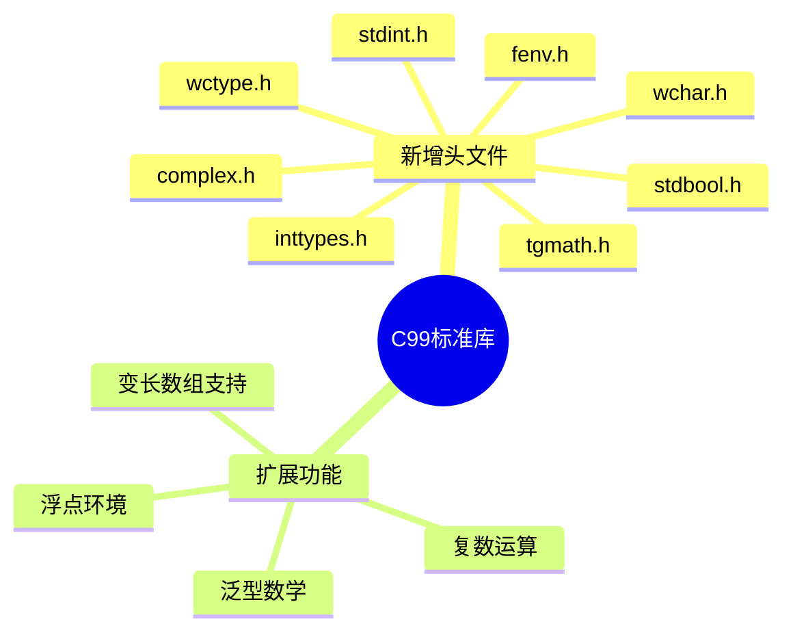

# C99标准库扩展深度解析

> **层级定位**: 01 Core Knowledge System / 04 Standard Library Layer
> **对应标准**: C99
> **难度级别**: L2 理解 → L3 应用
> **预估学习时间**: 3-5 小时

---

## 🔗 文档关联

### 前置依赖

| 文档 | 关系类型 | 说明 |
|:-----|:---------|:-----|
| [C89标准库](01_C89_Library.md) | 版本基础 | C89是基础 |
| [数据类型系统](../01_Basic_Layer/02_Data_Type_System.md) | 知识基础 | 新类型系统支持 |
| [浮点运算](../01_Basic_Layer/IEEE_754_Floating_Point/01_IEEE_754_Basics.md) | 知识基础 | fenv.h、复数运算 |

### 后续延伸

| 文档 | 关系类型 | 说明 |
|:-----|:---------|:-----|
| [C11标准库](03_C11_Library.md) | 版本演进 | 线程与并发支持 |
| [C17/C23库](04_C17_C23_Library.md) | 版本演进 | 现代C特性 |
| [国际化](../11_Internationalization/readme.md) | 功能应用 | 宽字符、本地化 |

### 关键新增

| 头文件 | 核心功能 | 关联概念 |
|:-------|:---------|:---------|
| stdbool.h | 布尔类型 | 逻辑运算 |
| stdint.h | 定宽整数 | 跨平台开发 |
| complex.h | 复数运算 | 科学计算 |
| tgmath.h | 泛型数学 | 宏与类型 |

---

## 📋 本节概要

| 属性 | 内容 |
|:-----|:-----|
| **核心概念** | C99新增头文件、复数运算、宽字符、定宽整数 |
| **前置知识** | C89标准库 |
| **后续延伸** | C11多线程、复杂数学 |
| **权威来源** | C99标准, Modern C |

---

## 🧠 知识结构思维导图



---

## 📖 核心概念详解

### 1. 定宽整数 (<stdint.h>)

```c
#include <stdint.h>

// 有符号整数
int8_t   i8;    // 8位
int16_t  i16;   // 16位
int32_t  i32;   // 32位
int64_t  i64;   // 64位

// 无符号整数
uint8_t  u8;    // 8位
uint16_t u16;   // 16位
uint32_t u32;   // 32位
uint64_t u64;   // 64位

// 指针大小整数
intptr_t  iptr;  // 可存储指针的有符号整数
uintptr_t uptr;  // 可存储指针的无符号整数

// 最大宽度
intmax_t  imax;
uintmax_t umax;

// 使用场景
struct Packet {
    uint32_t magic;     // 固定4字节
    uint16_t version;   // 固定2字节
    uint16_t flags;     // 固定2字节
    uint64_t timestamp; // 固定8字节
};  // 16字节，跨平台一致
```

### 2. 复数运算 (<complex.h>)

```c
#include <complex.h>
#include <math.h>

// 定义复数
double complex z1 = 1.0 + 2.0*I;  // 1 + 2i
double complex z2 = 3.0 - 4.0*I;  // 3 - 4i

// 基本运算
double complex sum = z1 + z2;
double complex diff = z1 - z2;
double complex prod = z1 * z2;
double complex quot = z1 / z2;

// 复数函数
double real_part = creal(z1);      // 实部
double imag_part = cimag(z1);      // 虚部
double magnitude = cabs(z1);       // 模 |z|
double complex conj_z = conj(z1);  // 共轭

double complex exp_z = cexp(z1);   // e^z
double complex log_z = clog(z1);   // ln(z)
double complex sqrt_z = csqrt(z1); // √z

// 欧拉公式: e^(iπ) = -1
double complex e_i_pi = cexp(I * M_PI);
printf("e^(iπ) = %.1f + %.1fi\n", creal(e_i_pi), cimag(e_i_pi));
```

### 3. 布尔类型 (<stdbool.h>)

```c
#include <stdbool.h>

// C99引入bool类型
bool flag = true;   // 或 false

// 底层实现
typedef _Bool bool;
#define true 1
#define false 0

// 使用示例
bool is_prime(int n) {
    if (n < 2) return false;
    for (int i = 2; i * i <= n; i++) {
        if (n % i == 0) return false;
    }
    return true;
}
```

### 4. 泛型数学 (<tgmath.h>)

```c
#include <tgmath.h>

// 根据参数类型自动选择函数
float f = 3.14f;
double d = 3.14;
long double ld = 3.14L;

float f_sqrt = sqrt(f);           // 调用 sqrtf
double d_sqrt = sqrt(d);          // 调用 sqrt
long double ld_sqrt = sqrt(ld);   // 调用 sqrtl

// 复数也适用
double complex z = 1.0 + 2.0*I;
double complex z_sqrt = sqrt(z);  // 调用 csqrt
```

### 5. 格式化宏 (<inttypes.h>)

```c
#include <inttypes.h>
#include <stdio.h>

uint32_t u32 = 42;
int64_t i64 = -123456789012LL;

// 可移植的printf格式
printf("uint32: %" PRIu32 "\n", u32);
printf("int64:  %" PRId64 "\n", i64);
printf("hex64:  %" PRIx64 "\n", i64);

// scanf格式
scanf("%" SCNd64, &i64);

// 完整示例
printf("Value: %10" PRIu32 " (0x%08" PRIx32 ")\n", u32, u32);
```

### 6. 宽字符支持 (<wchar.h>, <wctype.h>)

```c
#include <wchar.h>
#include <locale.h>

// 设置本地化
setlocale(LC_ALL, "");

// 宽字符操作
wchar_t wstr[] = L"Hello 世界";
size_t len = wcslen(wstr);       // 宽字符串长度
wchar_t wcopy[100];
wcscpy(wcopy, wstr);             // 宽字符串拷贝

// 格式化宽字符
wchar_t buffer[256];
swprintf(buffer, 256, L"Value: %d", 42);

// 多字节与宽字符转换
char mbs[256];
int n = wcstombs(mbs, wstr, sizeof(mbs));
```

---

## ⚠️ 常见陷阱

### 陷阱 C99-01: VLA使用限制

```c
// ❌ VLA不能用于结构体
struct Bad {
    int n;
    int arr[n];  // 错误！
};

// ✅ VLA只能用于局部数组
void func(int n) {
    int vla[n];  // OK
}

// ❌ VLA生命周期问题（避免过大）
void risky(int n) {
    int huge[n];  // 栈溢出风险！
}
```

### 陷阱 C99-02: 复数性能

```c
// 注意：复数运算可能较慢
double complex z = ...;
double r = cabs(z);  // 涉及sqrt运算

// 如果只是比较大小，比较平方避免sqrt
if (creal(z)*creal(z) + cimag(z)*cimag(z) > threshold*threshold) {
    // 比 cabs(z) > threshold 更快
}
```

---

## ✅ 质量验收清单

- [x] 定宽整数使用
- [x] 复数运算
- [x] 布尔类型
- [x] 泛型数学
- [x] 格式化宏
- [x] 宽字符支持

---

> **更新记录**
>
> - 2025-03-09: 初版创建


---

## 深入理解

### 技术原理

深入探讨相关技术原理和实现细节。

### 实践指南

- 步骤1：理解基础概念
- 步骤2：掌握核心原理
- 步骤3：应用实践

### 相关资源

- 文档链接
- 代码示例
- 参考文章

---

> **最后更新**: 2026-03-21
> **维护者**: AI Code Review
