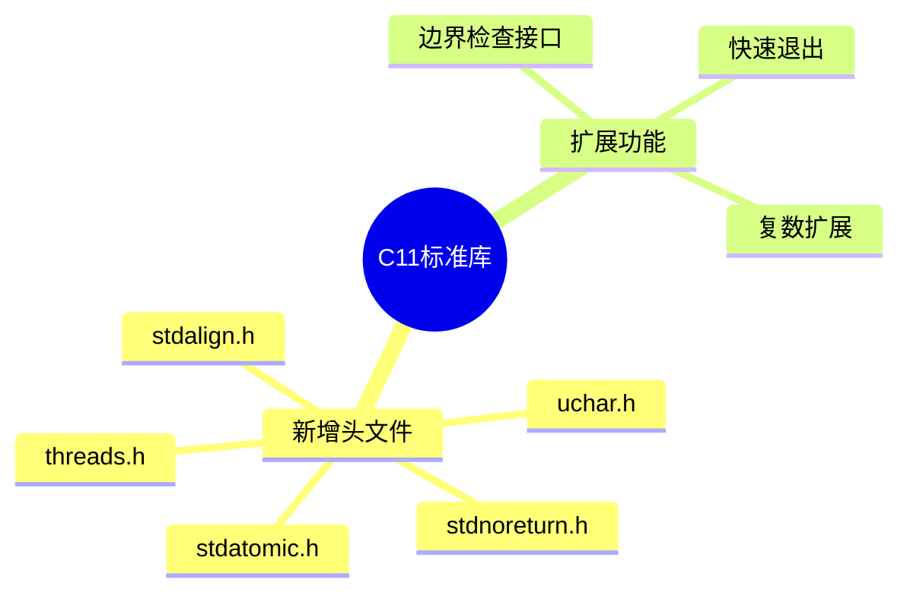

# C11标准库扩展深度解析

> **层级定位**: 01 Core Knowledge System / 04 Standard Library Layer
> **对应标准**: C11
> **难度级别**: L3 应用 → L4 分析
> **预估学习时间**: 5-8 小时

---

## 📋 本节概要

| 属性 | 内容 |
|:-----|:-----|
| **核心概念** | 多线程、原子操作、对齐、Unicode、边界检查接口 |
| **前置知识** | C99标准库、并发基础 |
| **后续延伸** | 并发编程、无锁算法、性能优化 |
| **权威来源** | C11标准, Modern C Level 3 |

---

## 🧠 知识结构思维导图



---

## 📖 核心概念详解

### 1. 原子操作 (<stdatomic.h>)

```c
#include <stdatomic.h>
#include <stdint.h>

// 原子类型声明
_Atomic int atomic_counter;
_Atomic uint64_t atomic_flags;

// 初始化
atomic_int counter = ATOMIC_VAR_INIT(0);

// 基本操作
atomic_fetch_add(&counter, 1);      // ++counter
atomic_fetch_sub(&counter, 1);      // --counter
atomic_exchange(&counter, 100);     // counter = 100，返回旧值

// 比较并交换(CAS)
int expected = 0;
if (atomic_compare_exchange_strong(&counter, &expected, 1)) {
    // 如果counter==0，设置为1，返回true
}

// 内存序控制
atomic_store_explicit(&flag, 1, memory_order_release);
while (atomic_load_explicit(&flag, memory_order_acquire) != 1) {
    // 等待
}

// 原子标志（布尔）
atomic_flag lock = ATOMIC_FLAG_INIT;

// 自旋锁实现
void spin_lock(atomic_flag *lock) {
    while (atomic_flag_test_and_set_explicit(lock, memory_order_acquire)) {
        // 自旋等待
    }
}

void spin_unlock(atomic_flag *lock) {
    atomic_flag_clear_explicit(lock, memory_order_release);
}
```

### 2. 多线程 (<threads.h>)

```c
#include <threads.h>
#include <stdio.h>

// 线程函数
int thread_func(void *arg) {
    int num = *(int *)arg;
    printf("Thread %d running\n", num);
    thrd_sleep(&(struct timespec){.tv_sec = 1}, NULL);
    return num * 2;
}

int main(void) {
    thrd_t thread;
    int arg = 42;

    // 创建线程
    if (thrd_create(&thread, thread_func, &arg) != thrd_success) {
        return 1;
    }

    // 等待线程完成
    int result;
    thrd_join(thread, &result);
    printf("Result: %d\n", result);

    return 0;
}
```

### 3. 互斥锁与条件变量

```c
#include <threads.h>

static mtx_t mutex;
static cnd_t cond;
static int shared_data = 0;
static bool data_ready = false;

int producer(void *arg) {
    (void)arg;

    mtx_lock(&mutex);
    shared_data = 42;
    data_ready = true;
    cnd_signal(&cond);  // 通知消费者
    mtx_unlock(&mutex);

    return 0;
}

int consumer(void *arg) {
    (void)arg;

    mtx_lock(&mutex);
    while (!data_ready) {
        cnd_wait(&cond, &mutex);  // 等待条件，自动释放锁
    }
    // 使用 shared_data
    printf("Got: %d\n", shared_data);
    mtx_unlock(&mutex);

    return 0;
}

int main(void) {
    mtx_init(&mutex, mtx_plain);
    cnd_init(&cond);

    thrd_t prod, cons;
    thrd_create(&cons, consumer, NULL);
    thrd_create(&prod, producer, NULL);

    thrd_join(prod, NULL);
    thrd_join(cons, NULL);

    mtx_destroy(&mutex);
    cnd_destroy(&cond);

    return 0;
}
```

### 4. Unicode支持 (<uchar.h>)

```c
#include <uchar.h>
#include <stdio.h>

// UTF-16字符
char16_t c16 = u'世';

// UTF-32字符
char32_t c32 = U'界';

// UTF-8字符串（C11）
const char *utf8 = u8"Hello 世界";

// 多字节转换
char mbs[256] = {0};
mbstate_t state = {0};

// char32_t -> UTF-8
c32rtomb(mbs, c32, &state);
printf("UTF-8: %s\n", mbs);

// UTF-8 -> char32_t
const char *src = "世";
char32_t result;
c32 = mbrtoc32(&result, src, 4, &state);
```

### 5. 边界检查接口（Annex K）

```c
// 可选支持，定义 __STDC_LIB_EXT1__
#ifdef __STDC_LIB_EXT1__

#define __STDC_WANT_LIB_EXT1__ 1
#include <string.h>
#include <stdio.h>

// 安全字符串操作
errno_t strcpy_s(char *dest, rsize_t destsz, const char *src);
errno_t strncpy_s(char *dest, rsize_t destsz, const char *src, rsize_t count);

// 使用
char buffer[100];
strcpy_s(buffer, sizeof(buffer), "safe string copy");

// 安全格式化
sprintf_s(buffer, sizeof(buffer), "Value: %d", 42);

// 安全gets替代（有长度限制）
gets_s(buffer, sizeof(buffer));

#endif  // __STDC_LIB_EXT1__
```

---

## ⚠️ 常见陷阱

### 陷阱 C11-01: 线程数据竞争

```c
// ❌ 数据竞争
int shared = 0;

void thread_func(void) {
    shared++;  // 未定义行为！
}

// ✅ 使用原子操作
_Atomic int safe_shared = 0;
void safe_thread_func(void) {
    atomic_fetch_add(&safe_shared, 1);
}

// ✅ 或使用互斥锁
static mtx_t mutex;
static int mutex_shared = 0;

void mutex_thread_func(void) {
    mtx_lock(&mutex);
    mutex_shared++;
    mtx_unlock(&mutex);
}
```

### 陷阱 C11-02: 死锁

```c
// ❌ 锁顺序不一致导致死锁
mtx_t lock_a, lock_b;

void thread1(void) {
    mtx_lock(&lock_a);
    mtx_lock(&lock_b);  // 等待thread2释放b
}

void thread2(void) {
    mtx_lock(&lock_b);
    mtx_lock(&lock_a);  // 等待thread1释放a
}

// ✅ 全局锁顺序
void safe_lock_both(void) {
    if ((uintptr_t)&lock_a < (uintptr_t)&lock_b) {
        mtx_lock(&lock_a);
        mtx_lock(&lock_b);
    } else {
        mtx_lock(&lock_b);
        mtx_lock(&lock_a);
    }
}
```

---

## ✅ 质量验收清单

- [x] 原子操作基本用法
- [x] 线程创建与同步
- [x] 互斥锁与条件变量
- [x] Unicode支持
- [x] 边界检查接口

---

> **更新记录**
>
> - 2025-03-09: 初版创建


---

## 深入理解

### 技术原理

深入探讨相关技术原理和实现细节。

### 实践指南

- 步骤1：理解基础概念
- 步骤2：掌握核心原理
- 步骤3：应用实践

### 相关资源

- 文档链接
- 代码示例
- 参考文章

---

> **最后更新**: 2026-03-21  
> **维护者**: AI Code Review
