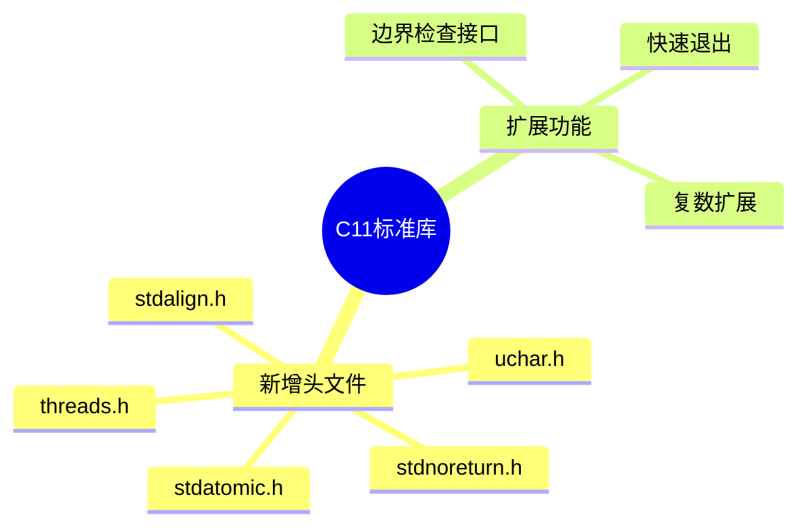

# C11标准库扩展深度解析

> **层级定位**: 01 Core Knowledge System / 04 Standard Library Layer
> **对应标准**: C11
> **难度级别**: L3 应用 → L4 分析
> **预估学习时间**: 5-8 小时

---

## 🔗 文档关联

### 前置依赖

| 文档 | 关系类型 | 说明 |
|:-----|:---------|:-----|
| [C99标准库](02_C99_Library.md) | 版本基础 | C99是基础 |
| [内存管理](../02_Core_Layer/02_Memory_Management.md) | 核心基础 | 线程安全内存 |
| [内存对齐](../02_Core_Layer/02_Memory_Management.md#内存对齐) | 知识基础 | stdalign.h |

### 后续延伸

| 文档 | 关系类型 | 说明 |
|:-----|:---------|:-----|
| [C11线程库](10_Threads_C11.md) | 核心扩展 | threads.h详解 |
| [并发编程](../../03_System_Technology_Domains/14_Concurrency_Parallelism/readme.md) | 高级应用 | 并发技术全景 |
| [C11内存模型](../../02_Formal_Semantics_and_Physics/01_Game_Semantics/02_C11_Memory_Model.md) | 理论深化 | 内存序与原子性 |
| [无锁编程](../../03_System_Technology_Domains/14_Concurrency_Parallelism/05_Lock_Free.md) | 专家进阶 | 原子操作高级应用 |

### 关键新增

| 头文件 | 核心功能 | 关联概念 |
|:-------|:---------|:---------|
| threads.h | 多线程 | 并发编程 |
| stdatomic.h | 原子操作 | 内存模型 |
| uchar.h | UTF-16/32 | 国际化 |
| stdalign.h | 对齐支持 | 内存管理 |

---

## 📋 本节概要

| 属性 | 内容 |
|:-----|:-----|
| **核心概念** | 多线程、原子操作、对齐、Unicode、边界检查接口 |
| **前置知识** | C99标准库、并发基础 |
| **后续延伸** | 并发编程、无锁算法、性能优化 |
| **权威来源** | C11标准, Modern C Level 3 |

---

## 🧠 知识结构思维导图



---

## 📖 核心概念详解

### 1. 原子操作 (<stdatomic.h>)

```c
#include <stdatomic.h>
#include <stdint.h>

// 原子类型声明
_Atomic int atomic_counter;
_Atomic uint64_t atomic_flags;

// 初始化
atomic_int counter = ATOMIC_VAR_INIT(0);

// 基本操作
atomic_fetch_add(&counter, 1);      // ++counter
atomic_fetch_sub(&counter, 1);      // --counter
atomic_exchange(&counter, 100);     // counter = 100，返回旧值

// 比较并交换(CAS)
int expected = 0;
if (atomic_compare_exchange_strong(&counter, &expected, 1)) {
    // 如果counter==0，设置为1，返回true
}

// 内存序控制
atomic_store_explicit(&flag, 1, memory_order_release);
while (atomic_load_explicit(&flag, memory_order_acquire) != 1) {
    // 等待
}

// 原子标志（布尔）
atomic_flag lock = ATOMIC_FLAG_INIT;

// 自旋锁实现
void spin_lock(atomic_flag *lock) {
    while (atomic_flag_test_and_set_explicit(lock, memory_order_acquire)) {
        // 自旋等待
    }
}

void spin_unlock(atomic_flag *lock) {
    atomic_flag_clear_explicit(lock, memory_order_release);
}
```

### 2. 多线程 (<threads.h>)

```c
#include <threads.h>
#include <stdio.h>

// 线程函数
int thread_func(void *arg) {
    int num = *(int *)arg;
    printf("Thread %d running\n", num);
    thrd_sleep(&(struct timespec){.tv_sec = 1}, NULL);
    return num * 2;
}

int main(void) {
    thrd_t thread;
    int arg = 42;

    // 创建线程
    if (thrd_create(&thread, thread_func, &arg) != thrd_success) {
        return 1;
    }

    // 等待线程完成
    int result;
    thrd_join(thread, &result);
    printf("Result: %d\n", result);

    return 0;
}
```

### 3. 互斥锁与条件变量

```c
#include <threads.h>

static mtx_t mutex;
static cnd_t cond;
static int shared_data = 0;
static bool data_ready = false;

int producer(void *arg) {
    (void)arg;

    mtx_lock(&mutex);
    shared_data = 42;
    data_ready = true;
    cnd_signal(&cond);  // 通知消费者
    mtx_unlock(&mutex);

    return 0;
}

int consumer(void *arg) {
    (void)arg;

    mtx_lock(&mutex);
    while (!data_ready) {
        cnd_wait(&cond, &mutex);  // 等待条件，自动释放锁
    }
    // 使用 shared_data
    printf("Got: %d\n", shared_data);
    mtx_unlock(&mutex);

    return 0;
}

int main(void) {
    mtx_init(&mutex, mtx_plain);
    cnd_init(&cond);

    thrd_t prod, cons;
    thrd_create(&cons, consumer, NULL);
    thrd_create(&prod, producer, NULL);

    thrd_join(prod, NULL);
    thrd_join(cons, NULL);

    mtx_destroy(&mutex);
    cnd_destroy(&cond);

    return 0;
}
```

### 4. Unicode支持 (<uchar.h>)

```c
#include <uchar.h>
#include <stdio.h>

// UTF-16字符
char16_t c16 = u'世';

// UTF-32字符
char32_t c32 = U'界';

// UTF-8字符串（C11）
const char *utf8 = u8"Hello 世界";

// 多字节转换
char mbs[256] = {0};
mbstate_t state = {0};

// char32_t -> UTF-8
c32rtomb(mbs, c32, &state);
printf("UTF-8: %s\n", mbs);

// UTF-8 -> char32_t
const char *src = "世";
char32_t result;
c32 = mbrtoc32(&result, src, 4, &state);
```

### 5. 边界检查接口（Annex K）

```c
// 可选支持，定义 __STDC_LIB_EXT1__
#ifdef __STDC_LIB_EXT1__

#define __STDC_WANT_LIB_EXT1__ 1
#include <string.h>
#include <stdio.h>

// 安全字符串操作
errno_t strcpy_s(char *dest, rsize_t destsz, const char *src);
errno_t strncpy_s(char *dest, rsize_t destsz, const char *src, rsize_t count);

// 使用
char buffer[100];
strcpy_s(buffer, sizeof(buffer), "safe string copy");

// 安全格式化
sprintf_s(buffer, sizeof(buffer), "Value: %d", 42);

// 安全gets替代（有长度限制）
gets_s(buffer, sizeof(buffer));

#endif  // __STDC_LIB_EXT1__
```

---

## ⚠️ 常见陷阱

### 陷阱 C11-01: 线程数据竞争

```c
// ❌ 数据竞争
int shared = 0;

void thread_func(void) {
    shared++;  // 未定义行为！
}

// ✅ 使用原子操作
_Atomic int safe_shared = 0;
void safe_thread_func(void) {
    atomic_fetch_add(&safe_shared, 1);
}

// ✅ 或使用互斥锁
static mtx_t mutex;
static int mutex_shared = 0;

void mutex_thread_func(void) {
    mtx_lock(&mutex);
    mutex_shared++;
    mtx_unlock(&mutex);
}
```

### 陷阱 C11-02: 死锁

```c
// ❌ 锁顺序不一致导致死锁
mtx_t lock_a, lock_b;

void thread1(void) {
    mtx_lock(&lock_a);
    mtx_lock(&lock_b);  // 等待thread2释放b
}

void thread2(void) {
    mtx_lock(&lock_b);
    mtx_lock(&lock_a);  // 等待thread1释放a
}

// ✅ 全局锁顺序
void safe_lock_both(void) {
    if ((uintptr_t)&lock_a < (uintptr_t)&lock_b) {
        mtx_lock(&lock_a);
        mtx_lock(&lock_b);
    } else {
        mtx_lock(&lock_b);
        mtx_lock(&lock_a);
    }
}
```

---

## ✅ 质量验收清单

- [x] 原子操作基本用法
- [x] 线程创建与同步
- [x] 互斥锁与条件变量
- [x] Unicode支持
- [x] 边界检查接口

---

> **更新记录**
>
> - 2025-03-09: 初版创建


---

## 深入理解

### 技术原理深度剖析

#### 1. C11标准的时代背景与设计目标

C11（ISO/IEC 9899:2011）是对C语言的重大更新，主要应对**多核处理器普及、并发编程需求增长、以及安全性要求提升**三大趋势。它是C语言进入现代计算时代的标志性版本。

**C11演进的关键驱动力：**

| 技术趋势 | 问题 | C11解决方案 |
|:---------|:-----|:------------|
| 多核处理器 | 并发编程困难 | `<threads.h>`, `<stdatomic.h>` |
| 内存模型复杂化 | 编译器优化与并发冲突 | C11内存模型、内存序 |
| 缓冲区溢出漏洞 | 传统字符串函数不安全 | 边界检查接口(Annex K) |
| Unicode普及 | 字符编码处理混乱 | `<uchar.h>` (UTF-16/32) |
| 对齐要求多样化 | SIMD、DMA等需要特定对齐 | `<stdalign.h>`, `alignas` |
| 静态分析需求 | 编译器难以检查约束 | `_Static_assert` |

**标准化时间线：**

```
2007: C1X委员会草案开始
    ↓
2010: N1539委员会草案
    ↓
2011.12: ISO/IEC 9899:2011正式发布
    ↓
2012: C11标准库在各编译器逐步实现
    ├─ GCC 4.9+ (线程支持)
    ├─ Clang 3.3+ (基本完整)
    └─ MSVC 2019+ (C11支持)
    ↓
2017: C17发布（缺陷修复）
```

#### 2. C11内存模型深度解析

**内存模型核心概念：**

```
程序内存操作视图
┌─────────────────────────────────────────────────────────┐
│                     程序代码                             │
├─────────────────────────────────────────────────────────┤
│  线程A                  │  线程B                         │
│  ┌─────────────────┐    │  ┌─────────────────┐          │
│  │ 本地操作        │    │  │ 本地操作        │          │
│  │  ├─ 顺序执行    │    │  │  ├─ 顺序执行    │          │
│  │  └─ 编译器优化  │    │  │  └─ 编译器优化  │          │
│  ├─────────────────┤    │  ├─────────────────┤          │
│  │ 原子操作        │◄───┼──┼─► 原子操作        │          │
│  │  ├─ 内存序控制  │    │  │  ├─ 内存序控制  │          │
│  │  └─ 同步点      │    │  │  └─ 同步点      │          │
│  ├─────────────────┤    │  ├─────────────────┤          │
│  │ 数据竞争检测    │    │  │ 数据竞争检测    │          │
│  └─────────────────┘    │  └─────────────────┘          │
│                         │                                │
└─────────────────────────┴────────────────────────────────┘
                          │
                          ▼
                   ┌──────────────┐
                   │   共享内存    │
                   │  (全局/堆)   │
                   └──────────────┘
```

**内存序（Memory Order）详解：**

```c
#include <stdatomic.h>
#include <stdio.h>

// 六种内存序从弱到强
void memory_order_explained(void) {
    _Atomic int flag = 0;
    _Atomic int data = 0;
    
    // 1. memory_order_relaxed - 最弱，无同步保证
    // 只保证原子性，无顺序约束
    // 使用场景：计数器（不用于同步）
    atomic_fetch_add_explicit(&counter, 1, memory_order_relaxed);
    
    // 2. memory_order_consume - 数据依赖顺序（少用）
    // C11引入，但编译器通常实现为acquire
    int *ptr = atomic_load_explicit(&shared_ptr, memory_order_consume);
    // 后续对*ptr的访问保证在看到ptr之后
    
    // 3. memory_order_acquire - 获取语义
    // 保证：后续读操作不会被重排到该操作之前
    // 使用场景：读锁、检查标志
    while (atomic_load_explicit(&flag, memory_order_acquire) == 0) {
        // 等待
    }
    // 保证：看到flag!=0后，能看到flag设置前的所有写操作
    
    // 4. memory_order_release - 释放语义
    // 保证：前面的写操作不会被重排到该操作之后
    // 使用场景：解锁、设置标志通知其他线程
    data = 42;  // 这行不会被重排到下面之后
    atomic_store_explicit(&flag, 1, memory_order_release);
    
    // 5. memory_order_acq_rel - 获取+释放
    // 读改写操作（如fetch_add）同时使用
    // 保证：之前的写对其他线程可见，之后的读看到其他线程的写
    atomic_fetch_add_explicit(&ref_count, -1, memory_order_acq_rel);
    
    // 6. memory_order_seq_cst - 顺序一致性（默认，最强）
    // 所有线程看到的操作顺序一致
    // 性能开销最大，但最易理解
    atomic_store(&flag, 1);  // 默认seq_cst
}

// Acquire-Release配对同步示例
typedef struct {
    _Atomic int ready;
    int data;
} Message;

Message msg = {0, 0};

// 生产者线程
void producer(void) {
    msg.data = 42;  // 普通写
    // release保证data=42在ready=1之前完成
    atomic_store_explicit(&msg.ready, 1, memory_order_release);
}

// 消费者线程
void consumer(void) {
    // acquire保证看到ready=1后，能看到data=42
    while (atomic_load_explicit(&msg.ready, memory_order_acquire) == 0) {
        // 自旋等待
    }
    // 现在可以安全读取msg.data
    printf("Got: %d\n", msg.data);  // 保证看到42
}
```

#### 3. 原子操作的硬件实现原理

**原子操作的实现层级：**

```
┌─────────────────────────────────────────────────────────┐
│  高级接口 (C11 stdatomic.h)                              │
│  atomic_fetch_add(), atomic_compare_exchange_strong()    │
├─────────────────────────────────────────────────────────┤
│  编译器内建 (GCC/Clang)                                  │
│  __atomic_fetch_add(), __sync_fetch_and_add() (legacy)  │
├─────────────────────────────────────────────────────────┤
│  汇编指令                                                │
│  x86: LOCK prefix + ADD/XCHG/CMPXCHG                    │
│  ARM: LDREX/STREX (LL/SC) 或 LSE atomics (ARMv8.1+)    │
│  RISC-V: AMO instructions                               │
├─────────────────────────────────────────────────────────┤
│  硬件支持                                                │
│  - 总线锁定/缓存一致性协议                               │
│  - MESI/MOESI缓存状态管理                                │
│  - 内存屏障指令                                          │
└─────────────────────────────────────────────────────────┘
```

**CAS（比较并交换）原理解析：**

```c
#include <stdatomic.h>
#include <stdbool.h>

// CAS是构建其他原子操作的基础
// 概念性实现（实际由硬件保证原子性）
bool atomic_cas_concept(_Atomic int *ptr, int *expected, int desired) {
    // 伪代码 - 实际硬件原子执行
    if (*ptr == *expected) {
        *ptr = desired;
        return true;  // 交换成功
    } else {
        *expected = *ptr;  // 返回当前值
        return false;  // 交换失败
    }
}

// 基于CAS实现原子加法
int atomic_add_with_cas(_Atomic int *ptr, int value) {
    int old_val = atomic_load(ptr);
    int new_val;
    do {
        new_val = old_val + value;
    // 如果ptr的值还是old_val，则设为new_val
    } while (!atomic_compare_exchange_weak(ptr, &old_val, new_val));
    return new_val;
}

// 无锁栈实现（CAS应用）
typedef struct Node {
    int value;
    struct Node *next;
} Node;

typedef struct {
    _Atomic(Node *) head;
} LockFreeStack;

void stack_push(LockFreeStack *stack, Node *node) {
    Node *old_head;
    do {
        old_head = atomic_load(&stack->head);
        node->next = old_head;
    // 如果head没变，更新为node
    } while (!atomic_compare_exchange_weak(&stack->head, &old_head, node));
}

Node *stack_pop(LockFreeStack *stack) {
    Node *old_head;
    do {
        old_head = atomic_load(&stack->head);
        if (old_head == NULL) return NULL;
    // 如果head没变，更新为next
    } while (!atomic_compare_exchange_weak(&stack->head, &old_head, old_head->next));
    return old_head;
}
```

#### 4. C11线程库的实现机制

**threads.h与POSIX线程的关系：**

```c
// C11 threads.h是pthread的抽象层
// 映射关系：
// thrd_t          ↔ pthread_t
// mtx_t           ↔ pthread_mutex_t
// cnd_t           ↔ pthread_cond_t
// thrd_create()   ↔ pthread_create()
// thrd_join()     ↔ pthread_join()
// mtx_lock()      ↔ pthread_mutex_lock()
// cnd_wait()      ↔ pthread_cond_wait()

// 重要区别：
// 1. C11线程函数返回int，pthread返回void*
// 2. C11错误码统一，pthread直接返回错误
// 3. C11 timed等待使用struct timespec，pthread有pthread_mutex_timedlock
```

**线程局部存储(TLS)实现：**

```c
#include <threads.h>

// 线程局部变量（C11关键字）
_Thread_local int thread_local_counter = 0;

// 或者使用宏（更便携）
#define THREAD_LOCAL _Thread_local

THREAD_LOCAL char thread_buffer[1024];

// TLS实现原理（概念性）
/*
 * 每个线程有独立的TLS区域：
 *
 * 线程A的内存布局：
 * ┌──────────────────┐
 * │ 线程栈           │
 * ├──────────────────┤
 * │ TLS区域          │ ← thread_local_counter = A的值
 * │ ├─ thread_local_counter
 * │ └─ thread_buffer
 * ├──────────────────┤
 * │ 堆               │
 * └──────────────────┘
 *
 * 线程B的内存布局：
 * ┌──────────────────┐
 * │ 线程栈           │
 * ├──────────────────┤
 * │ TLS区域          │ ← thread_local_counter = B的值
 * │ ├─ thread_local_counter  (独立副本)
 * │ └─ thread_buffer         (独立副本)
 * ├──────────────────┤
 * │ 堆               │
 * └──────────────────┘
 *
 * 访问TLS变量通常通过FS/GS段寄存器（x86-64）
 * 或TPIDR_EL0寄存器（ARM64）
 */

int thread_func(void *arg) {
    // 每个线程有独立的计数器
    thread_local_counter++;
    printf("Thread %d: counter = %d\n", *(int*)arg, thread_local_counter);
    return 0;
}
```

#### 5. 互斥锁与条件变量的深层机制

**互斥锁的实现原理：**

```c
#include <threads.h>
#include <stdatomic.h>

// 互斥锁的状态机
// ┌──────────┐   lock成功    ┌──────────┐
// │  UNLOCKED │─────────────►│  LOCKED  │
// └────┬─────┘              └────┬─────┘
//      ▲                         │
//      └─────────────────────────┘
//              unlock

// 互斥锁的两种实现策略：

// 1. 自旋锁（适用于短临界区）
typedef struct {
    atomic_flag flag;
} SpinLock;

void spin_init(SpinLock *lock) {
    atomic_flag_clear(&lock->flag);
}

void spin_lock(SpinLock *lock) {
    // 自旋等待（忙等）
    while (atomic_flag_test_and_set(&lock->flag)) {
        // 可选：CPU pause指令减少功耗
        #if defined(__x86_64__)
            __asm__ volatile("pause");
        #endif
    }
}

void spin_unlock(SpinLock *lock) {
    atomic_flag_clear(&lock->flag);
}

// 2. 睡眠锁（C11 mtx_t的典型实现）
// 内部可能结合自旋+系统调用
// - 先尝试自旋几次
// - 失败则进入内核等待队列

// 性能对比决策
void locking_strategy_guide(void) {
    // 临界区极短（几个指令）→ 自旋锁
    // 临界区长 → 互斥锁
    // 临界区中等 → 自适应自旋（自旋几次后睡眠）
}
```

**条件变量的等待-通知机制：**

```c
#include <threads.h>
#include <stdio.h>

// 条件变量解决的场景：
// 线程需要等待某个条件成立，但不断轮询浪费CPU

// 经典的生产者-消费者问题
#define BUFFER_SIZE 10

static mtx_t mutex;
static cnd_t not_full;
static cnd_t not_empty;
static int buffer[BUFFER_SIZE];
static int count = 0;
static int write_idx = 0;
static int read_idx = 0;

int producer_thread(void *arg) {
    (void)arg;
    for (int i = 0; i < 100; i++) {
        mtx_lock(&mutex);
        
        // 等待缓冲区非满
        while (count == BUFFER_SIZE) {
            // 原子操作：
            // 1. 释放mutex
            // 2. 将线程加入等待队列（睡眠）
            // 3. 被唤醒后重新获取mutex
            cnd_wait(&not_full, &mutex);
        }
        
        // 生产数据
        buffer[write_idx] = i;
        write_idx = (write_idx + 1) % BUFFER_SIZE;
        count++;
        
        printf("Produced: %d\n", i);
        
        // 通知消费者
        cnd_signal(&not_empty);
        mtx_unlock(&mutex);
    }
    return 0;
}

int consumer_thread(void *arg) {
    (void)arg;
    for (int i = 0; i < 100; i++) {
        mtx_lock(&mutex);
        
        // 等待缓冲区非空
        while (count == 0) {
            cnd_wait(&not_empty, &mutex);
        }
        
        // 消费数据
        int value = buffer[read_idx];
        read_idx = (read_idx + 1) % BUFFER_SIZE;
        count--;
        
        printf("Consumed: %d\n", value);
        
        // 通知生产者
        cnd_signal(&not_full);
        mtx_unlock(&mutex);
    }
    return 0;
}

// 注意：cnd_wait() 必须在循环中检查条件（防止虚假唤醒）
// 条件变量的实现通常依赖于操作系统的futex机制
```

#### 6. 边界检查接口(Annex K)的设计与局限

**Annex K的安全模型：**

```c
// Annex K引入"运行时约束违规"概念
// 与标准C错误处理不同，它提供统一的安全处理机制

#ifdef __STDC_LIB_EXT1__
#define __STDC_WANT_LIB_EXT1__ 1
#include <string.h>
#include <stdlib.h>
#include <stdio.h>

// 运行时约束处理函数原型
typedef void (*constraint_handler_t)(const char *restrict msg, 
                                      void *restrict ptr, 
                                      errno_t error);

// 设置处理函数
constraint_handler_t set_constraint_handler_s(constraint_handler_t handler);

// 默认处理：
// - abort_handler_s: 调用abort()
// - ignore_handler_s: 忽略错误（危险）

// 使用示例
void safe_string_ops(void) {
    char dest[10];
    errno_t err;
    
    // 安全复制
    err = strcpy_s(dest, sizeof(dest), "Hello");
    if (err != 0) {
        // 处理错误（约束处理函数也可能已终止程序）
        printf("Copy failed: %d\n", err);
    }
    
    // 安全连接
    err = strcat_s(dest, sizeof(dest), " World");
    
    // 安全格式化
    err = sprintf_s(dest, sizeof(dest), "%d", 12345);
}

#endif  // __STDC_LIB_EXT1__

// Annex K的局限：
// 1. 可选特性，很多编译器不支持（如glibc不支持）
// 2. 某些设计被认为过度（如gets_s）
// 3. 微软的实现与标准有差异
// 4. C23引入了更实用的strlcpy/strlcat作为替代
```

### 实践指南

#### 1. 并发编程决策树

```
线程间同步策略选择：
┌─────────────────────────────────────────┐
│ 需要共享可变数据？                       │
└─────────────┬───────────────────────────┘
              │
      ┌───────┴───────┐
      ▼               ▼
     否              是
      │               │
      ▼               ▼
  无需同步       共享频率？
      │               │
              ┌───────┴───────┐
              ▼               ▼
            极低           较高
              │               │
              ▼               ▼
        使用原子操作    使用互斥锁
              │               │
              ▼               ▼
       ┌────────────┐   锁粒度？
       │ 计数器    │       │
       │ 标志位    │  ┌────┴────┐
       │ 指针交换  │  ▼         ▼
       │ 简单计数  │ 粗粒度   细粒度
       └────────────┘  │         │
                       ▼         ▼
                  大锁保护   锁分段
                  简单      更复杂

原子操作选择：
┌─────────────────────────────────────────┐
│ 操作类型？                               │
└─────────────┬───────────────────────────┘
              │
      ┌───────┼───────┐
      ▼       ▼       ▼
    加减    交换    CAS
      │       │       │
      ▼       ▼       ▼
 fetch_add  exchange  compare_exchange
 最轻量     中等      最灵活
```

#### 2. 线程安全代码模板

```c
#include <threads.h>
#include <stdatomic.h>
#include <stdlib.h>
#include <stdio.h>

// 模式1：线程安全的引用计数对象
typedef struct {
    _Atomic int ref_count;
    void *data;
} RefCountedObject;

RefCountedObject *ref_create(void *data) {
    RefCountedObject *obj = malloc(sizeof(RefCountedObject));
    obj->ref_count = 1;  // 初始引用计数为1
    obj->data = data;
    return obj;
}

void ref_acquire(RefCountedObject *obj) {
    atomic_fetch_add(&obj->ref_count, 1);
}

void ref_release(RefCountedObject *obj) {
    // fetch_sub返回旧值，如果减1后变为0
    if (atomic_fetch_sub(&obj->ref_count, 1) == 1) {
        free(obj->data);
        free(obj);
    }
}

// 模式2：线程安全的消息队列
#define QUEUE_SIZE 256

typedef struct {
    void *items[QUEUE_SIZE];
    _Atomic size_t head;
    _Atomic size_t tail;
    mtx_t mutex;
    cnd_t not_full;
    cnd_t not_empty;
} ThreadSafeQueue;

void queue_init(ThreadSafeQueue *q) {
    atomic_init(&q->head, 0);
    atomic_init(&q->tail, 0);
    mtx_init(&q->mutex, mtx_plain);
    cnd_init(&q->not_full);
    cnd_init(&q->not_empty);
}

bool queue_push(ThreadSafeQueue *q, void *item) {
    mtx_lock(&q->mutex);
    
    size_t next_tail = (q->tail + 1) % QUEUE_SIZE;
    while (next_tail == q->head) {  // 队列满
        cnd_wait(&q->not_full, &q->mutex);
        next_tail = (q->tail + 1) % QUEUE_SIZE;
    }
    
    q->items[q->tail] = item;
    q->tail = next_tail;
    
    cnd_signal(&q->not_empty);
    mtx_unlock(&q->mutex);
    return true;
}

void *queue_pop(ThreadSafeQueue *q) {
    mtx_lock(&q->mutex);
    
    while (q->head == q->tail) {  // 队列空
        cnd_wait(&q->not_empty, &q->mutex);
    }
    
    void *item = q->items[q->head];
    q->head = (q->head + 1) % QUEUE_SIZE;
    
    cnd_signal(&q->not_full);
    mtx_unlock(&q->mutex);
    return item;
}

// 模式3：无锁单生产者单消费者队列
// 适用于：一个线程只写，一个线程只读
typedef struct {
    void *buffer[QUEUE_SIZE];
    _Atomic size_t write_idx;
    _Atomic size_t read_idx;
} SPSCQueue;

void spsc_push(SPSCQueue *q, void *item) {
    size_t idx = atomic_load_explicit(&q->write_idx, memory_order_relaxed);
    size_t next_idx = (idx + 1) % QUEUE_SIZE;
    
    // 等待消费者
    while (next_idx == atomic_load_explicit(&q->read_idx, memory_order_acquire)) {
        // 自旋或yield
        thrd_yield();
    }
    
    q->buffer[idx] = item;
    atomic_store_explicit(&q->write_idx, next_idx, memory_order_release);
}

void *spsc_pop(SPSCQueue *q) {
    size_t idx = atomic_load_explicit(&q->read_idx, memory_order_relaxed);
    
    // 等待生产者
    while (idx == atomic_load_explicit(&q->write_idx, memory_order_acquire)) {
        thrd_yield();
    }
    
    void *item = q->buffer[idx];
    atomic_store_explicit(&q->read_idx, (idx + 1) % QUEUE_SIZE, memory_order_release);
    return item;
}
```

#### 3. 死锁预防模式

```c
#include <threads.h>
#include <stdint.h>

// 模式1：锁排序（全局顺序）
#define NUM_LOCKS 10
static mtx_t locks[NUM_LOCKS];

void acquire_ordered(int a, int b) {
    // 总是按地址顺序获取锁
    if (a < b) {
        mtx_lock(&locks[a]);
        mtx_lock(&locks[b]);
    } else {
        mtx_lock(&locks[b]);
        mtx_lock(&locks[a]);
    }
}

void release_ordered(int a, int b) {
    mtx_unlock(&locks[a]);
    mtx_unlock(&locks[b]);
}

// 模式2：尝试锁 + 回退
typedef enum { LOCK_SUCCESS, LOCK_FAILED } LockResult;

LockResult try_lock_both(mtx_t *a, mtx_t *b) {
    mtx_lock(a);
    if (mtx_trylock(b) != thrd_success) {
        mtx_unlock(a);  // 回退
        return LOCK_FAILED;
    }
    return LOCK_SUCCESS;
}

// 使用回退策略
void safe_transfer(mtx_t *from_lock, mtx_t *to_lock, int amount) {
    while (1) {
        mtx_lock(from_lock);
        if (mtx_trylock(to_lock) == thrd_success) {
            // 执行转账操作
            // ...
            mtx_unlock(to_lock);
            mtx_unlock(from_lock);
            break;
        }
        // 获取第二个锁失败，释放第一个锁并重试
        mtx_unlock(from_lock);
        thrd_yield();  // 让出CPU
    }
}

// 模式3：超时锁（防止无限等待）
#include <time.h>

bool lock_with_timeout(mtx_t *mutex, int timeout_ms) {
    struct timespec ts;
    timespec_get(&ts, TIME_UTC);
    ts.tv_nsec += timeout_ms * 1000000;
    if (ts.tv_nsec >= 1000000000) {
        ts.tv_sec += ts.tv_nsec / 1000000000;
        ts.tv_nsec %= 1000000000;
    }
    
    // C11不直接支持timed mutex，需要条件变量模拟或平台扩展
    // 这里使用简单轮询
    struct timespec now;
    while (1) {
        if (mtx_trylock(mutex) == thrd_success) {
            return true;
        }
        timespec_get(&now, TIME_UTC);
        if (now.tv_sec > ts.tv_sec || 
            (now.tv_sec == ts.tv_sec && now.tv_nsec >= ts.tv_nsec)) {
            return false;  // 超时
        }
        thrd_yield();
    }
}
```

### 层次关联与映射分析

#### C11在并发知识体系中的位置

```
并发编程知识层次
┌─────────────────────────────────────────────────────────┐
│  应用层                                                  │
│  - 并发数据结构（无锁队列、跳表）                         │
│  - 并行算法（MapReduce、Fork-Join）                      │
├─────────────────────────────────────────────────────────┤
│  模式层                                                  │
│  - 生产者-消费者                                         │
│  - 读者-写者锁                                           │
│  - 线程池                                                │
├─────────────────────────────────────────────────────────┤
│  ★ C11并发层 (本文档) ★                                  │
│  ┌─────────────────────────────────────────────────┐    │
│  │ threads.h - 线程管理、互斥锁、条件变量            │    │
│  │ stdatomic.h - 原子操作、内存序                    │    │
│  │ C11内存模型 - happens-before关系                 │    │
│  └─────────────────────────────────────────────────┘    │
├─────────────────────────────────────────────────────────┤
│  操作系统层                                              │
│  - pthread (POSIX)                                       │
│  - Windows Threads                                       │
│  - 内核调度器                                            │
├─────────────────────────────────────────────────────────┤
│  硬件层                                                  │
│  - 多核处理器架构                                        │
│  - 缓存一致性协议 (MESI)                                 │
│  - 内存屏障指令                                          │
└─────────────────────────────────────────────────────────┘
```

#### 特性依赖关系图

```
C11核心特性依赖关系

stdatomic.h
    ├── 基础原子操作 (fetch_add/or/and/xor)
    │       └── 底层：LOCK前缀/x86, LL/SC/ARM
    ├── CAS操作 (compare_exchange)
    │       └── 构建：无锁数据结构
    └── 内存序 (memory_order)
            ├── acquire-release语义
            │       └── 实现：线程间数据传递
            └── seq_cst
                    └── 实现：全局顺序一致性

threads.h
    ├── thrd_create/join
    │       └── 底层：pthread或系统调用
    ├── mtx_t
    │       ├── mtx_plain
    │       └── mtx_timed (平台相关)
    └── cnd_t
            └── 底层：futex或条件变量

_Types/_Alignas
    └── 底层：编译器属性/对齐指令

_Static_assert
    └── 编译期检查，无运行时开销
```

### 决策矩阵与对比分析

#### 同步原语选择矩阵

| 场景 | 推荐方案 | 替代方案 | 避免使用 | 原因 |
|:-----|:---------|:---------|:---------|:-----|
| 简单计数 | atomic_fetch_add | mtx + int | 无锁CAS循环 | 原子操作最轻量 |
| 布尔标志 | atomic_store/load | mtx + bool | volatile | 内存序保证 |
| 懒加载初始化 | call_once | static + mtx | 双重检查锁定 | 正确性优先 |
| 短临界区 | spinlock (自定义) | mtx_trylock | mtx_lock | 减少上下文切换 |
| 长临界区 | mtx_lock | 读写锁 | 自旋 | 睡眠等待省CPU |
| 生产者-消费者 | cnd_wait/signal | 轮询 | 忙等 | 条件变量高效 |
| 多读少写 | 读写锁(自定义) | 多个mtx | 单mtx | 读并发度 |
| 无锁队列 | CAS循环 | mtx + queue | 无 | 最高性能 |

#### C11线程 vs POSIX线程对比

| 特性 | C11 threads.h | POSIX pthread | 说明 |
|:-----|:--------------|:--------------|:-----|
| 可移植性 | 标准C | POSIX系统 | C11更广泛 |
| 线程返回值 | int | void* | C11限制更多 |
| 线程本地存储 | _Thread_local | pthread_key_create | C11语法更简洁 |
| 互斥锁类型 | 简单 | 递归、错误检查等 | pthread更丰富 |
| 读写锁 | 无 | pthread_rwlock | C11需自己实现 |
| 屏障 | 无 | pthread_barrier | C11需自己实现 |
| 取消线程 | thrd_detach | pthread_cancel | 语义略有不同 |

### 相关资源

#### 官方标准与规范

- **ISO/IEC 9899:2011** - C11官方标准
- **ISO/IEC 9899:2011/Cor.1:2012** - 技术勘误1
- **WG14 N1570** - C11标准草案（公开可免费获取）
- **C11内存模型解释** - Batty et al. 数学化规范

#### 编译器支持状态

| 编译器 | 版本 | 支持状态 | 备注 |
|:-------|:-----|:---------|:-----|
| GCC | 4.9+ | threads.h完整 | 需要链接-pthread |
| GCC | 4.9+ | stdatomic.h完整 | - |
| Clang | 3.3+ | 基本完整 | - |
| MSVC | 2019+ | C11模式 | /std:c11 |
| Intel ICC | 2021+ | 完整 | - |

#### 深入学习资源

| 资源 | 类型 | 难度 | 内容重点 |
|:-----|:-----|:----:|:---------|
| *C Concurrency* (O'Reilly) | 书籍 | L4 | C11并发实战 |
| *Is Parallel Programming Hard?* | 在线书籍 | L4 | 并发算法与实现 |
| *Memory Barriers: a Hardware View* | 论文 | L4 | 内存屏障硬件原理 |
| Preshing on Programming博客 | 博客 | L3 | 内存模型详解 |

#### 实践项目参考

- `examples/c11/thread_pool/` - 线程池实现
- `examples/c11/lock_free_queue/` - 无锁队列实现
- `examples/c11/parallel_sort/` - 并行排序算法
- `examples/c11/concurrent_hash/` - 并发哈希表

---

> **最后更新**: 2026-03-28
> **维护者**: AI Code Review
