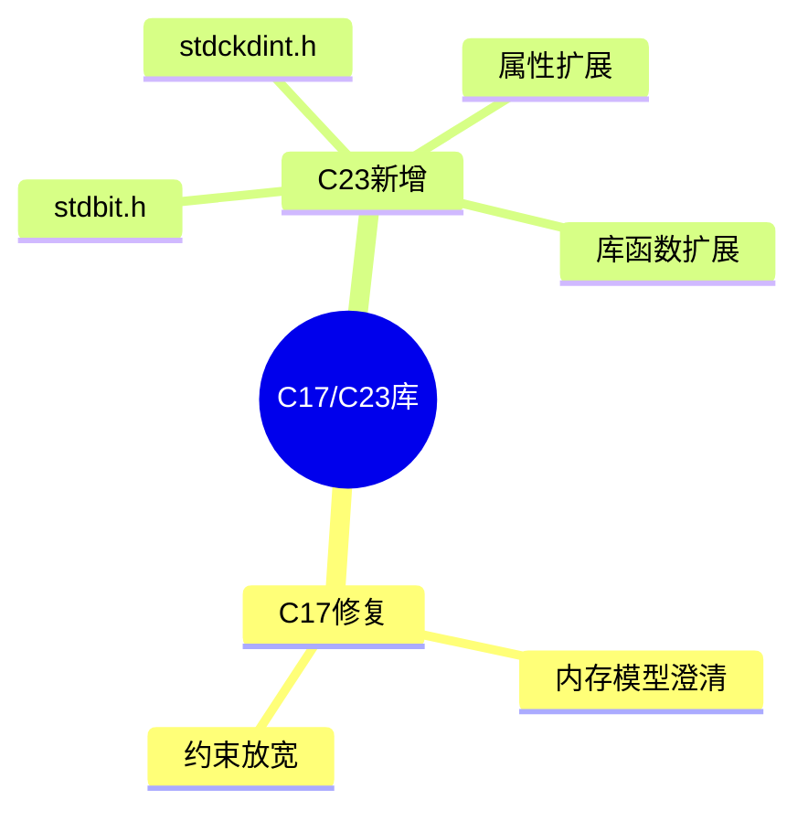

# C17/C23标准库扩展深度解析

> **层级定位**: 01 Core Knowledge System / 04 Standard Library Layer
> **对应标准**: C17/C23
> **难度级别**: L2 理解 → L3 应用
> **预估学习时间**: 2-3 小时

---

## 📋 本节概要

| 属性 | 内容 |
|:-----|:-----|
| **核心概念** | C17修复、C23新增库特性、stdbit.h、标准属性 |
| **前置知识** | C11标准库 |
| **后续延伸** | 未来C标准 |
| **权威来源** | C23提案N3096 |

---

## 🧠 知识结构思维导图



---

## 📖 核心概念详解

### 1. C23新增头文件

#### 1.1 <stdbit.h> - 位操作

```c
// C23引入的位操作标准函数
#include <stdbit.h>

// 字节序转换
uint16_t stdc_leading_zeros_ui16(uint16_t value);  // 前导零个数
uint16_t stdc_leading_ones_ui16(uint16_t value);   // 前导一个数

// 字节序检测
#define stdc_endian_little 0
#define stdc_endian_big 1
#define stdc_endian_native  // 本机字节序

// 字节序转换函数（类似htonl/ntohl）
uint16_t stdc_byteswap_ui16(uint16_t value);
uint32_t stdc_byteswap_ui32(uint32_t value);
uint64_t stdc_byteswap_ui64(uint64_t value);

// 使用示例
uint32_t network_value = stdc_byteswap_ui32(host_value);
```

#### 1.2 <stdckdint.h> - 安全整数运算

```c
// C23: 安全整数运算（带溢出检测）
#include <stdckdint.h>

// 安全加法
int result;
bool overflow = ckd_add(&result, a, b);
if (overflow) {
    // 处理溢出
}

// 安全减法
bool underflow = ckd_sub(&result, a, b);

// 安全乘法
bool mul_overflow = ckd_mul(&result, a, b);

// 示例：安全数组索引计算
size_t index;
if (!ckd_mul(&index, row, width)) {
    if (!ckd_add(&index, index, col)) {
        // index = row * width + col，安全
        access_array(arr, index);
    }
}
```

### 2. C23库函数扩展

```c
// strdup - 动态字符串复制（终于标准化！）
char *strdup(const char *s);           // 分配并复制
char *strndup(const char *s, size_t n); // 最多复制n个字符

// 使用
char *copy = strdup("hello");
free(copy);

// memccpy - 复制直到遇到指定字符
void *memccpy(void *dest, const void *src, int c, size_t n);

// mempcpy - 复制并返回结束位置
void *mempcpy(void *dest, const void *src, size_t n);

// strlcat, strlcpy - 安全的字符串拼接（BSD函数标准化）
size_t strlcat(char *dst, const char *src, size_t dstsize);
size_t strlcpy(char *dst, const char *src, size_t dstsize);
```

### 3. 属性在标准库中的应用

```c
// C23标准属性用于库函数

// [[nodiscard]] 返回值不应忽略
[[nodiscard]] int open(const char *path, int flags);
[[nodiscard]] void *malloc(size_t size);

// 使用
open("file.txt", O_RDONLY);  // 警告：忽略返回值

// [[maybe_unused]] 可能未使用
[[maybe_unused]] static int debug_counter;

// [[deprecated]] 废弃函数
[[deprecated("use fopen_s instead")]] void unsafe_function(void);

// [[reproducible]] 函数无副作用、无状态
[[reproducible]] double sqrt(double x);

// [[unsequenced]] 更严格的约束
[[unsequenced]] int abs(int x);
```

### 4. 静态断言在库中的应用

```c
// C23: 静态断言在更多上下文可用

// 结构体大小检查
struct Header {
    uint32_t magic;
    uint32_t length;
    uint64_t timestamp;
};
static_assert(sizeof(struct Header) == 16, "Header size mismatch");

// 数组大小检查
int buffer[100];
static_assert(sizeof(buffer) / sizeof(buffer[0]) >= 64, "Buffer too small");

// 对齐检查
static_assert(alignof(max_align_t) >= 8, "Insufficient alignment");

// C23: 静态断言消息可选
static_assert(sizeof(void*) == 8);  // 合法
```

---

## ✅ 质量验收清单

- [x] stdbit.h位操作
- [x] stdckdint.h安全整数
- [x] 字符串函数扩展
- [x] 标准属性应用

---

> **更新记录**
> - 2025-03-09: 初版创建
