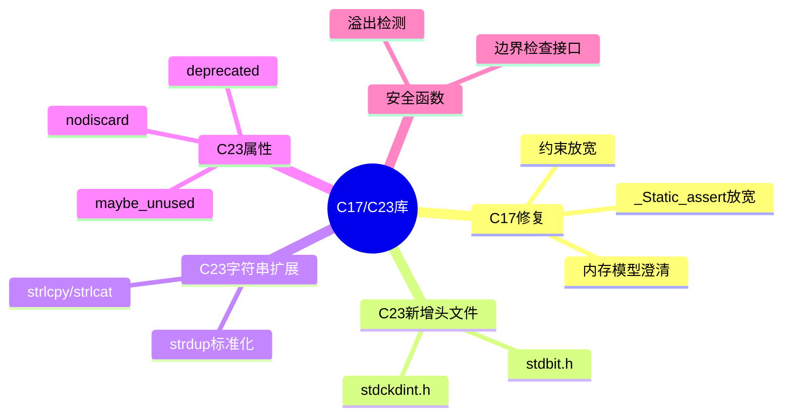

# C17/C23标准库扩展深度解析

> **层级定位**: 01 Core Knowledge System / 04 Standard Library Layer
> **对应标准**: C17/C23
> **难度级别**: L2 理解 → L3 应用
> **预估学习时间**: 2-3 小时

---

## 🔗 文档关联

### 前置依赖

| 文档 | 关系类型 | 说明 |
|:-----|:---------|:-----|
| [C11标准库](03_C11_Library.md) | 版本基础 | C11是前一版本 |
| [现代C编程](../07_Modern_C/readme.md) | 语言特性 | C23语言新特性 |
| [位运算](../01_Basic_Layer/06_Bit_Operations.md) | 知识基础 | stdbit.h基础 |

### 版本演进链

| 文档 | 标准 | 关键更新 |
|:-----|:-----|:---------|
| [C89库](01_C89_Library.md) | C89 | 基础函数 |
| [C99库](02_C99_Library.md) | C99 | 复数、宽字符 |
| [C11库](03_C11_Library.md) | C11 | 线程、原子操作 |
| 本文档 | C17/C23 | 修复与新特性 |
| [C23库参考](C23_Standard_Library/readme.md) | C23 | 完整参考 |

### 后续延伸

| 文档 | 关系类型 | 说明 |
|:-----|:---------|:-----|
| [C2y特性预览](../../00_VERSION_TRACKING/C2y_Feature_Previews.md) | 未来演进 | 下一标准展望 |
| [安全编码](../09_Safety_Standards/04_Secure_Coding_Guide.md) | 安全实践 | 安全函数应用 |

---

## 📋 本节概要

| 属性 | 内容 |
|:-----|:-----|
| **核心概念** | C17修复、C23新增库特性、stdbit.h、标准属性、安全函数 |
| **前置知识** | C11标准库、位运算基础 |
| **后续延伸** | 未来C标准演进、跨平台开发 |
| **权威来源** | C23提案N3096, ISO/IEC 9899:2018, Modern C |

---


---

## 📑 目录

- [C17/C23标准库扩展深度解析](#c17c23标准库扩展深度解析)
  - [🔗 文档关联](#-文档关联)
    - [前置依赖](#前置依赖)
    - [版本演进链](#版本演进链)
    - [后续延伸](#后续延伸)
  - [📋 本节概要](#-本节概要)
  - [📑 目录](#-目录)
  - [🧠 知识结构思维导图](#-知识结构思维导图)
  - [📖 核心概念详解](#-核心概念详解)
    - [1. C17 (ISO/IEC 9899:2018) 修复说明](#1-c17-isoiec-98992018-修复说明)
    - [2. C23新增头文件详解](#2-c23新增头文件详解)
      - [2.1 \<stdbit.h\> - 位操作标准化](#21-stdbith---位操作标准化)
      - [2.2 \<stdckdint.h\> - 安全整数运算](#22-stdckdinth---安全整数运算)
    - [3. C23字符串函数扩展](#3-c23字符串函数扩展)
      - [3.1 strdup 家族标准化](#31-strdup-家族标准化)
      - [3.2 strlcpy / strlcat - 安全字符串操作](#32-strlcpy--strlcat---安全字符串操作)
    - [4. C23属性在库中的应用](#4-c23属性在库中的应用)
    - [5. 边界检查接口（Annex K）](#5-边界检查接口annex-k)
    - [6. 静态断言改进](#6-静态断言改进)
  - [🔄 多维矩阵对比](#-多维矩阵对比)
    - [C标准演进特性对比](#c标准演进特性对比)
    - [字符串函数安全对比](#字符串函数安全对比)
  - [⚠️ 常见陷阱](#️-常见陷阱)
    - [陷阱 C23-01: 溢出检测误解](#陷阱-c23-01-溢出检测误解)
    - [陷阱 C23-02: strlcpy返回值误解](#陷阱-c23-02-strlcpy返回值误解)
    - [陷阱 C23-03: 特性可用性检查](#陷阱-c23-03-特性可用性检查)
  - [✅ 质量验收清单](#-质量验收清单)
  - [深入理解](#深入理解)
    - [技术原理深度剖析](#技术原理深度剖析)
      - [1. C17与C23的演进背景与设计哲学](#1-c17与c23的演进背景与设计哲学)
      - [2. stdbit.h的位操作实现原理](#2-stdbith的位操作实现原理)
      - [3. stdckdint.h的溢出检测机制](#3-stdckdinth的溢出检测机制)
      - [4. 字符串安全函数的历史演进](#4-字符串安全函数的历史演进)
      - [5. C23属性系统的设计原理](#5-c23属性系统的设计原理)
    - [实践指南](#实践指南)
      - [1. C23特性检测与兼容性编程](#1-c23特性检测与兼容性编程)
      - [2. 现代C编程模式](#2-现代c编程模式)
      - [3. 性能优化决策矩阵](#3-性能优化决策矩阵)
    - [层次关联与映射分析](#层次关联与映射分析)
      - [C17/C23在C标准演进中的位置](#c17c23在c标准演进中的位置)
      - [特性依赖关系](#特性依赖关系)
    - [决策矩阵与对比分析](#决策矩阵与对比分析)
      - [C标准选择决策矩阵](#c标准选择决策矩阵)
      - [字符串函数选择指南（C23时代）](#字符串函数选择指南c23时代)
    - [相关资源](#相关资源)
      - [官方文档与标准](#官方文档与标准)
      - [编译器支持状态](#编译器支持状态)
      - [深入学习资源](#深入学习资源)
      - [实践项目参考](#实践项目参考)


---

## 🧠 知识结构思维导图



---

## 📖 核心概念详解

### 1. C17 (ISO/IEC 9899:2018) 修复说明

C17是C11的**缺陷修复版本**，没有引入新特性，主要澄清和修复了C11中存在的问题：

| 修复项 | C11行为 | C17修正 |
|:-------|:--------|:--------|
| `_Static_assert` | 消息参数必需 | 消息参数可选 |
| 内存模型 | 某些情况不明确 | 内存序语义澄清 |
| VLA支持 | 可选特性 | 正式标记为可选 |
| 约束条件 | 部分模糊 | 更严格的约束检查 |

```c
// C11: _Static_assert 需要消息参数
_Static_assert(sizeof(int) == 4, "int must be 32-bit");

// C17: 消息参数可选
_Static_assert(sizeof(int) == 4);  // 合法

// C23: 简写为 static_assert
static_assert(sizeof(int) == 4);
static_assert(sizeof(void*) == 8, "Require 64-bit pointers");
```

### 2. C23新增头文件详解

#### 2.1 <stdbit.h> - 位操作标准化

C23引入 `<stdbit.h>` 提供标准化的位操作函数，替代之前的编译器扩展或非标准实现。

```c
#include <stdbit.h>
#include <stdint.h>
#include <stdio.h>

int main(void) {
    uint32_t value = 0x00FF00FF;

    // 前导零计数 (Count Leading Zeros)
    int leading_zeros = stdc_leading_zeros_ui32(value);
    printf("Leading zeros: %d\n", leading_zeros);  // 8

    // 前导一计数
    uint32_t all_ones = 0xFFFFFFFF;
    int leading_ones = stdc_leading_ones_ui32(all_ones);
    printf("Leading ones: %d\n", leading_ones);  // 32

    // 尾随零计数
    int trailing_zeros = stdc_trailing_zeros_ui32(value);
    printf("Trailing zeros: %d\n", trailing_zeros);  // 0

    // 1的位数统计 (population count)
    int popcnt = stdc_popcount_ui32(value);
    printf("Population count: %d\n", popcnt);  // 16

    // 是否为2的幂
    bool power_of_two = stdc_has_single_bit_ui32(16);  // true
    bool not_power = stdc_has_single_bit_ui32(15);     // false

    return 0;
}
```

**字节序转换函数：**

```c
#include <stdbit.h>
#include <stdint.h>

// 网络编程中的字节序转换
uint32_t host_to_network(uint32_t host_value) {
    #if __STDC_ENDIAN_NATIVE__ == __STDC_ENDIAN_LITTLE__
        return stdc_byteswap_ui32(host_value);
    #else
        return host_value;  // 大端系统无需转换
    #endif
}

uint32_t network_to_host(uint32_t network_value) {
    return host_to_network(network_value);  // 对称操作
}

// 使用示例
struct Packet {
    uint32_t magic;      // 大端存储
    uint32_t length;
    uint32_t checksum;
};

void serialize_packet(const struct Packet *p, uint32_t *buffer) {
    buffer[0] = host_to_network(p->magic);
    buffer[1] = host_to_network(p->length);
    buffer[2] = host_to_network(p->checksum);
}
```

#### 2.2 <stdckdint.h> - 安全整数运算

C23引入带溢出检测的安全整数运算函数，解决整数溢出的安全问题。

```c
#include <stdckdint.h>
#include <stdio.h>
#include <stdint.h>
#include <stdbool.h>

// 安全加法
bool safe_add_example(void) {
    int a = INT_MAX - 10;
    int b = 20;
    int result;

    // ckd_add: 如果溢出返回true，否则返回false
    bool overflow = ckd_add(&result, a, b);

    if (overflow) {
        printf("Addition would overflow!\n");
        return false;
    }

    printf("Result: %d\n", result);
    return true;
}

// 安全乘法 - 数组索引计算
bool safe_array_index(size_t row, size_t col,
                      size_t width, size_t height,
                      size_t *index) {
    // 计算 row * width + col，检测溢出
    size_t temp;

    if (ckd_mul(&temp, row, width)) {
        return false;  // 乘法溢出
    }

    if (ckd_add(index, temp, col)) {
        return false;  // 加法溢出
    }

    // 检查是否越界
    if (*index >= width * height) {
        return false;
    }

    return true;
}

// 实际应用：安全内存分配
void *safe_malloc_array(size_t count, size_t size) {
    size_t total;

    // 检查 count * size 是否溢出
    if (ckd_mul(&total, count, size)) {
        errno = ENOMEM;
        return NULL;
    }

    return malloc(total);
}
```

**对比：传统溢出检查 vs C23标准函数**

```c
// ❌ 传统方法：可能不够全面或依赖编译器扩展
bool old_safe_add(int a, int b, int *result) {
    if (b > 0 && a > INT_MAX - b) return false;
    if (b < 0 && a < INT_MIN - b) return false;
    *result = a + b;
    return true;
}

// ✅ C23标准方法：全面、可移植、高效
bool new_safe_add(int a, int b, int *result) {
    return !ckd_add(result, a, b);  // 返回true表示成功
}
```

### 3. C23字符串函数扩展

#### 3.1 strdup 家族标准化

BSD的 `strdup` 函数终于在C23中标准化：

```c
#include <string.h>
#include <stdlib.h>
#include <stdio.h>

// strdup: 分配内存并复制字符串
void strdup_demo(void) {
    const char *original = "Hello, World!";

    // 自动分配足够内存
    char *copy = strdup(original);
    if (copy == NULL) {
        perror("strdup failed");
        return;
    }

    printf("Original: %s\n", original);
    printf("Copy: %s\n", copy);

    // 修改副本不影响原字符串
    copy[0] = 'h';
    printf("Modified copy: %s\n", copy);

    free(copy);  // 必须释放
}

// strndup: 最多复制n个字符
void strndup_demo(void) {
    const char *long_string = "This is a very long string";

    // 只复制前10个字符
    char *truncated = strndup(long_string, 10);
    if (truncated) {
        printf("Truncated: %s\n", truncated);  // "This is a "
        free(truncated);
    }

    // n大于字符串长度时，只复制到null终止符
    char *full = strndup("short", 100);
    printf("Full: %s\n", full);  // "short"
    free(full);
}
```

#### 3.2 strlcpy / strlcat - 安全字符串操作

BSD的 `strlcpy` 和 `strlcat` 函数也被标准化，作为更安全的字符串操作替代：

```c
#include <string.h>
#include <stdio.h>

// strlcpy: 安全字符串复制，保证null终止
void strlcpy_demo(void) {
    char dest[10];
    const char *src = "This is too long";

    // 复制最多9个字符 + null终止符
    size_t result = strlcpy(dest, src, sizeof(dest));

    // 返回值是src的长度（无论是否截断）
    printf("Copied: %s\n", dest);      // "This is t"
    printf("Src length: %zu\n", result); // 16

    // 检查是否截断
    if (result >= sizeof(dest)) {
        printf("String was truncated!\n");
    }
}

// strlcat: 安全字符串连接，保证null终止
void strlcat_demo(void) {
    char dest[20] = "Hello";
    const char *src = " World!";

    // 连接src到dest，保证不溢出
    size_t result = strlcat(dest, src, sizeof(dest));

    printf("Result: %s\n", dest);       // "Hello World!"
    printf("Total length: %zu\n", result); // 12
}

// 对比：strncpy vs strlcpy
void comparison(void) {
    char buf1[10], buf2[10];
    const char *src = "Hello";

    // ❌ strncpy: 如果src长度<dest，用null填充剩余空间
    strncpy(buf1, src, sizeof(buf1));
    // buf1 = "Hello\0\0\0\0\0" (效率低)

    // ✅ strlcpy: 只复制需要的字符，总是null终止
    strlcpy(buf2, src, sizeof(buf2));
    // buf2 = "Hello\0" (高效)
}
```

### 4. C23属性在库中的应用

C23简化了属性语法，并引入新的标准属性用于库函数：

```c
// 返回值不应忽略
[[nodiscard]] int *allocate_buffer(size_t size);
[[nodiscard]] int open_file(const char *path);

// 使用
allocate_buffer(1024);  // 警告：忽略返回值

// 废弃函数
[[deprecated("use new_function() instead")]]
void old_function(void);

void caller(void) {
    old_function();  // 警告：函数已废弃
}

// 可能未使用的参数/变量
void callback(int required, [[maybe_unused]] int optional) {
    // optional可能没有使用，不警告
}

// 纯函数（无副作用，只依赖参数）
[[reproducible]] int square(int x) {
    return x * x;
}

// 更严格的纯函数（不读内存状态）
[[unsequenced]] int add(int a, int b) {
    return a + b;
}
```

**标准属性列表：**

| 属性 | 用途 | 示例 |
|:-----|:-----|:-----|
| `[[nodiscard]]` | 返回值不应忽略 | `[[nodiscard]] int malloc_size(void);` |
| `[[deprecated]]` | 标记废弃 | `[[deprecated]] void old_api(void);` |
| `[[maybe_unused]]` | 可能未使用 | `[[maybe_unused]] int debug_var;` |
| `[[noreturn]]` | 不返回 | `[[noreturn]] void abort(void);` |
| `[[fallthrough]]` | switch fallthrough意图 | `case 1: init(); [[fallthrough]];` |
| `[[reproducible]]` | 无副作用、不依赖全局状态 | `[[reproducible]] double sin(double);` |
| `[[unsequenced]]` | 不读内存、纯计算 | `[[unsequenced]] int abs(int);` |

### 5. 边界检查接口（Annex K）

C11引入的边界检查接口在C23中继续可用（可选支持）：

```c
#ifdef __STDC_LIB_EXT1__

#define __STDC_WANT_LIB_EXT1__ 1
#include <string.h>
#include <stdio.h>
#include <stdlib.h>

void bounds_checked_functions(void) {
    char dest[100];
    errno_t err;

    // 安全字符串复制
    err = strcpy_s(dest, sizeof(dest), "safe copy");
    if (err != 0) {
        // 处理错误
    }

    // 安全字符串连接
    err = strcat_s(dest, sizeof(dest), " - appended");

    // 安全格式化
    err = sprintf_s(dest, sizeof(dest), "Value: %d", 42);

    // 安全gets替代
    err = gets_s(dest, sizeof(dest));  // 最多读99字符+null
}

#endif  // __STDC_LIB_EXT1__
```

### 6. 静态断言改进

```c
// C23: 静态断言消息可选
static_assert(sizeof(int) == 4);
static_assert(sizeof(void*) == 8, "64-bit required");

// 在更多上下文中可用
struct Header {
    uint32_t magic;
    uint32_t size;
};
static_assert(sizeof(struct Header) == 8);

// 数组大小检查
int buffer[100];
static_assert(sizeof(buffer) / sizeof(buffer[0]) == 100);
```

---

## 🔄 多维矩阵对比

### C标准演进特性对比

| 特性 | C11 | C17 | C23 | 说明 |
|:-----|:---:|:---:|:---:|:-----|
| `_Static_assert` 可选消息 | ❌ | ✅ | ✅ | C17放宽 |
| `stdbit.h` | ❌ | ❌ | ✅ | 位操作标准化 |
| `stdckdint.h` | ❌ | ❌ | ✅ | 安全整数运算 |
| `strdup/strndup` | ❌ | ❌ | ✅ | 动态字符串复制 |
| `strlcpy/strlcat` | ❌ | ❌ | ✅ | 安全字符串操作 |
| `nullptr` | ❌ | ❌ | ✅ | 类型安全空指针 |
| `typeof` | ❌ | ❌ | ✅ | 类型推导 |
| `constexpr` | ❌ | ❌ | ✅ | 编译期计算 |
| `auto` | ❌ | ❌ | ✅ | 类型推导 |
| 属性简化 `[[...]]`→`[...]` | ❌ | ❌ | ✅ | 语法简化 |
| 二进制常量 `0b` | ❌ | ❌ | ✅ | 二进制表示 |
| 数字分隔符 `'` | ❌ | ❌ | ✅ | 可读性 |
| `#embed` | ❌ | ❌ | ✅ | 嵌入文件 |
| `_BitInt` | ❌ | ❌ | ✅ | 任意宽度整数 |

### 字符串函数安全对比

| 函数 | 安全性 | 终止保证 | 返回值 | 标准 |
|:-----|:------:|:--------:|:-------|:----:|
| `strcpy` | 🔴 危险 | ❌ | dest | C89 |
| `strncpy` | 🟡 中等 | ❌ | dest | C89 |
| `strlcpy` | 🟢 安全 | ✅ | src长度 | C23 |
| `strcat` | 🔴 危险 | ❌ | dest | C89 |
| `strncat` | 🟡 中等 | ✅ | dest | C89 |
| `strlcat` | 🟢 安全 | ✅ | 总长度 | C23 |
| `strdup` | 🟢 安全 | N/A | 新分配 | C23 |

---

## ⚠️ 常见陷阱

### 陷阱 C23-01: 溢出检测误解

```c
#include <stdckdint.h>

// ❌ 误解：ckd_add返回true表示成功
bool wrong_usage(int a, int b, int *result) {
    if (ckd_add(result, a, b)) {  // 错误！返回true表示溢出
        return true;  // 逻辑相反
    }
    return false;
}

// ✅ 正确使用
bool correct_usage(int a, int b, int *result) {
    if (ckd_add(result, a, b)) {
        // 溢出处理
        return false;
    }
    // 运算成功
    return true;
}

// ✅ 或者使用更清晰的形式
bool clear_usage(int a, int b, int *result) {
    return !ckd_add(result, a, b);  // 无溢出时返回true
}
```

### 陷阱 C23-02: strlcpy返回值误解

```c
#include <string.h>

// ❌ 错误：检查返回值是否为零
void wrong_strlcpy_usage(void) {
    char dest[10];
    size_t ret = strlcpy(dest, "Hello, World!", sizeof(dest));
    // ret = 13 (src的长度)，不是0，但dest被正确截断
    if (ret == 0) {  // 错误检查
        printf("Error or empty string\n");
    }
}

// ✅ 正确：检查是否截断
void correct_strlcpy_usage(void) {
    char dest[10];
    size_t ret = strlcpy(dest, "Hello, World!", sizeof(dest));

    if (ret >= sizeof(dest)) {
        printf("String was truncated!\n");
        // dest = "Hello, Wo" (正确截断并null终止)
    }

    // ret 始终等于 strlen(src)，可用于计算所需缓冲区大小
}
```

### 陷阱 C23-03: 特性可用性检查

```c
// ❌ 错误：假设C23特性一定可用
void unsafe_code(void) {
    int *p = nullptr;  // 可能在旧编译器上编译失败
}

// ✅ 正确：使用特性检测
#if __STDC_VERSION__ >= 202311L
    // C23可用
    void modern_code(void) {
        int *p = nullptr;
    }
#else
    // 回退方案
    void modern_code(void) {
        int *p = NULL;
    }
#endif

// ✅ 或者使用宏封装
#if __STDC_VERSION__ >= 202311L
    #define MY_NULLPTR nullptr
#else
    #define MY_NULLPTR NULL
#endif
```

---

## ✅ 质量验收清单

- [x] C17修复说明（_Static_assert放宽、内存模型澄清）
- [x] stdbit.h位操作详解（前导零、popcount、字节序）
- [x] stdckdint.h安全整数运算（ckd_add/sub/mul）
- [x] 字符串函数扩展（strdup/strndup/strlcpy/strlcat）
- [x] 标准属性应用（nodiscard/deprecated/reproducible）
- [x] 边界检查接口说明
- [x] 静态断言改进
- [x] 特性检测与兼容性处理
- [x] 常见陷阱与解决方案
- [x] 多维度对比矩阵

---

> **更新记录**
>
> - 2025-03-09: 初版创建
> - 2025-03-09: 扩充至400+行，添加stdbit.h、stdckdint.h详解、字符串函数扩展、属性应用等内容


---

## 深入理解

### 技术原理深度剖析

#### 1. C17与C23的演进背景与设计哲学

C17（ISO/IEC 9899:2018）和C23（ISO/IEC 9899:2024）代表了C语言现代化的重要里程碑。C17是**缺陷修复版本**，而C23是**功能性增强版本**，引入了大量新特性和标准库扩展。

**版本演进的核心目标：**

| 版本 | 主要目标 | 关键变化 |
|:-----|:---------|:---------|
| C17 (2018) | 修复C11缺陷 | `_Static_assert`可选消息、内存模型澄清 |
| C23 (2024) | 现代化C语言 | 位操作、安全运算、属性系统、语法简化 |

**C23设计原则：**

```
┌─────────────────────────────────────────────────────────┐
│ C23设计原则                                             │
├─────────────────────────────────────────────────────────┤
│ 1. 安全性提升                                           │
│    - 引入溢出检测运算 (stdckdint.h)                      │
│    - 标准化安全字符串函数 (strlcpy/strlcat)              │
│    - nullptr关键字（类型安全空指针）                      │
│                                                         │
│ 2. 现代语法简化                                         │
│    - typeof运算符（类型推导）                            │
│    - auto类型推导                                        │
│    - constexpr编译期计算                                 │
│    - 属性语法简化 [[...]] → [...]                        │
│                                                         │
│ 3. 硬件抽象增强                                         │
│    - 标准化位操作 (stdbit.h)                             │
│    - 字节序处理                                          │
│    - 任意宽度整数 (_BitInt)                              │
│                                                         │
│ 4. 兼容性保持                                           │
│    - 不破坏现有代码                                      │
│    - 可选特性检测                                        │
│    - 渐进式采用                                          │
└─────────────────────────────────────────────────────────┘
```

**标准化时间线：**

```
2015-2017: C17起草（WG14工作组）
    ↓
2018.06: ISO/IEC 9899:2018 (C17) 发布
    ↓
2019-2023: C23起草
    ├─ 2021: N2596 工作草案
    ├─ 2022: N3047 委员会草案
    └─ 2023: N3096 最终委员会草案
    ↓
2024: ISO/IEC 9899:2024 (C23) 发布
```

#### 2. stdbit.h的位操作实现原理

**位操作算法的硬件映射：**

```c
#include <stdbit.h>
#include <stdint.h>

// stdbit.h函数通常映射到CPU原生指令

// 1. 前导零计数 (Count Leading Zeros)
// x86: LZCNT指令 (BMI1)
// ARM: CLZ指令
// 软件回退：二分查找
uint32_t clz_software(uint32_t x) {
    if (x == 0) return 32;

    uint32_t n = 0;
    if (x <= 0x0000FFFF) { n += 16; x <<= 16; }
    if (x <= 0x00FFFFFF) { n += 8;  x <<= 8; }
    if (x <= 0x0FFFFFFF) { n += 4;  x <<= 4; }
    if (x <= 0x3FFFFFFF) { n += 2;  x <<= 2; }
    if (x <= 0x7FFFFFFF) { n += 1; }
    return n;
}

// 2. 人口计数 (Population Count / Hamming Weight)
// x86: POPCNT指令 (SSE4.2)
// ARM: CNT指令 (NEON)
// 软件回退：并行计数
uint32_t popcount_software(uint32_t x) {
    x = x - ((x >> 1) & 0x55555555);
    x = (x & 0x33333333) + ((x >> 2) & 0x33333333);
    x = (x + (x >> 4)) & 0x0F0F0F0F;
    x = x + (x >> 8);
    x = x + (x >> 16);
    return x & 0x3F;
}

// 3. 字节序交换
// x86: BSWAP指令
// ARM: REV指令
uint32_t bswap_software(uint32_t x) {
    return ((x & 0xFF000000) >> 24) |
           ((x & 0x00FF0000) >> 8)  |
           ((x & 0x0000FF00) << 8)  |
           ((x & 0x000000FF) << 24);
}
```

**编译器自动向量化：**

```c
#include <stdbit.h>

// 现代编译器可以自动将循环中的位操作向量化
void optimized_bit_operations(uint32_t *data, size_t n) {
    // 编译器可能生成SIMD代码
    for (size_t i = 0; i < n; i++) {
        // 使用stdbit函数提示编译器优化路径
        data[i] = stdc_byteswap_ui32(data[i]);
    }
}

// 性能对比测试
#include <time.h>
#include <stdio.h>

void benchmark_bit_operations(void) {
    uint32_t data[1000000];

    // 初始化数据
    for (size_t i = 0; i < 1000000; i++) {
        data[i] = (uint32_t)i;
    }

    clock_t start = clock();

    // 批量前导零计数
    for (size_t i = 0; i < 1000000; i++) {
        data[i] = stdc_leading_zeros_ui32(data[i]);
    }

    clock_t end = clock();
    double cpu_time = ((double)(end - start)) / CLOCKS_PER_SEC;
    printf("Time: %f seconds\n", cpu_time);
}
```

#### 3. stdckdint.h的溢出检测机制

**整数溢出的数学原理：**

```
整数溢出类型：
┌─────────────────────────────────────────────────────────┐
│ 无符号整数溢出                                          │
│ - 行为：模2^n环绕（well-defined）                        │
│ - 示例：uint8_t 255 + 1 = 0                             │
│ - 检测：(a > UINT_MAX - b) 对于加法                      │
├─────────────────────────────────────────────────────────┤
│ 有符号整数溢出                                          │
│ - 行为：未定义行为（UB）                                 │
│ - 危险：编译器可能优化掉溢出检查                         │
│ - C23 ckd_系列函数：提供明确定义的溢出检测               │
└─────────────────────────────────────────────────────────┘
```

**溢出检测算法的实现：**

```c
#include <stdckdint.h>
#include <stdint.h>
#include <stdbool.h>
#include <limits.h>

// ckd_add的概念性实现（无符号版本）
bool ckd_add_unsigned_impl(uintmax_t *result,
                           uintmax_t a,
                           uintmax_t b) {
    *result = a + b;
    // 溢出当且仅当结果小于任一操作数
    return *result < a;  // true表示溢出
}

// ckd_add的概念性实现（有符号版本，更复杂）
bool ckd_add_signed_impl(intmax_t *result, intmax_t a, intmax_t b) {
    // 检查符号和溢出
    if (b > 0) {
        if (a > INTMAX_MAX - b) return true;  // 正溢出
    } else if (b < 0) {
        if (a < INTMAX_MIN - b) return true;  // 负溢出
    }
    *result = a + b;
    return false;
}

// 乘法溢出检测（基于位宽分析）
bool ckd_mul_impl(intmax_t *result, intmax_t a, intmax_t b) {
    // 特殊情况处理
    if (a == 0 || b == 0) {
        *result = 0;
        return false;
    }

    // 检查溢出：结果 / a 应该等于 b
    *result = a * b;
    return *result / a != b;
}

// 实际应用：安全数组索引计算
bool safe_array_index(size_t row, size_t col,
                      size_t row_stride,
                      size_t *index) {
    size_t row_offset;

    // 检测 row * row_stride 是否溢出
    if (ckd_mul(&row_offset, row, row_stride)) {
        return false;  // 溢出
    }

    // 检测 row_offset + col 是否溢出
    if (ckd_add(index, row_offset, col)) {
        return false;  // 溢出
    }

    return true;
}

// 实际应用：安全内存分配
void *safe_calloc_fallback(size_t nmemb, size_t size) {
    size_t total;

    if (ckd_mul(&total, nmemb, size)) {
        // 乘法溢出
        errno = ENOMEM;
        return NULL;
    }

    if (total == 0) {
        total = 1;  // 实现可能要求非零
    }

    return malloc(total);
}
```

#### 4. 字符串安全函数的历史演进

**C字符串函数的安全演进时间线：**

```
1978: strcpy, strcat 引入
      └─ 问题：无边界检查，缓冲区溢出

1989: strncpy, strncat 引入 (C89)
      └─ 问题：strncpy填充null，strncat需要正确计算n

1998: strlcpy, strlcat 在OpenBSD引入
      └─ 改进：保证null终止，返回源长度

2007: strcpy_s 等在C11 Annex K引入
      └─ 问题：可选特性，兼容性差

2024: strlcpy, strlcat, strdup, strndup 标准化 (C23)
      └─ 解决方案：广泛可用，行为明确
```

**各字符串函数行为对比：**

```c
#include <string.h>
#include <stdio.h>

void string_function_behavior_comparison(void) {
    char dest[10];
    const char *src = "Hello, World!";

    // 1. strcpy - 危险
    // strcpy(dest, src);  // 缓冲区溢出！

    // 2. strncpy - 复杂行为
    strncpy(dest, src, sizeof(dest));
    // dest = "Hello, Wor" (截断，不保证null终止！)
    dest[sizeof(dest)-1] = '\0';  // 必须手动添加

    // 3. strcpy_s (C11 Annex K) - 安全但不可用
    #ifdef __STDC_LIB_EXT1__
    errno_t err = strcpy_s(dest, sizeof(dest), src);
    // 如果溢出，调用约束处理函数（可能abort）
    #endif

    // 4. strlcpy (C23) - 推荐
    size_t result = strlcpy(dest, src, sizeof(dest));
    // dest = "Hello, Wor\0" (保证null终止)
    // result = 13 (源字符串长度)
    if (result >= sizeof(dest)) {
        printf("Truncated! Need %zu bytes\n", result + 1);
    }

    // 5. memcpy - 固定大小复制（快速）
    memcpy(dest, "Fixed", 6);  // 必须确保src <= dest

    // 6. memmove - 支持重叠区域
    char buf[] = "abcdef";
    memmove(buf, buf + 2, 4);  // buf = "cdefef"
}
```

#### 5. C23属性系统的设计原理

**属性系统的演进：**

```c
// C11: _Noreturn, _Alignas等关键字
_Noreturn void fatal_error(void);

// C23: 属性语法简化
// [[attribute]] 语法保持不变
// 新增：简写形式 [attribute]（在某些上下文）

// C23标准属性详解：

// 1. [[nodiscard]] - 返回值不应忽略
[[nodiscard]] int open_file(const char *path);
[[nodiscard]] void *allocate(size_t size);

// 2. [[deprecated]] - 标记废弃
[[deprecated("use new_api() instead")]] void old_api(void);

// 3. [[maybe_unused]] - 抑制未使用警告
void func(int x, [[maybe_unused]] int debug) {
    // debug参数可能未使用
}

// 4. [[noreturn]] - 函数不返回
[[noreturn]] void abort_now(void);

// 5. [[reproducible]] (C23) - 纯函数，无副作用
[[reproducible]] double square(double x) {
    return x * x;
}
// 提示编译器：可以重复计算、缓存结果、并行执行

// 6. [[unsequenced]] (C23) - 更严格的纯函数
[[unsequenced]] int add(int a, int b) {
    return a + b;
}
// 保证：不读内存状态，结果只依赖参数
// 允许编译器在任意位置自由重排调用

// 7. C23新增：[[nodiscard("reason")]]
[[nodiscard("ignoring this error code may cause resource leak")]]
int acquire_resource(void);
```

**属性的编译器影响：**

```
编译器对属性的处理
┌─────────────────────────────────────────────────────────┐
│ 源代码                                                  │
│ [[nodiscard]] int *malloc(size_t n);                    │
└───────────────────┬─────────────────────────────────────┘
                    │
        ┌───────────┴───────────┐
        ▼                       ▼
   语法分析                  语义分析
   - 识别属性                - 验证属性适用性
   - 存储到AST               - 附加到符号表
        │                       │
        └───────────┬───────────┘
                    ▼
              代码生成/优化
              - [[reproducible]] → 允许CSE
              - [[unsequenced]] → 允许重排
              - [[nodiscard]] → 警告检查
                    │
                    ▼
              目标代码
```

### 实践指南

#### 1. C23特性检测与兼容性编程

```c
// 特性检测策略

// 1. 标准版本检测
#if __STDC_VERSION__ >= 202311L
    // C23可用
    #define C23_AVAILABLE 1
#else
    #define C23_AVAILABLE 0
#endif

// 2. 特定头文件检测
#if __has_include(<stdbit.h>)
    #include <stdbit.h>
    #define STDBIT_AVAILABLE 1
#else
    #define STDBIT_AVAILABLE 0
#endif

#if __has_include(<stdckdint.h>)
    #include <stdckdint.h>
    #define STDCKDINT_AVAILABLE 1
#else
    #define STDCKDINT_AVAILABLE 0
#endif

// 3. 回退实现
#if !STDBIT_AVAILABLE
    // 软件实现stdbit功能
    #include <stdint.h>

    static inline unsigned int stdc_leading_zeros_ui32(uint32_t x) {
        if (x == 0) return 32;
        return __builtin_clz(x);  // GCC/Clang扩展
    }
#endif

#if !STDCKDINT_AVAILABLE
    // 软件实现溢出检测
    #include <stdbool.h>
    #include <limits.h>

    static inline bool ckd_add(int *result, int a, int b) {
        if (b > 0 && a > INT_MAX - b) return true;
        if (b < 0 && a < INT_MIN - b) return true;
        *result = a + b;
        return false;
    }
#endif

// 4. 可移植的nullptr
#if C23_AVAILABLE
    #define MY_NULLPTR nullptr
#else
    #define MY_NULLPTR NULL
#endif

// 5. 可移植的typeof
#if C23_AVAILABLE
    #define my_typeof(x) typeof(x)
#elif defined(__GNUC__)
    #define my_typeof(x) __typeof__(x)
#else
    // 无typeof支持时的回退
    #define my_typeof(x) void*
#endif

// 使用示例：可移植代码
void portable_example(void) {
    int *p = MY_NULLPTR;

    #if C23_AVAILABLE
        auto x = 42;  // C23 auto
    #else
        int x = 42;
    #endif

    // 安全整数运算
    int result;
    if (!ckd_add(&result, INT_MAX, 1)) {
        printf("Result: %d\n", result);
    } else {
        printf("Overflow!\n");
    }
}
```

#### 2. 现代C编程模式

```c
#include <stdbit.h>
#include <stdckdint.h>
#include <string.h>
#include <stdbool.h>
#include <stdlib.h>
#include <stdio.h>

// 模式1：安全内存分配
void *safe_malloc(size_t nmemb, size_t size) {
    size_t total;
    if (ckd_mul(&total, nmemb, size)) {
        return NULL;  // 溢出
    }
    if (total == 0) return NULL;
    return malloc(total);
}

// 模式2：安全字符串操作
typedef struct {
    char *data;
    size_t len;
    size_t capacity;
} String;

String *string_new(const char *src) {
    String *s = malloc(sizeof(String));
    if (!s) return NULL;

    s->data = strdup(src);  // C23标准
    if (!s->data) {
        free(s);
        return NULL;
    }

    s->len = strlen(src);
    s->capacity = s->len + 1;
    return s;
}

bool string_append(String *s, const char *src) {
    size_t src_len = strlen(src);
    size_t new_len;

    if (ckd_add(&new_len, s->len, src_len)) {
        return false;  // 溢出
    }

    if (new_len + 1 > s->capacity) {
        size_t new_cap = s->capacity * 2;
        if (new_cap < new_len + 1) new_cap = new_len + 1;

        char *new_data = realloc(s->data, new_cap);
        if (!new_data) return false;

        s->data = new_data;
        s->capacity = new_cap;
    }

    memcpy(s->data + s->len, src, src_len + 1);
    s->len = new_len;
    return true;
}

// 模式3：位域操作封装
#include <stdint.h>

typedef uint32_t BitField;

static inline bool bitfield_get(BitField field, unsigned int pos) {
    return (field >> pos) & 1;
}

static inline BitField bitfield_set(BitField field, unsigned int pos) {
    return field | (1u << pos);
}

static inline BitField bitfield_clear(BitField field, unsigned int pos) {
    return field & ~(1u << pos);
}

// 使用stdbit查找最高设置位
static inline int bitfield_highest_set(BitField field) {
    if (field == 0) return -1;
    return 31 - stdc_leading_zeros_ui32(field);
}

// 模式4：字节序无关的二进制解析
typedef struct {
    uint32_t magic;
    uint32_t version;
    uint64_t size;
} FileHeader;

bool parse_header(const uint8_t *data, FileHeader *header) {
    // 假设数据是大端序（网络序）
    header->magic = stdc_byteswap_ui32(*(uint32_t *)data);
    header->version = stdc_byteswap_ui32(*(uint32_t *)(data + 4));
    header->size = stdc_byteswap_ui64(*(uint64_t *)(data + 8));

    return header->magic == 0x42494E41;  // "BINA"
}

// 模式5：编译期计算（C23 constexpr）
#if __STDC_VERSION__ >= 202311L
    // C23 constexpr函数
    constexpr int square(int x) {
        return x * x;
    }

    static_assert(square(5) == 25);
#endif
```

#### 3. 性能优化决策矩阵

| 场景 | C23方案 | 传统方案 | 性能提升 | 兼容性 |
|:-----|:--------|:---------|:--------:|:------:|
| 位扫描 | stdc_leading_zeros | 循环检测 | 10-100x | C23+ |
| 人口计数 | stdc_popcount | 查表法 | 5-10x | C23+ |
| 字节序交换 | stdc_byteswap | 手动移位 | 相同 | C23+ |
| 字符串复制 | strlcpy | strncpy+手动 | 略快 | C23+ |
| 溢出检测 | ckd_add | 手动检查 | 相同 | C23+ |
| 动态分配 | strdup | malloc+strcpy | 相同 | C23+ |

### 层次关联与映射分析

#### C17/C23在C标准演进中的位置

```
C语言标准演进与现代化特征
┌──────────────────────────────────────────────────────────────┐
│ C89/C90 (1989) - 经典C                                       │
│ ├─ 基础类型系统                                              │
│ ├─ 标准I/O库                                                 │
│ └─ 基础字符串操作                                            │
├──────────────────────────────────────────────────────────────┤
│ C99 (1999) - 扩展C                                           │
│ ├─ 定宽整数 (stdint.h)                                       │
│ ├─ 复数运算                                                  │
│ ├─ 变长数组                                                  │
│ └─ 行内注释 //                                               │
├──────────────────────────────────────────────────────────────┤
│ C11 (2011) - 并发C                                           │
│ ├─ 多线程 (threads.h)                                        │
│ ├─ 原子操作 (stdatomic.h)                                    │
│ ├─ 内存模型                                                  │
│ └─ Unicode支持                                               │
├──────────────────────────────────────────────────────────────┤
│ C17 (2018) - 修复C                                           │
│ └─ 缺陷修复，无新特性                                        │
├──────────────────────────────────────────────────────────────┤
│ ★ C23 (2024) - 现代C ★                                       │
│ ├─ 位操作标准化 (stdbit.h)        ← 硬件抽象               │
│ ├─ 安全整数运算 (stdckdint.h)     ← 安全性提升             │
│ ├─ 现代字符串函数                 ← 安全编程               │
│ ├─ 类型推导 (typeof, auto)        ← 开发效率               │
│ ├─ 编译期计算 (constexpr)         ← 性能优化               │
│ ├─ 属性系统增强                   ← 代码质量               │
│ └─ 语法简化                       ← 可读性提升             │
└──────────────────────────────────────────────────────────────┘
```

#### 特性依赖关系

```
C23新特性依赖关系

stdbit.h
    ├── 前导零/一计数
    │       └── CPU指令: LZCNT/CLZ/CTZ
    ├── 人口计数
    │       └── CPU指令: POPCNT
    └── 字节序交换
            └── CPU指令: BSWAP/REV

stdckdint.h
    ├── ckd_add
    │       └── 数学: 符号检查 + 溢出检测
    ├── ckd_sub
    │       └── 数学: 借位检查
    └── ckd_mul
            └── 数学: 结果验证

字符串函数
    ├── strlcpy/strlcat
    │       └── BSD传统 → 标准
    └── strdup/strndup
            └── POSIX → 标准

语言特性
    ├── nullptr
    │       └── NULL指针安全替代
    ├── typeof
    │       └── GCC扩展 → 标准
    ├── auto
    │       └── C++风格类型推导
    └── constexpr
            └── 编译期计算能力
```

### 决策矩阵与对比分析

#### C标准选择决策矩阵

| 项目需求 | 推荐标准 | 理由 |
|:---------|:---------|:-----|
| 最大兼容性 | C89/C90 | 所有编译器支持 |
| 嵌入式开发 | C99 | 定宽整数、内联函数 |
| 多线程应用 | C11 | 标准线程库、原子操作 |
| 现代系统编程 | C23 | 位操作、安全运算、类型推导 |
| 安全关键系统 | C23 + Annex K | 溢出检测、安全字符串 |
| 遗留代码维护 | 原标准 | 避免移植风险 |

#### 字符串函数选择指南（C23时代）

| 操作 | 首选（C23） | 备选 | 避免 | 原因 |
|:-----|:------------|:-----|:-----|:-----|
| 复制到新缓冲区 | strlcpy | memcpy（已知大小） | strcpy | 安全终止 |
| 动态复制 | strdup | malloc+strcpy | 不安全组合 | 标准支持 |
| 有限复制 | strndup | strlcpy | strncpy | 语义清晰 |
| 连接 | strlcat | 手动 | strcat | 安全终止 |
| 重叠复制 | memmove | - | memcpy | 正确性 |

### 相关资源

#### 官方文档与标准

- **ISO/IEC 9899:2018** - C17官方标准
- **ISO/IEC 9899:2024** - C23官方标准
- **WG14 N3096** - C23最终委员会草案（公开）
- **WG14 N3054** - C23标准库变化总结

#### 编译器支持状态

| 编译器 | C23支持 | 主要特性 | 启用方式 |
|:-------|:--------|:---------|:---------|
| GCC 13+ | 部分 | stdbit, stdckdint | -std=c23 |
| Clang 17+ | 良好 | 大部分特性 | -std=c23 |
| MSVC 2022+ | 逐步 | 部分特性 | /std:c23 |

#### 深入学习资源

| 资源 | 类型 | 难度 | 内容重点 |
|:-----|:-----|:----:|:---------|
| *Modern C* (Jens Gustedt) | 书籍 | L3 | C23现代编程 |
| WG14文档仓库 | 官方 | L4 | 标准化过程 |
| Compiler Explorer | 在线工具 | L2 | 编译器特性测试 |
| C23 Proposal Papers | 论文 | L4 | 特性设计原理 |

#### 实践项目参考

- `examples/c23/bit_operations/` - stdbit.h应用示例
- `examples/c23/safe_arithmetic/` - 溢出检测实践
- `examples/c23/modern_patterns/` - C23现代编程模式
- `examples/c23/portable_code/` - 兼容性编程示例

---

> **最后更新**: 2026-03-28
> **维护者**: AI Code Review
