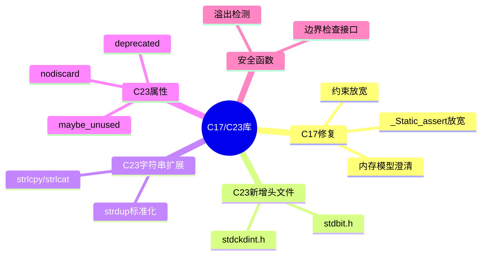

# C17/C23标准库扩展深度解析

> **层级定位**: 01 Core Knowledge System / 04 Standard Library Layer
> **对应标准**: C17/C23
> **难度级别**: L2 理解 → L3 应用
> **预估学习时间**: 2-3 小时

---

## 📋 本节概要

| 属性 | 内容 |
|:-----|:-----|
| **核心概念** | C17修复、C23新增库特性、stdbit.h、标准属性、安全函数 |
| **前置知识** | C11标准库、位运算基础 |
| **后续延伸** | 未来C标准演进、跨平台开发 |
| **权威来源** | C23提案N3096, ISO/IEC 9899:2018, Modern C |

---

## 🧠 知识结构思维导图



---

## 📖 核心概念详解

### 1. C17 (ISO/IEC 9899:2018) 修复说明

C17是C11的**缺陷修复版本**，没有引入新特性，主要澄清和修复了C11中存在的问题：

| 修复项 | C11行为 | C17修正 |
|:-------|:--------|:--------|
| `_Static_assert` | 消息参数必需 | 消息参数可选 |
| 内存模型 | 某些情况不明确 | 内存序语义澄清 |
| VLA支持 | 可选特性 | 正式标记为可选 |
| 约束条件 | 部分模糊 | 更严格的约束检查 |

```c
// C11: _Static_assert 需要消息参数
_Static_assert(sizeof(int) == 4, "int must be 32-bit");

// C17: 消息参数可选
_Static_assert(sizeof(int) == 4);  // 合法

// C23: 简写为 static_assert
static_assert(sizeof(int) == 4);
static_assert(sizeof(void*) == 8, "Require 64-bit pointers");
```

### 2. C23新增头文件详解

#### 2.1 <stdbit.h> - 位操作标准化

C23引入 `<stdbit.h>` 提供标准化的位操作函数，替代之前的编译器扩展或非标准实现。

```c
#include <stdbit.h>
#include <stdint.h>
#include <stdio.h>

int main(void) {
    uint32_t value = 0x00FF00FF;

    // 前导零计数 (Count Leading Zeros)
    int leading_zeros = stdc_leading_zeros_ui32(value);
    printf("Leading zeros: %d\n", leading_zeros);  // 8

    // 前导一计数
    uint32_t all_ones = 0xFFFFFFFF;
    int leading_ones = stdc_leading_ones_ui32(all_ones);
    printf("Leading ones: %d\n", leading_ones);  // 32

    // 尾随零计数
    int trailing_zeros = stdc_trailing_zeros_ui32(value);
    printf("Trailing zeros: %d\n", trailing_zeros);  // 0

    // 1的位数统计 (population count)
    int popcnt = stdc_popcount_ui32(value);
    printf("Population count: %d\n", popcnt);  // 16

    // 是否为2的幂
    bool power_of_two = stdc_has_single_bit_ui32(16);  // true
    bool not_power = stdc_has_single_bit_ui32(15);     // false

    return 0;
}
```

**字节序转换函数：**

```c
#include <stdbit.h>
#include <stdint.h>

// 网络编程中的字节序转换
uint32_t host_to_network(uint32_t host_value) {
    #if __STDC_ENDIAN_NATIVE__ == __STDC_ENDIAN_LITTLE__
        return stdc_byteswap_ui32(host_value);
    #else
        return host_value;  // 大端系统无需转换
    #endif
}

uint32_t network_to_host(uint32_t network_value) {
    return host_to_network(network_value);  // 对称操作
}

// 使用示例
struct Packet {
    uint32_t magic;      // 大端存储
    uint32_t length;
    uint32_t checksum;
};

void serialize_packet(const struct Packet *p, uint32_t *buffer) {
    buffer[0] = host_to_network(p->magic);
    buffer[1] = host_to_network(p->length);
    buffer[2] = host_to_network(p->checksum);
}
```

#### 2.2 <stdckdint.h> - 安全整数运算

C23引入带溢出检测的安全整数运算函数，解决整数溢出的安全问题。

```c
#include <stdckdint.h>
#include <stdio.h>
#include <stdint.h>
#include <stdbool.h>

// 安全加法
bool safe_add_example(void) {
    int a = INT_MAX - 10;
    int b = 20;
    int result;

    // ckd_add: 如果溢出返回true，否则返回false
    bool overflow = ckd_add(&result, a, b);

    if (overflow) {
        printf("Addition would overflow!\n");
        return false;
    }

    printf("Result: %d\n", result);
    return true;
}

// 安全乘法 - 数组索引计算
bool safe_array_index(size_t row, size_t col,
                      size_t width, size_t height,
                      size_t *index) {
    // 计算 row * width + col，检测溢出
    size_t temp;

    if (ckd_mul(&temp, row, width)) {
        return false;  // 乘法溢出
    }

    if (ckd_add(index, temp, col)) {
        return false;  // 加法溢出
    }

    // 检查是否越界
    if (*index >= width * height) {
        return false;
    }

    return true;
}

// 实际应用：安全内存分配
void *safe_malloc_array(size_t count, size_t size) {
    size_t total;

    // 检查 count * size 是否溢出
    if (ckd_mul(&total, count, size)) {
        errno = ENOMEM;
        return NULL;
    }

    return malloc(total);
}
```

**对比：传统溢出检查 vs C23标准函数**

```c
// ❌ 传统方法：可能不够全面或依赖编译器扩展
bool old_safe_add(int a, int b, int *result) {
    if (b > 0 && a > INT_MAX - b) return false;
    if (b < 0 && a < INT_MIN - b) return false;
    *result = a + b;
    return true;
}

// ✅ C23标准方法：全面、可移植、高效
bool new_safe_add(int a, int b, int *result) {
    return !ckd_add(result, a, b);  // 返回true表示成功
}
```

### 3. C23字符串函数扩展

#### 3.1 strdup 家族标准化

BSD的 `strdup` 函数终于在C23中标准化：

```c
#include <string.h>
#include <stdlib.h>
#include <stdio.h>

// strdup: 分配内存并复制字符串
void strdup_demo(void) {
    const char *original = "Hello, World!";

    // 自动分配足够内存
    char *copy = strdup(original);
    if (copy == NULL) {
        perror("strdup failed");
        return;
    }

    printf("Original: %s\n", original);
    printf("Copy: %s\n", copy);

    // 修改副本不影响原字符串
    copy[0] = 'h';
    printf("Modified copy: %s\n", copy);

    free(copy);  // 必须释放
}

// strndup: 最多复制n个字符
void strndup_demo(void) {
    const char *long_string = "This is a very long string";

    // 只复制前10个字符
    char *truncated = strndup(long_string, 10);
    if (truncated) {
        printf("Truncated: %s\n", truncated);  // "This is a "
        free(truncated);
    }

    // n大于字符串长度时，只复制到null终止符
    char *full = strndup("short", 100);
    printf("Full: %s\n", full);  // "short"
    free(full);
}
```

#### 3.2 strlcpy / strlcat - 安全字符串操作

BSD的 `strlcpy` 和 `strlcat` 函数也被标准化，作为更安全的字符串操作替代：

```c
#include <string.h>
#include <stdio.h>

// strlcpy: 安全字符串复制，保证null终止
void strlcpy_demo(void) {
    char dest[10];
    const char *src = "This is too long";

    // 复制最多9个字符 + null终止符
    size_t result = strlcpy(dest, src, sizeof(dest));

    // 返回值是src的长度（无论是否截断）
    printf("Copied: %s\n", dest);      // "This is t"
    printf("Src length: %zu\n", result); // 16

    // 检查是否截断
    if (result >= sizeof(dest)) {
        printf("String was truncated!\n");
    }
}

// strlcat: 安全字符串连接，保证null终止
void strlcat_demo(void) {
    char dest[20] = "Hello";
    const char *src = " World!";

    // 连接src到dest，保证不溢出
    size_t result = strlcat(dest, src, sizeof(dest));

    printf("Result: %s\n", dest);       // "Hello World!"
    printf("Total length: %zu\n", result); // 12
}

// 对比：strncpy vs strlcpy
void comparison(void) {
    char buf1[10], buf2[10];
    const char *src = "Hello";

    // ❌ strncpy: 如果src长度<dest，用null填充剩余空间
    strncpy(buf1, src, sizeof(buf1));
    // buf1 = "Hello\0\0\0\0\0" (效率低)

    // ✅ strlcpy: 只复制需要的字符，总是null终止
    strlcpy(buf2, src, sizeof(buf2));
    // buf2 = "Hello\0" (高效)
}
```

### 4. C23属性在库中的应用

C23简化了属性语法，并引入新的标准属性用于库函数：

```c
// 返回值不应忽略
[[nodiscard]] int *allocate_buffer(size_t size);
[[nodiscard]] int open_file(const char *path);

// 使用
allocate_buffer(1024);  // 警告：忽略返回值

// 废弃函数
[[deprecated("use new_function() instead")]]
void old_function(void);

void caller(void) {
    old_function();  // 警告：函数已废弃
}

// 可能未使用的参数/变量
void callback(int required, [[maybe_unused]] int optional) {
    // optional可能没有使用，不警告
}

// 纯函数（无副作用，只依赖参数）
[[reproducible]] int square(int x) {
    return x * x;
}

// 更严格的纯函数（不读内存状态）
[[unsequenced]] int add(int a, int b) {
    return a + b;
}
```

**标准属性列表：**

| 属性 | 用途 | 示例 |
|:-----|:-----|:-----|
| `[[nodiscard]]` | 返回值不应忽略 | `[[nodiscard]] int malloc_size(void);` |
| `[[deprecated]]` | 标记废弃 | `[[deprecated]] void old_api(void);` |
| `[[maybe_unused]]` | 可能未使用 | `[[maybe_unused]] int debug_var;` |
| `[[noreturn]]` | 不返回 | `[[noreturn]] void abort(void);` |
| `[[fallthrough]]` | switch fallthrough意图 | `case 1: init(); [[fallthrough]];` |
| `[[reproducible]]` | 无副作用、不依赖全局状态 | `[[reproducible]] double sin(double);` |
| `[[unsequenced]]` | 不读内存、纯计算 | `[[unsequenced]] int abs(int);` |

### 5. 边界检查接口（Annex K）

C11引入的边界检查接口在C23中继续可用（可选支持）：

```c
#ifdef __STDC_LIB_EXT1__

#define __STDC_WANT_LIB_EXT1__ 1
#include <string.h>
#include <stdio.h>
#include <stdlib.h>

void bounds_checked_functions(void) {
    char dest[100];
    errno_t err;

    // 安全字符串复制
    err = strcpy_s(dest, sizeof(dest), "safe copy");
    if (err != 0) {
        // 处理错误
    }

    // 安全字符串连接
    err = strcat_s(dest, sizeof(dest), " - appended");

    // 安全格式化
    err = sprintf_s(dest, sizeof(dest), "Value: %d", 42);

    // 安全gets替代
    err = gets_s(dest, sizeof(dest));  // 最多读99字符+null
}

#endif  // __STDC_LIB_EXT1__
```

### 6. 静态断言改进

```c
// C23: 静态断言消息可选
static_assert(sizeof(int) == 4);
static_assert(sizeof(void*) == 8, "64-bit required");

// 在更多上下文中可用
struct Header {
    uint32_t magic;
    uint32_t size;
};
static_assert(sizeof(struct Header) == 8);

// 数组大小检查
int buffer[100];
static_assert(sizeof(buffer) / sizeof(buffer[0]) == 100);
```

---

## 🔄 多维矩阵对比

### C标准演进特性对比

| 特性 | C11 | C17 | C23 | 说明 |
|:-----|:---:|:---:|:---:|:-----|
| `_Static_assert` 可选消息 | ❌ | ✅ | ✅ | C17放宽 |
| `stdbit.h` | ❌ | ❌ | ✅ | 位操作标准化 |
| `stdckdint.h` | ❌ | ❌ | ✅ | 安全整数运算 |
| `strdup/strndup` | ❌ | ❌ | ✅ | 动态字符串复制 |
| `strlcpy/strlcat` | ❌ | ❌ | ✅ | 安全字符串操作 |
| `nullptr` | ❌ | ❌ | ✅ | 类型安全空指针 |
| `typeof` | ❌ | ❌ | ✅ | 类型推导 |
| `constexpr` | ❌ | ❌ | ✅ | 编译期计算 |
| `auto` | ❌ | ❌ | ✅ | 类型推导 |
| 属性简化 `[[...]]`→`[...]` | ❌ | ❌ | ✅ | 语法简化 |
| 二进制常量 `0b` | ❌ | ❌ | ✅ | 二进制表示 |
| 数字分隔符 `'` | ❌ | ❌ | ✅ | 可读性 |
| `#embed` | ❌ | ❌ | ✅ | 嵌入文件 |
| `_BitInt` | ❌ | ❌ | ✅ | 任意宽度整数 |

### 字符串函数安全对比

| 函数 | 安全性 | 终止保证 | 返回值 | 标准 |
|:-----|:------:|:--------:|:-------|:----:|
| `strcpy` | 🔴 危险 | ❌ | dest | C89 |
| `strncpy` | 🟡 中等 | ❌ | dest | C89 |
| `strlcpy` | 🟢 安全 | ✅ | src长度 | C23 |
| `strcat` | 🔴 危险 | ❌ | dest | C89 |
| `strncat` | 🟡 中等 | ✅ | dest | C89 |
| `strlcat` | 🟢 安全 | ✅ | 总长度 | C23 |
| `strdup` | 🟢 安全 | N/A | 新分配 | C23 |

---

## ⚠️ 常见陷阱

### 陷阱 C23-01: 溢出检测误解

```c
#include <stdckdint.h>

// ❌ 误解：ckd_add返回true表示成功
bool wrong_usage(int a, int b, int *result) {
    if (ckd_add(result, a, b)) {  // 错误！返回true表示溢出
        return true;  // 逻辑相反
    }
    return false;
}

// ✅ 正确使用
bool correct_usage(int a, int b, int *result) {
    if (ckd_add(result, a, b)) {
        // 溢出处理
        return false;
    }
    // 运算成功
    return true;
}

// ✅ 或者使用更清晰的形式
bool clear_usage(int a, int b, int *result) {
    return !ckd_add(result, a, b);  // 无溢出时返回true
}
```

### 陷阱 C23-02: strlcpy返回值误解

```c
#include <string.h>

// ❌ 错误：检查返回值是否为零
void wrong_strlcpy_usage(void) {
    char dest[10];
    size_t ret = strlcpy(dest, "Hello, World!", sizeof(dest));
    // ret = 13 (src的长度)，不是0，但dest被正确截断
    if (ret == 0) {  // 错误检查
        printf("Error or empty string\n");
    }
}

// ✅ 正确：检查是否截断
void correct_strlcpy_usage(void) {
    char dest[10];
    size_t ret = strlcpy(dest, "Hello, World!", sizeof(dest));

    if (ret >= sizeof(dest)) {
        printf("String was truncated!\n");
        // dest = "Hello, Wo" (正确截断并null终止)
    }

    // ret 始终等于 strlen(src)，可用于计算所需缓冲区大小
}
```

### 陷阱 C23-03: 特性可用性检查

```c
// ❌ 错误：假设C23特性一定可用
void unsafe_code(void) {
    int *p = nullptr;  // 可能在旧编译器上编译失败
}

// ✅ 正确：使用特性检测
#if __STDC_VERSION__ >= 202311L
    // C23可用
    void modern_code(void) {
        int *p = nullptr;
    }
#else
    // 回退方案
    void modern_code(void) {
        int *p = NULL;
    }
#endif

// ✅ 或者使用宏封装
#if __STDC_VERSION__ >= 202311L
    #define MY_NULLPTR nullptr
#else
    #define MY_NULLPTR NULL
#endif
```

---

## ✅ 质量验收清单

- [x] C17修复说明（_Static_assert放宽、内存模型澄清）
- [x] stdbit.h位操作详解（前导零、popcount、字节序）
- [x] stdckdint.h安全整数运算（ckd_add/sub/mul）
- [x] 字符串函数扩展（strdup/strndup/strlcpy/strlcat）
- [x] 标准属性应用（nodiscard/deprecated/reproducible）
- [x] 边界检查接口说明
- [x] 静态断言改进
- [x] 特性检测与兼容性处理
- [x] 常见陷阱与解决方案
- [x] 多维度对比矩阵

---

> **更新记录**
>
> - 2025-03-09: 初版创建
> - 2025-03-09: 扩充至400+行，添加stdbit.h、stdckdint.h详解、字符串函数扩展、属性应用等内容
