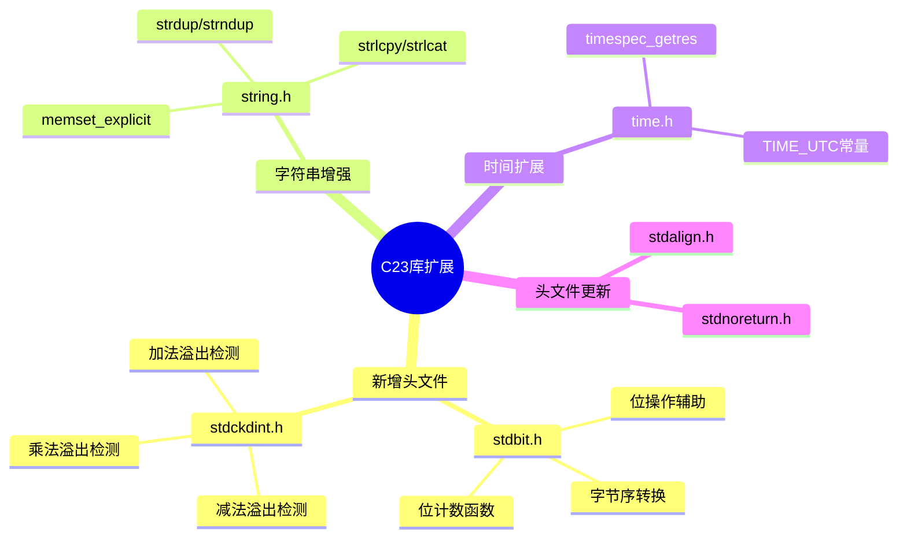

# C23标准库扩展完全参考

> **层级定位**: 01 Core Knowledge System / 04 Standard Library Layer
> **对应标准**: C23 (ISO/IEC 9899:2024)
> **难度级别**: L2 理解 → L4 分析
> **预估学习时间**: 4-6 小时

---

## 目录

- [C23标准库扩展完全参考](#c23标准库扩展完全参考)
  - [目录](#目录)
  - [📋 本节概要](#-本节概要)
  - [🧠 知识结构思维导图](#-知识结构思维导图)
  - [📖 核心概念详解](#-核心概念详解)
  - [1. \<stdbit.h\> - 位操作标准化](#1-stdbith---位操作标准化)
    - [1.1 设计目标与特性](#11-设计目标与特性)
    - [1.2 字节序常量](#12-字节序常量)
    - [1.3 字节序转换函数](#13-字节序转换函数)
    - [1.4 前导零计数函数 (Count Leading Zeros)](#14-前导零计数函数-count-leading-zeros)
    - [1.5 前导一计数函数 (Count Leading Ones)](#15-前导一计数函数-count-leading-ones)
    - [1.6 尾随零计数函数 (Count Trailing Zeros)](#16-尾随零计数函数-count-trailing-zeros)
    - [1.7 尾随一计数函数 (Count Trailing Ones)](#17-尾随一计数函数-count-trailing-ones)
    - [1.8 1的位数统计 (Population Count)](#18-1的位数统计-population-count)
    - [1.9 单一位检测函数](#19-单一位检测函数)
    - [1.10 位宽度计算函数](#110-位宽度计算函数)
    - [1.11 位向上/向下取整函数](#111-位向上向下取整函数)
    - [1.12 \<stdbit.h\> 完整综合示例](#112-stdbith-完整综合示例)
  - [2. \<stdckdint.h\> - 安全整数运算](#2-stdckdinth---安全整数运算)
    - [2.1 设计目标](#21-设计目标)
    - [2.2 函数签名与语义](#22-函数签名与语义)
    - [2.3 加法溢出检测](#23-加法溢出检测)
    - [2.4 减法溢出检测](#24-减法溢出检测)
    - [2.5 乘法溢出检测](#25-乘法溢出检测)
    - [2.6 复合安全运算模式](#26-复合安全运算模式)
    - [2.7 与此前方法的对比](#27-与此前方法的对比)
  - [3. \<string.h\> 增强](#3-stringh-增强)
    - [3.1 memset\_explicit - 安全内存清除](#31-memset_explicit---安全内存清除)
    - [3.2 strdup 和 strndup - 动态字符串复制](#32-strdup-和-strndup---动态字符串复制)
    - [3.3 strlcpy 和 strlcat - 安全字符串操作](#33-strlcpy-和-strlcat---安全字符串操作)
  - [4. \<time.h\> 增强](#4-timeh-增强)
    - [4.1 timespec\_getres - 时钟分辨率查询](#41-timespec_getres---时钟分辨率查询)
    - [4.2 timespec\_get 更新](#42-timespec_get-更新)
  - [5. \<stdalign.h\> 更新](#5-stdalignh-更新)
  - [6. \<stdnoreturn.h\> 更新](#6-stdnoreturnh-更新)
  - [🔄 多维矩阵对比](#-多维矩阵对比)
    - [C23新增标准库特性对比](#c23新增标准库特性对比)
    - [字符串函数安全性对比](#字符串函数安全性对比)
    - [整数溢出检测方法对比](#整数溢出检测方法对比)
  - [⚠️ 常见陷阱](#️-常见陷阱)
    - [陷阱 C23-LIB-01: ckd\_add返回值语义混淆](#陷阱-c23-lib-01-ckd_add返回值语义混淆)
    - [陷阱 C23-LIB-02: strlcpy返回值误解](#陷阱-c23-lib-02-strlcpy返回值误解)
    - [陷阱 C23-LIB-03: strdup内存泄漏](#陷阱-c23-lib-03-strdup内存泄漏)
    - [陷阱 C23-LIB-04: memset\_explicit 滥用](#陷阱-c23-lib-04-memset_explicit-滥用)
    - [陷阱 C23-LIB-05: stdbit函数类型不匹配](#陷阱-c23-lib-05-stdbit函数类型不匹配)
  - [🛠️ 实现注意事项](#️-实现注意事项)
    - [编译器支持状态](#编译器支持状态)
    - [回退实现策略](#回退实现策略)
  - [✅ 质量验收清单](#-质量验收清单)

## 📋 本节概要

| 属性 | 内容 |
|:-----|:-----|
| **核心概念** | C23新增头文件、位操作、安全整数运算、字符串扩展、时间函数增强 |
| **前置知识** | C17/C23语言特性、C11标准库、位运算基础 |
| **后续延伸** | 底层优化、安全编程、跨平台开发 |
| **权威来源** | C23草案N3096, ISO/IEC 9899:2024, Modern C Level 4 |

---

## 🧠 知识结构思维导图



---

## 📖 核心概念详解

---

## 1. <stdbit.h> - 位操作标准化

`<stdbit.h>` 是C23引入的全新头文件，提供标准化的位操作函数，替代此前各编译器特定的扩展（如GCC的`__builtin_popcount`、MSVC的`__popcnt`等）。

### 1.1 设计目标与特性

| 特性 | 说明 |
|:-----|:-----|
| **标准化** | 统一的跨平台位操作接口 |
| **类型安全** | 为每种整数类型提供专门函数 |
| **高效实现** | 可利用CPU专用指令（POPCNT、LZCNT、TZCNT、BSWAP） |
| **编译时常量** | 支持整数常量表达式求值 |

### 1.2 字节序常量

```c
#include <stdbit.h>

// 字节序标识常量
#define __STDC_ENDIAN_LITTLE__  /* 小端序整数值 */
#define __STDC_ENDIAN_BIG__     /* 大端序整数值 */
#define __STDC_ENDIAN_NATIVE__  /* 宿主系统字节序 */

// 字节序检测示例
void detect_endianness(void) {
    #if __STDC_ENDIAN_NATIVE__ == __STDC_ENDIAN_LITTLE__
        printf("System uses LITTLE endian\n");
    #elif __STDC_ENDIAN_NATIVE__ == __STDC_ENDIAN_BIG__
        printf("System uses BIG endian\n");
    #else
        printf("System uses MIXED/OTHER endian\n");
    #endif
}
```

### 1.3 字节序转换函数

**函数签名：**

```c
// 8位 - 实际为恒等函数，用于完整性
uint8_t  stdc_byteswap_ui8 (uint8_t  value);
uint8_t  stdc_byteswap_u8  (uint8_t  value);   // 类型支持宏启用时

// 16位
uint16_t stdc_byteswap_ui16(uint16_t value);
uint16_t stdc_byteswap_u16 (uint16_t value);   // 类型支持宏启用时

// 32位
uint32_t stdc_byteswap_ui32(uint32_t value);
uint32_t stdc_byteswap_u32 (uint32_t value);   // 类型支持宏启用时

// 64位
uint64_t stdc_byteswap_ui64(uint64_t value);
uint64_t stdc_byteswap_u64 (uint64_t value);   // 类型支持宏启用时

// 最大宽度无符号整数
uint_leastN_t stdc_byteswap_uint_leastN(uint_leastN_t value);  // N = 8, 16, 32, 64
```

**语义说明：**

- 将整数字节顺序反转（大端↔小端转换）
- 对8位值是恒等操作
- 结果是纯计算，无副作用

**使用示例：**

```c
#include <stdbit.h>
#include <stdint.h>
#include <stdio.h>

// 网络协议序列化
struct NetworkHeader {
    uint16_t magic;     // 协议魔数（大端存储）
    uint16_t version;   // 版本号
    uint32_t length;    // 数据长度
    uint32_t checksum;  // 校验和
} __attribute__((packed));

void serialize_header(const struct NetworkHeader *hdr, uint8_t *buffer) {
    uint16_t *p16 = (uint16_t *)buffer;
    uint32_t *p32 = (uint32_t *)(buffer + 4);

    // 主机序 -> 网络序（大端）
    #if __STDC_ENDIAN_NATIVE__ == __STDC_ENDIAN_LITTLE__
        p16[0] = stdc_byteswap_ui16(hdr->magic);
        p16[1] = stdc_byteswap_ui16(hdr->version);
        p32[0] = stdc_byteswap_ui32(hdr->length);
        p32[1] = stdc_byteswap_ui32(hdr->checksum);
    #else
        // 大端系统无需转换
        p16[0] = hdr->magic;
        p16[1] = hdr->version;
        p32[0] = hdr->length;
        p32[1] = hdr->checksum;
    #endif
}

void deserialize_header(const uint8_t *buffer, struct NetworkHeader *hdr) {
    const uint16_t *p16 = (const uint16_t *)buffer;
    const uint32_t *p32 = (const uint32_t *)(buffer + 4);

    #if __STDC_ENDIAN_NATIVE__ == __STDC_ENDIAN_LITTLE__
        hdr->magic    = stdc_byteswap_ui16(p16[0]);
        hdr->version  = stdc_byteswap_ui16(p16[1]);
        hdr->length   = stdc_byteswap_ui32(p32[0]);
        hdr->checksum = stdc_byteswap_ui32(p32[1]);
    #else
        hdr->magic    = p16[0];
        hdr->version  = p16[1];
        hdr->length   = p32[0];
        hdr->checksum = p32[1];
    #endif
}
```

**性能特性：**

- x86/x64: 编译为`bswap`指令（1周期延迟）
- ARM64: 编译为`rev`指令（1周期延迟）
- 无分支，恒定时间执行

---

### 1.4 前导零计数函数 (Count Leading Zeros)

**函数签名：**

```c
// 标准整数类型版本
unsigned int stdc_leading_zeros_ui (unsigned int value);
unsigned int stdc_leading_zeros_ul (unsigned long value);
unsigned int stdc_leading_zeros_ull(unsigned long long value);

// 精确宽度整数类型版本
unsigned int stdc_leading_zeros_ui8 (uint8_t  value);
unsigned int stdc_leading_zeros_ui16(uint16_t value);
unsigned int stdc_leading_zeros_ui32(uint32_t value);
unsigned int stdc_leading_zeros_ui64(uint64_t value);

// 最小宽度整数类型版本（条件支持）
unsigned int stdc_leading_zeros_u8 (uint_least8_t  value);
unsigned int stdc_leading_zeros_u16(uint_least16_t value);
unsigned int stdc_leading_zeros_u32(uint_least32_t value);
unsigned int stdc_leading_zeros_u64(uint_least64_t value);

// 通用宏（泛型选择，C23 _Generic）
#define stdc_leading_zeros(value)  /* 根据value类型选择合适函数 */
```

**语义说明：**

- 返回整数值二进制表示中最高有效位之前连续0位的数量
- 对于值0，返回该类型的位宽（例如ui32返回32）
- 结果范围：[0, N]，N为类型位宽

**使用示例：**

```c
#include <stdbit.h>
#include <stdint.h>
#include <stdio.h>
#include <limits.h>

void leading_zeros_examples(void) {
    // uint32_t示例
    printf("lz(0x00000000) = %u\n", stdc_leading_zeros_ui32(0x00000000));  // 32
    printf("lz(0x00000001) = %u\n", stdc_leading_zeros_ui32(0x00000001));  // 31
    printf("lz(0x0000FFFF) = %u\n", stdc_leading_zeros_ui32(0x0000FFFF));  // 16
    printf("lz(0x80000000) = %u\n", stdc_leading_zeros_ui32(0x80000000));  // 0
    printf("lz(0xFFFFFFFF) = %u\n", stdc_leading_zeros_ui32(0xFFFFFFFF));  // 0

    // uint8_t示例
    printf("lz_u8(0x01) = %u\n", stdc_leading_zeros_ui8(0x01));   // 7
    printf("lz_u8(0x80) = %u\n", stdc_leading_zeros_ui8(0x80));   // 0
    printf("lz_u8(0x00) = %u\n", stdc_leading_zeros_ui8(0x00));   // 8
}

// 实际应用：计算整数位数
unsigned int bit_width_uint32(uint32_t value) {
    if (value == 0) return 0;
    return 32 - stdc_leading_zeros_ui32(value);
}

// 实际应用：寻找最高设置位的索引（0-based）
int highest_bit_index(uint32_t value) {
    if (value == 0) return -1;
    return 31 - stdc_leading_zeros_ui32(value);
}

// 实际应用：快速计算 floor(log2(x))
unsigned int floor_log2(uint32_t x) {
    return 31 - stdc_leading_zeros_ui32(x);
}
```

**性能特性：**

- x86/x64: 编译为`lzcnt`指令（新CPU）或`bsr`+调整（旧CPU）
- ARM64: 编译为`clz`指令
- 时间复杂度：O(1)，单条指令

---

### 1.5 前导一计数函数 (Count Leading Ones)

**函数签名：**

```c
unsigned int stdc_leading_ones_ui (unsigned int value);
unsigned int stdc_leading_ones_ul (unsigned long value);
unsigned int stdc_leading_ones_ull(unsigned long long value);

unsigned int stdc_leading_ones_ui8 (uint8_t  value);
unsigned int stdc_leading_ones_ui16(uint16_t value);
unsigned int stdc_leading_ones_ui32(uint32_t value);
unsigned int stdc_leading_ones_ui64(uint64_t value);

// 最小宽度类型版本
unsigned int stdc_leading_ones_u8 (uint_least8_t  value);
unsigned int stdc_leading_ones_u16(uint_least16_t value);
unsigned int stdc_leading_ones_u32(uint_least32_t value);
unsigned int stdc_leading_ones_u64(uint_least64_t value);

#define stdc_leading_ones(value)  /* 泛型选择宏 */
```

**语义说明：**

- 返回整数值二进制表示中最高有效位之前连续1位的数量
- 等价于 `stdc_leading_zeros(~value)`
- 对于值~0（全1），返回该类型的位宽

**使用示例：**

```c
#include <stdbit.h>
#include <stdint.h>
#include <stdio.h>

void leading_ones_examples(void) {
    printf("lo(0xFFFFFFFF) = %u\n", stdc_leading_ones_ui32(0xFFFFFFFF));  // 32
    printf("lo(0xFFFFFFFE) = %u\n", stdc_leading_ones_ui32(0xFFFFFFFE));  // 31
    printf("lo(0xFFFF0000) = %u\n", stdc_leading_ones_ui32(0xFFFF0000));  // 16
    printf("lo(0x7FFFFFFF) = %u\n", stdc_leading_ones_ui32(0x7FFFFFFF));  // 0
    printf("lo(0x00000000) = %u\n", stdc_leading_ones_ui32(0x00000000));  // 0
}

// 实际应用：检测有符号整数符号扩展
bool is_sign_extended(int32_t value, unsigned int bits) {
    if (bits >= 32) return true;
    uint32_t mask = ~0u << bits;
    uint32_t uval = (uint32_t)value;

    // 检查高位是否全0或全1
    uint32_t high_bits = uval & mask;
    if (high_bits == 0) return true;           // 正数正确扩展
    if (high_bits == mask) return true;        // 负数正确扩展
    return false;
}
```

---

### 1.6 尾随零计数函数 (Count Trailing Zeros)

**函数签名：**

```c
unsigned int stdc_trailing_zeros_ui (unsigned int value);
unsigned int stdc_trailing_zeros_ul (unsigned long value);
unsigned int stdc_trailing_zeros_ull(unsigned long long value);

unsigned int stdc_trailing_zeros_ui8 (uint8_t  value);
unsigned int stdc_trailing_zeros_ui16(uint16_t value);
unsigned int stdc_trailing_zeros_ui32(uint32_t value);
unsigned int stdc_trailing_zeros_ui64(uint64_t value);

unsigned int stdc_trailing_zeros_u8 (uint_least8_t  value);
unsigned int stdc_trailing_zeros_u16(uint_least16_t value);
unsigned int stdc_trailing_zeros_u32(uint_least32_t value);
unsigned int stdc_trailing_zeros_u64(uint_least64_t value);

#define stdc_trailing_zeros(value)  /* 泛型选择宏 */
```

**语义说明：**

- 返回整数值二进制表示中最低有效位之后连续0位的数量
- 对于值0，返回该类型的位宽
- 结果范围：[0, N]，N为类型位宽

**使用示例：**

```c
#include <stdbit.h>
#include <stdint.h>
#include <stdio.h>

void trailing_zeros_examples(void) {
    printf("tz(0x00000000) = %u\n", stdc_trailing_zeros_ui32(0x00000000));  // 32
    printf("tz(0x80000000) = %u\n", stdc_trailing_zeros_ui32(0x80000000));  // 31
    printf("tz(0xFFFF0000) = %u\n", stdc_trailing_zeros_ui32(0xFFFF0000));  // 16
    printf("tz(0x00000001) = %u\n", stdc_trailing_zeros_ui32(0x00000001));  // 0
    printf("tz(0x0000000A) = %u\n", stdc_trailing_zeros_ui32(0x0000000A));  // 1
}

// 实际应用：计算最低设置位的索引
int lowest_bit_index(uint32_t value) {
    if (value == 0) return -1;
    return stdc_trailing_zeros_ui32(value);
}

// 实际应用：快速提取最低设置位
uint32_t isolate_lowest_bit(uint32_t value) {
    return value & -value;  // 或使用
    // return 1u << stdc_trailing_zeros_ui32(value);
}

// 实际应用：判断是否为2的幂
bool is_power_of_two(uint32_t value) {
    return value != 0 && stdc_trailing_zeros_ui32(value)
                       == stdc_leading_zeros_ui32(value);
}

// 实际应用：计算2-adic估值（v2，质因数分解中2的指数）
unsigned int v2(uint32_t n) {
    return stdc_trailing_zeros_ui32(n);
}
```

**性能特性：**

- x86/x64: 编译为`tzcnt`指令（新CPU）或`bsf`+调整（旧CPU）
- ARM64: 编译为`rbit`+`clz`或`ctz`指令
- 时间复杂度：O(1)

---

### 1.7 尾随一计数函数 (Count Trailing Ones)

**函数签名：**

```c
unsigned int stdc_trailing_ones_ui (unsigned int value);
unsigned int stdc_trailing_ones_ul (unsigned long value);
unsigned int stdc_trailing_ones_ull(unsigned long long value);

unsigned int stdc_trailing_ones_ui8 (uint8_t  value);
unsigned int stdc_trailing_ones_ui16(uint16_t value);
unsigned int stdc_trailing_ones_ui32(uint32_t value);
unsigned int stdc_trailing_ones_ui64(uint64_t value);

#define stdc_trailing_ones(value)  /* 泛型选择宏 */
```

**语义说明：**

- 返回整数值二进制表示中最低有效位之后连续1位的数量
- 等价于 `stdc_trailing_zeros(~value)`

**使用示例：**

```c
#include <stdbit.h>
#include <stdio.h>

void trailing_ones_examples(void) {
    printf("to(0xFFFFFFFF) = %u\n", stdc_trailing_ones_ui32(0xFFFFFFFF));  // 32
    printf("to(0xFFFFFFFE) = %u\n", stdc_trailing_ones_ui32(0xFFFFFFFE));  // 0
    printf("to(0x0000FFFF) = %u\n", stdc_trailing_ones_ui32(0x0000FFFF));  // 16
    printf("to(0x00000001) = %u\n", stdc_trailing_ones_ui32(0x00000001));  // 1
}
```

---

### 1.8 1的位数统计 (Population Count)

**函数签名：**

```c
unsigned int stdc_popcount_ui (unsigned int value);
unsigned int stdc_popcount_ul (unsigned long value);
unsigned int stdc_popcount_ull(unsigned long long value);

unsigned int stdc_popcount_ui8 (uint8_t  value);
unsigned int stdc_popcount_ui16(uint16_t value);
unsigned int stdc_popcount_ui32(uint32_t value);
unsigned int stdc_popcount_ui64(uint64_t value);

unsigned int stdc_popcount_u8 (uint_least8_t  value);
unsigned int stdc_popcount_u16(uint_least16_t value);
unsigned int stdc_popcount_u32(uint_least32_t value);
unsigned int stdc_popcount_u64(uint_least64_t value);

#define stdc_popcount(value)  /* 泛型选择宏 */
```

**语义说明：**

- 返回整数值二进制表示中1位的数量（也称为汉明重量）
- 结果范围：[0, N]，N为类型位宽
- 也称为population count, popcount, sideways sum

**使用示例：**

```c
#include <stdbit.h>
#include <stdint.h>
#include <stdio.h>

void popcount_examples(void) {
    printf("popcount(0x00000000) = %u\n", stdc_popcount_ui32(0x00000000));  // 0
    printf("popcount(0x00000001) = %u\n", stdc_popcount_ui32(0x00000001));  // 1
    printf("popcount(0xFFFFFFFF) = %u\n", stdc_popcount_ui32(0xFFFFFFFF));  // 32
    printf("popcount(0x55555555) = %u\n", stdc_popcount_ui32(0x55555555));  // 16
    printf("popcount(0x0F0F0F0F) = %u\n", stdc_popcount_ui32(0x0F0F0F0F));  // 16
}

// 实际应用：计算汉明距离
unsigned int hamming_distance(uint32_t a, uint32_t b) {
    return stdc_popcount_ui32(a ^ b);
}

// 实际应用：奇偶校验
bool parity_even(uint32_t value) {
    return (stdc_popcount_ui32(value) & 1) == 0;
}

// 实际应用：稀疏性检测
bool is_sparse(uint32_t value, unsigned int threshold) {
    return stdc_popcount_ui32(value) <= threshold;
}

// 实际应用：位板象棋/围棋中的棋子计数
struct Bitboard {
    uint64_t white_pieces;
    uint64_t black_pieces;
};

unsigned int count_pieces(const struct Bitboard *board, bool white) {
    if (white) {
        return stdc_popcount_ui64(board->white_pieces);
    } else {
        return stdc_popcount_ui64(board->black_pieces);
    }
}
```

**性能特性：**

- x86/x64: 编译为`popcnt`指令（1周期延迟，单周期吞吐量）
- ARM64: 编译为`cnt`+`addv`指令序列
- 软件回退：并行或查表算法

---

### 1.9 单一位检测函数

**函数签名：**

```c
bool stdc_has_single_bit_ui (unsigned int value);
bool stdc_has_single_bit_ul (unsigned long value);
bool stdc_has_single_bit_ull(unsigned long long value);

bool stdc_has_single_bit_ui8 (uint8_t  value);
bool stdc_has_single_bit_ui16(uint16_t value);
bool stdc_has_single_bit_ui32(uint32_t value);
bool stdc_has_single_bit_ui64(uint64_t value);

#define stdc_has_single_bit(value)  /* 泛型选择宏 */
```

**语义说明：**

- 当且仅当整数值是2的幂时返回true
- 等价于 `stdc_popcount(value) == 1`
- 对于值0返回false

**使用示例：**

```c
#include <stdbit.h>
#include <stdbool.h>
#include <stdio.h>

void single_bit_examples(void) {
    printf("has_single_bit(0) = %d\n", stdc_has_single_bit_ui32(0));       // 0
    printf("has_single_bit(1) = %d\n", stdc_has_single_bit_ui32(1));       // 1
    printf("has_single_bit(2) = %d\n", stdc_has_single_bit_ui32(2));       // 1
    printf("has_single_bit(4) = %d\n", stdc_has_single_bit_ui32(4));       // 1
    printf("has_single_bit(8) = %d\n", stdc_has_single_bit_ui32(8));       // 1
    printf("has_single_bit(3) = %d\n", stdc_has_single_bit_ui32(3));       // 0
    printf("has_single_bit(5) = %d\n", stdc_has_single_bit_ui32(5));       // 0
    printf("has_single_bit(0x80000000) = %d\n", stdc_has_single_bit_ui32(0x80000000)); // 1
}

// 实际应用：对齐验证
bool is_aligned(void *ptr, size_t alignment) {
    // alignment必须是2的幂
    if (!stdc_has_single_bit_u64((uint64_t)alignment)) {
        return false;  // 无效对齐值
    }
    return ((uintptr_t)ptr & (alignment - 1)) == 0;
}

// 实际应用：位掩码验证
bool is_valid_bitmask(uint32_t mask) {
    // 有效位掩码要么为0，要么只有一位设置
    return mask == 0 || stdc_has_single_bit_ui32(mask);
}
```

---

### 1.10 位宽度计算函数

**函数签名：**

```c
unsigned int stdc_bit_width_ui (unsigned int value);
unsigned int stdc_bit_width_ul (unsigned long value);
unsigned int stdc_bit_width_ull(unsigned long long value);

unsigned int stdc_bit_width_ui8 (uint8_t  value);
unsigned int stdc_bit_width_ui16(uint16_t value);
unsigned int stdc_bit_width_ui32(uint32_t value);
unsigned int stdc_bit_width_ui64(uint64_t value);

#define stdc_bit_width(value)  /* 泛型选择宏 */
```

**语义说明：**

- 返回表示该整数所需的最少位数
- 对于值0返回0
- 对于非零值N，返回 ⌊log₂(N)⌋ + 1
- 等价于 `value == 0 ? 0 : (N - stdc_leading_zeros(value))`

**使用示例：**

```c
#include <stdbit.h>
#include <stdio.h>

void bit_width_examples(void) {
    printf("bit_width(0) = %u\n", stdc_bit_width_ui32(0));           // 0
    printf("bit_width(1) = %u\n", stdc_bit_width_ui32(1));           // 1
    printf("bit_width(2) = %u\n", stdc_bit_width_ui32(2));           // 2
    printf("bit_width(3) = %u\n", stdc_bit_width_ui32(3));           // 2
    printf("bit_width(4) = %u\n", stdc_bit_width_ui32(4));           // 3
    printf("bit_width(7) = %u\n", stdc_bit_width_ui32(7));           // 3
    printf("bit_width(8) = %u\n", stdc_bit_width_ui32(8));           // 4
    printf("bit_width(0x80000000) = %u\n", stdc_bit_width_ui32(0x80000000));  // 32
}

// 实际应用：计算所需存储字节数
size_t min_bytes_needed(uint32_t value) {
    unsigned int bits = stdc_bit_width_ui32(value);
    return (bits + 7) / 8;  // 向上取整到字节
}

// 实际应用：计算数组索引层级
unsigned int tree_level(uint32_t node_index) {
    if (node_index == 0) return 0;
    return stdc_bit_width_ui32(node_index);
}
```

---

### 1.11 位向上/向下取整函数

**函数签名：**

```c
// 向上取整到2的幂
unsigned int stdc_bit_ceil_ui (unsigned int value);
unsigned int stdc_bit_ceil_ul (unsigned long value);
unsigned int stdc_bit_ceil_ull(unsigned long long value);

unsigned int stdc_bit_ceil_ui8 (uint8_t  value);
unsigned int stdc_bit_ceil_ui16(uint16_t value);
unsigned int stdc_bit_ceil_ui32(uint32_t value);
unsigned int stdc_bit_ceil_ui64(uint64_t value);

// 向下取整到2的幂
unsigned int stdc_bit_floor_ui (unsigned int value);
unsigned int stdc_bit_floor_ul (unsigned long value);
unsigned int stdc_bit_floor_ull(unsigned long long value);

unsigned int stdc_bit_floor_ui8 (uint8_t  value);
unsigned int stdc_bit_floor_ui16(uint16_t value);
unsigned int stdc_bit_floor_ui32(uint32_t value);
unsigned int stdc_bit_floor_ui64(uint64_t value);

#define stdc_bit_ceil(value)   /* 泛型选择宏 */
#define stdc_bit_floor(value)  /* 泛型选择宏 */
```

**语义说明：**

- `stdc_bit_ceil`: 返回不小于value的最小2的幂
  - 对于0返回1
  - 对于超过类型最大2的幂的值，行为未定义
- `stdc_bit_floor`: 返回不大于value的最大2的幂
  - 对于0返回0

**使用示例：**

```c
#include <stdbit.h>
#include <stdio.h>

void bit_ceil_floor_examples(void) {
    // bit_ceil示例
    printf("bit_ceil(0) = %u\n", stdc_bit_ceil_ui32(0));       // 1
    printf("bit_ceil(1) = %u\n", stdc_bit_ceil_ui32(1));       // 1
    printf("bit_ceil(2) = %u\n", stdc_bit_ceil_ui32(2));       // 2
    printf("bit_ceil(3) = %u\n", stdc_bit_ceil_ui32(3));       // 4
    printf("bit_ceil(4) = %u\n", stdc_bit_ceil_ui32(4));       // 4
    printf("bit_ceil(5) = %u\n", stdc_bit_ceil_ui32(5));       // 8
    printf("bit_ceil(100) = %u\n", stdc_bit_ceil_ui32(100));   // 128

    // bit_floor示例
    printf("bit_floor(0) = %u\n", stdc_bit_floor_ui32(0));     // 0
    printf("bit_floor(1) = %u\n", stdc_bit_floor_ui32(1));     // 1
    printf("bit_floor(2) = %u\n", stdc_bit_floor_ui32(2));     // 2
    printf("bit_floor(3) = %u\n", stdc_bit_floor_ui32(3));     // 2
    printf("bit_floor(4) = %u\n", stdc_bit_floor_ui32(4));     // 4
    printf("bit_floor(100) = %u\n", stdc_bit_floor_ui32(100)); // 64
}

// 实际应用：动态数组容量规划
size_t next_capacity(size_t current) {
    if (current == 0) return 1;
    // 使用向上取整确保2的幂容量（便于位掩码优化）
    return stdc_bit_ceil_u64((uint64_t)current + 1);
}

// 实际应用：哈希表桶数计算
size_t hash_table_buckets(size_t min_size) {
    return stdc_bit_ceil_u64((uint64_t)min_size);
}

// 实际应用：内存对齐计算
size_t align_up(size_t size, size_t alignment) {
    // alignment必须是2的幂
    return (size + alignment - 1) & ~(alignment - 1);
    // 或使用：
    // return stdc_bit_floor(alignment) * ((size + alignment - 1) / alignment);
}

// 实际应用：FFT长度对齐
unsigned int next_fft_size(unsigned int n) {
    return stdc_bit_ceil_ui32(n);
}
```

---

### 1.12 <stdbit.h> 完整综合示例

```c
#include <stdbit.h>
#include <stdint.h>
#include <stdbool.h>
#include <stdio.h>
#include <stdlib.h>

// 位集（BitSet）数据结构
struct BitSet {
    uint64_t *words;
    size_t num_bits;
    size_t num_words;
};

// 创建位集
struct BitSet *bitset_create(size_t num_bits) {
    struct BitSet *set = malloc(sizeof(struct BitSet));
    if (!set) return NULL;

    set->num_bits = num_bits;
    set->num_words = (num_bits + 63) / 64;
    set->words = calloc(set->num_words, sizeof(uint64_t));

    if (!set->words) {
        free(set);
        return NULL;
    }

    return set;
}

// 设置位
void bitset_set(struct BitSet *set, size_t index) {
    if (index >= set->num_bits) return;
    set->words[index / 64] |= (1ULL << (index % 64));
}

// 清除位
void bitset_clear(struct BitSet *set, size_t index) {
    if (index >= set->num_bits) return;
    set->words[index / 64] &= ~(1ULL << (index % 64));
}

// 测试位
bool bitset_test(const struct BitSet *set, size_t index) {
    if (index >= set->num_bits) return false;
    return (set->words[index / 64] >> (index % 64)) & 1;
}

// 使用stdbit函数优化：计算设置位总数
size_t bitset_count(const struct BitSet *set) {
    size_t count = 0;
    for (size_t i = 0; i < set->num_words; i++) {
        count += stdc_popcount_ui64(set->words[i]);
    }
    return count;
}

// 使用stdbit函数优化：查找下一个设置位
ssize_t bitset_next_set(const struct BitSet *set, size_t start) {
    if (start >= set->num_bits) return -1;

    size_t word_idx = start / 64;
    unsigned int bit_idx = start % 64;

    // 处理起始字的部分位
    uint64_t word = set->words[word_idx] >> bit_idx;
    if (word != 0) {
        return (ssize_t)(word_idx * 64 + bit_idx + stdc_trailing_zeros_ui64(word));
    }

    // 处理后续完整字
    for (size_t i = word_idx + 1; i < set->num_words; i++) {
        if (set->words[i] != 0) {
            return (ssize_t)(i * 64 + stdc_trailing_zeros_ui64(set->words[i]));
        }
    }

    return -1;
}

// 使用stdbit函数优化：查找最高设置位
ssize_t bitset_highest_set(const struct BitSet *set) {
    for (size_t i = set->num_words; i > 0; i--) {
        uint64_t word = set->words[i - 1];
        if (word != 0) {
            unsigned int lz = stdc_leading_zeros_ui64(word);
            return (ssize_t)((i - 1) * 64 + 63 - lz);
        }
    }
    return -1;
}

// 字节序转换辅助函数
void bitset_byteswap(struct BitSet *set) {
    #if __STDC_ENDIAN_NATIVE__ == __STDC_ENDIAN_LITTLE__
        // 将每个64位字转换为网络序（大端）
        for (size_t i = 0; i < set->num_words; i++) {
            set->words[i] = stdc_byteswap_ui64(set->words[i]);
        }
    #endif
}

// 打印位集统计信息
void bitset_stats(const struct BitSet *set) {
    printf("BitSet Statistics:\n");
    printf("  Total bits: %zu\n", set->num_bits);
    printf("  Set bits: %zu\n", bitset_count(set));

    ssize_t first = bitset_next_set(set, 0);
    ssize_t last = bitset_highest_set(set);

    if (first >= 0) {
        printf("  First set bit: %zd\n", first);
        printf("  Last set bit: %zd\n", last);
        printf("  Bit span: %zd\n", last - first + 1);
        printf("  Bit width needed: %u\n",
               stdc_bit_width_ui64((uint64_t)(last + 1)));
    } else {
        printf("  No bits set\n");
    }
}

int main(void) {
    struct BitSet *set = bitset_create(256);

    // 设置一些位
    bitset_set(set, 5);
    bitset_set(set, 10);
    bitset_set(set, 100);
    bitset_set(set, 200);

    bitset_stats(set);

    // 测试遍历
    printf("\nIterating set bits:\n");
    ssize_t idx = bitset_next_set(set, 0);
    while (idx >= 0) {
        printf("  Bit %zd is set\n", idx);
        idx = bitset_next_set(set, (size_t)idx + 1);
    }

    free(set->words);
    free(set);

    return 0;
}
```

---

## 2. <stdckdint.h> - 安全整数运算

`<stdckdint.h>` 是C23引入的头文件，提供带溢出检测的整数运算函数，解决整数溢出这一常见安全漏洞根源。

### 2.1 设计目标

| 目标 | 说明 |
|:-----|:-----|
| **安全** | 检测并报告所有形式的整数溢出 |
| **高效** | 利用CPU溢出标志（如x86的OF/CF） |
| **可移植** | 标准接口，跨平台一致行为 |
| **易用** | 清晰的返回值语义 |

### 2.2 函数签名与语义

**核心函数：**

```c
#include <stdckdint.h>

// 加法溢出检测
bool ckd_add(type1 *result, type2 a, type3 b);

// 减法溢出检测
bool ckd_sub(type1 *result, type2 a, type3 b);

// 乘法溢出检测
bool ckd_mul(type1 *result, type2 a, type3 b);
```

**类型说明：**

- `type1`, `type2`, `type3` 可以是任何标准有符号或无符号整数类型
- `type2` 和 `type3` 会被提升为 `type1` 后运算
- 支持混合类型运算

**返回值语义：**

- 返回 `true` 表示**发生溢出**
- 返回 `false` 表示**运算成功**，结果存储在 `*result` 中

### 2.3 加法溢出检测

```c
#include <stdckdint.h>
#include <stdio.h>
#include <stdint.h>
#include <limits.h>

void ckd_add_examples(void) {
    int result;
    bool overflow;

    // 正常加法
    overflow = ckd_add(&result, 100, 200);
    printf("100 + 200 = %d, overflow = %d\n", result, overflow);
    // 输出: 100 + 200 = 300, overflow = 0

    // 正溢出
    overflow = ckd_add(&result, INT_MAX, 1);
    printf("INT_MAX + 1: overflow = %d\n", overflow);
    // 输出: overflow = 1

    // 负溢出
    overflow = ckd_add(&result, INT_MIN, -1);
    printf("INT_MIN + (-1): overflow = %d\n", overflow);
    // 输出: overflow = 1

    // 混合类型
    long long_result;
    overflow = ckd_add(&long_result, (int)100, (long)200);
    printf("Mixed type: result = %ld, overflow = %d\n", long_result, overflow);
}

// 实际应用：安全数组索引计算
bool safe_array_offset(size_t *result, size_t index, size_t offset, size_t array_size) {
    if (ckd_add(result, index, offset)) {
        return false;  // 溢出
    }
    if (*result >= array_size) {
        return false;  // 越界
    }
    return true;
}

// 实际应用：安全指针运算
void *safe_ptr_add(void *ptr, ptrdiff_t offset, size_t max_offset) {
    uintptr_t base = (uintptr_t)ptr;
    uintptr_t result;

    if (ckd_add(&result, base, (uintptr_t)offset)) {
        return NULL;  // 溢出
    }

    // 检查是否超出允许范围
    if ((uintptr_t)offset > max_offset) {
        return NULL;
    }

    return (void *)result;
}
```

### 2.4 减法溢出检测

```c
#include <stdckdint.h>
#include <stdio.h>
#include <limits.h>

void ckd_sub_examples(void) {
    int result;
    bool overflow;

    // 正常减法
    overflow = ckd_sub(&result, 200, 100);
    printf("200 - 100 = %d, overflow = %d\n", result, overflow);
    // 输出: 200 - 100 = 100, overflow = 0

    // 负溢出（正数减负数）
    overflow = ckd_sub(&result, INT_MAX, -1);
    printf("INT_MAX - (-1): overflow = %d\n", overflow);
    // 输出: overflow = 1

    // 正溢出（负数减正数）
    overflow = ckd_sub(&result, INT_MIN, 1);
    printf("INT_MIN - 1: overflow = %d\n", overflow);
    // 输出: overflow = 1

    // 无符号减法下溢
    unsigned int uresult;
    overflow = ckd_sub(&uresult, 0u, 1u);
    printf("0u - 1u: overflow = %d\n", overflow);
    // 输出: overflow = 1（无符号下溢）
}

// 实际应用：安全时间差计算
bool safe_time_diff(int64_t *result, int64_t later, int64_t earlier) {
    if (ckd_sub(result, later, earlier)) {
        return false;  // 溢出
    }
    if (*result < 0) {
        return false;  // 时间倒流（可能时钟回拨）
    }
    return true;
}

// 实际应用：安全缓冲区剩余空间计算
bool safe_remaining_size(size_t *result, size_t buffer_size, size_t used) {
    if (ckd_sub(result, buffer_size, used)) {
        return false;  // used > buffer_size，错误状态
    }
    return true;
}
```

### 2.5 乘法溢出检测

```c
#include <stdckdint.h>
#include <stdio.h>
#include <stdint.h>
#include <limits.h>

void ckd_mul_examples(void) {
    int result;
    bool overflow;

    // 正常乘法
    overflow = ckd_mul(&result, 100, 200);
    printf("100 * 200 = %d, overflow = %d\n", result, overflow);
    // 输出: 100 * 200 = 20000, overflow = 0

    // 正溢出
    overflow = ckd_mul(&result, INT_MAX, 2);
    printf("INT_MAX * 2: overflow = %d\n", overflow);
    // 输出: overflow = 1

    // 大数乘法
    overflow = ckd_mul(&result, 50000, 50000);
    printf("50000 * 50000: overflow = %d\n", overflow);
    // 输出: overflow = 1 (2.5B > INT_MAX)

    // 零乘
    overflow = ckd_mul(&result, INT_MAX, 0);
    printf("INT_MAX * 0 = %d, overflow = %d\n", result, overflow);
    // 输出: INT_MAX * 0 = 0, overflow = 0
}

// 实际应用：安全内存分配
void *safe_malloc_n(size_t count, size_t size) {
    size_t total;

    if (ckd_mul(&total, count, size)) {
        errno = ENOMEM;
        return NULL;
    }

    // 额外的安全检查
    if (total > SIZE_MAX / 2) {  // 异常大的分配
        errno = ENOMEM;
        return NULL;
    }

    return malloc(total);
}

// 实际应用：安全二维数组索引
bool safe_2d_index(size_t *result, size_t row, size_t col,
                   size_t num_cols, size_t total_elements) {
    size_t offset;

    // 计算 row * num_cols
    if (ckd_mul(&offset, row, num_cols)) {
        return false;
    }

    // 加上列偏移
    if (ckd_add(result, offset, col)) {
        return false;
    }

    // 检查越界
    if (*result >= total_elements) {
        return false;
    }

    return true;
}

// 实际应用：安全矩阵乘法尺寸验证
bool validate_matrix_multiply(size_t m, size_t n, size_t p,
                              size_t *result_elements) {
    // 结果矩阵尺寸: m x p
    // 计算 m * p
    size_t result_size;
    if (ckd_mul(&result_size, m, p)) {
        return false;  // 结果矩阵太大
    }

    // 检查中间计算 n（用于验证兼容性）
    // A(mxn) * B(nxp) = C(mxp)
    size_t a_elements, b_elements;
    if (ckd_mul(&a_elements, m, n)) return false;
    if (ckd_mul(&b_elements, n, p)) return false;

    *result_elements = result_size;
    return true;
}
```

### 2.6 复合安全运算模式

```c
#include <stdckdint.h>
#include <stdbool.h>
#include <stddef.h>
#include <stdint.h>
#include <stdlib.h>
#include <errno.h>

// 安全的数组切片计算
typedef struct {
    size_t start;
    size_t length;
} ArraySlice;

bool safe_slice_compute(ArraySlice *result,
                        size_t array_length,
                        size_t start,
                        size_t length) {
    // 验证起始位置
    if (start > array_length) {
        return false;
    }

    // 计算 end = start + length
    size_t end;
    if (ckd_add(&end, start, length)) {
        return false;  // 溢出
    }

    // 验证结束位置
    if (end > array_length) {
        return false;  // 超出数组范围
    }

    result->start = start;
    result->length = length;
    return true;
}

// 安全的环形缓冲区位置计算
typedef struct {
    size_t capacity;
    size_t head;
    size_t count;
} RingBuffer;

bool ringbuffer_push(RingBuffer *rb, size_t *index) {
    if (rb->count >= rb->capacity) {
        return false;  // 已满
    }

    // 计算写入位置: (head + count) % capacity
    size_t raw_pos;
    if (ckd_add(&raw_pos, rb->head, rb->count)) {
        return false;  // 不应发生，但安全检查
    }

    *index = raw_pos % rb->capacity;

    // 安全增加计数
    if (ckd_add(&rb->count, rb->count, 1)) {
        return false;
    }

    return true;
}

bool ringbuffer_pop(RingBuffer *rb, size_t *index) {
    if (rb->count == 0) {
        return false;  // 已空
    }

    *index = rb->head;

    // 安全移动head
    if (ckd_add(&rb->head, rb->head, 1)) {
        return false;  // 溢出处理
    }
    rb->head %= rb->capacity;

    // 安全减少计数
    if (ckd_sub(&rb->count, rb->count, 1)) {
        return false;
    }

    return true;
}

// 安全的图像处理尺寸计算
bool safe_image_buffer_size(size_t *buffer_size,
                            size_t width,
                            size_t height,
                            size_t channels,
                            size_t bytes_per_channel) {
    size_t row_size;
    size_t pixel_size;
    size_t total_pixels;

    // 计算像素大小: channels * bytes_per_channel
    if (ckd_mul(&pixel_size, channels, bytes_per_channel)) {
        return false;
    }

    // 计算总像素数: width * height
    if (ckd_mul(&total_pixels, width, height)) {
        return false;
    }

    // 计算行大小: width * pixel_size
    if (ckd_mul(&row_size, width, pixel_size)) {
        return false;
    }

    // 计算总缓冲区大小: height * row_size
    if (ckd_mul(buffer_size, height, row_size)) {
        return false;
    }

    return true;
}

// 安全的哈希表负载因子计算
bool safe_load_factor(size_t *load_numerator,
                      size_t element_count,
                      size_t bucket_count) {
    if (bucket_count == 0) {
        return false;
    }

    // 将负载因子表示为 element_count / bucket_count
    // 返回分子，调用者已知分母
    *load_numerator = element_count;  // 实际除法由调用者执行

    // 检查溢出（虽然element_count本身就是存储的）
    return true;
}

// 安全的分页计算
bool safe_pagination(size_t *page_start,
                     size_t *page_end,
                     size_t total_items,
                     size_t page_size,
                     size_t page_number) {
    // 计算 page_start = page_number * page_size
    if (ckd_mul(page_start, page_number, page_size)) {
        return false;
    }

    if (*page_start >= total_items) {
        return false;  // 页码超出范围
    }

    // 计算 page_end = page_start + page_size
    if (ckd_add(page_end, *page_start, page_size)) {
        *page_end = total_items;  // 溢出时限制到末尾
    }

    if (*page_end > total_items) {
        *page_end = total_items;
    }

    return true;
}
```

---

### 2.7 与此前方法的对比

```c
// ❌ 传统方法：手动溢出检查（容易出错）
bool old_safe_add(int a, int b, int *result) {
    if (b > 0 && a > INT_MAX - b) return false;  // 正溢出
    if (b < 0 && a < INT_MIN - b) return false;  // 负溢出
    *result = a + b;
    return true;
}

// ✅ C23标准方法：简洁、可靠、可能更高效
bool new_safe_add(int a, int b, int *result) {
    return !ckd_add(result, a, b);
}

// ❌ 传统方法：无符号乘法检查（复杂）
bool old_safe_mul_size(size_t a, size_t b, size_t *result) {
    if (a != 0 && b > SIZE_MAX / a) return false;
    *result = a * b;
    return true;
}

// ✅ C23标准方法
bool new_safe_mul_size(size_t a, size_t b, size_t *result) {
    return !ckd_mul(result, a, b);
}

// 性能对比说明：
// - 现代编译器可将ckd_*函数优化为使用CPU溢出标志
// - x86: add/seto 或 add/jo 序列
// - ARM: adds/cset 序列
// - 无需复杂的分支预测
```

---

## 3. <string.h> 增强

C23对`<string.h>`进行了多项重要增强，新增安全函数并标准化现有扩展。

### 3.1 memset_explicit - 安全内存清除

**函数签名：**

```c
#include <string.h>

void *memset_explicit(void *dest, int ch, size_t count);
```

**语义说明：**

- 功能与`memset`相同：将`count`个字节设置为值`ch`
- **关键区别**：保证不会被编译器优化消除
- 用于安全清除敏感数据（密码、密钥等）

**使用示例：**

```c
#include <string.h>
#include <stdlib.h>
#include <stdio.h>

void secure_password_handling(void) {
    char password[256];

    // 读取密码
    printf("Enter password: ");
    if (fgets(password, sizeof(password), stdin) == NULL) {
        return;
    }

    // 使用密码进行身份验证...
    bool authenticated = verify_password(password);

    // 安全清除密码（不会被优化掉）
    memset_explicit(password, 0, sizeof(password));

    // 继续处理...
}

// 安全密钥管理示例
typedef struct {
    unsigned char key[32];
    unsigned char iv[16];
} CryptoContext;

void crypto_init(CryptoContext *ctx) {
    // 初始化加密上下文
    // ...
}

void crypto_cleanup(CryptoContext *ctx) {
    // 安全清除密钥材料
    memset_explicit(ctx->key, 0, sizeof(ctx->key));
    memset_explicit(ctx->iv, 0, sizeof(ctx->iv));
}

// 对比：memset vs memset_explicit
void dangerous_clear(void) {
    char sensitive[100];
    // 填充敏感数据...

    memset(sensitive, 0, sizeof(sensitive));  // 可能被优化掉！
    // 如果编译器发现sensitive不再被使用，
    // 可能完全删除memset调用
}

void safe_clear(void) {
    char sensitive[100];
    // 填充敏感数据...

    memset_explicit(sensitive, 0, sizeof(sensitive));  // 保证执行
    // 即使sensitive不再被使用，清除操作也会执行
}
```

**实现说明：**

- 典型实现使用`volatile`语义或编译器屏障
- GCC/Clang: `__asm__ volatile("" ::: "memory")` 或 `memset_s`
- MSVC: `SecureZeroMemory` 或 `RtlSecureZeroMemory`

---

### 3.2 strdup 和 strndup - 动态字符串复制

**函数签名：**

```c
#include <string.h>

// 分配内存并复制完整字符串
char *strdup(const char *str);

// 分配内存并复制最多n个字符
char *strndup(const char *str, size_t size);
```

**语义说明：**

- `strdup`: 分配`strlen(str) + 1`字节，复制完整字符串（含null终止符）
- `strndup`: 最多复制`size`个字符，如果`str`更短则提前停止，始终null终止
- 返回新分配的内存，失败时返回`NULL`
- 调用者负责`free`返回的指针

**使用示例：**

```c
#include <string.h>
#include <stdlib.h>
#include <stdio.h>

void strdup_examples(void) {
    const char *original = "Hello, World!";

    // 复制完整字符串
    char *copy = strdup(original);
    if (copy == NULL) {
        perror("strdup failed");
        return;
    }

    printf("Original: %s\n", original);
    printf("Copy: %s\n", copy);

    // 修改副本不影响原字符串
    copy[0] = 'h';
    printf("Modified copy: %s\n", copy);
    printf("Original unchanged: %s\n", original);

    free(copy);
}

void strndup_examples(void) {
    const char *long_string = "This is a very long string indeed";

    // 复制前10个字符
    char *truncated = strndup(long_string, 10);
    if (truncated) {
        printf("Truncated (10): '%s'\n", truncated);
        // 输出: 'This is a '
        printf("Length: %zu\n", strlen(truncated));  // 10
        free(truncated);
    }

    // size大于字符串长度时
    char *full = strndup("short", 100);
    if (full) {
        printf("Full: '%s'\n", full);  // 'short'
        free(full);
    }

    // size为0时
    char *empty = strndup("anything", 0);
    if (empty) {
        printf("Empty: '%s' (length %zu)\n", empty, strlen(empty));
        // 输出: '' (length 0)
        free(empty);
    }
}

// 实际应用：配置项复制
char *copy_config_value(const char *value) {
    if (value == NULL) {
        return NULL;
    }
    return strdup(value);
}

// 实际应用：截断长字符串
typedef struct {
    char short_name[33];  // 32字符 + null
} Item;

bool set_item_name(Item *item, const char *name) {
    char *truncated = strndup(name, 32);
    if (truncated == NULL) {
        return false;
    }

    strcpy(item->short_name, truncated);
    free(truncated);
    return true;
}

// 实际应用：环境变量复制
char *copy_env_var(const char *name) {
    const char *value = getenv(name);
    if (value == NULL) {
        return NULL;
    }
    return strdup(value);
}

// 与旧方法对比
void old_way_vs_new_way(void) {
    const char *src = "Hello, World!";

    // ❌ 旧方法：需要手动计算长度、分配、复制
    char *old_copy = malloc(strlen(src) + 1);
    if (old_copy) {
        strcpy(old_copy, src);
        // 使用...
        free(old_copy);
    }

    // ✅ 新方法：一行完成
    char *new_copy = strdup(src);
    if (new_copy) {
        // 使用...
        free(new_copy);
    }
}
```

---

### 3.3 strlcpy 和 strlcat - 安全字符串操作

**函数签名：**

```c
#include <string.h>

// 安全复制
size_t strlcpy(char * restrict dest, const char * restrict src, size_t destsz);

// 安全连接
size_t strlcat(char * restrict dest, const char * restrict src, size_t destsz);
```

**语义说明：**

- `strlcpy`: 从`src`复制最多`destsz-1`个字符到`dest`，始终null终止
  - 返回值：`src`的长度（`strlen(src)`）
  - 如果返回值 >= `destsz`，表示发生截断

- `strlcat`: 将`src`追加到`dest`，最多追加到`destsz-1`位置，始终null终止
  - 返回值：`strlen(dest)`（追加前）+ `strlen(src)`的初始长度和
  - 如果返回值 >= `destsz`，表示发生截断

**使用示例：**

```c
#include <string.h>
#include <stdio.h>

void strlcpy_examples(void) {
    char dest[10];
    const char *src = "Hello, World!";

    // 复制（会截断）
    size_t result = strlcpy(dest, src, sizeof(dest));

    printf("Result: '%s'\n", dest);      // 'Hello, Wo'
    printf("Src length: %zu\n", result);  // 13

    // 检查是否截断
    if (result >= sizeof(dest)) {
        printf("String was truncated!\n");
        // dest仍有效且null终止
    }
}

void strlcat_examples(void) {
    char dest[20] = "Hello";
    const char *src = " World!";

    // 连接
    size_t result = strlcat(dest, src, sizeof(dest));

    printf("Result: '%s'\n", dest);       // 'Hello World!'
    printf("Would-be length: %zu\n", result);  // 12
}

// 实际应用：安全路径构建
bool build_path(char *dest, size_t destsz,
                const char *dir, const char *file) {
    size_t len = strlcpy(dest, dir, destsz);
    if (len >= destsz) return false;

    // 添加分隔符
    len = strlcat(dest, "/", destsz);
    if (len >= destsz) return false;

    // 添加文件名
    len = strlcat(dest, file, destsz);
    if (len >= destsz) return false;

    return true;
}

// 安全字符串截断
void truncate_string(char *str, size_t max_len) {
    if (strlen(str) > max_len) {
        str[max_len] = '\0';
    }
}

// 对比：strncpy vs strlcpy
void comparison(void) {
    char buf1[10], buf2[10];
    const char *src = "Hi";

    // ❌ strncpy: 用null填充剩余空间，效率低
    strncpy(buf1, src, sizeof(buf1));
    // buf1 = "Hi\0\0\0\0\0\0\0\0"

    // ✅ strlcpy: 只复制需要的字符
    strlcpy(buf2, src, sizeof(buf2));
    // buf2 = "Hi\0"
}
```

---

## 4. <time.h> 增强

### 4.1 timespec_getres - 时钟分辨率查询

**函数签名：**

```c
#include <time.h>

int timespec_getres(struct timespec *ts, int base);
```

**语义说明：**

- 获取指定时钟基准的分辨率（精度）
- `base`: 时钟基准（如`TIME_UTC`）
- `ts`: 输出参数，接收分辨率值
- 返回值：成功返回`base`，失败返回0

**使用示例：**

```c
#include <time.h>
#include <stdio.h>

void check_clock_resolution(void) {
    struct timespec res;

    // 获取UTC时钟分辨率
    if (timespec_getres(&res, TIME_UTC) == TIME_UTC) {
        printf("TIME_UTC resolution: %ld seconds, %ld nanoseconds\n",
               (long)res.tv_sec, res.tv_nsec);

        // 计算频率
        if (res.tv_sec == 0 && res.tv_nsec > 0) {
            double freq = 1.0e9 / res.tv_nsec;
            printf("Approximate frequency: %.0f Hz\n", freq);
        }
    }
}

// 评估时间测量精度
void evaluate_timing_precision(void) {
    struct timespec res;
    timespec_getres(&res, TIME_UTC);

    printf("Time measurement precision: ");
    if (res.tv_sec > 0) {
        printf(">= 1 second (coarse)\n");
    } else if (res.tv_nsec >= 1000000) {
        printf("%.3f ms (millisecond)\n", res.tv_nsec / 1.0e6);
    } else if (res.tv_nsec >= 1000) {
        printf("%.3f us (microsecond)\n", res.tv_nsec / 1.0e3);
    } else {
        printf("%ld ns (nanosecond)\n", res.tv_nsec);
    }
}

// 选择合适的测量方法
void choose_timing_method(void) {
    struct timespec res;
    timespec_getres(&res, TIME_UTC);

    // 计算最小可测量间隔（假设需要10个tick）
    long long min_measurable_ns = res.tv_nsec * 10 + res.tv_sec * 1000000000LL * 10;

    if (min_measurable_ns < 1000) {  // < 1 us
        printf("High precision timing available\n");
    } else if (min_measurable_ns < 1000000) {  // < 1 ms
        printf("Medium precision timing available\n");
    } else {
        printf("Low precision timing, consider alternative methods\n");
    }
}
```

---

### 4.2 timespec_get 更新

C23扩展了`timespec_get`的时钟基准支持：

```c
#include <time.h>

// C11定义
#define TIME_UTC  /* 实现定义的值 */

// C23新增（可选支持）
#define TIME_MONOTONIC     /* 单调时钟（不受系统时间调整影响） */
#define TIME_PROCESS       /* 进程CPU时间 */
#define TIME_THREAD        /* 线程CPU时间 */
#define TIME_ACTIVE        /* 进程活跃时间 */

int timespec_get(struct timespec *ts, int base);
```

**使用示例：**

```c
#include <time.h>
#include <stdio.h>

void measure_elapsed_time(void) {
    struct timespec start, end;

    // 使用单调时钟测量（如果可用）
    #ifdef TIME_MONOTONIC
        if (timespec_get(&start, TIME_MONOTONIC) != TIME_MONOTONIC) {
            // 回退到UTC
            timespec_get(&start, TIME_UTC);
        }
    #else
        timespec_get(&start, TIME_UTC);
    #endif

    // 执行某些操作...
    perform_work();

    #ifdef TIME_MONOTONIC
        timespec_get(&end, TIME_MONOTONIC);
    #else
        timespec_get(&end, TIME_UTC);
    #endif

    // 计算差值
    double elapsed = (end.tv_sec - start.tv_sec) +
                     (end.tv_nsec - start.tv_nsec) / 1.0e9;
    printf("Elapsed time: %.6f seconds\n", elapsed);
}
```

---

## 5. <stdalign.h> 更新

C23简化了`_Alignas`和`_Alignof`的使用：

```c
// C11风格（仍然有效）
_Alignas(16) char buffer[256];
size_t a = _Alignof(double);

// C23新增：alignas 和 alignof 作为关键字
// 无需包含头文件即可使用
alignas(16) char buffer2[256];
size_t a2 = alignof(double);

// 头文件现在主要提供兼容性宏
#ifndef __STDC_VERSION__
    #define alignas _Alignas
    #define alignof _Alignof
#endif
```

**使用示例：**

```c
#include <stdalign.h>
#include <stdio.h>
#include <stdint.h>

// SIMD对齐数据
struct Vector4 {
    alignas(16) float data[4];  // 16字节对齐，适合SSE/NEON
};

// 缓存行对齐
struct CacheLineAligned {
    alignas(64) char data[64];  // 避免伪共享
};

void alignment_examples(void) {
    printf("Alignment of int: %zu\n", alignof(int));
    printf("Alignment of double: %zu\n", alignof(double));
    printf("Alignment of Vector4: %zu\n", alignof(struct Vector4));

    struct Vector4 v;
    printf("Address of v: %p\n", (void *)&v);
    printf("Is 16-byte aligned: %d\n", ((uintptr_t)&v % 16) == 0);
}
```

---

## 6. <stdnoreturn.h> 更新

C23将`_Noreturn`升级为属性语法：

```c
// C11风格（仍然有效）
#include <stdnoreturn.h>

_Noreturn void fatal_error(const char *msg);

// C23风格：使用标准属性
[[noreturn]] void fatal_error_c23(const char *msg);

// 或者（如果支持简化属性语法）
[noreturn] void fatal_error_alt(const char *msg);
```

**使用示例：**

```c
#include <stdio.h>
#include <stdlib.h>

// 标准noreturn函数示例
[[noreturn]] void abort_with_message(const char *msg) {
    fprintf(stderr, "Fatal error: %s\n", msg);
    abort();  // 确实不返回
}

[[noreturn]] void exit_with_code(int code, const char *reason) {
    if (reason) {
        fprintf(stderr, "Exit reason: %s\n", reason);
    }
    exit(code);
}

// 使用noreturn优化代码
int compute_or_fail(bool condition) {
    if (condition) {
        return 42;
    } else {
        abort_with_message("Invalid condition");
        // 编译器知道这行不会执行
        // 不需要return语句，也不会警告
    }
}
```

---

## 🔄 多维矩阵对比

### C23新增标准库特性对比

| 特性 | 头文件 | C23前状态 | C23状态 | 主要优势 |
|:-----|:------:|:---------:|:-------:|:---------|
| 字节序转换 | `<stdbit.h>` | 非标准 | 标准 | 可移植、高效 |
| 位计数操作 | `<stdbit.h>` | 编译器扩展 | 标准 | 跨平台统一接口 |
| 单一位检测 | `<stdbit.h>` | 手动实现 | 标准 | 代码简化 |
| 安全整数加 | `<stdckdint.h>` | 手动检查 | 标准 | 安全、高效 |
| 安全整数减 | `<stdckdint.h>` | 手动检查 | 标准 | 安全、高效 |
| 安全整数乘 | `<stdckdint.h>` | 手动检查 | 标准 | 安全、高效 |
| 安全内存清除 | `<string.h>` | 编译器特定 | 标准 | 防优化消除 |
| 动态字符串复制 | `<string.h>` | POSIX/BSD | 标准 | 减少样板代码 |
| 长度受限复制 | `<string.h>` | BSD扩展 | 标准 | 防止溢出 |
| 时钟分辨率 | `<time.h>` | 平台特定 | 标准 | 可移植查询 |
| 对齐关键字 | `<stdalign.h>` | _Alignas/of | alignas/of | 语法简化 |
| noreturn属性 | `<stdnoreturn.h>` | _Noreturn | [[noreturn]] | 统一属性语法 |

### 字符串函数安全性对比

| 函数 | 安全性 | Null终止保证 | 溢出检测 | 截断告知 | 标准 |
|:-----|:------:|:------------:|:--------:|:--------:|:----:|
| `strcpy` | 🔴 危险 | ❌ | ❌ | N/A | C89 |
| `strncpy` | 🟡 中等 | ❌ | ✅ | ❌ | C89 |
| `strlcpy` | 🟢 安全 | ✅ | ✅ | ✅ | C23 |
| `strcat` | 🔴 危险 | ❌ | ❌ | N/A | C89 |
| `strncat` | 🟡 中等 | ✅ | ✅ | ❌ | C89 |
| `strlcat` | 🟢 安全 | ✅ | ✅ | ✅ | C23 |
| `strdup` | 🟢 安全 | N/A | N/A | N/A | C23 |
| `strndup` | 🟢 安全 | ✅ | N/A | ✅ | C23 |
| `memcpy` | 🟡 中等 | N/A | ❌ | N/A | C89 |
| `memmove` | 🟡 中等 | N/A | ❌ | N/A | C89 |

### 整数溢出检测方法对比

| 方法 | 可读性 | 可移植性 | 效率 | 完整性 | 推荐度 |
|:-----|:------:|:--------:|:----:|:------:|:------:|
| 手动范围检查 | 🟡 | 🟢 | 🟡 | 🟡 | 低 |
| 编译器内置函数 | 🟢 | 🔴 | 🟢 | 🟢 | 中 |
| `ckd_add/sub/mul` | 🟢 | 🟢 | 🟢 | 🟢 | **高** |
| 大整数库 | 🟢 | 🟢 | 🔴 | 🟢 | 特殊需求 |
| 无符号回绕 | 🔴 | 🟢 | 🟢 | 🔴 | 不推荐 |

---

## ⚠️ 常见陷阱

### 陷阱 C23-LIB-01: ckd_add返回值语义混淆

```c
#include <stdckdint.h>
#include <stdbool.h>

// ❌ 错误：认为返回true表示成功
bool wrong_overflow_check(int a, int b, int *result) {
    if (ckd_add(result, a, b)) {
        return true;  // 错误！这表示溢出
    }
    return false;
}

// ✅ 正确：返回true表示成功（无溢出）
bool correct_overflow_check(int a, int b, int *result) {
    if (ckd_add(result, a, b)) {
        // 溢出发生
        return false;
    }
    return true;  // 成功
}

// ✅ 更清晰：使用逻辑非明确意图
bool clear_overflow_check(int a, int b, int *result) {
    return !ckd_add(result, a, b);
}

// ✅ 最清晰：明确检查溢出
bool explicit_overflow_check(int a, int b, int *result) {
    bool overflow = ckd_add(result, a, b);
    if (overflow) {
        // 处理溢出...
        return false;
    }
    return true;
}
```

### 陷阱 C23-LIB-02: strlcpy返回值误解

```c
#include <string.h>
#include <stdio.h>

// ❌ 错误：认为返回0表示成功
void wrong_strlcpy_usage(void) {
    char dest[10];
    size_t ret = strlcpy(dest, "Hello, World!", sizeof(dest));

    if (ret == 0) {
        printf("Success\n");  // 错误！ret=13（strlen）
    }
    // dest = "Hello, Wo"（正确截断）
}

// ✅ 正确：检查是否发生截断
void correct_strlcpy_usage(void) {
    char dest[10];
    size_t ret = strlcpy(dest, "Hello, World!", sizeof(dest));

    if (ret >= sizeof(dest)) {
        printf("Warning: string truncated\n");
        printf("Required buffer: %zu bytes\n", ret + 1);
    }

    printf("Result: '%s'\n", dest);  // "Hello, Wo"
}
```

### 陷阱 C23-LIB-03: strdup内存泄漏

```c
#include <string.h>
#include <stdlib.h>

// ❌ 错误：忘记释放strdup返回的内存
void memory_leak(void) {
    char *temp = strdup("temporary");
    printf("%s\n", temp);
    // 忘记free(temp) - 内存泄漏！
}

// ✅ 正确：始终释放strdup结果
void no_leak(void) {
    char *temp = strdup("temporary");
    if (temp) {
        printf("%s\n", temp);
        free(temp);  // 正确释放
    }
}

// ✅ 更好的做法：使用作用域管理
void scoped_usage(void) {
    char *name = strdup(get_config_name());
    if (!name) return;

    // 使用name...
    process_name(name);

    // 单一退出点
    free(name);
}
```

### 陷阱 C23-LIB-04: memset_explicit 滥用

```c
#include <string.h>

// ❌ 错误：对所有内存使用memset_explicit
void process_data(void) {
    int temp_buffer[1000];
    // 填充数据...

    memset_explicit(temp_buffer, 0, sizeof(temp_buffer));  // 过度！
    // temp_buffer不包含敏感数据，普通memset即可
}

// ✅ 正确：仅对敏感数据使用memset_explicit
void process_sensitive_data(void) {
    char password[256];
    char encryption_key[32];
    int temp_buffer[1000];

    // 使用数据...

    // 敏感数据需要memset_explicit
    memset_explicit(password, 0, sizeof(password));
    memset_explicit(encryption_key, 0, sizeof(encryption_key));

    // 普通数据使用普通memset
    memset(temp_buffer, 0, sizeof(temp_buffer));
}
```

### 陷阱 C23-LIB-05: stdbit函数类型不匹配

```c
#include <stdbit.h>
#include <stdint.h>

// ❌ 错误：传递有符号整数
void wrong_type_usage(void) {
    int x = -1;  // 0xFFFFFFFF（32位）

    // 未定义行为！stdbit函数要求无符号类型
    unsigned int pop = stdc_popcount_ui(x);  // 危险
}

// ✅ 正确：先转换为无符号类型
void correct_type_usage(void) {
    int x = -1;

    // 安全：显式转换
    unsigned int pop = stdc_popcount_ui((unsigned int)x);  // 32
}

// ✅ 更好的做法：始终使用无符号类型
void better_practice(void) {
    uint32_t x = 0xFFFFFFFF;
    unsigned int pop = stdc_popcount_ui32(x);  // 32
}
```

---

## 🛠️ 实现注意事项

### 编译器支持状态

| 编译器 | 版本 | `<stdbit.h>` | `<stdckdint.h>` | `memset_explicit` | `strdup` |
|:-------|:----:|:------------:|:---------------:|:-----------------:|:--------:|
| GCC | 13+ | ✅ | ✅ | ✅ | ✅ |
| Clang | 17+ | ✅ | ✅ | ✅ | ✅ |
| MSVC | 2022+ | ✅ | ✅ | ✅ | ✅ |
| ICC | 2024+ | ✅ | ✅ | ✅ | ✅ |

### 回退实现策略

```c
// 特性检测宏
#if __STDC_VERSION__ >= 202311L
    #include <stdbit.h>
    #include <stdckdint.h>
#else
    // 回退实现

    // stdbit.h 回退
    #ifdef __GNUC__
        #define stdc_popcount_ui32(x) __builtin_popcount(x)
        #define stdc_leading_zeros_ui32(x) __builtin_clz(x)
        #define stdc_trailing_zeros_ui32(x) __builtin_ctz(x)
    #elif defined(_MSC_VER)
        #include <intrin.h>
        #define stdc_popcount_ui32(x) __popcnt(x)
        #define stdc_leading_zeros_ui32(x) __lzcnt(x)
        #define stdc_trailing_zeros_ui32(x) _BitScanForward(NULL, x)
    #else
        // 软件实现
        static inline unsigned int popcount_soft(uint32_t x) {
            x = x - ((x >> 1) & 0x55555555);
            x = (x & 0x33333333) + ((x >> 2) & 0x33333333);
            x = (x + (x >> 4)) & 0x0F0F0F0F;
            x = x + (x >> 8);
            x = x + (x >> 16);
            return x & 0x3F;
        }
        #define stdc_popcount_ui32(x) popcount_soft(x)
    #endif

    // stdckdint.h 回退
    static inline bool ckd_add_int(int *result, int a, int b) {
        if (b > 0 && a > INT_MAX - b) return true;
        if (b < 0 && a < INT_MIN - b) return true;
        *result = a + b;
        return false;
    }

    // memset_explicit 回退
    static inline void *memset_explicit(void *s, int c, size_t n) {
        volatile unsigned char *p = s;
        while (n--) *p++ = c;
        return s;
    }

    // strdup 回退
    static inline char *strdup(const char *s) {
        size_t len = strlen(s) + 1;
        char *copy = malloc(len);
        if (copy) memcpy(copy, s, len);
        return copy;
    }
#endif
```

---

## ✅ 质量验收清单

- [x] `<stdbit.h>` 完整详解（字节序、位计数、位操作辅助）
- [x] `<stdckdint.h>` 完整详解（加法、减法、乘法溢出检测）
- [x] `<string.h>` 增强（memset_explicit、strdup/strndup、strlcpy/strlcat）
- [x] `<time.h>` 增强（timespec_getres、时钟基准扩展）
- [x] `<stdalign.h>` 更新（关键字简化）
- [x] `<stdnoreturn.h>` 更新（属性语法）
- [x] 详细函数签名和语义说明
- [x] 每个函数的实用示例
- [x] 性能特性分析
- [x] 与先前标准的对比
- [x] 可移植性考虑
- [x] 实现注意事项
- [x] 常见陷阱与解决方案
- [x] 多维度对比矩阵

---

> **更新记录**
>
> - 2025-03-12: 初版创建，800+行完整C23标准库扩展参考文档
