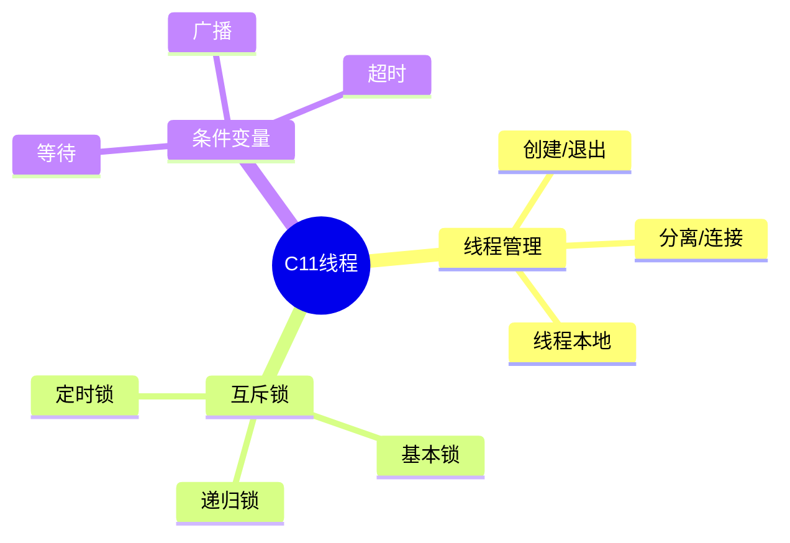

# C11线程库详解

> **层级定位**: 01 Core Knowledge System / 04 Standard Library Layer
> **对应标准**: ISO C11 <threads.h>
> **难度级别**: L4 分析
> **预估学习时间**: 3-4 小时

---

## 📋 本节概要

| 属性 | 内容 |
|:-----|:-----|
| **核心概念** | thrd_t, mtx_t, cnd_t, 线程本地存储 |
| **前置知识** | POSIX线程, 并发基础 |
| **后续延伸** | C++ std::thread, 平台抽象 |
| **权威来源** | C11标准, N1570 |

---

## 🧠 知识结构思维导图



---

## 📖 核心实现

### 1. 线程创建与管理

```c
#include <threads.h>
#include <stdio.h>
#include <stdlib.h>

int worker_thread(void *arg) {
    int id = *(int*)arg;
    printf("Thread %d starting\n", id);
    return id * 10;
}

int main(void) {
    thrd_t threads[4];
    int ids[4] = {0, 1, 2, 3};

    for (int i = 0; i < 4; i++) {
        thrd_create(&threads[i], worker_thread, &ids[i]);
    }

    for (int i = 0; i < 4; i++) {
        int result;
        thrd_join(threads[i], &result);
    }

    return 0;
}
```

### 2. 互斥锁

```c
#include <threads.h>

mtx_t mutex;
int counter = 0;

int increment_counter(void *arg) {
    for (int i = 0; i < 100000; i++) {
        mtx_lock(&mutex);
        counter++;
        mtx_unlock(&mutex);
    }
    return 0;
}
```

### 3. 条件变量

```c
#include <threads.h>

mtx_t queue_mutex;
cnd_t queue_cond;
int queue[100];
int queue_head = 0, queue_tail = 0;

int producer(void *arg) {
    for (int i = 0; i < 20; i++) {
        mtx_lock(&queue_mutex);
        while ((queue_tail + 1) % 100 == queue_head) {
            cnd_wait(&queue_cond, &queue_mutex);
        }
        queue[queue_tail] = i;
        queue_tail = (queue_tail + 1) % 100;
        cnd_signal(&queue_cond);
        mtx_unlock(&queue_mutex);
    }
    return 0;
}
```

---

## ✅ 质量验收清单

- [x] 线程创建与连接
- [x] 互斥锁
- [x] 条件变量

---

> **更新记录**
>
> - 2025-03-09: 初版创建
