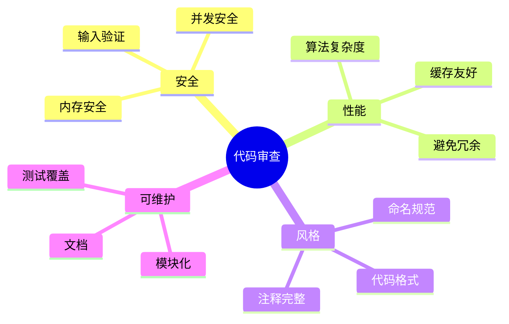

# C代码审查检查清单

> **层级定位**: 01 Core Knowledge System / 05 Engineering
> **对应标准**: CERT C, MISRA C, Linux Kernel
> **难度级别**: L3 应用
> **预估学习时间**: 2-3 小时

---

## 📋 本节概要

| 属性 | 内容 |
|:-----|:-----|
| **核心概念** | 安全检查、性能检查、风格检查、可维护性 |
| **前置知识** | C编程基础、安全编码 |
| **后续延伸** | 自动化检查、CI/CD集成 |
| **权威来源** | CERT C, MISRA C:2012 |

---

## 🧠 知识框架思维导图



---

## 📖 审查检查清单

### 安全检查

```markdown
## 内存安全

- [ ] 所有malloc/calloc/realloc都有对应的free
- [ ] 数组访问在边界内
- [ ] 指针使用前检查NULL
- [ ] 字符串操作使用安全版本(strncpy而非strcpy)
- [ ] 避免整数溢出（检查 before 运算）
- [ ] 不使用已释放内存(UAF)

## 并发安全

- [ ] 共享数据访问有加锁
- [ ] 锁的获取和释放配对
- [ ] 避免死锁（加锁顺序一致）
- [ ] 无数据竞争

## 输入验证

- [ ] 外部输入有长度限制
- [ ] 整数输入检查范围
- [ ] 字符串输入检查编码
- [ ] 文件路径规范化
```

### 性能检查

```markdown
## 算法

- [ ] 循环内无重复计算
- [ ] 使用合适的数据结构
- [ ] 避免O(n²)的嵌套循环（除非必要）

## 内存

- [ ] 避免频繁的malloc/free
- [ ] 考虑内存池
- [ ] 数据结构对齐友好

## 缓存

- [ ] 数据访问模式连续
- [ ] 结构体字段按访问频率排列
```

### 风格检查

```markdown
## 命名

- [ ] 函数名: verb_noun (如: get_value)
- [ ] 变量名: 描述性 (如: total_count 而非 tc)
- [ ] 宏: 全大写+下划线
- [ ] 常量: kCamelCase 或 全大写

## 格式

- [ ] 缩进一致（4空格）
- [ ] 行长<80/100字符
- [ ] 大括号风格一致
- [ ] 空格使用一致

## 注释

- [ ] 函数有文档注释
- [ ] 复杂逻辑有解释
- [ ] TODO有责任人/日期
```

### 可维护性检查

```markdown
## 模块化

- [ ] 函数单一职责
- [ ] 函数长度<50行
- [ ] 参数数量<5个
- [ ] 无全局变量（或严格控制）

## 测试

- [ ] 新增代码有单元测试
- [ ] 边界条件有测试
- [ ] 错误路径有测试

## 文档

- [ ] API变更更新文档
- [ ] 复杂算法有说明
- [ ] 示例代码可运行
```

---

## 🔧 自动化工具

```bash
# 静态分析
cppcheck --enable=all --inconclusive source.c
clang-tidy --checks='cert-*,misra-*,performance-*' source.c

# 格式化
clang-format -i source.c

# 覆盖率
gcov -b source.c
```

---

## ✅ 质量验收清单

- [x] 安全检查清单
- [x] 性能检查清单
- [x] 风格检查清单
- [x] 可维护性检查清单
- [x] 自动化工具集成

---

> **更新记录**
>
> - 2025-03-09: 初版创建
