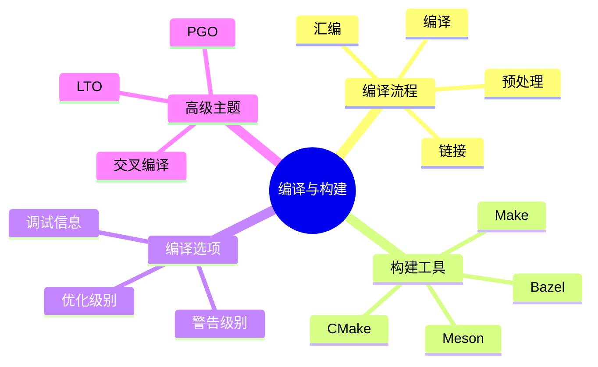

# C语言编译与构建系统深度解析

> **层级定位**: 01 Core Knowledge System / 05 Engineering Layer
> **对应标准**: C89/C99/C11/C17/C23
> **难度级别**: L3 应用
> **预估学习时间**: 4-6 小时

---

## 📋 本节概要

| 属性 | 内容 |
|:-----|:-----|
| **核心概念** | 编译流程、构建系统、CMake/Makefile、交叉编译 |
| **前置知识** | 模块化、链接 |
| **后续延伸** | CI/CD、包管理、容器化 |
| **权威来源** | CSAPP Ch7, CMake文档, GNU Make手册 |

---

## 🧠 知识结构思维导图



---

## 📖 核心概念详解

### 1. 编译流程详解

```bash
# 完整编译流程
# 1. 预处理
gcc -E main.c -o main.i      # 展开宏、包含头文件

# 2. 编译
gcc -S main.i -o main.s      # 生成汇编代码

# 3. 汇编
gcc -c main.s -o main.o      # 生成目标文件

# 4. 链接
gcc main.o -o main           # 生成可执行文件

# 一步到位
gcc main.c -o main
```

### 2. Makefile基础

```makefile
# 变量定义
CC = gcc
CFLAGS = -std=c11 -Wall -Wextra -O2
TARGET = myapp
SRCS = main.c utils.c mathlib.c
OBJS = $(SRCS:.c=.o)

# 默认目标
all: $(TARGET)

# 链接规则
$(TARGET): $(OBJS)
 $(CC) $(OBJS) -o $(TARGET) $(LDFLAGS)

# 编译规则（模式规则）
%.o: %.c
 $(CC) $(CFLAGS) -c $< -o $@

# 清理
clean:
 rm -f $(OBJS) $(TARGET)

# 伪目标声明
.PHONY: all clean
```

### 3. CMake现代构建

```cmake
# CMakeLists.txt
cmake_minimum_required(VERSION 3.15)
project(MyApp VERSION 1.0 LANGUAGES C)

# C标准
set(CMAKE_C_STANDARD 11)
set(CMAKE_C_STANDARD_REQUIRED ON)

# 编译选项
add_compile_options(
    -Wall
    -Wextra
    -Wpedantic
    -Werror=return-type
)

# 可执行文件
add_executable(myapp
    src/main.c
    src/utils.c
    src/mathlib.c
)

# 包含目录
target_include_directories(myapp PRIVATE include)

# 链接库
target_link_libraries(myapp PRIVATE m)  # 数学库

# 优化选项
if(CMAKE_BUILD_TYPE STREQUAL "Release")
    target_compile_options(myapp PRIVATE -O3 -march=native)
elseif(CMAKE_BUILD_TYPE STREQUAL "Debug")
    target_compile_options(myapp PRIVATE -O0 -g3)
    target_compile_definitions(myapp PRIVATE DEBUG)
endif()

# 测试
enable_testing()
add_executable(test_mathlib tests/test_mathlib.c src/mathlib.c)
add_test(NAME mathlib_test COMMAND test_mathlib)
```

### 4. 编译器优化选项

```bash
# GCC/Clang优化级别
# -O0: 无优化，便于调试
# -O1: 基本优化
# -O2: 标准优化（推荐）
# -O3: 激进优化
# -Os: 优化大小
# -Ofast: 快速数学（可能违反标准）

# 架构特定优化
gcc -O3 -march=native -mtune=native program.c

# 链接时优化(LTO)
gcc -O3 -flto program.c -o program

# 性能引导优化(PGO)
# 1. 编译带插桩版本
gcc -O2 -fprofile-generate program.c -o program
# 2. 运行程序生成profile
./program
# 3. 重新编译使用profile
gcc -O2 -fprofile-use program.c -o program
```

### 5. 交叉编译

```bash
# 交叉编译到ARM
# 使用交叉编译工具链
arm-linux-gnueabihf-gcc \
    -std=c11 \
    -O2 \
    -march=armv7-a \
    -mfpu=neon \
    -mfloat-abi=hard \
    program.c -o program-arm

# CMake交叉编译
# toolchain-arm.cmake
set(CMAKE_SYSTEM_NAME Linux)
set(CMAKE_SYSTEM_PROCESSOR arm)
set(CMAKE_C_COMPILER arm-linux-gnueabihf-gcc)
set(CMAKE_FIND_ROOT_PATH_MODE_PROGRAM NEVER)
set(CMAKE_FIND_ROOT_PATH_MODE_LIBRARY ONLY)
set(CMAKE_FIND_ROOT_PATH_MODE_INCLUDE ONLY)

# 使用
cmake -B build -DCMAKE_TOOLCHAIN_FILE=toolchain-arm.cmake
```

---

## ⚠️ 常见陷阱

### 陷阱 BUILD01: 依赖缺失

```makefile
# ❌ 不完整的依赖
main.o: main.c
 gcc -c main.c

# ✅ 包含头文件依赖
main.o: main.c utils.h config.h
 gcc -c main.c

# 自动生成依赖（GCC）
%.o: %.c
 gcc -MMD -MP -c $< -o $@
-include $(OBJS:.o=.d)  # 包含生成的依赖文件
```

### 陷阱 BUILD02: 编译器差异

```c
// ❌ 依赖GCC扩展
void func(void) {
    int arr[__builtin_constant_p(5) ? 5 : 10];  // GCC特有
}

// ✅ 标准C
void func_safe(int n) {
    // C99 VLA（可选）
    int arr[10];  // 固定大小
    // 或动态分配
    int *arr_dyn = malloc(n * sizeof(int));
    free(arr_dyn);
}
```

---

## ✅ 质量验收清单

- [x] 编译流程详解
- [x] Makefile基础
- [x] CMake现代构建
- [x] 优化选项
- [x] 交叉编译

---

> **更新记录**
>
> - 2025-03-09: 初版创建
