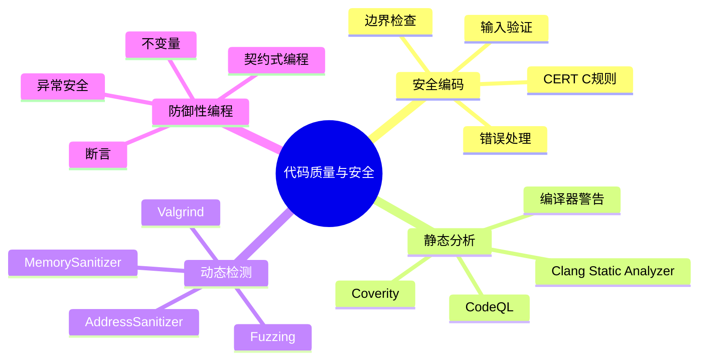

# C语言代码质量与安全实践

> **层级定位**: 01 Core Knowledge System / 05 Engineering Layer
> **对应标准**: CERT C, CWE, MISRA C
> **难度级别**: L3 应用 → L5 综合
> **预估学习时间**: 6-10 小时

---

## 📋 本节概要

| 属性 | 内容 |
|:-----|:-----|
| **核心概念** | 安全编码规范、静态分析、动态检测、防御性编程 |
| **前置知识** | 核心C语言、内存管理 |
| **后续延伸** | 形式化验证、安全审计、漏洞研究 |
| **权威来源** | CERT C Coding Standard, SEI CWE, MISRA C:2012 |

---

## 🧠 知识结构思维导图



---

## 📖 核心概念详解

### 1. CERT C安全编码

#### 1.1 关键规则分类

| 类别 | 规则数 | 核心关注 |
|:-----|:------:|:---------|
| 预处理器 | 10+ | 宏安全、条件编译 |
| 声明初始化 | 20+ | 类型安全、未初始化 |
| 表达式 | 30+ | 整数溢出、除零、副作用 |
| 整数 | 15+ | 溢出、符号、转换 |
| 数组 | 15+ | 越界、VLA安全 |
| 字符串 | 20+ | 缓冲区溢出、null终止 |
| 内存管理 | 25+ | 分配释放、悬挂指针 |
| 输入输出 | 20+ | 格式化字符串、文件安全 |
| 并发 | 15+ | 竞争条件、死锁 |
| 异常处理 | 10+ | 错误码、资源清理 |

#### 1.2 输入验证

```c
// ❌ 未验证输入
void process_user_input(const char *input) {
    char buffer[100];
    strcpy(buffer, input);  // 可能溢出
}

// ✅ 长度验证
define MAX_INPUT 99

bool process_user_input_safe(const char *input) {
    if (input == NULL) return false;

    size_t len = strnlen(input, MAX_INPUT + 1);
    if (len > MAX_INPUT) {
        log_error("Input too long: %zu", len);
        return false;
    }

    char buffer[MAX_INPUT + 1];
    memcpy(buffer, input, len + 1);
    // 处理...
    return true;
}

// ✅ 严格解析（白名单）
bool parse_positive_int(const char *str, int *out) {
    if (str == NULL || out == NULL) return false;
    if (str[0] == '\0') return false;

    errno = 0;
    char *end;
    long val = strtol(str, &end, 10);

    // 检查完整消耗
    if (*end != '\0') return false;

    // 检查范围
    if (val <= 0 || val > INT_MAX) return false;

    // 检查溢出
    if (errno == ERANGE) return false;

    *out = (int)val;
    return true;
}
```

### 2. 防御性编程

#### 2.1 契约式编程

```c
#include <assert.h>
#include <stdbool.h>

// 前置条件：调用者必须满足
define REQUIRES(cond, msg) assert((cond) && "Precondition violated: " msg)

// 后置条件：函数必须保证
define ENSURES(cond, msg) assert((cond) && "Postcondition violated: " msg)

// 不变量：始终为真
define INVARIANT(cond, msg) assert((cond) && "Invariant violated: " msg)

// 示例：二分查找
int binary_search(const int *arr, size_t n, int key) {
    REQUIRES(arr != NULL, "array not null");
    REQUIRES(n > 0, "non-empty array");

    // 检查已排序（调试模式）
    #ifndef NDEBUG
    for (size_t i = 1; i < n; i++) {
        assert(arr[i-1] <= arr[i] && "array must be sorted");
    }
    #endif

    size_t low = 0, high = n;
    while (low < high) {
        INVARIANT(low <= high, "valid range");
        INVARIANT(high <= n, "high in bounds");

        size_t mid = low + (high - low) / 2;  // 避免溢出

        if (arr[mid] < key) {
            low = mid + 1;
        } else if (arr[mid] > key) {
            high = mid;
        } else {
            ENSURES(mid < n, "result in bounds");
            ENSURES(arr[mid] == key, "correct result");
            return (int)mid;
        }
    }

    return -1;  // 未找到
}
```

#### 2.2 错误处理策略

```c
// 错误码定义
typedef enum {
    ERR_OK = 0,
    ERR_NULL_PTR,
    ERR_INVALID_ARG,
    ERR_OUT_OF_MEMORY,
    ERR_IO,
    ERR_OVERFLOW,
    // ...
} ErrorCode;

// 结果类型（类似Rust的Result）
typedef struct {
    ErrorCode code;
    const char *file;
    int line;
    const char *func;
} Result;

#define OK() ((Result){ERR_OK, __FILE__, __LINE__, __func__})
#define ERROR(c) ((Result){(c), __FILE__, __LINE__, __func__})

// 宏链式检查
define TRY(expr) do { \
    Result _r = (expr); \
    if (_r.code != ERR_OK) return _r; \
} while(0)

// 使用
Result read_config(const char *path, Config *out) {
    TRY(open_file(path));      // 失败自动返回
    TRY(parse_header(out));    // 失败自动返回
    TRY(validate_config(out)); // 失败自动返回
    return OK();
}
```

### 3. 静态分析工具

#### 3.1 编译器警告（第一道防线）

```bash
# GCC推荐选项
---

## 🔗 文档关联

### 核心关联
| 文档 | 关系类型 | 说明 |
|:-----|:---------|:-----|
| [内存管理](../../../01_Core_Knowledge_System/02_Core_Layer/02_Memory_Management.md) | 核心关联 | 内存管理基础 |
| [指针深度](../../../01_Core_Knowledge_System/02_Core_Layer/01_Pointer_Depth.md) | 核心关联 | 指针深度基础 |
| [并发编程](../../../03_System_Technology_Domains/14_Concurrency_Parallelism/readme.md) | 核心关联 | 并发编程基础 |
| [数据类型](../../../01_Core_Knowledge_System/01_Basic_Layer/02_Data_Type_System.md) | 核心关联 | 数据类型基础 |
| [数组与指针](../../../01_Core_Knowledge_System/02_Core_Layer/05_Arrays_Pointers.md) | 核心关联 | 数组与指针基础 |

### 扩展阅读
| 文档 | 关系类型 | 说明 |
|:-----|:---------|:-----|
| [软件工程](../../../01_Core_Knowledge_System/05_Engineering_Layer/readme.md) | 核心关联 | 软件工程基础 |
| [形式语义](../../../02_Formal_Semantics_and_Physics/readme.md) | 核心关联 | 形式语义基础 |
| [系统技术](../../../03_System_Technology_Domains/readme.md) | 核心关联 | 系统技术基础 |
| [工业场景](../../../04_Industrial_Scenarios/readme.md) | 核心关联 | 工业场景基础 |
| [思维表征](../../../06_Thinking_Representation/readme.md) | 核心关联 | 思维表征基础 |
gcc -std=c11 -Wall -Wextra -Wpedantic \
    -Wconversion -Wsign-conversion \
    -Wformat=2 -Wformat-security \
    -Wnull-dereference -Wstack-protector \
    -Wstrict-overflow=5 \
    -Wmissing-prototypes -Wmissing-declarations \
    -Wshadow \
    -Wcast-align \
    -Wcast-qual \
    -Wwrite-strings \
    -D_FORTIFY_SOURCE=2 \
    -O2 \
    program.c -o program

# Clang额外选项
clang -std=c11 -Weverything \
    -Wno-padded -Wno-gnu-zero-variadic-macro-arguments \
    program.c -o program
```

#### 3.2 Clang Static Analyzer

```bash
# 基本使用
scan-build gcc -c program.c

# 生成HTML报告
scan-build --html-title "My Project Analysis" make

# 检查特定检查器
scan-build --help-checkers | grep security
```

#### 3.3 其他工具

```bash
# Valgrind（内存错误）
valgrind --leak-check=full --show-leak-kinds=all ./program

# AddressSanitizer（更快）
gcc -fsanitize=address -g program.c -o program
./program

# MemorySanitizer（未初始化读取）
clang -fsanitize=memory -g program.c -o program

# UndefinedBehaviorSanitizer
 gcc -fsanitize=undefined -g program.c -o program

# Fuzzing (libFuzzer)
clang -fsanitize=fuzzer,address fuzz_target.c -o fuzzer
./fuzzer -max_total_time=300 corpus/
```

---

## 🔄 多维矩阵对比

### 安全工具对比

| 工具 | 检测能力 | 速度 | 误报率 | 使用阶段 |
|:-----|:--------:|:----:|:------:|:---------|
| 编译器警告 | 基础 | 即时 | 低 | 开发 |
| Clang SA | 中等 | 分钟 | 中 | 提交前 |
| Coverity | 高 | 小时 | 低 | CI/CD |
| ASan | 运行时错误 | 2x慢 | 极低 | 测试 |
| Valgrind | 内存错误 | 10x慢 | 极低 | 深度测试 |
| Fuzzing | 崩溃/漏洞 | 慢 | 无 | 发布前 |

---

## ⚠️ 常见陷阱

### 陷阱 SEC01: TOCTOU竞争

```c
// ❌ 检查时间到使用时间竞争
if (access("/tmp/file", W_OK) == 0) {  // 检查时
    FILE *fp = fopen("/tmp/file", "w");  // 使用时可能已改变！
    // ...
}

// ✅ 原子操作
define _GNU_SOURCE
#include <fcntl.h>

int fd = open("/tmp/file", O_WRONLY | O_CREAT | O_NOFOLLOW, 0600);
if (fd < 0) {
    // 处理错误
}
// 使用fd安全操作
```

### 陷阱 SEC02: 整数溢出导致缓冲区溢出

```c
// ❌ 整数溢出后分配不足
void *alloc_buffer(size_t count, size_t size) {
    return malloc(count * size);  // 溢出！
}

// ✅ 安全检查
define _CRT_SECURE_NO_WARNINGS
#include <stdint.h>

void *alloc_buffer_safe(size_t count, size_t size) {
    if (count == 0 || size == 0) return NULL;

    // 检查溢出
    if (SIZE_MAX / count < size) {
        errno = ENOMEM;
        return NULL;
    }

    return calloc(count, size);  // calloc内部检查溢出
}
```

---

## ✅ 质量验收清单

- [x] 包含CERT C规则分类
- [x] 包含输入验证模式
- [x] 包含防御性编程示例
- [x] 包含工具链配置
- [x] 包含常见安全陷阱

---

> **更新记录**
>
> - 2025-03-09: 初版创建


---

## 深入理解

### 技术原理

深入探讨相关技术原理和实现细节。

### 实践指南

- 步骤1：理解基础概念
- 步骤2：掌握核心原理
- 步骤3：应用实践

### 相关资源

- 文档链接
- 代码示例
- 参考文章

---

> **最后更新**: 2026-03-21
> **维护者**: AI Code Review
