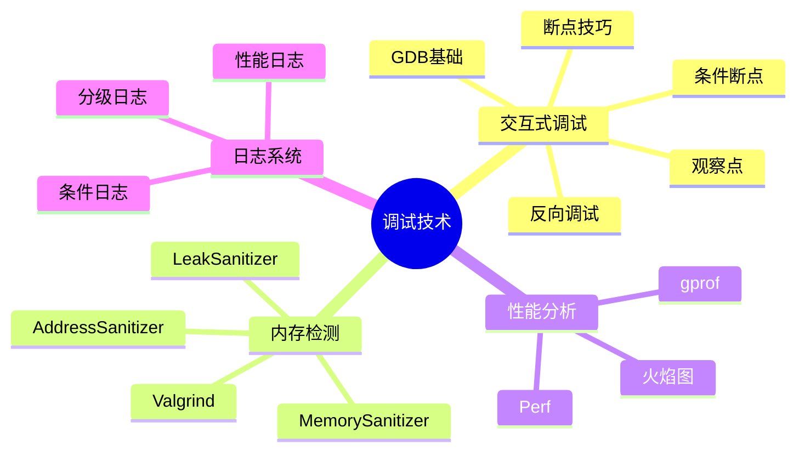

# C语言调试技术深度解析

> **层级定位**: 01 Core Knowledge System / 05 Engineering Layer
> **对应标准**: GDB, LLDB, Valgrind, Sanitizers
> **难度级别**: L3 应用
> **预估学习时间**: 4-6 小时

---

## 📋 本节概要

| 属性 | 内容 |
|:-----|:-----|
| **核心概念** | GDB/LLDB调试、内存检测、性能分析、日志系统 |
| **前置知识** | C语言基础、编译过程 |
| **后续延伸** | 远程调试、内核调试 |
| **权威来源** | GDB手册, Valgrind手册, Sanitizer文档 |

---

## 🧠 知识结构思维导图



---

## 📖 核心概念详解

### 1. GDB高级调试

#### 1.1 高级断点技巧

```bash
# 条件断点
(gdb) break main.c:42 if i == 100
(gdb) break process_data if strcmp(name, "error") == 0

# 忽略前N次
(gdb) break foo
(gdb) ignore 1 10  # 忽略断点1前10次

# 一次性断点
(gdb) tbreak main  # 命中后自动删除

# 监视点（数据断点）
(gdb) watch global_var        # 写入时停止
(gdb) rwatch global_var       # 读取时停止
(gdb) awatch global_var       # 读写时停止
(gdb) watch *(int*)0x123456   # 监视地址

# 捕获点
(gdb) catch throw             # C++异常
(gdb) catch syscall open      # 系统调用
(gdb) catch signal SIGSEGV    # 信号
```

#### 1.2 调试脚本

```python
# .gdbinit - GDB初始化脚本

# 打印STL容器（C++）需要特殊脚本，C结构体自定义打印
python
class MatrixPrinter:
    def __init__(self, val):
        self.val = val

    def to_string(self):
        rows = self.val['rows']
        cols = self.val['cols']
        return f"Matrix({rows}x{cols})"

    def children(self):
        data = self.val['data']
        for i in range(int(self.val['rows'])):
            for j in range(int(self.val['cols'])):
                yield f"[{i}][{j}]", data[i * int(self.val['cols']) + j]

import gdb.printing
gdb.printing.register_pretty_printer(gdb.current_objfile(), MatrixPrinter)
end

# 自定义命令
define pbuffer
    set $buf = $arg0
    set $size = $arg1
    set $i = 0
    while $i < $size
        printf "%02x ", $buf[$i]
        set $i++
        if $i % 16 == 0
            printf "\n"
        end
    end
    printf "\n"
end

document pbuffer
Print buffer as hex dump
Usage: pbuffer buffer_address size
end
```

### 2. Sanitizers使用指南

```bash
# AddressSanitizer (ASan) - 内存错误检测
gcc -fsanitize=address -g -O1 program.c -o program
./program

# 检测的问题：
# - 使用已释放内存
# - 缓冲区溢出/下溢
# - 堆缓冲区溢出
# - 栈缓冲区溢出
# - 全局缓冲区溢出
# - 使用返回后的栈内存
# - 使用超出作用域的栈内存
# - 双重释放
# - 内存泄漏（配合LSan）

# MemorySanitizer (MSan) - 未初始化内存读取
clang -fsanitize=memory -g -O1 program.c -o program

# UndefinedBehaviorSanitizer (UBSan)
gcc -fsanitize=undefined -g -O1 program.c -o program
# 检测：整数溢出、无效位移、类型转换问题等

# ThreadSanitizer (TSan) - 数据竞争
gcc -fsanitize=thread -g -O1 program.c -o program

# LeakSanitizer (LSan) - 内存泄漏（通常包含在ASan中）
gcc -fsanitize=address -g program.c -o program
ASAN_OPTIONS=detect_leaks=1 ./program
```

### 3. Valgrind使用

```bash
# 内存错误检测
valgrind --leak-check=full --show-leak-kinds=all ./program

# 缓存分析
cgvalgrind --tool=cachegrind ./program
cg_annotate cachegrind.out.*

# 性能分析
valgrind --tool=callgrind ./program
callgrind_annotate callgrind.out.*

# 堆分析
valgrind --tool=massif ./program
ms_print massif.out.*

# 线程错误检测
valgrind --tool=helgrind ./program
```

### 4. 日志系统实现

```c
// 分级日志系统

typedef enum {
    LOG_LEVEL_DEBUG = 0,
    LOG_LEVEL_INFO,
    LOG_LEVEL_WARN,
    LOG_LEVEL_ERROR,
    LOG_LEVEL_FATAL,
    LOG_LEVEL_NONE
} LogLevel;

static LogLevel g_log_level = LOG_LEVEL_INFO;
static FILE *g_log_file = NULL;

void log_init(const char *filename, LogLevel level) {
    g_log_level = level;
    if (filename) {
        g_log_file = fopen(filename, "a");
    }
    if (!g_log_file) {
        g_log_file = stderr;
    }
}

void log_message(LogLevel level, const char *file, int line,
                 const char *func, const char *fmt, ...) {
    if (level < g_log_level) return;

    const char *level_str[] = {"DEBUG", "INFO", "WARN", "ERROR", "FATAL"};

    // 时间戳
    time_t now = time(NULL);
    struct tm *tm_info = localtime(&now);
    char time_str[26];
    strftime(time_str, 26, "%Y-%m-%d %H:%M:%S", tm_info);

    // 输出到文件
    fprintf(g_log_file, "[%s] [%s] %s:%d (%s) ",
            time_str, level_str[level], file, line, func);

    va_list args;
    va_start(args, fmt);
    vfprintf(g_log_file, fmt, args);
    va_end(args);

    fprintf(g_log_file, "\n");
    fflush(g_log_file);

    // 致命错误终止程序
    if (level == LOG_LEVEL_FATAL) {
        abort();
    }
}

// 宏包装
#define LOG_DEBUG(...) log_message(LOG_LEVEL_DEBUG, __FILE__, __LINE__, __func__, __VA_ARGS__)
#define LOG_INFO(...)  log_message(LOG_LEVEL_INFO, __FILE__, __LINE__, __func__, __VA_ARGS__)
#define LOG_WARN(...)  log_message(LOG_LEVEL_WARN, __FILE__, __LINE__, __func__, __VA_ARGS__)
#define LOG_ERROR(...) log_message(LOG_LEVEL_ERROR, __FILE__, __LINE__, __func__, __VA_ARGS__)
#define LOG_FATAL(...) log_message(LOG_LEVEL_FATAL, __FILE__, __LINE__, __func__, __VA_ARGS__)

// 条件日志（避免高开销计算）
#define LOG_DEBUG_IF(cond, ...) do { if (cond) LOG_DEBUG(__VA_ARGS__); } while(0)
```

### 5. 断言与调试宏

```c
// 增强断言

#ifdef NDEBUG
    #define ASSERT(cond) ((void)0)
#else
    #define ASSERT(cond) do { \
        if (!(cond)) { \
            fprintf(stderr, "Assertion failed: %s\n", #cond); \
            fprintf(stderr, "  at %s:%d (%s)\n", __FILE__, __LINE__, __func__); \
            __builtin_trap(); \
        } \
    } while(0)
#endif

// 静态断言
#define STATIC_ASSERT(cond) _Static_assert(cond, #cond)

// 编译期断言数组大小
#define ARRAY_SIZE(arr) (sizeof(arr) / sizeof((arr)[0]))
#define ASSERT_ARRAY_SIZE(arr, expected) \
    STATIC_ASSERT(ARRAY_SIZE(arr) == expected)

// 调试打印
#ifdef DEBUG
    #define DEBUG_PRINT(fmt, ...) fprintf(stderr, "[DEBUG] %s:%d " fmt "\n", \
                                          __FILE__, __LINE__, ##__VA_ARGS__)
    #define DEBUG_DUMP(ptr, size) dump_hex(ptr, size)
#else
    #define DEBUG_PRINT(...) ((void)0)
    #define DEBUG_DUMP(...) ((void)0)
#endif
```

---

## ✅ 质量验收清单

- [x] GDB高级调试技巧
- [x] Sanitizers使用
- [x] Valgrind工具链
- [x] 日志系统实现
- [x] 断言与调试宏

---

> **更新记录**
>
> - 2025-03-09: 初版创建


---

## 深入理解

### 技术原理

深入探讨相关技术原理和实现细节。

### 实践指南

- 步骤1：理解基础概念
- 步骤2：掌握核心原理
- 步骤3：应用实践

### 相关资源

- 文档链接
- 代码示例
- 参考文章

---

> **最后更新**: 2026-03-21  
> **维护者**: AI Code Review
