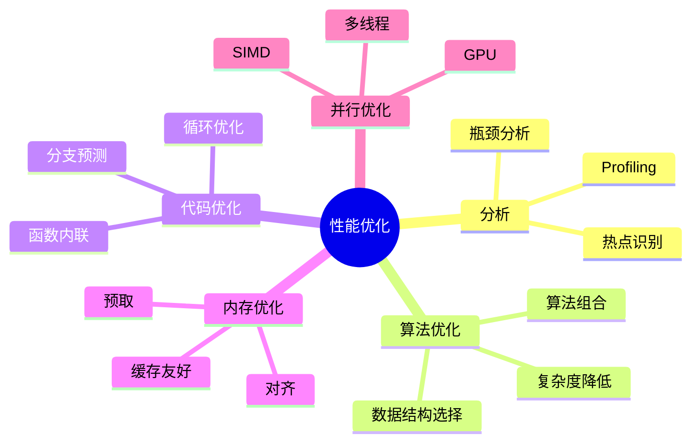

# C语言性能优化深度解析

> **层级定位**: 01 Core Knowledge System / 05 Engineering Layer
> **对应标准**: C89/C99/C11/C17/C23
> **难度级别**: L4 分析 → L5 综合
> **预估学习时间**: 6-10 小时

---

## 📋 本节概要

| 属性 | 内容 |
|:-----|:-----|
| **核心概念** | Profiling、算法优化、内存优化、SIMD、并行化 |
| **前置知识** | 编译构建、缓存友好编程 |
| **后续延伸** | GPU编程、异构计算、高性能库 |
| **权威来源** | CSAPP Ch5, Modern C Level 3, Intel优化手册 |

---

## 🧠 知识结构思维导图



---

## 📖 核心概念详解

### 1. 性能分析

```bash
# Linux perf
gcc -O2 -g program.c -o program
perf record ./program
perf report  # 查看热点

# gprof
gcc -O2 -pg program.c -o program
./program
gprof ./program gmon.out

# Intel VTune
vtune -collect hotspots ./program
```

### 2. 循环优化技巧

```c
// ❌ 缓存不友好
for (int j = 0; j < n; j++) {
    for (int i = 0; i < m; i++) {
        sum += matrix[i][j];  // 列优先，缓存缺失
    }
}

// ✅ 行优先访问
for (int i = 0; i < m; i++) {
    for (int j = 0; j < n; j++) {
        sum += matrix[i][j];
    }
}

// 循环展开
// 手动展开（编译器-O3自动做）
for (int i = 0; i < n; i += 4) {
    sum += arr[i];
    if (i+1 < n) sum += arr[i+1];
    if (i+2 < n) sum += arr[i+2];
    if (i+3 < n) sum += arr[i+3];
}
```

### 3. SIMD向量化

```c
#include <immintrin.h>  // AVX

// 向量化加法（256位AVX，8个float）
void add_vectors(float *a, float *b, float *c, int n) {
    int i = 0;
    // 处理8的倍数
    for (; i <= n - 8; i += 8) {
        __m256 va = _mm256_loadu_ps(&a[i]);
        __m256 vb = _mm256_loadu_ps(&b[i]);
        __m256 vc = _mm256_add_ps(va, vb);
        _mm256_storeu_ps(&c[i], vc);
    }
    // 处理剩余
    for (; i < n; i++) {
        c[i] = a[i] + b[i];
    }
}

// 编译器自动向量化提示
// gcc -O3 -march=native -ftree-vectorize
void add_auto(float * restrict a,
              float * restrict b,
              float * restrict c, int n) {
    for (int i = 0; i < n; i++) {
        c[i] = a[i] + b[i];
    }
}
```

### 4. 内存优化

```c
// 结构体字段排序（从大到小）
// ✅ 优化布局
struct Optimized {
    double d;      // 8字节
    int i;         // 4字节
    short s;       // 2字节
    char c;        // 1字节
    char pad;      // 填充到16字节
};

// 池化分配
typedef struct {
    char *pool;
    size_t used;
    size_t size;
} MemoryPool;

void *pool_alloc(MemoryPool *p, size_t n) {
    if (p->used + n > p->size) return NULL;
    void *ptr = p->pool + p->used;
    p->used += n;
    return ptr;
}
```

### 5. 并行化

```c
#include <threads.h>
#include <stdlib.h>

// 多线程reduce
typedef struct {
    float *data;
    int start;
    int end;
    float result;
} ThreadData;

int sum_thread(void *arg) {
    ThreadData *td = arg;
    float sum = 0;
    for (int i = td->start; i < td->end; i++) {
        sum += td->data[i];
    }
    td->result = sum;
    return 0;
}

float parallel_sum(float *data, int n, int num_threads) {
    thrd_t *threads = malloc(num_threads * sizeof(thrd_t));
    ThreadData *tds = malloc(num_threads * sizeof(ThreadData));

    int chunk = n / num_threads;
    for (int i = 0; i < num_threads; i++) {
        tds[i].data = data;
        tds[i].start = i * chunk;
        tds[i].end = (i == num_threads - 1) ? n : (i + 1) * chunk;
        thrd_create(&threads[i], sum_thread, &tds[i]);
    }

    float total = 0;
    for (int i = 0; i < num_threads; i++) {
        thrd_join(threads[i], NULL);
        total += tds[i].result;
    }

    free(threads);
    free(tds);
    return total;
}
```

---

## ⚠️ 常见陷阱

### 陷阱 PERF01: 过早优化

```c
// ❌ 未经分析就优化
// 复杂的手动向量化，代码难维护

// ✅ 先profile，再优化
// 1. 写清晰正确的代码
// 2. 测量性能
// 3. 识别瓶颈
// 4. 针对性优化
// 5. 验证性能提升
```

### 陷阱 PERF02: 假共享

```c
// ❌ 多线程修改同一缓存行
typedef struct {
    int counter;
} Counter;

Counter counters[8];  // 每个64字节？不一定！

// ✅ 填充到缓存行大小
typedef struct {
    int counter;
    char pad[60];  // 64 - sizeof(int)
} PaddedCounter;
```

---

## ✅ 质量验收清单

- [x] Profiling工具
- [x] 循环优化
- [x] SIMD向量化
- [x] 内存优化
- [x] 并行化

---

> **更新记录**
>
> - 2025-03-09: 初版创建
