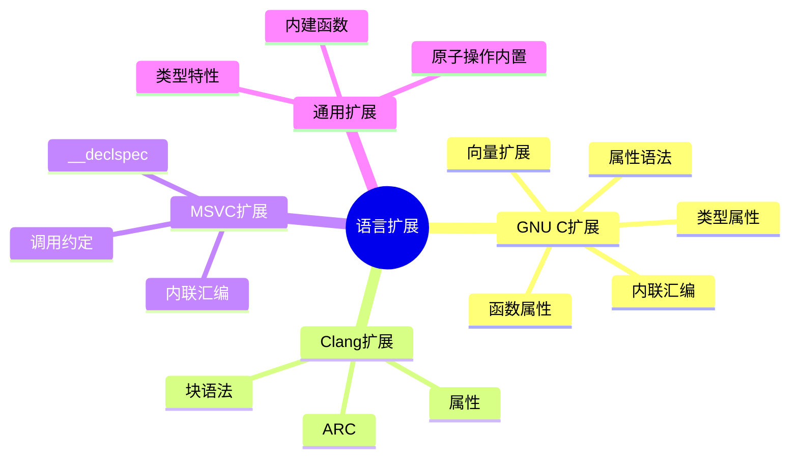

# C语言扩展与方言深度解析

> **层级定位**: 01 Core Knowledge System / 06 Advanced Layer
> **对应标准**: GNU C, MSVC扩展, Clang扩展
> **难度级别**: L3 应用 → L4 分析
> **预估学习时间**: 3-5 小时

---

## 📋 本节概要

| 属性 | 内容 |
|:-----|:-----|
| **核心概念** | GNU C扩展、编译器特定属性、内联汇编、向量扩展 |
| **前置知识** | 标准C、编译过程 |
| **后续延伸** | 底层优化、嵌入式开发 |
| **权威来源** | GCC文档、Clang文档、MSVC文档 |

---

## 🧠 知识结构思维导图



---

## 📖 核心概念详解

### 1. GCC属性 (Attributes)

#### 1.1 函数属性

```c
// 不返回函数
void fatal_error(const char *msg) __attribute__((noreturn));

// 纯函数（无副作用，只依赖参数）
int square(int x) __attribute__((pure));

// 常量函数（更严格的纯函数，不读内存）
int max(int a, int b) __attribute__((const));

// 格式化检查
void log_message(const char *fmt, ...)
    __attribute__((format(printf, 1, 2)));

// 已废弃
void old_func(void) __attribute__((deprecated("use new_func")));

// 弱符号
void weak_func(void) __attribute__((weak));

// 构造函数/析构函数（启动/退出时自动调用）
void init(void) __attribute__((constructor));
void cleanup(void) __attribute__((destructor));

// 指定对齐
void *aligned_alloc(void) __attribute__((alloc_align(1)));
```

#### 1.2 类型属性

```c
// 对齐
typedef int aligned_int __attribute__((aligned(64)));

// 打包结构体（无填充）
struct __attribute__((packed)) Header {
    uint8_t type;
    uint32_t length;
};

// 透明联合体
typedef union {
    int i;
    float f;
} value __attribute__((transparent_union));

// 设计ated初始化
struct Point { int x, y; };
struct Point p = { .x = 10, .y = 20 };
```

#### 1.3 变量属性

```c
// 未初始化（不置零）
int fast_var __attribute__((section(".noinit")));

// 强制对齐
int cache_line __attribute__((aligned(64)));

// 不优化掉
volatile int debug_var __attribute__((used));

// 指定段
const char version[] __attribute__((section(".version"))) = "v1.0";
```

### 2. 内联汇编 (Inline Assembly)

#### 2.1 基本语法

```c
// 基本内联汇编
__asm__ __volatile__ (
    "movl $42, %eax\n\t"
    "addl $1, %eax"
);

// 带输入输出
uint32_t result;
uint32_t input = 100;

__asm__ (
    "movl %[in], %[out]\n\t"
    "addl $1, %[out]"
    : [out] "=r" (result)      // 输出
    : [in] "r" (input)         // 输入
    : "memory"                 // 破坏描述
);

// 原子交换（x86）
static inline int atomic_xchg(int *ptr, int newval) {
    int oldval;
    __asm__ __volatile__ (
        "xchgl %[old], %[ptr]"
        : [old] "=r" (oldval), [ptr] "+m" (*ptr)
        : "0" (newval)
        : "memory"
    );
    return oldval;
}

// 内存屏障
#define memory_barrier() __asm__ __volatile__ ("" ::: "memory")

// CPUID
static inline void cpuid(uint32_t *eax, uint32_t *ebx,
                         uint32_t *ecx, uint32_t *edx) {
    __asm__ (
        "cpuid"
        : "=a" (*eax), "=b" (*ebx), "=c" (*ecx), "=d" (*edx)
        : "a" (*eax)
    );
}
```

### 3. GCC向量扩展

```c
// 向量类型
typedef int v4si __attribute__((vector_size(16)));  // 4 x int
typedef float v4sf __attribute__((vector_size(16))); // 4 x float
typedef double v2df __attribute__((vector_size(16))); // 2 x double

// 向量运算
v4sf a = {1.0, 2.0, 3.0, 4.0};
v4sf b = {5.0, 6.0, 7.0, 8.0};
v4sf sum = a + b;  // {6.0, 8.0, 10.0, 12.0}
v4sf prod = a * b; // {5.0, 12.0, 21.0, 32.0}

// 索引访问
float first = sum[0];

// 向量内建函数
int mask = __builtin_ia32_movmskps(sum);  // 提取符号位

// 类型转换
v4si int_vec = __builtin_ia32_cvtps2dq(prod);  // float转int
```

### 4. Clang/MSVC特定扩展

```c
// Clang块语法（Blocks）
#if defined(__BLOCKS__)
void apply_block(int *arr, int n, int (^block)(int)) {
    for (int i = 0; i < n; i++) {
        arr[i] = block(arr[i]);
    }
}

// 使用
int multiplier = 2;
apply_block(arr, 10, ^(int x) {
    return x * multiplier;  // 捕获外部变量
});
#endif

// MSVC __declspec
#ifdef _MSC_VER
    __declspec(dllexport) void exported_func(void);
    __declspec(align(64)) int aligned_var;
    __declspec(thread) int thread_local_var;  // 线程局部存储
    __declspec(noinline) void noinline_func(void);
    __declspec(noreturn) void fatal_error(void);
#endif

// 调用约定
#ifdef _WIN32
    void __stdcall stdcall_func(void);
    void __cdecl cdecl_func(void);
    void __fastcall fastcall_func(void);
#endif
```

### 5. 内建函数 (Builtins)

```c
// 类型特性
#if defined(__GNUC__)
    #define IS_SIGNED_TYPE(T) __builtin_types_compatible_p(typeof(T), signed typeof(T))
    #define TYPE_MAX(T) __builtin_choose_expr(IS_SIGNED_TYPE(T), (T)~((T)1 << (sizeof(T)*8-1)), (T)-1)
#endif

// 分支预测提示
#if defined(__GNUC__)
    #define likely(x) __builtin_expect(!!(x), 1)
    #define unlikely(x) __builtin_expect(!!(x), 0)
#else
    #define likely(x) (x)
    #define unlikely(x) (x)
#endif

// 使用
if (unlikely(ptr == NULL)) {
    handle_error();
}

// 编译时常量检测
#if defined(__GNUC__)
    #define IS_CONSTANT(x) __builtin_constant_p(x)
#endif

// 安全溢出检测
#if defined(__GNUC__)
    int result;
    if (__builtin_add_overflow(a, b, &result)) {
        // 溢出处理
    }
#endif

// 内存操作内建
void *ptr = __builtin_alloca(1024);  // 栈分配
__builtin_memcpy(dst, src, n);       // 可能优化为内联
__builtin_memset(ptr, 0, n);
__builtin_memcmp(p1, p2, n);

// 帧地址
void *frame = __builtin_frame_address(0);
void *ret_addr = __builtin_return_address(0);

// _unreachable
void unreachable(void) {
    __builtin_unreachable();  // 告诉编译器此行不会执行
}
```

---

## ⚠️ 常见陷阱

### 陷阱 EXT01: 依赖特定扩展

```c
// ❌ 依赖GCC扩展，其他编译器不兼容
void func(void) {
    __asm__("int $3");  // x86特定
}

// ✅ 使用条件编译
#if defined(__GNUC__) && defined(__x86_64__)
    #define DEBUG_BREAK() __asm__("int $3")
#elif defined(_MSC_VER)
    #define DEBUG_BREAK() __debugbreak()
#else
    #define DEBUG_BREAK() ((void)0)
#endif
```

### 陷阱 EXT02: 内联汇编约束错误

```c
// ❌ 错误的约束
__asm__("movl %0, %%eax" : : "r" (var));  // 忘记输出约束

// ✅ 正确的输入输出描述
__asm__("movl %[in], %[out]"
    : [out] "=r" (output)
    : [in] "r" (input)
    : "eax"
);
```

---

## ✅ 质量验收清单

- [x] GCC属性详解
- [x] 内联汇编语法
- [x] 向量扩展
- [x] 内建函数
- [x] 编译器差异处理

---

> **更新记录**
>
> - 2025-03-09: 初版创建


---

## 深入理解

### 技术原理

深入探讨相关技术原理和实现细节。

### 实践指南

- 步骤1：理解基础概念
- 步骤2：掌握核心原理
- 步骤3：应用实践

### 相关资源

- 文档链接
- 代码示例
- 参考文章

---

> **最后更新**: 2026-03-21  
> **维护者**: AI Code Review
