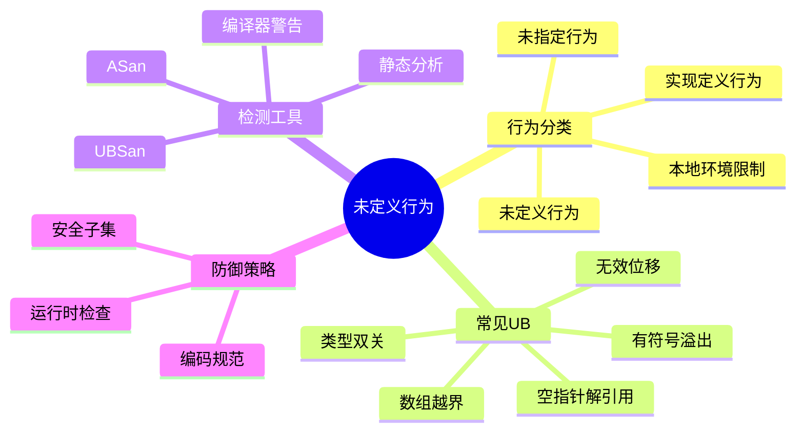

# C语言未定义行为(UB)深度解析

> **层级定位**: 01 Core Knowledge System / 06 Advanced Layer
> **对应标准**: C89/C99/C11/C17/C23
> **难度级别**: L4 分析 → L5 综合
> **预估学习时间**: 5-8 小时

---

## 📋 本节概要

| 属性 | 内容 |
|:-----|:-----|
| **核心概念** | 未定义行为、未指定行为、实现定义行为、常见UB陷阱 |
| **前置知识** | 核心语法、内存模型 |
| **后续延伸** | 形式化语义、安全子集 |
| **权威来源** | C11标准, CERT C, LLVM Blog, Modern C |

---

## 🧠 知识结构思维导图



---

## 📖 核心概念详解

### 1. 行为分类

| 分类 | 定义 | 示例 |
|:-----|:-----|:-----|
| **未定义行为(UB)** | C标准不做任何要求，程序可做任何事 | 数组越界、有符号溢出 |
| **未指定行为** | C标准提供几种可能，但不做选择 | 函数参数求值顺序 |
| **实现定义行为** | C标准依赖具体实现，必须文档化 | int的位数、右移负数 |
| **本地环境限制** | 由执行环境限制 | 可用内存、栈深度 |

### 2. 常见UB清单

#### 2.1 整数溢出

```c
// ❌ 有符号整数溢出是UB
int max = INT_MAX;
int overflow = max + 1;  // UB!

// ✅ 使用无符号类型（回绕是明确定义的）
unsigned int umax = UINT_MAX;
unsigned int wrap = umax + 1;  // 回绕到0，明确定义

// ✅ 检查溢出
bool safe_add(int a, int b, int *result) {
    if (b > 0 && a > INT_MAX - b) return false;
    if (b < 0 && a < INT_MIN - b) return false;
    *result = a + b;
    return true;
}
```

#### 2.2 无效位移

```c
// ❌ 移位数量大于等于类型宽度
int x = 1 << 33;  // UB! (假设32位int)

// ❌ 左移导致符号位改变
int y = 0x40000000 << 1;  // UB! (符号位从0变1)

// ❌ 负数右移
int z = -1 >> 1;  // 实现定义

// ✅ 安全移位
unsigned int safe1 = 1U << 31;  // OK
unsigned int safe2 = 0x40000000U << 1;  // OK（无符号）
```

#### 2.3 无效指针访问

```c
// ❌ 空指针解引用
int *p = NULL;
int x = *p;  // UB! (通常是段错误)

// ❌ 悬挂指针
int *dangling(void) {
    int local = 5;
    return &local;  // 返回局部变量地址
}
int *p = dangling();
int y = *p;  // UB! 栈帧已销毁

// ❌ 越界访问
int arr[10];
int z = arr[10];  // UB! 越界
```

#### 2.4 违反严格别名规则

```c
// ❌ 通过不同类型指针访问
float f = 3.14f;
int *ip = (int *)&f;
int bits = *ip;  // UB! 违反严格别名

// ✅ 使用union（C99有效类型规则）
union FloatInt {
    float f;
    int i;
};
union FloatInt fi = {.f = 3.14f};
int bits = fi.i;  // OK

// ✅ 使用memcpy
memcpy(&bits, &f, sizeof(bits));  // OK
```

#### 2.5 求值顺序问题

```c
// ❌ 同一变量多次修改
int i = 0;
int a = i++ + i++;  // UB!
int b = ++i + ++i;  // UB!

// ❌ 修改和读取交错
int c = i++ * i;    // UB!

// ✅ 分离到不同语句
int temp1 = i++;
int temp2 = i++;
int a = temp1 + temp2;
```

### 3. UB检测与防御

#### 3.1 编译器警告

```bash
# GCC/Clang
gcc -Wall -Wextra -Wpedantic \
    -Wstrict-overflow \
    -Wnull-dereference \
    -Wshift-overflow \
    -Warray-bounds \
    -Wformat=2 \
    program.c
```

#### 3.2 UBSan (Undefined Behavior Sanitizer)

```bash
# 编译
gcc -fsanitize=undefined -g program.c -o program

# 运行，自动检测：
# - 有符号整数溢出
# - 无效位移
# - 无效类型转换
# - 除零
# - 空指针解引用
./program
```

#### 3.3 防御性编程

```c
// 使用宏包装危险操作
#define CHECK_ADD(a, b, result) \
    do { \
        if (__builtin_add_overflow((a), (b), (result))) { \
            handle_overflow(); \
        } \
    } while(0)

// 断言检查
#include <assert.h>
void process_array(int *arr, size_t n) {
    assert(arr != NULL);
    assert(n > 0 && n <= MAX_SIZE);
    // ...
}

// 使用更安全的数据类型
typedef size_t SafeIndex;  // 无符号，自然检查负值
```

---

## ⚠️ 常见陷阱

### 陷阱 UB01: 依赖UB"工作"

```c
// ❌ 依赖有符号溢出回绕
int hash(int x) {
    return x * 31 + 1;  // 如果溢出，依赖特定行为
}

// ✅ 使用无符号类型
unsigned int hash_safe(unsigned int x) {
    return x * 31 + 1;  // 明确定义的回绕
}
```

### 陷阱 UB02: 优化后的意外行为

```c
// 编译器可能优化掉"不可能"的分支
void check(int *p) {
    if (p == NULL) {
        // 编译器假设这永远不会执行
        // 如果前面已经解引用了p
    }
}

int x = *p;  // 编译器假设p非NULL
if (p == NULL) {  // 可能被优化掉！
    // ...
}
```

---

## ✅ 质量验收清单

- [x] 行为分类详解
- [x] 常见UB清单
- [x] 检测工具配置
- [x] 防御策略

---

> **更新记录**
>
> - 2025-03-09: 初版创建
