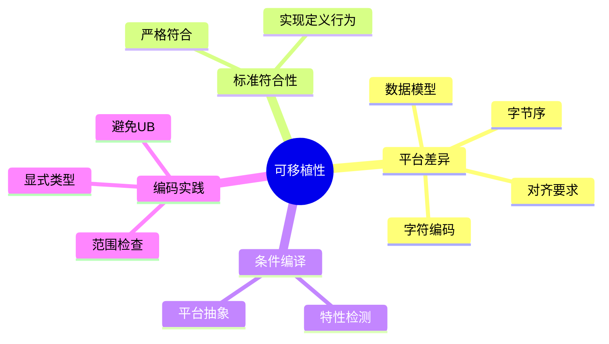

# C语言可移植性编程深度解析

> **层级定位**: 01 Core Knowledge System / 06 Advanced Layer
> **对应标准**: C89/C99/C11/C17/C23
> **难度级别**: L3 应用 → L4 分析
> **预估学习时间**: 3-5 小时

---

## 📋 本节概要

| 属性 | 内容 |
|:-----|:-----|
| **核心概念** | 平台差异、标准符合性、可移植代码、条件编译 |
| **前置知识** | 预处理器、数据类型系统 |
| **后续延伸** | 跨平台开发、嵌入式移植 |
| **权威来源** | POSIX, C11标准 Annex J, GNU Coding Standards |

---

## 🧠 知识结构思维导图



---

## 📖 核心概念详解

### 1. 平台差异与抽象

#### 1.1 字节序检测与处理

```c
#include <stdint.h>

// 运行时检测
int is_little_endian(void) {
    union {
        uint16_t i;
        uint8_t c[2];
    } test = {.i = 0x0102};
    return test.c[0] == 0x02;
}

// 编译时检测（GCC/Clang）
#if __BYTE_ORDER__ == __ORDER_LITTLE_ENDIAN__
    #define IS_LITTLE_ENDIAN 1
#elif __BYTE_ORDER__ == __ORDER_BIG_ENDIAN__
    #define IS_LITTLE_ENDIAN 0
#endif

// 安全的字节序转换
static inline uint16_t swap16(uint16_t x) {
    return ((x & 0xFF) << 8) | ((x >> 8) & 0xFF);
}

static inline uint32_t swap32(uint32_t x) {
    return ((x & 0xFF000000) >> 24) |
           ((x & 0x00FF0000) >> 8)  |
           ((x & 0x0000FF00) << 8)  |
           ((x & 0x000000FF) << 24);
}

// 网络字节序（大端）转换
#define htons(x) (IS_LITTLE_ENDIAN ? swap16(x) : (x))
#define htonl(x) (IS_LITTLE_ENDIAN ? swap32(x) : (x))
#define ntohs(x) htons(x)
#define ntohl(x) htonl(x)
```

#### 1.2 数据模型处理

```c
// 数据模型：LP64 (Linux/macOS 64-bit)
// char: 8, short: 16, int: 32, long: 64, pointer: 64

// 数据模型：LLP64 (Windows 64-bit)
// char: 8, short: 16, int: 32, long: 32, long long: 64, pointer: 64

// ✅ 可移植：使用定宽类型
#include <stdint.h>
uint32_t reliable_32bit;
uint64_t reliable_64bit;
uintptr_t pointer_sized;

// ✅ 可移植：使用sizeof，不假设
size_t int_size = sizeof(int) * CHAR_BIT;  // 位宽
```

### 2. 标准符合性

```c
// 严格符合程序（Standard C）
// 1. 只使用标准定义的特性
// 2. 不依赖未定义、未指定、实现定义行为
// 3. 在翻译单元内独立（不依赖外部库）

// 检查标准版本
#if __STDC_VERSION__ >= 202311L
    // C23
#elif __STDC_VERSION__ >= 201710L
    // C17
#elif __STDC_VERSION__ >= 201112L
    // C11
#elif __STDC_VERSION__ >= 199901L
    // C99
#else
    // C89/C90
#endif

// 特性检测（现代方式）
#ifdef __has_feature
    #define HAS_FEATURE(x) __has_feature(x)
#else
    #define HAS_FEATURE(x) 0
#endif

#ifdef __has_include
    #define HAS_INCLUDE(x) __has_include(x)
#else
    #define HAS_INCLUDE(x) 0
#endif

// 编译器检测
#if defined(__GNUC__)
    #define COMPILER_GCC (__GNUC__ * 100 + __GNUC_MINOR__)
#elif defined(__clang__)
    #define COMPILER_CLANG (__clang_major__ * 100 + __clang_minor__)
#elif defined(_MSC_VER)
    #define COMPILER_MSVC _MSC_VER
#endif
```

### 3. 可移植编码实践

```c
// ✅ 使用标准类型
#include <stddef.h>   // size_t, ptrdiff_t, NULL
#include <stdint.h>   // int32_t, uint64_t等
#include <stdbool.h>  // bool, true, false (C99+)

// ✅ 避免依赖char的符号性
// char可能是signed或unsigned，由实现定义
// 明确指定：
signed char  signed_byte;    // 有明确符号
unsigned char unsigned_byte; // 无符号

// ✅ 使用limits.h而非硬编码
#include <limits.h>
#if INT_MAX >= 2147483647
    // 确保至少32位
#endif

// ✅ 可移植的文件路径
#ifdef _WIN32
    #define PATH_SEP "\\"
#else
    #define PATH_SEP "/"
#endif

// ✅ 可移植的导出声明
#ifdef _WIN32
    #ifdef BUILDING_DLL
        #define EXPORT __declspec(dllexport)
    #else
        #define EXPORT __declspec(dllimport)
    #endif
#else
    #define EXPORT __attribute__((visibility("default")))
#endif
```

---

## ⚠️ 常见陷阱

### 陷阱 PORT01: 依赖实现定义行为

```c
// ❌ 依赖char为有符号
char c = 200;  // ARM上可能是56（回绕），x86上可能是-56

// ✅ 明确指定
unsigned char c = 200;  // 总是200

// ❌ 依赖sizeof(int) = 4
int arr[1000000];  // 可能在16位系统溢出

// ✅ 使用size_t
size_t max_elements = SIZE_MAX / sizeof(int);
```

### 陷阱 PORT02: 字节序假设

```c
// ❌ 假设小端
uint32_t value = 0x12345678;
uint8_t *p = (uint8_t *)&value;
if (p[0] == 0x78) { /* 小端 */ }

// ✅ 显式字节序处理
uint32_t to_big_endian(uint32_t x) {
    return ((x & 0xFF000000) >> 24) |
           ((x & 0x00FF0000) >> 8)  |
           ((x & 0x0000FF00) << 8)  |
           ((x & 0x000000FF) << 24);
}
```

---

## ✅ 质量验收清单

- [x] 字节序处理
- [x] 数据模型抽象
- [x] 标准符合性检查
- [x] 可移植编码实践

---

> **更新记录**
>
> - 2025-03-09: 初版创建


---

## 深入理解

### 技术原理

深入探讨相关技术原理和实现细节。

### 实践指南

- 步骤1：理解基础概念
- 步骤2：掌握核心原理
- 步骤3：应用实践

### 相关资源

- 文档链接
- 代码示例
- 参考文章

---

> **最后更新**: 2026-03-21  
> **维护者**: AI Code Review
