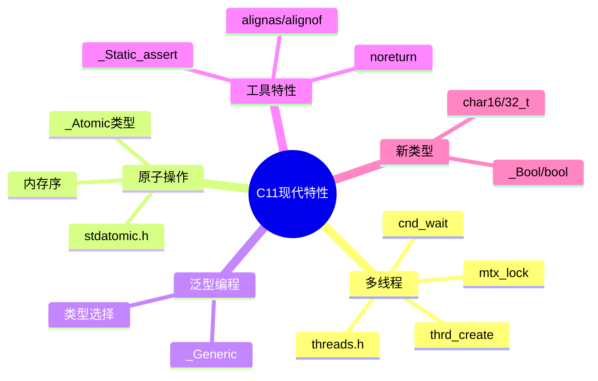

# C11现代特性深度解析

> **层级定位**: 01 Core Knowledge System / 07 Modern C
> **对应标准**: C11/C17/C23
> **难度级别**: L4 分析 → L5 综合
> **预估学习时间**: 10-15 小时

---

## 📋 本节概要

| 属性 | 内容 |
|:-----|:-----|
| **核心概念** | 多线程、原子操作、内存模型、静态断言、泛型选择、匿名结构体 |
| **前置知识** | 指针、函数、预处理器 |
| **后续延伸** | 并发算法、无锁数据结构、并行计算 |
| **权威来源** | Modern C Level 3, C11标准, N1570, C17/C23提案 |

---

## 🧠 知识结构思维导图



---

## 📖 核心概念详解

### 1. 多线程编程

#### 1.1 线程基础

```c
#include <threads.h>
#include <stdio.h>

// 线程函数
int thread_func(void *arg) {
    int num = *(int *)arg;
    printf("Thread %d running\n", num);
    return num * 2;  // 返回值
}

int main(void) {
    thrd_t thread;
    int arg = 42;

    // 创建线程
    if (thrd_create(&thread, thread_func, &arg) != thrd_success) {
        fprintf(stderr, "Failed to create thread\n");
        return 1;
    }

    // 等待线程结束并获取返回值
    int result;
    thrd_join(thread, &result);
    printf("Thread returned: %d\n", result);

    return 0;
}
```

#### 1.2 互斥锁

```c
#include <threads.h>
#include <stdio.h>

static mtx_t mutex;
static int counter = 0;

int increment(void *arg) {
    (void)arg;

    for (int i = 0; i < 1000000; i++) {
        mtx_lock(&mutex);      // 加锁
        counter++;             // 临界区
        mtx_unlock(&mutex);    // 解锁
    }
    return 0;
}

int main(void) {
    mtx_init(&mutex, mtx_plain);

    thrd_t t1, t2;
    thrd_create(&t1, increment, NULL);
    thrd_create(&t2, increment, NULL);

    thrd_join(t1, NULL);
    thrd_join(t2, NULL);

    printf("Counter: %d (expected: 2000000)\n", counter);

    mtx_destroy(&mutex);
    return 0;
}

// RAII风格的锁包装（C23属性支持）
typedef struct {
    mtx_t *mutex;
} LockGuard;

LockGuard lock_guard(mtx_t *m) {
    mtx_lock(m);
    return (LockGuard){.mutex = m};
}

void lock_guard_release(LockGuard *g) {
    if (g && g->mutex) {
        mtx_unlock(g->mutex);
        g->mutex = NULL;
    }
}
```

### 2. 原子操作

#### 2.1 基本原子类型

```c
#include <stdatomic.h>
#include <stdio.h>
#include <threads.h>

_Atomic int atomic_counter = 0;

int atomic_increment(void *arg) {
    (void)arg;
    for (int i = 0; i < 1000000; i++) {
        atomic_fetch_add(&atomic_counter, 1);  // 原子加1
    }
    return 0;
}

// 更简洁的宏写法
#define ATOMIC_INT _Atomic int

ATOMIC_INT counter = ATOMIC_VAR_INIT(0);
```

#### 2.2 内存序

```c
#include <stdatomic.h>

_Atomic int data = 0;
_Atomic int ready = 0;

// 生产者
void producer(void) {
    data = 42;  // 隐式 memory_order_seq_cst
    atomic_store_explicit(&ready, 1, memory_order_release);
}

// 消费者
void consumer(void) {
    while (atomic_load_explicit(&ready, memory_order_acquire) != 1) {
        // 自旋等待
    }
    // 保证看到data = 42
    int value = atomic_load_explicit(&data, memory_order_relaxed);
}
```

**内存序选择：**

| 内存序 | 同步强度 | 用途 | 性能 |
|:-------|:---------|:-----|:----:|
| `relaxed` | 无 | 计数器、标志 | 最高 |
| `acquire` | 获取 | 读锁、消费者 | 高 |
| `release` | 释放 | 写锁、生产者 | 高 |
| `acq_rel` | 获取-释放 | 读-改-写 | 中 |
| `seq_cst` | 顺序一致 | 默认，最强 | 最低 |

### 3. 泛型编程 _Generic

```c
#include <stdio.h>
#include <math.h>

// 类型安全的绝对值宏
#define ABS(x) _Generic((x), \
    int: abs, \
    long: labs, \
    long long: llabs, \
    float: fabsf, \
    double: fabs, \
    long double: fabsl \
)(x)

// 类型选择
define TYPE_NAME(x) _Generic((x), \
    int: "int", \
    double: "double", \
    char*: "string", \
    default: "unknown" \
)

// 泛型打印（简化版）
#define PRINT(x) _Generic((x), \
    int: printf("int: %d\n", x), \
    double: printf("double: %f\n", x), \
    char*: printf("string: %s\n", x) \
)

// 使用
void demo(void) {
    int i = -5;
    double d = -3.14;

    printf("|%d| = %d\n", i, ABS(i));      // 调用abs
    printf("|%f| = %f\n", d, ABS(d));      // 调用fabs

    PRINT(i);  // int: -5
    PRINT(d);  // double: -3.140000
}
```

### 4. 其他C11特性

#### 4.1 静态断言

```c
// 编译期检查
_Static_assert(sizeof(int) == 4, "int must be 32-bit");
_Static_assert(alignof(max_align_t) >= 8, "require 8-byte alignment");

// C23 简化语法
static_assert(sizeof(void*) == 8);
```

#### 4.2 对齐支持

```c
#include <stdalign.h>
#include <stddef.h>

// 查询对齐要求
printf("alignof(char) = %zu\n", alignof(char));      // 1
printf("alignof(int) = %zu\n", alignof(int));        // 4
printf("alignof(double) = %zu\n", alignof(double));  // 8

// 指定对齐
alignas(64) char cache_line[64];  // 64字节对齐

// 动态对齐分配
void *p = aligned_alloc(64, 1024);  // 64字节对齐，1024字节
free(p);
```

#### 4.3 noreturn

```c
#include <stdnoreturn.h>
#include <stdlib.h>

noreturn void fatal_error(const char *msg) {
    fprintf(stderr, "Fatal: %s\n", msg);
    abort();  // 不返回
}

// 优化提示：编译器知道此函数后代码不可达
void test(int x) {
    if (x < 0) {
        fatal_error("negative");
    }
    // 编译器知道x >= 0，可优化后续代码
}
```

### 5. C17/C23 新特性预览

```c
// C17 (修复C11缺陷)
// 主要是bug修复，无新特性

// C23 新特性（部分）
#if __STDC_VERSION__ >= 202311L

// 1. nullptr（类型安全的空指针）
int *p = nullptr;  // 不再是0或(void*)0

// 2. typeof（类型推导）
typof(int) x = 5;  // x是int
auto y = 10;       // 等价，y是int

// 3. 属性简化
[[nodiscard]] int important_func(void);
[[maybe_unused]] int unused_var;

// 4. 二进制常量
int flags = 0b1010'1100;  // 单引号作为分隔符

// 5. #embed 嵌入二进制文件
// const unsigned char icon[] = {
// #embed "icon.png"
// };

// 6. constexpr
constexpr int square(int x) { return x * x; }
int arr[square(5)];  // 编译期计算

#endif
```

---

## 🔄 多维矩阵对比

### C11特性支持矩阵

| 特性 | GCC | Clang | MSVC | 说明 |
|:-----|:---:|:-----:|:----:|:-----|
| threads.h | 4.9+ | 全部 | 部分 | 可用POSIX替代 |
| stdatomic.h | 4.9+ | 全部 | 部分 | 可用GCC内置 |
| _Generic | 4.9+ | 全部 | 部分 | 广泛支持 |
| _Static_assert | 4.6+ | 全部 | 2015+ | 广泛支持 |
| alignas/of | 4.9+ | 全部 | 2015+ | 广泛支持 |
| _Bool | 全部 | 全部 | 全部 | 完全支持 |

---

## ⚠️ 常见陷阱

### 陷阱 MOD01: 数据竞争

```c
// ❌ 数据竞争：非原子变量多线程访问
int shared = 0;
void thread_func(void) {
    shared++;  // 未定义行为！
}

// ✅ 使用原子操作
_Atomic int safe_shared = 0;
void safe_thread_func(void) {
    atomic_fetch_add(&safe_shared, 1);
}
```

### 陷阱 MOD02: 死锁

```c
// ❌ 死锁：锁顺序不一致
mtx_t lock_a, lock_b;

void thread1(void) {
    mtx_lock(&lock_a);
    mtx_lock(&lock_b);  // 等待thread2释放b
    // ...
}

void thread2(void) {
    mtx_lock(&lock_b);
    mtx_lock(&lock_a);  // 等待thread1释放a
    // ... 死锁！
}

// ✅ 解决方案：全局锁顺序
void safe_lock_both(mtx_t *first, mtx_t *second) {
    if (first < second) {  // 地址比较确定顺序
        mtx_lock(first);
        mtx_lock(second);
    } else {
        mtx_lock(second);
        mtx_lock(first);
    }
}
```

---

## ✅ 质量验收清单

- [x] 包含多线程基础示例
- [x] 包含原子操作与内存序
- [x] 包含_Generic泛型编程
- [x] 包含静态断言和对齐支持
- [x] 包含C23新特性预览

---

> **更新记录**
>
> - 2025-03-09: 初版创建


---

## 深入理解

### 技术原理

深入探讨相关技术原理和实现细节。

### 实践指南

- 步骤1：理解基础概念
- 步骤2：掌握核心原理
- 步骤3：应用实践

### 相关资源

- 文档链接
- 代码示例
- 参考文章

---

> **最后更新**: 2026-03-21  
> **维护者**: AI Code Review
