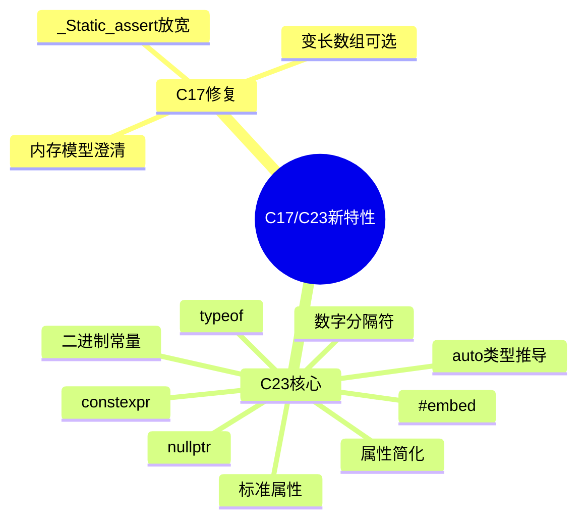

# C17与C23新特性深度解析

> **层级定位**: 01 Core Knowledge System / 07 Modern C
> **对应标准**: C17/C23
> **难度级别**: L3 应用 → L4 分析
> **预估学习时间**: 4-6 小时

---

## 📋 本节概要

| 属性 | 内容 |
|:-----|:-----|
| **核心概念** | C17缺陷修复、C23现代特性（nullptr、typeof、constexpr、属性） |
| **前置知识** | C11特性 |
| **后续延伸** | 未来C标准演进 |
| **权威来源** | C17标准、C23提案N3096、Modern C |

---

## 🧠 知识结构思维导图



---

## 📖 核心概念详解

### 1. C17 (ISO/IEC 9899:2018)

C17是C11的**缺陷修复版本**，没有引入新特性，主要修复了：

- 内存模型澄清
- `_Static_assert` 放宽（消息参数可选）
- 变长数组(VLA)正式成为可选特性

```c
// C11: _Static_assert 需要消息参数
_Static_assert(sizeof(int) == 4, "int must be 32-bit");

// C17: 消息参数可选
_Static_assert(sizeof(int) == 4);  // 合法

// C23: 简写为 static_assert
static_assert(sizeof(int) == 4);
```

### 2. C23核心新特性

#### 2.1 nullptr - 类型安全空指针

```c
// ❌ C11及以前的问题
int *p1 = 0;        // 0是整数，不表达意图
int *p2 = NULL;     // 可能是 ((void*)0) 或 0
void *vp = NULL;    // 与上面可能不同

// ✅ C23: 类型安全的nullptr
int *p = nullptr;   // 明确的空指针常量
void *vp2 = nullptr;

// 比较
if (p == nullptr) { }  // 清晰表达意图

// 不能用于整数
// int x = nullptr;  // 错误！
```

#### 2.2 typeof - 类型推导

```c
// C23: 类型推导
int x = 42;
typeof(x) y = 100;  // y也是int

typeof(int[10]) arr;  // arr是int[10]类型

// 与auto配合
auto p = &x;        // p是int*
typeof(*p) z = 0;   // z是int

// 用于宏，避免多次求值
#define MAX(a, b) ({ \
    typeof(a) _a = (a); \
    typeof(b) _b = (b); \
    _a > _b ? _a : _b; \
})

// typeof_unqual - 移除类型限定
const int ci = 10;
typeof_unqual(ci) uci = 20;  // uci是int，不是const int
```

#### 2.3 constexpr - 编译期常量

```c
// C23: 编译期计算
constexpr int square(int x) {
    return x * x;
}

// 编译期结果
int arr[square(5)];  // int arr[25];

// 与const不同
const int c = 5;           // 只读变量
constexpr int ce = 5;      // 编译期常量

// 可用于switch case
switch (x) {
    case square(3):  // case 9:
        // ...
}

// 静态初始化
static constexpr double PI = 3.14159265359;
```

#### 2.4 auto类型推导

```c
// C23: auto类型推导（类似C++11）
auto i = 42;           // int
auto d = 3.14;         // double
auto s = "hello";      // const char*
auto p = &i;           // int*

// 复合类型
auto arr = (int[]){1, 2, 3};  // int[3]

// 不能用于函数参数（C23限制）
// void func(auto x);  // 错误！

// 与typeof结合
auto x = some_function();
typeof(x) y;  // 相同类型
```

#### 2.5 属性简化

```c
// C11/C17: 双下划线属性
void func(void) [[noreturn]];
int x [[deprecated("use y instead")]];

// C23: 单括号属性
void func(void) [noreturn];
int x [deprecated("use y instead")];

// 标准属性列表
[deprecated]          // 废弃
[fallthrough]         // switch fallthrough意图
[maybe_unused]        // 可能未使用
[nodiscard]           // 返回值不应忽略
[noreturn]            // 不返回
[unsequenced]         // 函数无状态、无副作用
[reproducible]        // 函数无状态

// 使用示例
[nodiscard] int important_func(void);
[deprecated("use new_func instead")] void old_func(void);

void process(int x) {
    switch (x) {
        case 1:
            init();
            [fallthrough];  // 意图明确
        case 2:
            process_main();
            break;
    }
}

[maybe_unused] static int debug_counter;
```

#### 2.6 二进制常量与数字分隔符

```c
// C23: 二进制常量
int flags = 0b1010'1100'1111'0000;

// 单引号作为数字分隔符（提高可读性）
int million = 1'000'000;
long long big = 9'223'372'036'854'775'807LL;

// 十六进制分隔
int color = 0xFF'AA'00;

// 所有整数进制支持
int dec = 1'000'000;
int hex = 0xFF'FF;
int oct = 07'77;
int bin = 0b1111'0000;
```

#### 2.7 #embed - 嵌入二进制文件

```c
// C23: 在编译时嵌入二进制文件

// 嵌入图片作为字节数组
static const unsigned char icon_png[] = {
#embed "icon.png"
};

// 嵌入字体
static const unsigned char font_ttf[] = {
#embed "font.ttf"
};

// 限制大小
static const unsigned char small[] = {
#embed "large.bin" limit(1024)  // 只嵌入前1024字节
};

// 与字符串结合
static const char shader_src[] = {
#embed "shader.glsl"
    , '\0'  // 添加null终止
};
```

#### 2.8 其他C23特性

```c
// true/false 成为关键字
bool flag = true;   // 不再需要stdbool.h

// 枚举改进
enum Color {
    RED   = 0xFF0000,
    GREEN = 0x00FF00,
    BLUE  = 0x0000FF,
};
// 枚举底层类型可以指定（实现定义）

// 改进的变长数组
// VLA仍然是可选的，但支持得更好

// _BitInt - 任意宽度整数
_BitInt(17) b17;   // 17位整数
unsigned _BitInt(128) u128;  // 128位无符号整数

// 空初始化器
int arr[10] = {};  // 全部初始化为0
```

### 3. C23编译器支持

```bash
# GCC 13+
gcc -std=c23 -pedantic program.c -o program
# 或
gcc -std=gnu23 program.c -o program

# Clang 16+
clang -std=c23 -pedantic program.c -o program

# 特性检测
#if __STDC_VERSION__ >= 202311L
    // C23可用
#endif
```

---

## 🔄 多维矩阵对比

### C标准演进特性对比

| 特性 | C11 | C17 | C23 | 说明 |
|:-----|:---:|:---:|:---:|:-----|
| `_Static_assert` 可选消息 | ❌ | ✅ | ✅ | C17放宽 |
| `nullptr` | ❌ | ❌ | ✅ | 类型安全空指针 |
| `typeof` | ❌ | ❌ | ✅ | 类型推导 |
| `constexpr` | ❌ | ❌ | ✅ | 编译期计算 |
| `auto` | ❌ | ❌ | ✅ | 类型推导 |
| 属性简化 `[[...]]`→`[...]` | ❌ | ❌ | ✅ | 语法简化 |
| 二进制常量 `0b` | ❌ | ❌ | ✅ | 二进制表示 |
| 数字分隔符 `'` | ❌ | ❌ | ✅ | 可读性 |
| `#embed` | ❌ | ❌ | ✅ | 嵌入文件 |
| `_BitInt` | ❌ | ❌ | ✅ | 任意宽度整数 |

---

## ⚠️ 常见陷阱

### 陷阱 C23-01: auto与C++差异

```c
// C23 auto
auto x = 3.14f;  // float

// C++ auto 会推导出 float
// 但C23和C++在某些上下文中行为不同

// C23: auto不能用于函数参数
// void func(auto x);  // 错误！

// C++: auto可用于模板函数参数
// template<typename T> void func(T x);
```

### 陷阱 C23-02: constexpr限制

```c
// ❌ constexpr函数不能有副作用
constexpr int bad(int x) {
    static int counter = 0;  // 错误！静态存储
    return x + counter++;
}

// ✅ 纯计算
constexpr int good(int x) {
    return x * x + 2 * x + 1;
}
```

---

## ✅ 质量验收清单

- [x] C17修复说明
- [x] nullptr特性
- [x] typeof/auto类型推导
- [x] constexpr编译期计算
- [x] 属性简化
- [x] 二进制常量与分隔符
- [x] #embed嵌入
- [x] 编译器支持说明

---

> **更新记录**
>
> - 2025-03-09: 初版创建，覆盖C17/C23主要特性


---

## 深入理解

### 技术原理

深入探讨相关技术原理和实现细节。

### 实践指南

- 步骤1：理解基础概念
- 步骤2：掌握核心原理
- 步骤3：应用实践

### 相关资源

- 文档链接
- 代码示例
- 参考文章

---

> **最后更新**: 2026-03-21  
> **维护者**: AI Code Review
