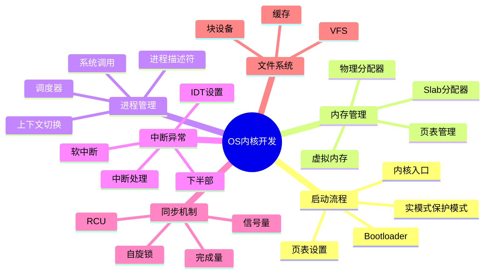

# C语言操作系统内核开发深度解析

> **层级定位**: 01 Core Knowledge System / 08 Application Domains
> **对应标准**: C11 + POSIX + 硬件相关
> **难度级别**: L5 综合
> **预估学习时间**: 20-30 小时

---

## 📋 本节概要

| 属性 | 内容 |
|:-----|:-----|
| **核心概念** | 内核架构、内存管理、进程调度、中断处理、驱动程序 |
| **前置知识** | 指针、内存管理、并发、汇编 |
| **后续延伸** | Linux内核源码、操作系统设计 |
| **权威来源** | Linux Kernel, MIT 6.828, OSDev Wiki |

---


---

## 📑 目录

- [C语言操作系统内核开发深度解析](#c语言操作系统内核开发深度解析)
  - [📋 本节概要](#-本节概要)
  - [📑 目录](#-目录)
  - [🧠 知识结构思维导图](#-知识结构思维导图)
  - [📖 核心概念详解](#-核心概念详解)
    - [1. 内核基础架构](#1-内核基础架构)
      - [1.1 内核类型](#11-内核类型)
      - [1.2 内核内存布局（Linux x86\_64）](#12-内核内存布局linux-x86_64)
    - [2. 内存管理](#2-内存管理)
      - [2.1 物理内存分配器](#21-物理内存分配器)
      - [2.2 Slab分配器](#22-slab分配器)
    - [3. 进程调度](#3-进程调度)
    - [4. 中断处理](#4-中断处理)
  - [⚠️ 常见陷阱](#️-常见陷阱)
    - [陷阱 KERNEL01: 睡眠与原子上下文](#陷阱-kernel01-睡眠与原子上下文)
    - [陷阱 KERNEL02: 竞态条件](#陷阱-kernel02-竞态条件)
  - [✅ 质量验收清单](#-质量验收清单)


---

## 🧠 知识结构思维导图



---

## 📖 核心概念详解

### 1. 内核基础架构

#### 1.1 内核类型

```
┌─────────────────────────────────────────────────────────────┐
│                     内核架构对比                             │
├─────────────────────────────────────────────────────────────┤
│                                                              │
│  宏内核                        微内核                       │
│  ┌─────────────┐              ┌─────────────┐              │
│  │  系统调用   │              │  系统调用   │              │
│  ├─────────────┤              ├─────────────┤              │
│  │  文件系统   │              │             │              │
│  │  设备驱动   │   内核空间   │  最小内核    │   内核空间   │
│  │  网络栈     │              │             │              │
│  │  调度器     │              ├─────────────┤              │
│  └─────────────┘              │ 文件系统服务 │   用户空间   │
│         │                     │ 驱动服务    │              │
│         ▼                     │ 网络服务    │              │
│      硬件                     └─────────────┘              │
│                                                              │
│  Linux/Windows                QNX/Minix/L4                  │
│                                                              │
└─────────────────────────────────────────────────────────────┘
```

#### 1.2 内核内存布局（Linux x86_64）

```
高地址 0xFFFFFFFFFFFFFFFF
┌─────────────────────────┐
│      内核映射区域        │  直接映射物理内存 (PAGE_OFFSET)
│  (Direct Mapping)       │
├─────────────────────────┤ 0xffff888000000000
│      vmalloc区域        │  非连续内存分配
├─────────────────────────┤
│      内核模块           │  可加载模块
├─────────────────────────┤
│      内核代码/数据      │  .text, .data, .bss
├─────────────────────────┤ 0xffffffff80000000
│      保留区域           │
└─────────────────────────┘ 0xFFFF800000000000

低地址 0x0000000000000000
┌─────────────────────────┐
│      用户空间           │  进程虚拟内存
│      (47位)             │
└─────────────────────────┘ 0x00007FFFFFFFFFFF
```

### 2. 内存管理

#### 2.1 物理内存分配器

```c
// 简单的伙伴系统分配器

#define MIN_BLOCK_SIZE  (4 * 1024)      // 4KB
#define MAX_BLOCK_SIZE  (4 * 1024 * 1024) // 4MB
#define MAX_ORDER       10

struct free_area {
    struct list_head free_list;
    size_t nr_free;
};

struct buddy_allocator {
    struct free_area free_area[MAX_ORDER];
    void *memory_start;
    size_t memory_size;
    uint8_t *bitmap;  // 记录块状态
};

// 初始化
void buddy_init(struct buddy_allocator *ba, void *start, size_t size) {
    ba->memory_start = start;
    ba->memory_size = size;

    // 初始时整个内存是一个大的空闲块
    int max_order = __fls(size / MIN_BLOCK_SIZE);
    list_add(&initial_block->list, &ba->free_area[max_order].free_list);
    ba->free_area[max_order].nr_free = 1;
}

// 分配
void *buddy_alloc(struct buddy_allocator *ba, size_t size) {
    int order = __fls((size + MIN_BLOCK_SIZE - 1) / MIN_BLOCK_SIZE - 1) + 1;

    // 找到合适大小的块
    for (int i = order; i < MAX_ORDER; i++) {
        if (!list_empty(&ba->free_area[i].free_list)) {
            // 分割大块
            // ... 实现分割逻辑
            return block;
        }
    }
    return NULL;  // 内存不足
}

// 释放（合并伙伴）
void buddy_free(struct buddy_allocator *ba, void *ptr, size_t size) {
    // 找到伙伴，如果也空闲则合并
    // ... 实现合并逻辑
}
```

#### 2.2 Slab分配器

```c
// Slab分配器用于分配固定大小的对象

struct kmem_cache {
    char *name;              // 缓存名称
    size_t object_size;      // 对象大小
    size_t align;            // 对齐要求
    struct slab *partial;    // 部分使用的slab
    struct slab *full;       // 满的slab
    struct slab *free;       // 空闲slab
    void (*ctor)(void *);    // 构造函数
};

struct slab {
    struct list_head list;
    void *s_mem;             // 第一个对象
    unsigned int inuse;      // 已分配对象数
    void **freelist;         // 空闲对象链表
};

// 创建缓存
struct kmem_cache *kmem_cache_create(
    const char *name,
    size_t size,
    size_t align,
    void (*ctor)(void *)
) {
    struct kmem_cache *cache = alloc_bootmem(sizeof(*cache));
    cache->name = name;
    cache->object_size = size;
    cache->align = align;
    cache->ctor = ctor;
    INIT_LIST_HEAD(&cache->partial);
    INIT_LIST_HEAD(&cache->full);
    INIT_LIST_HEAD(&cache->free);
    return cache;
}

// 分配对象
void *kmem_cache_alloc(struct kmem_cache *cache) {
    struct slab *slab;
    void *obj = NULL;

    // 优先从partial slab分配
    if (!list_empty(&cache->partial)) {
        slab = list_entry(cache->partial.next, struct slab, list);
    } else if (!list_empty(&cache->free)) {
        // 使用空闲slab
        slab = list_entry(cache->free.next, struct slab, list);
        list_move(&slab->list, &cache->partial);
    } else {
        // 创建新slab
        slab = alloc_new_slab(cache);
        list_add(&slab->list, &cache->partial);
    }

    // 从slab分配对象
    obj = slab->freelist;
    slab->freelist = *(void **)obj;
    slab->inuse++;

    if (slab->inuse == objects_per_slab(cache)) {
        list_move(&slab->list, &cache->full);
    }

    return obj;
}
```

### 3. 进程调度

```c
// 简单的优先级调度器

#define NR_PRIO 140
#define MAX_TASKS 1024

enum task_state {
    TASK_RUNNING = 0,
    TASK_INTERRUPTIBLE,
    TASK_UNINTERRUPTIBLE,
    TASK_STOPPED,
    TASK_ZOMBIE,
};

struct task_struct {
    pid_t pid;
    char comm[16];
    volatile enum task_state state;
    int prio;                    // 优先级 (0-139, 越低越优先)
    int static_prio;             // 静态优先级
    int nice;                    // nice值 (-20 to 19)

    struct list_head run_list;   // 运行队列链表
    struct list_head tasks;      // 所有任务链表

    uint64_t utime;              // 用户态时间
    uint64_t stime;              // 内核态时间
    uint64_t start_time;         // 启动时间

    struct mm_struct *mm;        // 内存描述符
    struct thread_info *thread_info;

    // 上下文
    struct cpu_context cpu_context;
};

struct runqueue {
    struct list_head queue[NR_PRIO];
    int nr_running;
    int curr_prio;               // 当前最高优先级
};

// 调度器主循环
void schedule(void) {
    struct task_struct *prev = current;
    struct task_struct *next;
    struct runqueue *rq = &cpu_rq(smp_processor_id());

    // 选择下一个任务（O(1)调度）
    int prio = sched_find_first_bit(rq->bitmap);
    next = list_entry(rq->queue[prio].next, struct task_struct, run_list);

    if (prev != next) {
        context_switch(prev, next);
    }
}

// 上下文切换（汇编实现）
__attribute__((naked)) void context_switch(struct task_struct *prev,
                                            struct task_struct *next) {
    // 保存prev上下文
    __asm__ __volatile__ (
        "pushq %%rbp\n\t"
        "pushq %%rbx\n\t"
        "pushq %%r12\n\t"
        "pushq %%r13\n\t"
        "pushq %%r14\n\t"
        "pushq %%r15\n\t"
        "movq %%rsp, %[prev_sp]\n\t"
        "movq %[next_sp], %%rsp\n\t"
        "popq %%r15\n\t"
        "popq %%r14\n\t"
        "popq %%r13\n\t"
        "popq %%r12\n\t"
        "popq %%rbx\n\t"
        "popq %%rbp\n\t"
        : [prev_sp] "=m" (prev->cpu_context.sp)
        : [next_sp] "m" (next->cpu_context.sp)
        : "memory"
    );
}
```

### 4. 中断处理

```c
// IDT（中断描述符表）设置

#define IDT_ENTRIES 256

struct idt_entry {
    uint16_t offset_low;    // 处理函数低16位
    uint16_t selector;      // 代码段选择子
    uint8_t  ist;           // 中断栈表
    uint8_t  type_attr;     // 类型和属性
    uint16_t offset_mid;    // 中16位
    uint32_t offset_high;   // 高32位
    uint32_t zero;          // 保留
} __attribute__((packed));

struct idt_ptr {
    uint16_t limit;
    uint64_t base;
} __attribute__((packed));

static struct idt_entry idt[IDT_ENTRIES];
static struct idt_ptr idtp;

// 设置IDT条目
void idt_set_gate(int num, uint64_t handler, uint16_t sel, uint8_t flags) {
    idt[num].offset_low = handler & 0xFFFF;
    idt[num].offset_mid = (handler >> 16) & 0xFFFF;
    idt[num].offset_high = (handler >> 32) & 0xFFFFFFFF;
    idt[num].selector = sel;
    idt[num].ist = 0;
    idt[num].type_attr = flags;
    idt[num].zero = 0;
}

// 通用中断处理入口（汇编）
__attribute__((naked)) void interrupt_handler_entry(void) {
    __asm__ (
        "pushq %rax\n\t"
        "pushq %rcx\n\t"
        "pushq %rdx\n\t"
        "pushq %rsi\n\t"
        "pushq %rdi\n\t"
        "pushq %r8\n\t"
        "pushq %r9\n\t"
        "pushq %r10\n\t"
        "pushq %r11\n\t"
        "movq %rsp, %rdi\n\t"  // 参数：寄存器帧
        "call do_interrupt_handler\n\t"
        "popq %r11\n\t"
        "popq %r10\n\t"
        "popq %r9\n\t"
        "popq %r8\n\t"
        "popq %rdi\n\t"
        "popq %rsi\n\t"
        "popq %rdx\n\t"
        "popq %rcx\n\t"
        "popq %rax\n\t"
        "iretq"
    );
}

// C语言中断处理
void do_interrupt_handler(struct pt_regs *regs) {
    int irq = regs->irq;

    // 发送EOI（结束中断）给PIC/APIC
    if (irq >= 32) {
        lapic_eoi();
    }

    // 调用注册的处理函数
    if (irq_handlers[irq]) {
        irq_handlers[irq](regs);
    }
}
```

---

## ⚠️ 常见陷阱

### 陷阱 KERNEL01: 睡眠与原子上下文

```c
// ❌ 在中断上下文中睡眠
void interrupt_handler(void) {
    mutex_lock(&lock);  // 可能睡眠！在中断上下文崩溃
    // ...
}

// ✅ 使用自旋锁（不睡眠）
void interrupt_handler_safe(void) {
    spin_lock(&lock);  // 忙等待，不睡眠
    // ...
    spin_unlock(&lock);
}

// ✅ 工作队列延后处理
void interrupt_handler_defer(void) {
    // 快速ack中断
    schedule_work(&my_work);  // 延后到进程上下文处理
}
```

### 陷阱 KERNEL02: 竞态条件

```c
// ❌ 无保护的共享数据
int counter = 0;

void unsafe_inc(void) {
    counter++;  // 非原子操作，可能丢失更新
}

// ✅ 原子操作
atomic_t safe_counter = ATOMIC_INIT(0);
void safe_inc(void) {
    atomic_inc(&safe_counter);
}

// ✅ 或自旋锁保护
static DEFINE_SPINLOCK(counter_lock);
static int locked_counter = 0;

void locked_inc(void) {
    spin_lock(&counter_lock);
    locked_counter++;
    spin_unlock(&counter_lock);
}
```

---

## ✅ 质量验收清单

- [x] 内核架构对比
- [x] 内存管理（伙伴系统/Slab）
- [x] 进程调度
- [x] 中断处理
- [x] 并发与同步
- [x] 常见陷阱

---

> **更新记录**
>
> - 2025-03-09: 初版创建
