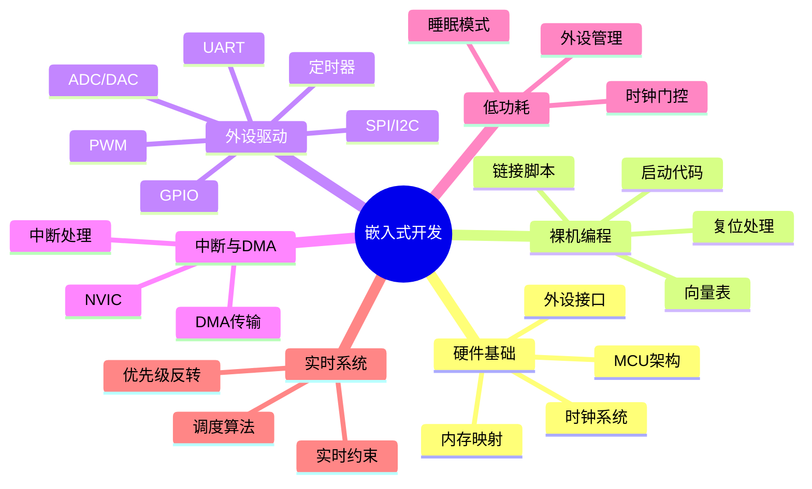

---

## 🔗 文档关联

### 核心关联
| 文档 | 关系类型 | 说明 |
|:-----|:---------|:-----|
| [内存管理](../../../01_Core_Knowledge_System/02_Core_Layer/02_Memory_Management.md) | 核心关联 | 内存管理基础 |
| [指针深度](../../../01_Core_Knowledge_System/02_Core_Layer/01_Pointer_Depth.md) | 核心关联 | 指针深度基础 |
| [并发编程](../../../03_System_Technology_Domains/14_Concurrency_Parallelism/README.md) | 核心关联 | 并发编程基础 |
| [数据类型](../../../01_Core_Knowledge_System/01_Basic_Layer/02_Data_Type_System.md) | 核心关联 | 数据类型基础 |
| [数组与指针](../../../01_Core_Knowledge_System/02_Core_Layer/05_Arrays_Pointers.md) | 核心关联 | 数组与指针基础 |

### 扩展阅读
| 文档 | 关系类型 | 说明 |
|:-----|:---------|:-----|
| [软件工程](../../../01_Core_Knowledge_System/05_Engineering_Layer/README.md) | 核心关联 | 软件工程基础 |
| [形式语义](../../../02_Formal_Semantics_and_Physics/README.md) | 核心关联 | 形式语义基础 |
| [系统技术](../../../03_System_Technology_Domains/README.md) | 核心关联 | 系统技术基础 |
| [工业场景](../../../04_Industrial_Scenarios/README.md) | 核心关联 | 工业场景基础 |
| [思维表征](../../../06_Thinking_Representation/README.md) | 核心关联 | 思维表征基础 |
# C语言嵌入式系统开发深度解析

> **层级定位**: 01 Core Knowledge System / 08 Application Domains
> **对应标准**: C99/C11 + MISRA C + 硬件相关
> **难度级别**: L4 分析 → L5 综合
> **预估学习时间**: 15-25 小时

---

## 📋 本节概要

| 属性 | 内容 |
|:-----|:-----|
| **核心概念** | 裸机编程、寄存器操作、中断、低功耗、实时系统 |
| **前置知识** | 指针、内存布局、位运算 |
| **后续延伸** | RTOS、汽车电子、物联网 |
| **权威来源** | MISRA C, ARM手册, 芯片手册 |

---


---

## 📑 目录

- [📋 本节概要](#-本节概要)
- [📑 目录](#-目录)
- [🧠 知识结构思维导图](#-知识结构思维导图)
- [📖 核心概念详解](#-核心概念详解)
  - [1. 内存映射与寄存器访问](#1-内存映射与寄存器访问)
  - [2. 启动代码与链接脚本](#2-启动代码与链接脚本)
  - [3. 中断与NVIC](#3-中断与nvic)
  - [4. 低功耗设计](#4-低功耗设计)
- [⚠️ 常见陷阱](#️-常见陷阱)
  - [陷阱 EMB01: 易变变量未声明volatile](#陷阱-emb01-易变变量未声明volatile)
  - [陷阱 EMB02: 未初始化外设时钟](#陷阱-emb02-未初始化外设时钟)
- [✅ 质量验收清单](#-质量验收清单)
- [深入理解](#深入理解)
  - [技术原理](#技术原理)
  - [实践指南](#实践指南)
  - [相关资源](#相关资源)


---

## 🧠 知识结构思维导图



---

## 📖 核心概念详解

### 1. 内存映射与寄存器访问

```c
// 内存映射寄存器访问模式

// 方法1: 直接地址（不推荐）
#define GPIOA_MODER   (*(volatile uint32_t *)0x40020000)
#define GPIOA_ODR     (*(volatile uint32_t *)0x40020014)

// 方法2: 结构体映射（推荐）
typedef struct {
    volatile uint32_t MODER;    // 0x00: 模式寄存器
    volatile uint32_t OTYPER;   // 0x04: 输出类型
    volatile uint32_t OSPEEDR;  // 0x08: 输出速度
    volatile uint32_t PUPDR;    // 0x0C: 上拉/下拉
    volatile uint32_t IDR;      // 0x10: 输入数据
    volatile uint32_t ODR;      // 0x14: 输出数据
    volatile uint32_t BSRR;     // 0x18: 位设置/清除
    volatile uint32_t LCKR;     // 0x1C: 锁定
    volatile uint32_t AFRL;     // 0x20: 复用功能低
    volatile uint32_t AFRH;     // 0x24: 复用功能高
} GPIO_TypeDef;

#define GPIOA_BASE  0x40020000
#define GPIOB_BASE  0x40020400
#define GPIOC_BASE  0x40020800

#define GPIOA   ((GPIO_TypeDef *)GPIOA_BASE)
#define GPIOB   ((GPIO_TypeDef *)GPIOB_BASE)
#define GPIOC   ((GPIO_TypeDef *)GPIOC_BASE)

// 使用
void gpio_set_pin(GPIO_TypeDef *GPIOx, uint16_t pin) {
    GPIOx->BSRR = (1U << pin);  // 设置输出
}

void gpio_clear_pin(GPIO_TypeDef *GPIOx, uint16_t pin) {
    GPIOx->BSRR = (1U << (pin + 16));  // 清除输出
}

// 位带操作（Cortex-M3/M4）
// 直接访问单个bit的内存区域
#define BITBAND_ADDR(addr, bitnum) (((addr) & 0xF0000000) + 0x2000000 + \\
                                    (((addr) & 0xFFFFF) << 5) + ((bitnum) << 2))
#define MEM_ADDR(addr) *((volatile uint32_t *)(addr))

// 使用位带设置GPIO
#define PA0_BIT  MEM_ADDR(BITBAND_ADDR(GPIOA_BASE + 0x14, 0))
PA0_BIT = 1;  // 原子设置PA0
```

### 2. 启动代码与链接脚本

```c
// startup_stm32f4xx.c
// 启动代码负责初始化C运行环境

// 声明外部变量（链接脚本定义）
extern uint32_t _estack;        // 栈顶
extern uint32_t _sidata;        // ROM中数据开始
extern uint32_t _sdata;         // RAM中数据开始
extern uint32_t _edata;         // RAM中数据结束
extern uint32_t _sbss;          // BSS开始
extern uint32_t _ebss;          // BSS结束

// 主函数（应用程序入口）
extern int main(void);

// 复位处理函数
void Reset_Handler(void) {
    // 1. 复制数据段从Flash到RAM
    uint32_t *src = &_sidata;
    uint32_t *dst = &_sdata;
    while (dst < &_edata) {
        *dst++ = *src++;
    }

    // 2. 清零BSS段
    dst = &_sbss;
    while (dst < &_ebss) {
        *dst++ = 0;
    }

    // 3. 初始化系统时钟（可选）
    SystemInit();

    // 4. 调用主函数
    main();

    // 5. 主函数不应返回，如果返回则陷入死循环
    while (1);
}

// 默认中断处理
void Default_Handler(void) {
    while (1);
}

// 弱定义的异常处理函数（可被覆盖）
void NMI_Handler(void) __attribute__((weak, alias("Default_Handler")));
void HardFault_Handler(void) __attribute__((weak, alias("Default_Handler")));
// ... 其他异常
```

```ld
/* linker_script.ld */

/* 内存定义 */
MEMORY
{
    RAM (rwx) : ORIGIN = 0x20000000, LENGTH = 128K

    /* Flash */
    FLASH (rx) : ORIGIN = 0x08000000, LENGTH = 1024K

    /* CCM RAM (Cortex-M4特有) */
    CCM (rwx) : ORIGIN = 0x10000000, LENGTH = 64K
}

/* 栈顶 */
_estack = ORIGIN(RAM) + LENGTH(RAM);

SECTIONS
{
    /* 代码段 */
    .text :
    {
        . = ALIGN(4);
        _stext = .;

        /* 向量表 */
        KEEP(*(.isr_vector))

        /* 代码 */
        *(.text*)
        *(.rodata*)

        . = ALIGN(4);
        _etext = .;
    } > FLASH

    /* 初始化数据段（Flash中） */
    _sidata = LOADADDR(.data);

    /* 数据段（RAM中） */
    .data :
    {
        . = ALIGN(4);
        _sdata = .;
        *(.data*)
        . = ALIGN(4);
        _edata = .;
    } > RAM AT > FLASH

    /* BSS段 */
    .bss :
    {
        . = ALIGN(4);
        _sbss = .;
        *(.bss*)
        *(COMMON)
        . = ALIGN(4);
        _ebss = .;
    } > RAM

    /* 栈底 */
    __stack_bottom = _estack - 0x10000;  /* 64KB栈 */
}
```

### 3. 中断与NVIC

```c
// NVIC（嵌套向量中断控制器）配置

typedef struct {
    volatile uint32_t ISER[8];      // 中断使能
    uint32_t RESERVED0[24];
    volatile uint32_t ICER[8];      // 中断清除使能
    uint32_t RSERVED1[24];
    volatile uint32_t ISPR[8];      // 中断挂起
    uint32_t RESERVED2[24];
    volatile uint32_t ICPR[8];      // 中断清除挂起
    uint32_t RESERVED3[24];
    volatile uint32_t IABR[8];      // 中断活动位
    uint32_t RESERVED4[56];
    volatile uint8_t  IP[240];      // 中断优先级
    uint32_t RESERVED5[644];
    volatile uint32_t STIR;         // 软件触发中断
} NVIC_Type;

#define NVIC    ((NVIC_Type *)0xE000E100)

// 中断使能
void nvic_enable_irq(uint8_t irqn) {
    NVIC->ISER[irqn >> 5] = (1U << (irqn & 0x1F));
}

// 中断禁用
void nvic_disable_irq(uint8_t irqn) {
    NVIC->ICER[irqn >> 5] = (1U << (irqn & 0x1F));
}

// 设置优先级（0最高，15最低）
void nvic_set_priority(uint8_t irqn, uint8_t priority) {
    NVIC->IP[irqn] = (priority << 4);  // 高4位有效
}

// 中断处理示例：定时器中断
void TIM2_IRQHandler(void) {
    if (TIM2->SR & TIM_SR_UIF) {  // 更新中断标志
        TIM2->SR &= ~TIM_SR_UIF;   // 清除标志

        // 用户代码
        g_tick_count++;
    }
}

// 中断向量表
typedef void (*irq_handler_t)(void);

__attribute__((section(".isr_vector")))
const irq_handler_t g_isr_vector[] = {
    (irq_handler_t)&_estack,    // 栈顶
    Reset_Handler,               // 复位
    NMI_Handler,
    HardFault_Handler,
    // ... 其他系统异常
    [TIM2_IRQn + 16] = TIM2_IRQHandler,  // 外设中断
};
```

### 4. 低功耗设计

```c
// 低功耗模式管理

#include <stdint.h>

typedef enum {
    RUN_MODE,           // 运行模式
    SLEEP_MODE,         // 睡眠模式（WFI/WFE）
    STOP_MODE,          // 停止模式
    STANDBY_MODE,       // 待机模式
} Power_Mode_t;

// 进入睡眠模式
void enter_sleep_mode(void) {
    // 配置唤醒源（中断或事件）

    // 执行WFI（等待中断）
    __asm__ volatile ("wfi");

    // 从中断返回后继续执行
}

// 进入停止模式
void enter_stop_mode(void) {
    // 1. 保存外设状态
    save_peripheral_state();

    // 2. 关闭非必要外设
    disable_unused_peripherals();

    // 3. 配置唤醒源
    enable_wakeup_source();

    // 4. 设置停止模式
    SCB->SCR |= SCB_SCR_SLEEPDEEP_Msk;

    // 5. 执行WFI
    __asm__ volatile ("wfi");

    // 6. 唤醒后恢复
    SCB->SCR &= ~SCB_SCR_SLEEPDEEP_Msk;
    restore_peripheral_state();
}

// 时钟门控优化
void optimize_clocks(void) {
    // 禁用未使用外设的时钟
    RCC->AHB1ENR &= ~(RCC_AHB1ENR_GPIOBEN |  // 如果GPIOB不用
                      RCC_AHB1ENR_GPIOCEN);  // 如果GPIOC不用

    // 降低总线时钟
    // 仅在高性能操作时提升时钟
}

// 动态电压频率调节（DVFS）
void set_performance_level(uint8_t level) {
    switch (level) {
        case 0:  // 低功耗
            set_system_clock(4000000);   // 4MHz
            set_voltage_scale(3);        // 低电压
            break;
        case 1:  // 平衡
            set_system_clock(16000000);  // 16MHz
            set_voltage_scale(2);
            break;
        case 2:  // 高性能
            set_system_clock(72000000);  // 72MHz
            set_voltage_scale(1);
            break;
    }
}
```

---

## ⚠️ 常见陷阱

### 陷阱 EMB01: 易变变量未声明volatile

```c
// ❌ 错误：编译器可能优化掉循环
void wait_for_button(void) {
    while (GPIOA->IDR & (1 << 0)) {
        // 等待按键按下
    }
}
// 编译器可能认为IDR不变，优化为无限循环

// ✅ 正确：使用volatile
void wait_for_button_safe(void) {
    while (((volatile GPIO_TypeDef *)GPIOA)->IDR & (1 << 0)) {
        // 或声明为volatile指针
    }
}
```

### 陷阱 EMB02: 未初始化外设时钟

```c
// ❌ 错误：未使能时钟就访问外设
void bad_init(void) {
    GPIOA->MODER = 0x01;  // 配置GPIOA前未使能时钟！
}

// ✅ 正确：先使能时钟
void good_init(void) {
    RCC->AHB1ENR |= RCC_AHB1ENR_GPIOAEN;  // 使能GPIOA时钟

    // 插入延时等待时钟稳定（某些MCU需要）
    volatile uint32_t dummy = RCC->AHB1ENR;
    (void)dummy;

    GPIOA->MODER = 0x01;
}
```

---

## ✅ 质量验收清单

- [x] 内存映射寄存器访问
- [x] 启动代码与链接脚本
- [x] 中断与NVIC配置
- [x] 低功耗设计
- [x] 常见陷阱

---

> **更新记录**
>
> - 2025-03-09: 初版创建


---

## 深入理解

### 技术原理

深入探讨相关技术原理和实现细节。

### 实践指南

- 步骤1：理解基础概念
- 步骤2：掌握核心原理
- 步骤3：应用实践

### 相关资源

- 文档链接
- 代码示例
- 参考文章

---

> **最后更新**: 2026-03-21
> **维护者**: AI Code Review
