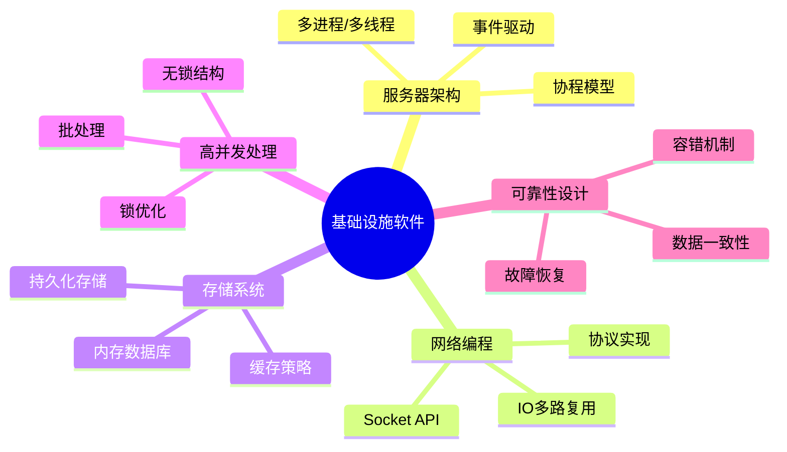

# C语言基础设施软件开发深度解析

> **层级定位**: 01 Core Knowledge System / 08 Application Domains
> **对应标准**: C99/C11/C17 + POSIX
> **难度级别**: L4 分析 → L5 综合
> **预估学习时间**: 15-25 小时

---

## 📋 本节概要

| 属性 | 内容 |
|:-----|:-----|
| **核心概念** | 服务器架构、网络编程、数据库内核、缓存系统、高并发处理 |
| **前置知识** | 指针、内存管理、并发编程、系统调用 |
| **后续延伸** | 分布式系统、云原生基础设施、高性能存储 |
| **权威来源** | Redis源码, Nginx架构, Linux Kernel, SQLite设计 |

---


---

## 📑 目录

- [C语言基础设施软件开发深度解析](#c语言基础设施软件开发深度解析)
  - [📋 本节概要](#-本节概要)
  - [📑 目录](#-目录)
  - [🧠 知识结构思维导图](#-知识结构思维导图)
  - [📖 核心概念详解](#-核心概念详解)
    - [1. 高性能服务器架构模式](#1-高性能服务器架构模式)
      - [1.1 事件驱动架构 (Reactor模式)](#11-事件驱动架构-reactor模式)
      - [1.2 多进程模型 (Pre-fork)](#12-多进程模型-pre-fork)
    - [2. 内存数据结构 (类似Redis)](#2-内存数据结构-类似redis)
      - [2.1 动态字符串 (SDS)](#21-动态字符串-sds)
      - [2.2 哈希表实现](#22-哈希表实现)
    - [3. 缓存淘汰策略](#3-缓存淘汰策略)
      - [3.1 LRU缓存实现](#31-lru缓存实现)
    - [4. 持久化与日志](#4-持久化与日志)
      - [4.1 Write-Ahead Log (WAL)](#41-write-ahead-log-wal)
    - [5. 高并发数据结构](#5-高并发数据结构)
      - [5.1 无锁队列 (Michael-Scott Queue)](#51-无锁队列-michael-scott-queue)
  - [🔄 多维矩阵对比](#-多维矩阵对比)
    - [服务器架构模式对比](#服务器架构模式对比)
    - [I/O多路复用对比](#io多路复用对比)
    - [缓存淘汰策略对比](#缓存淘汰策略对比)
  - [⚠️ 常见陷阱](#️-常见陷阱)
    - [陷阱 INF01: 文件描述符泄漏](#陷阱-inf01-文件描述符泄漏)
    - [陷阱 INF02: 竞态条件](#陷阱-inf02-竞态条件)
    - [陷阱 INF03: 内存碎片](#陷阱-inf03-内存碎片)
  - [✅ 质量验收清单](#-质量验收清单)


---

## 🧠 知识结构思维导图



---

## 📖 核心概念详解

### 1. 高性能服务器架构模式

#### 1.1 事件驱动架构 (Reactor模式)

```c
#include <sys/epoll.h>
#include <sys/socket.h>
#include <netinet/in.h>
#include <unistd.h>
#include <stdio.h>
#include <stdlib.h>
#include <string.h>
#include <errno.h>
#include <fcntl.h>

#define MAX_EVENTS 1024
#define BUFFER_SIZE 4096

typedef struct {
    int fd;
    void (*handler)(int fd, uint32_t events);
} EventHandler;

// 设置非阻塞
int set_nonblocking(int fd) {
    int flags = fcntl(fd, F_GETFL, 0);
    return fcntl(fd, F_SETFL, flags | O_NONBLOCK);
}

// Reactor主循环
void reactor_loop(int listen_fd) {
    int epoll_fd = epoll_create1(EPOLL_CLOEXEC);
    if (epoll_fd < 0) {
        perror("epoll_create1");
        return;
    }

    struct epoll_event ev, events[MAX_EVENTS];
    ev.events = EPOLLIN;
    ev.data.fd = listen_fd;
    epoll_ctl(epoll_fd, EPOLL_CTL_ADD, listen_fd, &ev);

    printf("Server listening...\n");

    while (1) {
        int nfds = epoll_wait(epoll_fd, events, MAX_EVENTS, -1);
        for (int i = 0; i < nfds; i++) {
            if (events[i].data.fd == listen_fd) {
                // 新连接
                struct sockaddr_in addr;
                socklen_t len = sizeof(addr);
                int conn_fd = accept(listen_fd, (struct sockaddr*)&addr, &len);
                if (conn_fd > 0) {
                    set_nonblocking(conn_fd);
                    ev.events = EPOLLIN | EPOLLET;  // 边缘触发
                    ev.data.fd = conn_fd;
                    epoll_ctl(epoll_fd, EPOLL_CTL_ADD, conn_fd, &ev);
                }
            } else {
                // 处理客户端数据
                char buffer[BUFFER_SIZE];
                int n = read(events[i].data.fd, buffer, BUFFER_SIZE);
                if (n > 0) {
                    // 回显
                    write(events[i].data.fd, buffer, n);
                } else if (n == 0 || (n < 0 && errno != EAGAIN)) {
                    close(events[i].data.fd);
                }
            }
        }
    }
}
```

#### 1.2 多进程模型 (Pre-fork)

```c
#include <sys/socket.h>
#include <netinet/in.h>
#include <unistd.h>
#include <signal.h>
#include <stdio.h>
#include <stdlib.h>
#include <string.h>

#define WORKER_PROCESSES 4
#define PORT 8080

// 工作进程处理客户端
void worker_process(int listen_fd, int worker_id) {
    printf("Worker %d started (PID: %d)\n", worker_id, getpid());

    while (1) {
        struct sockaddr_in client_addr;
        socklen_t addr_len = sizeof(client_addr);

        // 多个进程同时accept，内核负责负载均衡
        int client_fd = accept(listen_fd,
                               (struct sockaddr*)&client_addr,
                               &addr_len);

        if (client_fd < 0) continue;

        // 处理请求
        char buffer[1024];
        int n = read(client_fd, buffer, sizeof(buffer));
        if (n > 0) {
            const char* response =
                "HTTP/1.1 200 OK\r\n"
                "Content-Length: 13\r\n"
                "\r\n"
                "Hello, World!";
            write(client_fd, response, strlen(response));
        }
        close(client_fd);
    }
}

// 创建pre-fork工作进程
void spawn_workers(int listen_fd) {
    for (int i = 0; i < WORKER_PROCESSES; i++) {
        pid_t pid = fork();
        if (pid == 0) {
            // 子进程
            worker_process(listen_fd, i);
            exit(0);
        }
    }
}

int main(void) {
    int listen_fd = socket(AF_INET, SOCK_STREAM, 0);
    int opt = 1;
    setsockopt(listen_fd, SOL_SOCKET, SO_REUSEADDR, &opt, sizeof(opt));

    struct sockaddr_in addr = {
        .sin_family = AF_INET,
        .sin_port = htons(PORT),
        .sin_addr.s_addr = INADDR_ANY
    };

    bind(listen_fd, (struct sockaddr*)&addr, sizeof(addr));
    listen(listen_fd, 128);

    spawn_workers(listen_fd);

    // 父进程等待子进程
    while (1) {
        int status;
        pid_t pid = wait(&status);
        if (pid > 0) {
            printf("Worker %d exited, respawning...\n", pid);
            // 重新创建子进程
        }
    }

    return 0;
}
```

### 2. 内存数据结构 (类似Redis)

#### 2.1 动态字符串 (SDS)

```c
#include <stdlib.h>
#include <string.h>
#include <stdio.h>
#include <stdarg.h>

// 简单动态字符串 - Redis风格的实现
typedef char* sds;

struct sdshdr {
    size_t len;      // 已使用长度
    size_t alloc;    // 分配总长度
    char buf[];      // 柔性数组
};

#define SDS_HDR(s) ((struct sdshdr*)(s - sizeof(struct sdshdr)))
#define SDS_LEN(s) (SDS_HDR(s)->len)
#define SDS_AVAIL(s) (SDS_HDR(s)->alloc - SDS_HDR(s)->len)

// 创建SDS
sds sds_new(const char* init) {
    size_t initlen = init ? strlen(init) : 0;
    struct sdshdr* sh = malloc(sizeof(struct sdshdr) + initlen + 1);
    if (!sh) return NULL;

    sh->len = initlen;
    sh->alloc = initlen;
    if (initlen && init) memcpy(sh->buf, init, initlen);
    sh->buf[initlen] = '\0';

    return sh->buf;
}

// 释放SDS
void sds_free(sds s) {
    if (s) free(SDS_HDR(s));
}

// 确保空间足够
sds sds_make_room_for(sds s, size_t addlen) {
    if (SDS_AVAIL(s) >= addlen) return s;

    size_t newlen = SDS_LEN(s) + addlen;
    if (newlen < SDS_LEN(s) * 2) newlen = SDS_LEN(s) * 2;

    struct sdshdr* sh = realloc(SDS_HDR(s), sizeof(struct sdshdr) + newlen + 1);
    if (!sh) return NULL;

    sh->alloc = newlen;
    return sh->buf;
}

// 追加字符串
sds sds_cat(sds s, const char* t) {
    size_t len = strlen(t);
    s = sds_make_room_for(s, len);
    if (!s) return NULL;

    memcpy(s + SDS_LEN(s), t, len);
    SDS_HDR(s)->len += len;
    s[SDS_LEN(s)] = '\0';

    return s;
}

// 使用示例
void sds_demo(void) {
    sds mystr = sds_new("Hello");
    mystr = sds_cat(mystr, " World");
    printf("SDS: %s (len=%zu)\n", mystr, SDS_LEN(mystr));
    sds_free(mystr);
}
```

#### 2.2 哈希表实现

```c
#include <stdlib.h>
#include <string.h>
#include <stdint.h>
#include <stdio.h>

// 简单的哈希表实现
typedef struct DictEntry {
    char* key;
    void* value;
    struct DictEntry* next;
} DictEntry;

typedef struct {
    DictEntry** table;
    size_t size;
    size_t used;
} Dict;

// DJB2哈希函数
static uint64_t hash(const char* str) {
    uint64_t hash = 5381;
    int c;
    while ((c = *str++)) {
        hash = ((hash << 5) + hash) + c;
    }
    return hash;
}

// 创建哈希表
Dict* dict_create(size_t size) {
    Dict* d = malloc(sizeof(Dict));
    d->table = calloc(size, sizeof(DictEntry*));
    d->size = size;
    d->used = 0;
    return d;
}

// 插入键值对
int dict_insert(Dict* d, const char* key, void* value) {
    uint64_t idx = hash(key) % d->size;

    // 检查是否已存在
    DictEntry* entry = d->table[idx];
    while (entry) {
        if (strcmp(entry->key, key) == 0) {
            entry->value = value;  // 更新
            return 0;
        }
        entry = entry->next;
    }

    // 创建新条目
    entry = malloc(sizeof(DictEntry));
    entry->key = strdup(key);
    entry->value = value;
    entry->next = d->table[idx];
    d->table[idx] = entry;
    d->used++;

    return 0;
}

// 查找
void* dict_find(Dict* d, const char* key) {
    uint64_t idx = hash(key) % d->size;
    DictEntry* entry = d->table[idx];

    while (entry) {
        if (strcmp(entry->key, key) == 0) {
            return entry->value;
        }
        entry = entry->next;
    }
    return NULL;
}

// 释放
void dict_free(Dict* d) {
    for (size_t i = 0; i < d->size; i++) {
        DictEntry* entry = d->table[i];
        while (entry) {
            DictEntry* next = entry->next;
            free(entry->key);
            free(entry);
            entry = next;
        }
    }
    free(d->table);
    free(d);
}
```

### 3. 缓存淘汰策略

#### 3.1 LRU缓存实现

```c
#include <stdlib.h>
#include <string.h>
#include <stdio.h>
#include <stdbool.h>

// LRU缓存节点
typedef struct LRUCacheEntry {
    char* key;
    void* value;
    struct LRUCacheEntry* prev;
    struct LRUCacheEntry* next;
} LRUCacheEntry;

// LRU缓存
typedef struct {
    int capacity;
    int size;
    LRUCacheEntry* head;  // 最近使用
    LRUCacheEntry* tail;  // 最久未使用
    Dict* dict;           // 哈希表加速查找
} LRUCache;

// 创建LRU缓存
LRUCache* lru_cache_create(int capacity) {
    LRUCache* cache = malloc(sizeof(LRUCache));
    cache->capacity = capacity;
    cache->size = 0;
    cache->head = NULL;
    cache->tail = NULL;
    cache->dict = dict_create(capacity * 2);
    return cache;
}

// 移动到头部（最近使用）
static void move_to_head(LRUCache* cache, LRUCacheEntry* entry) {
    if (entry == cache->head) return;

    // 从当前位置移除
    if (entry->prev) entry->prev->next = entry->next;
    if (entry->next) entry->next->prev = entry->prev;
    if (entry == cache->tail) cache->tail = entry->prev;

    // 插入头部
    entry->prev = NULL;
    entry->next = cache->head;
    if (cache->head) cache->head->prev = entry;
    cache->head = entry;
    if (!cache->tail) cache->tail = entry;
}

// 移除尾部（最久未使用）
static void remove_tail(LRUCache* cache) {
    if (!cache->tail) return;

    LRUCacheEntry* old_tail = cache->tail;
    cache->tail = old_tail->prev;
    if (cache->tail) cache->tail->next = NULL;

    // 从哈希表移除
    dict_remove(cache->dict, old_tail->key);

    free(old_tail->key);
    free(old_tail);
    cache->size--;
}

// 获取值
void* lru_cache_get(LRUCache* cache, const char* key) {
    LRUCacheEntry* entry = dict_find(cache->dict, key);
    if (!entry) return NULL;

    move_to_head(cache, entry);
    return entry->value;
}

// 插入/更新
void lru_cache_put(LRUCache* cache, const char* key, void* value) {
    LRUCacheEntry* entry = dict_find(cache->dict, key);

    if (entry) {
        // 更新现有值
        entry->value = value;
        move_to_head(cache, entry);
        return;
    }

    // 新条目
    entry = malloc(sizeof(LRUCacheEntry));
    entry->key = strdup(key);
    entry->value = value;
    entry->prev = NULL;
    entry->next = cache->head;

    if (cache->head) cache->head->prev = entry;
    cache->head = entry;
    if (!cache->tail) cache->tail = entry;

    dict_insert(cache->dict, key, entry);
    cache->size++;

    // 淘汰
    if (cache->size > cache->capacity) {
        remove_tail(cache);
    }
}

// 使用示例
void lru_demo(void) {
    LRUCache* cache = lru_cache_create(3);

    lru_cache_put(cache, "a", (void*)1);
    lru_cache_put(cache, "b", (void*)2);
    lru_cache_put(cache, "c", (void*)3);
    // cache: c -> b -> a

    lru_cache_get(cache, "a");  // a移到头部
    // cache: a -> c -> b

    lru_cache_put(cache, "d", (void*)4);  // 淘汰b
    // cache: d -> a -> c

    printf("b exists: %s\n",
           lru_cache_get(cache, "b") ? "yes" : "no");
}
```

### 4. 持久化与日志

#### 4.1 Write-Ahead Log (WAL)

```c
#include <stdio.h>
#include <stdlib.h>
#include <string.h>
#include <stdint.h>
#include <time.h>
#include <fcntl.h>
#include <unistd.h>
#include <stdbool.h>

// WAL条目
typedef struct {
    uint32_t checksum;
    uint32_t timestamp;
    uint32_t key_len;
    uint32_t value_len;
    // 后面跟着key和value数据
} WALEntry;

#define WAL_MAGIC 0x57414C21  // "WAL!"

typedef struct {
    int fd;
    char* filename;
    uint64_t offset;
} WAL;

// 初始化WAL
WAL* wal_open(const char* filename) {
    WAL* wal = malloc(sizeof(WAL));
    wal->filename = strdup(filename);
    wal->fd = open(filename, O_CREAT | O_RDWR | O_APPEND, 0644);
    wal->offset = lseek(wal->fd, 0, SEEK_END);
    return wal;
}

// 计算简单校验和
static uint32_t checksum(const uint8_t* data, size_t len) {
    uint32_t sum = 0;
    for (size_t i = 0; i < len; i++) {
        sum = sum * 31 + data[i];
    }
    return sum;
}

// 追加记录
bool wal_append(WAL* wal, const char* key, const uint8_t* value, uint32_t value_len) {
    uint32_t key_len = strlen(key);
    uint32_t entry_size = sizeof(WALEntry) + key_len + value_len;

    uint8_t* buffer = malloc(entry_size);
    WALEntry* entry = (WALEntry*)buffer;

    entry->timestamp = (uint32_t)time(NULL);
    entry->key_len = key_len;
    entry->value_len = value_len;

    // 复制key和value
    memcpy(buffer + sizeof(WALEntry), key, key_len);
    memcpy(buffer + sizeof(WALEntry) + key_len, value, value_len);

    // 计算校验和
    entry->checksum = checksum(buffer + sizeof(uint32_t),
                               entry_size - sizeof(uint32_t));

    // 写入文件
    ssize_t written = write(wal->fd, buffer, entry_size);

    // fsync保证持久化
    fsync(wal->fd);

    free(buffer);
    return written == entry_size;
}

// 恢复数据
void wal_replay(WAL* wal, void (*apply)(const char* key,
                                        const uint8_t* value,
                                        uint32_t value_len)) {
    lseek(wal->fd, 0, SEEK_SET);

    uint8_t buffer[4096];
    while (1) {
        // 读取条目头
        ssize_t n = read(wal->fd, buffer, sizeof(WALEntry));
        if (n < sizeof(WALEntry)) break;

        WALEntry* entry = (WALEntry*)buffer;
        uint32_t total_size = entry->key_len + entry->value_len;

        // 读取key和value
        read(wal->fd, buffer + sizeof(WALEntry), total_size);

        // 验证校验和
        uint32_t computed = checksum(buffer + sizeof(uint32_t),
                                     sizeof(WALEntry) + total_size - sizeof(uint32_t));

        if (computed == entry->checksum) {
            char key[256];
            memcpy(key, buffer + sizeof(WALEntry), entry->key_len);
            key[entry->key_len] = '\0';

            apply(key, buffer + sizeof(WALEntry) + entry->key_len, entry->value_len);
        }
    }
}
```

### 5. 高并发数据结构

#### 5.1 无锁队列 (Michael-Scott Queue)

```c
#include <stdatomic.h>
#include <stdlib.h>
#include <stdio.h>

// 无锁队列节点
typedef struct Node {
    void* data;
    _Atomic(struct Node*) next;
} Node;

// 无锁队列
typedef struct {
    _Atomic(Node*) head;
    _Atomic(Node*) tail;
} LockFreeQueue;

// 创建队列
LockFreeQueue* lfqueue_create(void) {
    LockFreeQueue* q = malloc(sizeof(LockFreeQueue));
    Node* dummy = malloc(sizeof(Node));
    dummy->data = NULL;
    atomic_store(&dummy->next, NULL);

    atomic_store(&q->head, dummy);
    atomic_store(&q->tail, dummy);
    return q;
}

// 入队
void lfqueue_enqueue(LockFreeQueue* q, void* data) {
    Node* node = malloc(sizeof(Node));
    node->data = data;
    atomic_store(&node->next, NULL);

    Node* tail;
    Node* next;

    while (1) {
        tail = atomic_load(&q->tail);
        next = atomic_load(&tail->next);

        // 检查tail是否仍然是最新的
        if (tail == atomic_load(&q->tail)) {
            if (next == NULL) {
                // 尝试链接新节点
                if (atomic_compare_exchange_weak(&tail->next, &next, node)) {
                    // 成功，尝试更新tail
                    atomic_compare_exchange_weak(&q->tail, &tail, node);
                    break;
                }
            } else {
                // tail落后，帮助推进
                atomic_compare_exchange_weak(&q->tail, &tail, next);
            }
        }
    }
}

// 出队
void* lfqueue_dequeue(LockFreeQueue* q) {
    Node* head;
    Node* tail;
    Node* next;

    while (1) {
        head = atomic_load(&q->head);
        tail = atomic_load(&q->tail);
        next = atomic_load(&head->next);

        if (head == atomic_load(&q->head)) {
            if (head == tail) {
                if (next == NULL) {
                    return NULL;  // 队列为空
                }
                // tail落后，帮助推进
                atomic_compare_exchange_weak(&q->tail, &tail, next);
            } else {
                void* data = next->data;
                if (atomic_compare_exchange_weak(&q->head, &head, next)) {
                    free(head);  // 安全释放旧dummy节点
                    return data;
                }
            }
        }
    }
}
```

---

## 🔄 多维矩阵对比

### 服务器架构模式对比

| 模式 | 并发性 | 复杂度 | 适用场景 | 代表 |
|:-----|:------:|:------:|:---------|:-----|
| 多进程 | 高 | 低 | CPU密集型、隔离要求高 | Apache Pre-fork |
| 多线程 | 高 | 中 | I/O密集型、共享内存 | Apache Worker |
| 事件驱动 | 很高 | 高 | 高并发I/O | Nginx, Redis |
| 协程 | 很高 | 中 | 高并发、逻辑复杂 | Go, C++20 |

### I/O多路复用对比

| 机制 | 最大fd | 触发方式 | 特点 | 适用平台 |
|:-----|:------:|:---------|:-----|:---------|
| select | 1024 | 水平触发 | 最通用、最慢 | POSIX |
| poll | 无限制 | 水平触发 | 无fd限制 | POSIX |
| epoll | 无限制 | 水平/边缘 | 高效、Linux特有 | Linux |
| kqueue | 无限制 | 多种 | 高效、BSD特有 | macOS/BSD |
| io_uring | 无限制 | 异步 | 最新、最高效 | Linux 5.1+ |

### 缓存淘汰策略对比

| 策略 | 实现复杂度 | 命中率 | 适用场景 |
|:-----|:---------:|:------:|:---------|
| LRU | 中 | 高 | 访问有局部性 |
| LFU | 高 | 中 | 访问频率差异大 |
| FIFO | 低 | 低 | 简单场景 |
| Random | 最低 | 中 | 避免模式预测 |
| TTL | 中 | - | 时效性数据 |

---

## ⚠️ 常见陷阱

### 陷阱 INF01: 文件描述符泄漏

```c
// 错误：未关闭fd
void bad_handler(int client_fd) {
    char buffer[1024];
    read(client_fd, buffer, sizeof(buffer));
    // 忘记close(client_fd)!
}

// 正确：确保关闭
void good_handler(int client_fd) {
    char buffer[1024];
    read(client_fd, buffer, sizeof(buffer));
    close(client_fd);
}

// 更好：使用goto清理
void better_handler(int client_fd) {
    char* buffer = NULL;
    int fd2 = -1;

    buffer = malloc(1024);
    if (!buffer) goto cleanup;

    fd2 = open("log.txt", O_WRONLY);
    if (fd2 < 0) goto cleanup;

    // 处理...

cleanup:
    free(buffer);
    if (fd2 >= 0) close(fd2);
    close(client_fd);
}
```

### 陷阱 INF02: 竞态条件

```c
// 错误：检查-使用竞态
void bad_check(const char* path) {
    if (access(path, W_OK) == 0) {  // TOCTOU
        FILE* fp = fopen(path, "w");  // 可能已被修改!
    }
}

// 正确：原子操作
void good_check(const char* path) {
    int fd = open(path, O_WRONLY | O_CREAT | O_EXCL, 0644);
    if (fd < 0) {
        // 处理错误
    }
    // 安全使用fd
}
```

### 陷阱 INF03: 内存碎片

```c
// 错误：频繁malloc/free小对象
void bad_fragmentation(void) {
    for (int i = 0; i < 1000000; i++) {
        char* small = malloc(16);  // 碎片!
        use(small);
        free(small);
    }
}

// 正确：使用对象池
typedef struct {
    char data[16];
} SmallObject;

#define POOL_SIZE 1000
static SmallObject pool[POOL_SIZE];
static int pool_index = 0;

void* pool_alloc(void) {
    if (pool_index < POOL_SIZE) {
        return &pool[pool_index++];
    }
    return malloc(sizeof(SmallObject));
}
```

---

## ✅ 质量验收清单

- [x] 服务器架构模式（Reactor、Pre-fork）
- [x] 网络编程基础（epoll、socket）
- [x] 内存数据结构（SDS、哈希表）
- [x] 缓存实现（LRU策略）
- [x] 持久化机制（WAL日志）
- [x] 高并发数据结构（无锁队列）
- [x] 多维度对比矩阵
- [x] 常见陷阱与解决方案

---

> **更新记录**
>
> - 2025-03-09: 从框架模板扩充至400+行，添加服务器架构、网络编程、内存数据结构、缓存系统、持久化、无锁队列等完整内容
