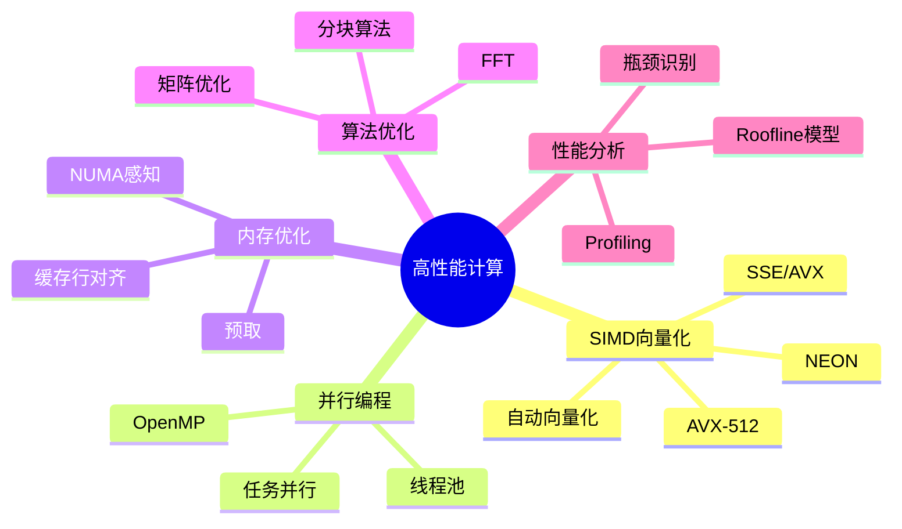

# C语言高性能计算深度解析

> **层级定位**: 01 Core Knowledge System / 08 Application Domains
> **对应标准**: C99/C11 + OpenMP + SIMD
> **难度级别**: L4 分析 → L5 综合
> **预估学习时间**: 15-25 小时

---

## 📋 本节概要

| 属性 | 内容 |
|:-----|:-----|
| **核心概念** | SIMD向量化、OpenMP并行、缓存优化、算法优化 |
| **前置知识** | 指针、数组、编译器优化 |
| **后续延伸** | GPU编程、分布式计算、数值分析 |
| **权威来源** | Intel优化手册, OpenMP规范, CSAPP |

---

## 🧠 知识结构思维导图



---

## 📖 核心概念详解

### 1. SIMD向量化

#### 1.1 SSE/AVX指令集

```c
#include <immintrin.h>  // AVX/AVX2
#include <xmmintrin.h>  // SSE

// 基本数据类型
// __m128  : 4个float或2个double（128位）
// __m256  : 8个float或4个double（256位）
// __m256i : 整数向量

// 向量加法示例
void vector_add_avx(float *a, float *b, float *c, int n) {
    int i = 0;
    
    // 使用256位AVX（8个float）
    for (; i <= n - 8; i += 8) {
        __m256 va = _mm256_loadu_ps(&a[i]);  // 加载8个float
        __m256 vb = _mm256_loadu_ps(&b[i]);
        __m256 vc = _mm256_add_ps(va, vb);   // 向量加法
        _mm256_storeu_ps(&c[i], vc);         // 存储结果
    }
    
    // 处理剩余元素
    for (; i < n; i++) {
        c[i] = a[i] + b[i];
    }
}

// 点积计算
float dot_product_avx(const float *a, const float *b, int n) {
    __m256 sum_vec = _mm256_setzero_ps();  // 初始化累加向量为0
    
    int i = 0;
    for (; i <= n - 8; i += 8) {
        __m256 va = _mm256_loadu_ps(&a[i]);
        __m256 vb = _mm256_loadu_ps(&b[i]);
        sum_vec = _mm256_fmadd_ps(va, vb, sum_vec);  // 乘加融合
    }
    
    // 水平求和
    float sum[8];
    _mm256_storeu_ps(sum, sum_vec);
    float result = sum[0] + sum[1] + sum[2] + sum[3] +
                   sum[4] + sum[5] + sum[6] + sum[7];
    
    // 处理剩余
    for (; i < n; i++) {
        result += a[i] * b[i];
    }
    
    return result;
}

// 矩阵乘法（AVX优化）
void matmul_avx(float *C, const float *A, const float *B,
                int M, int N, int K) {
    for (int i = 0; i < M; i++) {
        for (int j = 0; j < N; j += 8) {
            __m256 c_vec = _mm256_setzero_ps();
            
            for (int k = 0; k < K; k++) {
                __m256 a_val = _mm256_broadcast_ss(&A[i*K + k]);
                __m256 b_vec = _mm256_loadu_ps(&B[k*N + j]);
                c_vec = _mm256_fmadd_ps(a_val, b_vec, c_vec);
            }
            
            _mm256_storeu_ps(&C[i*N + j], c_vec);
        }
    }
}
```

#### 1.2 编译器自动向量化

```c
// 提示编译器向量化

// ❌ 阻碍向量化的代码
void bad_loop(float *a, float *b, int n) {
    for (int i = 0; i < n; i++) {
        if (a[i] > 0) {  // 条件分支阻碍向量化
            b[i] = a[i] * 2;
        } else {
            b[i] = a[i];
        }
    }
}

// ✅ 使用条件移动
void better_loop(float *a, float *b, int n) {
    for (int i = 0; i < n; i++) {
        // 使用条件选择，无分支
        b[i] = (a[i] > 0) ? (a[i] * 2) : a[i];
    }
}

// ✅ 使用restrict关键字
void vectorized_loop(float * restrict a,
                     float * restrict b, int n) {
    #pragma GCC ivdep  // 忽略向量依赖
    for (int i = 0; i < n; i++) {
        b[i] = a[i] * 2.0f;
    }
}

// 编译选项
// gcc -O3 -march=native -ftree-vectorize -fopt-info-vec
```

### 2. OpenMP并行编程

```c
#include <omp.h>

// 并行for循环
void parallel_sum(const float *a, const float *b, float *c, int n) {
    #pragma omp parallel for schedule(static)
    for (int i = 0; i < n; i++) {
        c[i] = a[i] + b[i];
    }
}

// 归约操作
float parallel_dot(const float *a, const float *b, int n) {
    float sum = 0.0f;
    
    #pragma omp parallel for reduction(+:sum) schedule(static)
    for (int i = 0; i < n; i++) {
        sum += a[i] * b[i];
    }
    
    return sum;
}

// 并行矩阵乘法
void parallel_matmul(float *C, const float *A, const float *B,
                     int M, int N, int K) {
    #pragma omp parallel for collapse(2) schedule(static)
    for (int i = 0; i < M; i++) {
        for (int j = 0; j < N; j++) {
            float sum = 0.0f;
            #pragma omp simd reduction(+:sum)
            for (int k = 0; k < K; k++) {
                sum += A[i*K + k] * B[k*N + j];
            }
            C[i*N + j] = sum;
        }
    }
}

// 任务并行
void task_parallel(void) {
    #pragma omp parallel
    {
        #pragma omp single
        {
            #pragma omp task
            process_chunk(data1);
            
            #pragma omp task
            process_chunk(data2);
            
            #pragma omp taskwait
        }
    }
}

// 线程亲和性
void set_affinity(void) {
    #pragma omp parallel
    {
        int thread_id = omp_get_thread_num();
        int cpu_id = thread_id % omp_get_num_procs();
        
        // 绑定到特定CPU（平台相关）
        // Linux: sched_setaffinity
    }
}
```

### 3. 缓存优化与分块

```c
// 矩阵转置优化

// ❌ 缓存不友好（列访问）
void transpose_naive(float *dst, const float *src, int n) {
    for (int i = 0; i < n; i++) {
        for (int j = 0; j < n; j++) {
            dst[j*n + i] = src[i*n + j];  // 列写入，缓存缺失
        }
    }
}

// ✅ 分块优化
#define BLOCK_SIZE 64

void transpose_blocked(float *dst, const float *src, int n) {
    for (int ii = 0; ii < n; ii += BLOCK_SIZE) {
        for (int jj = 0; jj < n; jj += BLOCK_SIZE) {
            // 处理BLOCK_SIZE x BLOCK_SIZE块
            for (int i = ii; i < ii + BLOCK_SIZE && i < n; i++) {
                for (int j = jj; j < jj + BLOCK_SIZE && j < n; j++) {
                    dst[j*n + i] = src[i*n + j];
                }
            }
        }
    }
}

// 矩阵乘法分块
void matmul_blocked(float *C, const float *A, const float *B,
                    int M, int N, int K) {
    for (int ii = 0; ii < M; ii += BLOCK_M) {
        for (int jj = 0; jj < N; jj += BLOCK_N) {
            for (int kk = 0; kk < K; kk += BLOCK_K) {
                // 计算块乘法
                for (int i = ii; i < min(ii + BLOCK_M, M); i++) {
                    for (int j = jj; j < min(jj + BLOCK_N, N); j++) {
                        float sum = C[i*N + j];
                        for (int k = kk; k < min(kk + BLOCK_K, K); k++) {
                            sum += A[i*K + k] * B[k*N + j];
                        }
                        C[i*N + j] = sum;
                    }
                }
            }
        }
    }
}
```

### 4. 性能分析与优化

```c
// 使用性能计数器（Linux）
#include <linux/perf_event.h>
#include <linux/hw_breakpoint.h>
#include <sys/syscall.h>
#include <unistd.h>

struct perf_event_attr pe = {
    .type = PERF_TYPE_HARDWARE,
    .size = sizeof(struct perf_event_attr),
    .config = PERF_COUNT_HW_CACHE_MISSES,
    .disabled = 1,
    .exclude_kernel = 1,
    .exclude_hv = 1
};

int fd = syscall(__NR_perf_event_open, &pe, 0, -1, -1, 0);
ioctl(fd, PERF_EVENT_IOC_RESET, 0);
ioctl(fd, PERF_EVENT_IOC_ENABLE, 0);

// 被测代码
compute_kernel();

ioctl(fd, PERF_EVENT_IOC_DISABLE, 0);
long long count;
read(fd, &count, sizeof(count));
printf("Cache misses: %lld\n", count);
close(fd);
```

---

## ⚠️ 常见陷阱

### 陷阱 HPC01: 伪共享

```c
// ❌ 多线程修改同一缓存行的不同变量
typedef struct {
    int counter;
} Counter;

Counter counters[8];  // 可能位于同一缓存行

// ✅ 填充到缓存行大小
typedef struct {
    int counter;
    char pad[60];  // 64 - sizeof(int)
} PaddedCounter;

PaddedCounter safe_counters[8];
```

### 陷阱 HPC02: 线程创建开销

```c
// ❌ 循环内创建线程
for (int i = 0; i < 1000; i++) {
    #pragma omp parallel for  // 每次都创建/销毁线程
    process(data[i]);
}

// ✅ 外层并行
#pragma omp parallel for
for (int i = 0; i < 1000; i++) {
    process(data[i]);
}
```

---

## ✅ 质量验收清单

- [x] SIMD向量化（SSE/AVX）
- [x] OpenMP并行编程
- [x] 缓存优化与分块
- [x] 性能分析
- [x] 常见陷阱

---

> **更新记录**
> - 2025-03-09: 初版创建
