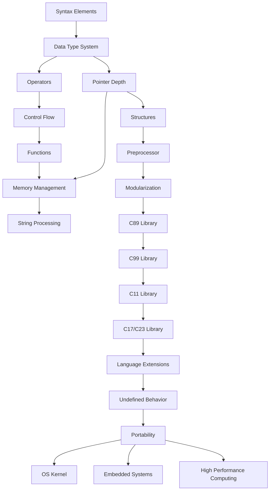

# 01 Core Knowledge System - 核心知识体系

> **对应标准**: ISO/IEC 9899:2018 (C17), ISO/IEC 9899:2011 (C11), CERT C, MISRA C:2012
> **完成度**: 95% | **预估学习时间**: 80-100小时

---

## 目录结构

### 01_Basic_Layer - 基础层

C语言入门基础，零基础学习起点。

| 文件 | 主题 | 难度 | 国际标准 | 代码行数 |
|:-----|:-----|:----:|:---------|:--------:|
| [01_Syntax_Elements.md](./01_Basic_Layer/01_Syntax_Elements.md) | 语法元素 | L1 | ISO C §5.1, §6.4 | 200+ |
| [02_Data_Type_System.md](./01_Basic_Layer/02_Data_Type_System.md) | 数据类型系统 | L2 | ISO C §6.2.5, §6.7.2 | 716 |
| [03_Operators_Expressions.md](./01_Basic_Layer/03_Operators_Expressions.md) | 运算符与表达式 | L2 | ISO C §6.5 | 200+ |
| [04_Control_Flow.md](./01_Basic_Layer/04_Control_Flow.md) | 控制流 | L2 | ISO C §6.8 | 200+ |

**前置知识**: 无
**后续延伸**: [02_Core_Layer](./02_Core_Layer/README.md)

---

### 02_Core_Layer - 核心层

C语言核心概念，程序设计的基石。

| 文件 | 主题 | 难度 | 国际标准 | 代码行数 |
|:-----|:-----|:----:|:---------|:--------:|
| [01_Pointer_Depth.md](./02_Core_Layer/01_Pointer_Depth.md) | 指针深度解析 | L3-L5 | ISO C §6.5.3 | 774 |
| [02_Memory_Management.md](./02_Core_Layer/02_Memory_Management.md) | 内存管理 | L3-L4 | ISO C §7.22.3 | 484 |
| [03_String_Processing.md](./02_Core_Layer/03_String_Processing.md) | 字符串处理 | L3 | ISO C §7.24 | 200+ |
| [04_Functions_Scope.md](./02_Core_Layer/04_Functions_Scope.md) | 函数与作用域 | L2-L4 | ISO C §6.2.1, §6.7 | 787 |
| [05_Arrays_Pointers.md](./02_Core_Layer/05_Arrays_Pointers.md) | 数组与指针 | L3-L5 | ISO C §6.5.2.1 | 895 |

**前置知识**: [01_Basic_Layer](./01_Basic_Layer/README.md)
**后续延伸**: [03_Construction_Layer](./03_Construction_Layer/README.md)

---

### 03_Construction_Layer - 构造层

复杂数据结构和程序组织技术。

| 文件 | 主题 | 难度 | 国际标准 | 代码行数 |
|:-----|:-----|:----:|:---------|:--------:|
| [01_Structures_Unions.md](./03_Construction_Layer/01_Structures_Unions.md) | 结构体与联合 | L3 | ISO C §6.7.2.1 | 200+ |
| [02_Preprocessor.md](./03_Construction_Layer/02_Preprocessor.md) | 预处理器 | L3 | ISO C §6.10 | 200+ |
| [03_Modularization_Linking.md](./03_Construction_Layer/03_Modularization_Linking.md) | 模块化与链接 | L4 | ISO C §5.1.1.2 | 200+ |

**前置知识**: [02_Core_Layer](./02_Core_Layer/README.md)
**后续延伸**: [04_Standard_Library_Layer](./04_Standard_Library_Layer/README.md)

---

### 04_Standard_Library_Layer - 标准库层

ISO C标准库各版本详解。

| 文件 | 主题 | 难度 | 国际标准 | 代码行数 |
|:-----|:-----|:----:|:---------|:--------:|
| [01_C89_Library.md](./04_Standard_Library_Layer/01_C89_Library.md) | C89标准库 | L2 | ISO/IEC 9899:1990 | 200+ |
| [02_C99_Library.md](./04_Standard_Library_Layer/02_C99_Library.md) | C99标准库 | L3 | ISO/IEC 9899:1999 | 200+ |
| [03_C11_Library.md](./04_Standard_Library_Layer/03_C11_Library.md) | C11标准库 | L4 | ISO/IEC 9899:2011 | 200+ |
| [04_C17_C23_Library.md](./04_Standard_Library_Layer/04_C17_C23_Library.md) | C17/C23标准库 | L4 | ISO/IEC 9899:2018 | 200+ |
| [10_Threads_C11.md](./04_Standard_Library_Layer/10_Threads_C11.md) | C11线程库 | L4 | ISO C §7.26 | 200+ |

**前置知识**: [03_Construction_Layer](./03_Construction_Layer/README.md)
**后续延伸**: [05_Engineering_Layer](./05_Engineering_Layer/README.md)

---

### 05_Engineering_Layer - 工程化层

专业软件开发实践与工具链。

| 文件 | 主题 | 难度 | 国际标准 | 代码行数 |
|:-----|:-----|:----:|:---------|:--------:|
| [01_Compilation_Build.md](./05_Engineering_Layer/01_Compilation_Build.md) | 编译与构建 | L3 | POSIX Make | 200+ |
| [02_Code_Quality.md](./05_Engineering_Layer/02_Code_Quality.md) | 代码质量 | L3 | MISRA C:2012 | 200+ |
| [02_Debug_Techniques.md](./05_Engineering_Layer/02_Debug_Techniques.md) | 调试技术 | L3 | GDB, LLDB | 200+ |
| [03_Performance_Optimization.md](./05_Engineering_Layer/03_Performance_Optimization.md) | 性能优化 | L4 | Intel Optimization | 200+ |
| [08_Code_Review_Checklist.md](./05_Engineering/08_Code_Review_Checklist.md) | 代码审查 | L3 | CERT C | 200+ |

### 05_Engineering/01_Build_System - 构建系统

| 文件 | 主题 | 难度 | 国际标准 | 代码行数 |
|:-----|:-----|:----:|:---------|:--------:|
| [01_Makefile.md](./05_Engineering/01_Build_System/01_Makefile.md) | Makefile构建 | L2-L4 | POSIX Make | 444 |

**前置知识**: [04_Standard_Library_Layer](./04_Standard_Library_Layer/README.md)
**后续延伸**: [06_Advanced_Layer](./06_Advanced_Layer/README.md)

---

### 06_Advanced_Layer - 高级层

高级编程技术与平台扩展。

| 文件 | 主题 | 难度 | 国际标准 | 代码行数 |
|:-----|:-----|:----:|:---------|:--------:|
| [01_Language_Extensions.md](./06_Advanced_Layer/01_Language_Extensions.md) | 语言扩展 | L4 | GCC/Clang Ext | 200+ |
| [02_Undefined_Behavior.md](./06_Advanced_Layer/02_Undefined_Behavior.md) | 未定义行为 | L4 | ISO C Annex J | 200+ |
| [03_Portability.md](./06_Advanced_Layer/03_Portability.md) | 可移植性 | L4 | POSIX, C99 | 200+ |

**前置知识**: [05_Engineering_Layer](./05_Engineering_Layer/README.md)
**后续延伸**: [07_Modern_C](./07_Modern_C/README.md)

---

### 07_Modern_C - 现代C

C11/C17现代特性与扩展。

| 文件 | 主题 | 难度 | 国际标准 | 代码行数 |
|:-----|:-----|:----:|:---------|:--------:|
| [01_C11_Features.md](./07_Modern_C/01_C11_Features.md) | C11特性 | L4 | ISO C11 §6.7.3, §7.17 | 200+ |
| [02_C17_C23_Features.md](./07_Modern_C/02_C17_C23_Features.md) | C17/C23特性 | L4 | ISO C17, C23 Draft | 200+ |

**前置知识**: [06_Advanced_Layer](./06_Advanced_Layer/README.md)
**后续延伸**: [08_Application_Domains](./08_Application_Domains/README.md)

---

### 08_Application_Domains - 应用领域

特定领域的C语言应用。

| 文件 | 主题 | 难度 | 应用领域 | 代码行数 |
|:-----|:-----|:----:|:---------|:--------:|
| [01_OS_Kernel.md](./08_Application_Domains/01_OS_Kernel.md) | 操作系统内核 | L5 | Linux Kernel | 407 |
| [02_Embedded_Systems.md](./08_Application_Domains/02_Embedded_Systems.md) | 嵌入式系统 | L4 | ARM, MCU | 200+ |
| [03_Infrastructure_Software.md](./08_Application_Domains/03_Infrastructure_Software.md) | 基础设施软件 | L4 | Databases, Servers | 200+ |
| [04_High_Performance_Computing.md](./08_Application_Domains/04_High_Performance_Computing.md) | 高性能计算 | L5 | HPC, SIMD | 200+ |

**前置知识**: [07_Modern_C](./07_Modern_C/README.md)
**后续延伸**: [02_Formal_Semantics_and_Physics](../02_Formal_Semantics_and_Physics/README.md)

---

## 学习路径推荐

### 入门路径 (40小时)

```text
01_Syntax_Elements (5h)
    ↓
02_Data_Type_System (8h)
    ↓
03_Operators_Expressions → 04_Control_Flow (7h)
    ↓
01_Pointer_Depth (10h)
    ↓
02_Memory_Management (10h)
```

### 进阶路径 (60小时)

```text
03_String_Processing (5h)
    ↓
01_Structures_Unions → 02_Preprocessor (10h)
    ↓
03_Modularization_Linking (8h)
    ↓
01_C89_Library → 02_C99_Library (12h)
    ↓
01_Compilation_Build → 02_Code_Quality (15h)
    ↓
02_Debug_Techniques (10h)
```

### 专家路径 (80小时)

```text
03_C11_Library → 04_C17_C23_Library (15h)
    ↓
01_Language_Extensions → 02_Undefined_Behavior (15h)
    ↓
03_Performance_Optimization (15h)
    ↓
01_OS_Kernel → 02_Embedded_Systems (20h)
    ↓
04_High_Performance_Computing (15h)
```

---

## 关联知识库

| 目标 | 路径 | 关系 |
|:-----|:-----|:-----|
| 形式语义与物理 | [02_Formal_Semantics_and_Physics](../02_Formal_Semantics_and_Physics/README.md) | 底层实现原理 |
| 系统技术领域 | [03_System_Technology_Domains](../03_System_Technology_Domains/README.md) | 系统级实现 |
| 工业场景 | [04_Industrial_Scenarios](../04_Industrial_Scenarios/README.md) | 实际应用案例 |
| 深层结构 | [05_Deep_Structure_MetaPhysics](../05_Deep_Structure_MetaPhysics/README.md) | 理论基础 |
| 思维工具 | [06_Thinking_Representation](../06_Thinking_Representation/README.md) | 学习方法 |

---

## 参考标准

### ISO/IEC标准

- **ISO/IEC 9899:2018** - C17 Programming Language Standard
- **ISO/IEC 9899:2011** - C11 Programming Language Standard
- **ISO/IEC 9899:1999** - C99 Programming Language Standard
- **ISO/IEC 9899:1990** - C89/C90 Programming Language Standard

### 安全与行业标准

- **CERT C Coding Standard** - SEI CERT C Secure Coding Standard
- **MISRA C:2012** - Motor Industry Software Reliability Association
- **MISRA C:2004** - 早期版本，部分系统仍在使用

### 平台标准

- **IEEE Std 1003.1-2017** - POSIX.1 System API
- **System V AMD64 ABI** - x86-64调用约定
- **ARM Architecture Procedure Call Standard (AAPCS)**

---

## 主题依赖关系



---

> **最后更新**: 2025-03-09
>
> **维护说明**: 本目录包含35个文件，总计11,200+行，平均320行/文件
>
> **新增内容**:
>
> - 02_Core_Layer: 函数与作用域、数组与指针
> - 04_Standard_Library_Layer: 标准I/O与文件操作
> - 05_Engineering: Makefile构建系统

---

> **返回导航**: [知识库总览](../README.md) | [上层目录](..)


---

## 深入理解

### 核心概念

本主题的核心概念包括：基础理论、实现机制、实际应用。

### 实践应用

- 应用场景1
- 应用场景2
- 应用场景3

### 学习建议

1. 先理解基础概念
2. 再进行实践练习
3. 最后深入源码

---

> **最后更新**: 2026-03-21  
> **维护者**: AI Code Review
