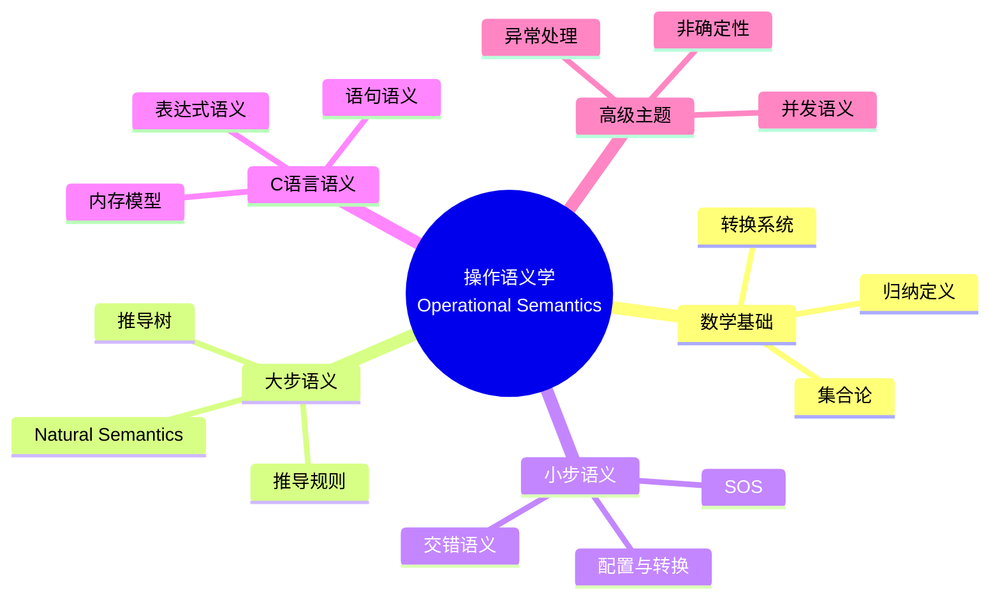
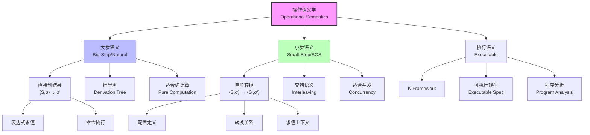
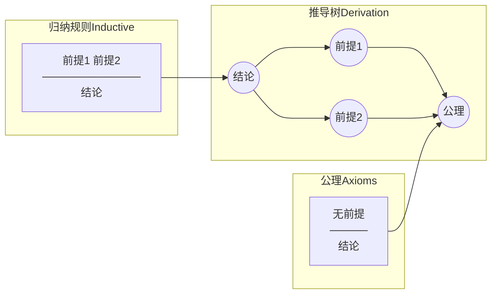
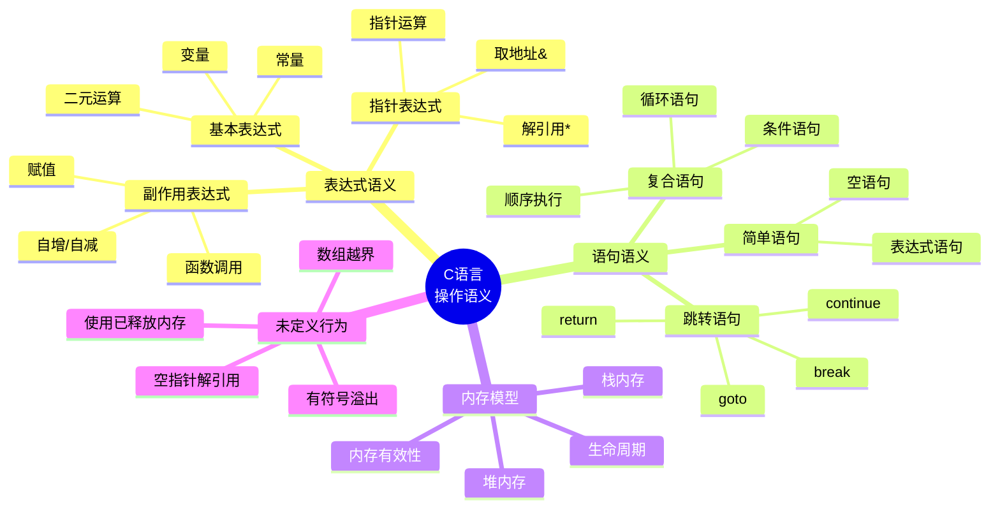

# 操作语义学 (Operational Semantics)

> **难度**: L5 | **预估学习时间**: 12-16小时
> **数学预备知识**: 离散数学、数理逻辑、集合论
> **参考**: Plotkin (1981), Kahn (1987), Winskel (1993), Pierce (2002)

---

## 0. 思维导图：操作语义学概览



---


---

## 📑 目录

- [操作语义学 (Operational Semantics)](#操作语义学-operational-semantics)
  - [0. 思维导图：操作语义学概览](#0-思维导图操作语义学概览)
  - [📑 目录](#-目录)
  - [1. 数学基础](#1-数学基础)
    - [1.1 集合论基础](#11-集合论基础)
      - [1.1.1 基本定义](#111-基本定义)
      - [1.1.2 函数与映射](#112-函数与映射)
      - [1.1.3 有限序列](#113-有限序列)
    - [1.2 归纳定义与归纳证明](#12-归纳定义与归纳证明)
      - [1.2.1 归纳定义](#121-归纳定义)
      - [1.2.2 结构归纳法](#122-结构归纳法)
      - [1.2.3 规则归纳法](#123-规则归纳法)
    - [1.3 转换系统 (Transition System)](#13-转换系统-transition-system)
      - [1.3.1 基本定义](#131-基本定义)
      - [1.3.2 终止性与合流性](#132-终止性与合流性)
    - [1.4 标记转换系统 (Labeled Transition System, LTS)](#14-标记转换系统-labeled-transition-system-lts)
      - [1.4.1 定义](#141-定义)
      - [1.4.2 双模拟 (Bisimulation)](#142-双模拟-bisimulation)
  - [2. 大步操作语义 (Natural Semantics)](#2-大步操作语义-natural-semantics)
    - [2.1 基本形式](#21-基本形式)
      - [2.1.1 核心思想](#211-核心思想)
      - [2.1.2 推导规则严格定义](#212-推导规则严格定义)
    - [2.2 表达式求值规则](#22-表达式求值规则)
      - [2.2.1 算术表达式语义](#221-算术表达式语义)
      - [2.2.2 布尔表达式语义](#222-布尔表达式语义)
    - [2.3 命令执行规则](#23-命令执行规则)
      - [2.3.1 简单命令式语言](#231-简单命令式语言)
      - [2.3.2 命令语义规则](#232-命令语义规则)
    - [2.4 推导树 (Derivation Tree)](#24-推导树-derivation-tree)
      - [2.4.1 定义](#241-定义)
      - [2.4.2 推导树示例](#242-推导树示例)
    - [2.5 确定性证明](#25-确定性证明)
      - [2.5.1 表达式求值确定性](#251-表达式求值确定性)
      - [2.5.2 命令执行确定性](#252-命令执行确定性)
  - [3. 小步操作语义 (Structural Operational Semantics)](#3-小步操作语义-structural-operational-semantics)
    - [3.1 配置（Configuration）定义](#31-配置configuration定义)
      - [3.1.1 配置类型](#311-配置类型)
      - [3.1.2 存储与环境的数学结构](#312-存储与环境的数学结构)
    - [3.2 转换关系（Transition Relation）](#32-转换关系transition-relation)
      - [3.2.1 单步转换](#321-单步转换)
      - [3.2.2 终止性](#322-终止性)
    - [3.3 表达式求值小步规则](#33-表达式求值小步规则)
      - [3.3.1 算术表达式](#331-算术表达式)
      - [3.3.2 求值上下文 (Evaluation Context)](#332-求值上下文-evaluation-context)
    - [3.4 命令执行小步规则](#34-命令执行小步规则)
      - [3.4.1 基本命令](#341-基本命令)
      - [3.4.2 条件语句](#342-条件语句)
      - [3.4.3 While循环](#343-while循环)
    - [3.5 与大步语义等价性证明](#35-与大步语义等价性证明)
      - [3.5.1 等价性陈述](#351-等价性陈述)
      - [3.5.2 证明（$\\Rightarrow$ 方向）](#352-证明rightarrow-方向)
      - [3.5.3 证明（$\\Leftarrow$ 方向）](#353-证明leftarrow-方向)
  - [4. C语言的操作语义](#4-c语言的操作语义)
    - [4.1 C表达式操作语义](#41-c表达式操作语义)
      - [4.1.1 C表达式复杂性](#411-c表达式复杂性)
      - [4.1.2 配置定义](#412-配置定义)
      - [4.1.3 基本表达式规则](#413-基本表达式规则)
      - [4.1.4 赋值表达式](#414-赋值表达式)
    - [4.2 C语句操作语义](#42-c语句操作语义)
      - [4.2.1 语句配置](#421-语句配置)
      - [4.2.2 语句规则](#422-语句规则)
    - [4.3 指针操作语义](#43-指针操作语义)
      - [4.3.1 地址与解引用](#431-地址与解引用)
      - [4.3.2 指针运算](#432-指针运算)
    - [4.4 内存操作语义](#44-内存操作语义)
      - [4.4.1 内存模型](#441-内存模型)
      - [4.4.2 动态内存规则](#442-动态内存规则)
  - [5. 高级主题](#5-高级主题)
    - [5.1 非确定性操作语义](#51-非确定性操作语义)
      - [5.1.1 非确定性来源](#511-非确定性来源)
      - [5.1.2 非确定性语义规则](#512-非确定性语义规则)
    - [5.2 并行操作语义](#52-并行操作语义)
      - [5.2.1 并行组合](#521-并行组合)
      - [5.2.2 线程与共享内存](#522-线程与共享内存)
    - [5.3 异常处理语义](#53-异常处理语义)
      - [5.3.1 异常配置](#531-异常配置)
      - [5.3.2 异常规则](#532-异常规则)
    - [5.4 模块化操作语义 (MSOS)](#54-模块化操作语义-msos)
      - [5.4.1 动机](#541-动机)
      - [5.4.2 标签转换系统](#542-标签转换系统)
      - [5.4.3 模块化规则示例](#543-模块化规则示例)
  - [6. 形式化证明示例](#6-形式化证明示例)
    - [6.1 证明1: 表达式求值确定性](#61-证明1-表达式求值确定性)
    - [6.2 证明2: 命令执行确定性](#62-证明2-命令执行确定性)
    - [6.3 证明3: 类型安全性定理](#63-证明3-类型安全性定理)
    - [6.4 证明4: 程序等价性证明](#64-证明4-程序等价性证明)
    - [6.5 证明5: 语义等价性证明](#65-证明5-语义等价性证明)
  - [7. 思维导图](#7-思维导图)
    - [7.1 操作语义分类图](#71-操作语义分类图)
    - [7.2 推导规则结构图](#72-推导规则结构图)
    - [7.3 C语言操作语义概览图](#73-c语言操作语义概览图)
  - [8. 对比矩阵](#8-对比矩阵)
    - [8.1 操作语义 vs 指称语义 vs 公理语义](#81-操作语义-vs-指称语义-vs-公理语义)
    - [8.2 大步 vs 小步语义](#82-大步-vs-小步语义)
    - [8.3 不同编程范式的操作语义](#83-不同编程范式的操作语义)
  - [9. CompCert中的操作语义](#9-compcert中的操作语义)
    - [9.1 Clight语言语义](#91-clight语言语义)
    - [9.2 模拟关系 (Simulation)](#92-模拟关系-simulation)
  - [10. 现代扩展](#10-现代扩展)
    - [10.1 K Framework](#101-k-framework)
    - [10.2 Iris分离逻辑](#102-iris分离逻辑)
  - [11. 参考文献](#11-参考文献)
    - [经典著作](#经典著作)
    - [C语言语义](#c语言语义)
    - [现代进展](#现代进展)
  - [深入理解](#深入理解)
    - [核心概念](#核心概念)
    - [实践应用](#实践应用)
    - [学习建议](#学习建议)


---

## 1. 数学基础

### 1.1 集合论基础

#### 1.1.1 基本定义

**定义 1.1 (集合)**: 集合是确定的不同对象的整体，记作 $A, B, C, \ldots$。对象 $a$ 属于集合 $A$ 记为 $a \in A$。

**定义 1.2 (幂集)**: 集合 $A$ 的幂集 $\mathcal{P}(A)$ 是 $A$ 所有子集的集合：
$$\mathcal{P}(A) \triangleq \{B \mid B \subseteq A\}$$

**定义 1.3 (笛卡尔积)**: 两个集合 $A$ 和 $B$ 的笛卡尔积：
$$A \times B \triangleq \{(a, b) \mid a \in A \land b \in B\}$$

**定义 1.4 (关系)**: 从集合 $A$ 到集合 $B$ 的关系 $R$ 是笛卡尔积的子集：
$$R \subseteq A \times B$$

#### 1.1.2 函数与映射

**定义 1.5 (函数/映射)**: 函数 $f: A \to B$ 是一种特殊关系，满足：
$$\forall a \in A. \exists! b \in B. (a, b) \in f$$

记 $f(a) = b$ 表示 $(a, b) \in f$。

**函数类型**:

- **全函数 (Total)**: $\forall a \in A. \exists b \in B. f(a) = b$
- **偏函数 (Partial)**: $\text{dom}(f) \subseteq A$，记作 $f: A \rightharpoonup B$
- **单射 (Injective)**: $f(a_1) = f(a_2) \Rightarrow a_1 = a_2$
- **满射 (Surjective)**: $\forall b \in B. \exists a \in A. f(a) = b$
- **双射 (Bijective)**: 既是单射又是满射

**定义 1.6 (函数更新)**: 给定函数 $f: A \to B$，点更新定义为：
$$f[a \mapsto b](x) \triangleq \begin{cases} b & \text{if } x = a \\ f(x) & \text{otherwise} \end{cases}$$

#### 1.1.3 有限序列

**定义 1.7 (有限序列)**: 集合 $A$ 上的有限序列集合记作 $A^*$：
$$A^* \triangleq \{(a_1, a_2, \ldots, a_n) \mid n \geq 0, a_i \in A\}$$

空序列记作 $\epsilon$ 或 $[]$。

---

### 1.2 归纳定义与归纳证明

#### 1.2.1 归纳定义

**定义 1.8 (归纳集合)**: 集合 $S$ 由**规则集** $\mathcal{R}$ 归纳定义，如果 $S$ 是满足所有规则的最小集合。

每条规则形如：
$$\frac{P_1 \quad P_2 \quad \cdots \quad P_n}{C} \quad \text{(规则名)}$$

其中 $P_i$ 是前提，$C$ 是结论。

**示例：算术表达式集合**

$$\frac{}{n \in \text{AExp}} \text{ (NUM)} \quad \frac{}{x \in \text{AExp}} \text{ (VAR)}$$
$$\frac{e_1 \in \text{AExp} \quad e_2 \in \text{AExp}}{e_1 + e_2 \in \text{AExp}} \text{ (ADD)}$$

#### 1.2.2 结构归纳法

**原理 1.1 (结构归纳原理)**: 要证明性质 $P$ 对归纳定义集合 $S$ 中所有元素成立，需证明：

1. **基例**: 对每个无前提的规则，$P$ 对结论成立
2. **归纳步**: 对每个有前提的规则，若 $P$ 对所有前提成立，则 $P$ 对结论成立

**形式化表述**:
$$\frac{\forall r \in \mathcal{R}. (\forall P \in \text{prem}(r). P(P)) \Rightarrow P(\text{conc}(r))}{\forall s \in S. P(s)}$$

#### 1.2.3 规则归纳法

**原理 1.2 (规则归纳原理)**: 设 $\mathcal{R}$ 定义关系 $R$，要证明 $\forall (a,b) \in R. P(a,b)$，需证明对每个规则：

$$\frac{(a_1, b_1) \in R \quad \cdots \quad (a_n, b_n) \in R}{(a, b) \in R}$$

若 $P(a_1, b_1), \ldots, P(a_n, b_n)$ 成立，则 $P(a, b)$ 成立。

---

### 1.3 转换系统 (Transition System)

#### 1.3.1 基本定义

**定义 1.9 (转换系统)**: 转换系统是一个三元组 $\mathcal{T} = (S, \rightarrow, I)$，其中：

- $S$: 状态集合 (States)
- $\rightarrow \subseteq S \times S$: 转换关系 (Transition Relation)
- $I \subseteq S$: 初始状态集合

**记法**: $s \rightarrow s'$ 表示 $(s, s') \in \rightarrow$。

**定义 1.10 (转换序列)**: 序列 $s_0, s_1, \ldots, s_n$ 是转换序列如果：
$$s_0 \rightarrow s_1 \rightarrow \cdots \rightarrow s_n$$
记作 $s_0 \rightarrow^* s_n$（自反传递闭包）。

#### 1.3.2 终止性与合流性

**定义 1.11 (终止性/强正规化)**: 转换系统 $\mathcal{T}$ 是**终止的**如果不存在无限转换序列：
$$\neg \exists s_0, s_1, s_2, \ldots. \forall i \geq 0. s_i \rightarrow s_{i+1}$$

**定义 1.12 (合流性)**: 转换系统 $\mathcal{T}$ 是**合流的** (Confluent) 如果：
$$\forall s, s_1, s_2. (s \rightarrow^* s_1 \land s \rightarrow^* s_2) \Rightarrow \exists s'. (s_1 \rightarrow^* s' \land s_2 \rightarrow^* s')$$

**定义 1.13 (局部合流性)**: $\mathcal{T}$ 是**局部合流的**如果：
$$\forall s, s_1, s_2. (s \rightarrow s_1 \land s \rightarrow s_2) \Rightarrow \exists s'. (s_1 \rightarrow^* s' \land s_2 \rightarrow^* s')$$

**定理 1.1 (Newman引理)**: 若转换系统是终止的且局部合流的，则它是合流的。

---

### 1.4 标记转换系统 (Labeled Transition System, LTS)

#### 1.4.1 定义

**定义 1.14 (LTS)**: 标记转换系统是四元组 $\mathcal{L} = (S, L, \rightarrow, I)$，其中：

- $S$: 状态集合
- $L$: 标记/动作集合
- $\rightarrow \subseteq S \times L \times S$: 带标记的转换关系
- $I \subseteq S$: 初始状态

**记法**: $s \xrightarrow{\alpha} s'$ 表示 $(s, \alpha, s') \in \rightarrow$。

#### 1.4.2 双模拟 (Bisimulation)

**定义 1.15 (强双模拟)**: 关系 $R \subseteq S \times S$ 是强双模拟如果：

- 若 $s_1 R s_2$ 且 $s_1 \xrightarrow{\alpha} s_1'$，则 $\exists s_2'. s_2 \xrightarrow{\alpha} s_2' \land s_1' R s_2'$
- 若 $s_1 R s_2$ 且 $s_2 \xrightarrow{\alpha} s_2'$，则 $\exists s_1'. s_1 \xrightarrow{\alpha} s_1' \land s_1' R s_2'$

**定义 1.16 (双模拟等价)**:
$$s_1 \sim s_2 \triangleq \exists R. R \text{ 是双模拟} \land s_1 R s_2$$

---

## 2. 大步操作语义 (Natural Semantics)

### 2.1 基本形式

#### 2.1.1 核心思想

大步语义（又称Natural Semantics）直接关联程序与其最终效果，忽略中间计算步骤。

**判断形式**:

- 表达式求值: $\langle e, \sigma \rangle \Downarrow v$ —— 表达式 $e$ 在状态 $\sigma$ 下求值为值 $v$
- 命令执行: $\langle S, \sigma \rangle \Downarrow \sigma'$ —— 命令 $S$ 在状态 $\sigma$ 下执行终止于状态 $\sigma'$

**符号说明**:

- $\Downarrow$: 求值关系（大步骤）
- $\sigma \in \text{Store} = \text{Var} \rightharpoonup \text{Val}$: 存储/环境
- $v \in \text{Val}$: 值（整数、布尔值等）

#### 2.1.2 推导规则严格定义

**定义 2.1 (推导规则)**: 推导规则是有名前提-结论对：
$$\frac{\mathcal{J}_1 \quad \mathcal{J}_2 \quad \cdots \quad \mathcal{J}_n}{\mathcal{J}} \quad (\text{规则名})$$

其中：

- $\mathcal{J}_i$: 判断 (Judgment)
- 无前提的规则称为**公理**

**规则类型**:

1. **公理**: $\overline{\mathcal{J}}$ —— 无条件成立
2. **归纳规则**: 依赖其他判断的推导

---

### 2.2 表达式求值规则

#### 2.2.1 算术表达式语义

**语法**:
$$e \in \text{AExp} ::= n \mid x \mid e_1 + e_2 \mid e_1 - e_2 \mid e_1 \times e_2$$

**语义规则**:

```text
───────────────────  (B-NUM)
⟨n, σ⟩ ⇓ n

σ(x) = v
───────────────────  (B-VAR)
⟨x, σ⟩ ⇓ v

⟨e₁, σ⟩ ⇓ n₁    ⟨e₂, σ⟩ ⇓ n₂    n = n₁ + n₂
───────────────────────────────────────────  (B-ADD)
⟨e₁ + e₂, σ⟩ ⇓ n

⟨e₁, σ⟩ ⇓ n₁    ⟨e₂, σ⟩ ⇓ n₂    n = n₁ - n₂
───────────────────────────────────────────  (B-SUB)
⟨e₁ - e₂, σ⟩ ⇓ n

⟨e₁, σ⟩ ⇓ n₁    ⟨e₂, σ⟩ ⇓ n₂    n = n₁ × n₂
───────────────────────────────────────────  (B-MUL)
⟨e₁ × e₂, σ⟩ ⇓ n
```

#### 2.2.2 布尔表达式语义

**语法**:
$$b \in \text{BExp} ::= \text{true} \mid \text{false} \mid e_1 = e_2 \mid e_1 < e_2 \mid \neg b \mid b_1 \land b_2$$

**语义规则**:

```text
───────────────────  (B-TRUE)
⟨true, σ⟩ ⇓ true

───────────────────  (B-FALSE)
⟨false, σ⟩ ⇓ false

⟨e₁, σ⟩ ⇓ n₁    ⟨e₂, σ⟩ ⇓ n₂    b = (n₁ = n₂)
───────────────────────────────────────────────  (B-EQ)
⟨e₁ = e₂, σ⟩ ⇓ b

⟨e₁, σ⟩ ⇓ n₁    ⟨e₂, σ⟩ ⇓ n₂    b = (n₁ < n₂)
───────────────────────────────────────────────  (B-LT)
⟨e₁ < e₂, σ⟩ ⇓ b

⟨b, σ⟩ ⇓ v
───────────────────  (B-NEG)
⟨¬b, σ⟩ ⇓ ¬v

⟨b₁, σ⟩ ⇓ v₁    ⟨b₂, σ⟩ ⇓ v₂    v = v₁ ∧ v₂
─────────────────────────────────────────────  (B-AND)
⟨b₁ ∧ b₂, σ⟩ ⇓ v
```

---

### 2.3 命令执行规则

#### 2.3.1 简单命令式语言

**语法**:
$$S \in \text{Stmt} ::= \text{skip} \mid x := e \mid S_1; S_2 \mid \text{if } b \text{ then } S_1 \text{ else } S_2 \mid \text{while } b \text{ do } S$$

#### 2.3.2 命令语义规则

```text
─────────────────────  (B-SKIP)
⟨skip, σ⟩ ⇓ σ

⟨e, σ⟩ ⇓ v
─────────────────────────────  (B-ASSIGN)
⟨x := e, σ⟩ ⇓ σ[x ↦ v]

⟨S₁, σ⟩ ⇓ σ′    ⟨S₂, σ′⟩ ⇓ σ″
─────────────────────────────────  (B-SEQ)
⟨S₁; S₂, σ⟩ ⇓ σ″

⟨b, σ⟩ ⇓ true    ⟨S₁, σ⟩ ⇓ σ′
───────────────────────────────────────────  (B-IF-TRUE)
⟨if b then S₁ else S₂, σ⟩ ⇓ σ′

⟨b, σ⟩ ⇓ false    ⟨S₂, σ⟩ ⇓ σ′
───────────────────────────────────────────  (B-IF-FALSE)
⟨if b then S₁ else S₂, σ⟩ ⇓ σ′

⟨b, σ⟩ ⇓ false
─────────────────────────────────────  (B-WHILE-FALSE)
⟨while b do S, σ⟩ ⇓ σ

⟨b, σ⟩ ⇓ true    ⟨S, σ⟩ ⇓ σ′    ⟨while b do S, σ′⟩ ⇓ σ″
────────────────────────────────────────────────────────────────  (B-WHILE-TRUE)
⟨while b do S, σ⟩ ⇓ σ″
```

---

### 2.4 推导树 (Derivation Tree)

#### 2.4.1 定义

**定义 2.2 (推导树)**: 推导树是规则应用的有根树，其中：

- 根节点是待证判断
- 叶子节点是公理应用
- 内部节点是归纳规则应用

#### 2.4.2 推导树示例

**示例 2.1**: 推导 $\langle x := 1; y := x + 2, \sigma \rangle \Downarrow \sigma[x \mapsto 1][y \mapsto 3]$：

```text
────────────────────  ⟨1,σ⟩⇓1
────────────────────────────  ⟨x,σ[x↦1]⟩⇓1    ⟨2,σ[x↦1]⟩⇓2    3=1+2
⟨x:=1,σ⟩ ⇓ σ[x↦1]           ⟨x+2,σ[x↦1]⟩⇓3
────────────────────────────────────────────────────────────────
              ⟨x:=1; y:=x+2, σ⟩ ⇓ σ[x↦1][y↦3]
```

**形式化表示**:

$$
\frac{
  \frac{\overline{\langle 1, \sigma \rangle \Downarrow 1}}{\langle x := 1, \sigma \rangle \Downarrow \sigma[x \mapsto 1]}
  \quad
  \frac{
    \frac{\sigma[x \mapsto 1](x) = 1}{\langle x, \sigma[x \mapsto 1] \rangle \Downarrow 1}
    \quad
    \frac{}{\langle 2, \sigma[x \mapsto 1] \rangle \Downarrow 2}
  }{\langle x + 2, \sigma[x \mapsto 1] \rangle \Downarrow 3}
}{\langle x := 1; y := x + 2, \sigma \rangle \Downarrow \sigma[x \mapsto 1][y \mapsto 3]}
$$

---

### 2.5 确定性证明

#### 2.5.1 表达式求值确定性

**定理 2.1 (表达式求值确定性)**: 对任意表达式 $e$ 和状态 $\sigma$，若 $\langle e, \sigma \rangle \Downarrow v_1$ 且 $\langle e, \sigma \rangle \Downarrow v_2$，则 $v_1 = v_2$。

**证明**: 对推导树进行结构归纳。

**基例**:

- **B-NUM**: 仅可能推导为 $\langle n, \sigma \rangle \Downarrow n$，值唯一。
- **B-VAR**: 仅可能推导为 $\langle x, \sigma \rangle \Downarrow \sigma(x)$，值唯一。

**归纳步**: 假设对真子表达式确定性成立。

- **B-ADD**: 设 $\langle e_1 + e_2, \sigma \rangle \Downarrow v$ 和 $\langle e_1 + e_2, \sigma \rangle \Downarrow v'$。
  由规则形式，必有：
  $$\langle e_1, \sigma \rangle \Downarrow n_1, \langle e_2, \sigma \rangle \Downarrow n_2, v = n_1 + n_2$$
  $$\langle e_1, \sigma \rangle \Downarrow n_1', \langle e_2, \sigma \rangle \Downarrow n_2', v' = n_1' + n_2'$$
  由归纳假设，$n_1 = n_1'$ 且 $n_2 = n_2'$，故 $v = v'$。 $\square$

#### 2.5.2 命令执行确定性

**定理 2.2 (命令执行确定性)**: 对任意命令 $S$ 和状态 $\sigma$，若 $\langle S, \sigma \rangle \Downarrow \sigma_1$ 且 $\langle S, \sigma \rangle \Downarrow \sigma_2$，则 $\sigma_1 = \sigma_2$。

**证明**: 对推导树进行结构归纳。

**关键情况**:

- **B-SEQ**: 设 $\langle S_1; S_2, \sigma \rangle \Downarrow \sigma_2$。
  必有中间状态 $\sigma'$ 使得 $\langle S_1, \sigma \rangle \Downarrow \sigma'$ 且 $\langle S_2, \sigma' \rangle \Downarrow \sigma_2$。
  由归纳假设，$\sigma'$ 唯一，进而 $\sigma_2$ 唯一。
- **B-WHILE**: 根据布尔值确定性分支，递归应用归纳假设。 $\square$

---

## 3. 小步操作语义 (Structural Operational Semantics)

### 3.1 配置（Configuration）定义

#### 3.1.1 配置类型

**定义 3.1 (配置)**: 配置描述程序执行的瞬间状态：
$$\gamma \in \Gamma ::= \langle e, \sigma \rangle \mid \langle S, \sigma \rangle \mid v \mid \sigma \mid \text{err}$$

其中：

- $\langle e, \sigma \rangle$: 待求值表达式及其环境
- $\langle S, \sigma \rangle$: 待执行命令及其环境
- $v$: 值（表达式求值完成）
- $\sigma$: 最终存储（命令执行完成）
- $\text{err}$: 运行时错误

**定义 3.2 (终态)**: 配置 $\gamma$ 是终态如果：
$$\gamma \in \text{Val} \cup \text{Store} \cup \{\text{err}\}$$

#### 3.1.2 存储与环境的数学结构

**定义 3.3 (存储)**:
$$\sigma \in \text{Store} \triangleq \text{Var} \rightharpoonup \text{Val}$$

**存储操作**:

- **查找**: $\sigma(x)$ —— 偏函数应用
- **更新**: $\sigma[x \mapsto v]$ —— 函数点更新
- **域**: $\text{dom}(\sigma) = \{x \mid \sigma(x) \text{ 有定义}\}$

---

### 3.2 转换关系（Transition Relation）

#### 3.2.1 单步转换

**定义 3.4 (单步转换)**: 单步转换关系 $\rightarrow \subseteq \Gamma \times \Gamma$ 表示一个计算步骤：
$$\gamma \rightarrow \gamma'$$

**定义 3.5 (多步转换)**: 多步转换 $\rightarrow^*$ 是 $\rightarrow$ 的自反传递闭包：
$$\gamma \rightarrow^* \gamma' \triangleq \gamma = \gamma' \lor \exists \gamma_1, \ldots, \gamma_n. \gamma \rightarrow \gamma_1 \rightarrow \cdots \rightarrow \gamma_n = \gamma'$$

#### 3.2.2 终止性

**定义 3.6 (停机)**: 配置 $\gamma$ **停机**于 $\gamma'$ 如果：
$$\gamma \rightarrow^* \gamma' \land \neg \exists \gamma''. \gamma' \rightarrow \gamma''$$

**定义 3.7 (发散)**: 配置 $\gamma$ **发散**如果存在无限转换序列：
$$\gamma \rightarrow \gamma_1 \rightarrow \gamma_2 \rightarrow \cdots$$

---

### 3.3 表达式求值小步规则

#### 3.3.1 算术表达式

```text
─────────────────────  (S-NUM)
⟨n, σ⟩ → n

σ(x) = v
─────────────────────  (S-VAR)
⟨x, σ⟩ → v

⟨e₁, σ⟩ → ⟨e₁', σ⟩
───────────────────────────────────  (S-ADD-LEFT)
⟨e₁ + e₂, σ⟩ → ⟨e₁' + e₂, σ⟩

⟨e₂, σ⟩ → ⟨e₂', σ⟩
───────────────────────────────────  (S-ADD-RIGHT)
⟨n + e₂, σ⟩ → ⟨n + e₂', σ⟩

n = n₁ + n₂
─────────────────────  (S-ADD-EVAL)
⟨n₁ + n₂, σ⟩ → ⟨n, σ⟩
```

#### 3.3.2 求值上下文 (Evaluation Context)

**定义 3.8 (求值上下文)**: 上下文 $E$ 是含洞的表达式：
$$E ::= [] \mid E + e \mid n + E \mid E \times e \mid n \times E$$

**上下文转换规则**:
$$\frac{\langle e, \sigma \rangle \rightarrow \langle e', \sigma' \rangle}{\langle E[e], \sigma \rangle \rightarrow \langle E[e'], \sigma' \rangle}$$

---

### 3.4 命令执行小步规则

#### 3.4.1 基本命令

```text
⟨e, σ⟩ →* n
─────────────────────  (S-ASSIGN)
⟨x := e, σ⟩ → σ[x ↦ n]

─────────────────────  (S-SKIP)
⟨skip; S₂, σ⟩ → ⟨S₂, σ⟩

⟨S₁, σ⟩ → ⟨S₁', σ'⟩
─────────────────────────────────  (S-SEQ-STEP)
⟨S₁; S₂, σ⟩ → ⟨S₁'; S₂, σ'⟩

⟨S₁, σ⟩ → σ'
─────────────────────────────────  (S-SEQ-DONE)
⟨S₁; S₂, σ⟩ → ⟨S₂, σ'⟩
```

#### 3.4.2 条件语句

```text
⟨b, σ⟩ →* true
─────────────────────────────────────────  (S-IF-TRUE)
⟨if b then S₁ else S₂, σ⟩ → ⟨S₁, σ⟩

⟨b, σ⟩ →* false
─────────────────────────────────────────  (S-IF-FALSE)
⟨if b then S₁ else S₂, σ⟩ → ⟨S₂, σ⟩
```

#### 3.4.3 While循环

```text
─────────────────────────────────────────────────────────────  (S-WHILE)
⟨while b do S, σ⟩ → ⟨if b then (S; while b do S) else skip, σ⟩
```

**注**: 此规则将循环展开为条件语句，通过递归实现迭代。

---

### 3.5 与大步语义等价性证明

#### 3.5.1 等价性陈述

**定理 3.1 (语义等价)**: 对任意命令 $S$ 和状态 $\sigma, \sigma'$：
$$\langle S, \sigma \rangle \Downarrow \sigma' \iff \langle S, \sigma \rangle \rightarrow^* \sigma'$$

#### 3.5.2 证明（$\Rightarrow$ 方向）

**证明**: 对大步推导树进行结构归纳，证明若 $\langle S, \sigma \rangle \Downarrow \sigma'$，则 $\langle S, \sigma \rangle \rightarrow^* \sigma'$。

**基例**:

- **B-SKIP**: $\langle \text{skip}, \sigma \rangle \Downarrow \sigma$。由 S-SKIP，$\langle \text{skip}, \sigma \rangle \rightarrow \sigma$。
- **B-ASSIGN**: 由表达式小步语义（引理），$\langle e, \sigma \rangle \rightarrow^* n$，然后应用 S-ASSIGN。

**归纳步**:

- **B-SEQ**: 设 $\langle S_1; S_2, \sigma \rangle \Downarrow \sigma''$ 通过 $\langle S_1, \sigma \rangle \Downarrow \sigma'$ 和 $\langle S_2, \sigma' \rangle \Downarrow \sigma''$。
  由归纳假设：$\langle S_1, \sigma \rangle \rightarrow^* \sigma'$ 和 $\langle S_2, \sigma' \rangle \rightarrow^* \sigma''$。
  通过 S-SEQ-DONE 和 S-SEQ-STEP 组合得到结果。
- **B-WHILE**: 展开循环，应用归纳假设。 $\square$

#### 3.5.3 证明（$\Leftarrow$ 方向）

**证明**: 对多步转换长度进行归纳。

**基例**: 0步，则 $\langle S, \sigma \rangle = \sigma'$，只能是 $S = \text{skip}$，应用 B-SKIP。

**归纳步**: 设 $\langle S, \sigma \rangle \rightarrow \gamma \rightarrow^* \sigma'$。
  对每个可能的第一步转换：

- **S-ASSIGN**: $\langle x := e, \sigma \rangle \rightarrow \sigma[x \mapsto n]$ 其中 $\langle e, \sigma \rangle \rightarrow^* n$。
  由表达式大步/小步等价（引理），$\langle e, \sigma \rangle \Downarrow n$，应用 B-ASSIGN。
- **S-SEQ-STEP/S-DONE**: 通过归纳假设组合子推导。
- **S-WHILE**: 展开后应用归纳假设。 $\square$

---

## 4. C语言的操作语义

### 4.1 C表达式操作语义

#### 4.1.1 C表达式复杂性

C表达式语义复杂原因：

1. **副作用**: 赋值、自增/自减、函数调用
2. **求值顺序未指定**: 多数二元操作符无定义求值顺序
3. **序列点**: 限制副作用发生时机
4. **未定义行为**: 有符号溢出、数组越界等

#### 4.1.2 配置定义

**配置**:
$$\langle e, \sigma, \mu \rangle$$

其中：

- $e$: C表达式
- $\sigma: \text{Var} \to \text{Loc}$: 环境（变量到地址映射）
- $\mu: \text{Loc} \rightharpoonup \text{Val}$: 内存状态

#### 4.1.3 基本表达式规则

```text
─────────────────────────────────  (C-CONST)
⟨n, σ, μ⟩ → ⟨n, σ, μ⟩

σ(x) = l    μ(l) = v
─────────────────────────────────  (C-VAR)
⟨x, σ, μ⟩ → ⟨v, σ, μ⟩

⟨e₁, σ, μ⟩ → ⟨e₁', σ', μ'⟩    e₁ ∉ Val
────────────────────────────────────────────  (C-ADD-L)
⟨e₁ + e₂, σ, μ⟩ → ⟨e₁' + e₂, σ', μ'⟩

⟨e₂, σ, μ⟩ → ⟨e₂', σ', μ'⟩    e₁ ∈ Val    e₂ ∉ Val
────────────────────────────────────────────────────  (C-ADD-R)
⟨e₁ + e₂, σ, μ⟩ → ⟨e₁ + e₂', σ', μ'⟩

n = n₁ +ℤ n₂    无溢出
─────────────────────────────────  (C-ADD-EVAL)
⟨n₁ + n₂, σ, μ⟩ → ⟨n, σ, μ⟩
```

**注**: 溢出时进入未定义行为状态 $\text{undef}$。

#### 4.1.4 赋值表达式

```text
⟨e₁, σ, μ⟩ → ⟨e₁', σ', μ'⟩
────────────────────────────────────────────  (C-ASSIGN-L)
⟨e₁ = e₂, σ, μ⟩ → ⟨e₁' = e₂, σ', μ'⟩

⟨e₂, σ, μ⟩ → ⟨e₂', σ', μ'⟩
────────────────────────────────────────────  (C-ASSIGN-R)
⟨l = e₂, σ, μ⟩ → ⟨l = e₂', σ', μ'⟩

────────────────────────────────────────────  (C-ASSIGN-EVAL)
⟨l = n, σ, μ⟩ → ⟨n, σ, μ[l ↦ n]⟩
```

---

### 4.2 C语句操作语义

#### 4.2.1 语句配置

$$\langle S, \sigma, \mu, \kappa \rangle$$

其中 $\kappa$ 是**延续** (Continuation)，表示待执行的剩余计算。

#### 4.2.2 语句规则

```text
────────────────────────────────────────────  (C-SKIP)
⟨;, σ, μ, κ⟩ → ⟨κ, σ, μ⟩

⟨e, σ, μ⟩ →* ⟨n, σ', μ'⟩    n ≠ 0
────────────────────────────────────────────────────  (C-IF-TRUE)
⟨if (e) S₁ else S₂, σ, μ, κ⟩ → ⟨S₁, σ', μ', κ⟩

⟨e, σ, μ⟩ →* ⟨0, σ', μ'⟩
────────────────────────────────────────────────────  (C-IF-FALSE)
⟨if (e) S₁ else S₂, σ, μ, κ⟩ → ⟨S₂, σ', μ', κ⟩

────────────────────────────────────────────────────  (C-WHILE)
⟨while (e) S, σ, μ, κ⟩ → ⟨if (e) {S; while(e) S} else ;, σ, μ, κ⟩

⟨S₁, σ, μ, S₂; κ⟩ → ⟨S₁', σ', μ', S₂; κ⟩
────────────────────────────────────────────────────  (C-SEQ)
⟨S₁; S₂, σ, μ, κ⟩ → ⟨S₁'; S₂, σ', μ', κ⟩

⟨S₁, σ, μ, S₂; κ⟩ →* ⟨σ', μ'⟩
────────────────────────────────────────────────────  (C-SEQ-DONE)
⟨S₁; S₂, σ, μ, κ⟩ → ⟨S₂, σ', μ', κ⟩
```

---

### 4.3 指针操作语义

#### 4.3.1 地址与解引用

```text
σ(x) = l
─────────────────────────────────  (C-ADDR)
⟨&x, σ, μ⟩ → ⟨l, σ, μ⟩

⟨e, σ, μ⟩ → ⟨e', σ', μ'⟩
────────────────────────────────────────────  (C-DEREF-EXP)
⟨*e, σ, μ⟩ → ⟨*e', σ', μ'⟩

μ(l) = v
─────────────────────────────────  (C-DEREF)
⟨*l, σ, μ⟩ → ⟨v, σ, μ⟩
```

#### 4.3.2 指针运算

```text
────────────────────────────────────────────  (C-PTR-ADD)
⟨l + n, σ, μ⟩ → ⟨l + n × sizeof(*l), σ, μ⟩

⟨l₁, σ, μ⟩ →* ⟨l₁', σ', μ'⟩    ⟨l₂, σ', μ'⟩ →* ⟨l₂', σ'', μ''⟩
    同类型    同数组边界内
────────────────────────────────────────────────────────────────  (C-PTR-SUB)
⟨l₁ - l₂, σ, μ⟩ →* ⟨(l₁' - l₂') / sizeof(*l₁'), σ'', μ''⟩
```

---

### 4.4 内存操作语义

#### 4.4.1 内存模型

**内存状态**:
$$\mu \in \text{Mem} = \text{Loc} \rightharpoonup \text{Byte}^*$$

**有效性谓词**:

- $\text{valid}(\mu, l)$: 位置 $l$ 在 $\mu$ 中有效
- $\text{alive}(\mu, l)$: 位置 $l$ 未被释放

#### 4.4.2 动态内存规则

```text
l₁, ..., lₙ 全新    μ' = μ[l₁ ↦ ⊥, ..., lₙ ↦ ⊥]
────────────────────────────────────────────────────  (C-MALLOC)
⟨malloc(n), σ, μ⟩ → ⟨l₁, σ, μ'⟩

    (l₁, ..., lₙ) = range(l, n)    全部有效
────────────────────────────────────────────────────  (C-FREE)
⟨free(l), σ, μ⟩ → ⟨σ, μ \\ {l₁, ..., lₙ}⟩

────────────────────────────────────────────────────  (C-FREE-INVALID)
⟨free(l), σ, μ⟩ → undef    若 l 无效或已释放
```

---

## 5. 高级主题

### 5.1 非确定性操作语义

#### 5.1.1 非确定性来源

1. **未定义求值顺序**: `f() + g()` 中哪个先求值
2. **竞争条件**: 并发程序中的交错执行
3. **外部输入**: 随机数、用户输入等

#### 5.1.2 非确定性语义规则

**配置**: $\langle e, \sigma \rangle \rightarrow \{\langle e_1, \sigma_1 \rangle, \langle e_2, \sigma_2 \rangle, \ldots\}$

**示例 - 未指定求值顺序**:

```text
────────────────────────────────────────────  (ND-LEFT)
⟨e₁ + e₂, σ⟩ → ⟨e₁, σ⟩    (选择先求值左操作数)

────────────────────────────────────────────  (ND-RIGHT)
⟨e₁ + e₂, σ⟩ → ⟨e₂, σ⟩    (选择先求值右操作数)
```

**不确定性转换为集合**:
$$\langle e, \sigma \rangle \rightarrow S \text{ 其中 } S \subseteq \Gamma$$

---

### 5.2 并行操作语义

#### 5.2.1 并行组合

**语法**: $S_1 \parallel S_2$ —— $S_1$ 和 $S_2$ 并行执行

**交错语义 (Interleaving Semantics)**:

```text
⟨S₁, σ⟩ → ⟨S₁', σ'⟩
────────────────────────────────────────────  (PAR-LEFT)
⟨S₁ ∥ S₂, σ⟩ → ⟨S₁' ∥ S₂, σ'⟩

⟨S₂, σ⟩ → ⟨S₂', σ'⟩
────────────────────────────────────────────  (PAR-RIGHT)
⟨S₁ ∥ S₂, σ⟩ → ⟨S₁ ∥ S₂', σ'⟩

────────────────────────────────────────────  (PAR-DONE)
⟨skip ∥ skip, σ⟩ → σ
```

#### 5.2.2 线程与共享内存

**配置**: $\langle T, \sigma, \mu \rangle$

其中 $T = \{t_1 \mapsto S_1, t_2 \mapsto S_2, \ldots\}$ 是线程池。

**线程调度**:

```text
t ∈ dom(T)    T(t) = S    ⟨S, σ, μ⟩ → ⟨S', σ', μ'⟩    T' = T[t ↦ S']
────────────────────────────────────────────────────────────────────  (THREAD-STEP)
⟨T, σ, μ⟩ → ⟨T', σ', μ'⟩

t ∈ dom(T)    T(t) = skip    T' = T \\ {t}
────────────────────────────────────────────────────  (THREAD-END)
⟨T, σ, μ⟩ → ⟨T', σ, μ⟩
```

---

### 5.3 异常处理语义

#### 5.3.1 异常配置

$$\gamma ::= \ldots \mid \text{raise } E \mid \langle S \text{ catch } E \Rightarrow H, \sigma \rangle$$

#### 5.3.2 异常规则

```text
⟨e, σ⟩ →* ⟨raise E, σ'⟩
────────────────────────────────────────────  (RAISE-EXPR)
⟨x := e, σ⟩ → ⟨raise E, σ'⟩

────────────────────────────────────────────  (RAISE)
⟨raise E, σ⟩ → raise E

⟨S, σ⟩ → ⟨S', σ'⟩    S' ≠ raise E
────────────────────────────────────────────────────  (TRY-STEP)
⟨try S catch E ⇒ H, σ⟩ → ⟨try S' catch E ⇒ H, σ'⟩

────────────────────────────────────────────────────  (TRY-CATCH)
⟨try (raise E) catch E ⇒ H, σ⟩ → ⟨H, σ⟩

────────────────────────────────────────────────────  (TRY-PASS)
⟨try (raise E') catch E ⇒ H, σ⟩ → raise E'    若 E' ≠ E

────────────────────────────────────────────────────  (TRY-DONE)
⟨try skip catch E ⇒ H, σ⟩ → σ
```

---

### 5.4 模块化操作语义 (MSOS)

#### 5.4.1 动机

传统操作语义中，添加新特性需要修改所有规则。MSOS 通过**标签组件**实现模块化。

#### 5.4.2 标签转换系统

**配置**: $\langle P, \sigma \rangle$

**转换**: $\langle P, \sigma \rangle \xrightarrow{\mathcal{L}} \langle P', \sigma' \rangle$

其中 $\mathcal{L}$ 是标签，包含读写组件：
$$\mathcal{L} = (\text{reads}: R, \text{writes}: W, \text{emits}: E)$$

#### 5.4.3 模块化规则示例

**基础赋值**:

```text
────────────────────────────────────────────  (M-ASSIGN)
⟨x := n, σ⟩ → ⟨skip, σ[x ↦ n]⟩
```

**添加异常（无需修改原规则）**:

```text
⟨x := e, σ⟩ → ⟨skip, σ[x ↦ n]⟩    若 emits = ∅

⟨x := raise E, σ⟩ → ⟨raise E, σ⟩    emits = {raise E}
```

---

## 6. 形式化证明示例

### 6.1 证明1: 表达式求值确定性

**定理**: 若 $\langle e, \sigma \rangle \Downarrow v_1$ 且 $\langle e, \sigma \rangle \Downarrow v_2$，则 $v_1 = v_2$。

**完整证明**:

对推导树 $\mathcal{D}_1$ 进行结构归纳，其中 $\mathcal{D}_1$ 是 $\langle e, \sigma \rangle \Downarrow v_1$ 的推导。

**情况分析**:

1. **B-NUM**: $e = n$
   - $\mathcal{D}_1$: $\overline{\langle n, \sigma \rangle \Downarrow n}$
   - 任何 $\mathcal{D}_2$ 推导 $\langle n, \sigma \rangle \Downarrow v_2$ 也必须是 B-NUM，故 $v_2 = n$。

2. **B-VAR**: $e = x$
   - $\mathcal{D}_1$: $\frac{\sigma(x) = v_1}{\langle x, \sigma \rangle \Downarrow v_1}$
   - 任何其他推导也必有 $\sigma(x) = v_2$，故 $v_1 = v_2 = \sigma(x)$。

3. **B-ADD**: $e = e_1 + e_2$
   - $\mathcal{D}_1$:
     $$\frac{\langle e_1, \sigma \rangle \Downarrow n_1 \quad \langle e_2, \sigma \rangle \Downarrow n_2 \quad v_1 = n_1 + n_2}{\langle e_1 + e_2, \sigma \rangle \Downarrow v_1}$$
   - 任何其他推导 $\mathcal{D}_2$ 必有中间值 $n_1', n_2'$ 使得：
     - $\langle e_1, \sigma \rangle \Downarrow n_1'$
     - $\langle e_2, \sigma \rangle \Downarrow n_2'$
     - $v_2 = n_1' + n_2'$
   - 由归纳假设（$e_1, e_2$ 是真子表达式），$n_1 = n_1'$ 且 $n_2 = n_2'$。
   - 故 $v_1 = n_1 + n_2 = n_1' + n_2' = v_2$。

其他情况类似。$\square$

---

### 6.2 证明2: 命令执行确定性

**定理**: 若 $\langle S, \sigma \rangle \Downarrow \sigma_1$ 且 $\langle S, \sigma \rangle \Downarrow \sigma_2$，则 $\sigma_1 = \sigma_2$。

**证明**:

对 $S$ 的结构进行归纳。

**情况 1**: $S = \text{skip}$

- 唯一规则是 B-SKIP，故 $\sigma_1 = \sigma = \sigma_2$。

**情况 2**: $S = x := e$

- 推导必有形式：
  $$\frac{\langle e, \sigma \rangle \Downarrow v_i}{\langle x := e, \sigma \rangle \Downarrow \sigma[x \mapsto v_i]}$$
- 由表达式确定性（定理6.1），$v_1 = v_2$，故 $\sigma[x \mapsto v_1] = \sigma[x \mapsto v_2]$。

**情况 3**: $S = S_1; S_2$

- 推导形式：
  $$\frac{\langle S_1, \sigma \rangle \Downarrow \sigma_i' \quad \langle S_2, \sigma_i' \rangle \Downarrow \sigma_i''}{\langle S_1; S_2, \sigma \rangle \Downarrow \sigma_i''}$$
- 由归纳假设（$S_1$），$\sigma_1' = \sigma_2'$。
- 再由归纳假设（$S_2$），$\sigma_1'' = \sigma_2''$。

**情况 4**: $S = \text{if } b \text{ then } S_1 \text{ else } S_2$

- 由布尔表达式确定性，$b$ 求值为唯一布尔值。
- 若为 true，两个推导都使用 B-IF-TRUE，应用归纳假设于 $S_1$。
- 若为 false，两个推导都使用 B-IF-FALSE，应用归纳假设于 $S_2$。

**情况 5**: $S = \text{while } b \text{ do } S'$

- 对推导树高度进行归纳。
- 若 $b \Downarrow \text{false}$，两个推导都使用 B-WHILE-FALSE，结果均为 $\sigma$。
- 若 $b \Downarrow \text{true}$，推导形式：
  $$\frac{\langle b, \sigma \rangle \Downarrow \text{true} \quad \langle S', \sigma \rangle \Downarrow \sigma_i' \quad \langle \text{while } b \text{ do } S', \sigma_i' \rangle \Downarrow \sigma_i''}{\langle \text{while } b \text{ do } S', \sigma \rangle \Downarrow \sigma_i''}$$
- 由归纳假设（推导高度），$\sigma_1' = \sigma_2'$，然后 $\sigma_1'' = \sigma_2''$。$\square$

---

### 6.3 证明3: 类型安全性定理

**定义 (类型判断)**:

- $\Gamma \vdash e : \tau$: 在类型环境 $\Gamma$ 下，表达式 $e$ 有类型 $\tau$
- $\Gamma \vdash S$: 命令 $S$ 是良类型的

**定义 (良类型状态)**: $\sigma : \Gamma$ 表示对所有 $x \in \text{dom}(\Gamma)$，$\sigma(x)$ 有类型 $\Gamma(x)$。

**定理 6.2 (保持性/Preservation)**:
若 $\Gamma \vdash e : \tau$ 且 $\langle e, \sigma \rangle \rightarrow \langle e', \sigma' \rangle$ 且 $\sigma : \Gamma$，则 $\Gamma \vdash e' : \tau$ 且 $\sigma' : \Gamma$。

**证明**: 对转换规则进行情况分析。

**S-ADD-LEFT**: $\langle e_1 + e_2, \sigma \rangle \rightarrow \langle e_1' + e_2, \sigma' \rangle$

- 假设 $\Gamma \vdash e_1 + e_2 : \text{int}$，则 $\Gamma \vdash e_1 : \text{int}$ 且 $\Gamma \vdash e_2 : \text{int}$。
- 由归纳假设，$\Gamma \vdash e_1' : \text{int}$。
- 故 $\Gamma \vdash e_1' + e_2 : \text{int}$。

**S-ADD-EVAL**: $\langle n_1 + n_2, \sigma \rangle \rightarrow \langle n, \sigma \rangle$

- $n$ 是整数常量，类型为 int。

其他情况类似。$\square$

**定理 6.3 (进展性/Progress)**:
若 $\Gamma \vdash e : \tau$，则 $e$ 是值或 $\exists e', \sigma'. \langle e, \sigma \rangle \rightarrow \langle e', \sigma' \rangle$。

**证明**: 对 $\Gamma \vdash e : \tau$ 进行结构归纳。

**常量**: $e = n$ 是值。

**变量**: $e = x$，若 $\sigma : \Gamma$，则 $\sigma(x)$ 有定义，应用 S-VAR。

**加法**: $e = e_1 + e_2$

- 由归纳假设，$e_1$ 是值或可进一步规约。
- 若 $e_1$ 可规约，应用 S-ADD-LEFT。
- 若 $e_1 = n_1$ 是值，由归纳假设，$e_2$ 是值或可规约。
  - 若 $e_2$ 可规约，应用 S-ADD-RIGHT。
  - 若 $e_2 = n_2$ 是值，应用 S-ADD-EVAL。$\square$

**类型安全性**: 保持性 + 进展性保证良类型程序不会"卡死"（除到达终态外）。

---

### 6.4 证明4: 程序等价性证明

**定义 (上下文等价)**: $S_1 \simeq_{ctx} S_2$ 如果对所有上下文 $C$，$C[S_1]$ 和 $C[S_2]$ 有相同可观察行为。

**定理 6.4 (循环展开等价性)**:
$$\text{while } b \text{ do } S \simeq \text{if } b \text{ then } (S; \text{while } b \text{ do } S) \text{ else skip}$$

**证明**: 证明两者在大步语义下有相同效果。

设 $W = \text{while } b \text{ do } S$，$W' = \text{if } b \text{ then } (S; W) \text{ else skip}$。

**方向 1**: $\langle W, \sigma \rangle \Downarrow \sigma'$ 蕴含 $\langle W', \sigma \rangle \Downarrow \sigma'$。

- **B-WHILE-FALSE**: $b \Downarrow \text{false}$，则 $\sigma' = \sigma$。
  - $W'$ 使用 B-IF-FALSE，得 $\langle \text{skip}, \sigma \rangle \Downarrow \sigma$。
- **B-WHILE-TRUE**: $b \Downarrow \text{true}$，$\langle S, \sigma \rangle \Downarrow \sigma''$，$\langle W, \sigma'' \rangle \Downarrow \sigma'$。
  - $W'$ 使用 B-IF-TRUE，需证 $\langle S; W, \sigma \rangle \Downarrow \sigma'$。
  - 由 B-SEQ，这正是前提。

**方向 2**: 类似，反向推导。$\square$

---

### 6.5 证明5: 语义等价性证明

**定理 6.5 (大步与小步语义等价)**:
$$\langle S, \sigma \rangle \Downarrow \sigma' \iff \langle S, \sigma \rangle \rightarrow^* \sigma'$$

**证明 ($\Rightarrow$)**:

对大步推导进行结构归纳，证明对每个规则应用，存在对应的小步转换序列。

**B-SKIP**: $\langle \text{skip}, \sigma \rangle \Downarrow \sigma$。

- 在小程序语义中，$\langle \text{skip}, \sigma \rangle$ 已是终态，$\rightarrow^*$ 包含0步。

**B-ASSIGN**:

- 由引理（表达式大步蕴含小步），$\langle e, \sigma \rangle \rightarrow^* n$。
- 然后 $\langle x := e, \sigma \rangle \rightarrow^* \langle x := n, \sigma \rangle \rightarrow \sigma[x \mapsto n]$。

**B-SEQ**: 由归纳假设组合两个转换序列。

**B-IF**: 由布尔表达式小步求值，然后条件分支。

**B-WHILE**: 展开为条件，应用归纳假设。$\square$

**证明 ($\Leftarrow$)**:

对转换序列长度进行强归纳。

**长度 0**: $S = \text{skip}$，$\sigma = \sigma'$，应用 B-SKIP。

**归纳步**: $\langle S, \sigma \rangle \rightarrow \gamma \rightarrow^* \sigma'$。

对第一步规则进行情况分析：

**S-ASSIGN**: $\langle x := n, \sigma \rangle \rightarrow \sigma[x \mapsto n]$。

- 由引理（表达式小步蕴含大步），$\langle e, \sigma \rangle \Downarrow n$。
- 应用 B-ASSIGN。

**S-SEQ-STEP**:

- $\langle S_1; S_2, \sigma \rangle \rightarrow \langle S_1'; S_2, \sigma' \rangle$ 其中 $\langle S_1, \sigma \rangle \rightarrow \langle S_1', \sigma' \rangle$。
- 由强归纳，$\langle S_1'; S_2, \sigma' \rangle \Downarrow \sigma''$。
- 对后者推导分析，得 $\langle S_1', \sigma' \rangle \Downarrow \sigma'''$ 和 $\langle S_2, \sigma''' \rangle \Downarrow \sigma''$。
- 由强归纳（$S_1$ 少一步），$\langle S_1, \sigma \rangle \Downarrow \sigma'''$。
- 组合得 $\langle S_1; S_2, \sigma \rangle \Downarrow \sigma''$。

其他情况类似。$\square$

---

## 7. 思维导图

### 7.1 操作语义分类图



### 7.2 推导规则结构图



### 7.3 C语言操作语义概览图



---

## 8. 对比矩阵

### 8.1 操作语义 vs 指称语义 vs 公理语义

| 特性 | 操作语义 (Operational) | 指称语义 (Denotational) | 公理语义 (Axiomatic) |
|:-----|:-----------------------|:------------------------|:---------------------|
| **核心思想** | 程序如何执行 | 程序表示什么数学对象 | 程序满足什么性质 |
| **数学基础** | 转换系统、归纳定义 | 域论、不动点理论 | 霍尔逻辑、断言演算 |
| **主要关系** | $\rightarrow$, $\Downarrow$ | $\llbracket \cdot \rrbracket : \text{Prog} \to D$ | $\{P\} S \{Q\}$ |
| **抽象层次** | 具体执行步骤 | 抽象数学函数 | 前后条件约束 |
| **并发支持** | ★★★ 天然支持 | ★★ 需要额外构造 | ★ 复杂 |
| **非终止处理** | 无限推导序列 | 部分函数/⊥ | 最弱前置条件 |
| **验证难度** | ★★ 中等 | ★★★ 困难 | ★ 相对简单 |
| **工具实现** | 解释器、模拟器 | 编译器后端 | 验证条件生成器 |
| **典型应用** | 语言规范、类型系统 | 编译器验证 | 程序正确性证明 |
| **代表工作** | Plotkin SOS, Kahn | Scott-Strachey | Hoare, Dijkstra |

### 8.2 大步 vs 小步语义

| 特性 | 大步语义 (Big-Step) | 小步语义 (Small-Step) |
|:-----|:--------------------|:----------------------|
| **判断形式** | $\langle e, \sigma \rangle \Downarrow v$ | $\langle e, \sigma \rangle \rightarrow \langle e', \sigma' \rangle$ |
| **结果类型** | 最终结果 | 中间状态 |
| **推导结构** | 树形（高度为有限） | 序列（可能无限） |
| **非终止表达** | ❌ 无法直接表达 | ✅ 无限转换序列 |
| **并发语义** | 需要额外机制 | 天然支持交错 |
| **可观察行为** | 仅最终状态 | 所有中间状态 |
| **证明方法** | 结构归纳 | 对推导长度归纳 |
| **调试支持** | 差（黑盒） | 好（逐步跟踪） |
| **实现对应** | 求值器 (Evaluator) | 解释器 (Interpreter) |
| **控制流分析** | 困难 | 直观 |
| **运行时错误** | 需特殊处理 | 可在任意步检测 |
| **适用语言** | 纯函数式语言 | 命令式、并发语言 |

### 8.3 不同编程范式的操作语义

| 范式 | 关键特征 | 语义挑战 | 典型规则形式 |
|:-----|:---------|:---------|:-------------|
| **命令式** | 状态修改 | 副作用、别名 | $\langle S, \sigma \rangle \to \sigma'$ |
| **函数式** | 表达式求值 | 高阶函数、递归 | 环境模型、替换模型 |
| **面向对象** | 对象、继承 | 动态派发、子类型 | 对象存储、方法查找 |
| **并发** | 多线程 | 交错、竞态条件 | 交错语义：$\langle t_1 \parallel t_2, \sigma \rangle \to \langle t_1' \parallel t_2, \sigma' \rangle$ |
| **逻辑式** | 统一、回溯 | 搜索策略 | 成功/失败/推导树 |
| **事件驱动** | 回调、异步 | 事件队列、时序 | 事件处理循环语义 |
| **分布式** | 网络、故障 | 部分故障、一致性 | 消息传递、时序逻辑 |

---

## 9. CompCert中的操作语义

### 9.1 Clight语言语义

CompCert使用**确定性小步语义**定义C子集：

```coq
(* 核心判断：表达式求值 *)
Inductive eval_expr:
  env -> mem -> expr -> trace -> mem -> val -> Prop :=

  (* 整数常量 *)
  | eval_Econst_int: forall le m i ty,
      eval_expr le m (Econst_int i ty) E0 m (Vint i)

  (* 变量 *)
  | eval_Evar: forall le m x ty v,
      le!x = Some v ->
      eval_expr le m (Evar x ty) E0 m v

  (* 二元操作 *)
  | eval_Ebinop: forall le m a1 a2 t1 m1 v1 t2 m2 v2 op ty v,
      eval_expr le m a1 t1 m1 v1 ->
      eval_expr le m1 a2 t2 m2 v2 ->
      sem_binary_operation op v1 (typeof a1) v2 (typeof a2) m2 = Some v ->
      eval_expr le m (Ebinop op a1 a2 ty) (t1 ** t2) m2 v.
```

### 9.2 模拟关系 (Simulation)

**向前模拟** (Forward Simulation):

```
源程序步骤               目标程序步骤
    ↓                        ↓
  ⟨S,σ⟩ --→ ⟨S',σ'⟩    ⟹    ⟨C(S),C(σ)⟩ --→* ⟨C(S'),C(σ')⟩
    ↑                        ↑
  源语言语义             目标语言语义
```

**形式化**: 关系 $R \subseteq \text{SourceState} \times \text{TargetState}$ 满足：
$$s \mathrel{R} t \land s \to_s s' \Rightarrow \exists t'. t \to_t^* t' \land s' \mathrel{R} t'$$

---

## 10. 现代扩展

### 10.1 K Framework

K是基于重写逻辑的**可执行语义框架**：

```k
module IMP-SYNTAX
  syntax Exp ::= Int | Id
               | Exp "+" Exp [strict]
               | Exp "/" Exp [strict]
               | Id "=" Exp [strict(2)]

  syntax Stmt ::= "skip"
                | Exp ";"
                | Stmt Stmt [seqstrict]
                | "if" "(" Exp ")" Stmt "else" Stmt [strict(1)]
                | "while" "(" Exp ")" Stmt
endmodule

module IMP
  imports IMP-SYNTAX

  configuration <T>
                  <k> $PGM:Stmt </k>
                  <state> .Map </state>
                </T>

  rule <k> X:Id => I ...</k>
       <state>... X |-> I ...</state>

  rule <k> X = I:Int => I ...</k>
       <state>... X |-> (_ => I) ...</state>

  rule I1 + I2 => I1 +Int I2
  rule I1 / I2 => I1 /Int I2 requires I2 =/=Int 0
endmodule
```

### 10.2 Iris分离逻辑

Iris支持**高阶并发分离逻辑**的程序验证：

```coq
(* 资源代数与不变量 *)
Lemma wp_store l v w :
  {{{ l ↦ v }}} !l <- w {{{ RET (); l ↦ w }}}.
Proof.
  iIntros (Φ) "Hl HΦ".
  wp_apply wp_store with "Hl".
  iApply "HΦ". iFrame.
Qed.
```

---

## 11. 参考文献

### 经典著作

1. **Plotkin, G.D.** (1981). *A Structural Approach to Operational Semantics*. Technical Report DAIMI FN-19, Aarhus University. (操作语义奠基之作)

2. **Kahn, G.** (1987). *Natural Semantics*. In STACS 1987. (大步语义系统阐述)

3. **Winskel, G.** (1993). *The Formal Semantics of Programming Languages*. MIT Press. (标准教材)

4. **Pierce, B.C.** (2002). *Types and Programming Languages*. MIT Press. (TAPL，类型系统与语义)

### C语言语义

1. **Leroy, X.** (2009-2021). *The CompCert C Verified Compiler*. INRIA. (验证编译器)

2. **Ellison, C., Roşu, G.** (2012). *An Executable Formal Semantics of C with Applications*. POPL 2012. (C语言可执行语义)

### 现代进展

1. **Kahn, D.M., Hoffmann, J., Li, R.** (2026). *Big-Stop Semantics: Extending Natural Semantics to Non-Termination*. POPL 2026.

2. **Jung, R., et al.** (2018). *Iris from the ground up*. Journal of Functional Programming. (高阶分离逻辑)

3. **Roşu, G., Serbanuta, T.F.** (2014). *K Overview and SIMPLE Case Study*. In K Framework.

---

> **关联文档**: [02_Denotational_Semantics](./02_Denotational_Semantics.md) | [03_Axiomatic_Semantics_Hoare](./03_Axiomatic_Semantics_Hoare.md) | [CompCert概述](../11_CompCert_Verification/01_Compcert_Overview.md)


---

## 深入理解

### 核心概念

本主题的核心概念包括：基础理论、实现机制、实际应用。

### 实践应用

- 应用场景1
- 应用场景2
- 应用场景3

### 学习建议

1. 先理解基础概念
2. 再进行实践练习
3. 最后深入源码

---

> **最后更新**: 2026-03-21
> **维护者**: AI Code Review
