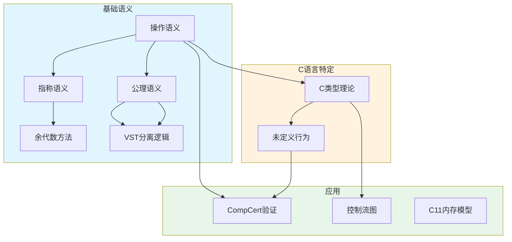

# 00 Core Semantics Foundations - 核心语义基础

> **难度**: L5-L6 | **预估学习时间**: 40-50小时
> **对应标准**: ISO C标准形式化、CompCert Clight语义
>
> **定位**: 本模块为形式语义与物理实现模块(02)的基础层，提供理解高级语义概念所需的核心理论框架。

---

## 🔗 文档关联

### 前置知识

| 文档 | 关系类型 | 说明 |
|:-----|:---------|:-----|
| [C类型系统](../01_Core_Knowledge_System/01_Basic_Layer/02_Data_Type_System.md) | 基础依赖 | C类型理论形式化基础 |
| [未定义行为](../01_Core_Knowledge_System/02_Core_Layer/02_Memory_Management.md) | 实践关联 | UB的形式化定义 |
| [逻辑基础](../../05_Deep_Structure_MetaPhysics/01_Mathematical_Foundations/01_Logic_Systems.md) | 数学基础 | 数理逻辑、集合论 |

### 后续延伸

| 文档 | 关系类型 | 说明 |
|:-----|:---------|:-----|
| [C11内存模型](../01_Game_Semantics/02_C11_Memory_Model.md) | 并发语义 | 并发操作语义 |
| [CompCert验证](../11_CompCert_Verification/readme.md) | 验证应用 | 编译器形式化验证 |
| [Frama-C/WP](../11_CompCert_Verification/06_WP_Tutorial.md) | 工具应用 | 程序验证工具 |

### 三大语义范式

| 文档 | 范式 | 应用场景 |
|:-----|:-----|:---------|
| [操作语义](01_Operational_Semantics.md) | 小步骤/大步骤 | 解释器实现、类型系统 |
| [指称语义](02_Denotational_Semantics.md) | 数学函数 | 编译器验证、程序分析 |
| [公理语义](03_Axiomatic_Semantics_Hoare.md) | Hoare逻辑 | 程序验证、正确性证明 |

---

## 模块概述

形式语义学通过数学方法精确定义程序的含义。
本模块涵盖三大经典语义范式——操作语义、指称语义、公理语义——以及C语言特定的类型理论和未定义行为边界定义。

### 为什么需要形式语义

```c
// 自然语言规范的问题：这段代码的语义是什么？
int x = INT_MAX;
x = x + 1;  // C标准：undefined behavior
            // 实际结果：取决于编译器和优化级别
            // 形式语义：精确定义为"错误状态"或"任意结果"
```

形式语义提供：

1. **消除歧义**: 机器可验证的精确定义
2. **程序验证**: 数学证明程序正确性
3. **编译器验证**: 证明优化保持语义
4. **安全保证**: 识别所有未定义行为路径

---

## 文档目录

| 文档 | 主题 | 难度 | 核心内容 | 代码行数 |
|:-----|:-----|:----:|:---------|:--------:|
| [01_Operational_Semantics](./01_Operational_Semantics.md) | 操作语义基础 | L5 | 小步骤/大步骤语义、CompCert Clight语义 | 438 |
| [02_Denotational_Semantics](./02_Denotational_Semantics.md) | 指称语义基础 | L6 | 完全偏序、不动点、连续函数 | 382 |
| [03_Axiomatic_Semantics_Hoare](./03_Axiomatic_Semantics_Hoare.md) | 公理语义与Hoare逻辑 | L5 | 推理规则、循环不变式、最弱前置条件 | 456 |
| [04_C_Type_Theory](./04_C_Type_Theory.md) | C类型理论形式化 | L6 | 类型判断、类型转换、严格别名 | 524 |
| [05_Undefined_Behavior_Semantics](./05_Undefined_Behavior_Semantics.md) | 未定义行为语义边界 | L6 | UB分类、形式化模型、安全防护 | 468 |

---

## 知识依赖图



---

## 核心概念速查

### 1. 操作语义 (Operational Semantics)

**小步骤语义**: 定义单步转换 $\langle e, \sigma \rangle \rightarrow \langle e', \sigma' \rangle$

**大步骤语义**: 定义求值结果 $\langle e, \sigma \rangle \Downarrow v$

**应用**: 实现解释器、证明类型安全、分析并发交错

### 2. 指称语义 (Denotational Semantics)

**核心**: 程序映射到数学函数 $\mathcal{C}S : \Sigma \to \Sigma_\bot$

**关键**: 使用不动点处理递归/循环

**应用**: 编译器优化、程序等价证明、抽象解释

### 3. 公理语义 (Axiomatic Semantics)

**Hoare三元组**: $\{P\} S \{Q\}$ - 前置/后置条件

**推理规则**: 从简单语句构建复杂证明

**应用**: 形式化验证、静态分析、合约式编程

### 4. 类型理论 (Type Theory)

**类型判断**: $\Gamma \vdash e : \tau$

**关键属性**: 类型保持性、进展定理

**C特有**: 严格别名规则、不完整类型、类型双关

### 5. 未定义行为 (Undefined Behavior)

**本质**: C标准不施加任何要求的行为

**影响**: 编译器可假设UB永不发生，进行激进优化

**防护**: UBSan、ASan、形式化验证、安全子集

---

## 与CompCert的关联

CompCert验证编译器使用**小步骤操作语义**作为核心形式化基础：

```text
源代码 (C)
    ↓
Clight (CompCert IR) ← 本模块的操作语义理论
    ↓
C#minor → Cminor → ... → 汇编
    ↑
每一步编译都证明语义保持
```

**关键定理**:

- 前向模拟: 源程序每步对应目标程序多步
- 语义保持: 源程序无UB则目标程序无UB
- 确定性: 源程序确定则目标程序确定

---

## 学习路径建议

### 路径A: 验证实践导向

```text
01_Operational_Semantics → 03_Axiomatic_Semantics_Hoare →
05_Undefined_Behavior_Semantics → [VST分离逻辑实战](../11_CompCert_Verification/02_VST_Separation_Logic_Practical.md)
```

### 路径B: 理论深度导向

```text
01_Operational_Semantics → 02_Denotational_Semantics →
04_C_Type_Theory → [博弈语义](../01_Game_Semantics/01_Game_Semantics_Theory.md)
```

### 路径C: 安全关键系统

```text
04_C_Type_Theory → 05_Undefined_Behavior_Semantics →
03_Axiomatic_Semantics_Hoare → [Frama-C集成](../11_CompCert_Verification/04_Frama_C_Integration.md)
```

---

## 参考资源

### 经典教材

1. **Winskel, G.** (1993). *The Formal Semantics of Programming Languages*. MIT Press.
   - 操作语义、指称语义、公理语义的系统介绍

2. **Pierce, B.C.** (2002). *Types and Programming Languages*. MIT Press.
   - 类型理论的标准参考书

3. **Nipkow, T. & Klein, G.** (2014). *Concrete Semantics*. Springer.
   - Isabelle/HOL实现的语义教材

### CompCert相关

1. **Leroy, X.** (2009). "Formal verification of a realistic compiler". *CACM*.
2. **Appel, A.W.** (2011). *Verified Functional Algorithms*.
3. **VST Documentation**: <https://vst.cs.princeton.edu/>

### 在线资源

1. **Software Foundations (Vol 2)**: Programming Language Foundations
2. **Certified Programming with Dependent Types** (CPDT)
3. **C11 Memory Model**: <https://www.cl.cam.ac.uk/~pes20/cpp/>

---

## 关联模块

| 模块 | 路径 | 关系 |
|:-----|:-----|:-----|
| 博弈语义 | [../01_Game_Semantics/readme.md](../01_Game_Semantics/readme.md) | 高级语义理论 |
| 余代数方法 | [../02_Coalgebraic_Methods/readme.md](../02_Coalgebraic_Methods/readme.md) | 无限行为形式化 |
| CompCert验证 | [../11_CompCert_Verification/readme.md](../11_CompCert_Verification/readme.md) | 应用验证 |
| C11内存模型 | [../01_Game_Semantics/02_C11_Memory_Model.md](../01_Game_Semantics/02_C11_Memory_Model.md) | 并发语义 |

---

## 更新日志

- **2026-03-14**: 创建核心语义基础模块，包含操作/指称/公理三大语义支柱
- **新增**: C类型理论形式化文档
- **新增**: 未定义行为语义边界文档
- **对齐**: C23标准、CompCert 3.14

---

> **最后更新**: 2026-03-14 | 形式语义基础模块初始化


---

## 深入理解

### 核心概念

本主题的核心概念包括：基础理论、实现机制、实际应用。

### 实践应用

- 应用场景1
- 应用场景2
- 应用场景3

### 学习建议

1. 先理解基础概念
2. 再进行实践练习
3. 最后深入源码

---

> **最后更新**: 2026-03-21
> **维护者**: AI Code Review
