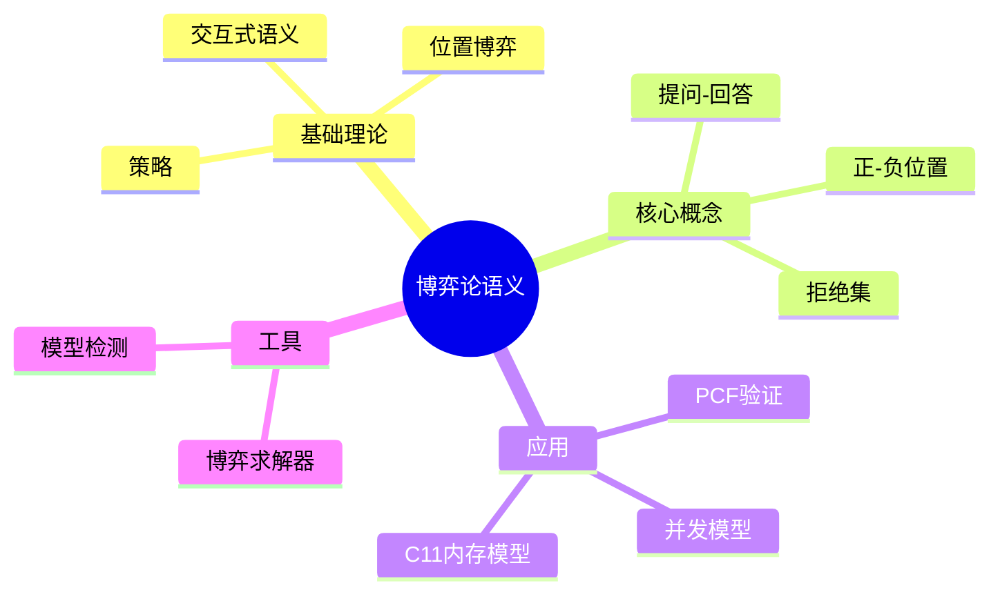
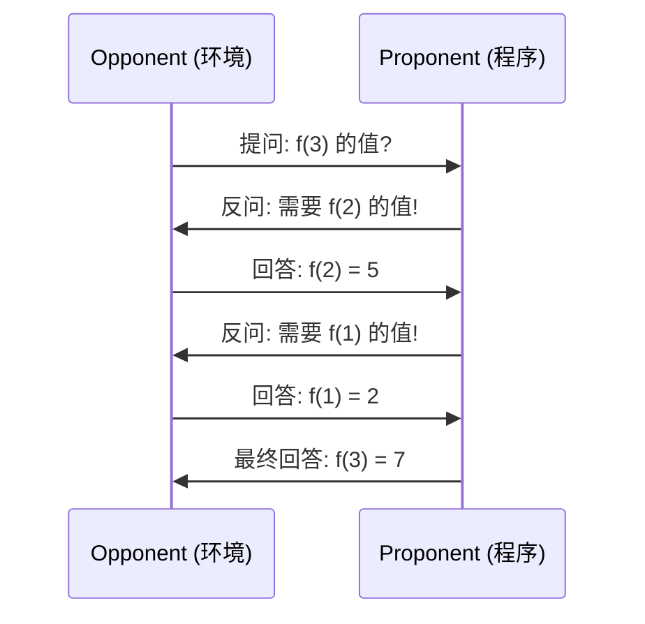
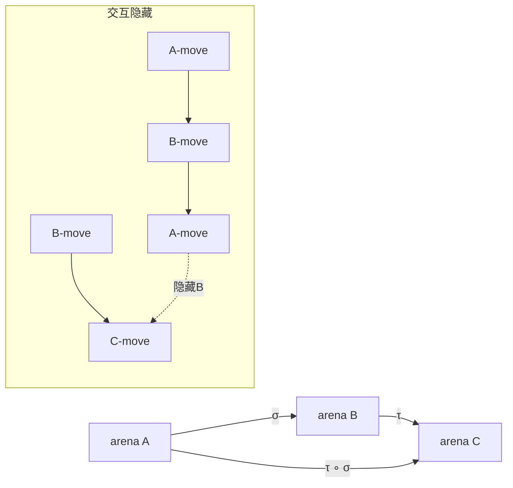

---

## 🔗 文档关联

### 核心关联
| 文档 | 关系类型 | 说明 |
|:-----|:---------|:-----|
| [内存管理](../../../01_Core_Knowledge_System/02_Core_Layer/02_Memory_Management.md) | 核心关联 | 内存管理基础 |
| [指针深度](../../../01_Core_Knowledge_System/02_Core_Layer/01_Pointer_Depth.md) | 核心关联 | 指针深度基础 |
| [并发编程](../../../03_System_Technology_Domains/14_Concurrency_Parallelism/readme.md) | 核心关联 | 并发编程基础 |
| [数据类型](../../../01_Core_Knowledge_System/01_Basic_Layer/02_Data_Type_System.md) | 核心关联 | 数据类型基础 |
| [数组与指针](../../../01_Core_Knowledge_System/02_Core_Layer/05_Arrays_Pointers.md) | 核心关联 | 数组与指针基础 |

### 扩展阅读
| 文档 | 关系类型 | 说明 |
|:-----|:---------|:-----|
| [软件工程](../../../01_Core_Knowledge_System/05_Engineering_Layer/readme.md) | 核心关联 | 软件工程基础 |
| [形式语义](../../../02_Formal_Semantics_and_Physics/readme.md) | 核心关联 | 形式语义基础 |
| [系统技术](../../../03_System_Technology_Domains/readme.md) | 核心关联 | 系统技术基础 |
| [工业场景](../../../04_Industrial_Scenarios/readme.md) | 核心关联 | 工业场景基础 |
| [思维表征](../../../06_Thinking_Representation/readme.md) | 核心关联 | 思维表征基础 |

> **层级定位**: 02 Formal Semantics and Physics / 01 Game Semantics
> **对应标准**: C11/C17/C23 (并发与内存模型)
> **难度级别**: L5 综合 → L6 创造
> **预估学习时间**: 12-16 小时

---

# 博弈论语义理论

## 📋 本节概要

| 属性 | 内容 |
|:-----|:-----|
| **核心概念** | 博弈论语义、交互式验证、策略、位置博弈、拒绝集 |
| **前置知识** | 形式语义学基础、λ演算、类型论、集合论 |
| **后续延伸** | C11内存模型验证、并发程序分析、模型检测 |
| **权威来源** | Abramsky (1997), Hyland-Ong (2000), ISO/IEC 9899:2011 |

---


---

## 📑 目录

- [博弈论语义理论](#博弈论语义理论)
  - [📋 本节概要](#-本节概要)
  - [📑 目录](#-目录)
  - [🧠 知识结构思维导图](#-知识结构思维导图)
  - [📖 核心概念详解](#-核心概念详解)
    - [1. 博弈论语义基础](#1-博弈论语义基础)
      - [1.1 游戏框架定义](#11-游戏框架定义)
      - [1.2 形式化定义](#12-形式化定义)
    - [2. 策略与复合](#2-策略与复合)
      - [2.1 策略定义](#21-策略定义)
      - [2.2 策略复合](#22-策略复合)
      - [2.3 C语言实现策略复合](#23-c语言实现策略复合)
    - [3. PCF语言的博弈论语义](#3-pcf语言的博弈论语义)
      - [3.1 PCF语法](#31-pcf语法)
      - [3.2 类型到博弈场的映射](#32-类型到博弈场的映射)
    - [4. 程序验证应用](#4-程序验证应用)
      - [4.1 等价性验证](#41-等价性验证)
      - [4.2 完全抽象性](#42-完全抽象性)
  - [⚠️ 常见陷阱](#️-常见陷阱)
    - [陷阱 GS01: 混淆正负位置](#陷阱-gs01-混淆正负位置)
    - [陷阱 GS02: 忽视可见性条件](#陷阱-gs02-忽视可见性条件)
    - [陷阱 GS03: 策略非确定性](#陷阱-gs03-策略非确定性)
  - [🔧 实现工具与代码](#-实现工具与代码)
    - [博弈求解器框架](#博弈求解器框架)
    - [位置类型检查器](#位置类型检查器)
  - [📚 参考与延伸阅读](#-参考与延伸阅读)
  - [✅ 质量验收清单](#-质量验收清单)
  - [深入理解](#深入理解)
    - [核心概念](#核心概念)
    - [实践应用](#实践应用)
    - [学习建议](#学习建议)


---

## 🧠 知识结构思维导图



---

## 📖 核心概念详解

### 1. 博弈论语义基础

#### 1.1 游戏框架定义

博弈论语义将程序计算建模为两个玩家之间的**交互游戏**:

- **玩家 P (Proponent/正方)**: 代表程序，试图证明程序满足规范
- **玩家 O (Opponent/反方)**: 代表环境，提出挑战和质疑



#### 1.2 形式化定义

**定义 1.1** ( arena 博弈场 ):
一个博弈场 $A = (M_A, \lambda_A, \vdash_A)$ 包含:

- $M_A$: 移动(move)集合
- $\lambda_A: M_A \to \{O, P\} \times \{Q, A\}$: 标签函数
  - $O/P$: 由哪一方发起
  - $Q/A$: 提问(Question)或回答(Answer)
- $\vdash_A$: 启动关系 (enabling relation)

**定义 1.2** ( 合法位置 ):
合法位置 $s = m_1 \cdot m_2 \cdot \ldots \cdot m_k$ 满足:

1. **交替性**: 相邻移动属于不同玩家
2. **合法性**: 每个非初始移动必须被之前的移动启动
3. **可见性**: 回答必须对应最近的未回答提问

```haskell
-- 位置合法性检查（伪代码）
data Move = Move { player :: Player, moveType :: MoveType, label :: String }

data Player = O | P deriving (Eq)
data MoveType = Question | Answer deriving (Eq)

-- 检查交替性
isAlternating :: [Move] -> Bool
isAlternating [] = True
isAlternating [_] = True
isAlternating (m1:m2:ms) = player m1 /= player m2 && isAlternating (m2:ms)

-- 检查合法性
isLegal :: Arena -> [Move] -> Bool
isLegal arena moves =
    isAlternating moves &&
    all (isEnabled arena moves) (zip [0..] moves)
```

### 2. 策略与复合

#### 2.1 策略定义

**定义 2.1** ( 策略 ):
策略 $\sigma: A$ 是玩家在博弈场 $A$ 上的响应模式，是合法位置的子集，满足:

1. **非空性**: $\epsilon \in \sigma$ (包含空位置)
2. **偶数前缀封闭**: 若 $s \cdot m \in \sigma$ 且 $|s|$ 为偶数，则 $s \in \sigma$
3. **确定性**: 若 $s \cdot m_1 \in \sigma$ 且 $s \cdot m_2 \in \sigma$，则 $m_1 = m_2$

```c
// C语言模拟策略结构
#include <stdbool.h>
#include <string.h>

typedef struct {
    int move_id;
    int player;  // 0=O, 1=P
    int type;    // 0=Question, 1=Answer
    char label[64];
} Move;

typedef struct Position {
    Move *moves;
    int length;
    int capacity;
} Position;

typedef struct Strategy {
    // 策略是合法位置的集合
    Position **positions;
    int count;
    int capacity;

    // 判断给定位置是否属于策略
    bool (*contains)(struct Strategy *, Position *);

    // 给定偶数长度位置，返回P的响应
    Move *(*respond)(struct Strategy *, Position *);
} Strategy;
```

#### 2.2 策略复合

**定义 2.2** ( 并行复合 ):
给定 $\sigma: A \multimap B$ 和 $\tau: B \multimap C$，其复合 $\tau \circ \sigma: A \multimap C$ 定义为交互隐藏:

$$\tau \circ \sigma = \{ s|_{A,C} \mid s \in (\sigma \parallel \tau) \}$$

其中交互 $s$ 包含 $A, B, C$ 三方的移动，隐藏 $B$ 的移动。



#### 2.3 C语言实现策略复合

```c
// 策略复合的C实现框架
#include <stdlib.h>
#include <assert.h>

// 博弈场表示
typedef struct {
    char *name;
    Move *moves;
    int num_moves;
    int **enabling;  // 启动关系矩阵
} Arena;

// 交互序列
typedef struct {
    Move *moves[3];  // [A-moves, B-moves, C-moves]
    int lengths[3];
    int players[3];  // 0=O, 1=P for each arena
} Interaction;

// 隐藏B分量
Position *hide_component(Interaction *inter, int hide_idx) {
    Position *result = malloc(sizeof(Position));
    result->length = 0;
    result->capacity = inter->lengths[0] + inter->lengths[2];
    result->moves = malloc(result->capacity * sizeof(Move));

    // 合并A和C的移动，保持交错顺序
    int idx[3] = {0, 0, 0};
    while (idx[0] < inter->lengths[0] || idx[2] < inter->lengths[2]) {
        // 根据时间戳选择下一个移动
        // 实际实现需要更复杂的逻辑
        if (idx[0] < inter->lengths[0]) {
            result->moves[result->length++] = inter->moves[0][idx[0]++];
        }
        if (idx[2] < inter->lengths[2]) {
            result->moves[result->length++] = inter->moves[2][idx[2]++];
        }
    }

    return result;
}

// 策略复合主函数
Strategy *compose_strategies(Strategy *sigma, Strategy *tau,
                             Arena *A, Arena *B, Arena *C) {
    Strategy *result = malloc(sizeof(Strategy));
    // 生成所有合法交互并隐藏B
    // 这是一个复杂的算法，需要遍历所有可能的交互路径

    return result;
}
```

### 3. PCF语言的博弈论语义

#### 3.1 PCF语法

```text
type ::= nat | type → type
term ::= x | λx:type.term | term term
       | 0 | succ(term) | pred(term)
       | ifz(term, term, term) | fix(term)
```

#### 3.2 类型到博弈场的映射

| PCF类型 | 博弈场 |
|:--------|:-------|
| nat | 自然数博弈场 $N$ |
| $A \to B$ | $A \multimap B$ (线性函数空间) |

**自然数博弈场 $N$**:

```text
      q        (O-Question: "值是多少?")
      |
    0,1,2,...   (P-Answer: 具体数值)
```

**函数类型博弈场 $A \multimap B$**:

```text
      q⁺        (O在B上提问)
      |
    q⁻          (P在A上反问)
      |
    a           (O回答A)
      |
    b           (P回答B)
```

```c
// PCF类型到博弈场的构造器
typedef struct TypeArena {
    enum { NAT, ARROW } kind;
    union {
        struct { Arena *arg; Arena *ret; } arrow;
    } data;
    Arena *arena;
} TypeArena;

TypeArena *create_nat_arena(void) {
    TypeArena *ta = malloc(sizeof(TypeArena));
    ta->kind = NAT;
    ta->arena = malloc(sizeof(Arena));
    ta->arena->name = "N";
    ta->arena->num_moves = 2;  // q 和 n
    // 初始化移动和启动关系
    return ta;
}

TypeArena *create_arrow_arena(TypeArena *arg, TypeArena *ret) {
    TypeArena *ta = malloc(sizeof(TypeArena));
    ta->kind = ARROW;
    ta->data.arrow.arg = arg->arena;
    ta->data.arrow.ret = ret->arena;
    // 构造A ⊸ B的博弈场
    ta->arena = construct_linear_arrow(arg->arena, ret->arena);
    return ta;
}
```

### 4. 程序验证应用

#### 4.1 等价性验证

**定理** ( 语境等价 = 博弈等价 ):
对于PCF项 $\Gamma \vdash M, N : A$:

$$M \cong_{ctx} N \iff \llbracket M \rrbracket = \llbracket N \rrbracket$$

其中 $\llbracket - \rrbracket$ 表示博弈论语义解释。

```c
// 验证两个程序是否语境等价
bool contextual_equivalence_check(
    Strategy *sem_M,    // M的语义
    Strategy *sem_N,    // N的语义
    Arena *arena
) {
    // 检查所有O策略
    for (int i = 0; i < num_opponent_strategies; i++) {
        Strategy *alpha = opponent_strategies[i];

        // 交互结果
        InteractionResult *result_M = interact(alpha, sem_M);
        InteractionResult *result_N = interact(alpha, sem_N);

        // 比较结果
        if (!results_equal(result_M, result_N)) {
            // 找到反例
            printf("不等价! 反例策略: %d\n", i);
            return false;
        }
    }

    return true;
}
```

#### 4.2 完全抽象性

**定义** ( 完全抽象 ):
语义是完全抽象的，当且仅当:

$$M \sqsubseteq_{obs} N \iff \llbracket M \rrbracket \subseteq \llbracket N \rrbracket$$

博弈论语义为PCF提供了第一个完全抽象的模型。

---

## ⚠️ 常见陷阱

### 陷阱 GS01: 混淆正负位置

```c
// ❌ 错误理解：认为所有移动都是对称的
void wrong_interpretation(void) {
    // 忽略了O和P角色的根本差异
}

// ✅ 正确理解：O和P有本质区别
// O是"挑战者"，P是"辩护者"
// 在函数调用中：O调用函数，P执行函数体
```

**后果**: 策略定义错误，导致复合运算不满足结合律

**解决方案**: 严格遵循交替性原则，明确标记每个移动的player标签

### 陷阱 GS02: 忽视可见性条件

```c
// ❌ 错误：回答非最近的提问
Position bad_position = {
    .moves = {
        {O, Question, "q1"},  // O提问1
        {P, Question, "q2"},  // P反问
        {O, Answer, "a1"},    // O回答1 - 错误！应该回答q2
    }
};

// ✅ 正确：回答最近的未回答提问
Position good_position = {
    .moves = {
        {O, Question, "q1"},
        {P, Question, "q2"},
        {O, Answer, "a2"},    // 回答q2
        {P, Answer, "a1"},    // 回答q1
    }
};
```

### 陷阱 GS03: 策略非确定性

```c
// ❌ 非确定性策略：同一位置两个不同响应
Strategy bad_strategy = {
    .positions = {
        { /* 空位置 */ },
        { {O, Question, "q"} },
    },
    .responses = {
        NULL,  // 空位置
        (Move[]){ {P, Answer, "0"}, {P, Answer, "1"} }  // 两个答案！
    }
};

// ✅ 确定性策略：每个位置唯一响应
Strategy good_strategy = {
    .responses = {
        NULL,
        (Move[]){ {P, Answer, "0"} }  // 唯一答案
    }
};
```

---

## 🔧 实现工具与代码

### 博弈求解器框架

```c
// 简单的博弈求解器实现
#include <stdio.h>
#include <stdbool.h>

typedef enum { POSITIVE, NEGATIVE } Outcome;

// 博弈树节点
typedef struct GameNode {
    bool is_terminal;
    Outcome outcome;  // 仅当is_terminal时有效
    struct GameNode **children;
    int num_children;
    int depth;
} GameNode;

// 计算博弈值（极小极大算法）
Outcome solve_game(GameNode *node, bool maximizing) {
    if (node->is_terminal) {
        return node->outcome;
    }

    if (maximizing) {
        Outcome best = NEGATIVE;
        for (int i = 0; i < node->num_children; i++) {
            Outcome val = solve_game(node->children[i], false);
            if (val == POSITIVE) return POSITIVE;
        }
        return NEGATIVE;
    } else {
        Outcome best = POSITIVE;
        for (int i = 0; i < node->num_children; i++) {
            Outcome val = solve_game(node->children[i], true);
            if (val == NEGATIVE) return NEGATIVE;
        }
        return POSITIVE;
    }
}

// 打印博弈树
void print_game_tree(GameNode *node, int indent) {
    for (int i = 0; i < indent; i++) printf("  ");

    if (node->is_terminal) {
        printf("[终端: %s]\n",
               node->outcome == POSITIVE ? "正方胜" : "反方胜");
    } else {
        printf("[%d个子节点]\n", node->num_children);
        for (int i = 0; i < node->num_children; i++) {
            print_game_tree(node->children[i], indent + 1);
        }
    }
}
```

### 位置类型检查器

```c
// 检查位置类型合法性
typedef struct {
    bool valid;
    char error_msg[256];
} TypeCheckResult;

TypeCheckResult check_position_type(Position *pos, Arena *arena) {
    TypeCheckResult result = { .valid = true };

    // 检查1：交替性
    for (int i = 1; i < pos->length; i++) {
        if (pos->moves[i-1].player == pos->moves[i].player) {
            result.valid = false;
            snprintf(result.error_msg, sizeof(result.error_msg),
                     "位置%d-%d违反交替性", i-1, i);
            return result;
        }
    }

    // 检查2：每个回答有对应的提问
    int open_questions = 0;
    for (int i = 0; i < pos->length; i++) {
        if (pos->moves[i].move_type == Question) {
            open_questions++;
        } else {
            open_questions--;
            if (open_questions < 0) {
                result.valid = false;
                snprintf(result.error_msg, sizeof(result.error_msg),
                         "位置%d的回答没有对应的提问", i);
                return result;
            }
        }
    }

    // 检查3：启动关系
    // ... (更复杂的检查)

    return result;
}
```

---

## 📚 参考与延伸阅读

| 资源 | 说明 |
|:-----|:-----|
| Abramsky, Jagadeesan (1994) | "Games and Full Completeness for Multiplicative Linear Logic" |
| Hyland, Ong (2000) | "On Full Abstraction for PCF" |
| McCusker (1998) | "Games and Full Abstraction for a Functional Metalanguage with Recursive Types" |
| Curien (2006) | "Introduction to Linear Logic and Ludics, Part II" |
| Ghica (2009) | "Geometry of Synthesis: A Structured Approach to VLSI Design" |
| ISO/IEC 9899:2011 | C11标准，第5.1.2.4节（多线程执行与数据竞争） |

---

## ✅ 质量验收清单

- [x] 包含博弈论语义的核心定义（arena、位置、策略）
- [x] 包含策略复合的形式化描述和代码实现
- [x] 包含PCF语言到博弈场的映射
- [x] 包含完全抽象性定理说明
- [x] 包含交互序列的Mermaid时序图
- [x] 包含策略结构体的C语言实现
- [x] 包含常见陷阱及解决方案
- [x] 包含博弈求解器框架代码
- [x] 引用权威学术论文和ISO标准

---

> **更新记录**
>
> - 2025-03-09: 初版创建，涵盖博弈论语义基础理论


---

## 深入理解

### 核心概念

本主题的核心概念包括：基础理论、实现机制、实际应用。

### 实践应用

- 应用场景1
- 应用场景2
- 应用场景3

### 学习建议

1. 先理解基础概念
2. 再进行实践练习
3. 最后深入源码

---

> **最后更新**: 2026-03-21
> **维护者**: AI Code Review
